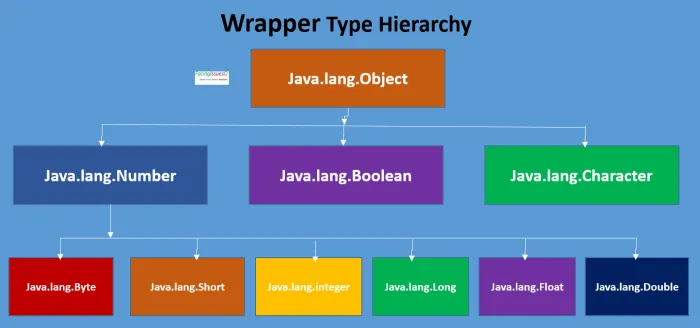
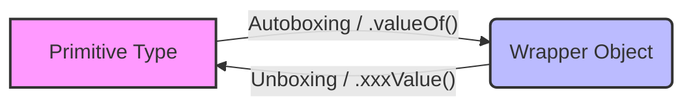
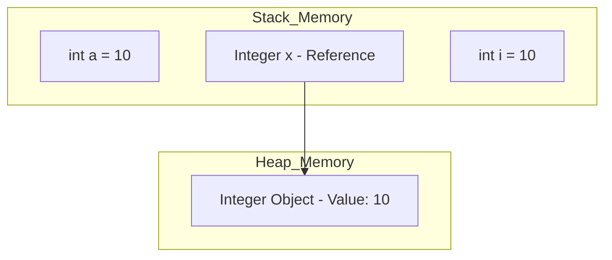
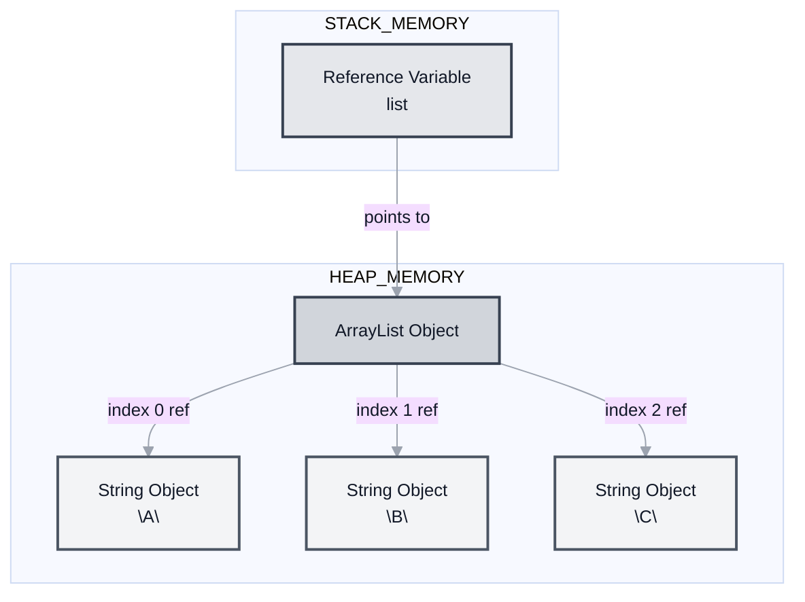
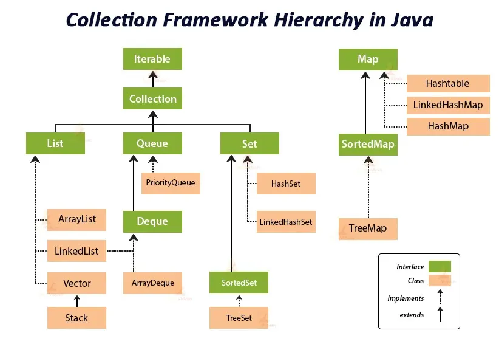
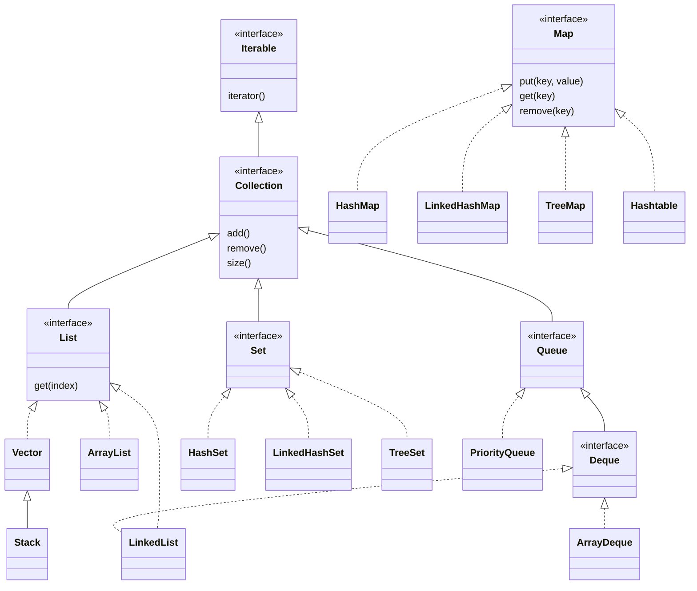
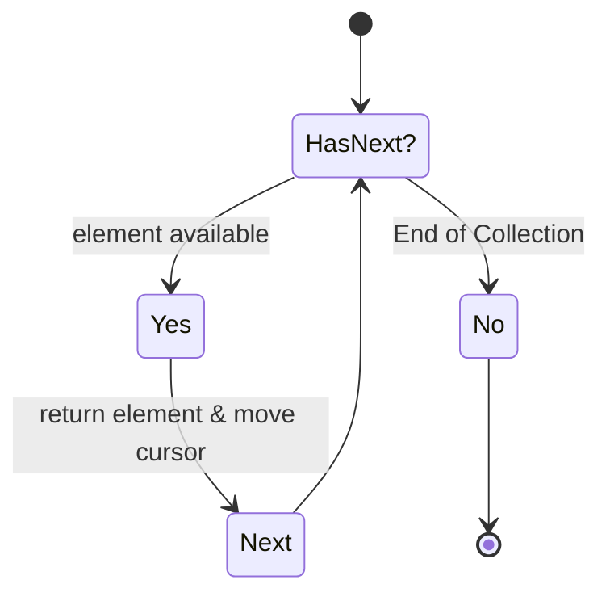
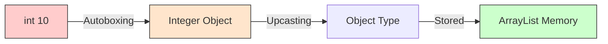
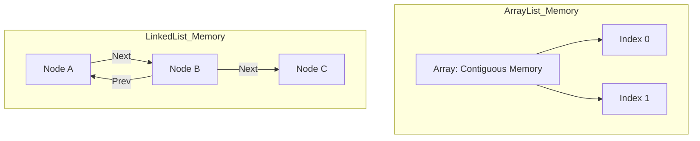

# ☕ Master Guide: Java Wrapper Classes & Collections

<div align="center">


</div>

<hr style="border: 1px solid rgb(98, 117, 187)">

<div align="center">
<table>
<tr>
<td align="center">
<br />

<h3>© 2025 Avinash Dhanuka</h3>
<p>Master Guide: Java Core & Frameworks</p>
<p><em>Crafted with ❤️ for Object-Oriented Architecture</em></p>

<a href="https://mail.google.com/mail/?view=cm&fs=1&to=avunashdhanuka@gmail.com&su=Java%20Wrapper%20%26%20Collection%20Query&body=☕%20Hello%20Avinash,%0D%0A%0D%0AMy%20name%20is%20[Your%20Name]%20and%20I%20have%20a%20doubt%20regarding%20Java%20Internals.%0D%0A%0D%0A🔹%20Topic:%20[Autoboxing/ArrayList]%0D%0A🔹%20Question:%20[Type%20your%20question]%0D%0A%0D%0AThank%20you!" target="_blank">


</a>
<br />
<br />
</td>
</tr>
</table>
</div>

> **Author's Note:** This guide bridges the gap between Primitive Data Types and the Object-Oriented Collection Framework, explaining exactly how Java handles data storage internally.

---

## 📑 Table of Contents
1.  [Wrapper Classes (The Bridge)](#1-wrapper-classes-the-bridge)
    -   [Autoboxing vs Unboxing](#11-boxing--unboxing-mechanism)
    -   [Internal Execution Flow](#12-internal-execution-architecture)
2.  [The Collection Framework](#2-the-collection-framework)
    -   [Hierarchy Architecture](#21-hierarchy-diagram)
3.  [The Collection Interface](#3-collection-interface)
4.  [The List Interface (Deep Dive)](#4-the-list-interface)
    -   [Internal Logic of add()](#41-internal-logic-of-add-method)
    -   [List Methods & Signatures](#42-list-methods--signatures)
5.  [Top Interview Questions](#5-top-interview-questions-java-edition)


---
## 1. WRAPPER CLASSES (THE BRIDGE)

### 📌 Definition
A **Wrapper Class** is a class whose object contains or "wraps" a primitive data type. They allow primitive data types (like `int`, `char`, `double`) to be used as Objects.

### 🏗️ Why do we need them?
1.  **Collection Framework:** Java Collections (`ArrayList`, `HashMap`) store **Objects** only. They cannot store primitives.
2.  **Null Support:** Primitives cannot be `null`. Wrapper classes can be `null` (useful for database/web responses).
3.  **Utility Methods:** Wrappers provide methods like `Integer.parseInt()`, `Double.valueOf()`.
4.  **Synchronization:** Objects are needed for locking in multi-threading.

---

### 📊 Primitive vs Wrapper Mapping

| Primitive Type | Wrapper Class | Size | Example (Boxing) |
| :--- | :--- | :--- | :--- |
| `byte` | **Byte** | 8-bit | `Byte bObj = 120;` |
| `short` | **Short** | 16-bit | `Short sObj = 1000;` |
| `int` | **Integer** | 32-bit | `Integer iObj = 45000;` |
| `long` | **Long** | 64-bit | `Long lObj = 99999L;` |
| `float` | **Float** | 32-bit | `Float fObj = 12.5f;` |
| `double` | **Double** | 64-bit | `Double dObj = 99.99;` |
| `char` | **Character** | 16-bit | `Character cObj = 'A';` |
| `boolean` | **Boolean** | 1-bit | `Boolean boolObj = true;` |

**Visual Hierarchy:**


---

### 1.1 BOXING & UNBOXING MECHANISM

The process of converting between Primitives and Wrappers.



#### 1. Boxing (Primitive $\rightarrow$ Object)
*   **Implicit Boxing (Autoboxing):** The compiler automatically converts the primitive to the wrapper. (Introduced in Java 5).
    *   *Example:* `Integer val = 100;`
*   **Explicit Boxing:** Manually converting using `.valueOf()`.
    *   *Example:* `Integer val = Integer.valueOf(100);`

#### 2. Unboxing (Object $\rightarrow$ Primitive)
*   **Implicit Unboxing:** Assigning a wrapper object to a primitive variable.
    *   *Example:* `int num = val;`
*   **Explicit Unboxing:** Using methods like `.intValue()`, `.doubleValue()`.
    *   *Example:* `int num = val.intValue();`

---

### 1.2 INTERNAL EXECUTION ARCHITECTURE

Let's dissect the code for `Integer` (applies to all types).

```java
public static void intWrapper(){
    // 1. Primitive Assignment
    int a = 10; 

    // 2. Implicit Boxing (Autoboxing)
    // Internal: Integer.valueOf(a) is called by compiler
    Integer x = a; 
    System.out.println("Implicit: " + x);

    // 3. Explicit Boxing
    Integer y = Integer.valueOf(a);
    System.out.println("Explicit: " + y);

    // 4. Implicit Unboxing
    // Internal: x.intValue() is called by compiler
    int i = x; 
    System.out.println("Implicit Unbox: " + i);
    
    // 5. Explicit Unboxing
    int j = x.intValue();
    System.out.println("Explicit Unbox: " + j);
}
```

#### 🏭 Memory Execution Flow



1.  **`int a = 10`** $\rightarrow$ Stored directly in **Stack Memory** as a raw value.
2.  **`Integer x = a`** $\rightarrow$ The JVM checks the value. A new `Integer` Object containing `10` is created in **Heap Memory**. The reference `x` (stored in Stack) points to that Heap address.
3.  **`int i = x`** $\rightarrow$ The `intValue()` method is triggered; the value `10` is copied from the Heap object back into the Stack variable `i`.

---

### 🛠️ Examples of Each Data Type Utility

| Type | Useful Utility Method | Example |
| :--- | :--- | :--- |
| **Integer** | `parseInt(String)` | `int n = Integer.parseInt("123");` |
| **Double** | `parseDouble(String)` | `double d = Double.parseDouble("12.5");` |
| **Character** | `isDigit(char)` | `Character.isDigit('5'); // returns true` |
| **Boolean** | `parseBoolean(String)` | `Boolean.parseBoolean("true");` |
| **Byte** | `compare(byte, byte)` | `Byte.compare((byte)1, (byte)2);` |

> **💡 Pro Tip:** The static method `valueOf()` uses the **Integer Cache**. Java caches `Integer` objects for values in the range **-128 to 127**. If you create two Integers in this range using `valueOf()`, they will point to the exact same object in memory, saving space!

---


## 2. THE COLLECTION FRAMEWORK

### 📌 Definition
The **Collection Framework** is a unified architecture for representing and manipulating groups of objects. It provides:
1.  **Interfaces:** Abstract data types (`List`, `Set`, `Map`).
2.  **Implementations:** Concrete classes (`ArrayList`, `HashSet`).
3.  **Algorithms:** Searching and sorting logic (provided by the `java.util.Collections` utility class).

### 🏗️ Key Characteristics
*   **Root Interface:** `Collection` (which extends `Iterable`).
*   **Object Methods:** Classes in the hierarchy automatically override `toString()`, `hashCode()`, and `equals()`.
*   **Types:**
    *   **Generic:** `List<Integer>` (Type Safe - Recommended).
    *   **Non-Generic:** `List` (Stores any Object - Not Type Safe).

### ⚙️ Internal Execution & JVM Processing
How does the JVM handle these heavy structures?

1.  **Memory Storage (Heap vs. Stack):**
    *   The **Reference Variable** (e.g., `List<String> list`) is stored in the **Stack**.
    *   The **Collection Object** (e.g., `new ArrayList()`) is stored in the **Heap**.
    *   **Crucial:** Collections **do not** store objects physically inside them. They store **Memory References (Addresses)** to the actual objects which are scattered elsewhere in the Heap.

2.  **Type Erasure (Compile Time vs. Runtime):**
    *   JVM does not know about Generics (e.g., `<String>`) at runtime.
    *   **Compiler Action:** It converts `List<String>` to a raw `List` (of Objects) and inserts explicit type casts `(String)` wherever data is retrieved.
    *   *Result:* This ensures backward compatibility with older Java versions.

#### 🏭 JVM Memory Architecture for Collections



---

### 2.1 HIERARCHY DIAGRAM

**External Reference:** [View Detailed Java Collection Hierarchy Image]





---

### 2.2 CORE INTERFACES COMPARISON

| Interface | Ordering | Duplicates | Null Allowed? | Primary Use Case |
| :--- | :--- | :--- | :--- | :--- |
| **List** | Ordered (Indexed) | ✅ Yes | ✅ Yes | Access by index, dynamic arrays. |
| **Set** | Unordered* | ❌ No | ✅ Yes (1 null) | Unique items, mathematical sets. |
| **Queue** | FIFO (First-In-First-Out) | ✅ Yes | ❌ No* | Task scheduling, processing lines. |
| **Map** | Key-Value Pairs | ❌ Keys: No <br> ✅ Values: Yes | Keys: 1 null* | Dictionaries, lookups. |

*\*Note: Implementation dependent (e.g., TreeSet sorts elements, HashMap allows 1 null key).*

---


## 3. COLLECTION INTERFACE

The **Root Interface** for the entire framework (except Map).

*   **Role:** Represents a group of objects as a single unit.
*   **Polymorphism:** You cannot create an object of an Interface, but you can use it as a **Reference Variable**.
    *   ✅ `Collection c = new ArrayList();`
    *   ❌ `Collection c = new Collection();`

### 3.1 THE `ITERABLE` INTERFACE (The Parent)
Before `Collection`, there is `Iterable`.
*   **Location:** `java.lang.Iterable`
*   **Purpose:** Any class implementing this allows its objects to be target of the **Enhanced For-Loop** (for-each loop).
*   **Key Method:** `iterator()` which returns an `Iterator` object.

### 3.2 THE `ITERATOR` (The Cursor)
How does the JVM actually traverse a list? It uses the **Iterator Design Pattern**.
*   **Universal Cursor:** It can traverse List, Set, and Queue (but not Map directly).
*   **Safe Removal:** It is the only safe way to remove elements *during* iteration to avoid `ConcurrentModificationException`.



### 3.3 COMMON METHODS
Since all implementations (ArrayList, HashSet, etc.) extend `Collection`, they all share these standard methods:

| Method Type | Methods | Description |
| :--- | :--- | :--- |
| **Basic** | `add(E e)`, `addAll(Collection c)` | Adds elements. |
| **Removal** | `remove(Object o)`, `clear()` | Removes specific element or all elements. |
| **Inspection** | `size()`, `isEmpty()` | Checks count or if empty. |
| **Search** | `contains(Object o)` | Returns true if element exists. |
| **Conversion** | `toArray()` | Converts the collection to a primitive Array `[]`. |

---


## 4. THE LIST INTERFACE

**Definition:** An ordered collection (also known as a *sequence*). The user of this interface has precise control over where in the list each element is inserted.

### 📜 Characteristics of List
1.  **Insertion Order:** Preserved (Elements are stored in the order they are added).
2.  **Duplicates:** Allowed (Can store `10, 10, 20`).
3.  **Nulls:** Multiple `null` values are allowed.
4.  **Access:** Random access via **Index** (0 to size-1).
5.  **Heterogeneous:** Can store different types of objects (if non-generic).
6.  **Marker Interface:** Most Lists (like `ArrayList`) implement `RandomAccess` to indicate they support fast (O(1)) index-based retrieval.

---

### 4.1 INTERNAL LOGIC OF `add()` METHOD

What happens when you write `arr.add(10)`?

```java
List<Integer> arr = new ArrayList<>();
arr.add(10); 
```

**Step-by-Step Execution:**
1.  **Autoboxing:** The primitive `int 10` is converted to `Integer` object.
2.  **Upcasting:** The `ArrayList` internally stores data as `Object[]` array. The `Integer` is upcasted to `Object`.
3.  **Storage:** The object reference is placed at the next available index.



### ⚙️ JVM Internal Working (The `ArrayList` Case)
The JVM processes the `List` interface primarily through the `java.util.ArrayList` class.

1.  **The Backing Array:** Inside `ArrayList`, the JVM maintains a private array: `transient Object[] elementData`.
2.  **Capacity vs. Size:** 
    *   **Capacity:** The length of the `elementData` array (default is 10).
    *   **Size:** The number of elements actually present.
3.  **The Growth Logic (Dynamic Resizing):** 
    When `size == capacity`, the JVM executes the following inside the `grow()` method:
    *   `newCapacity = oldCapacity + (oldCapacity >> 1)` (Increases by **50%**).
    *   A new larger array is created.
    *   `System.arraycopy()` is called to move elements from the old array to the new one.

---

### 4.2 LIST METHODS & SIGNATURES

Common methods available in the `List` interface.

| Method Signature | Return Type | Description |
| :--- | :--- | :--- |
| **`add(Object obj)`** | `boolean` | Appends element to end of list. Returns true if successful. |
| **`add(int index, Object obj)`** | `void` | Inserts element at specific index. Shifts current elements to right. |
| **`addAll(Collection c)`** | `boolean` | Appends all elements of specified collection to the end. |
| **`size()`** | `int` | Returns number of elements. |
| **`get(int index)`** | `Object` | Returns element at specified position. |
| **`remove(int index)`** | `Object` | Removes element at index and returns the deleted element. |
| **`remove(Object o)`** | `boolean` | Removes the first occurrence of the specified element. |
| **`contains(Object o)`** | `boolean` | Returns true if list contains the element. |
| **`clear()`** | `void` | Removes all elements from the list. |
| **`iterator()`** | `Iterator` | Returns an iterator over the elements in sequence. |
| **`listIterator()`** | `ListIterator` | Returns a list iterator for bidirectional traversal. |

---

### 4.3 SUB-TOPICS: SPECIALIZED LIST FEATURES

#### 1. ListIterator (Bi-Directional Cursor)
Unlike the standard `Iterator` which only moves forward, `ListIterator` allows you to move in both directions.

| Method | Direction | Description |
| :--- | :--- | :--- |
| `hasNext()` / `next()` | Forward | Checks and moves to next element. |
| `hasPrevious()` / `previous()` | Backward | Checks and moves to previous element. |
| `nextIndex()` / `previousIndex()` | N/A | Returns the index of the element. |

#### 2. Comparison: ArrayList vs. LinkedList
The JVM handles these two implementations differently in memory:



| Feature | ArrayList | LinkedList |
| :--- | :--- | :--- |
| **Internal Data Structure** | Resizable Array | Doubly Linked List |
| **Manipulation** | Slow (requires shifting) | Fast (only pointer changes) |
| **Random Access** | Fast (O(1)) | Slow (O(n)) |
| **Memory Consumption** | Less (only data) | More (data + prev/next pointers) |

#### 3. Handling Nulls and Sorting
*   **Sorting:** Since `List` is ordered, you can sort it using `Collections.sort(listName)`. This internally uses **Merge Sort** or **TimSort**.
*   **Nulls:** While allowed, using `null` can lead to `NullPointerException` if you try to perform operations like `list.get(0).toString()`.

---

## 5. 🧠 TOP INTERVIEW QUESTIONS (JAVA EDITION)

#### Q1: Why is `main(String[] args)` static?
> **Answer:** So the JVM can invoke it without instantiating the class. If it weren't static, JVM would need to create an object, but it wouldn't know which constructor to use.

#### Q2: Can `ArrayList` store `int` (primitives)?
> **Answer:** **No.** Collections can only store Objects. However, due to **Autoboxing**, if we pass an `int`, Java automatically converts it to an `Integer` object before storing it.

#### Q3: Difference between `Array` and `ArrayList`?
> **Answer:**
> *   **Array:** Fixed size, holds primitives or objects, faster.
> *   **ArrayList:** Dynamic size, holds only objects, has built-in methods (`add`, `remove`).

#### Q4: What is the difference between `Collection` and `Collections`?
> **Answer:**
> *   **Collection:** An Interface (The root of the hierarchy).
> *   **Collections:** A Utility Class containing static methods (like `sort()`, `reverse()`) to operate on collections.

#### Q5: What happens if I perform `list.get(10)` on a list of size 5?
> **Answer:** It throws `IndexOutOfBoundsException`.

---
*Created for Advanced Java Architecture Learning.*
