# ☕ Master Guide: Java Iterators, Vector & Stack

<div align="center">


</div>

<hr style="border: 1px solid rgb(98, 117, 187)">

<div align="center">
<table>
<tr>
<td align="center">
<br />

<h3>© 2026 Avinash Dhanuka</h3>
<p>Master Guide: Java Core & Frameworks</p>
<p><em>Crafted with ❤️ for Object-Oriented Architecture</em></p>

<a href="https://github.com/Avinash-706" target="_blank">

</a>

<a href="https://mail.google.com/mail/?view=cm&fs=1&to=avunashdhanuka@gmail.com&su=Java%20Iterator%20%26%20Stack%20Query&body=☕%20Hello%20Avinash,%0D%0A%0D%0AMy%20name%20is%20[Your%20Name]%20and%20I%20have%20a%20doubt%20regarding%20Java%20Internals.%0D%0A%0D%0A🔹%20Topic:%20[Iterator/Stack]%0D%0A🔹%20Question:%20[Type%20your%20question]%0D%0A%0D%0AThank%20you!" target="_blank">


</a>
<br />
<br />
</td>
</tr>
</table>
</div>

> **Author's Note:** This guide explores advanced collection traversal mechanisms, legacy classes, and stack-based data structures in Java. Building upon Day 22's foundation, we dive deep into how Java internally manages iteration and LIFO operations.

---

## 📑 Table of Contents
1.  [Loop Mechanisms in Java](#1-loop-mechanisms-in-java)
    -   [for vs for-each Loop](#11-for-vs-for-each-loop)
2.  [Iterator Interface (The Cursor)](#2-iterator-interface-the-cursor)
    -   [Internal Working of Iterator](#21-internal-working-of-iterator)
    -   [Iterator Methods Deep Dive](#22-iterator-methods-deep-dive)
3.  [ListIterator Interface](#3-listiterator-interface)
    -   [Bidirectional Traversal](#31-bidirectional-traversal)
    -   [ListIterator vs Iterator](#32-listiterator-vs-iterator)
4.  [Vector Class (Legacy Collection)](#4-vector-class-legacy-collection)
    -   [Internal Architecture](#41-internal-architecture-of-vector)
    -   [Vector vs ArrayList](#42-vector-vs-arraylist)
5.  [Stack Class (LIFO Data Structure)](#5-stack-class-lifo-data-structure)
    -   [Stack Operations & Methods](#51-stack-operations--methods)
    -   [Internal Working of Stack](#52-internal-working-of-stack)
    -   [Real-World Application: Valid Parenthesis](#53-real-world-application-valid-parenthesis)
6.  [List Initialization Techniques](#6-list-initialization-techniques)
7.  [Practical Tips & Best Practices](#7-practical-tips--best-practices)
8.  [Top Interview Questions](#8-top-interview-questions-iterator--stack-edition)

<div align="right">
<sub><em>Comprehensive notes by Avinash Dhanuka | For educational purposes</em></sub>
</div>

---

## 1. LOOP MECHANISMS IN JAVA

### 📌 Why Do We Need Different Loop Types?
Before diving into Iterators, it's crucial to understand why Java provides multiple ways to traverse collections. Each loop mechanism serves different use cases based on:
1.  **Control Requirements:** Do you need index manipulation?
2.  **Direction:** Forward only or bidirectional?
3.  **Safety:** Can you modify the collection during traversal?

---

### 1.1 FOR VS FOR-EACH LOOP

#### 🏗️ Comparison Table

| Feature | Traditional `for` Loop | Enhanced `for-each` Loop |
| :--- | :--- | :--- |
| **Index Control** | ✅ Full control over index | ❌ No index access |
| **Direction** | ✅ Forward & Backward | ❌ Forward only |
| **Loop Counter Modification** | ✅ Can modify (`i++`, `i+=2`) | ❌ Fixed iteration |
| **Skip/Jump Elements** | ✅ Can skip (`i+=2`) | ❌ Cannot skip |
| **Syntax Complexity** | More verbose | Cleaner, simpler |
| **Use Case** | When you need index manipulation | When you just need elements |
| **Performance** | Slightly faster for arrays | Same for collections |


#### 📊 Visual Comparison

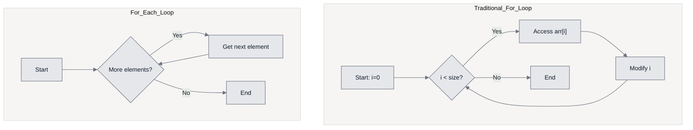

#### 💻 Code Examples

```java
List<Integer> list = Arrays.asList(10, 20, 30, 40, 50);

// Traditional for loop - Full Control
for(int i = 0; i < list.size(); i++) {
    System.out.println("Index " + i + ": " + list.get(i));
    // Can access index, skip elements, go backward
}

// For-each loop - Simple & Clean
for(Integer num : list) {
    System.out.println(num);
    // No index, cannot skip, forward only
}
```

#### ⚙️ Internal Execution (For-Each Loop)
When you write a for-each loop, the Java compiler internally converts it to use an **Iterator**:

```java
// What you write:
for(Integer num : list) {
    System.out.println(num);
}

// What compiler generates:
Iterator<Integer> it = list.iterator();
while(it.hasNext()) {
    Integer num = it.next();
    System.out.println(num);
}
```

> **💡 Key Insight:** The for-each loop is syntactic sugar for Iterator! This is why you cannot modify the collection during for-each iteration.

---

## 2. ITERATOR INTERFACE (THE CURSOR)

### 📌 Definition
**Iterator** is an interface in the `java.util` package that acts as a **universal cursor** for traversing collections. It provides a standard way to iterate through any Collection (List, Set, Queue) without exposing the underlying implementation.

### 🏗️ Why Do We Need Iterator?
1.  **Universal Traversal:** Works with all Collection types (ArrayList, HashSet, LinkedList, etc.)
2.  **Safe Removal:** Only safe way to remove elements during iteration
3.  **Abstraction:** Hides internal structure of the collection
4.  **Fail-Fast Behavior:** Detects concurrent modifications
5.  **Memory Efficient:** Doesn't create a copy of the collection

<div align="center">

<p><em>Iterator Design Pattern in Java Collections | © Avinash Dhanuka</em></p>
</div>

---
#### 🏭 Iterator Hierarchy

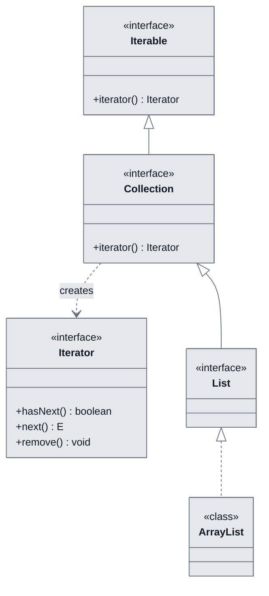

---

### 2.1 INTERNAL WORKING OF ITERATOR

#### 🔍 How Iterator Works Internally

When you call `list.iterator()`, the JVM creates an **Iterator object** that maintains:
1.  **Cursor Position:** Points to the current element
2.  **Last Returned Index:** Tracks the last element returned by `next()`
3.  **Expected Mod Count:** Detects concurrent modifications

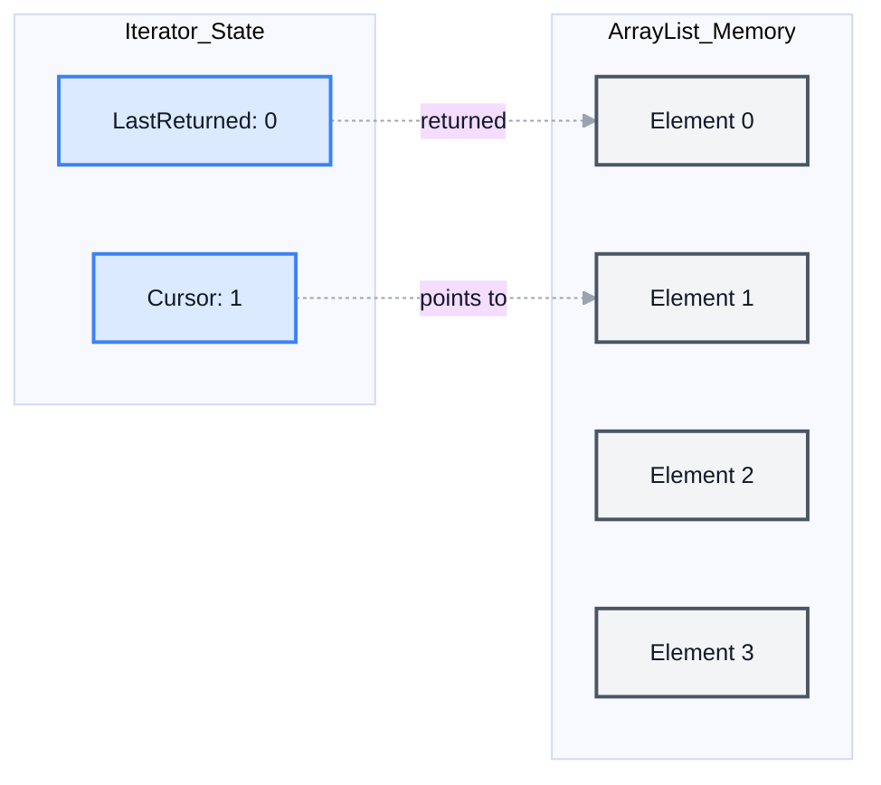

#### ⚙️ Step-by-Step Execution

```java
List<Integer> li = Arrays.asList(1, 2, 3, 4, 5);
Iterator<Integer> it = li.iterator();
```

**Memory State:**
1.  **Initial State:** Cursor = 0, LastReturned = -1
2.  **After `it.next()`:** Cursor = 1, LastReturned = 0, Returns element at index 0
3.  **After `it.remove()`:** Removes element at LastReturned (index 0), Cursor = 0, LastReturned = -1


---

### 2.2 ITERATOR METHODS DEEP DIVE

#### 📋 Method Signatures & Details

| Method | Return Type | Description | Throws |
| :--- | :--- | :--- | :--- |
| **`hasNext()`** | `boolean` | Checks if more elements exist | - |
| **`next()`** | `E` (Generic Type) | Returns next element & moves cursor | `NoSuchElementException` |
| **`remove()`** | `void` | Removes last returned element | `IllegalStateException` |

---

#### 1️⃣ hasNext() Method

**Purpose:** Checks whether the next element is present or not.

```java
public boolean hasNext() {
    return cursor != size;
}
```

**Internal Logic:**
- Compares the cursor position with the collection size
- Returns `true` if cursor < size
- Does NOT move the cursor

```java
Iterator<Integer> it = list.iterator();
System.out.println(it.hasNext()); // true (if list not empty)
```

---

#### 2️⃣ next() Method

**Purpose:** Returns the next object and moves the cursor forward.

**Return Type:** `Object` (or Generic Type `E`)

```java
public E next() {
    checkForComodification();
    int i = cursor;
    if (i >= size)
        throw new NoSuchElementException();
    cursor = i + 1;
    return elementData[lastRet = i];
}
```

**Internal Steps:**
1.  Checks for concurrent modification
2.  Validates cursor position
3.  Moves cursor forward
4.  Updates lastRet (last returned index)
5.  Returns the element

```java
Iterator<Integer> it = list.iterator();
while(it.hasNext()) {
    Integer val = it.next(); // Returns element & moves cursor
    System.out.println(val);
}
```

---

#### 3️⃣ remove() Method

**Purpose:** Removes the last element returned by `next()`.

**Return Type:** `void`

**Critical Rules:**
- ✅ Must be called AFTER `next()`
- ❌ Cannot be called before `next()` → throws `IllegalStateException`
- ❌ Cannot be called twice consecutively → throws `IllegalStateException`

```java
public void remove() {
    if (lastRet < 0)
        throw new IllegalStateException();
    checkForComodification();
    
    ArrayList.this.remove(lastRet);
    cursor = lastRet;
    lastRet = -1;
    expectedModCount = modCount;
}
```


#### 🎯 Practical Example

```java
List<Integer> li = new ArrayList<>(Arrays.asList(1, 2, 3, 4, 5));
List<Integer> list = new ArrayList<>();
Iterator<Integer> it = li.iterator();

while (it.hasNext()) {
    int val = it.next();    // Get element
    list.add(val);          // Add to new list
    it.remove();            // Remove from original
}

System.out.println(li);     // Output: []
System.out.println(list);   // Output: [1, 2, 3, 4, 5]
```

#### ⚠️ Common Mistakes

```java
Iterator<Integer> it = list.iterator();

// ❌ WRONG: Calling remove() before next()
it.remove(); // IllegalStateException

// ✅ CORRECT: Call next() first
it.next();
it.remove(); // Works fine

// ❌ WRONG: Calling remove() twice
it.next();
it.remove();
it.remove(); // IllegalStateException
```

#### 🏭 Iterator State Diagram

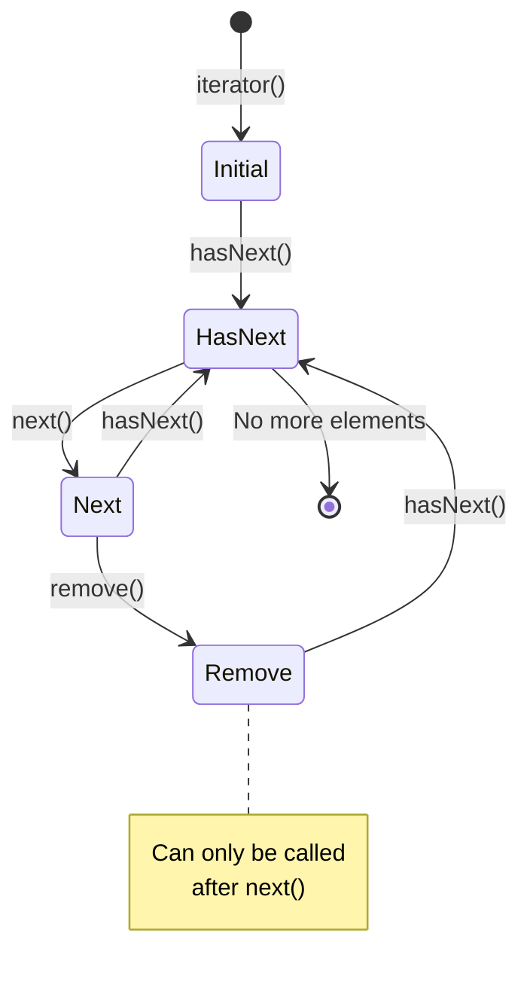

---

## 3. LISTITERATOR INTERFACE

### 📌 Definition
**ListIterator** is a **bidirectional iterator** that extends the `Iterator` interface. It is available only for `List` implementations (ArrayList, LinkedList, Vector) and allows traversal in both forward and backward directions.

### 🏗️ Why Do We Need ListIterator?
1.  **Bidirectional Traversal:** Move forward AND backward
2.  **Index Access:** Get current position index
3.  **Element Modification:** Modify elements during iteration using `set()`
4.  **Element Addition:** Add elements during iteration using `add()`
5.  **More Control:** Greater flexibility than standard Iterator

<div align="center">

<p><em>ListIterator Bidirectional Traversal | Notes by Avinash Dhanuka</em></p>
</div>

---
#### 🏭 ListIterator Hierarchy

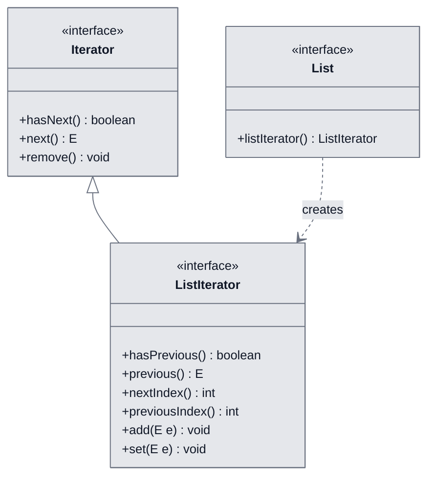

---

### 3.1 BIDIRECTIONAL TRAVERSAL

#### 📋 ListIterator Methods

| Method | Return Type | Direction | Description |
| :--- | :--- | :--- | :--- |
| **`hasNext()`** | `boolean` | Forward | Checks if next element exists |
| **`next()`** | `E` | Forward | Returns next element & moves forward |
| **`hasPrevious()`** | `boolean` | Backward | Checks if previous element exists |
| **`previous()`** | `E` | Backward | Returns previous element & moves backward |
| **`nextIndex()`** | `int` | - | Returns index of next element |
| **`previousIndex()`** | `int` | - | Returns index of previous element |
| **`add(E e)`** | `void` | - | Inserts element at current position |
| **`set(E e)`** | `void` | - | Replaces last returned element |
| **`remove()`** | `void` | - | Removes last returned element |

---

#### 🔍 Internal Working

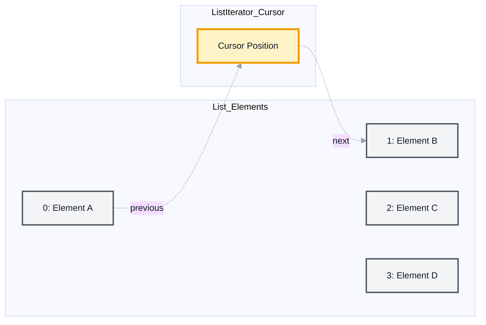

**Key Concept:** The cursor in ListIterator sits **between** elements, not on them.


#### 💻 Practical Example

```java
List<Integer> li = new ArrayList<>(Arrays.asList(1, 2, 3, 4, 5));
ListIterator<Integer> lit = li.listIterator();

// Initial State
System.out.println("hasPrevious(): " + lit.hasPrevious()); // false
System.out.println("hasNext(): " + lit.hasNext());         // true

// Move forward
System.out.println("next(): " + lit.next());               // 1

// Move backward
System.out.println("previous(): " + lit.previous());       // 1

// Forward Traversal
while (lit.hasNext()) {
    System.out.print(lit.next() + " "); // 1 2 3 4 5
}

// Backward Traversal
while (lit.hasPrevious()) {
    System.out.print(lit.previous() + " "); // 5 4 3 2 1
}
```

#### 🎯 Advanced Operations

```java
ListIterator<Integer> lit = list.listIterator();

// Add element at current position
lit.next();
lit.add(100); // Inserts 100 after first element

// Modify last returned element
lit.next();
lit.set(200); // Replaces the element

// Get index information
System.out.println("Next Index: " + lit.nextIndex());
System.out.println("Previous Index: " + lit.previousIndex());
```

---

### 3.2 LISTITERATOR VS ITERATOR

#### 📊 Detailed Comparison

| Feature | Iterator | ListIterator |
| :--- | :--- | :--- |
| **Direction** | Forward only (unidirectional) | Forward & Backward (bidirectional) |
| **Applicable To** | All Collections (List, Set, Queue) | Only List implementations |
| **Methods** | 3 methods | 9 methods |
| **Add Elements** | ❌ No | ✅ Yes (`add()`) |
| **Modify Elements** | ❌ No | ✅ Yes (`set()`) |
| **Index Access** | ❌ No | ✅ Yes (`nextIndex()`, `previousIndex()`) |
| **Traversal Start** | Always from beginning | Can start from any position |
| **Use Case** | Simple forward iteration | Complex bidirectional operations |

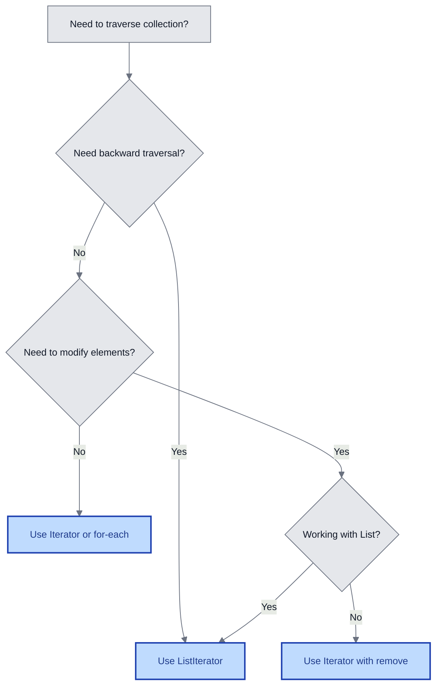

---

## 4. VECTOR CLASS (LEGACY COLLECTION)

### 📌 Definition
**Vector** is a legacy class that implements the `List` interface. It is a **synchronized** dynamic array that has been part of Java since JDK 1.0. While ArrayList is preferred in modern Java, Vector is still used in thread-safe scenarios.

<div align="center">

<p><em>Vector Internal Structure | © 2026 Avinash Dhanuka</em></p>
</div>

---
### 🏗️ Why Do We Need Vector?
1.  **Thread Safety:** All methods are synchronized (safe for multi-threading)
2.  **Legacy Support:** Required for older Java applications
3.  **Dynamic Growth:** Automatically resizes like ArrayList
4.  **Random Access:** Fast index-based retrieval (O(1))
5.  **Backward Compatibility:** Maintains compatibility with JDK 1.0 code

#### 📋 Vector Characteristics

| Property | Value |
| :--- | :--- |
| **Package** | `java.util` |
| **Implements** | `List` interface |
| **Since** | JDK 1.0 (Legacy Class) |
| **Data Structure** | Dynamic Array |
| **Synchronization** | ✅ Synchronized (Thread-Safe) |
| **Null Elements** | ✅ Allowed |
| **Duplicates** | ✅ Allowed |
| **Insertion Order** | ✅ Preserved |
| **Memory Storage** | Contiguous block of memory |
| **Default Capacity** | 10 |
| **Growth Factor** | Doubles (100% increase) |

---

### 4.1 INTERNAL ARCHITECTURE OF VECTOR

#### 🏭 Memory Structure

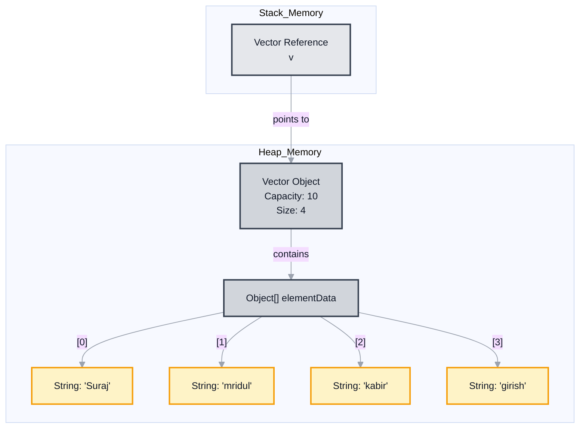

#### ⚙️ Internal Fields

```java
// Inside Vector class
protected Object[] elementData;  // Stores elements
protected int elementCount;      // Number of elements
protected int capacityIncrement; // Growth size
```


#### 🔄 Growth Mechanism

When Vector reaches full capacity:

```java
// Internal growth logic
int newCapacity = oldCapacity + 
    ((capacityIncrement > 0) ? capacityIncrement : oldCapacity);
```

**Growth Pattern:**
- Initial Capacity: 10
- After 1st growth: 20 (doubles)
- After 2nd growth: 40 (doubles)
- After 3rd growth: 80 (doubles)

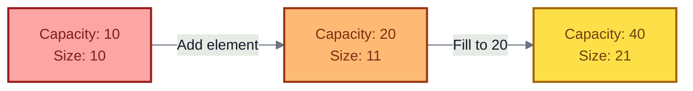

#### 💻 Basic Usage

```java
List<String> v = new Vector<String>();
v.add("Suraj");
v.add("mridul");
v.add("kabir");
v.add("girish");

System.out.println(v);              // [Suraj, mridul, kabir, girish]
System.out.println("Size: " + v.size()); // Size: 4

// Access using index
for (int i = 0; i < v.size(); i++) {
    System.out.println(v.get(i));
}

// Using Iterator
Iterator<String> itr = v.iterator();
while (itr.hasNext()) {
    System.out.println(itr.next());
}
```

---

### 4.2 VECTOR VS ARRAYLIST

#### 📊 Comprehensive Comparison

| Feature | Vector | ArrayList |
| :--- | :--- | :--- |
| **Introduced** | JDK 1.0 (1996) | JDK 1.2 (1998) |
| **Synchronization** | ✅ Synchronized (Thread-Safe) | ❌ Not Synchronized |
| **Performance** | Slower (due to synchronization) | Faster |
| **Growth Rate** | 100% (Doubles) | 50% (1.5x) |
| **Legacy Status** | ✅ Legacy Class | ❌ Modern Class |
| **Thread Safety** | Safe for multi-threading | Requires external synchronization |
| **Memory Efficiency** | Less efficient (aggressive growth) | More efficient |
| **Use Case** | Multi-threaded environments | Single-threaded or manual sync |
| **Recommended** | ❌ Rarely (use Collections.synchronizedList) | ✅ Yes (preferred) |


#### 🎯 When to Use What?

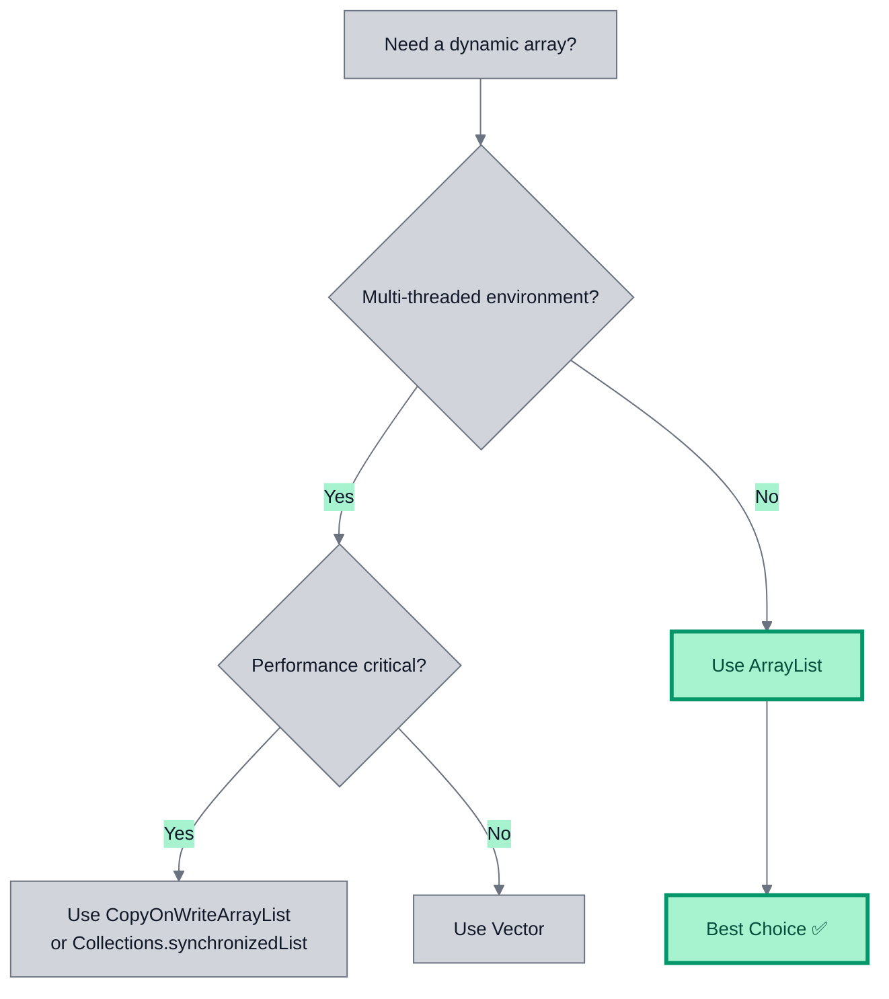

#### ⚙️ Synchronization Example

```java
// Vector - Automatically synchronized
Vector<Integer> vector = new Vector<>();
vector.add(10); // Thread-safe

// ArrayList - Manual synchronization needed
List<Integer> list = Collections.synchronizedList(new ArrayList<>());
list.add(10); // Now thread-safe
```

---

## 5. STACK CLASS (LIFO DATA STRUCTURE)

### 📌 Definition
**Stack** is a subclass of `Vector` that implements a **Last-In-First-Out (LIFO)** data structure. It represents a stack of objects where elements are added and removed from the same end (top of the stack).

<div align="center">

<p><em>Stack LIFO Operations | Curated by Avinash Dhanuka</em></p>
</div>

---### 🏗️ Why Do We Need Stack?
1.  **LIFO Operations:** Perfect for last-in-first-out scenarios
2.  **Function Call Management:** JVM uses stack for method calls
3.  **Undo Mechanisms:** Implement undo/redo functionality
4.  **Expression Evaluation:** Parse and evaluate expressions
5.  **Backtracking Algorithms:** DFS, maze solving, etc.

#### 📋 Stack Characteristics

| Property | Value |
| :--- | :--- |
| **Package** | `java.util` |
| **Extends** | `Vector` class |
| **Implements** | `List` interface |
| **Since** | JDK 1.0 (Legacy Class) |
| **Data Structure** | LIFO (Last-In-First-Out) |
| **Synchronization** | ✅ Synchronized (Thread-Safe) |
| **Insertion Order** | LIFO |
| **Primary Operations** | push, pop, peek |

---

### 5.1 STACK OPERATIONS & METHODS

#### 📋 Method Signatures

| Method | Return Type | Description | Throws |
| :--- | :--- | :--- | :--- |
| **`push(E item)`** | `E` | Pushes element onto top of stack | - |
| **`pop()`** | `E` | Removes & returns top element | `EmptyStackException` |
| **`peek()`** | `E` | Returns top element (doesn't remove) | `EmptyStackException` |
| **`empty()`** | `boolean` | Checks if stack is empty | - |
| **`search(Object o)`** | `int` | Returns 1-based position from top | - |


#### 🏭 Stack Visual Representation

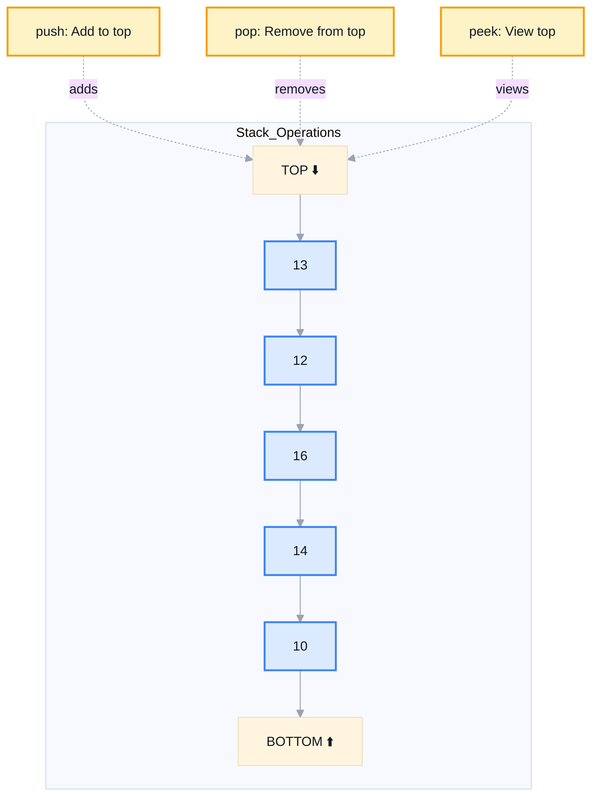

---

#### 1️⃣ push(E item) Method

**Purpose:** Pushes an element onto the top of the stack.

**Return Type:** Returns the pushed element

```java
public E push(E item) {
    addElement(item);
    return item;
}
```

**Example:**
```java
Stack<Integer> st = new Stack<>();
System.out.println(st.push(10)); // Returns: 10
st.push(14);
st.push(16);
// Stack: [10, 14, 16] (16 is at top)
```

---

#### 2️⃣ peek() Method

**Purpose:** Returns the top element WITHOUT removing it.

**Return Type:** `E` (Generic Type)

**Throws:** `EmptyStackException` if stack is empty

```java
public synchronized E peek() {
    int len = size();
    if (len == 0)
        throw new EmptyStackException();
    return elementAt(len - 1);
}
```

**Example:**
```java
Stack<Integer> st = new Stack<>();
st.push(10);
st.push(20);

System.out.println(st.peek()); // 20 (doesn't remove)
System.out.println(st.peek()); // 20 (still there)
System.out.println(st);        // [10, 20]
```

---

#### 3️⃣ pop() Method

**Purpose:** Removes and returns the top element.

**Return Type:** `E` (Generic Type)

**Throws:** `EmptyStackException` if stack is empty

```java
public synchronized E pop() {
    E obj;
    int len = size();
    
    if (len == 0)
        throw new EmptyStackException();
    
    obj = peek();
    removeElementAt(len - 1);
    return obj;
}
```

**Example:**
```java
Stack<Integer> st = new Stack<>();
st.push(10);
st.push(20);

System.out.println(st.pop()); // 20 (removes & returns)
System.out.println(st);       // [10]
```


---

#### 4️⃣ empty() Method

**Purpose:** Checks if the stack is empty.

**Return Type:** `boolean`

```java
public boolean empty() {
    return size() == 0;
}
```

**Example:**
```java
Stack<Integer> st = new Stack<>();
System.out.println(st.empty()); // true

st.push(10);
System.out.println(st.empty()); // false
```

---

#### 💻 Complete Stack Example

```java
Stack<Integer> st = new Stack<>();

// Check if empty
System.out.println("isEmpty(): " + st.empty()); // true

// Push elements
st.push(10);
st.push(14);
st.push(16);
st.push(12);
st.push(13);
System.out.println("Stack: " + st); // [10, 14, 16, 12, 13]

// Peek (doesn't remove)
System.out.println("peek(): " + st.peek()); // 13
System.out.println("peek(): " + st.peek()); // 13 (still there)

// Pop (removes)
System.out.println("pop(): " + st.pop()); // 13
System.out.println("Stack: " + st);       // [10, 14, 16, 12]

// Check empty again
System.out.println("isEmpty(): " + st.empty()); // false
```

---

### 5.2 INTERNAL WORKING OF STACK

#### 🏭 Memory Architecture

Since Stack extends Vector, it inherits the same internal structure:

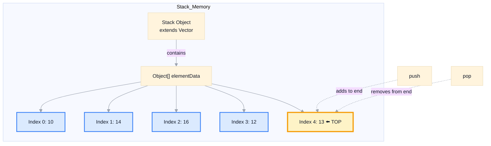

**Key Points:**
1.  Stack uses the **end of the array** as the top
2.  `push()` adds to the end (O(1) amortized)
3.  `pop()` removes from the end (O(1))
4.  `peek()` accesses the last element (O(1))


#### ⚙️ Operation Flow Diagram

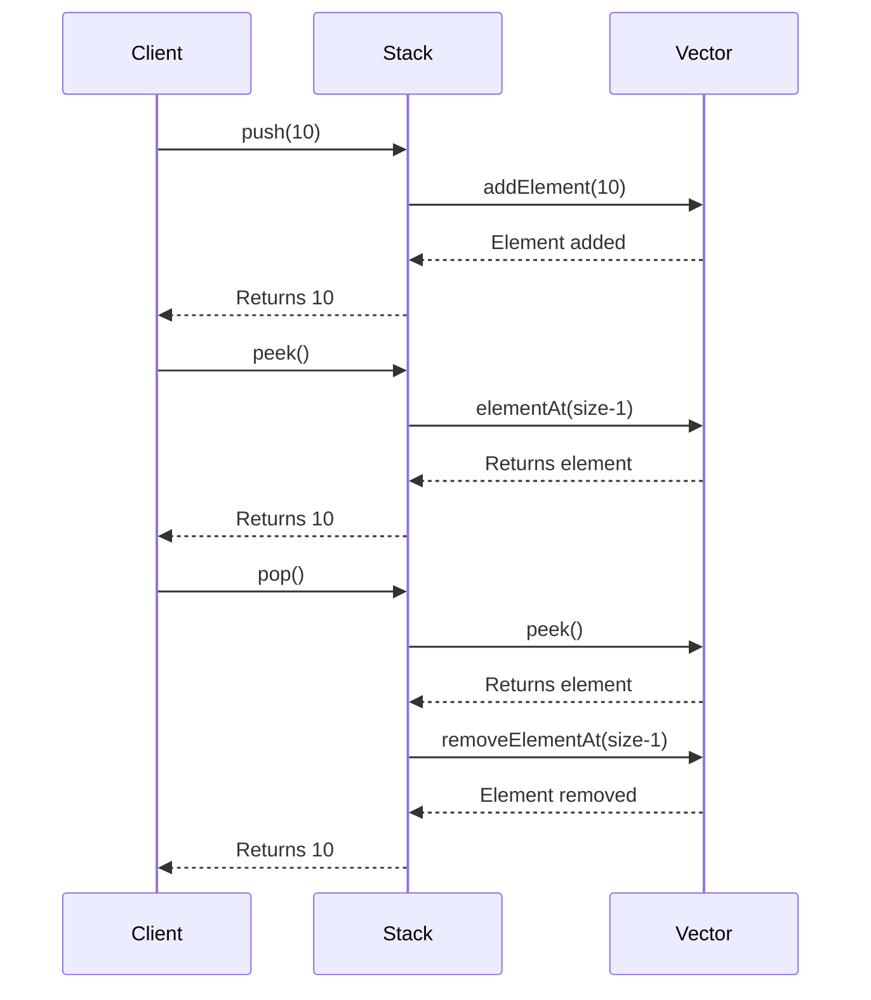

---

### 5.3 REAL-WORLD APPLICATION: VALID PARENTHESIS

#### 🎯 Problem Statement
Given a string containing brackets `()`, `{}`, `[]`, determine if the input string is valid. A string is valid if:
1.  Open brackets are closed by the same type
2.  Open brackets are closed in the correct order

<div align="center">

<p><em>Valid Parenthesis Algorithm Visualization | © Avinash Dhanuka - Java Internals</em></p>
</div>

---#### 💡 Algorithm Logic

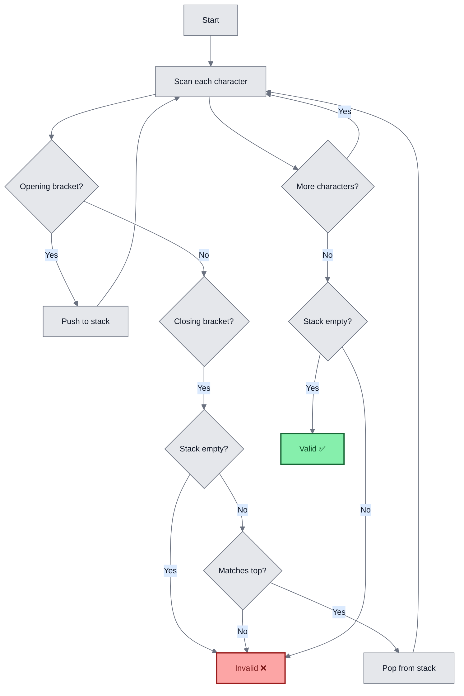

#### 💻 Implementation

```java
public static boolean validParenthesis(String str) {
    Stack<Character> st = new Stack<>();
    
    for(int i = 0; i < str.length(); i++) {
        char ch = str.charAt(i);
        
        // Opening brackets - push to stack
        if(ch == '(' || ch == '{' || ch == '[') {
            st.push(ch);
        } 
        // Closing brackets - check matching
        else {
            if(st.isEmpty()) return false;
            
            if((ch == ')' && st.peek() != '(') || 
               (ch == '}' && st.peek() != '{') || 
               (ch == ']' && st.peek() != '[')) {
                return false;
            } else {
                st.pop();
            }
        }
    }
    
    return st.isEmpty();
}
```


#### 🔍 Step-by-Step Execution

**Input:** `"({[]})"`

| Step | Character | Stack State | Action |
| :--- | :--- | :--- | :--- |
| 1 | `(` | `['(']` | Push opening bracket |
| 2 | `{` | `['(', '{']` | Push opening bracket |
| 3 | `[` | `['(', '{', '[']` | Push opening bracket |
| 4 | `]` | `['(', '{']` | Matches `[`, pop |
| 5 | `}` | `['(']` | Matches `{`, pop |
| 6 | `)` | `[]` | Matches `(`, pop |
| End | - | `[]` | Stack empty → Valid ✅ |

**Input:** `"({[}])"`

| Step | Character | Stack State | Action |
| :--- | :--- | :--- | :--- |
| 1 | `(` | `['(']` | Push opening bracket |
| 2 | `{` | `['(', '{']` | Push opening bracket |
| 3 | `[` | `['(', '{', '[']` | Push opening bracket |
| 4 | `}` | - | Doesn't match `[` → Invalid ❌ |

#### 🎯 Usage Example

```java
public static void main(String[] args) {
    Scanner sc = new Scanner(System.in);
    System.out.print("Enter parenthesis: ");
    String input = sc.next();
    
    if(validParenthesis(input)) {
        System.out.println("Valid");
    } else {
        System.out.println("Invalid");
    }
}
```

**Test Cases:**
- `"()"` → Valid ✅
- `"()[]{}"` → Valid ✅
- `"(]"` → Invalid ❌
- `"([)]"` → Invalid ❌
- `"{[]}"` → Valid ✅

---

## 6. LIST INITIALIZATION TECHNIQUES

### 📌 Why Multiple Ways to Initialize?
Different initialization methods serve different purposes:
1.  **Flexibility:** Choose based on use case
2.  **Immutability:** Some methods create unmodifiable lists
3.  **Performance:** Different methods have different performance characteristics
4.  **Convenience:** Shorter syntax for quick initialization

---

### 6.1 INITIALIZATION METHODS

#### 📋 Comprehensive Comparison

| Method | Modifiable? | Null Allowed? | Use Case |
| :--- | :--- | :--- | :--- |
| `new ArrayList<>()` | ✅ Yes | ✅ Yes | General purpose |
| `new ArrayList<>(capacity)` | ✅ Yes | ✅ Yes | Known size optimization |
| `new ArrayList<>(collection)` | ✅ Yes | ✅ Yes | Copy from another collection |
| `Arrays.asList()` | ⚠️ Fixed-size | ✅ Yes | Quick initialization |
| `List.of()` | ❌ Immutable | ❌ No | Immutable lists (Java 9+) |
| `addAll()` | ✅ Yes | ✅ Yes | Add to existing list |
| `Stream.collect()` | ✅ Yes | ✅ Yes | Functional programming |


---

#### 1️⃣ Basic Initialization

```java
// Empty list
List<Integer> list1 = new ArrayList<>();

// With initial capacity (optimization)
List<Integer> list2 = new ArrayList<>(100);

// Copy from another collection
List<Integer> original = Arrays.asList(1, 2, 3);
List<Integer> list3 = new ArrayList<>(original);
```

**Capacity vs Size:**
```java
List<Integer> list = new ArrayList<>(10); // Capacity: 10, Size: 0
list.add(5);                              // Capacity: 10, Size: 1
```

---

#### 2️⃣ Arrays.asList() Method

**Creates a fixed-size list backed by an array.**

```java
List<Integer> list = Arrays.asList(1, 2, 3, 4, 5);

// ✅ Can modify elements
list.set(0, 100); // Works

// ❌ Cannot add/remove elements
list.add(6);      // UnsupportedOperationException
list.remove(0);   // UnsupportedOperationException
```

**Internal Working:**
```java
// Arrays.asList returns a fixed-size list
// backed by the original array
Integer[] arr = {1, 2, 3};
List<Integer> list = Arrays.asList(arr);
arr[0] = 100; // Changes reflect in list!
System.out.println(list); // [100, 2, 3]
```

---

#### 3️⃣ List.of() Method (Java 9+)

**Creates an immutable list.**

```java
List<Integer> list = List.of(1, 2, 3, 4, 5);

// ❌ Cannot modify at all
list.set(0, 100); // UnsupportedOperationException
list.add(6);      // UnsupportedOperationException
list.remove(0);   // UnsupportedOperationException

// ❌ Null not allowed
List<Integer> list2 = List.of(1, null, 3); // NullPointerException
```

---

#### 4️⃣ addAll() Method

```java
List<Integer> source = Arrays.asList(1, 2, 3);
List<Integer> target = new ArrayList<>();

target.addAll(source);
System.out.println(target); // [1, 2, 3]

// Can continue adding
target.add(4);
System.out.println(target); // [1, 2, 3, 4]
```

---

#### 5️⃣ Stream API (Java 8+)

```java
// From another collection
List<Integer> source = Arrays.asList(1, 2, 3, 4, 5);
List<Integer> list = source.stream()
                           .collect(Collectors.toList());

// From array
Integer[] arr = {1, 2, 3, 4, 5};
List<Integer> list2 = Arrays.stream(arr)
                            .collect(Collectors.toList());

// With filtering
List<Integer> evenNumbers = source.stream()
                                  .filter(n -> n % 2 == 0)
                                  .collect(Collectors.toList());
```


---

### 6.2 CAPACITY AND DYNAMIC GROWTH

#### 🔍 What Happens When Capacity is Exceeded?

```java
List<Integer> list = new ArrayList<>(10); // Initial capacity: 10

// Add 11 elements
for(int i = 0; i < 11; i++) {
    list.add(i);
}
// JVM automatically increases capacity!
```

**Internal Process:**
1.  **Check:** Size reaches capacity (10)
2.  **Calculate:** New capacity = 10 + (10 >> 1) = 15
3.  **Allocate:** Create new array of size 15
4.  **Copy:** Copy all elements to new array
5.  **Add:** Add the 11th element

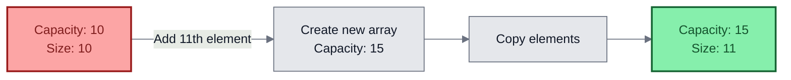

**Performance Impact:**
- Adding within capacity: O(1)
- Adding when full: O(n) due to copying

**Best Practice:**
```java
// If you know you'll add 1000 elements
List<Integer> list = new ArrayList<>(1000); // Avoids multiple resizes
```

---

### 6.3 COPYING FROM ARRAYS

#### 💻 Different Approaches

```java
Integer[] arr = {1, 2, 3, 4, 5};

// Method 1: Constructor
List<Integer> list1 = new ArrayList<>(Arrays.asList(arr));

// Method 2: addAll
List<Integer> list2 = new ArrayList<>();
list2.addAll(Arrays.asList(arr));

// Method 3: Stream
List<Integer> list3 = Arrays.stream(arr)
                            .collect(Collectors.toList());

// Method 4: Collections.addAll
List<Integer> list4 = new ArrayList<>();
Collections.addAll(list4, arr);
```

#### 📊 Performance Comparison

| Method | Performance | Readability | Flexibility |
| :--- | :--- | :--- | :--- |
| Constructor | ⭐⭐⭐ Fast | ⭐⭐⭐ Clear | ⭐⭐ Good |
| addAll | ⭐⭐⭐ Fast | ⭐⭐⭐ Clear | ⭐⭐⭐ Best |
| Stream | ⭐⭐ Slower | ⭐⭐ Moderate | ⭐⭐⭐ Best |
| Collections.addAll | ⭐⭐⭐ Fast | ⭐⭐ Moderate | ⭐⭐ Good |

---

## 7. PRACTICAL TIPS & BEST PRACTICES

> **💡 Pro Tips from Avinash Dhanuka's Java Collection Mastery Series**

### ✅ DO's

1.  **Use Iterator for safe removal during iteration**
   ```java
   Iterator<Integer> it = list.iterator();
   while(it.hasNext()) {
       if(it.next() == 5) {
           it.remove(); // Safe
       }
   }
   ```

2.  **Prefer ArrayList over Vector for single-threaded applications**
   ```java
   List<String> list = new ArrayList<>(); // Preferred
   ```

3.  **Use Deque instead of Stack for new code**
   ```java
   Deque<Integer> stack = new ArrayDeque<>();
   stack.push(10);
   stack.pop();
   ```

4.  **Initialize with capacity if size is known**
   ```java
   List<Integer> list = new ArrayList<>(1000); // Avoids resizing
   ```

5.  **Use List.of() for immutable lists**
   ```java
   List<String> immutable = List.of("A", "B", "C");
   ```

### ❌ DON'Ts

1.  **Don't modify collection during for-each loop**
   ```java
   for(Integer num : list) {
       list.remove(num); // ConcurrentModificationException
   }
   ```

2.  **Don't call remove() before next() in Iterator**
   ```java
   Iterator<Integer> it = list.iterator();
   it.remove(); // IllegalStateException
   ```

3.  **Don't use Vector unless necessary**
   ```java
   List<String> list = new Vector<>(); // Avoid (legacy)
   ```

4.  **Don't forget to check empty() before pop()/peek()**
   ```java
   if(!stack.empty()) {
       stack.pop(); // Safe
   }
   ```

5.  **Don't try to add to List.of() or Arrays.asList()**
   ```java
   List<Integer> list = List.of(1, 2, 3);
   list.add(4); // UnsupportedOperationException
   ```

---

## 8. TOP INTERVIEW QUESTIONS (ITERATOR & STACK EDITION)

> **📚 Compiled by Avinash Dhanuka | Java Core Concepts Expert**

#### Q1: What is the difference between Iterator and ListIterator?
> **Answer:**
> - **Iterator:** Unidirectional (forward only), works with all Collections, has 3 methods
> - **ListIterator:** Bidirectional (forward & backward), only for List, has 9 methods, supports add() and set()

#### Q2: Why does remove() throw IllegalStateException if called before next()?
> **Answer:** Because `remove()` deletes the element returned by the last `next()` call. If `next()` hasn't been called, there's no "last returned element" to remove, hence the exception.

#### Q3: What is the difference between Vector and ArrayList?
> **Answer:**
> - **Vector:** Synchronized (thread-safe), doubles capacity when full, legacy class (JDK 1.0)
> - **ArrayList:** Not synchronized, grows by 50%, modern class (JDK 1.2), preferred choice

#### Q4: Why is Stack considered a legacy class?
> **Answer:** Stack was introduced in JDK 1.0 and extends Vector (also legacy). Modern Java recommends using `Deque` interface with `ArrayDeque` implementation for stack operations, as it's more efficient and not synchronized by default.

#### Q5: Can we use for-each loop to remove elements from a collection?
> **Answer:** **No.** For-each loop internally uses Iterator, but you cannot call `remove()` on it. Attempting to modify the collection during for-each iteration throws `ConcurrentModificationException`. Use explicit Iterator with `remove()` instead.

#### Q6: What happens if we call peek() or pop() on an empty Stack?
> **Answer:** Both methods throw `EmptyStackException`. Always check with `empty()` method before calling `peek()` or `pop()`.

#### Q7: Is List.of() modifiable?
> **Answer:** **No.** `List.of()` creates an **immutable list**. Any attempt to modify it (add, remove, set) throws `UnsupportedOperationException`. Also, it doesn't allow null elements.

---
<div align="center">
<sub>📖 Java Collection Framework Deep Dive | Authored by <strong>Avinash Dhanuka</strong> | github.com/Avinash-706</sub>
</div>

---

#### Q8: What is the difference between capacity and size in ArrayList?
> **Answer:**
> - **Capacity:** The length of the internal array (how many elements it CAN hold)
> - **Size:** The number of elements actually present in the list
> - Example: `new ArrayList<>(10)` has capacity 10 but size 0

#### Q9: Why can't we modify a list created by Arrays.asList()?
> **Answer:** `Arrays.asList()` returns a **fixed-size list** backed by the original array. You can modify elements using `set()`, but cannot add or remove elements. The list is just a wrapper around the array.

#### Q10: What is fail-fast behavior in Iterator?
> **Answer:** If the collection is structurally modified (add/remove) after the Iterator is created, except through Iterator's own `remove()` method, the Iterator throws `ConcurrentModificationException`. This is called fail-fast behavior, designed to detect bugs early.

#### Q11: How does Stack implement LIFO using an array?
> **Answer:** Stack extends Vector, which uses a dynamic array. The **end of the array** acts as the top of the stack. `push()` adds to the end, `pop()` removes from the end, and `peek()` accesses the last element. All operations are O(1).

#### Q12: Can we iterate a Stack? If yes, in what order?
> **Answer:** **Yes.** Stack extends Vector which implements List, so you can use Iterator or for-each loop. However, iteration happens from **bottom to top** (index 0 to size-1), not in LIFO order. To iterate in LIFO order, use `pop()` in a loop.

#### Q13: What are the common operations that all List implementations support?
> **Answer:** All List implementations (ArrayList, LinkedList, Vector, Stack) support:
> - Index-based access: `get(index)`, `set(index, element)`
> - Add operations: `add(element)`, `add(index, element)`, `addAll(collection)`
> - Remove operations: `remove(index)`, `remove(object)`, `clear()`
> - Search: `contains(object)`, `indexOf(object)`
> - Size: `size()`, `isEmpty()`
> - Iteration: `iterator()`, `listIterator()`

#### Q14: When should we use Vector over ArrayList?
> **Answer:** Use Vector only when:
> - Working with legacy code that requires Vector
> - Need built-in synchronization and performance is not critical
> 
> **Modern Alternative:** Use `Collections.synchronizedList(new ArrayList<>())` or `CopyOnWriteArrayList` for thread-safe lists with better performance.

#### Q15: What is the time complexity of Stack operations?
> **Answer:**
> - `push()`: O(1) amortized (O(n) when resizing)
> - `pop()`: O(1)
> - `peek()`: O(1)
> - `empty()`: O(1)
> - `search()`: O(n)

---

*Created for Advanced Java Collection Framework Learning - Day 23*

<div align="center">

---

**© 2026 Avinash Dhanuka | Java Internals & Collection Framework Specialist**

*These notes are crafted with precision for deep understanding of Java internals*

---

**Happy Coding! ☕**


</div>
