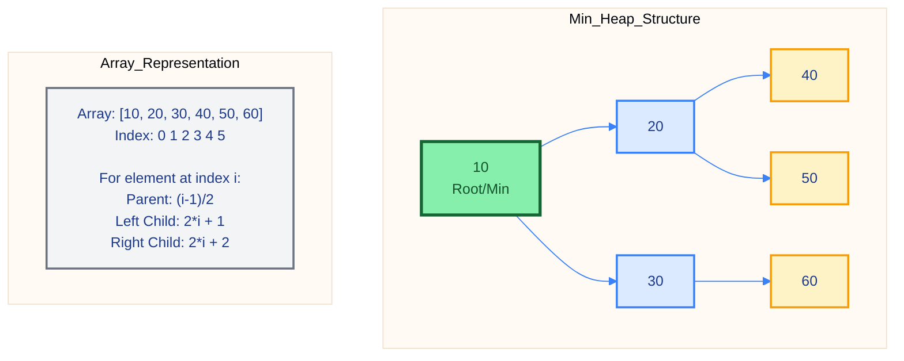
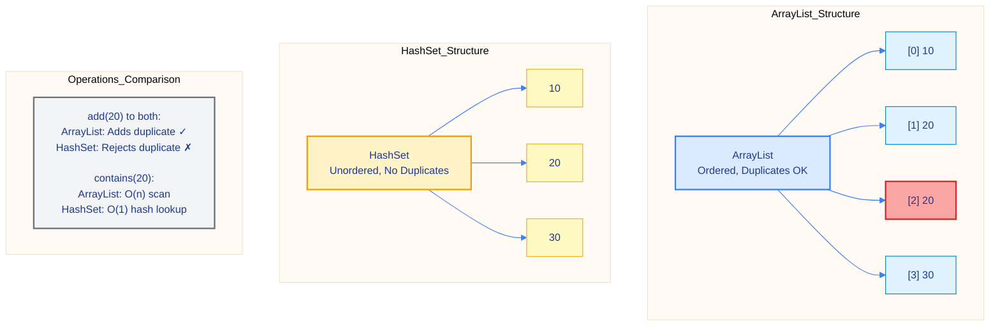
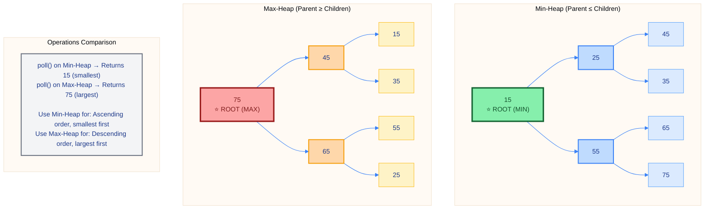

# ☕ Master Guide: LinkedList, PriorityQueue, HashSet & Heap

<div align="center">


</div>

<hr style="border: 1px solid rgb(98, 117, 187)">

<div align="center">
<table>
<tr>
<td align="center">
<br />

<h3>© 2026 Avinash Dhanuka</h3>
<p>Master Guide: Java Core & Frameworks</p>
<p><em>Crafted with ❤️ for Object-Oriented Architecture</em></p>

<a href="https://github.com/Avinash-706" target="_blank">

</a>

<a href="https://mail.google.com/mail/?view=cm&fs=1&to=avunashdhanuka@gmail.com&su=Java%20Collections%20Query&body=☕%20Hello%20Avinash,%0D%0A%0D%0AMy%20name%20is%20[Your%20Name]%20and%20I%20have%20a%20doubt%20regarding%20Java%20Collections.%0D%0A%0D%0A🔹%20Topic:%20[LinkedList/PriorityQueue/Heap]%0D%0A🔹%20Question:%20[Type%20your%20question]%0D%0A%0D%0AThank%20you!" target="_blank">


</a>
<br />
<br />
</td>
</tr>
</table>
</div>

> **Author's Note:** This guide explores advanced data structures in Java Collections Framework, focusing on LinkedList's doubly-linked architecture, PriorityQueue's heap-based ordering, HashSet's unique element storage, and Heap data structures. Building upon Day 23's foundation, we dive deep into node-based storage, priority-based operations, and efficient data management.

---

## 📑 Table of Contents
1.  [LinkedList Data Structure](#1-linkedlist-data-structure)
    -   [Singly vs Doubly vs Circular Linked List](#11-singly-vs-doubly-vs-circular-linked-list)
    -   [LinkedList Operations](#12-linkedlist-operations)
    -   [LinkedList as Queue, Stack, and Deque](#13-linkedlist-as-queue-stack-and-deque)
2.  [PriorityQueue (Priority-Based Ordering)](#2-priorityqueue-priority-based-ordering)
    -   [Internal Working of PriorityQueue](#21-internal-working-of-priorityqueue)
    -   [Min-Heap vs Max-Heap](#22-min-heap-vs-max-heap)
    -   [Custom Comparators](#23-custom-comparators)
3.  [HashSet (Unique Elements Collection)](#3-hashset-unique-elements-collection)
    -   [Internal Architecture of HashSet](#31-internal-architecture-of-hashset)
    -   [Set Operations](#32-set-operations)
    -   [HashSet vs ArrayList](#33-hashset-vs-arraylist)
4.  [Heap Data Structure](#4-heap-data-structure)
    -   [Min-Heap Implementation](#41-min-heap-implementation)
    -   [Max-Heap Implementation](#42-max-heap-implementation)
    -   [Heap Properties](#43-heap-properties)
5.  [Real-World Applications](#5-real-world-applications)
6.  [Practical Tips & Best Practices](#6-practical-tips--best-practices)
7.  [Top Interview Questions](#7-top-interview-questions-linkedlist-priorityqueue-edition)

<div align="right">
<sub><em>Comprehensive notes by Avinash Dhanuka | For educational purposes</em></sub>
</div>

---

## 1. LINKEDLIST DATA STRUCTURE

### 📌 Definition
**LinkedList** is an implementation class of both `List` and `Queue` interfaces. It follows a **doubly linked list** data structure where elements are stored in the form of nodes. Each node contains data and references to both the next and previous nodes, making it efficient for insertion and deletion operations.

### 🏗️ Why Do We Need LinkedList?
1.  **Efficient Insertion/Deletion:** O(1) time complexity for add/remove at beginning or end
2.  **Dynamic Size:** No need to specify size in advance
3.  **Flexible Usage:** Can be used as List, Queue, Stack, or Deque
4.  **Bidirectional Traversal:** Can traverse forward and backward
5.  **No Contiguous Memory:** Elements stored in non-contiguous memory locations

#### 📋 LinkedList Characteristics

| Property | Value |
| :--- | :--- |
| **Package** | `java.util` |
| **Implements** | `List`, `Queue`, `Deque` interfaces |
| **Since** | JDK 1.2 |
| **Data Structure** | Doubly Linked List |
| **Synchronization** | ❌ Not Synchronized |
| **Null Elements** | ✅ Allowed |
| **Duplicates** | ✅ Allowed |
| **Insertion Order** | ✅ Preserved |
| **Memory Storage** | Non-contiguous (Node-based) |
| **Random Access** | ❌ No (Sequential access only) |

---

### 1.1 SINGLY VS DOUBLY VS CIRCULAR LINKED LIST

#### 📊 Comparison Table

| Feature | Singly Linked List | Doubly Linked List | Circular Doubly Linked List |
| :--- | :--- | :--- | :--- |
| **Node Structure** | Data + Next pointer | Data + Next + Previous pointers | Data + Next + Previous (circular) |
| **Traversal** | Forward only | Forward & Backward | Both directions + Continuous loop |
| **Memory** | Less (1 pointer) | More (2 pointers) | More (2 pointers + circular) |
| **Insertion at End** | O(n) | O(1) | O(1) |
| **Deletion** | O(n) | O(1) | O(1) |
| **Java Implementation** | Not in JDK | `LinkedList` class | Not in JDK |

#### 🏭 Visual Representation

```mermaid
%%{init: {
  "theme": "base",
  "themeVariables": {
    "primaryColor": "#dbeafe",
    "primaryTextColor": "#1e3a8a",
    "primaryBorderColor": "#3b82f6",
    "lineColor": "#3b82f6",
    "secondaryColor": "#fef3c7",
    "tertiaryColor": "#e5e7eb",
    "fontSize": "14px"
  }
}}%%

graph LR
    subgraph Singly_Linked_List
        A1[10] -->|next| A2[20]
        A2 -->|next| A3[30]
        A3 -->|next| A4[40]
        A4 -->|null| A5[ ]
    end
    
    subgraph Doubly_Linked_List
        B0[ ] -->|null| B1[10]
        B1 <-->|prev/next| B2[20]
        B2 <-->|prev/next| B3[30]
        B3 <-->|prev/next| B4[40]
        B4 -->|null| B5[ ]
    end
    
    style A1 fill:#dbeafe,stroke:#3b82f6,stroke-width:2px
    style A2 fill:#dbeafe,stroke:#3b82f6,stroke-width:2px
    style A3 fill:#dbeafe,stroke:#3b82f6,stroke-width:2px
    style A4 fill:#dbeafe,stroke:#3b82f6,stroke-width:2px
    style B1 fill:#fef3c7,stroke:#f59e0b,stroke-width:2px
    style B2 fill:#fef3c7,stroke:#f59e0b,stroke-width:2px
    style B3 fill:#fef3c7,stroke:#f59e0b,stroke-width:2px
    style B4 fill:#fef3c7,stroke:#f59e0b,stroke-width:2px
```



---

### 1.2 LINKEDLIST OPERATIONS

#### 📋 Method Signatures & Details

| Method | Return Type | Description | Time Complexity |
| :--- | :--- | :--- | :--- |
| **`add(E e)`** | `boolean` | Adds element at end | O(1) |
| **`add(int index, E e)`** | `void` | Adds element at specific position | O(n) |
| **`addFirst(E e)`** | `void` | Adds element at beginning | O(1) |
| **`addLast(E e)`** | `void` | Adds element at end | O(1) |
| **`get(int index)`** | `E` | Returns element at index | O(n) |
| **`getFirst()`** | `E` | Returns first element | O(1) |
| **`getLast()`** | `E` | Returns last element | O(1) |
| **`remove(int index)`** | `E` | Removes element at index | O(n) |
| **`removeFirst()`** | `E` | Removes first element | O(1) |
| **`removeLast()`** | `E` | Removes last element | O(1) |
| **`peek()`** | `E` | Views first element (doesn't remove) | O(1) |
| **`peekFirst()`** | `E` | Views first element | O(1) |
| **`peekLast()`** | `E` | Views last element | O(1) |
| **`set(int index, E e)`** | `E` | Replaces element at index | O(n) |
| **`contains(Object o)`** | `boolean` | Checks if element exists | O(n) |
| **`indexOf(Object o)`** | `int` | Returns first occurrence index | O(n) |
| **`size()`** | `int` | Returns number of elements | O(1) |
| **`clear()`** | `void` | Removes all elements | O(n) |

---

#### 💻 Basic Operations Example

```java
LinkedList<Integer> ll = new LinkedList<>();

// Adding elements
ll.add(10);
ll.add(20);
ll.add(30);
ll.add(40);
ll.add(50);
System.out.println("LinkedList: " + ll); // [10, 20, 30, 40, 50]

// Adding at specific position
ll.add(2, 25);
System.out.println("After add(2, 25): " + ll); // [10, 20, 25, 30, 40, 50]

// Adding at first and last
ll.addFirst(5);
ll.addLast(60);
System.out.println("After addFirst(5) and addLast(60): " + ll);
// [5, 10, 20, 25, 30, 40, 50, 60]

// Getting elements
System.out.println("get(0): " + ll.get(0));           // 5
System.out.println("getFirst(): " + ll.getFirst());   // 5
System.out.println("getLast(): " + ll.getLast());     // 60

// Removing elements
ll.remove(2);
System.out.println("After remove(2): " + ll);
// [5, 10, 25, 30, 40, 50, 60]

ll.removeFirst();
System.out.println("After removeFirst(): " + ll);
// [10, 25, 30, 40, 50, 60]

ll.removeLast();
System.out.println("After removeLast(): " + ll);
// [10, 25, 30, 40, 50]

// Checking contains
System.out.println("Contains 30? " + ll.contains(30));   // true
System.out.println("Contains 100? " + ll.contains(100)); // false

// Peek operations (doesn't remove)
System.out.println("peek(): " + ll.peek());           // 10
System.out.println("peekFirst(): " + ll.peekFirst()); // 10
System.out.println("peekLast(): " + ll.peekLast());   // 50

// Set operation
ll.set(1, 100);
System.out.println("After set(1, 100): " + ll);
// [10, 100, 30, 40, 50]

// Index operations
System.out.println("indexOf(30): " + ll.indexOf(30)); // 2

// Clear
ll.clear();
System.out.println("After clear: " + ll);     // []
System.out.println("isEmpty(): " + ll.isEmpty()); // true
```

---

### 1.3 LINKEDLIST AS QUEUE, STACK, AND DEQUE

#### 🎯 LinkedList Versatility

LinkedList implements multiple interfaces, making it extremely versatile:

```java
// As List
List<Integer> list = new LinkedList<>();

// As Queue
Queue<Integer> queue = new LinkedList<>();

// As Deque (Double-ended queue)
Deque<Integer> deque = new LinkedList<>();
```

---

#### 1️⃣ LinkedList as Queue (FIFO)

**Queue Operations:**
- `offer(E e)` - Add element at end
- `poll()` - Remove and return first element
- `peek()` - View first element without removing

```java
LinkedList<Integer> queue = new LinkedList<>();

queue.offer(10);
queue.offer(20);
queue.offer(30);
System.out.println("Queue: " + queue); // [10, 20, 30]

System.out.println("poll(): " + queue.poll()); // 10
System.out.println("After poll: " + queue);    // [20, 30]

System.out.println("peek(): " + queue.peek()); // 20
System.out.println("After peek: " + queue);    // [20, 30]
```

**FIFO Behavior:**
```
Offer → [10] → [20] → [30] → Poll
        ↑                      ↓
        └──────────────────────┘
        First In, First Out
```

---

#### 2️⃣ LinkedList as Stack (LIFO)

**Stack Operations:**
- `push(E e)` - Add element at beginning
- `pop()` - Remove and return first element
- `peek()` - View first element without removing

```java
LinkedList<Integer> stack = new LinkedList<>();

stack.push(100);
stack.push(200);
stack.push(300);
System.out.println("Stack: " + stack); // [300, 200, 100]

System.out.println("pop(): " + stack.pop()); // 300
System.out.println("After pop: " + stack);   // [200, 100]

System.out.println("peek(): " + stack.peek()); // 200
System.out.println("After peek: " + stack);    // [200, 100]
```

**LIFO Behavior:**
```
Push → [300] → [200] → [100] → Pop
       ↑                        ↓
       └────────────────────────┘
       Last In, First Out
```

---

#### 3️⃣ LinkedList as Deque (Double-Ended Queue)

**Deque Operations:**
- `offerFirst(E e)` - Add at beginning
- `offerLast(E e)` - Add at end
- `pollFirst()` - Remove from beginning
- `pollLast()` - Remove from end

```java
LinkedList<String> deque = new LinkedList<>();

deque.offerFirst("First");
deque.offerLast("Last");
deque.offerFirst("NewFirst");
deque.offerLast("NewLast");

System.out.println("Deque: " + deque);
// [NewFirst, First, Last, NewLast]

System.out.println("pollFirst(): " + deque.pollFirst()); // NewFirst
System.out.println("pollLast(): " + deque.pollLast());   // NewLast
System.out.println("After polls: " + deque);
// [First, Last]
```

**Deque Behavior:**
```
pollFirst() ← [NewFirst] ← [First] ← [Last] ← [NewLast] → pollLast()
              ↑                                          ↑
              offerFirst()                    offerLast()
```

---

#### 📊 Traversal Methods

```java
LinkedList<String> ll = new LinkedList<>();
ll.add("Java");
ll.add("Python");
ll.add("JavaScript");
ll.add("C++");
ll.add("Ruby");

// 1. For-each loop
System.out.println("Traversal using for-each:");
for(String lang : ll) {
    System.out.print(lang + " ");
}
System.out.println();

// 2. Iterator
System.out.println("Traversal using Iterator:");
Iterator<String> itr = ll.iterator();
while(itr.hasNext()) {
    System.out.print(itr.next() + " ");
}
System.out.println();

// 3. ListIterator (Forward)
System.out.println("Forward traversal using ListIterator:");
ListIterator<String> lit = ll.listIterator();
while(lit.hasNext()) {
    System.out.print(lit.next() + " ");
}
System.out.println();

// 4. ListIterator (Backward)
System.out.println("Backward traversal using ListIterator:");
while(lit.hasPrevious()) {
    System.out.print(lit.previous() + " ");
}
System.out.println();
```

**Output:**
```
Traversal using for-each:
Java Python JavaScript C++ Ruby

Traversal using Iterator:
Java Python JavaScript C++ Ruby

Forward traversal using ListIterator:
Java Python JavaScript C++ Ruby

Backward traversal using ListIterator:
Ruby C++ JavaScript Python Java
```

---

## 2. PRIORITYQUEUE (PRIORITY-BASED ORDERING)

### 📌 Definition
**PriorityQueue** is an implementation class of the `Queue` interface that follows **priority-based ordering**, not insertion order. By default, it implements a **Min-Heap** where the smallest element has the highest priority. Elements are retrieved using FIFO based on priority, not on insertion time.

### 🏗️ Why Do We Need PriorityQueue?
1.  **Priority-Based Processing:** Process elements based on priority, not insertion order
2.  **Efficient Min/Max Retrieval:** O(1) time to access min/max element
3.  **Heap Data Structure:** Internally uses heap for efficient operations
4.  **Task Scheduling:** Perfect for scheduling tasks based on priority
5.  **Algorithm Implementation:** Used in Dijkstra's, Prim's, Huffman coding

#### 📋 PriorityQueue Characteristics

| Property | Value |
| :--- | :--- |
| **Package** | `java.util` |
| **Implements** | `Queue` interface |
| **Since** | JDK 1.5 |
| **Data Structure** | Heap (Complete Binary Tree) |
| **Default Ordering** | Min-Heap (Natural Ordering) |
| **Synchronization** | ❌ Not Synchronized |
| **Null Elements** | ❌ Not Allowed (NullPointerException) |
| **Duplicates** | ✅ Allowed |
| **Insertion Order** | ❌ Not Preserved |
| **Priority Order** | ✅ Maintained |
| **Same Type Objects** | ✅ Required (or Comparator) |

---

### 2.1 INTERNAL WORKING OF PRIORITYQUEUE

#### 🔍 How PriorityQueue Works Internally

PriorityQueue uses a **binary heap** data structure:
1.  **Storage:** Elements stored in an array
2.  **Heap Property:** Parent node ≤ Children (Min-Heap) or Parent ≥ Children (Max-Heap)
3.  **Complete Binary Tree:** All levels filled except possibly the last
4.  **Heapify:** Maintains heap property after insertion/deletion

#### ⚙️ Heap Structure Visualization



---

#### 📋 PriorityQueue Methods

| Method | Return Type | Description | Time Complexity |
| :--- | :--- | :--- | :--- |
| **`add(E e)`** | `boolean` | Adds element | O(log n) |
| **`offer(E e)`** | `boolean` | Adds element (preferred) | O(log n) |
| **`poll()`** | `E` | Removes and returns min/max | O(log n) |
| **`peek()`** | `E` | Views min/max without removing | O(1) |
| **`remove(Object o)`** | `boolean` | Removes specific element | O(n) |
| **`contains(Object o)`** | `boolean` | Checks if element exists | O(n) |
| **`size()`** | `int` | Returns number of elements | O(1) |
| **`isEmpty()`** | `boolean` | Checks if empty | O(1) |
| **`clear()`** | `void` | Removes all elements | O(n) |

---

#### 💻 Basic PriorityQueue Example

```java
Queue<Integer> pq = new PriorityQueue<>();

// Adding elements
pq.add(50);
pq.add(20);
pq.add(70);
pq.add(10);
pq.add(30);
pq.add(60);
pq.add(40);

System.out.println("PriorityQueue (Min-Heap): " + pq);
// [10, 20, 60, 50, 30, 70, 40] (heap order, not sorted)

// Peek - view smallest element without removing
System.out.println("peek(): " + pq.peek()); // 10
System.out.println("After peek: " + pq);    // Still [10, 20, 60, 50, 30, 70, 40]

// Poll - remove and return smallest element
System.out.println("poll(): " + pq.poll()); // 10
System.out.println("After poll: " + pq);    // [20, 30, 60, 50, 40, 70]

System.out.println("poll(): " + pq.poll()); // 20
System.out.println("After poll: " + pq);    // [30, 40, 60, 50, 70]

// Offer - add element
pq.offer(15);
System.out.println("After offer(15): " + pq); // [15, 40, 30, 50, 70, 60]

// Size
System.out.println("Size: " + pq.size()); // 6

// Contains
System.out.println("Contains 30? " + pq.contains(30)); // true
System.out.println("Contains 100? " + pq.contains(100)); // false

// Remove specific element
pq.remove(30);
System.out.println("After remove(30): " + pq); // [15, 40, 60, 50, 70]

// Processing all elements in priority order
System.out.println("Processing all elements in priority order:");
while(!pq.isEmpty()) {
    System.out.print(pq.poll() + " "); // 15 40 50 60 70
}
System.out.println();
```

---

### 2.2 MIN-HEAP VS MAX-HEAP

#### 📊 Comparison Table

| Feature | Min-Heap | Max-Heap |
| :--- | :--- | :--- |
| **Root Element** | Smallest element | Largest element |
| **Parent-Child Relation** | Parent ≤ Children | Parent ≥ Children |
| **Default in Java** | ✅ Yes | ❌ No (need reverseOrder) |
| **Creation** | `new PriorityQueue<>()` | `new PriorityQueue<>(Collections.reverseOrder())` |
| **Use Case** | Find minimum, ascending order | Find maximum, descending order |

---

#### 1️⃣ Min-Heap (Default)

**Property:** Parent node value is **smaller than or equal to** its child nodes.

```java
Queue<Integer> minHeap = new PriorityQueue<>();

minHeap.offer(50);
minHeap.offer(20);
minHeap.offer(70);
minHeap.offer(10);
minHeap.offer(30);

System.out.println("Min-Heap: " + minHeap);
System.out.println("Smallest element: " + minHeap.peek()); // 10

System.out.print("Elements in priority order: ");
while(!minHeap.isEmpty()) {
    System.out.print(minHeap.poll() + " "); // 10 20 30 50 70
}
System.out.println();
```

**Min-Heap Structure:**
```
        10
       /  \
      20   30
     / \
    50 70

Root: 10 (Minimum)
```

---

#### 2️⃣ Max-Heap (Reverse Order)

**Property:** Parent node value is **greater than or equal to** its child nodes.

```java
Queue<Integer> maxHeap = new PriorityQueue<>(Collections.reverseOrder());

maxHeap.offer(50);
maxHeap.offer(20);
maxHeap.offer(70);
maxHeap.offer(10);
maxHeap.offer(30);

System.out.println("Max-Heap: " + maxHeap);
System.out.println("Largest element: " + maxHeap.peek()); // 70

System.out.print("Elements in priority order: ");
while(!maxHeap.isEmpty()) {
    System.out.print(maxHeap.poll() + " "); // 70 50 30 20 10
}
System.out.println();
```

**Max-Heap Structure:**
```
        70
       /  \
      50   30
     / \
    10 20

Root: 70 (Maximum)
```

---

### 2.3 CUSTOM COMPARATORS

#### 🎯 Custom Ordering

You can define custom priority using Comparators:

#### 1️⃣ String by Length

```java
Queue<String> pq = new PriorityQueue<>((a, b) -> a.length() - b.length());

pq.offer("Java");
pq.offer("Python");
pq.offer("C");
pq.offer("JavaScript");
pq.offer("Go");

System.out.println("PriorityQueue: " + pq);

System.out.print("Strings by length: ");
while(!pq.isEmpty()) {
    System.out.print(pq.poll() + " "); // C Go Java Python JavaScript
}
System.out.println();
```

---

#### 2️⃣ Custom Object with Priority

```java
class Task {
    String name;
    int priority;
    
    public Task(String name, int priority) {
        this.name = name;
        this.priority = priority;
    }
    
    @Override
    public String toString() {
        return "Task{name='" + name + "', priority=" + priority + "}";
    }
}

// Lower priority number = Higher priority
Queue<Task> taskQueue = new PriorityQueue<>((a, b) -> 
    Integer.compare(a.priority, b.priority)
);

taskQueue.offer(new Task("Task1", 3));
taskQueue.offer(new Task("Task2", 1));
taskQueue.offer(new Task("Task3", 2));

System.out.println("Task Execution Order:");
while(!taskQueue.isEmpty()) {
    System.out.println(taskQueue.poll());
}
// Output:
// Task{name='Task2', priority=1}
// Task{name='Task3', priority=2}
// Task{name='Task1', priority=3}
```

---

#### 3️⃣ PriorityQueue with Duplicates

```java
Queue<Integer> pqDup = new PriorityQueue<>();

pqDup.offer(10);
pqDup.offer(20);
pqDup.offer(10);
pqDup.offer(30);
pqDup.offer(20);
pqDup.offer(10);

System.out.println("With duplicates: " + pqDup);
// [10, 10, 10, 30, 20, 20]

System.out.print("Processing: ");
while(!pqDup.isEmpty()) {
    System.out.print(pqDup.poll() + " "); // 10 10 10 20 20 30
}
System.out.println();
```

**Key Point:** PriorityQueue **allows duplicates** and processes them in priority order.

---

## 3. HASHSET (UNIQUE ELEMENTS COLLECTION)

### 📌 Definition
**HashSet** is an implementation class of the `Set` interface that stores **unique elements** only. It does not maintain insertion order and allows one null element. Internally, it uses a **HashMap** to store elements.

### 🏗️ Why Do We Need HashSet?
1.  **Unique Elements:** Automatically removes duplicates
2.  **Fast Lookup:** O(1) average time for add, remove, contains
3.  **No Duplicates:** Perfect for storing unique items
4.  **Set Operations:** Supports union, intersection, difference
5.  **Efficient Storage:** Uses hashing for fast access

#### 📋 HashSet Characteristics

| Property | Value |
| :--- | :--- |
| **Package** | `java.util` |
| **Implements** | `Set` interface |
| **Since** | JDK 1.2 |
| **Data Structure** | Hash Table (backed by HashMap) |
| **Synchronization** | ❌ Not Synchronized |
| **Null Elements** | ✅ One null allowed |
| **Duplicates** | ❌ Not Allowed |
| **Insertion Order** | ❌ Not Preserved |
| **Random Access** | ❌ No index-based access |
| **Performance** | O(1) for add, remove, contains |

---

### 3.1 INTERNAL ARCHITECTURE OF HASHSET

#### 🔍 How HashSet Works Internally

HashSet internally uses a **HashMap**:
```java
// Inside HashSet class
private transient HashMap<E,Object> map;
private static final Object PRESENT = new Object();

public boolean add(E e) {
    return map.put(e, PRESENT) == null;
}
```

**Key Points:**
1.  Elements stored as **keys** in HashMap
2.  All keys map to a dummy **PRESENT** object
3.  HashMap's key uniqueness ensures Set uniqueness
4.  Uses **hashCode()** and **equals()** for comparison

---

#### 📋 HashSet Methods

| Method | Return Type | Description | Time Complexity |
| :--- | :--- | :--- | :--- |
| **`add(E e)`** | `boolean` | Adds element (if not present) | O(1) |
| **`addAll(Collection c)`** | `boolean` | Adds all elements | O(n) |
| **`remove(Object o)`** | `boolean` | Removes element | O(1) |
| **`removeAll(Collection c)`** | `boolean` | Removes all matching | O(n) |
| **`retainAll(Collection c)`** | `boolean` | Keeps only matching | O(n) |
| **`contains(Object o)`** | `boolean` | Checks if element exists | O(1) |
| **`containsAll(Collection c)`** | `boolean` | Checks if all exist | O(n) |
| **`size()`** | `int` | Returns number of elements | O(1) |
| **`isEmpty()`** | `boolean` | Checks if empty | O(1) |
| **`clear()`** | `void` | Removes all elements | O(n) |

---

#### 💻 Basic HashSet Example

```java
Set<Integer> hs = new HashSet<>();

// Adding elements
hs.add(10);
hs.add(20);
hs.add(30);
hs.add(40);
hs.add(50);

System.out.println("HashSet: " + hs);
// [50, 20, 40, 10, 30] (no specific order)

// Adding duplicate (will not be added)
boolean added = hs.add(20);
System.out.println("Adding duplicate 20: " + added); // false
System.out.println("After adding duplicate: " + hs);
// [50, 20, 40, 10, 30] (unchanged)

// Adding null
hs.add(null);
System.out.println("After adding null: " + hs);
// [null, 50, 20, 40, 10, 30]

// Size
System.out.println("Size: " + hs.size()); // 6

// Contains
System.out.println("Contains 30? " + hs.contains(30));   // true
System.out.println("Contains 100? " + hs.contains(100)); // false

// Remove
hs.remove(30);
System.out.println("After remove(30): " + hs);
// [null, 50, 20, 40, 10]

// Traversal using for-each
System.out.println("Traversal using for-each:");
for(Integer num : hs) {
    System.out.print(num + " ");
}
System.out.println();

// Traversal using Iterator
System.out.println("Traversal using Iterator:");
Iterator<Integer> itr = hs.iterator();
while(itr.hasNext()) {
    System.out.print(itr.next() + " ");
}
System.out.println();

// Clear
hs.clear();
System.out.println("After clear: " + hs);     // []
System.out.println("isEmpty(): " + hs.isEmpty()); // true
```

---

### 3.2 SET OPERATIONS

#### 🎯 Mathematical Set Operations

HashSet supports standard set theory operations:

#### 1️⃣ Union (A ∪ B)

**Definition:** All elements from both sets.

```java
Set<Integer> set1 = new HashSet<>();
set1.add(10);
set1.add(20);
set1.add(30);

Set<Integer> set2 = new HashSet<>();
set2.add(30);
set2.add(40);
set2.add(50);

System.out.println("Set1: " + set1); // [10, 20, 30]
System.out.println("Set2: " + set2); // [30, 40, 50]

// Union
Set<Integer> union = new HashSet<>(set1);
union.addAll(set2);
System.out.println("Union: " + union); // [10, 20, 30, 40, 50]
```

**Visual:**
```
Set1: {10, 20, 30}
Set2: {30, 40, 50}
Union: {10, 20, 30, 40, 50}
```

---

#### 2️⃣ Intersection (A ∩ B)

**Definition:** Common elements in both sets.

```java
Set<Integer> intersection = new HashSet<>(set1);
intersection.retainAll(set2);
System.out.println("Intersection: " + intersection); // [30]
```

**Visual:**
```
Set1: {10, 20, 30}
Set2: {30, 40, 50}
Intersection: {30}
```

---

#### 3️⃣ Difference (A - B)

**Definition:** Elements in set1 but not in set2.

```java
Set<Integer> difference = new HashSet<>(set1);
difference.removeAll(set2);
System.out.println("Difference (set1 - set2): " + difference); // [10, 20]
```

**Visual:**
```
Set1: {10, 20, 30}
Set2: {30, 40, 50}
Difference: {10, 20}
```

---

### 3.3 HASHSET VS ARRAYLIST

#### 📊 Comprehensive Comparison

| Feature | HashSet | ArrayList |
| :--- | :--- | :--- |
| **Interface** | `Set` | `List` |
| **Duplicates** | ❌ Not Allowed | ✅ Allowed |
| **Insertion Order** | ❌ Not Preserved | ✅ Preserved |
| **Null Elements** | ✅ One null | ✅ Multiple nulls |
| **Index Access** | ❌ No | ✅ Yes |
| **Add Performance** | O(1) | O(1) amortized |
| **Contains Performance** | O(1) | O(n) |
| **Remove Performance** | O(1) | O(n) |
| **Memory** | More (HashMap overhead) | Less |
| **Use Case** | Unique elements, fast lookup | Ordered elements, duplicates |

#### 🏭 Visual Comparison



---

## 4. HEAP DATA STRUCTURE

### 📌 Definition
**Heap** is a **non-linear data structure** that follows the **Complete Binary Tree** property. It is used to implement PriorityQueue in Java. A heap can be either a **Min-Heap** (parent ≤ children) or **Max-Heap** (parent ≥ children).

### 🏗️ Why Do We Need Heap?
1.  **Efficient Priority Operations:** O(log n) insertion and deletion
2.  **Fast Min/Max Access:** O(1) time to access min/max element
3.  **Complete Binary Tree:** Efficient array representation
4.  **Heap Sort:** Used in sorting algorithms
5.  **Graph Algorithms:** Dijkstra's, Prim's algorithms

#### 📋 Heap Characteristics

| Property | Value |
| :--- | :--- |
| **Type** | Non-linear Data Structure |
| **Structure** | Complete Binary Tree |
| **Storage** | Array representation |
| **Types** | Min-Heap, Max-Heap |
| **Insertion** | O(log n) |
| **Deletion** | O(log n) |
| **Access Min/Max** | O(1) |
| **Search** | O(n) |

---

### 4.1 MIN-HEAP IMPLEMENTATION

#### 📌 Min-Heap Property
**Parent node value is smaller than or equal to its child nodes.**

```
        10
       /  \
      20   30
     / \   / \
    40 50 60 70

Parent ≤ Children
10 ≤ 20, 30
20 ≤ 40, 50
30 ≤ 60, 70
```

---

#### 💻 Min-Heap Example

```java
PriorityQueue<Integer> minHeap = new PriorityQueue<>();

// Inserting elements
System.out.println("Inserting elements: 50, 30, 70, 20, 40, 60, 80");
minHeap.offer(50);
minHeap.offer(30);
minHeap.offer(70);
minHeap.offer(20);
minHeap.offer(40);
minHeap.offer(60);
minHeap.offer(80);

System.out.println("Min-Heap: " + minHeap);
// [20, 30, 60, 50, 40, 70, 80]

// Peek - Get minimum element without removing
System.out.println("Minimum element (peek): " + minHeap.peek()); // 20

// Poll - Remove and return minimum element
System.out.println("poll(): " + minHeap.poll()); // 20
System.out.println("After poll: " + minHeap);
// [30, 40, 60, 50, 80, 70]

System.out.println("poll(): " + minHeap.poll()); // 30
System.out.println("After poll: " + minHeap);
// [40, 50, 60, 70, 80]

// Adding more elements
System.out.println("Adding elements: 10, 25");
minHeap.offer(10);
minHeap.offer(25);
System.out.println("After adding: " + minHeap);
// [10, 25, 40, 50, 80, 60, 70]

System.out.println("Minimum element now: " + minHeap.peek()); // 10

// Processing all elements in ascending order
System.out.println("Processing all elements in ascending order:");
while(!minHeap.isEmpty()) {
    System.out.print(minHeap.poll() + " ");
}
System.out.println(); // 10 25 40 50 60 70 80
```

---

### 4.2 MAX-HEAP IMPLEMENTATION

#### 📌 Max-Heap Property
**Parent node value is greater than or equal to its child nodes.**

```
        70
       /  \
      50   60
     / \   / \
    20 40 30 10

Parent ≥ Children
70 ≥ 50, 60
50 ≥ 20, 40
60 ≥ 30, 10
```

---

#### 💻 Max-Heap Example

```java
PriorityQueue<Integer> maxHeap = new PriorityQueue<>(Collections.reverseOrder());

// Inserting elements
System.out.println("Inserting elements: 50, 30, 70, 20, 40, 60, 80");
maxHeap.offer(50);
maxHeap.offer(30);
maxHeap.offer(70);
maxHeap.offer(20);
maxHeap.offer(40);
maxHeap.offer(60);
maxHeap.offer(80);

System.out.println("Max-Heap: " + maxHeap);
// [80, 40, 70, 20, 30, 60, 50]

// Peek - Get maximum element without removing
System.out.println("Maximum element (peek): " + maxHeap.peek()); // 80

// Poll - Remove and return maximum element
System.out.println("poll(): " + maxHeap.poll()); // 80
System.out.println("After poll: " + maxHeap);
// [70, 40, 60, 20, 30, 50]

System.out.println("poll(): " + maxHeap.poll()); // 70
System.out.println("After poll: " + maxHeap);
// [60, 40, 50, 20, 30]

// Adding more elements
System.out.println("Adding elements: 90, 75");
maxHeap.offer(90);
maxHeap.offer(75);
System.out.println("After adding: " + maxHeap);
// [90, 75, 60, 40, 30, 50, 20]

System.out.println("Maximum element now: " + maxHeap.peek()); // 90

// Processing all elements in descending order
System.out.println("Processing all elements in descending order:");
while(!maxHeap.isEmpty()) {
    System.out.print(maxHeap.poll() + " ");
}
System.out.println(); // 90 75 60 50 40 30 20
```

---

### 4.3 HEAP PROPERTIES

#### 📋 Complete Binary Tree Property

**Definition:** All levels are completely filled except possibly the last level, which is filled from left to right.

**Valid Complete Binary Tree:**
```
        10
       /  \
      20   30
     / \   /
    40 50 60

✅ All levels filled from left to right
```

**Invalid (Not Complete):**
```
        10
       /  \
      20   30
     /      \
    40      60

❌ Last level not filled from left to right
```

---

#### 📊 Array Representation

Heap elements are stored in an array:

```
Heap:
        10
       /  \
      20   30
     / \   / \
    40 50 60 70

Array: [10, 20, 30, 40, 50, 60, 70]
Index:  0   1   2   3   4   5   6

For element at index i:
- Parent: (i-1)/2
- Left Child: 2*i + 1
- Right Child: 2*i + 2
```

**Example:**
- Element at index 1 (20):
  - Parent: (1-1)/2 = 0 → 10
  - Left Child: 2*1+1 = 3 → 40
  - Right Child: 2*1+2 = 4 → 50

---

#### 🔄 Heapify Operations

**1. Heapify Up (After Insertion):**
```
Insert 5 into Min-Heap:
        10
       /  \
      20   30
     / \
    40 50

Step 1: Add at end
        10
       /  \
      20   30
     / \   /
    40 50 5

Step 2: Compare with parent (30)
5 < 30, swap

        10
       /  \
      20   5
     / \   /
    40 50 30

Step 3: Compare with parent (10)
5 < 10, swap

        5
       /  \
      20   10
     / \   /
    40 50 30
```

**2. Heapify Down (After Deletion):**
```
Remove root (5) from Min-Heap:
        5
       /  \
      20   10
     / \   /
    40 50 30

Step 1: Replace root with last element
        30
       /  \
      20   10
     / \
    40 50

Step 2: Compare with children (20, 10)
30 > 10, swap with smaller child

        10
       /  \
      20   30
     / \
    40 50

Heap property restored!
```

---

#### 📊 Min-Heap vs Max-Heap Comparison

```java
PriorityQueue<Integer> minH = new PriorityQueue<>();
PriorityQueue<Integer> maxH = new PriorityQueue<>(Collections.reverseOrder());

int[] data = {45, 25, 65, 15, 35, 55, 75};

for(int num : data) {
    minH.offer(num);
    maxH.offer(num);
}

System.out.println("Same data in Min-Heap: " + minH);
// [15, 25, 55, 45, 35, 65, 75]

System.out.println("Same data in Max-Heap: " + maxH);
// [75, 45, 65, 15, 35, 55, 25]

System.out.println("Min-Heap root: " + minH.peek()); // 15
System.out.println("Max-Heap root: " + maxH.peek()); // 75
```

#### 🏭 Visual Comparison: Min-Heap vs Max-Heap



---

## 5. REAL-WORLD APPLICATIONS

> **💡 Practical Use Cases from Avinash Dhanuka's Java Collection Mastery Series**

### 🎯 LinkedList Applications

1.  **Browser History (Back/Forward)**
   ```java
   LinkedList<String> history = new LinkedList<>();
   history.add("google.com");
   history.add("github.com");
   history.add("stackoverflow.com");
   
   // Go back
   String previous = history.removeLast();
   
   // Go forward
   history.addLast(previous);
   ```

2.  **Music Playlist**
   ```java
   LinkedList<String> playlist = new LinkedList<>();
   playlist.add("Song1");
   playlist.add("Song2");
   playlist.add("Song3");
   
   // Next song
   String current = playlist.poll();
   
   // Previous song (using Deque)
   playlist.offerFirst(current);
   ```

3.  **Undo/Redo Functionality**
   ```java
   LinkedList<String> undoStack = new LinkedList<>();
   LinkedList<String> redoStack = new LinkedList<>();
   
   // Perform action
   undoStack.push("Action1");
   
   // Undo
   String action = undoStack.pop();
   redoStack.push(action);
   
   // Redo
   action = redoStack.pop();
   undoStack.push(action);
   ```

---

### 🎯 PriorityQueue Applications

1.  **Task Scheduling System**
   ```java
   class Task {
       String name;
       int priority;
       
       Task(String name, int priority) {
           this.name = name;
           this.priority = priority;
       }
   }
   
   PriorityQueue<Task> scheduler = new PriorityQueue<>(
       (a, b) -> Integer.compare(a.priority, b.priority)
   );
   
   scheduler.offer(new Task("Email", 2));
   scheduler.offer(new Task("Meeting", 1));
   scheduler.offer(new Task("Report", 3));
   
   // Execute tasks by priority
   while(!scheduler.isEmpty()) {
       Task task = scheduler.poll();
       System.out.println("Executing: " + task.name);
   }
   ```

2.  **Hospital Emergency Room**
   ```java
   class Patient {
       String name;
       int severity; // 1 = Critical, 5 = Minor
       
       Patient(String name, int severity) {
           this.name = name;
           this.severity = severity;
       }
   }
   
   PriorityQueue<Patient> emergencyRoom = new PriorityQueue<>(
       (a, b) -> Integer.compare(a.severity, b.severity)
   );
   
   emergencyRoom.offer(new Patient("John", 3));
   emergencyRoom.offer(new Patient("Alice", 1)); // Critical
   emergencyRoom.offer(new Patient("Bob", 5));
   
   // Treat patients by severity
   while(!emergencyRoom.isEmpty()) {
       Patient patient = emergencyRoom.poll();
       System.out.println("Treating: " + patient.name);
   }
   ```

3.  **Dijkstra's Shortest Path Algorithm**
   ```java
   class Node {
       int vertex;
       int distance;
       
       Node(int vertex, int distance) {
           this.vertex = vertex;
           this.distance = distance;
       }
   }
   
   PriorityQueue<Node> pq = new PriorityQueue<>(
       (a, b) -> Integer.compare(a.distance, b.distance)
   );
   
   // Add starting node
   pq.offer(new Node(0, 0));
   
   // Process nodes by shortest distance
   while(!pq.isEmpty()) {
       Node current = pq.poll();
       // Process neighbors...
   }
   ```

---

### 🎯 HashSet Applications

1.  **Remove Duplicates from List**
   ```java
   List<Integer> list = Arrays.asList(10, 12, 13, 12, 14, 14, 15, 11, 10);
   System.out.println("Original List: " + list);
   
   Set<Integer> uniqueSet = new HashSet<>(list);
   List<Integer> uniqueList = new ArrayList<>(uniqueSet);
   System.out.println("Without Duplicates: " + uniqueList);
   ```

2.  **Check for Common Elements**
   ```java
   Set<String> team1 = new HashSet<>(Arrays.asList("Alice", "Bob", "Charlie"));
   Set<String> team2 = new HashSet<>(Arrays.asList("Bob", "David", "Eve"));
   
   Set<String> common = new HashSet<>(team1);
   common.retainAll(team2);
   System.out.println("Common members: " + common); // [Bob]
   ```

3.  **Unique Visitor Tracking**
   ```java
   Set<String> uniqueVisitors = new HashSet<>();
   
   uniqueVisitors.add("user123");
   uniqueVisitors.add("user456");
   uniqueVisitors.add("user123"); // Duplicate, not added
   
   System.out.println("Total unique visitors: " + uniqueVisitors.size());
   ```

---

## 6. PRACTICAL TIPS & BEST PRACTICES

> **💡 Pro Tips from Avinash Dhanuka's Java Collection Mastery Series**

### ✅ DO's

1.  **Use LinkedList for frequent insertions/deletions at beginning or end**
   ```java
   LinkedList<Integer> list = new LinkedList<>();
   list.addFirst(10); // O(1)
   list.addLast(20);  // O(1)
   ```

2.  **Use PriorityQueue for priority-based processing**
   ```java
   PriorityQueue<Integer> pq = new PriorityQueue<>();
   // Always get minimum element in O(1)
   ```

3.  **Use HashSet to remove duplicates**
   ```java
   List<Integer> list = Arrays.asList(1, 2, 2, 3, 3, 4);
   Set<Integer> unique = new HashSet<>(list);
   ```

4.  **Use Collections.reverseOrder() for Max-Heap**
   ```java
   PriorityQueue<Integer> maxHeap = new PriorityQueue<>(Collections.reverseOrder());
   ```

5.  **Use LinkedList as Deque for double-ended operations**
   ```java
   Deque<Integer> deque = new LinkedList<>();
   deque.offerFirst(10);
   deque.offerLast(20);
   ```

### ❌ DON'Ts

1.  **Don't use LinkedList for random access**
   ```java
   LinkedList<Integer> ll = new LinkedList<>();
   ll.get(100); // O(n) - Slow!
   // Use ArrayList instead for random access
   ```

2.  **Don't add null to PriorityQueue**
   ```java
   PriorityQueue<Integer> pq = new PriorityQueue<>();
   pq.offer(null); // NullPointerException
   ```

3.  **Don't expect insertion order in HashSet**
   ```java
   Set<Integer> hs = new HashSet<>();
   hs.add(10);
   hs.add(20);
   hs.add(30);
   // Order is not guaranteed!
   ```

4.  **Don't use PriorityQueue if you need FIFO**
   ```java
   // Wrong: PriorityQueue for FIFO
   Queue<Integer> queue = new PriorityQueue<>();
   
   // Right: LinkedList for FIFO
   Queue<Integer> queue = new LinkedList<>();
   ```

5.  **Don't modify heap elements after insertion**
   ```java
   class Task {
       int priority;
   }
   
   Task task = new Task();
   task.priority = 1;
   pq.offer(task);
   
   task.priority = 10; // ❌ Breaks heap property!
   ```

---

## 7. TOP INTERVIEW QUESTIONS (LINKEDLIST, PRIORITYQUEUE EDITION)

> **📚 Compiled by Avinash Dhanuka | Java Core Concepts Expert**

#### Q1: What is the difference between LinkedList and ArrayList?
> **Answer:**
> - **LinkedList:** Doubly linked list, O(1) insertion/deletion at ends, O(n) random access, more memory (node overhead)
> - **ArrayList:** Dynamic array, O(1) random access, O(n) insertion/deletion (except at end), less memory

#### Q2: Can LinkedList be used as Stack and Queue?
> **Answer:** **Yes.** LinkedList implements `Deque` interface, so it can be used as:
> - **Stack:** `push()`, `pop()`, `peek()`
> - **Queue:** `offer()`, `poll()`, `peek()`
> - **Deque:** `offerFirst()`, `offerLast()`, `pollFirst()`, `pollLast()`

#### Q3: What is the default ordering in PriorityQueue?
> **Answer:** **Min-Heap (Natural Ordering).** The smallest element has the highest priority. For Max-Heap, use `Collections.reverseOrder()`.

#### Q4: Why doesn't PriorityQueue allow null elements?
> **Answer:** PriorityQueue uses `compareTo()` or `Comparator` to order elements. Null cannot be compared, so it throws `NullPointerException`.

#### Q5: What is the time complexity of PriorityQueue operations?
> **Answer:**
> - `offer()` / `add()`: O(log n)
> - `poll()` / `remove()`: O(log n)
> - `peek()`: O(1)
> - `contains()`: O(n)
> - `remove(Object)`: O(n)

#### Q6: How does HashSet ensure uniqueness?
> **Answer:** HashSet internally uses HashMap. Elements are stored as keys with a dummy value. HashMap's key uniqueness (using `hashCode()` and `equals()`) ensures Set uniqueness.

#### Q7: Can HashSet contain null?
> **Answer:** **Yes.** HashSet allows **one null** element. Multiple null additions are ignored (treated as duplicate).

#### Q8: What is the difference between Min-Heap and Max-Heap?
> **Answer:**
> - **Min-Heap:** Parent ≤ Children, root contains minimum element
> - **Max-Heap:** Parent ≥ Children, root contains maximum element

#### Q9: When should I use LinkedList over ArrayList?
> **Answer:** Use LinkedList when:
> - Frequent insertions/deletions at beginning or end
> - Need to use as Queue or Deque
> - Don't need random access
> - Memory is not a constraint

#### Q10: How do you create a Max-Heap in Java?
> **Answer:**
> ```java
> PriorityQueue<Integer> maxHeap = new PriorityQueue<>(Collections.reverseOrder());
> // OR
> PriorityQueue<Integer> maxHeap = new PriorityQueue<>((a, b) -> b - a);
> ```

#### Q11: What is a Complete Binary Tree?
> **Answer:** A Complete Binary Tree is a binary tree where:
> - All levels are completely filled except possibly the last
> - Last level is filled from left to right
> - Heap follows this property for efficient array representation

#### Q12: Can you modify elements in PriorityQueue after insertion?
> **Answer:** **No, you should not.** Modifying elements after insertion breaks the heap property. If you need to update priority, remove the element, modify it, and re-insert.

#### Q13: What is the difference between offer() and add() in PriorityQueue?
> **Answer:** Both add elements to PriorityQueue:
> - `add()`: Throws exception if operation fails
> - `offer()`: Returns false if operation fails (preferred for Queue interface)

#### Q14: How do you remove duplicates from ArrayList using HashSet?
> **Answer:**
> ```java
> List<Integer> list = new ArrayList<>(Arrays.asList(1, 2, 2, 3, 3, 4));
> Set<Integer> set = new HashSet<>(list);
> List<Integer> uniqueList = new ArrayList<>(set);
> ```

#### Q15: What is the space complexity of Heap?
> **Answer:** **O(n)** where n is the number of elements. Heap stores all elements in an array.

---

*Created for Advanced Java Collection Framework Learning - Day 24*

<div align="center">

---

**© 2026 Avinash Dhanuka | Java Internals & Collection Framework Specialist**

*These notes are crafted with precision for deep understanding of Java internals*

---

**Happy Coding! ☕**


</div>
