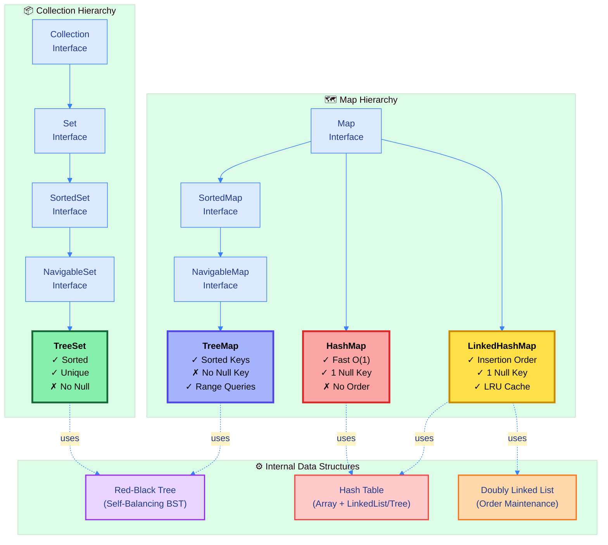
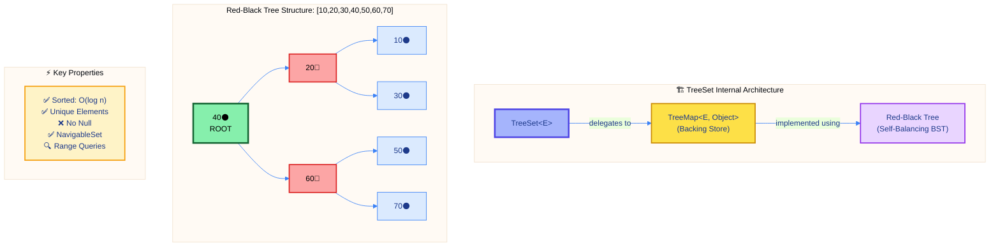
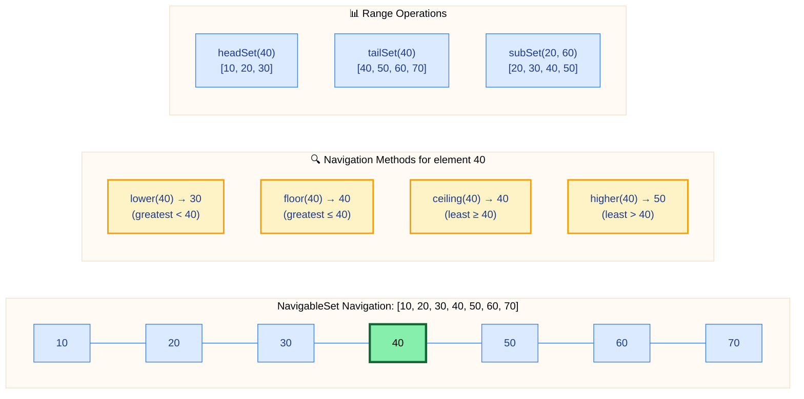
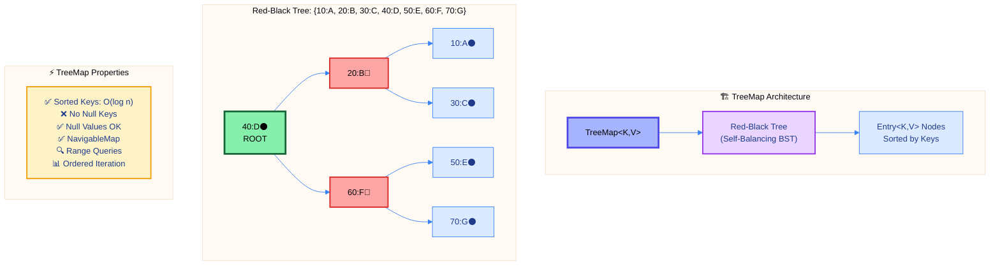
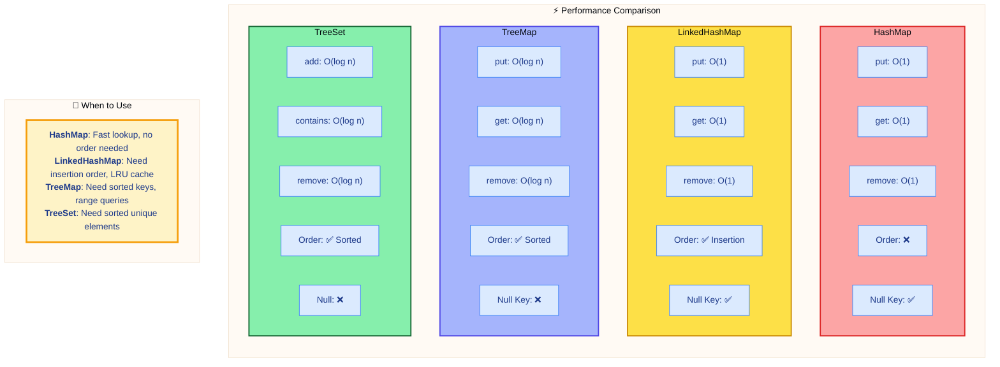
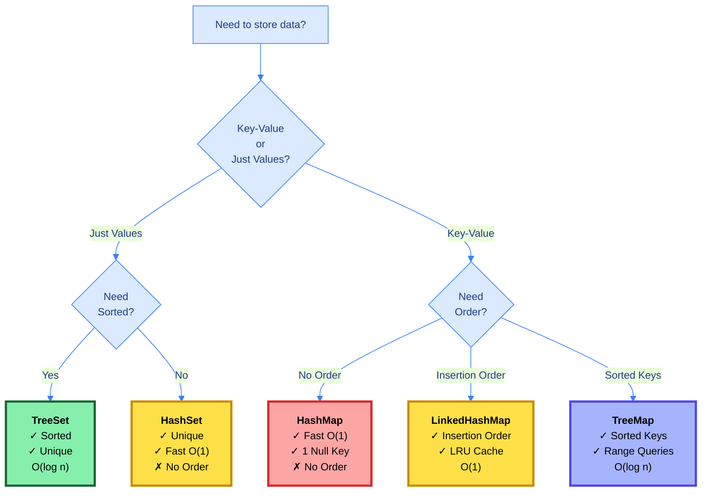

# ☕ Master Guide: TreeSet, HashMap, LinkedHashMap & TreeMap

<div align="center">


</div>

<hr style="border: 1px solid rgb(98, 117, 187)">

<div align="center">
<table>
<tr>
<td align="center">
<br />

<h3>© 2026 Avinash Dhanuka</h3>
<p>Master Guide: Java Core & Frameworks</p>
<p><em>Crafted with ❤️ for Object-Oriented Architecture</em></p>

<a href="https://github.com/Avinash-706" target="_blank">

</a>

<a href="https://mail.google.com/mail/?view=cm&fs=1&to=avunashdhanuka@gmail.com&su=Java%20Collections%20Query&body=☕%20Hello%20Avinash,%0D%0A%0D%0AMy%20name%20is%20[Your%20Name]%20and%20I%20have%20a%20doubt%20regarding%20Java%20Collections.%0D%0A%0D%0A🔹%20Topic:%20[TreeSet/HashMap/TreeMap]%0D%0A🔹%20Question:%20[Type%20your%20question]%0D%0A%0D%0AThank%20you!" target="_blank">


</a>
<br />
<br />
</td>
</tr>
</table>
</div>

> **Author's Note:** This comprehensive guide explores advanced Map and Set implementations in Java Collections Framework. Master TreeSet's sorted unique elements, HashMap's O(1) key-value operations, LinkedHashMap's insertion order preservation, and TreeMap's navigable sorted maps. Includes internal architecture, performance analysis, and real-world problem-solving patterns.

---

## 🏗️ Collections Framework Architecture



---

## 📑 Table of Contents
1.  [TreeSet - Sorted Unique Elements](#1-treeset---sorted-unique-elements)
    -   [Core Characteristics & Internal Architecture](#11-core-characteristics--internal-architecture)
    -   [Essential Operations](#12-essential-operations)
    -   [NavigableSet Methods](#13-navigableset-methods)
2.  [HashMap - Fast Key-Value Storage](#2-hashmap---fast-key-value-storage)
    -   [Internal Hashing Mechanism](#21-internal-hashing-mechanism)
    -   [Core Operations](#22-core-operations)
    -   [Advanced Patterns](#23-advanced-patterns)
3.  [LinkedHashMap - Ordered Map](#3-linkedhashmap---ordered-map)
    -   [Architecture & Order Preservation](#31-architecture--order-preservation)
    -   [LRU Cache Implementation](#32-lru-cache-implementation)
4.  [TreeMap - Sorted Navigable Map](#4-treemap---sorted-navigable-map)
    -   [Red-Black Tree Structure](#41-red-black-tree-structure)
    -   [NavigableMap Operations](#42-navigablemap-operations)
5.  [Performance Comparison Matrix](#5-performance-comparison-matrix)
6.  [Real-World Problem Solving](#6-real-world-problem-solving)
7.  [Interview Patterns & Best Practices](#7-interview-patterns--best-practices)

<div align="right">
<sub><em>Comprehensive notes by Avinash Dhanuka | For educational purposes</em></sub>
</div>

---

## 1. TREESET - Sorted Unique Elements

### 📌 Definition
**TreeSet** stores **unique elements in sorted order** using a **Red-Black Tree** (self-balancing BST). Provides O(log n) operations and powerful navigation methods through NavigableSet interface.

### 1.1 Core Characteristics & Internal Architecture



#### 📋 Characteristics Table

| Property | Value | Details |
| :--- | :--- | :--- |
| **Package** | `java.util` | Since JDK 1.2 |
| **Implements** | `NavigableSet`, `SortedSet`, `Set` | Full navigation support |
| **Data Structure** | Red-Black Tree | Self-balancing BST |
| **Null Elements** | ❌ Not Allowed | Throws NullPointerException |
| **Duplicates** | ❌ Not Allowed | Uses compareTo()/equals() |
| **Ordering** | ✅ Sorted (Ascending) | Natural or Comparator |
| **Performance** | O(log n) | add, remove, contains |

#### 🔍 Internal Implementation
```java
// TreeSet internally uses TreeMap
private transient NavigableMap<E,Object> m;
private static final Object PRESENT = new Object();

public boolean add(E e) {
    return m.put(e, PRESENT) == null;  // Element as key, PRESENT as value
}
```

---

### 1.2 Essential Operations

#### 💻 Quick Reference Example
```java
TreeSet<Integer> ts = new TreeSet<>();
ts.addAll(Arrays.asList(50, 20, 70, 10, 30, 60, 40));
System.out.println(ts);  // [10, 20, 30, 40, 50, 60, 70]

// Core operations
ts.add(30);              // false (duplicate)
ts.first();              // 10
ts.last();               // 70
ts.pollFirst();          // 10 (removes)
ts.contains(40);         // true
```

#### 📋 Method Reference

| Method | Return | Time | Description |
| :--- | :--- | :--- | :--- |
| `add(E e)` | boolean | O(log n) | Add element in sorted position |
| `remove(Object o)` | boolean | O(log n) | Remove element |
| `contains(Object o)` | boolean | O(log n) | Check existence |
| `first()` / `last()` | E | O(log n) | Get min/max element |
| `pollFirst()` / `pollLast()` | E | O(log n) | Remove & return min/max |
| `size()` | int | O(1) | Get element count |

---

### 1.3 NavigableSet Methods

#### 🎯 Navigation Operations



#### 💻 Navigation Example
```java
TreeSet<Integer> ts = new TreeSet<>(Arrays.asList(10, 20, 30, 40, 50, 60, 70));

// Navigation methods
ts.lower(40);      // 30 (< 40)
ts.floor(40);      // 40 (≤ 40)
ts.ceiling(40);    // 40 (≥ 40)
ts.higher(40);     // 50 (> 40)

// Range operations
ts.headSet(40);    // [10, 20, 30]
ts.tailSet(40);    // [40, 50, 60, 70]
ts.subSet(20, 60); // [20, 30, 40, 50]

// Reverse order
ts.descendingSet();      // [70, 60, 50, 40, 30, 20, 10]
ts.descendingIterator(); // Iterator in reverse
```

#### 🎨 Custom Comparators
```java
// Reverse order
TreeSet<Integer> reverse = new TreeSet<>(Comparator.reverseOrder());
reverse.addAll(Arrays.asList(50, 20, 70, 10));
// [70, 50, 20, 10]

// String by length
TreeSet<String> byLength = new TreeSet<>((a, b) -> 
    a.length() != b.length() ? a.length() - b.length() : a.compareTo(b)
);
byLength.addAll(Arrays.asList("Java", "C", "Python", "Go"));
// [C, Go, Java, Python]
```

---

## 2. HASHMAP - Fast Key-Value Storage

### 📌 Definition
**HashMap** provides O(1) average-time key-value storage using **hashing**. Allows one null key, multiple null values, and does not maintain any order.

### 2.1 Internal Hashing Mechanism

```mermaid
%%{init: {
  "theme": "base",
  "themeVariables": {
    "primaryColor": "#dbeafe",
    "primaryTextColor": "#1e3a8a",
    "primaryBorderColor": "#3b82f6",
    "lineColor": "#3b82f6",
    "fontSize": "14px"
  }
}}%%

graph TB
    subgraph HashMap_Architecture["🏗️ HashMap Internal Architecture"]
        HM["HashMap&lt;K,V&gt;"]
        Array["Array of Buckets<br/>(Default: 16)"]
        Bucket1["Bucket[0]<br/>LinkedList/Tree"]
        Bucket2["Bucket[1]<br/>LinkedList/Tree"]
        Bucket3["Bucket[...]"]
        BucketN["Bucket[15]<br/>LinkedList/Tree"]
        
        HM --> Array
        Array --> Bucket1
        Array --> Bucket2
        Array --> Bucket3
        Array --> BucketN
    end
    
    subgraph Hashing_Process["⚙️ Hashing Process"]
        Key["Key Object"]
        Hash["hashCode()<br/>→ hash value"]
        Index["hash % capacity<br/>→ bucket index"]
        Collision["Collision?"]
        Chain["LinkedList<br/>(size ≤ 8)"]
        Tree["Red-Black Tree<br/>(size &gt; 8)"]
        
        Key --> Hash
        Hash --> Index
        Index --> Collision
        Collision -->|Yes| Chain
        Chain -->|Treeify| Tree
        Collision -->|No| Store["Direct Storage"]
    end
    
    subgraph Node_Structure["📦 Node Structure"]
        Node["Node&lt;K,V&gt;<br/>━━━━━━━━<br/>hash: int<br/>key: K<br/>value: V<br/>next: Node"]
    end
    
    subgraph Load_Factor["📊 Load Factor & Resizing"]
        LF["Load Factor: 0.75<br/>━━━━━━━━━━━━━<br/>Threshold = capacity × 0.75<br/>When size &gt; threshold:<br/>→ Resize (double capacity)<br/>→ Rehash all entries"]
    end
    
    style HM fill:#fca5a5,stroke:#dc2626,stroke-width:3px,color:#000
    style Array fill:#fde047,stroke:#ca8a04,stroke-width:2px
    style Chain fill:#a5b4fc,stroke:#4f46e5,stroke-width:2px
    style Tree fill:#86efac,stroke:#166534,stroke-width:2px
    style Node fill:#e9d5ff,stroke:#9333ea,stroke-width:2px
    style LF fill:#fef3c7,stroke:#f59e0b,stroke-width:2px
```



#### 📋 Characteristics

| Property | Value | Details |
| :--- | :--- | :--- |
| **Package** | `java.util` | Since JDK 1.2 |
| **Data Structure** | Hash Table | Array + LinkedList/Tree |
| **Null Key** | ✅ One allowed | Stored at bucket[0] |
| **Null Values** | ✅ Multiple allowed | No restriction |
| **Order** | ❌ No order | Random bucket placement |
| **Performance** | O(1) average | O(n) worst case |
| **Load Factor** | 0.75 default | Resize trigger |

#### 🔍 How Hashing Works
```java
// Simplified internal process
int hash = key.hashCode();
int index = hash % capacity;  // Find bucket
Node<K,V> node = buckets[index];  // Get bucket

// Collision handling (Java 8+)
if (bucket.size() <= 8) {
    // Use LinkedList
} else {
    // Convert to Red-Black Tree (Treeify)
}
```

---

### 2.2 Core Operations

#### 💻 Essential Example
```java
Map<Integer, String> map = new HashMap<>();

// Basic operations
map.put(1, "Java");
map.put(2, "Python");
map.put(3, "JavaScript");
map.put(2, "Kotlin");        // Replaces "Python"
map.put(null, "NullKey");    // One null key allowed
map.put(4, null);            // Multiple null values OK

// Retrieval
map.get(1);                  // "Java"
map.getOrDefault(10, "N/A"); // "N/A"

// Checks
map.containsKey(3);          // true
map.containsValue("Java");   // true

// Modern methods (Java 8+)
map.putIfAbsent(5, "Ruby");  // Adds only if absent
map.replace(1, "Java 17");   // Replaces if present
map.remove(3);               // Removes entry

// Iteration
map.forEach((k, v) -> System.out.println(k + " => " + v));
```

#### 📋 Method Reference

| Method | Return | Time | Description |
| :--- | :--- | :--- | :--- |
| `put(K, V)` | V | O(1) | Add/update entry |
| `get(Object)` | V | O(1) | Get value by key |
| `remove(Object)` | V | O(1) | Remove entry |
| `containsKey(Object)` | boolean | O(1) | Check key exists |
| `containsValue(Object)` | boolean | O(n) | Check value exists |
| `putIfAbsent(K, V)` | V | O(1) | Add if key absent |
| `getOrDefault(K, V)` | V | O(1) | Get or return default |
| `keySet()` | Set<K> | O(1) | Get all keys |
| `values()` | Collection<V> | O(1) | Get all values |
| `entrySet()` | Set<Entry<K,V>> | O(1) | Get all entries |

---

### 2.3 Advanced Patterns

#### 1️⃣ Frequency Counter
```java
String text = "hello world";
Map<Character, Integer> freq = new HashMap<>();
for (char c : text.toCharArray()) {
    if (c != ' ') freq.put(c, freq.getOrDefault(c, 0) + 1);
}
// {d=1, e=1, h=1, l=3, o=2, r=1, w=1}
```

#### 2️⃣ Merge Operations
```java
Map<String, Integer> map1 = new HashMap<>(Map.of("A", 10, "B", 20));
Map<String, Integer> map2 = new HashMap<>(Map.of("B", 25, "C", 30));

// Merge with sum
map2.forEach((k, v) -> map1.merge(k, v, Integer::sum));
// {A=10, B=45, C=30}
```

#### 3️⃣ Compute Methods
```java
Map<String, Integer> scores = new HashMap<>(Map.of("Alice", 85, "Bob", 90));

scores.compute("Alice", (k, v) -> v + 10);           // 95
scores.computeIfPresent("Bob", (k, v) -> v + 5);     // 95
scores.computeIfAbsent("Charlie", k -> 80);          // 80
```

#### 4️⃣ Nested HashMap
```java
Map<String, Map<String, Integer>> studentGrades = new HashMap<>();
studentGrades.put("Alice", new HashMap<>(Map.of("Math", 90, "Science", 85)));
studentGrades.put("Bob", new HashMap<>(Map.of("Math", 78, "Science", 92)));

// Access: studentGrades.get("Alice").get("Math") → 90
```

#### 5️⃣ Conditional Operations
```java
Map<Integer, String> items = new HashMap<>(Map.of(1, "A", 2, "B", 3, "C", 4, "D"));

// Remove even keys
items.entrySet().removeIf(e -> e.getKey() % 2 == 0);  // {1=A, 3=C}

// Transform all values
Map<String, Integer> prices = new HashMap<>(Map.of("Apple", 100, "Banana", 50));
prices.replaceAll((k, v) -> (int)(v * 0.9));  // 10% discount
```


---

## 3. LINKEDHASHMAP - Ordered Map

### 📌 Definition
**LinkedHashMap** extends HashMap with **insertion order preservation** using a doubly-linked list. Perfect for LRU caches and order-sensitive operations.

### 3.1 Architecture & Order Preservation

```mermaid
%%{init: {
  "theme": "base",
  "themeVariables": {
    "primaryColor": "#dbeafe",
    "primaryTextColor": "#1e3a8a",
    "primaryBorderColor": "#3b82f6",
    "lineColor": "#3b82f6",
    "fontSize": "14px"
  }
}}%%

graph TB
    subgraph LinkedHashMap_Architecture["🏗️ LinkedHashMap Architecture"]
        LHM["LinkedHashMap&lt;K,V&gt;"]
        HT["Hash Table<br/>(from HashMap)"]
        DLL["Doubly Linked List<br/>(Order Maintenance)"]
        
        LHM --> HT
        LHM --> DLL
    end
    
    subgraph Insertion_Order["📊 Insertion Order Example"]
        direction LR
        Head["HEAD"] --> N1["Entry(5,Five)"]
        N1 <--> N2["Entry(1,One)"]
        N2 <--> N3["Entry(3,Three)"]
        N3 <--> N4["Entry(2,Two)"]
        N4 --> Tail["TAIL"]
    end
    
    subgraph Access_Order["🔄 Access Order (LRU)"]
        direction LR
        AHead["HEAD"] --> A1["Least Recently<br/>Used"]
        A1 <--> A2["..."]
        A2 <--> A3["..."]
        A3 <--> A4["Most Recently<br/>Used"]
        A4 --> ATail["TAIL"]
    end
    
    subgraph Comparison["⚖️ HashMap vs LinkedHashMap"]
        Comp["HashMap: {1=One, 2=Two, 3=Three}<br/>(Random order)<br/><br/>LinkedHashMap: {5=Five, 1=One, 3=Three, 2=Two}<br/>(Insertion order preserved)"]
    end
    
    style LHM fill:#fde047,stroke:#ca8a04,stroke-width:3px,color:#000
    style HT fill:#fca5a5,stroke:#dc2626,stroke-width:2px
    style DLL fill:#a5b4fc,stroke:#4f46e5,stroke-width:2px
    style N1 fill:#86efac,stroke:#166534,stroke-width:2px
    style N2 fill:#86efac,stroke:#166534,stroke-width:2px
    style N3 fill:#86efac,stroke:#166534,stroke-width:2px
    style N4 fill:#86efac,stroke:#166534,stroke-width:2px
    style Comp fill:#fef3c7,stroke:#f59e0b,stroke-width:2px
```



#### 📋 Characteristics

| Property | Value | Details |
| :--- | :--- | :--- |
| **Extends** | HashMap | Inherits all HashMap features |
| **Order** | ✅ Insertion Order | Or access order (LRU) |
| **Null Key** | ✅ One allowed | Same as HashMap |
| **Performance** | O(1) | Slightly slower than HashMap |
| **Use Case** | Order matters | LRU cache, predictable iteration |

#### 💻 Basic Example
```java
Map<Integer, String> lhm = new LinkedHashMap<>();
lhm.put(5, "Five");
lhm.put(1, "One");
lhm.put(3, "Three");
lhm.put(2, "Two");

System.out.println(lhm);  // {5=Five, 1=One, 3=Three, 2=Two} - Order preserved!

// Compare with HashMap
Map<Integer, String> hm = new HashMap<>();
hm.put(5, "Five");
hm.put(1, "One");
hm.put(3, "Three");
hm.put(2, "Two");

System.out.println(hm);  // Random order
```

---

### 3.2 LRU Cache Implementation

#### 💻 LRU Cache Pattern
```java
// LRU Cache with max size 3
Map<Integer, String> lruCache = new LinkedHashMap<>(16, 0.75f, true) {
    @Override
    protected boolean removeEldestEntry(Map.Entry<Integer, String> eldest) {
        return size() > 3;  // Keep only 3 entries
    }
};

lruCache.put(1, "One");
lruCache.put(2, "Two");
lruCache.put(3, "Three");
System.out.println(lruCache);  // {1=One, 2=Two, 3=Three}

lruCache.get(1);  // Access 1 (moves to end)
System.out.println(lruCache);  // {2=Two, 3=Three, 1=One}

lruCache.put(4, "Four");  // Removes 2 (least recently used)
System.out.println(lruCache);  // {3=Three, 1=One, 4=Four}
```

#### 🎯 Real-World Applications
- **Browser History**: Maintain visit order
- **Recent Files**: Track recently opened files
- **Configuration Settings**: Preserve definition order
- **Menu Systems**: Display items in order
- **Task Queues**: Process in submission order

---

## 4. TREEMAP - Sorted Navigable Map

### 📌 Definition
**TreeMap** provides **sorted key-value pairs** using a Red-Black Tree. Implements NavigableMap for powerful range queries and navigation.

### 4.1 Red-Black Tree Structure



#### 📋 Characteristics

| Property | Value | Details |
| :--- | :--- | :--- |
| **Implements** | NavigableMap | Full navigation support |
| **Data Structure** | Red-Black Tree | Self-balancing BST |
| **Null Key** | ❌ Not Allowed | NullPointerException |
| **Null Values** | ✅ Allowed | No restriction |
| **Ordering** | ✅ Sorted Keys | Natural or Comparator |
| **Performance** | O(log n) | All operations |

---

### 4.2 NavigableMap Operations

#### 💻 Essential Example
```java
TreeMap<Integer, String> tm = new TreeMap<>();
tm.put(5, "Five");
tm.put(1, "One");
tm.put(3, "Three");
tm.put(2, "Two");
tm.put(4, "Four");

System.out.println(tm);  // {1=One, 2=Two, 3=Three, 4=Four, 5=Five}

// Navigation methods
tm.firstKey();           // 1
tm.lastKey();            // 5
tm.lowerKey(3);          // 2 (< 3)
tm.floorKey(3);          // 3 (≤ 3)
tm.ceilingKey(3);        // 3 (≥ 3)
tm.higherKey(3);         // 4 (> 3)

// Range operations
tm.headMap(3);           // {1=One, 2=Two}
tm.tailMap(3);           // {3=Three, 4=Four, 5=Five}
tm.subMap(2, 5);         // {2=Two, 3=Three, 4=Four}

// Reverse order
tm.descendingMap();      // {5=Five, 4=Four, 3=Three, 2=Two, 1=One}
```

#### 🎯 Real-World Applications
- **Leaderboards**: Sorted by score
- **Event Timelines**: Sorted by timestamp
- **Price Lists**: Sorted by price
- **Range Queries**: Find entries in range
- **Sorted Dictionaries**: Alphabetical order

#### 🎨 Custom Comparators
```java
// Reverse order
TreeMap<Integer, String> reverse = new TreeMap<>(Comparator.reverseOrder());

// String keys by length
TreeMap<String, Integer> byLength = new TreeMap<>((a, b) -> 
    a.length() != b.length() ? a.length() - b.length() : a.compareTo(b)
);
```

---

## 5. Performance Comparison Matrix



### 📊 Detailed Comparison Table

| Feature | HashMap | LinkedHashMap | TreeMap | TreeSet |
| :--- | :---: | :---: | :---: | :---: |
| **Order** | ❌ None | ✅ Insertion | ✅ Sorted | ✅ Sorted |
| **Null Key** | ✅ One | ✅ One | ❌ No | ❌ No |
| **Null Values** | ✅ Multiple | ✅ Multiple | ✅ Multiple | N/A |
| **put/add** | O(1) | O(1) | O(log n) | O(log n) |
| **get/contains** | O(1) | O(1) | O(log n) | O(log n) |
| **remove** | O(1) | O(1) | O(log n) | O(log n) |
| **Memory** | Low | Medium | High | High |
| **Use Case** | Fast lookup | Order matters | Sorted keys | Sorted unique |

---

## 6. Real-World Problem Solving

### 🎯 Common Patterns

#### 1️⃣ Find First Non-Repeating Character
```java
String s = "swiss";
Set<Character> unique = new LinkedHashSet<>();
Set<Character> repeated = new HashSet<>();

for (char c : s.toCharArray()) {
    if (!repeated.contains(c)) {
        if (!unique.add(c)) {
            unique.remove(c);
            repeated.add(c);
        }
    }
}

char result = unique.iterator().next();  // 'w'
```

#### 2️⃣ Count Unique Elements
```java
List<Integer> list = Arrays.asList(10, 12, 13, 12, 14, 14, 15, 11, 10);
Set<Integer> unique = new HashSet<>(list);
System.out.println("Unique count: " + unique.size());  // 6
```

#### 3️⃣ Find Common Elements
```java
List<Integer> l1 = Arrays.asList(10, 12, 13, 14, 15);
List<Integer> l2 = Arrays.asList(10, 22, 12, 14, 25);

Set<Integer> set = new HashSet<>(l1);
set.retainAll(l2);  // Intersection
System.out.println(set);  // [10, 12, 14]
```

#### 4️⃣ Set Operations
```java
Set<Integer> setA = new HashSet<>(Arrays.asList(1, 2, 3, 4, 5));
Set<Integer> setB = new HashSet<>(Arrays.asList(3, 4, 5, 6, 7));

// Union
Set<Integer> union = new HashSet<>(setA);
union.addAll(setB);  // [1, 2, 3, 4, 5, 6, 7]

// Intersection
Set<Integer> intersection = new HashSet<>(setA);
intersection.retainAll(setB);  // [3, 4, 5]

// Difference
Set<Integer> difference = new HashSet<>(setA);
difference.removeAll(setB);  // [1, 2]
```

#### 5️⃣ Remove Even Numbers
```java
Set<Integer> set = new HashSet<>(Arrays.asList(1, 2, 3, 4, 5, 6));
set.removeIf(n -> n % 2 == 0);
System.out.println(set);  // [1, 3, 5]
```

---

## 7. Interview Patterns & Best Practices

### 🎓 Key Interview Concepts

#### 1️⃣ When to Use Which?



#### 2️⃣ Common Mistakes to Avoid

| ❌ Mistake | ✅ Correct Approach |
| :--- | :--- |
| Using TreeSet/TreeMap with null | Use HashMap/HashSet for null support |
| Not overriding hashCode()/equals() | Always override both for custom objects |
| Using HashMap when order matters | Use LinkedHashMap for insertion order |
| Using TreeMap for fast lookup | Use HashMap for O(1) operations |
| Modifying keys after insertion | Keys should be immutable |

#### 3️⃣ Performance Tips

1. **HashMap**: Best for fast lookup, no order needed
2. **LinkedHashMap**: Use for LRU cache, predictable iteration
3. **TreeMap**: Use for sorted keys, range queries
4. **TreeSet**: Use for sorted unique elements
5. **Initial Capacity**: Set if size known to avoid resizing

#### 4️⃣ Thread Safety

```java
// Synchronized wrappers
Map<K, V> syncMap = Collections.synchronizedMap(new HashMap<>());
Set<E> syncSet = Collections.synchronizedSet(new HashSet<>());

// Concurrent alternatives
ConcurrentHashMap<K, V> concurrentMap = new ConcurrentHashMap<>();
```

---

## 📚 Summary

### Quick Reference Card

| Collection | Order | Null | Performance | Use When |
| :--- | :--- | :--- | :--- | :--- |
| **TreeSet** | Sorted | ❌ | O(log n) | Sorted unique elements |
| **HashMap** | None | ✅ | O(1) | Fast key-value lookup |
| **LinkedHashMap** | Insertion | ✅ | O(1) | Order matters, LRU cache |
| **TreeMap** | Sorted | ❌ Key | O(log n) | Sorted keys, range queries |

### Key Takeaways

1. **TreeSet**: Red-Black Tree, sorted unique elements, O(log n)
2. **HashMap**: Hash Table, fast O(1) operations, no order
3. **LinkedHashMap**: HashMap + Doubly Linked List, insertion order
4. **TreeMap**: Red-Black Tree, sorted keys, NavigableMap operations
5. **Choose based on**: Performance needs, ordering requirements, null support

---

<div align="center">

### 🎯 Master These Concepts

**TreeSet** → Sorted unique elements with navigation  
**HashMap** → Fast key-value storage  
**LinkedHashMap** → Ordered map with LRU support  
**TreeMap** → Sorted navigable key-value pairs

---

<sub>**© 2026 Avinash Dhanuka** | Java Collections Framework Master Guide</sub>

<sub>📧 [avunashdhanuka@gmail.com](mailto:avunashdhanuka@gmail.com) | 🔗 [GitHub: Avinash-706](https://github.com/Avinash-706)</sub>

</div>
