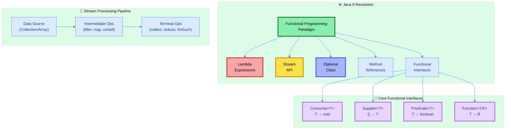
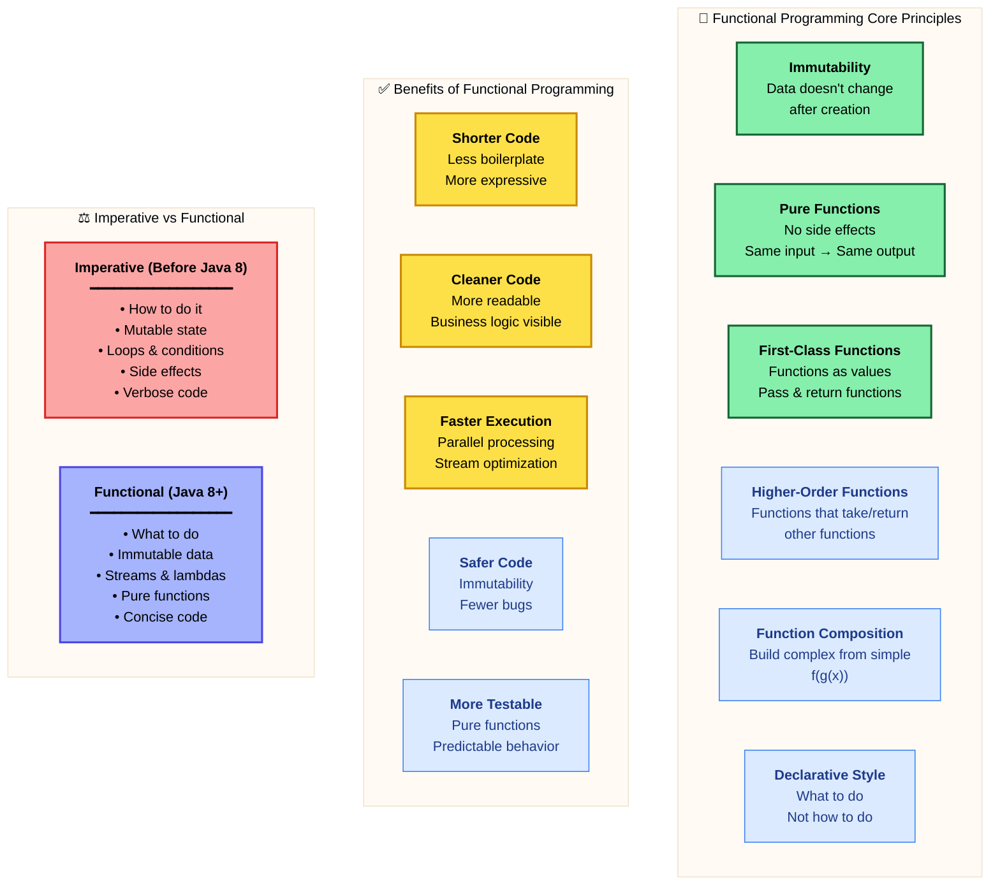
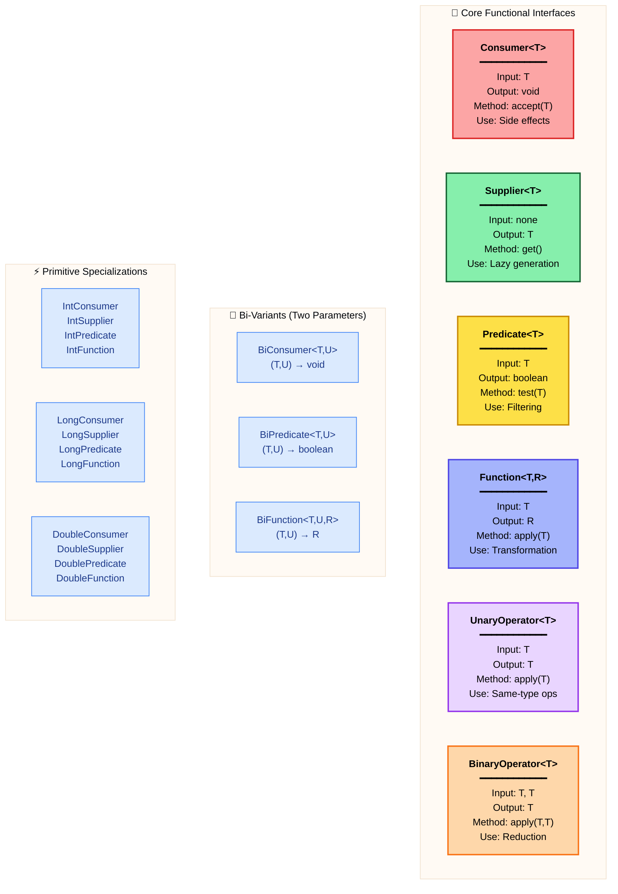
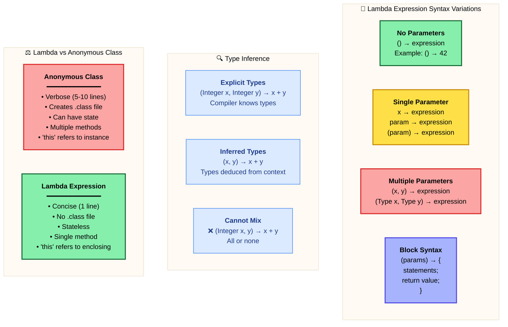
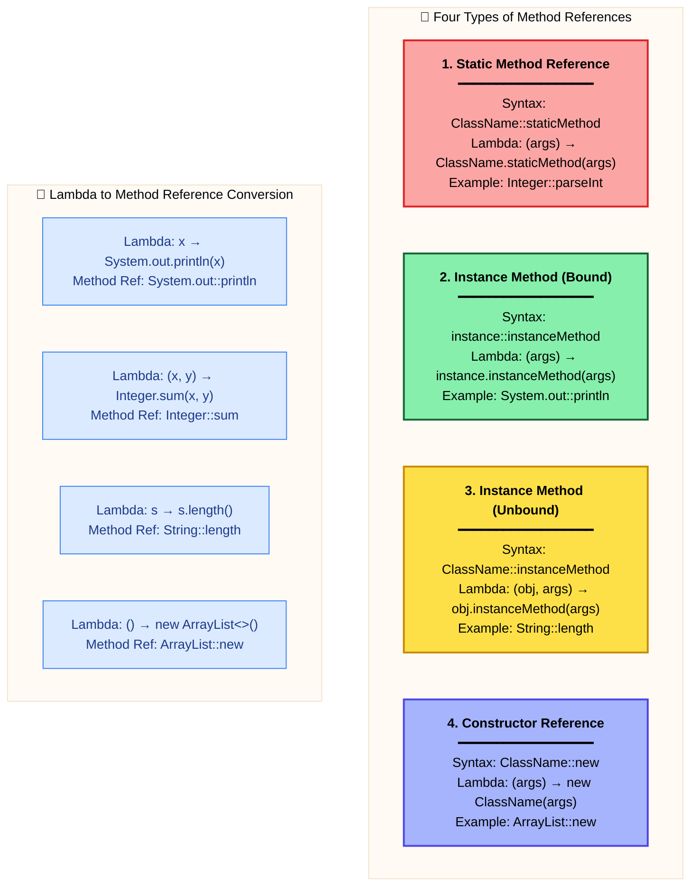
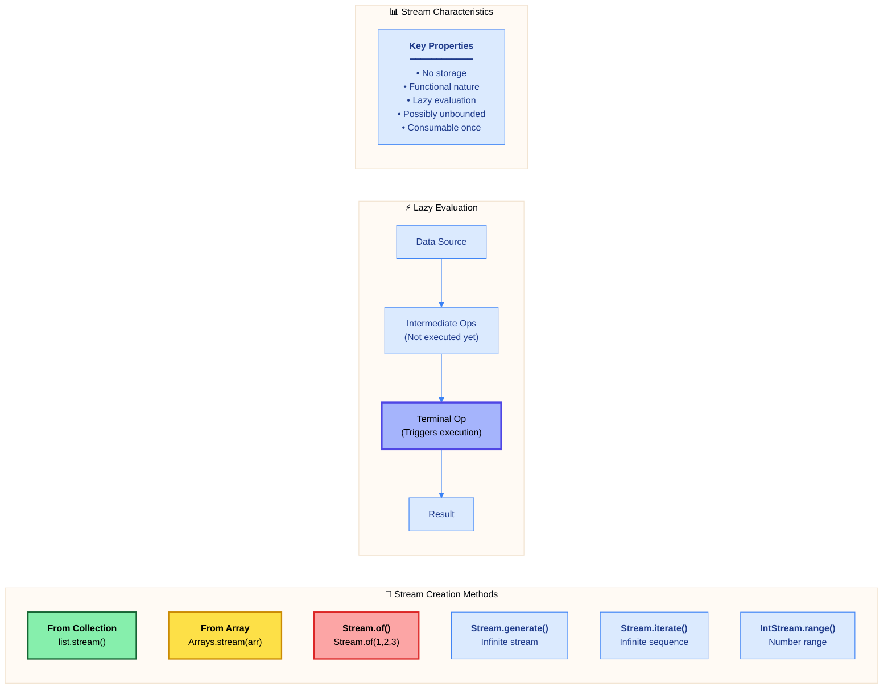
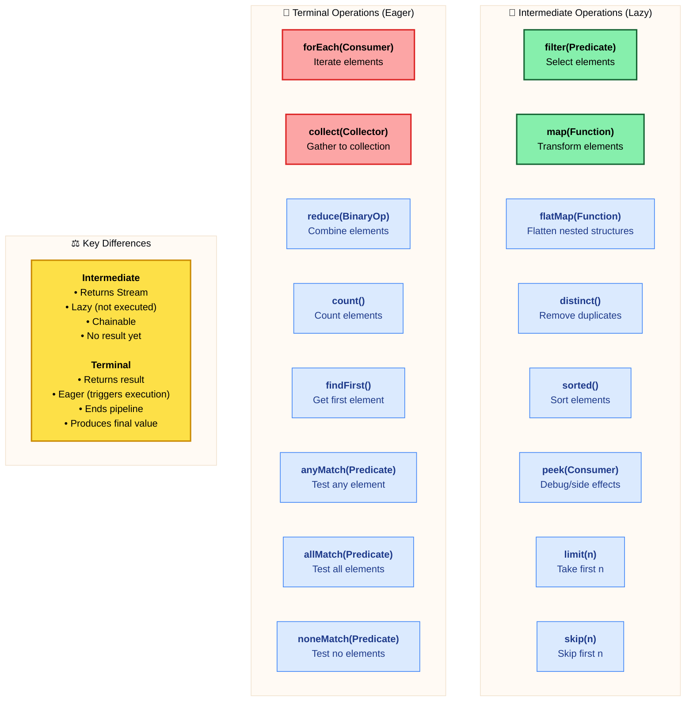

# ☕ Master Guide: Advanced Functional Programming in Java 8+

<div align="center">


</div>

<hr style="border: 1px solid rgb(98, 117, 187)">

<div align="center">
<table>
<tr>
<td align="center">
<br />

<h3>© 2026 Avinash Dhanuka</h3>
<p>Master Guide: Java Functional Programming</p>
<p><em>Crafted with ❤️ for Modern Java Development</em></p>

<a href="https://github.com/Avinash-706" target="_blank">

</a>

<a href="https://mail.google.com/mail/?view=cm&fs=1&to=avunashdhanuka@gmail.com&su=Java%20Functional%20Programming%20Query&body=☕%20Hello%20Avinash,%0D%0A%0D%0AMy%20name%20is%20[Your%20Name]%20and%20I%20have%20a%20doubt%20regarding%20Java%20Functional%20Programming.%0D%0A%0D%0A🔹%20Topic:%20[Lambda/Stream/Optional]%0D%0A🔹%20Question:%20[Type%20your%20question]%0D%0A%0D%0AThank%20you!" target="_blank">


</a>
<br />
<br />
</td>
</tr>
</table>
</div>

> **Author's Note:** This comprehensive guide explores the revolutionary functional programming paradigm introduced in Java 8+. Master Lambda Expressions, Stream API, Method References, Optional class, and advanced functional interfaces. Includes theoretical foundations, architectural insights, performance analysis, and real-world design patterns from basic to expert level.

---

## 🏗️ Functional Programming Architecture



---

## 📑 Table of Contents
1.  [Functional Programming Fundamentals](#1-functional-programming-fundamentals)
    -   [Core Principles & Philosophy](#11-core-principles--philosophy)
    -   [Why Java Embraced Functional Programming](#12-why-java-embraced-functional-programming)
2.  [Functional Interfaces Deep Dive](#2-functional-interfaces-deep-dive)
    -   [Predefined Functional Interfaces](#21-predefined-functional-interfaces)
    -   [Custom Functional Interfaces](#22-custom-functional-interfaces)
3.  [Lambda Expressions Mastery](#3-lambda-expressions-mastery)
    -   [Syntax Variations & Type Inference](#31-syntax-variations--type-inference)
    -   [Variable Capture & Limitations](#32-variable-capture--limitations)
4.  [Method References Complete](#4-method-references-complete)
    -   [Four Types of Method References](#41-four-types-of-method-references)
    -   [When to Use Method References vs Lambdas](#42-when-to-use-method-references-vs-lambdas)
5.  [Stream API Architecture](#5-stream-api-architecture)
    -   [Stream Creation & Lazy Evaluation](#51-stream-creation--lazy-evaluation)
    -   [Intermediate vs Terminal Operations](#52-intermediate-vs-terminal-operations)
    -   [Advanced Collectors & Grouping](#53-advanced-collectors--grouping)
6.  [Optional Class Philosophy](#6-optional-class-philosophy)
    -   [Null Safety Patterns](#61-null-safety-patterns)
    -   [Transformation & Chaining](#62-transformation--chaining)
7.  [Advanced Functional Patterns](#7-advanced-functional-patterns)
    -   [Higher-Order Functions & Currying](#71-higher-order-functions--currying)
    -   [Function Composition & Monads](#72-function-composition--monads)
8.  [Performance & Best Practices](#8-performance--best-practices)
9.  [Real-World Design Patterns](#9-real-world-design-patterns)

<div align="right">
<sub><em>Comprehensive notes by Avinash Dhanuka | For educational purposes</em></sub>
</div>

---

## 1. FUNCTIONAL PROGRAMMING FUNDAMENTALS

### 📌 Definition
**Functional Programming** is a programming paradigm that treats computation as the evaluation of mathematical functions, avoiding changing state and mutable data. It emphasizes **what to do** rather than **how to do it**.

### 1.1 Core Principles & Philosophy




#### 📋 Core Principles Table

| Principle | Description | Java 8+ Feature |
| :--- | :--- | :--- |
| **Immutability** | Data doesn't change after creation | Final variables, Immutable collections |
| **Pure Functions** | No side effects, deterministic output | Lambda expressions, Method references |
| **First-Class Functions** | Functions as values | Functional interfaces |
| **Higher-Order Functions** | Functions that take/return functions | Function<T,R>, BiFunction<T,U,R> |
| **Function Composition** | Combine simple functions | andThen(), compose() |
| **Declarative Style** | Express what, not how | Stream API operations |

---

### 1.2 Why Java Embraced Functional Programming

#### 🎯 Evolution of Java

| Era | Paradigm | Characteristics |
| :--- | :--- | :--- |
| **Java 1-7** | Object-Oriented | Classes, objects, inheritance, polymorphism |
| **Java 8+** | Multi-Paradigm | OOP + Functional Programming |
| **Modern Java** | Hybrid Approach | Best of both worlds |

#### 💡 Key Motivations

1. **Conciseness**: Reduce boilerplate code significantly
2. **Readability**: Make business logic more visible
3. **Performance**: Enable parallel processing with streams
4. **Modernization**: Compete with functional languages (Scala, Kotlin)
5. **Productivity**: Write less code, achieve more

#### 📊 Code Comparison: Before vs After Java 8

**Scenario**: Filter even numbers and double them

**Before Java 8 (Imperative)**:
```java
List<Integer> numbers = Arrays.asList(1, 2, 3, 4, 5);
List<Integer> result = new ArrayList<>();
for (Integer num : numbers) {
    if (num % 2 == 0) {
        result.add(num * 2);
    }
}
// Result: [4, 8]
```

**After Java 8 (Functional)**:
```java
List<Integer> numbers = Arrays.asList(1, 2, 3, 4, 5);
List<Integer> result = numbers.stream()
                              .filter(n -> n % 2 == 0)
                              .map(n -> n * 2)
                              .collect(Collectors.toList());
// Result: [4, 8]
```

**Benefits**: 
- 7 lines → 4 lines (43% reduction)
- No mutable state
- More readable
- Easily parallelizable

---

## 2. FUNCTIONAL INTERFACES DEEP DIVE

### 📌 Definition
A **Functional Interface** is an interface with **exactly one abstract method** (SAM - Single Abstract Method). It can have multiple default and static methods but only one abstract method that lambda expressions implement.

### 2.1 Predefined Functional Interfaces



#### 📋 Functional Interfaces Comparison

| Interface | Input | Output | Method | Common Use Case |
| :--- | :---: | :---: | :--- | :--- |
| **Consumer<T>** | T | void | accept(T) | Printing, logging, side effects |
| **Supplier<T>** | none | T | get() | Lazy initialization, factory |
| **Predicate<T>** | T | boolean | test(T) | Filtering, validation |
| **Function<T,R>** | T | R | apply(T) | Transformation, mapping |
| **UnaryOperator<T>** | T | T | apply(T) | Same-type transformation |
| **BinaryOperator<T>** | T, T | T | apply(T,T) | Reduction, aggregation |
| **BiConsumer<T,U>** | T, U | void | accept(T,U) | Map iteration |
| **BiPredicate<T,U>** | T, U | boolean | test(T,U) | Two-param validation |
| **BiFunction<T,U,R>** | T, U | R | apply(T,U) | Two-param transformation |

#### 🎯 Detailed Interface Characteristics

**1. Consumer<T> - Consumes input, returns nothing**
- **Purpose**: Perform operations with side effects
- **Chaining**: `andThen(Consumer)`
- **Example**: `forEach(System.out::println)`

**2. Supplier<T> - Supplies output, takes no input**
- **Purpose**: Lazy value generation
- **Use Case**: Factory methods, deferred execution
- **Example**: `Optional.orElseGet(Supplier)`

**3. Predicate<T> - Tests condition, returns boolean**
- **Purpose**: Filtering and validation
- **Chaining**: `and()`, `or()`, `negate()`
- **Example**: `filter(n -> n > 0)`

**4. Function<T,R> - Transforms input to output**
- **Purpose**: Data transformation
- **Chaining**: `andThen()`, `compose()`
- **Example**: `map(String::length)`

**5. UnaryOperator<T> - Special Function where T = R**
- **Purpose**: Same-type transformations
- **Example**: `replaceAll(String::toUpperCase)`

**6. BinaryOperator<T> - Special BiFunction where T = U = R**
- **Purpose**: Reduction operations
- **Example**: `reduce(Integer::sum)`

---

### 2.2 Custom Functional Interfaces

#### 🔍 @FunctionalInterface Annotation

**Purpose**: Compile-time safety for functional interfaces

**Benefits**:
- Prevents accidental addition of multiple abstract methods
- Improves code readability and intent
- Enables better IDE support

**Rules**:
- Optional but highly recommended
- Interface must have exactly one abstract method
- Can have multiple default and static methods

**Example**:
```java
@FunctionalInterface
interface Calculator {
    int calculate(int a, int b);  // Single abstract method
    
    default void info() {
        System.out.println("Calculator Interface");
    }
    
    static void version() {
        System.out.println("Version 1.0");
    }
}

// Usage
Calculator add = (a, b) -> a + b;
Calculator multiply = (a, b) -> a * b;
```

---

## 3. LAMBDA EXPRESSIONS MASTERY

### 📌 Definition
A **Lambda Expression** is an anonymous function that provides a concise way to implement functional interfaces without creating separate classes.

### 3.1 Syntax Variations & Type Inference




#### 📋 Lambda Syntax Reference

| Syntax | Example | Use Case |
| :--- | :--- | :--- |
| **No parameters** | `() -> 42` | Runnable, Supplier |
| **Single parameter (no parens)** | `x -> x * 2` | Function, Predicate |
| **Single parameter (with parens)** | `(x) -> x * 2` | Same as above |
| **Multiple parameters** | `(x, y) -> x + y` | BiFunction, Comparator |
| **Explicit types** | `(Integer x) -> x * 2` | When clarity needed |
| **Block body** | `x -> { return x * 2; }` | Multiple statements |
| **Block with void** | `x -> { System.out.println(x); }` | Consumer |

---

### 3.2 Variable Capture & Limitations

#### 🔒 Variable Capture Rules

**Effectively Final**: Variables used in lambdas must be effectively final (not modified after initialization)

**Why?**: Lambdas can be executed in different contexts (threads, later time), so captured variables must be immutable for thread safety.

**Example**:
```java
int multiplier = 10;  // Effectively final
Function<Integer, Integer> multiply = x -> x * multiplier;  // ✅ OK

multiplier = 20;  // ❌ Compilation error - not effectively final
```

#### ⚠️ Lambda Limitations

| Limitation | Reason | Alternative |
| :--- | :--- | :--- |
| **Cannot use with abstract classes** | May have multiple abstract methods | Use anonymous class |
| **Cannot use with regular classes** | Lambdas only for interfaces | Use anonymous class |
| **Cannot use with multi-method interfaces** | Compiler can't determine target method | Use @FunctionalInterface |
| **Cannot modify captured variables** | Thread safety concerns | Use final wrapper or AtomicInteger |
| **Cannot throw checked exceptions** | Functional interface doesn't declare | Wrap in RuntimeException |

---

## 4. METHOD REFERENCES COMPLETE

### 📌 Definition
**Method References** are shorthand notation for lambda expressions that call a single method. They make code more readable when lambda simply delegates to an existing method.

### 4.1 Four Types of Method References



#### 📋 Method Reference Types Comparison

| Type | Syntax | Lambda Equivalent | Example |
| :--- | :--- | :--- | :--- |
| **Static** | `ClassName::staticMethod` | `(args) -> ClassName.staticMethod(args)` | `Integer::parseInt` |
| **Bound Instance** | `instance::instanceMethod` | `(args) -> instance.instanceMethod(args)` | `System.out::println` |
| **Unbound Instance** | `ClassName::instanceMethod` | `(obj, args) -> obj.instanceMethod(args)` | `String::toUpperCase` |
| **Constructor** | `ClassName::new` | `(args) -> new ClassName(args)` | `ArrayList::new` |

---

### 4.2 When to Use Method References vs Lambdas

#### ✅ Use Method References When:
- Lambda simply calls an existing method
- No additional logic or transformation
- Improves readability

#### ✅ Use Lambdas When:
- Need additional logic beyond method call
- Multiple statements required
- Method reference would be less clear

#### 📊 Readability Comparison

| Scenario | Lambda | Method Reference | Winner |
| :--- | :--- | :--- | :---: |
| Print each element | `x -> System.out.println(x)` | `System.out::println` | Method Ref |
| Parse string to int | `s -> Integer.parseInt(s)` | `Integer::parseInt` | Method Ref |
| Get string length | `s -> s.length()` | `String::length` | Method Ref |
| Complex logic | `x -> { if (x > 0) return x * 2; else return 0; }` | N/A | Lambda |
| With transformation | `x -> process(x.trim())` | N/A | Lambda |

---

## 5. STREAM API ARCHITECTURE

### 📌 Definition
**Stream API** provides a declarative approach to process collections of data. Streams support functional-style operations on sequences of elements, enabling powerful data processing pipelines.

### 5.1 Stream Creation & Lazy Evaluation



#### 🎯 Stream Creation Examples

**From Collections**:
```java
List<String> list = Arrays.asList("a", "b", "c");
Stream<String> stream = list.stream();
```

**From Arrays**:
```java
String[] array = {"a", "b", "c"};
Stream<String> stream = Arrays.stream(array);
```

**Using Stream.of()**:
```java
Stream<Integer> stream = Stream.of(1, 2, 3, 4, 5);
```

**Infinite Streams**:
```java
Stream<Integer> infinite = Stream.iterate(0, n -> n + 2);  // 0, 2, 4, 6...
Stream<Double> random = Stream.generate(Math::random);
```

**Range Streams**:
```java
IntStream range = IntStream.range(1, 10);  // 1 to 9
IntStream rangeClosed = IntStream.rangeClosed(1, 10);  // 1 to 10
```

---

### 5.2 Intermediate vs Terminal Operations



#### 📋 Operations Comparison Table

| Category | Operation | Returns | Execution | Purpose |
| :--- | :--- | :---: | :---: | :--- |
| **Intermediate** | filter() | Stream | Lazy | Select elements |
| **Intermediate** | map() | Stream | Lazy | Transform elements |
| **Intermediate** | flatMap() | Stream | Lazy | Flatten nested |
| **Intermediate** | distinct() | Stream | Lazy | Remove duplicates |
| **Intermediate** | sorted() | Stream | Lazy | Sort elements |
| **Intermediate** | limit() | Stream | Lazy | Take first n |
| **Terminal** | forEach() | void | Eager | Iterate |
| **Terminal** | collect() | Collection | Eager | Gather results |
| **Terminal** | reduce() | Optional/Value | Eager | Combine |
| **Terminal** | count() | long | Eager | Count |
| **Terminal** | findFirst() | Optional | Eager | Get first |
| **Terminal** | anyMatch() | boolean | Eager | Test condition |

---

### 5.3 Advanced Collectors & Grouping


#### 📋 Advanced Collectors

| Collector | Purpose | Example |
| :--- | :--- | :--- |
| **toList()** | Collect to List | `collect(Collectors.toList())` |
| **toSet()** | Collect to Set | `collect(Collectors.toSet())` |
| **toMap()** | Collect to Map | `collect(Collectors.toMap(k, v))` |
| **groupingBy()** | Group by key | `collect(Collectors.groupingBy(Person::getAge))` |
| **partitioningBy()** | Split by condition | `collect(Collectors.partitioningBy(n -> n > 0))` |
| **joining()** | Join strings | `collect(Collectors.joining(", "))` |
| **counting()** | Count elements | `collect(Collectors.counting())` |
| **summarizingInt()** | Statistics | `collect(Collectors.summarizingInt(Person::getAge))` |
| **reducing()** | Custom reduction | `collect(Collectors.reducing(0, Integer::sum))` |

---

## 6. OPTIONAL CLASS PHILOSOPHY

### 📌 Definition
**Optional<T>** is a container object that may or may not contain a non-null value. It's designed to eliminate NullPointerException and make null-handling explicit.

### 6.1 Null Safety Patterns

#### 🎯 Optional Creation & Retrieval

| Method | Purpose | Throws on Null? |
| :--- | :--- | :---: |
| `Optional.empty()` | Create empty Optional | No |
| `Optional.of(value)` | Create with non-null value | Yes |
| `Optional.ofNullable(value)` | Create, null-safe | No |
| `get()` | Get value (unsafe) | Yes |
| `orElse(default)` | Get or default | No |
| `orElseGet(Supplier)` | Get or compute | No |
| `orElseThrow()` | Get or throw | Yes |
| `isPresent()` | Check if present | No |
| `isEmpty()` | Check if empty | No |

---

### 6.2 Transformation & Chaining

#### 📋 Optional Operations

| Operation | Purpose | Returns |
| :--- | :--- | :--- |
| `map(Function)` | Transform value | Optional<R> |
| `flatMap(Function)` | Transform to Optional | Optional<R> |
| `filter(Predicate)` | Filter value | Optional<T> |
| `ifPresent(Consumer)` | Execute if present | void |
| `ifPresentOrElse()` | Execute or else | void |
| `or(Supplier)` | Alternative Optional | Optional<T> |

---

## 7. ADVANCED FUNCTIONAL PATTERNS

### 7.1 Higher-Order Functions & Currying

**Higher-Order Functions**: Functions that take or return other functions

**Currying**: Breaking multi-parameter functions into single-parameter functions

**Example**:
```java
// Higher-order function
Function<Integer, Function<Integer, Integer>> curriedAdd = 
    a -> b -> a + b;

Function<Integer, Integer> addFive = curriedAdd.apply(5);
int result = addFive.apply(3);  // 8
```

---

### 7.2 Function Composition & Monads

**Function Composition**: Combining simple functions to create complex ones

**Methods**:
- `andThen()`: Execute this function, then the next
- `compose()`: Execute the parameter function, then this

**Monadic Patterns**: Optional, Stream as monads for chaining operations

---

## 8. PERFORMANCE & BEST PRACTICES

### 📊 Performance Comparison

| Aspect | Sequential Stream | Parallel Stream | Traditional Loop |
| :--- | :---: | :---: | :---: |
| **Small datasets (<1000)** | Slower | Much slower | Fastest |
| **Large datasets (>10000)** | Fast | Fastest | Slower |
| **CPU-intensive ops** | Good | Excellent | Good |
| **I/O operations** | Good | Poor | Good |
| **Memory overhead** | Low | Medium | Lowest |

### ✅ Best Practices

**DO**:
- Use streams for data processing pipelines
- Prefer method references when they improve readability
- Use Optional for return types that might be absent
- Chain operations efficiently (filter before map)
- Use primitive streams (IntStream) to avoid boxing

**DON'T**:
- Use Optional for fields or parameters
- Call get() without checking isPresent()
- Use streams for simple iterations
- Modify external state in stream operations
- Use parallel streams for small datasets

---

## 9. REAL-WORLD DESIGN PATTERNS

### 🎯 Common Patterns

**1. Strategy Pattern with Lambdas**
```java
Map<String, Function<Integer, Integer>> strategies = Map.of(
    "double", n -> n * 2,
    "square", n -> n * n,
    "negate", n -> -n
);
```

**2. Factory Pattern with Suppliers**
```java
Map<String, Supplier<Shape>> factory = Map.of(
    "circle", Circle::new,
    "square", Square::new
);
```

**3. Observer Pattern with Consumers**
```java
List<Consumer<Event>> observers = new ArrayList<>();
observers.add(event -> log(event));
observers.add(event -> notify(event));
```

**4. Builder Pattern with Function Chaining**
```java
Person person = Person.builder()
    .name("Alice")
    .age(25)
    .email("alice@email.com")
    .build();
```

---

## 📚 Summary

### Quick Reference Card

| Feature | Purpose | Key Benefit |
| :--- | :--- | :--- |
| **Lambda Expressions** | Anonymous functions | Concise code |
| **Functional Interfaces** | Single abstract method | Lambda targets |
| **Method References** | Shorthand for lambdas | Improved readability |
| **Stream API** | Data processing pipelines | Declarative style |
| **Optional** | Null safety | Eliminate NPE |
| **Collectors** | Stream termination | Flexible aggregation |

### Key Takeaways

1. **Functional Programming**: Immutability, pure functions, declarative style
2. **Lambda Expressions**: Concise syntax for functional interfaces
3. **Stream API**: Powerful data processing with lazy evaluation
4. **Optional**: Explicit null handling, safer code
5. **Method References**: Cleaner code when delegating to existing methods
6. **Performance**: Consider dataset size and operation type

---

<div align="center">

### 🎯 Master These Concepts

**Lambda Expressions** → Concise anonymous functions  
**Stream API** → Declarative data processing  
**Optional** → Null-safe programming  
**Functional Interfaces** → Building blocks of functional Java  
**Method References** → Cleaner lambda alternatives

---

<sub>**© 2026 Avinash Dhanuka** | Java Functional Programming Master Guide</sub>

<sub>📧 [avunashdhanuka@gmail.com](mailto:avunashdhanuka@gmail.com) | 🔗 [GitHub: Avinash-706](https://github.com/Avinash-706)</sub>

</div>
