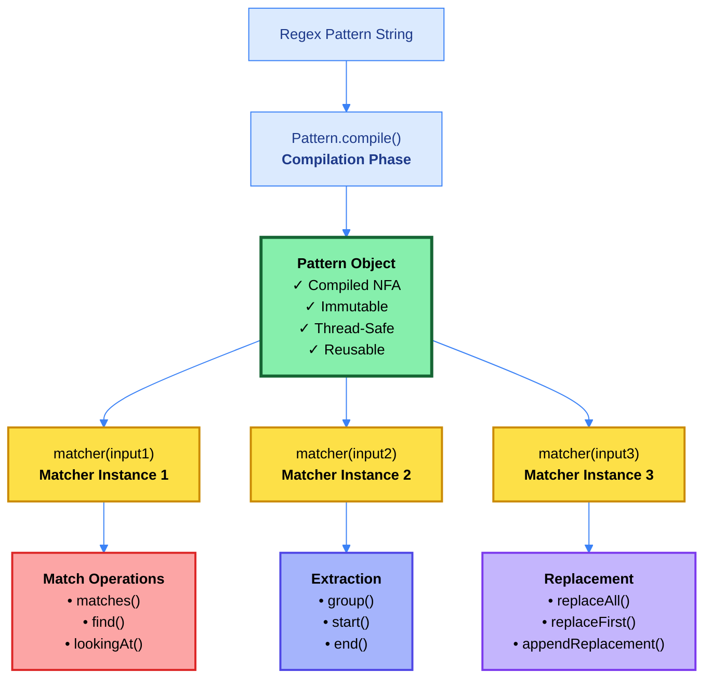
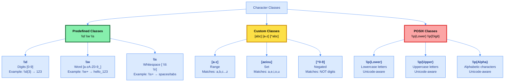
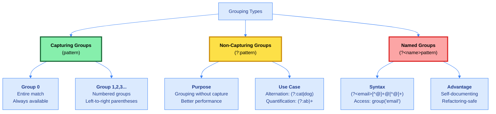
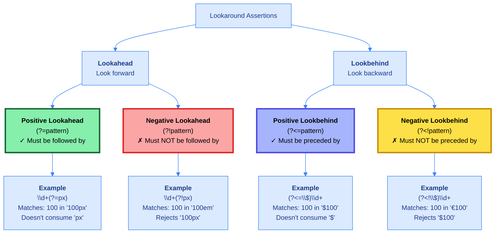
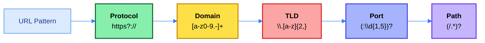
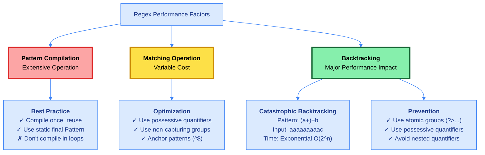
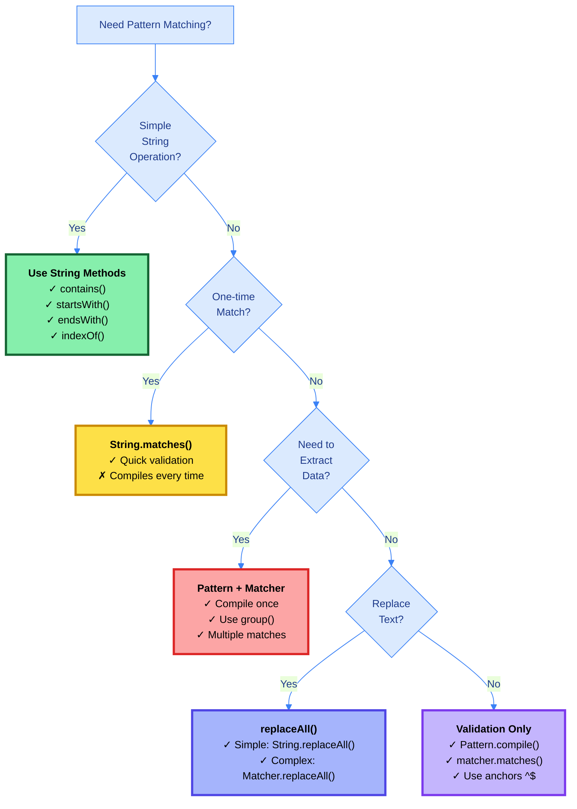

# 🎯 Day 28: Regular Expressions (Regex) in Java

<div align="center">


</div>

<hr style="border: 1px solid rgb(98, 117, 187)">

<div align="center">
<table>
<tr>
<td align="center">
<br />

<h3>© 2026 Avinash Dhanuka</h3>
<p>Master Guide: Java Core & Frameworks</p>
<p><em>Crafted with ❤️ for Pattern Matching Excellence</em></p>

<a href="https://github.com/Avinash-706" target="_blank">

</a>

<a href="https://mail.google.com/mail/?view=cm&fs=1&to=avunashdhanuka@gmail.com&su=Java%20Regex%20Query&body=🎯%20Hello%20Avinash,%0D%0A%0D%0AMy%20name%20is%20[Your%20Name]%20and%20I%20have%20a%20doubt%20regarding%20Java%20Regular%20Expressions.%0D%0A%0D%0A🔹%20Topic:%20[Pattern/Matcher/Lookarounds/Validation]%0D%0A🔹%20Question:%20[Type%20your%20question]%0D%0A%0D%0AThank%20you!" target="_blank">


</a>
<br />
<br />
</td>
</tr>
</table>
</div>

> **Author's Note:** This comprehensive guide explores Regular Expressions in Java from basic Pattern & Matcher operations to advanced lookarounds, validation patterns, and performance optimization. Master pattern matching, text processing, and real-world validation scenarios with detailed theoretical explanations and practical implementations.

---

## 📑 Table of Contents
1.  [Introduction to Regular Expressions](#1-introduction-to-regular-expressions)
    -   [What are Regular Expressions?](#what-are-regular-expressions)
    -   [Why Use Regular Expressions?](#why-use-regular-expressions)
    -   [Core Advantages](#core-advantages)
2.  [Pattern & Matcher Architecture](#2-pattern--matcher-architecture)
    -   [Theoretical Foundation](#theoretical-foundation)
    -   [Pattern vs Matcher: Key Differences](#pattern-vs-matcher-key-differences)
    -   [Compilation Flags](#compilation-flags)
3.  [Character Classes & Quantifiers](#3-character-classes--quantifiers)
    -   [Character Class Theory](#character-class-theory)
    -   [Quantifier Theory](#quantifier-theory)
    -   [Greedy vs Reluctant vs Possessive](#greedy-vs-reluctant-vs-possessive)
4.  [Grouping & Capturing](#4-grouping--capturing)
    -   [Grouping Theory](#grouping-theory)
    -   [Group Types Comparison](#group-types-comparison)
    -   [Backreference Applications](#backreference-applications)
5.  [Lookarounds (Lookahead & Lookbehind)](#5-lookarounds-lookahead--lookbehind)
    -   [Lookaround Theory](#lookaround-theory)
    -   [Password Validation with Lookaheads](#password-validation-with-lookaheads)
6.  [Validation Patterns](#6-validation-patterns)
    -   [Common Validation Patterns](#common-validation-patterns)
    -   [Email Validation Levels](#email-validation-levels)
7.  [Performance & Best Practices](#7-performance--best-practices)
    -   [Performance Comparison](#performance-comparison)
    -   [Catastrophic Backtracking](#catastrophic-backtracking)
8.  [Comparison Tables](#8-comparison-tables)
9.  [Summary & Key Takeaways](#9-summary--key-takeaways)

<div align="right">
<sub><em>Comprehensive notes by Avinash Dhanuka | For educational purposes</em></sub>
</div>

---

## 1. INTRODUCTION TO REGULAR EXPRESSIONS

### 📌 Definition
**Regular Expressions (Regex)** are powerful pattern-matching sequences used for searching, validating, and manipulating text. In Java, regex is implemented through the `java.util.regex` package with two primary classes: **Pattern** (compiled representation) and **Matcher** (match engine).


### Why Use Regular Expressions?

| Use Case | Traditional Approach | Regex Approach |
| :--- | :--- | :--- |
| **Email Validation** | Multiple if-else, indexOf(), substring() | Single pattern: `^[A-Za-z0-9+_.-]+@(.+)$` |
| **Phone Number Format** | Manual parsing, charAt() loops | Pattern: `^\d{3}-\d{3}-\d{4}$` |
| **Extract All Numbers** | Loop through chars, check isDigit() | `\d+` with findAll() |
| **Password Strength** | Multiple boolean flags, nested conditions | Lookaheads: `(?=.*[A-Z])(?=.*\d)` |
| **URL Parsing** | Complex string splitting, validation | Pattern groups for protocol, domain, path |

### Core Advantages

1. **Conciseness**: One regex pattern replaces dozens of lines of string manipulation code
2. **Readability**: Declarative pattern description vs imperative loops
3. **Performance**: Compiled patterns are optimized for repeated matching
4. **Flexibility**: Easy to modify patterns without changing logic structure
5. **Standardization**: Industry-standard patterns for common validations

---

## 2. PATTERN & MATCHER ARCHITECTURE

### 📌 Definition
The Java regex engine uses a **Non-deterministic Finite Automaton (NFA)** approach with backtracking. Pattern is the compiled regex (immutable, thread-safe), while Matcher performs operations (mutable, stateful).




### Pattern vs Matcher: Key Differences

| Aspect | Pattern | Matcher |
| :--- | :--- | :--- |
| **Purpose** | Compiled regex representation | Performs matching operations |
| **Creation** | `Pattern.compile(regex)` | `pattern.matcher(input)` |
| **Mutability** | Immutable | Mutable (stateful) |
| **Thread Safety** | Thread-safe | NOT thread-safe |
| **Reusability** | Reuse for multiple inputs | One instance per input |
| **Performance** | Expensive to create | Cheap to create |
| **State** | Stateless | Maintains match state |
| **Methods** | `compile()`, `matcher()`, `matches()`, `split()` | `matches()`, `find()`, `group()`, `replaceAll()` |

### Compilation Flags

Pattern compilation accepts flags that modify matching behavior:

| Flag | Description | Use Case |
| :--- | :--- | :--- |
| `CASE_INSENSITIVE` | Ignore case during matching | Email validation, username search |
| `MULTILINE` | `^` and `$` match line boundaries | Log file parsing, multi-line text |
| `DOTALL` | `.` matches any character including newline | HTML/XML parsing |
| `UNICODE_CASE` | Unicode-aware case folding | International text processing |
| `COMMENTS` | Allow whitespace and comments in pattern | Complex pattern documentation |
| `LITERAL` | Treat pattern as literal string | User input escaping |
| `CANON_EQ` | Canonical equivalence | Accented character matching |

### Match Operation Differences

| Method | Behavior | Returns | Use Case |
| :--- | :--- | :--- | :--- |
| `matches()` | Entire string must match | boolean | Validation (email, phone) |
| `find()` | Find next occurrence | boolean | Search, extraction |
| `lookingAt()` | Match from beginning (partial) | boolean | Prefix validation |
| `replaceAll()` | Replace all matches | String | Text transformation |
| `replaceFirst()` | Replace first match | String | Single replacement |

---

## 3. CHARACTER CLASSES & QUANTIFIERS

### � Definition
Character classes define **sets of characters** that can match at a single position. Quantifiers specify **how many times** a pattern element should occur. Together they form the building blocks of flexible pattern matching.




### Quantifier Theory

Quantifiers specify **how many times** a pattern element should occur. They are the key to flexible pattern matching.

| Quantifier | Name | Matches | Greedy | Reluctant | Possessive |
| :--- | :--- | :--- | :--- | :--- | :--- |
| `*` | Star | 0 or more | `X*` | `X*?` | `X*+` |
| `+` | Plus | 1 or more | `X+` | `X+?` | `X++` |
| `?` | Question | 0 or 1 | `X?` | `X??` | `X?+` |
| `{n}` | Exact | Exactly n | `X{3}` | N/A | N/A |
| `{n,}` | At least | n or more | `X{3,}` | `X{3,}?` | `X{3,}+` |
| `{n,m}` | Range | Between n and m | `X{3,5}` | `X{3,5}?` | `X{3,5}+` |

### Greedy vs Reluctant vs Possessive

This is one of the most critical concepts in regex performance and correctness:

| Mode | Behavior | Backtracking | Performance | Use Case |
| :--- | :--- | :--- | :--- | :--- |
| **Greedy** | Match as much as possible, backtrack if needed | Yes | Slower with backtracking | Default, most common |
| **Reluctant** | Match as little as possible, expand if needed | Yes | Slower with expansion | Extract minimal content |
| **Possessive** | Match as much as possible, NO backtracking | No | Fastest | Performance-critical, no alternatives |

**Example Comparison:**

Input: `<div>Hello</div><div>World</div>`

| Pattern | Mode | Matches | Explanation |
| :--- | :--- | :--- | :--- |
| `<div>.*</div>` | Greedy | `<div>Hello</div><div>World</div>` | Matches entire string (backtracking) |
| `<div>.*?</div>` | Reluctant | `<div>Hello</div>` | Matches first tag only |
| `<div>.*+</div>` | Possessive | No match | Consumes all, can't backtrack for `</div>` |

### Character Class Negation

| Pattern | Matches | Does NOT Match |
| :--- | :--- | :--- |
| `[^0-9]` | Any non-digit | Digits 0-9 |
| `[^a-z]` | Any non-lowercase letter | Lowercase a-z |
| `[^aeiou]` | Any non-vowel | Vowels a,e,i,o,u |
| `\D` | Any non-digit (same as `[^0-9]`) | Digits |
| `\W` | Any non-word character | Word characters |
| `\S` | Any non-whitespace | Whitespace |

---

## 4. GROUPING & CAPTURING

### � Definition
Groups serve multiple purposes: **capturing** matched substrings for extraction, **backreferences** to refer to previously captured content, **quantification** of multiple characters, and **alternation** with the `|` operator.




### Group Types Comparison

| Type | Syntax | Captures? | Backreference | Performance | Use Case |
| :--- | :--- | :--- | :--- | :--- | :--- |
| **Capturing** | `(pattern)` | Yes | `\1`, `\2` | Slower | Extract data, backreferences |
| **Non-Capturing** | `(?:pattern)` | No | No | Faster | Grouping only, alternation |
| **Named** | `(?<name>pattern)` | Yes | `\k<name>` | Slower | Self-documenting patterns |
| **Atomic** | `(?>pattern)` | No | No | Fastest | No backtracking needed |

### Backreference Applications

Backreferences allow you to match **previously captured content** later in the pattern:

| Pattern | Matches | Explanation |
| :--- | :--- | :--- |
| `(\w+)\s+\1` | `hello hello` | Repeated word |
| `<(\w+)>.*?</\1>` | `<div>text</div>` | Matching HTML tags |
| `(\d{2})-(\d{2})-\1` | `12-34-12` | Repeated first group |
| `(['"])(.*?)\1` | `"hello"` or `'hello'` | Matching quotes |

### Nested Groups

Groups can be nested, and numbering follows **left-to-right opening parenthesis** order:

```
Pattern: ((A)(B(C)))
Group 0: Entire match
Group 1: (A)(B(C))
Group 2: A
Group 3: B(C)
Group 4: C
```

---

## 5. LOOKAROUNDS (LOOKAHEAD & LOOKBEHIND)

### 📌 Definition
Lookarounds are **zero-width assertions** that match a position without consuming characters. They check conditions forward (lookahead) or backward (lookbehind) without including those characters in the match result.




### Lookaround Comparison

| Type | Syntax | Direction | Consumes? | Use Case |
| :--- | :--- | :--- | :--- | :--- |
| **Positive Lookahead** | `(?=...)` | Forward | No | "followed by" condition |
| **Negative Lookahead** | `(?!...)` | Forward | No | "NOT followed by" condition |
| **Positive Lookbehind** | `(?<=...)` | Backward | No | "preceded by" condition |
| **Negative Lookbehind** | `(?<!...)` | Backward | No | "NOT preceded by" condition |

### Password Validation with Lookaheads

Complex password requirements are best handled with multiple lookaheads:

| Requirement | Pattern | Explanation |
| :--- | :--- | :--- |
| At least 1 uppercase | `(?=.*[A-Z])` | Lookahead for uppercase anywhere |
| At least 1 lowercase | `(?=.*[a-z])` | Lookahead for lowercase anywhere |
| At least 1 digit | `(?=.*\d)` | Lookahead for digit anywhere |
| At least 1 special char | `(?=.*[@#$%])` | Lookahead for special char anywhere |
| Minimum 8 characters | `.{8,}` | Actual match after all lookaheads |

**Combined Pattern:**
```
^(?=.*[A-Z])(?=.*[a-z])(?=.*\d)(?=.*[@#$%]).{8,}$
```

### Lookaround vs Capturing Groups

| Aspect | Lookaround | Capturing Group |
| :--- | :--- | :--- |
| **Consumes Characters** | No (zero-width) | Yes |
| **Advances Position** | No | Yes |
| **Can Extract** | No | Yes |
| **Performance** | Faster for validation | Slower (stores match) |
| **Use Case** | Conditions, validation | Extraction, backreferences |

---

## 6. VALIDATION PATTERNS

### 📌 Definition
Real-world validation requires understanding the **trade-offs between strictness and usability**. Simple patterns allow more inputs but may accept invalid data, while strict patterns ensure correctness but may reject edge cases.

| Validation Type | Simple Pattern | Strict Pattern | Trade-off |
| :--- | :--- | :--- | :--- |
| **Email** | `\S+@\S+\.\S+` | `^[A-Za-z0-9+_.-]+@[A-Za-z0-9.-]+\.[A-Z]{2,}$` | Simple allows more, strict rejects edge cases |
| **Phone (US)** | `\d{10}` | `^(\+1)?[-.]?\(?(\d{3})\)?[-.]?(\d{3})[-.]?(\d{4})$` | Simple digits only, strict handles formats |
| **URL** | `https?://\S+` | `^https?://[a-z0-9]+([\-\.]{1}[a-z0-9]+)*\.[a-z]{2,}(:[0-9]{1,5})?(/.*)?$` | Simple basic, strict validates structure |
| **IP Address** | `\d+\.\d+\.\d+\.\d+` | `^((25[0-5]|2[0-4][0-9]|[01]?[0-9][0-9]?)\.){3}(25[0-5]|2[0-4][0-9]|[01]?[0-9][0-9]?)$` | Simple format, strict validates ranges |
| **Credit Card** | `\d{16}` | `^(?:4[0-9]{12}(?:[0-9]{3})?|5[1-5][0-9]{14}|3[47][0-9]{13})$` | Simple length, strict validates issuer |

### Email Validation Levels

| Level | Pattern | Accepts | Rejects | Use Case |
| :--- | :--- | :--- | :--- | :--- |
| **Basic** | `\S+@\S+` | Most emails | Spaces | Quick check |
| **Standard** | `^[A-Za-z0-9+_.-]+@[A-Za-z0-9.-]+$` | Common formats | Special chars | General use |
| **Strict** | `^[A-Za-z0-9+_.-]+@[A-Za-z0-9.-]+\.[A-Z]{2,}$` | Valid TLDs | Invalid TLDs | Production |
| **RFC 5322** | (Very complex, 100+ chars) | All RFC-compliant | Non-compliant | Standards compliance |

### URL Validation Components




---

## 7. PERFORMANCE & BEST PRACTICES

### 📌 Definition
Understanding performance characteristics is crucial for production systems. Pattern compilation is expensive (do once), matching is cheap (reuse), and **catastrophic backtracking** can cause exponential time complexity if not prevented.



### Performance Optimization Techniques

| Technique | Bad Pattern | Good Pattern | Improvement |
| :--- | :--- | :--- | :--- |
| **Compile Once** | `Pattern.compile(regex)` in loop | `static final Pattern` | 100x faster |
| **Possessive Quantifiers** | `.*` (greedy) | `.*+` (possessive) | No backtracking |
| **Non-Capturing Groups** | `(cat|dog)+` | `(?:cat|dog)+` | Less memory |
| **Anchoring** | `\d{3}-\d{4}` | `^\d{3}-\d{4}$` | Early rejection |
| **Specific Classes** | `[0-9]` | `\d` | Optimized internally |
| **Atomic Groups** | `(a+)+` | `(?>a+)+` | Prevents catastrophic backtracking |

### Catastrophic Backtracking Examples

| Pattern | Input | Behavior | Time Complexity |
| :--- | :--- | :--- | :--- |
| `(a+)+b` | `aaaaaaaaac` | Exponential backtracking | O(2^n) |
| `(a*)*b` | `aaaaaaaaac` | Exponential backtracking | O(2^n) |
| `(a|a)*b` | `aaaaaaaaac` | Exponential backtracking | O(2^n) |
| `(?>a+)+b` | `aaaaaaaaac` | No backtracking (fails fast) | O(n) |

### Best Practices Summary

| Category | Practice | Reason |
| :--- | :--- | :--- |
| **Compilation** | Use `static final Pattern` | Compile once, reuse many times |
| **Quantifiers** | Prefer possessive when possible | Eliminate backtracking |
| **Groups** | Use non-capturing `(?:...)` when not extracting | Reduce memory overhead |
| **Anchors** | Use `^` and `$` for full match | Early rejection of non-matches |
| **Character Classes** | Use predefined `\d \w \s` | Optimized by engine |
| **Alternation** | Order by frequency | Most common first |
| **Testing** | Test with long inputs | Detect catastrophic backtracking |
| **Validation** | Use simple patterns first | Complex patterns as fallback |

---

## 8. COMPARISON TABLES

### Regex Methods Comparison

| Method | Class | Full Match? | Returns | Use Case |
| :--- | :--- | :--- | :--- | :--- |
| `matches()` | String | Yes | boolean | Quick validation |
| `matches()` | Matcher | Yes | boolean | Reusable validation |
| `find()` | Matcher | No | boolean | Search, multiple matches |
| `lookingAt()` | Matcher | Prefix only | boolean | Prefix validation |
| `replaceAll()` | String | N/A | String | Simple replacement |
| `replaceAll()` | Matcher | N/A | String | Complex replacement |
| `split()` | String | N/A | String[] | Tokenization |
| `split()` | Pattern | N/A | String[] | Reusable tokenization |


### Quantifier Mode Comparison

| Input | Pattern | Greedy Match | Reluctant Match | Possessive Match |
| :--- | :--- | :--- | :--- | :--- |
| `aaaa` | `a+` | `aaaa` | `a` | `aaaa` |
| `aaaa` | `a+?` | `a` | `a` | N/A |
| `<div>A</div><div>B</div>` | `<div>.*</div>` | Entire string | `<div>A</div>` | Entire string |
| `<div>A</div><div>B</div>` | `<div>.*?</div>` | `<div>A</div>` | `<div>A</div>` | N/A |
| `aaab` | `a++b` | `aaab` | N/A | `aaab` |
| `aaac` | `a++b` | No match | N/A | No match (fast fail) |

### Character Class Equivalents

| Predefined | Equivalent | Negated | Negated Equivalent |
| :--- | :--- | :--- | :--- |
| `\d` | `[0-9]` | `\D` | `[^0-9]` |
| `\w` | `[a-zA-Z0-9_]` | `\W` | `[^a-zA-Z0-9_]` |
| `\s` | `[ \t\n\r\f]` | `\S` | `[^ \t\n\r\f]` |
| `.` | `[^\n]` (default) | N/A | N/A |
| `.` | `[^\r\n]` (UNIX_LINES) | N/A | N/A |

### Boundary Matchers

| Matcher | Matches | Example Pattern | Example Match |
| :--- | :--- | :--- | :--- |
| `^` | Start of line | `^Hello` | `Hello world` |
| `$` | End of line | `world$` | `Hello world` |
| `\b` | Word boundary | `\bcat\b` | `cat` in "the cat sat" |
| `\B` | Non-word boundary | `\Bcat\B` | `cat` in "concatenate" |
| `\A` | Start of input | `\AHello` | `Hello` (ignores MULTILINE) |
| `\Z` | End of input | `world\Z` | `world` (ignores MULTILINE) |

---

## 9. SUMMARY & KEY TAKEAWAYS

### Core Concepts Mastered

1. **Pattern & Matcher Architecture**
   - Pattern is immutable, thread-safe, compiled once
   - Matcher is mutable, stateful, one per input
   - Compilation is expensive, matching is cheap

2. **Character Classes & Quantifiers**
   - Predefined classes (`\d \w \s`) are optimized
   - Greedy quantifiers match maximum, backtrack if needed
   - Reluctant quantifiers match minimum, expand if needed
   - Possessive quantifiers match maximum, never backtrack

3. **Grouping & Capturing**
   - Capturing groups `()` extract data but cost memory
   - Non-capturing groups `(?:)` are faster for grouping only
   - Named groups `(?<name>)` are self-documenting
   - Backreferences `\1` match previously captured content

4. **Lookarounds**
   - Zero-width assertions don't consume characters
   - Lookaheads `(?=)` and `(?!)` check forward
   - Lookbehinds `(?<=)` and `(?<!)` check backward
   - Essential for complex validation (passwords, etc.)

5. **Validation Patterns**
   - Trade-off between strictness and usability
   - Simple patterns for quick checks
   - Strict patterns for production validation
   - Test with edge cases and invalid inputs

6. **Performance Optimization**
   - Compile patterns once, reuse many times
   - Use possessive quantifiers to eliminate backtracking
   - Avoid nested quantifiers (catastrophic backtracking)
   - Use atomic groups `(?>)` for performance-critical patterns


### Decision Tree: When to Use What



### Common Mistakes to Avoid

| ❌ Mistake | ✅ Correct Approach | Impact |
| :--- | :--- | :--- |
| Compiling pattern in loop | Use `static final Pattern` | 100x performance |
| Using greedy `.*` for HTML | Use reluctant `.*?` | Correct matching |
| Not escaping special chars | Use `Pattern.quote()` or `\` | Avoid errors |
| Nested quantifiers `(a+)+` | Use atomic groups `(?>a+)+` | Prevent catastrophic backtracking |
| Using capturing groups unnecessarily | Use non-capturing `(?:)` | Reduce memory |
| Not anchoring validation patterns | Add `^` and `$` | Prevent partial matches |
| Testing only valid inputs | Test edge cases and invalid inputs | Robust validation |

### Performance Tips

1. **Pattern Compilation**: Compile once, reuse many times (100x faster)
2. **Possessive Quantifiers**: Use `*+`, `++`, `?+` to eliminate backtracking
3. **Non-Capturing Groups**: Use `(?:...)` when not extracting data
4. **Anchoring**: Use `^` and `$` for early rejection
5. **Atomic Groups**: Use `(?>...)` to prevent backtracking
6. **Specific Classes**: Use `\d` instead of `[0-9]` (optimized)
7. **Alternation Order**: Put most common alternatives first
8. **Input Validation**: Validate input length before regex matching

### Real-World Applications

| Domain | Use Case | Pattern Type |
| :--- | :--- | :--- |
| **Web Development** | Email validation, URL parsing | Validation patterns |
| **Data Processing** | Log parsing, CSV extraction | Grouping & extraction |
| **Security** | Password strength, input sanitization | Lookaheads, validation |
| **Text Processing** | Search & replace, tokenization | Find & replace |
| **API Development** | Request validation, parameter parsing | Validation patterns |
| **Data Migration** | Format conversion, data cleaning | Replacement patterns |

---

<div align="center">

### 🎯 Master These Patterns

**Pattern & Matcher** → Compile once, match many  
**Character Classes** → `\d \w \s` for common patterns  
**Quantifiers** → Greedy, reluctant, possessive modes  
**Lookarounds** → Zero-width assertions for validation  
**Performance** → Avoid catastrophic backtracking

---

### 📖 Files Implemented

| File | Focus | Lines |
| :--- | :--- | :--- |
| `PatternMatcherBasics.java` | Pattern compilation, Matcher operations, flags | 350+ |
| `GroupingAndExtraction.java` | Capturing groups, named groups, backreferences | 400+ |
| `CharacterClassesQuantifiers.java` | Character classes, quantifiers, greedy vs reluctant | 450+ |
| `LookaroundsAdvanced.java` | Lookaheads, lookbehinds, password validation | 400+ |
| `ValidationPatterns.java` | Email, phone, URL, IP, credit card validation | 350+ |
| `PerformanceAndBestPractices.java` | Optimization, catastrophic backtracking, benchmarks | 350+ |

**Total:** 2200+ lines of comprehensive regex implementation

---

<sub>**© 2026 Avinash Dhanuka** | Regular Expressions Master Guide</sub>

<sub>📧 [avunashdhanuka@gmail.com](mailto:avunashdhanuka@gmail.com) | 🔗 [GitHub: Avinash-706](https://github.com/Avinash-706)</sub>

</div>
