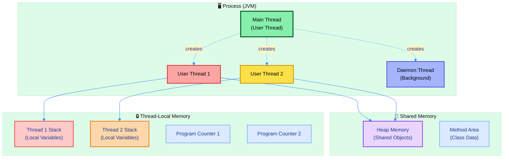
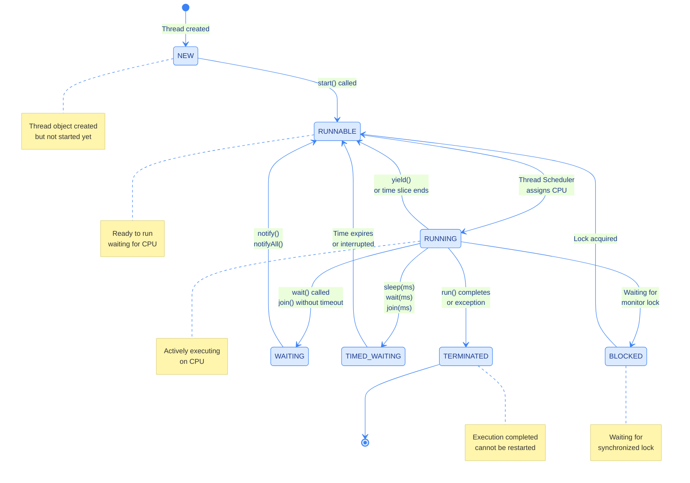
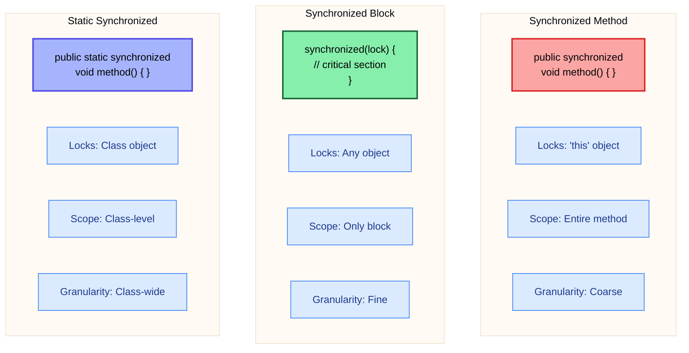
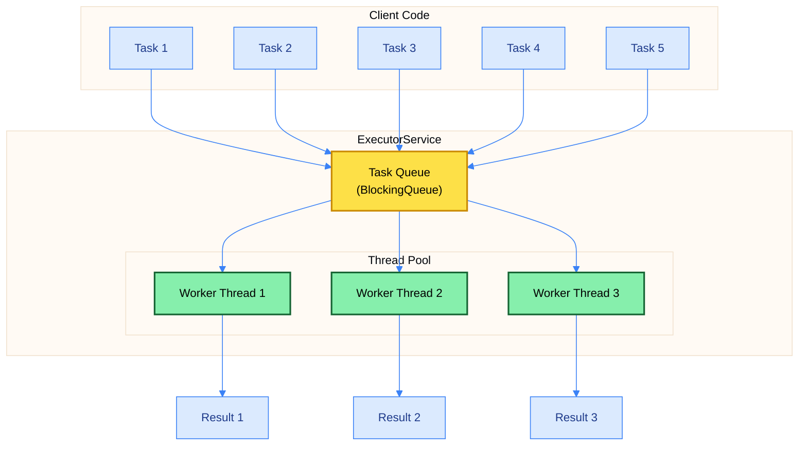
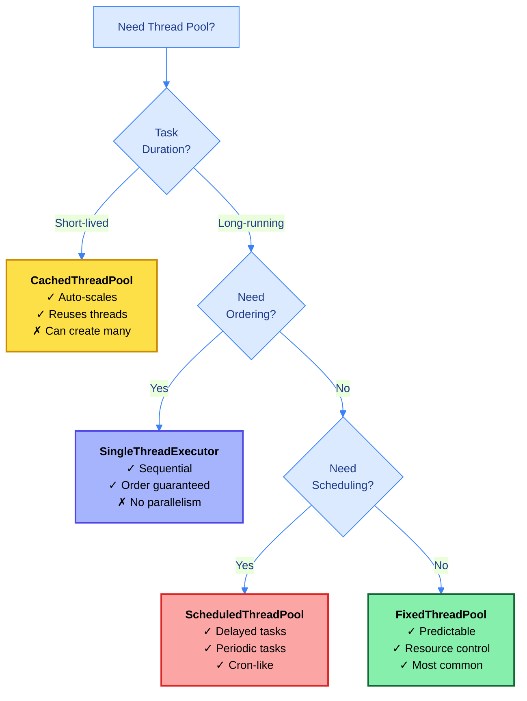
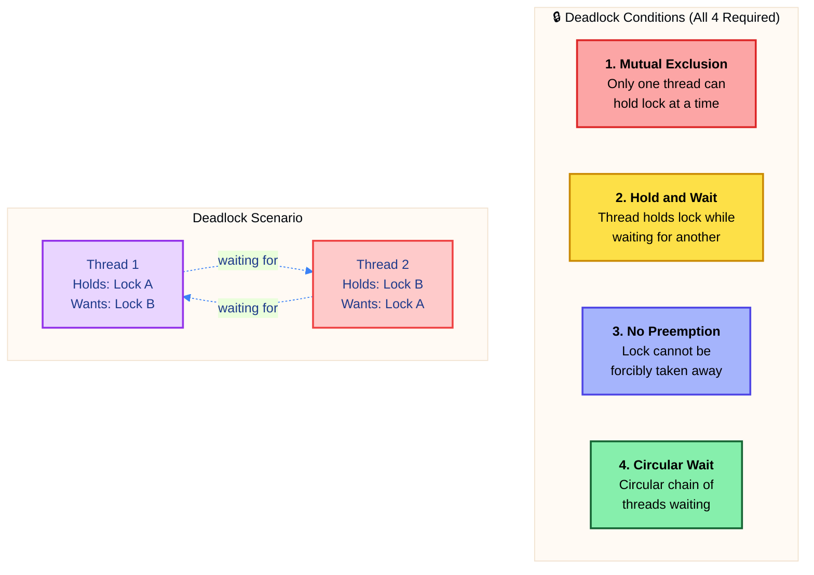
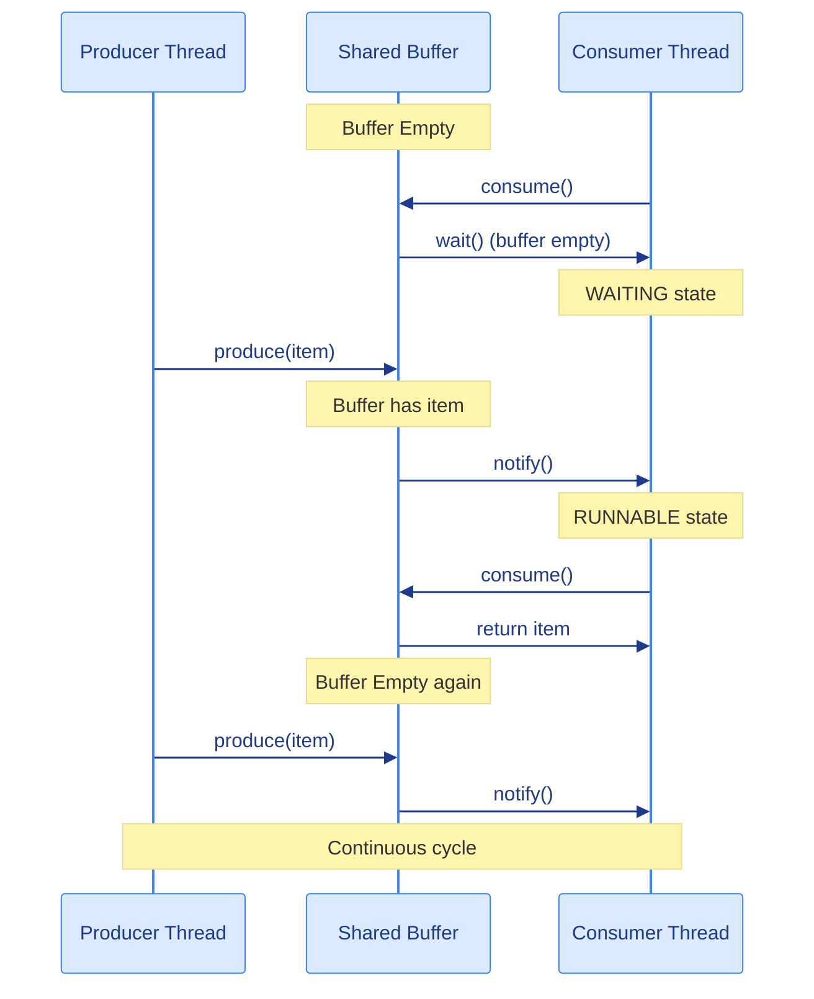
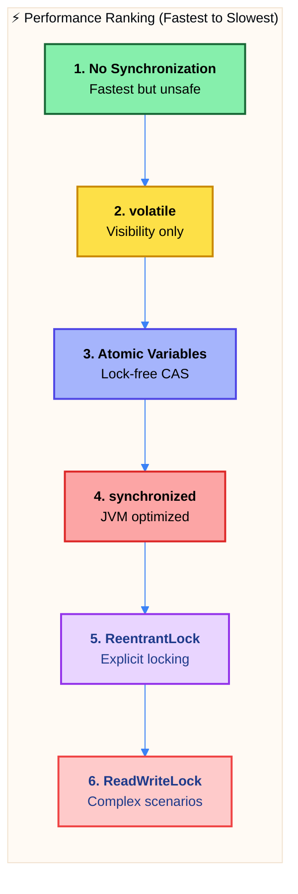

# ☕ Master Guide: Java Multithreading & Concurrency

<div align="center">


</div>

<hr style="border: 1px solid rgb(98, 117, 187)">

<div align="center">
<table>
<tr>
<td align="center">
<br />

<h3>© 2026 Avinash Dhanuka</h3>
<p>Master Guide: Java Core & Frameworks</p>
<p><em>Crafted with ❤️ for Concurrent Programming Excellence</em></p>

<a href="https://github.com/Avinash-706" target="_blank">

</a>

<a href="https://mail.google.com/mail/?view=cm&fs=1&to=avunashdhanuka@gmail.com&su=Java%20Multithreading%20Query&body=🧵%20Hello%20Avinash,%0D%0A%0D%0AMy%20name%20is%20[Your%20Name]%20and%20I%20have%20a%20doubt%20regarding%20Java%20Multithreading.%0D%0A%0D%0A🔹%20Topic:%20[Thread%20Lifecycle/Synchronization/Deadlock/Thread%20Pool]%0D%0A🔹%20Question:%20[Type%20your%20question]%0D%0A%0D%0AThank%20you!" target="_blank">


</a>
<br />
<br />
</td>
</tr>
</table>
</div>

> **Author's Note:** This comprehensive guide explores Java Multithreading from fundamental concepts to advanced concurrency patterns. Master thread lifecycle, synchronization mechanisms, thread pools, deadlock prevention, and inter-thread communication. Includes theoretical foundations, performance analysis, and production-ready patterns for building robust concurrent applications.

---

## 🏗️ Multithreading Architecture Overview



---

## 📑 Table of Contents
1.  [Thread Fundamentals](#1-thread-fundamentals)
    -   [Process vs Thread](#11-process-vs-thread)
    -   [Thread Lifecycle & States](#12-thread-lifecycle--states)
    -   [Thread Creation Methods](#13-thread-creation-methods)
2.  [Thread Synchronization](#2-thread-synchronization)
    -   [Race Condition & Thread Safety](#21-race-condition--thread-safety)
    -   [Synchronized Methods vs Blocks](#22-synchronized-methods-vs-blocks)
    -   [Lock & Monitor Mechanism](#23-lock--monitor-mechanism)
3.  [Thread Pool & ExecutorService](#3-thread-pool--executorservice)
    -   [Thread Pool Architecture](#31-thread-pool-architecture)
    -   [Pool Types Comparison](#32-pool-types-comparison)
    -   [Callable & Future](#33-callable--future)
4.  [Deadlock & Prevention](#4-deadlock--prevention)
    -   [Deadlock Conditions](#41-deadlock-conditions)
    -   [Prevention Strategies](#42-prevention-strategies)
5.  [Inter-Thread Communication](#5-inter-thread-communication)
    -   [wait(), notify(), notifyAll()](#51-wait-notify-notifyall)
    -   [Producer-Consumer Pattern](#52-producer-consumer-pattern)
6.  [Advanced Concurrency](#6-advanced-concurrency)
    -   [volatile vs synchronized](#61-volatile-vs-synchronized)
    -   [Atomic Variables](#62-atomic-variables)
    -   [ReentrantLock vs synchronized](#63-reentrantlock-vs-synchronized)
7.  [Performance & Best Practices](#7-performance--best-practices)

<div align="right">
<sub><em>Comprehensive notes by Avinash Dhanuka | For educational purposes</em></sub>
</div>

---

## 1. THREAD FUNDAMENTALS

### 📌 Definition
**Multithreading** is the concurrent execution of multiple threads within a single process. A **thread** is the smallest unit of processing, lighter than a process, sharing the same memory space but having independent execution paths.


### 1.1 Process vs Thread

#### 📋 Fundamental Differences

| Aspect | Process | Thread |
| :--- | :--- | :--- |
| **Definition** | Independent program execution | Lightweight sub-process within program |
| **Memory** | Separate memory space | Shared memory space |
| **Communication** | IPC (Inter-Process Communication) | Direct shared memory access |
| **Context Switch** | Expensive (save/load memory maps) | Cheap (only registers, PC) |
| **Creation Time** | Slow (allocate memory, resources) | Fast (reuse process resources) |
| **Resource Usage** | Heavyweight (OS resources) | Lightweight (minimal overhead) |
| **Independence** | Fully independent | Share process resources |
| **Failure Impact** | Isolated (one crash doesn't affect others) | Shared (one crash can affect all) |

#### 🎯 Why Multithreading Over Multiprocessing?

1. **Memory Efficiency**: Threads share heap memory, no separate allocation needed
2. **Performance**: Context switching between threads is 10-100x faster
3. **Communication**: Direct memory access vs expensive IPC mechanisms
4. **Resource Utilization**: Better CPU utilization with concurrent tasks
5. **Responsiveness**: UI remains responsive while background tasks execute

### 1.2 Thread Lifecycle & States



#### 📋 Thread States Detailed

| State | Description | Entry Condition | Exit Condition |
| :--- | :--- | :--- | :--- |
| **NEW** | Thread created but not started | `new Thread()` | `start()` called |
| **RUNNABLE** | Ready to run, waiting for CPU | `start()` called | Thread Scheduler assigns CPU |
| **RUNNING** | Actively executing on CPU | Scheduler assigns CPU | sleep, wait, block, or complete |
| **BLOCKED** | Waiting for monitor lock | Trying to enter synchronized | Lock acquired |
| **WAITING** | Waiting indefinitely | `wait()`, `join()` | `notify()`, `notifyAll()` |
| **TIMED_WAITING** | Waiting for specified time | `sleep(ms)`, `wait(ms)` | Time expires or interrupted |
| **TERMINATED** | Execution completed | `run()` exits | Cannot transition (final state) |


### 1.3 Thread Creation Methods

#### 📋 Method Comparison

| Aspect | Extending Thread | Implementing Runnable |
| :--- | :--- | :--- |
| **Inheritance** | Cannot extend other classes | Can extend other classes |
| **Flexibility** | Limited (single inheritance) | High (composition) |
| **Reusability** | Thread object tied to task | Runnable can be reused |
| **Design** | Tight coupling | Loose coupling (preferred) |
| **Lambda Support** | No | Yes (functional interface) |
| **Best Practice** | ❌ Not recommended | ✅ Recommended |

#### 🔍 Why Runnable is Preferred?

1. **Java's Single Inheritance**: Can extend other classes while implementing Runnable
2. **Separation of Concerns**: Task logic separated from thread management
3. **Reusability**: Same Runnable can be used with different threads
4. **Thread Pool Compatibility**: ExecutorService accepts Runnable/Callable
5. **Functional Programming**: Runnable is a functional interface (lambda-friendly)

---

## 2. THREAD SYNCHRONIZATION

### 📌 Definition
**Synchronization** is the mechanism to control access to shared resources by multiple threads, preventing **race conditions** and ensuring **thread safety**. It uses locks (monitors) to ensure only one thread accesses critical section at a time.

### 2.1 Race Condition & Thread Safety

#### 🎯 Race Condition Explained

A **race condition** occurs when multiple threads access shared data simultaneously, and the final result depends on the unpredictable order of thread execution.

**Example Scenario:**
```
Initial: counter = 0
Thread 1: Read counter (0) → Increment (1) → Write (1)
Thread 2: Read counter (0) → Increment (1) → Write (1)
Expected: 2
Actual: 1 (Lost Update!)
```

#### 📋 Thread Safety Mechanisms

| Mechanism | How It Works | Use Case |
| :--- | :--- | :--- |
| **synchronized** | Locks object/class monitor | Simple critical sections |
| **volatile** | Ensures visibility across threads | Flags, simple variables |
| **Atomic Classes** | Lock-free CAS operations | Counters, flags |
| **ReentrantLock** | Explicit lock with tryLock | Complex locking scenarios |
| **Immutable Objects** | Cannot be modified after creation | Shared read-only data |
| **ThreadLocal** | Thread-specific copy | Thread-isolated data |

### 2.2 Synchronized Methods vs Blocks



#### 📋 Synchronization Comparison

| Feature | Synchronized Method | Synchronized Block | Static Synchronized |
| :--- | :--- | :--- | :--- |
| **Lock Object** | `this` (instance) | Any object | `Class` object |
| **Scope** | Entire method | Only critical section | Entire static method |
| **Performance** | Lower (locks entire method) | Higher (locks only needed part) | Lower (class-level lock) |
| **Flexibility** | Low | High (choose lock object) | Low |
| **Use Case** | Simple, entire method critical | Large method, small critical section | Static shared resources |

### 2.3 Lock & Monitor Mechanism

#### 🔍 How Locks Work (Internal Mechanism)

1. **Monitor Entry**: Thread tries to acquire object's monitor (lock)
2. **Lock Acquisition**: If available, thread enters; if not, thread BLOCKED
3. **Critical Section**: Thread executes synchronized code
4. **Monitor Exit**: Thread releases lock, notifies waiting threads
5. **Lock Release**: Next waiting thread can acquire lock

#### 📋 Lock Types

| Lock Type | Description | Reentrant? | Fair? |
| :--- | :--- | :--- | :--- |
| **Intrinsic Lock** | Built-in synchronized | ✅ Yes | ❌ No |
| **ReentrantLock** | Explicit lock with features | ✅ Yes | ✅ Optional |
| **ReadWriteLock** | Separate read/write locks | ✅ Yes | ✅ Optional |
| **StampedLock** | Optimistic read lock | ❌ No | ❌ No |

---

## 3. THREAD POOL & EXECUTORSERVICE

### 📌 Definition
**Thread Pool** is a collection of pre-created worker threads that execute tasks from a queue. Instead of creating new threads for each task (expensive), threads are reused, improving performance and resource management.

### 3.1 Thread Pool Architecture



#### 🎯 Thread Pool Benefits

1. **Performance**: Reuse threads instead of creating new ones (expensive operation)
2. **Resource Management**: Limit concurrent threads, prevent resource exhaustion
3. **Task Queue**: Handle more tasks than available threads
4. **Lifecycle Management**: Automatic thread creation, management, and termination
5. **Scalability**: Easily adjust pool size based on workload


### 3.2 Pool Types Comparison

#### 📋 ExecutorService Types

| Pool Type | Threads | Queue | Use Case | Pros | Cons |
| :--- | :--- | :--- | :--- | :--- | :--- |
| **FixedThreadPool** | Fixed (n) | Unbounded | Known workload | Predictable resources | Queue can grow unbounded |
| **CachedThreadPool** | 0 to MAX | SynchronousQueue | Short-lived tasks | Auto-scales | Can create too many threads |
| **SingleThreadExecutor** | 1 | Unbounded | Sequential tasks | Order guaranteed | No parallelism |
| **ScheduledThreadPool** | Fixed (n) | DelayQueue | Delayed/periodic | Scheduling support | Complex for simple tasks |
| **WorkStealingPool** | CPU cores | Deque per thread | CPU-intensive | Load balancing | Unordered execution |

#### 🔍 When to Use Which?



### 3.3 Callable & Future

#### 📋 Runnable vs Callable

| Feature | Runnable | Callable |
| :--- | :--- | :--- |
| **Return Value** | ❌ void (no return) | ✅ Generic type T |
| **Exception** | Cannot throw checked exceptions | Can throw checked exceptions |
| **Method** | `void run()` | `T call() throws Exception` |
| **Use Case** | Fire-and-forget tasks | Tasks needing results |
| **Future Support** | No (unless wrapped) | Yes (returns Future<T>) |

#### 🔍 Future Operations

| Method | Description | Blocking? |
| :--- | :--- | :--- |
| `get()` | Get result, wait if needed | ✅ Yes |
| `get(timeout)` | Get result with timeout | ✅ Yes |
| `isDone()` | Check if completed | ❌ No |
| `cancel()` | Attempt to cancel | ❌ No |
| `isCancelled()` | Check if cancelled | ❌ No |

---

## 4. DEADLOCK & PREVENTION

### 📌 Definition
**Deadlock** is a situation where two or more threads are permanently blocked, each waiting for a lock held by another thread in a circular dependency. No thread can proceed, causing the application to hang.

### 4.1 Deadlock Conditions

#### 🔍 Four Necessary Conditions (All Must Be Present)



#### 📋 Deadlock Example

| Time | Thread 1 | Thread 2 | Status |
| :--- | :--- | :--- | :--- |
| T1 | Acquires Lock A | - | ✅ Success |
| T2 | - | Acquires Lock B | ✅ Success |
| T3 | Waiting for Lock B | - | ⏳ Blocked |
| T4 | - | Waiting for Lock A | ⏳ Blocked |
| T5 | Still waiting... | Still waiting... | 🔒 **DEADLOCK** |

### 4.2 Prevention Strategies

#### 📋 Deadlock Prevention Techniques

| Strategy | How It Works | Pros | Cons |
| :--- | :--- | :--- | :--- |
| **Lock Ordering** | Always acquire locks in same order | Simple, effective | Requires discipline |
| **Lock Timeout** | Use `tryLock(timeout)` | Prevents indefinite wait | May need retry logic |
| **Deadlock Detection** | Monitor thread states | Can recover | Overhead, complex |
| **Avoid Nested Locks** | Minimize lock nesting | Reduces risk | May not be possible |
| **Use Higher-Level** | ConcurrentHashMap, etc. | Built-in safety | Less control |

#### 🎯 Prevention Best Practices

1. **Lock Ordering**: Establish global lock acquisition order
2. **Timeout**: Use `tryLock()` with timeout instead of blocking
3. **Minimize Lock Scope**: Hold locks for shortest time possible
4. **Avoid Nested Locks**: Acquire all locks at once or none
5. **Use Concurrent Collections**: Built-in thread safety without explicit locks

---

## 5. INTER-THREAD COMMUNICATION

### 📌 Definition
**Inter-thread communication** allows synchronized threads to communicate and coordinate their actions using `wait()`, `notify()`, and `notifyAll()` methods. Threads can pause execution and resume when conditions are met.

### 5.1 wait(), notify(), notifyAll()

#### 📋 Method Comparison

| Method | Purpose | Releases Lock? | Wakes Threads | Must Be Synchronized? |
| :--- | :--- | :--- | :--- | :--- |
| `wait()` | Pause thread indefinitely | ✅ Yes | - | ✅ Yes |
| `wait(ms)` | Pause thread for timeout | ✅ Yes | - | ✅ Yes |
| `notify()` | Wake ONE waiting thread | ❌ No | 1 (random) | ✅ Yes |
| `notifyAll()` | Wake ALL waiting threads | ❌ No | All | ✅ Yes |

#### 🔍 wait() vs sleep()

| Aspect | wait() | sleep() |
| :--- | :--- | :--- |
| **Class** | Object | Thread |
| **Lock** | Releases lock | Holds lock |
| **Context** | Must be in synchronized | Can be anywhere |
| **Wake Up** | notify()/notifyAll() | Time expires |
| **Purpose** | Inter-thread communication | Pause execution |
| **Exception** | InterruptedException | InterruptedException |


### 5.2 Producer-Consumer Pattern



#### 📋 Producer-Consumer Scenarios

| Scenario | Producer Action | Consumer Action | Result |
| :--- | :--- | :--- | :--- |
| **Buffer Full** | `wait()` until space | `consume()` and `notify()` | Producer resumes |
| **Buffer Empty** | `produce()` and `notify()` | `wait()` until data | Consumer resumes |
| **Multiple Consumers** | `produce()` and `notifyAll()` | All wake up, one consumes | Fair distribution |
| **Multiple Producers** | All produce, `notifyAll()` | `consume()` and `notifyAll()` | Balanced production |

---

## 6. ADVANCED CONCURRENCY

### 6.1 volatile vs synchronized

#### 📋 Detailed Comparison

| Feature | volatile | synchronized |
| :--- | :--- | :--- |
| **Purpose** | Visibility guarantee | Mutual exclusion + visibility |
| **Atomicity** | ❌ No (except read/write) | ✅ Yes (entire block) |
| **Lock** | ❌ No lock | ✅ Acquires lock |
| **Performance** | Faster (no locking) | Slower (locking overhead) |
| **Use Case** | Flags, simple variables | Critical sections, compound operations |
| **Blocking** | ❌ Never blocks | ✅ Can block threads |
| **Compound Operations** | ❌ Not safe (i++) | ✅ Safe |

#### 🎯 When to Use What?

- **volatile**: Simple flag variables, status indicators, double-checked locking
- **synchronized**: Critical sections, compound operations (i++), multiple variables
- **Atomic**: Counters, flags with CAS operations (lock-free)

### 6.2 Atomic Variables

#### 📋 Atomic Classes

| Class | Purpose | Key Methods |
| :--- | :--- | :--- |
| `AtomicInteger` | Thread-safe integer | `incrementAndGet()`, `compareAndSet()` |
| `AtomicLong` | Thread-safe long | `addAndGet()`, `getAndIncrement()` |
| `AtomicBoolean` | Thread-safe boolean | `compareAndSet()`, `getAndSet()` |
| `AtomicReference<T>` | Thread-safe object reference | `compareAndSet()`, `updateAndGet()` |

#### 🔍 Atomic vs synchronized

| Aspect | Atomic Variables | synchronized |
| :--- | :--- | :--- |
| **Mechanism** | CAS (Compare-And-Swap) | Lock-based |
| **Blocking** | ❌ Lock-free | ✅ Blocks threads |
| **Performance** | Higher (no context switch) | Lower (context switch) |
| **Scalability** | Better (no contention) | Worse (lock contention) |
| **Use Case** | Simple operations (counter) | Complex operations (multiple steps) |

### 6.3 ReentrantLock vs synchronized

#### 📋 Feature Comparison

| Feature | synchronized | ReentrantLock |
| :--- | :--- | :--- |
| **Syntax** | Keyword (simple) | Explicit lock/unlock |
| **tryLock** | ❌ No | ✅ Yes (non-blocking attempt) |
| **Timed Lock** | ❌ No | ✅ Yes (timeout) |
| **Interruptible** | ❌ No | ✅ Yes (lockInterruptibly) |
| **Fair/Unfair** | Unfair only | ✅ Both (constructor param) |
| **Condition Variables** | 1 (implicit) | Multiple (newCondition) |
| **Unlock in finally** | Automatic | ✅ Manual (must use finally) |
| **Performance** | Slightly faster (JVM optimized) | Slightly slower |

#### 🎯 When to Use ReentrantLock?

1. **Need tryLock()**: Non-blocking lock attempt
2. **Need timeout**: Avoid indefinite waiting
3. **Need fairness**: FIFO lock acquisition
4. **Need interruptibility**: Cancel waiting threads
5. **Multiple conditions**: More than one wait/notify condition

---

## 7. PERFORMANCE & BEST PRACTICES

### 📋 Thread Safety Mechanisms Performance



### 📋 Best Practices Summary

| Category | Best Practice | Reason |
| :--- | :--- | :--- |
| **Thread Creation** | Use thread pools | Reuse threads, better performance |
| **Synchronization** | Minimize lock scope | Reduce contention, improve throughput |
| **Lock Ordering** | Consistent order | Prevent deadlock |
| **Immutability** | Prefer immutable objects | Thread-safe by design |
| **Concurrent Collections** | Use built-in collections | Optimized, tested, reliable |
| **volatile** | Use for flags | Lightweight visibility |
| **Atomic** | Use for counters | Lock-free performance |
| **finally Block** | Always unlock in finally | Prevent lock leaks |

### 📋 Common Mistakes to Avoid

| ❌ Mistake | ✅ Correct Approach |
| :--- | :--- |
| Creating threads manually | Use ExecutorService thread pools |
| Synchronizing entire method | Synchronize only critical section |
| Not using finally with locks | Always unlock in finally block |
| Using synchronized for flags | Use volatile for simple flags |
| Ignoring deadlock possibility | Use lock ordering, timeouts |
| Calling start() twice | Check thread state before starting |
| Using sleep() in synchronized | Use wait() to release lock |
| Not handling InterruptedException | Properly handle or propagate |

### 📋 Thread Pool Configuration

| Workload Type | Pool Type | Core Size | Max Size | Queue |
| :--- | :--- | :--- | :--- | :--- |
| **CPU-Intensive** | Fixed | CPU cores | CPU cores | Bounded |
| **I/O-Intensive** | Fixed | 2 × CPU cores | 2 × CPU cores | Bounded |
| **Short Tasks** | Cached | 0 | Integer.MAX | SynchronousQueue |
| **Scheduled** | Scheduled | Based on tasks | Based on tasks | DelayQueue |
| **Mixed** | Custom | Tune based on metrics | Tune based on metrics | Bounded |

---

## 📚 Summary

### Quick Reference Card

| Concept | Key Points | Use When |
| :--- | :--- | :--- |
| **Thread Lifecycle** | NEW → RUNNABLE → RUNNING → BLOCKED/WAITING → TERMINATED | Understanding thread states |
| **synchronized** | Locks object/class, automatic unlock | Simple critical sections |
| **volatile** | Visibility guarantee, no atomicity | Flags, status variables |
| **Atomic** | Lock-free CAS operations | Counters, simple operations |
| **ReentrantLock** | Explicit lock, tryLock, fairness | Complex locking needs |
| **Thread Pool** | Reuse threads, manage resources | Production applications |
| **wait/notify** | Inter-thread communication | Producer-consumer patterns |
| **Deadlock** | 4 conditions, prevention strategies | Avoiding application hangs |

### Key Takeaways

1. **Prefer Runnable over Thread**: Better design, more flexible
2. **Use Thread Pools**: Better performance than manual thread creation
3. **Minimize Lock Scope**: Lock only critical sections
4. **Prevent Deadlock**: Use lock ordering, timeouts
5. **Choose Right Mechanism**: volatile < Atomic < synchronized < ReentrantLock
6. **Handle Interruption**: Properly handle InterruptedException
7. **Use Concurrent Collections**: Built-in thread safety
8. **Test Thoroughly**: Concurrency bugs are hard to reproduce

---

<div align="center">

### 🎯 Master These Concepts

**Thread Lifecycle** → Understand all 6 states and transitions  
**Synchronization** → Master locks, monitors, and thread safety  
**Thread Pools** → Efficient resource management  
**Deadlock Prevention** → Lock ordering and timeouts  
**Inter-Thread Communication** → wait/notify patterns  
**Advanced Concurrency** → volatile, Atomic, ReentrantLock

---

<sub>**© 2026 Avinash Dhanuka** | Java Multithreading Master Guide</sub>

<sub>📧 [avunashdhanuka@gmail.com](mailto:avunashdhanuka@gmail.com) | 🔗 [GitHub: Avinash-706](https://github.com/Avinash-706)</sub>

</div>
