# ☕ Master Guide: Method Chaining & Fluent Interface Design

<div align="center">


</div>

<hr style="border: 1px solid rgb(98, 117, 187)">

<div align="center">
<table>
<tr>
<td align="center">
<br />

<h3>© 2026 Avinash Dhanuka</h3>
<p>Master Guide: Java Core & Frameworks</p>
<p><em>Crafted with ❤️ for Object-Oriented Architecture</em></p>

<a href="https://github.com/Avinash-706" target="_blank">

</a>

<a href="https://mail.google.com/mail/?view=cm&fs=1&to=avunashdhanuka@gmail.com&su=Java%20Method%20Chaining%20Query&body=☕%20Hello%20Avinash,%0D%0A%0D%0AMy%20name%20is%20[Your%20Name]%20and%20I%20have%20a%20doubt%20regarding%20Method%20Chaining.%0D%0A%0D%0A🔹%20Topic:%20[Builder/Fluent%20Interface/Immutability]%0D%0A🔹%20Question:%20[Type%20your%20question]%0D%0A%0D%0AThank%20you!" target="_blank">


</a>
<br />
<br />
</td>
</tr>
</table>
</div>

> **Author's Note:** This comprehensive guide explores Method Chaining and Fluent Interface Design patterns in Java. Master the art of creating expressive, readable APIs through builder patterns, immutable objects, generic method chaining, and advanced inheritance solutions. Includes architectural diagrams, performance analysis, and real-world design patterns used in modern Java frameworks.

---

## 🏗️ Method Chaining Architecture

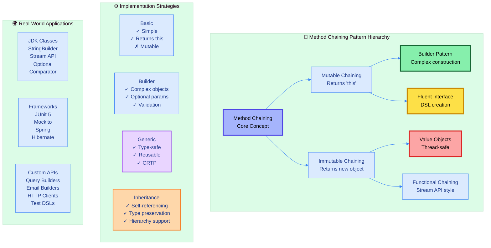

---

## 📑 Table of Contents
1.  [Method Chaining Fundamentals](#1-method-chaining-fundamentals)
    -   [Core Concept & 'this' Keyword](#11-core-concept--this-keyword)
    -   [Mutable vs Immutable Chaining](#12-mutable-vs-immutable-chaining)
    -   [Advantages & Trade-offs](#13-advantages--trade-offs)
2.  [Builder Pattern](#2-builder-pattern)
    -   [Telescoping Constructor Problem](#21-telescoping-constructor-problem)
    -   [Builder Solution](#22-builder-solution)
    -   [Stepwise Builder Pattern](#23-stepwise-builder-pattern)
3.  [Fluent Interface Design](#3-fluent-interface-design)
    -   [DSL Creation Principles](#31-dsl-creation-principles)
    -   [Query Builder Pattern](#32-query-builder-pattern)
    -   [Method Naming Conventions](#33-method-naming-conventions)
4.  [Immutable Method Chaining](#4-immutable-method-chaining)
    -   [Immutability Benefits](#41-immutability-benefits)
    -   [Thread-Safety Guarantees](#42-thread-safety-guarantees)
    -   [Performance Considerations](#43-performance-considerations)
5.  [Generic Method Chaining](#5-generic-method-chaining)
    -   [Type-Safe Builders](#51-type-safe-builders)
    -   [Generic Repository Pattern](#52-generic-repository-pattern)
6.  [Inheritance Challenges & Solutions](#6-inheritance-challenges--solutions)
    -   [The Type Erosion Problem](#61-the-type-erosion-problem)
    -   [Self-Referencing Generics (CRTP)](#62-self-referencing-generics-crtp)
    -   [Builder Hierarchy Pattern](#63-builder-hierarchy-pattern)
7.  [Real-World Applications](#7-real-world-applications)
8.  [Best Practices & Patterns](#8-best-practices--patterns)

<div align="right">
<sub><em>Comprehensive notes by Avinash Dhanuka | For educational purposes</em></sub>
</div>

---

## 1. METHOD CHAINING FUNDAMENTALS

### 📌 Definition
**Method Chaining** (also called **Fluent Interface**) is a technique where multiple method calls are chained together in a single statement. Each method returns an object (usually `this`), enabling the next method call in the chain. This creates expressive, readable code that flows like natural language.

### 1.1 Core Concept & 'this' Keyword

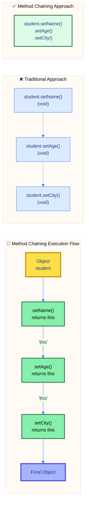

#### 📋 Core Principles

| Principle | Description | Benefit |
| :--- | :--- | :--- |
| **Return 'this'** | Each method returns current object reference | Enables chaining |
| **Consistent API** | Uniform method naming and behavior | Predictable usage |
| **Fluent Syntax** | Reads like natural language | High readability |
| **State Modification** | Methods modify object state | Progressive configuration |
| **Terminal Operation** | Optional final method (e.g., `build()`) | Explicit completion |

#### 🔍 The 'this' Keyword Explained

The `this` keyword is central to method chaining. It refers to the current object instance, allowing methods to return the object itself for further chaining.

**Traditional (No Chaining):**
```java
public void setName(String name) {
    this.name = name;
    // Returns nothing (void)
}
```

**Method Chaining (Returns 'this'):**
```java
public Student setName(String name) {
    this.name = name;
    return this;  // Returns current object
}
```

---

### 1.2 Mutable vs Immutable Chaining

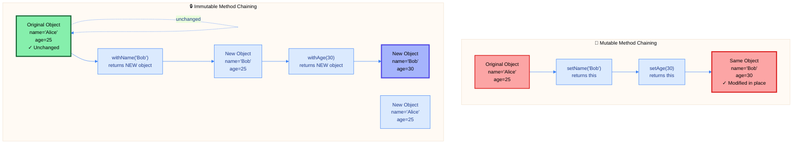

#### 📋 Comparison Table

| Aspect | Mutable Chaining | Immutable Chaining |
| :--- | :--- | :--- |
| **Returns** | Same object (`this`) | New object (`new`) |
| **Original Object** | Modified | Unchanged |
| **Thread-Safe** | ❌ No | ✅ Yes |
| **Memory** | Low (reuses object) | High (creates objects) |
| **Performance** | ⚡ Fast | 🐢 Slower |
| **Caching** | ❌ Difficult | ✅ Easy |
| **Side Effects** | ⚠️ Yes | ✅ None |
| **Use Case** | Configuration, builders | Value objects, functional style |
| **Examples** | `StringBuilder`, `ArrayList` | `String`, `LocalDate`, `BigDecimal` |

#### 🎯 When to Use Each Approach

**Use Mutable Chaining When:**
- Building complex objects (Builder Pattern)
- Performance is critical
- Object lifecycle is controlled
- Not used in multi-threaded context

**Use Immutable Chaining When:**
- Thread-safety required
- Value objects (like Money, Date, Point)
- Functional programming style
- Objects need to be cached or shared

---

### 1.3 Advantages & Trade-offs

#### ✅ Advantages

| Advantage | Description | Impact |
| :--- | :--- | :--- |
| **Readability** | Code flows like natural language | ⭐⭐⭐⭐⭐ |
| **Less Boilerplate** | Fewer lines, more concise | ⭐⭐⭐⭐ |
| **IDE Support** | Better auto-completion | ⭐⭐⭐⭐⭐ |
| **Self-Documenting** | Intent clear from method names | ⭐⭐⭐⭐ |
| **Fluent API** | Creates domain-specific languages | ⭐⭐⭐⭐⭐ |
| **Immutability** | Encourages immutable design | ⭐⭐⭐⭐ |

#### ❌ Trade-offs & Disadvantages

| Trade-off | Description | Mitigation |
| :--- | :--- | :--- |
| **Debugging** | Harder to set breakpoints | Use intermediate variables |
| **Stack Traces** | Less clear error locations | Add validation methods |
| **Null Handling** | NullPointerException in chain | Use Optional pattern |
| **Complexity** | Can be over-engineered | Keep it simple initially |
| **Learning Curve** | Requires pattern understanding | Good documentation |
| **Memory** | Immutable chains create objects | Use mutable for hot paths |

#### 🎓 Design Principles

```mermaid
%%{init: {
  "theme": "base",
  "themeVariables": {
    "primaryColor": "#dbeafe",
    "primaryTextColor": "#1e3a8a",
    "primaryBorderColor": "#3b82f6",
    "lineColor": "#3b82f6",
    "fontSize": "14px"
  }
}}%%

graph TB
    subgraph Fluent_Interface_Principles["💡 Fluent Interface Design Principles"]
        P1["1. Expressive Method Names<br/>Use verbs: set, with, add, configure"]
        P2["2. Consistent Return Types<br/>Return this or new object consistently"]
        P3["3. Progressive Disclosure<br/>Required → Optional → Build"]
        P4["4. Single Responsibility<br/>Each method does one thing"]
        P5["5. Validation at End<br/>Validate in build() method"]
        P6["6. Immutability Preference<br/>Prefer immutable for safety"]
        
        P1 --> P2
        P2 --> P3
        P3 --> P4
        P4 --> P5
        P5 --> P6
    end
    
    style P1 fill:#fde047,stroke:#ca8a04,stroke-width:2px
    style P2 fill:#fde047,stroke:#ca8a04,stroke-width:2px
    style P3 fill:#fde047,stroke:#ca8a04,stroke-width:2px
    style P4 fill:#fde047,stroke:#ca8a04,stroke-width:2px
    style P5 fill:#fde047,stroke:#ca8a04,stroke-width:2px
    style P6 fill:#fde047,stroke:#ca8a04,stroke-width:2px
```

---

## 2. BUILDER PATTERN

### 📌 Definition
The **Builder Pattern** is a creational design pattern that constructs complex objects step by step. It separates object construction from representation, allowing the same construction process to create different representations. Ideal for objects with many parameters, especially when many are optional.

### 2.1 Telescoping Constructor Problem

#### ❌ Anti-Pattern: Telescoping Constructors

When a class has many parameters, creating multiple constructors leads to the "telescoping constructor" anti-pattern:

```java
// 15+ constructor combinations needed!
public Person(String firstName, String lastName) { }
public Person(String firstName, String lastName, int age) { }
public Person(String firstName, String lastName, int age, String email) { }
public Person(String firstName, String lastName, int age, String email, String phone) { }
// ... and so on
```

#### 📋 Problems with Telescoping Constructors

| Problem | Description | Impact |
| :--- | :--- | :--- |
| **Combinatorial Explosion** | n parameters = 2^n constructors | 😱 Unmanageable |
| **Unclear Parameters** | `new Person("John", "Doe", 30, null, null)` | 😕 What are these nulls? |
| **No Parameter Names** | Can't tell what each param is | 🤷 Confusing |
| **Fixed Order** | Parameters must follow specific order | 🔒 Inflexible |
| **Optional Parameters** | Must pass null for unused params | 💩 Ugly |


---

### 2.2 Builder Solution

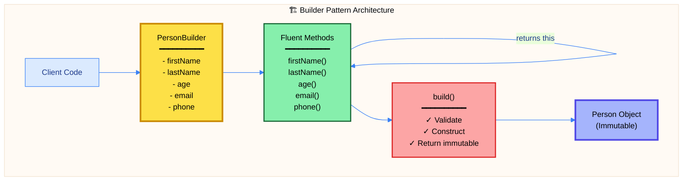

#### 📋 Builder Pattern Characteristics

| Characteristic | Description | Benefit |
| :--- | :--- | :--- |
| **Static Inner Class** | Builder inside the class it builds | Encapsulation |
| **Fluent Interface** | Each method returns `this` | Chaining |
| **Required Parameters** | Constructor takes mandatory fields | Enforces constraints |
| **Optional Parameters** | Fluent methods for optional fields | Flexibility |
| **Validation** | `build()` validates all fields | Data integrity |
| **Immutable Product** | Final object cannot be modified | Thread-safe |

#### ✅ Builder Pattern Benefits

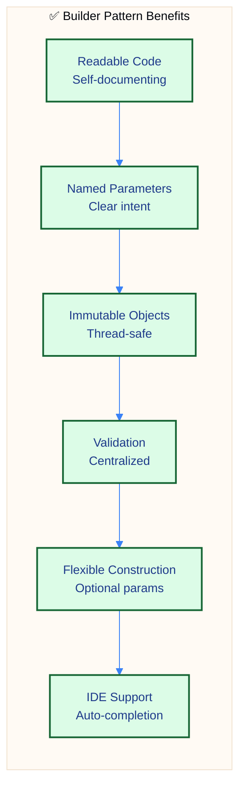

---

### 2.3 Stepwise Builder Pattern

The **Stepwise Builder** (also called **Telescopic Builder**) enforces the order of method calls through interfaces, ensuring required parameters are set before optional ones.

#### 📋 Stepwise Builder Stages

| Stage | Purpose | Returns |
| :--- | :--- | :--- |
| **Stage 1** | Set required field 1 | Stage2 interface |
| **Stage 2** | Set required field 2 | Stage3 interface |
| **Stage 3** | Set optional fields | Same stage (chaining) |
| **Final Stage** | Build object | Final product |

#### 🎯 When to Use Builder Pattern

**Use Builder Pattern When:**
- Class has 4+ parameters
- Many parameters are optional
- Need immutable objects
- Want clear object construction syntax
- Parameter validation required

**Don't Use When:**
- Class has 2-3 simple parameters
- All parameters are required
- Simple POJO with no validation
- Performance is critical (extra object creation)

---

## 3. FLUENT INTERFACE DESIGN

### 📌 Definition
A **Fluent Interface** is an object-oriented API that relies extensively on method chaining to create code that is readable and expressive, almost like natural language. It's the broader concept that includes Builder Pattern as a specific use case.

### 3.1 DSL Creation Principles

#### 📋 Domain-Specific Language (DSL) Characteristics

| Principle | Description | Example |
| :--- | :--- | :--- |
| **Readable** | Code reads like sentences | `query.select("name").from("users").where("age > 18")` |
| **Expressive** | Intent is clear | `email.to("user@example.com").subject("Hi").send()` |
| **Contextual** | Methods appear based on state | `query.from()` only after `select()` |
| **Progressive** | Guides user through API | Required → Optional → Terminal |
| **Type-Safe** | Compile-time checking | Generic builders |
| **Discoverable** | IDE auto-completion helps | Well-named methods |

---

### 3.2 Query Builder Pattern

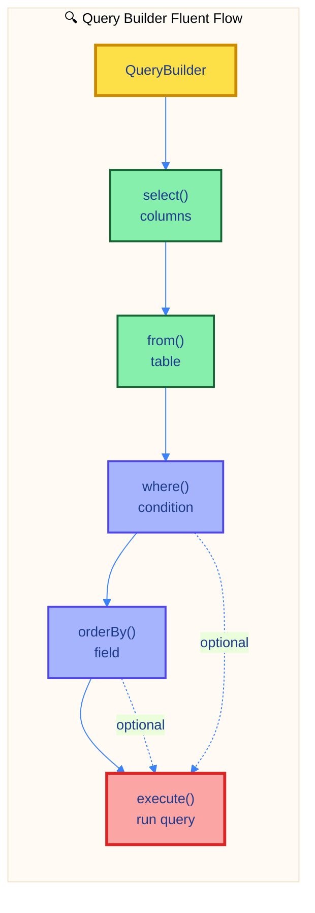

#### 🎯 Real-World Fluent APIs

| Framework | Pattern | Example |
| :--- | :--- | :--- |
| **JUnit 5** | Assertions | `assertThat(result).isNotNull().isEqualTo(expected)` |
| **Mockito** | Mocking | `when(mock.call()).thenReturn(value).thenThrow(exception)` |
| **Stream API** | Functional | `stream.filter().map().sorted().collect()` |
| **Spring** | Configuration | `@Bean().scope("prototype").lazy()` |
| **Hibernate** | Queries | `createQuery().setParameter().list()` |

---

### 3.3 Method Naming Conventions

#### 📋 Naming Pattern Guide

| Pattern | Use Case | Example | Returns |
| :--- | :--- | :--- | :--- |
| **set*** | Mutable setters | `setName()` | `this` |
| **with*** | Immutable setters | `withName()` | `new object` |
| **add*** | Collection addition | `addItem()` | `this` |
| **remove*** | Collection removal | `removeItem()` | `this` |
| **enable*** | Boolean flag on | `enableCache()` | `this` |
| **disable*** | Boolean flag off | `disableCache()` | `this` |
| **configure*** | Complex setup | `configureOptions()` | `this` |
| **build()** | Terminal operation | `build()` | `final product` |
| **execute()** | Terminal action | `execute()` | `result` |

---

## 4. IMMUTABLE METHOD CHAINING

### 📌 Definition
**Immutable Method Chaining** creates a new object for each method call instead of modifying the existing object. This ensures the original object remains unchanged, providing thread-safety and enabling functional programming patterns.

### 4.1 Immutability Benefits

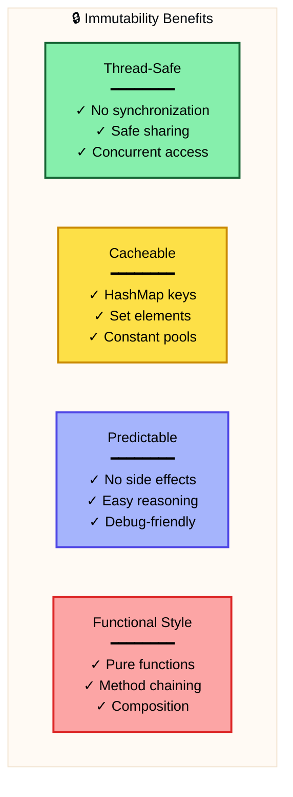

#### 📋 Immutable vs Mutable Comparison

| Aspect | Mutable | Immutable |
| :--- | :--- | :--- |
| **State Change** | Modified in place | New object created |
| **Thread-Safety** | ❌ Requires synchronization | ✅ Inherently thread-safe |
| **Side Effects** | ⚠️ Can have side effects | ✅ No side effects |
| **Debugging** | 🐛 State changes over time | ✅ State never changes |
| **Caching** | ❌ Cannot cache (state changes) | ✅ Safe to cache |
| **Performance** | ⚡ Fast (no object creation) | 🐢 Slower (creates objects) |
| **Memory** | 📉 Low memory usage | 📈 Higher memory usage |
| **Use in Collections** | ⚠️ Careful with HashMap keys | ✅ Perfect for HashMap keys |

---

### 4.2 Thread-Safety Guarantees

#### 🔒 Why Immutable Objects Are Thread-Safe

| Guarantee | Explanation | Benefit |
| :--- | :--- | :--- |
| **No State Change** | Object state cannot be modified | No race conditions |
| **Safe Publication** | Once created, always valid | No synchronization needed |
| **No Visibility Issues** | State visible to all threads | No volatile needed |
| **No Lock Contention** | Multiple threads read freely | High concurrency |
| **No Defensive Copies** | Can share references safely | Memory efficient |

#### 📋 Thread-Safety Comparison

| Scenario | Mutable | Immutable |
| :--- | :--- | :--- |
| **Multiple Readers** | ⚠️ Synchronization needed | ✅ Free concurrent access |
| **Writer Present** | 🔒 Lock required | ✅ Create new object |
| **Collections** | ⚠️ ConcurrentHashMap needed | ✅ Regular HashMap works |
| **Caching** | ❌ Difficult (state changes) | ✅ Easy (never changes) |
| **Performance** | 📉 Lock contention | ✅ No blocking |

---

### 4.3 Performance Considerations

#### 📊 Performance Trade-offs

| Factor | Mutable | Immutable | Winner |
| :--- | :--- | :--- | :--- |
| **Object Creation** | ✅ None | ❌ Every operation | Mutable |
| **Memory Allocation** | ✅ Reuse | ❌ New allocations | Mutable |
| **Garbage Collection** | ✅ Less GC pressure | ❌ More GC pressure | Mutable |
| **Thread Synchronization** | ❌ Lock overhead | ✅ No locks | Immutable |
| **Cache Locality** | ✅ Better (same object) | ❌ Worse (new objects) | Mutable |
| **Concurrent Performance** | ❌ Contention | ✅ Lock-free | Immutable |

#### 🎯 When to Choose Each

**Choose Mutable When:**
- Single-threaded context
- High-frequency modifications
- Performance critical (hot path)
- Large objects (StringBuilder)
- Memory constrained

**Choose Immutable When:**
- Multi-threaded access
- Value objects (Money, Date, Point)
- Used as HashMap keys
- Caching required
- Functional programming style

---

## 5. GENERIC METHOD CHAINING

### 📌 Definition
**Generic Method Chaining** uses Java generics to create type-safe, reusable fluent APIs. This allows building flexible components that work with any type while maintaining compile-time type checking.

### 5.1 Type-Safe Builders

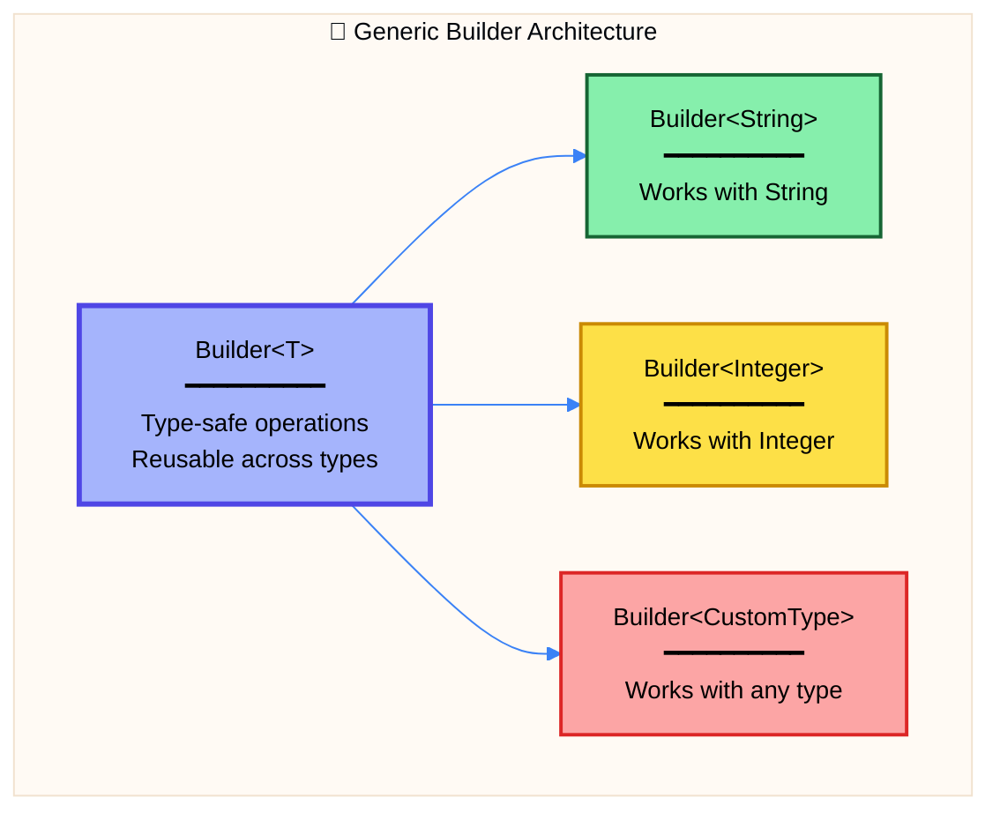

#### 📋 Generic Chaining Benefits

| Benefit | Description | Impact |
| :--- | :--- | :--- |
| **Type Safety** | Compile-time type checking | ⭐⭐⭐⭐⭐ |
| **Reusability** | Single implementation, many types | ⭐⭐⭐⭐⭐ |
| **No Casting** | Compiler infers types | ⭐⭐⭐⭐ |
| **Flexibility** | Works with any type | ⭐⭐⭐⭐⭐ |
| **IDE Support** | Better auto-completion | ⭐⭐⭐⭐ |
| **Maintainability** | Less code duplication | ⭐⭐⭐⭐ |

---

### 5.2 Generic Repository Pattern

#### 📋 Generic Repository Characteristics

| Characteristic | Description | Example |
| :--- | :--- | :--- |
| **Type Parameter** | `<T>` represents entity type | `Repository<User>` |
| **Fluent Methods** | Chainable filter, sort, select | `.where().orderBy()` |
| **Type Preservation** | Returns `Repository<T>` | Maintains type |
| **Compile-Time Safety** | No runtime type errors | Type checking |
| **Reusable** | Works with any entity | Universal |

---

## 6. INHERITANCE CHALLENGES & SOLUTIONS

### 📌 The Problem
Method chaining breaks with inheritance because child class methods return the parent type, losing access to child-specific methods. This is called **type erasure** or **type loss**.

### 6.1 The Type Erosion Problem

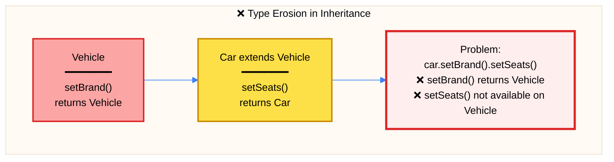

#### 📋 Why Type Erosion Happens

| Cause | Explanation | Impact |
| :--- | :--- | :--- |
| **Parent Return Type** | Parent methods return parent type | Lose child methods |
| **No Covariant Return** | Before Java 5, no covariant returns | Breaking change |
| **Type Information Loss** | Compiler sees parent type | No access to child |
| **Chaining Breaks** | Cannot continue with child methods | 💔 Fluent API broken |

---

### 6.2 Self-Referencing Generics (CRTP)

**CRTP** (Curiously Recurring Template Pattern) solves type erasure using self-referencing generic types.

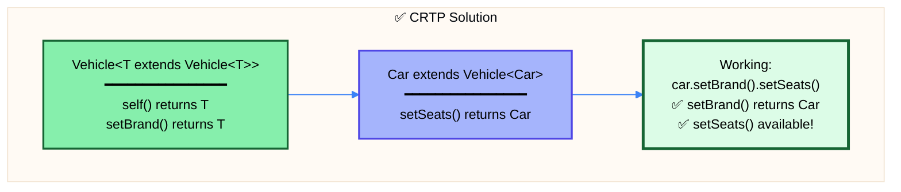

#### 📋 CRTP Pattern Structure

| Component | Purpose | Syntax |
| :--- | :--- | :--- |
| **Type Parameter** | Self-reference | `<T extends Vehicle<T>>` |
| **self() Method** | Safe casting | `return (T) this;` |
| **Method Return** | Returns generic type | `public T setBrand()` |
| **Concrete Class** | Specifies itself | `class Car extends Vehicle<Car>` |

#### 🎯 CRTP Benefits & Trade-offs

| Aspect | Benefit/Trade-off | Rating |
| :--- | :--- | :--- |
| **Type Safety** | ✅ Maintains type through hierarchy | ⭐⭐⭐⭐⭐ |
| **Fluent API** | ✅ Chaining works perfectly | ⭐⭐⭐⭐⭐ |
| **Complexity** | ⚠️ Generic syntax complex | ⭐⭐ |
| **Learning Curve** | ⚠️ Hard for beginners | ⭐⭐ |
| **IDE Support** | ✅ Works well | ⭐⭐⭐⭐ |
| **Maintainability** | ⚠️ Can be confusing | ⭐⭐⭐ |

---

### 6.3 Builder Hierarchy Pattern

Alternative solution using separate builder classes for each level of the hierarchy.

#### 📋 Builder Hierarchy vs CRTP

| Approach | Pros | Cons | Use When |
| :--- | :--- | :--- | :--- |
| **CRTP** | Less code, elegant | Complex generics | Simple hierarchies |
| **Builder Hierarchy** | Clear separation | More code | Complex builders |

---

## 7. REAL-WORLD APPLICATIONS

### 📋 Java Standard Library Examples

| Class | Pattern | Use Case | Example |
| :--- | :--- | :--- | :--- |
| **StringBuilder** | Mutable chaining | String construction | `append().insert().reverse()` |
| **Stream API** | Immutable chaining | Functional programming | `filter().map().collect()` |
| **Optional** | Immutable chaining | Null handling | `map().filter().orElse()` |
| **Comparator** | Immutable chaining | Sorting | `comparing().thenComparing()` |
| **LocalDate** | Immutable chaining | Date manipulation | `plusDays().plusMonths()` |
| **BigDecimal** | Immutable chaining | Financial math | `add().multiply().divide()` |

### 📋 Popular Framework Patterns

| Framework | Pattern | Example |
| :--- | :--- | :--- |
| **JUnit 5** | Fluent assertions | `assertThat().isNotNull().isEqualTo()` |
| **Mockito** | Fluent stubbing | `when().thenReturn().thenThrow()` |
| **Spring** | Configuration | `@Bean().scope().lazy()` |
| **Hibernate** | Query building | `createQuery().setParameter().list()` |
| **Lombok** | Code generation | `@Builder` generates builder |

---

## 8. BEST PRACTICES & PATTERNS

### 📋 Design Guidelines

| Guideline | Description | Priority |
| :--- | :--- | :--- |
| **Return 'this' for Mutable** | Enable chaining on same object | ⭐⭐⭐⭐⭐ |
| **Return New for Immutable** | Preserve original object | ⭐⭐⭐⭐⭐ |
| **Consistent Naming** | Use verb-based method names | ⭐⭐⭐⭐ |
| **Terminal Operations** | End chains with build()/execute() | ⭐⭐⭐⭐ |
| **Validation in build()** | Centralize validation | ⭐⭐⭐⭐⭐ |
| **Prefer Immutability** | Default to immutable when possible | ⭐⭐⭐⭐ |

### 📋 Common Mistakes to Avoid

| ❌ Mistake | ✅ Correct Approach |
| :--- | :--- |
| Mixing mutable and immutable patterns | Choose one pattern consistently |
| No validation in build() | Always validate before construction |
| Complex chains without documentation | Document expected usage |
| Using void return types | Always return this or new object |
| No null checks | Validate inputs, use Optional |
| Over-engineering simple classes | Builder for 4+ parameters only |

### 🎯 When to Use Each Pattern

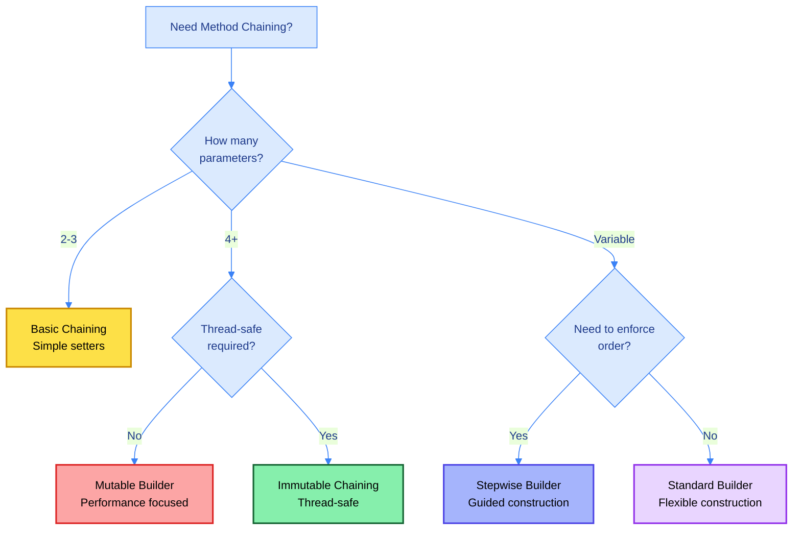

---

## 📚 Summary

### Quick Reference Card

| Pattern | Mutability | Use Case | Complexity |
| :--- | :--- | :--- | :--- |
| **Basic Chaining** | Mutable | Simple setters | Low |
| **Builder Pattern** | Mutable → Immutable | Complex objects | Medium |
| **Fluent Interface** | Either | DSL creation | Medium |
| **Immutable Chaining** | Immutable | Value objects | Medium |
| **Generic Chaining** | Either | Type-safe builders | High |
| **CRTP** | Either | Inheritance | High |

### Key Takeaways

1. **Method Chaining**: Calls methods in sequence by returning `this` or new object
2. **Builder Pattern**: Solves telescoping constructor problem with fluent API
3. **Fluent Interface**: Creates readable, expressive code like natural language
4. **Immutability**: Provides thread-safety but creates more objects
5. **CRTP**: Solves type erosion in inheritance using self-referencing generics
6. **Choose Wisely**: Based on parameters count, thread-safety needs, and performance

---

<div align="center">

### 🎯 Master These Concepts

**Basic Chaining** → Fundamentals with 'this' keyword  
**Builder Pattern** → Complex object construction  
**Fluent Interface** → Expressive, readable APIs  
**Immutable Chaining** → Thread-safe transformations  
**Generic Chaining** → Type-safe reusable builders  
**CRTP** → Inheritance without type loss

---

<sub>**© 2026 Avinash Dhanuka** | Method Chaining & Fluent Interface Design Master Guide</sub>

<sub>📧 [avunashdhanuka@gmail.com](mailto:avunashdhanuka@gmail.com) | 🔗 [GitHub: Avinash-706](https://github.com/Avinash-706)</sub>

</div>
