# ☕ Master Guide: JDBC - Java Database Connectivity

<div align="center">


</div>


<hr style="border: 1px solid rgb(98, 117, 187)">

<div align="center">
<table>
<tr>
<td align="center">
<br />

<h3>© 2026 Avinash Dhanuka</h3>
<p>Master Guide: Java Database Connectivity</p>
<p><em>Crafted with ❤️ for Database Architecture</em></p>

<a href="https://github.com/Avinash-706" target="_blank">

</a>

<a href="https://mail.google.com/mail/?view=cm&fs=1&to=avunashdhanuka@gmail.com&su=JDBC%20Query&body=☕%20Hello%20Avinash,%0D%0A%0D%0AMy%20name%20is%20[Your%20Name]%20and%20I%20have%20a%20doubt%20regarding%20JDBC.%0D%0A%0D%0A🔹%20Topic:%20[JDBC/Database]%0D%0A🔹%20Question:%20[Type%20your%20question]%0D%0A%0D%0AThank%20you!" target="_blank">


</a>
<br />
<br />
</td>
</tr>
</table>
</div>

> **Author's Note:** This comprehensive guide explores JDBC (Java Database Connectivity) from foundational concepts to advanced patterns. Master connection management, statement types, transaction handling, metadata operations, and production-ready best practices. Includes architecture diagrams, performance analysis, and real-world design patterns like DAO and Connection Pooling.

---

## 🏗️ JDBC Architecture Overview

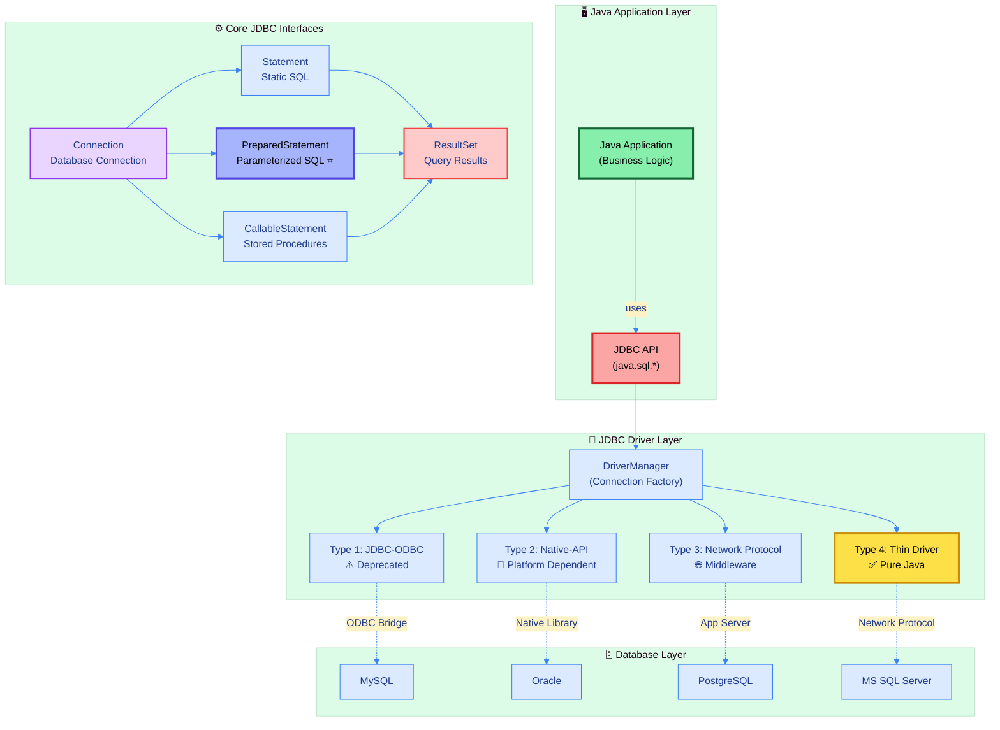

---

## 📑 Table of Contents

1. [JDBC Fundamentals](#1-jdbc-fundamentals)
   - [What is JDBC?](#11-what-is-jdbc)
   - [JDBC Architecture](#12-jdbc-architecture)
   - [Driver Types Comparison](#13-driver-types-comparison)
2. [Core Components](#2-core-components)
   - [Connection Management](#21-connection-management)
   - [Statement Types](#22-statement-types)
   - [ResultSet Types](#23-resultset-types)
3. [Transaction Management](#3-transaction-management)
   - [ACID Properties](#31-acid-properties)
   - [Isolation Levels](#32-isolation-levels)
   - [Savepoints](#33-savepoints)
4. [Advanced Topics](#4-advanced-topics)
   - [Connection Pooling](#41-connection-pooling)
   - [Batch Processing](#42-batch-processing)
   - [BLOB & CLOB](#43-blob--clob)
5. [Design Patterns](#5-design-patterns)
   - [DAO Pattern](#51-dao-pattern)
   - [Best Practices](#52-best-practices)
6. [Performance Optimization](#6-performance-optimization)
7. [Complete File Guide](#7-complete-file-guide)

<div align="right">
<sub><em>Comprehensive notes by Avinash Dhanuka | For educational purposes</em></sub>
</div>

---

## 1. JDBC Fundamentals

### 1.1 What is JDBC?

#### 📌 Definition
**JDBC (Java Database Connectivity)** is a Java API that enables Java applications to interact with relational databases. It provides a standard interface for database connectivity, allowing developers to write database-independent code.

#### 🎯 Key Features

| Feature | Description | Benefit |
|:--------|:------------|:--------|
| **Database Independence** | Works with any RDBMS | Write once, use anywhere |
| **Standard API** | Consistent interface (java.sql.*) | Easy to learn and use |
| **Multiple Drivers** | Support for Type 1-4 drivers | Flexibility in deployment |
| **Transaction Support** | ACID properties, rollback, commit | Data consistency |
| **Performance** | Batch processing, pooling | High throughput |
| **Security** | PreparedStatement | SQL injection prevention |

#### 📦 Package Structure

```
java.sql
├── DriverManager       (Connection factory)
├── Connection          (Database connection)
├── Statement           (Static SQL execution)
├── PreparedStatement   (Parameterized SQL)
├── CallableStatement   (Stored procedures)
├── ResultSet           (Query results)
├── DatabaseMetaData    (Database information)
├── ResultSetMetaData   (Result structure)
└── SQLException        (Error handling)
```

---

### 1.2 JDBC Architecture

#### 🏛️ Two-Tier Architecture

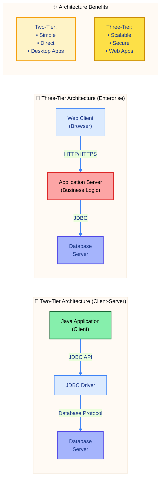

#### 🔄 JDBC Execution Flow

1. **Load Driver** → `Class.forName()` or automatic (JDBC 4.0+)
2. **Establish Connection** → `DriverManager.getConnection()`
3. **Create Statement** → `connection.createStatement()` or `prepareStatement()`
4. **Execute Query** → `executeQuery()`, `executeUpdate()`, `execute()`
5. **Process Results** → Iterate through `ResultSet`
6. **Close Resources** → Close ResultSet, Statement, Connection (reverse order)

---

### 1.3 Driver Types Comparison

#### 📊 JDBC Driver Types

```mermaid
%%{init: {
  "theme": "base",
  "themeVariables": {
    "primaryColor": "#dbeafe",
    "primaryTextColor": "#1e3a8a",
    "primaryBorderColor": "#3b82f6",
    "lineColor": "#3b82f6",
    "fontSize": "14px"
  }
}}%%

graph TB
    subgraph Type1["Type 1: JDBC-ODBC Bridge"]
        T1_App["Java App"]
        T1_JDBC["JDBC"]
        T1_ODBC["ODBC Driver"]
        T1_DB["Database"]
        
        T1_App --> T1_JDBC
        T1_JDBC --> T1_ODBC
        T1_ODBC --> T1_DB
        
        T1_Status["❌ Deprecated<br/>⚠️ Platform Dependent<br/>🐌 Slow Performance"]
    end
    
    subgraph Type2["Type 2: Native-API Driver"]
        T2_App["Java App"]
        T2_JDBC["JDBC"]
        T2_Native["Vendor Native<br/>Library (C/C++)"]
        T2_DB["Database"]
        
        T2_App --> T2_JDBC
        T2_JDBC --> T2_Native
        T2_Native --> T2_DB
        
        T2_Status["⚠️ Platform Dependent<br/>⚡ Faster than Type 1<br/>🔧 Requires Native Install"]
    end
    
    subgraph Type3["Type 3: Network Protocol"]
        T3_App["Java App"]
        T3_JDBC["JDBC"]
        T3_Middleware["Middleware<br/>Server"]
        T3_DB["Database"]
        
        T3_App --> T3_JDBC
        T3_JDBC --> T3_Middleware
        T3_Middleware --> T3_DB
        
        T3_Status["✅ Database Independent<br/>🌐 Network Based<br/>🔒 Supports Load Balancing"]
    end
    
    subgraph Type4["Type 4: Thin Driver (Pure Java)"]
        T4_App["Java App"]
        T4_JDBC["JDBC"]
        T4_DB["Database"]
        
        T4_App --> T4_JDBC
        T4_JDBC --> T4_DB
        
        T4_Status["✅ Pure Java<br/>✅ Platform Independent<br/>⚡ Best Performance<br/>🎯 Most Popular"]
    end
    
    style T1_Status fill:#fca5a5,stroke:#dc2626,stroke-width:2px
    style T2_Status fill:#fde047,stroke:#ca8a04,stroke-width:2px
    style T3_Status fill:#a5b4fc,stroke:#4f46e5,stroke-width:2px
    style T4_Status fill:#86efac,stroke:#166534,stroke-width:3px,color:#000
```

#### 🎯 Driver Comparison Table

| Feature | Type 1 | Type 2 | Type 3 | Type 4 ⭐ |
|:--------|:------:|:------:|:------:|:--------:|
| **Pure Java** | ❌ | ❌ | ✅ | ✅ |
| **Platform Independent** | ❌ | ❌ | ✅ | ✅ |
| **Performance** | Poor | Good | Good | Excellent |
| **Native Install** | ODBC | Required | Not Required | Not Required |
| **Network Protocol** | ❌ | ❌ | ✅ | ✅ |
| **Production Use** | ❌ Deprecated | Rare | Moderate | ✅ Recommended |
| **Example** | JdbcOdbc | OCI (Oracle) | IDS Server | MySQL Connector/J |

#### 💡 Which Driver to Use?

**Recommendation:** Always use **Type 4 (Thin Driver)** for modern applications

**Reasons:**
- ✅ Pure Java (no native dependencies)
- ✅ Platform independent
- ✅ Best performance (direct communication)
- ✅ Easy deployment
- ✅ No middleware required
- ✅ Most vendor support

---

## 2. Core Components

### 2.1 Connection Management

#### 📌 What is Connection?

A **Connection** object represents a session with a specific database. It provides methods to create statements, manage transactions, and retrieve metadata.

#### 🔗 Connection Lifecycle

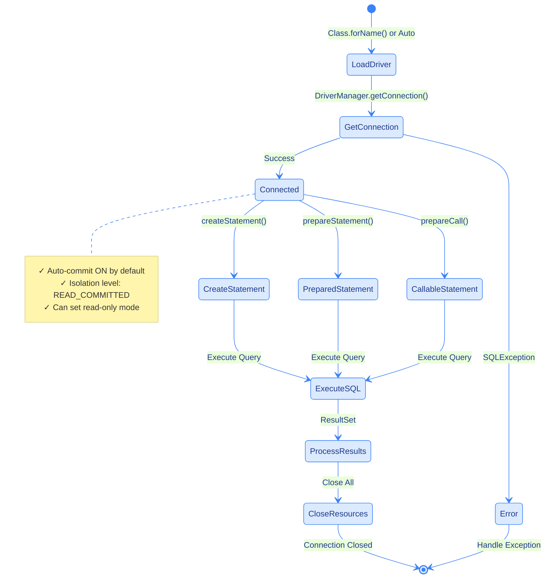

#### 📋 Connection Methods

| Method | Purpose | Example |
|:-------|:--------|:--------|
| `createStatement()` | Create Statement for static SQL | `conn.createStatement()` |
| `prepareStatement(sql)` | Create PreparedStatement | `conn.prepareStatement("SELECT * FROM users WHERE id = ?")` |
| `prepareCall(sql)` | Create CallableStatement | `conn.prepareCall("{CALL getUser(?)}")` |
| `setAutoCommit(boolean)` | Enable/disable auto-commit | `conn.setAutoCommit(false)` |
| `commit()` | Commit current transaction | `conn.commit()` |
| `rollback()` | Rollback current transaction | `conn.rollback()` |
| `setSavepoint()` | Create savepoint | `Savepoint sp = conn.setSavepoint()` |
| `close()` | Close connection | `conn.close()` |
| `isClosed()` | Check if closed | `conn.isClosed()` |
| `getMetaData()` | Get database metadata | `conn.getMetaData()` |

#### 🔐 Connection URL Format

```
jdbc:<subprotocol>://<host>:<port>/<database>?<parameters>

Examples:
jdbc:mysql://localhost:3306/testdb?useSSL=false
jdbc:oracle:thin:@localhost:1521:orcl
jdbc:postgresql://localhost:5432/mydb
jdbc:sqlserver://localhost:1433;databaseName=mydb
```

---

### 2.2 Statement Types

#### 🎯 Statement Hierarchy

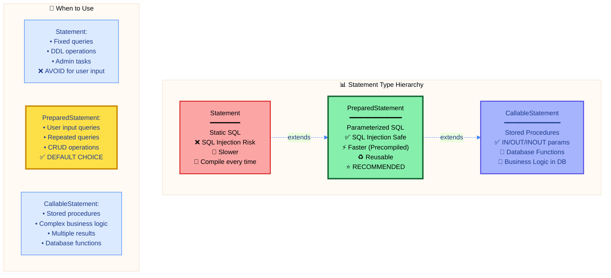

#### ⚖️ Statement Comparison

| Feature | Statement | PreparedStatement ⭐ | CallableStatement |
|:--------|:---------:|:-------------------:|:-----------------:|
| **SQL Type** | Static | Parameterized | Stored Procedure |
| **Compilation** | Every time | Once (cached) | Once |
| **Performance** | Slow | Fast | Fast |
| **SQL Injection** | ❌ Vulnerable | ✅ Safe | ✅ Safe |
| **Reusability** | Low | High | High |
| **Batch Support** | ✅ | ✅ | ✅ |
| **Parameters** | ❌ | ✅ (?) | ✅ (IN/OUT/INOUT) |
| **Use Case** | Fixed queries | Most operations | Stored procedures |
| **Example** | `SELECT *` | `SELECT * WHERE id=?` | `{CALL getUser(?)}` |

#### 🔍 SQL Injection Comparison

**❌ Vulnerable (Statement):**
```java
String sql = "SELECT * FROM users WHERE username = '" + userInput + "'";
// If userInput = "admin' OR '1'='1"
// SQL becomes: SELECT * FROM users WHERE username = 'admin' OR '1'='1'
// Returns ALL users!
```

**✅ Safe (PreparedStatement):**
```java
String sql = "SELECT * FROM users WHERE username = ?";
PreparedStatement pstmt = conn.prepareStatement(sql);
pstmt.setString(1, userInput);
// userInput treated as literal string, not SQL code
```

---

### 2.3 ResultSet Types

#### 📌 What is ResultSet?

A **ResultSet** object maintains a cursor pointing to its current row of data. It provides methods to retrieve column values of the current row.

#### 🎯 ResultSet Types & Concurrency

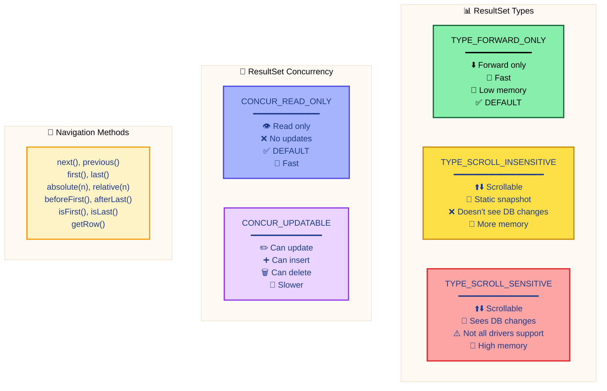

#### 📋 ResultSet Type Comparison

| Type | Scrollable | Sees Changes | Memory | Performance | Use Case |
|:-----|:----------:|:------------:|:------:|:-----------:|:---------|
| **FORWARD_ONLY** | ❌ | N/A | Low | Fast | Default, large results |
| **SCROLL_INSENSITIVE** | ✅ | ❌ | Medium | Moderate | Navigation needed, snapshot |
| **SCROLL_SENSITIVE** | ✅ | ✅ | High | Slow | Real-time data, rarely supported |

#### 🎯 Concurrency Modes

| Mode | Update | Insert | Delete | Performance | Use Case |
|:-----|:------:|:------:|:------:|:-----------:|:---------|
| **READ_ONLY** | ❌ | ❌ | ❌ | Fast | Query operations |
| **UPDATABLE** | ✅ | ✅ | ✅ | Slow | Direct updates via ResultSet |

#### 💻 Creating Different ResultSet Types

```java
// Default: FORWARD_ONLY, READ_ONLY
Statement stmt = conn.createStatement();

// Scrollable, read-only
Statement stmt = conn.createStatement(
    ResultSet.TYPE_SCROLL_INSENSITIVE, 
    ResultSet.CONCUR_READ_ONLY
);

// Scrollable, updatable
Statement stmt = conn.createStatement(
    ResultSet.TYPE_SCROLL_INSENSITIVE,
    ResultSet.CONCUR_UPDATABLE
);
```

---

## 3. Transaction Management

### 3.1 ACID Properties

#### 📌 What is a Transaction?

A **transaction** is a sequence of database operations that are executed as a single unit of work. Transactions ensure data integrity and consistency.

#### 🎯 ACID Properties Explained

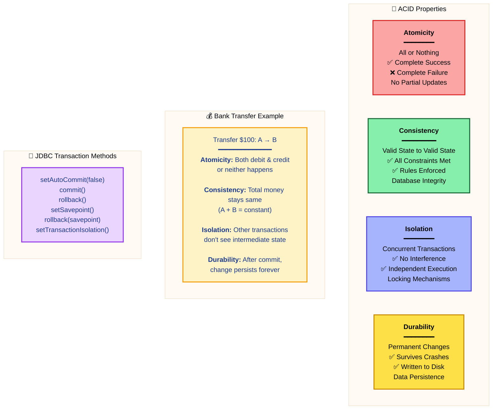

#### 📋 Transaction Operations

| Operation | Method | Description |
|:----------|:-------|:------------|
| **Start Transaction** | `setAutoCommit(false)` | Disable auto-commit mode |
| **Commit** | `commit()` | Make changes permanent |
| **Rollback** | `rollback()` | Undo all changes |
| **Savepoint** | `setSavepoint(name)` | Create checkpoint |
| **Rollback to Savepoint** | `rollback(savepoint)` | Undo to checkpoint |
| **Release Savepoint** | `releaseSavepoint(savepoint)` | Remove checkpoint |
| **End Transaction** | `setAutoCommit(true)` | Re-enable auto-commit |

---

### 3.2 Isolation Levels

#### 🎯 Transaction Isolation Levels

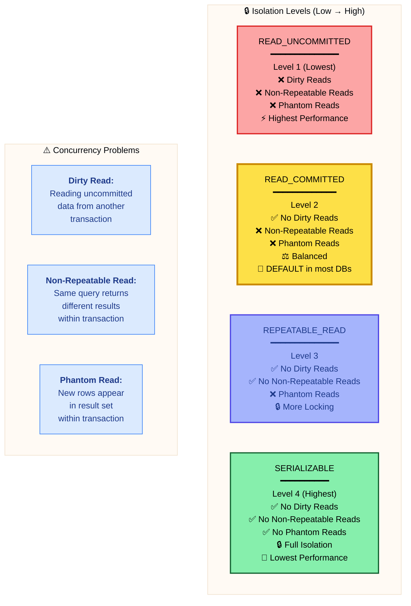

#### 📊 Isolation Level Comparison

| Level | Dirty Read | Non-Repeatable Read | Phantom Read | Performance | Use Case |
|:------|:----------:|:-------------------:|:------------:|:-----------:|:---------|
| **READ_UNCOMMITTED** | ❌ Possible | ❌ Possible | ❌ Possible | ⚡⚡⚡⚡ | Reporting, logs |
| **READ_COMMITTED** | ✅ Prevented | ❌ Possible | ❌ Possible | ⚡⚡⚡ | **Default, most apps** |
| **REPEATABLE_READ** | ✅ Prevented | ✅ Prevented | ❌ Possible | ⚡⚡ | Financial data |
| **SERIALIZABLE** | ✅ Prevented | ✅ Prevented | ✅ Prevented | ⚡ | Critical transactions |

#### 💡 Concurrency Problems Explained

**1. Dirty Read:**
```
Transaction A: UPDATE balance SET amount = 500 WHERE id = 1
Transaction B: SELECT amount FROM balance WHERE id = 1  // Reads 500
Transaction A: ROLLBACK  // Amount back to original
// Transaction B read uncommitted data!
```

**2. Non-Repeatable Read:**
```
Transaction A: SELECT amount FROM balance WHERE id = 1  // Returns 1000
Transaction B: UPDATE balance SET amount = 500 WHERE id = 1
Transaction B: COMMIT
Transaction A: SELECT amount FROM balance WHERE id = 1  // Returns 500
// Same query, different result!
```

**3. Phantom Read:**
```
Transaction A: SELECT COUNT(*) FROM orders WHERE status = 'PENDING'  // Returns 5
Transaction B: INSERT INTO orders VALUES (6, 'PENDING')
Transaction B: COMMIT
Transaction A: SELECT COUNT(*) FROM orders WHERE status = 'PENDING'  // Returns 6
// New rows appeared!
```

---

### 3.3 Savepoints

#### 📌 What are Savepoints?

**Savepoints** allow you to create checkpoints within a transaction, enabling partial rollback without undoing the entire transaction.

#### 🎯 Savepoint Operations

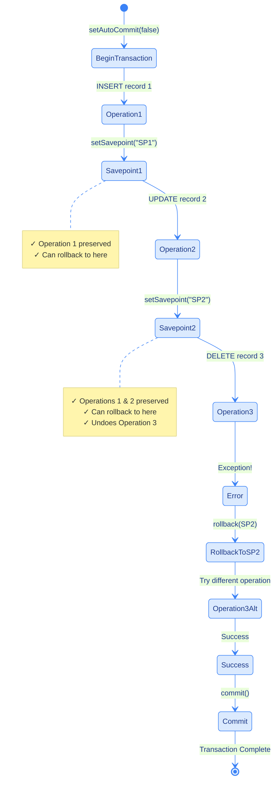

#### 💻 Savepoint Methods

| Method | Description | Example |
|:-------|:------------|:--------|
| `setSavepoint()` | Create unnamed savepoint | `Savepoint sp = conn.setSavepoint()` |
| `setSavepoint(name)` | Create named savepoint | `Savepoint sp = conn.setSavepoint("SP1")` |
| `rollback(savepoint)` | Rollback to savepoint | `conn.rollback(sp)` |
| `releaseSavepoint(savepoint)` | Remove savepoint | `conn.releaseSavepoint(sp)` |

#### 🎯 Savepoint Benefits

- ✅ **Partial Rollback**: Undo only recent operations
- ✅ **Error Recovery**: Try alternative approaches
- ✅ **Complex Transactions**: Multiple checkpoints
- ✅ **Performance**: Avoid full transaction restart
- ✅ **Flexibility**: Nested transaction-like behavior

---

## 4. Advanced Topics

### 4.1 Connection Pooling

#### 📌 What is Connection Pooling?

**Connection Pooling** is a technique where database connections are reused rather than created and destroyed for each request. This significantly improves application performance.

#### 🎯 Connection Pool Architecture

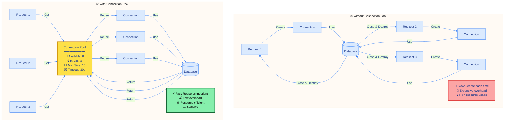

#### 📊 Connection Pool vs No Pool

| Aspect | No Pool | With Pool ⭐ |
|:-------|:-------:|:------------:|
| **Connection Creation** | Every request | Once (reused) |
| **Performance** | Slow | Fast |
| **Resource Usage** | High | Optimized |
| **Scalability** | Limited | Excellent |
| **Connection Overhead** | High | Minimal |
| **Production Use** | ❌ Not Recommended | ✅ Required |

#### 🔧 Popular Connection Pool Libraries

| Library | Features | Popularity |
|:--------|:---------|:-----------|
| **HikariCP** | Fastest, lightweight, zero overhead | ⭐⭐⭐⭐⭐ Most popular |
| **Apache DBCP** | Mature, feature-rich | ⭐⭐⭐⭐ |
| **C3P0** | Automatic retry, statement caching | ⭐⭐⭐ |
| **Tomcat JDBC Pool** | Simple, reliable | ⭐⭐⭐ |

#### ⚙️ Connection Pool Configuration

| Parameter | Description | Typical Value |
|:----------|:------------|:--------------|
| **initialSize** | Initial connections | 5-10 |
| **maxTotal** | Maximum connections | 50-100 |
| **minIdle** | Minimum idle connections | 5 |
| **maxIdle** | Maximum idle connections | 20 |
| **maxWaitMillis** | Wait timeout for connection | 30000 (30s) |
| **testOnBorrow** | Validate before use | true |
| **removeAbandoned** | Remove leaked connections | true |

---

### 4.2 Batch Processing

#### 📌 What is Batch Processing?

**Batch Processing** allows executing multiple SQL statements as a single batch, reducing network round-trips and improving performance.

#### 🎯 Single vs Batch Execution

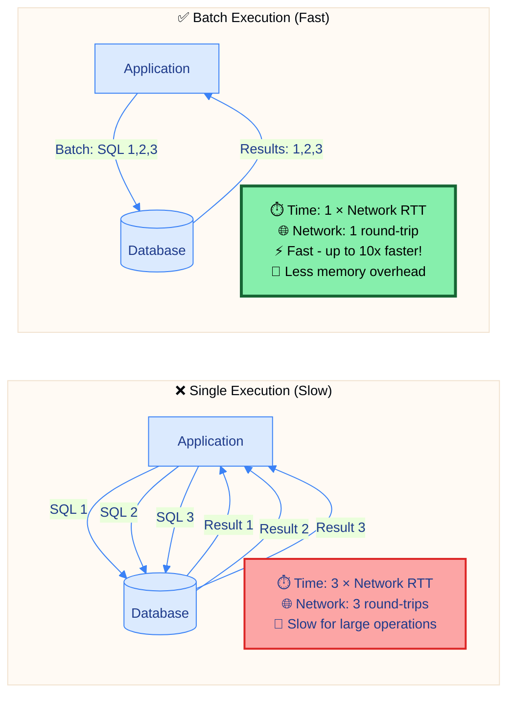

#### 📋 Batch Processing Methods

| Method | Description | Use Case |
|:-------|:------------|:---------|
| `addBatch()` | Add SQL to batch | Accumulate statements |
| `executeBatch()` | Execute all batched SQL | Run batch |
| `clearBatch()` | Clear batch queue | Reset batch |
| `getUpdateCount()` | Get single update count | Check individual result |
| `getMoreResults()` | Get next result | Multiple ResultSets |

#### 💡 Batch Processing Best Practices

| Practice | Benefit | Recommendation |
|:---------|:--------|:---------------|
| **Batch Size** | Balance memory & performance | 100-1000 statements |
| **Auto-commit** | Must be disabled | `setAutoCommit(false)` |
| **Error Handling** | Partial success possible | Check return values |
| **Clear Batch** | Prevent memory leaks | Call after execute |
| **Transaction** | All or nothing | Use commit/rollback |

---

### 4.3 BLOB & CLOB

#### 📌 What are BLOB and CLOB?

- **BLOB (Binary Large Object)**: Stores binary data (images, PDFs, videos)
- **CLOB (Character Large Object)**: Stores large text data (articles, XML, JSON)

#### 🎯 BLOB vs CLOB

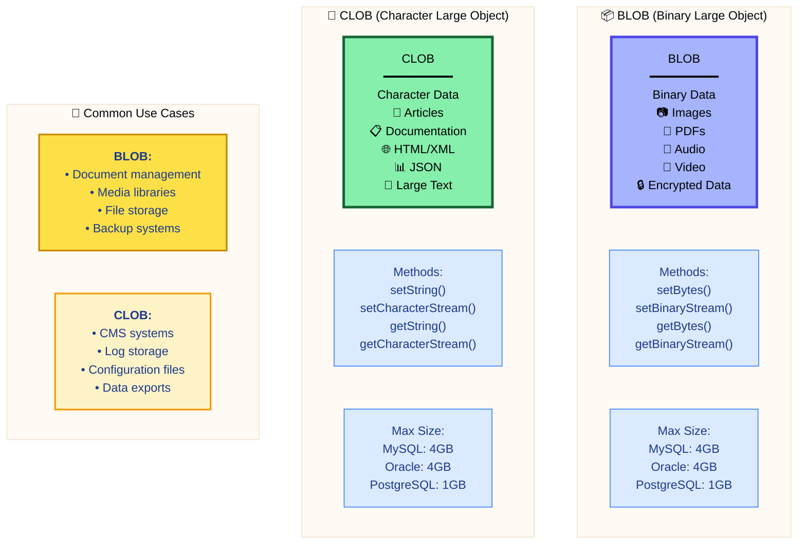

#### 📊 BLOB vs CLOB Comparison

| Feature | BLOB | CLOB |
|:--------|:----:|:----:|
| **Data Type** | Binary | Character |
| **Character Set** | None | Database charset |
| **Encoding** | Raw bytes | Text encoding |
| **Typical Use** | Images, files | Text, documents |
| **Storage** | Byte array | Character array |
| **Methods** | setBinaryStream() | setCharacterStream() |
| **Retrieval** | getBinaryStream() | getCharacterStream() |

#### 💡 BLOB/CLOB Best Practices

| Practice | Reason | Implementation |
|:---------|:-------|:---------------|
| **Use Streams** | Large data handling | `setBinaryStream()` instead of `setBytes()` |
| **Close Streams** | Resource cleanup | Always close in finally block |
| **Chunk Processing** | Memory efficiency | Read in chunks, not all at once |
| **File System Alternative** | Performance | Store path in DB, file on disk |
| **Compression** | Size reduction | Compress before storing |
| **Separate Table** | Query performance | Store LOBs in separate table |

---

## 5. Design Patterns

### 5.1 DAO Pattern

#### 📌 What is DAO Pattern?

**DAO (Data Access Object)** pattern separates data access logic from business logic, providing an abstract interface to the database.

#### 🎯 DAO Architecture

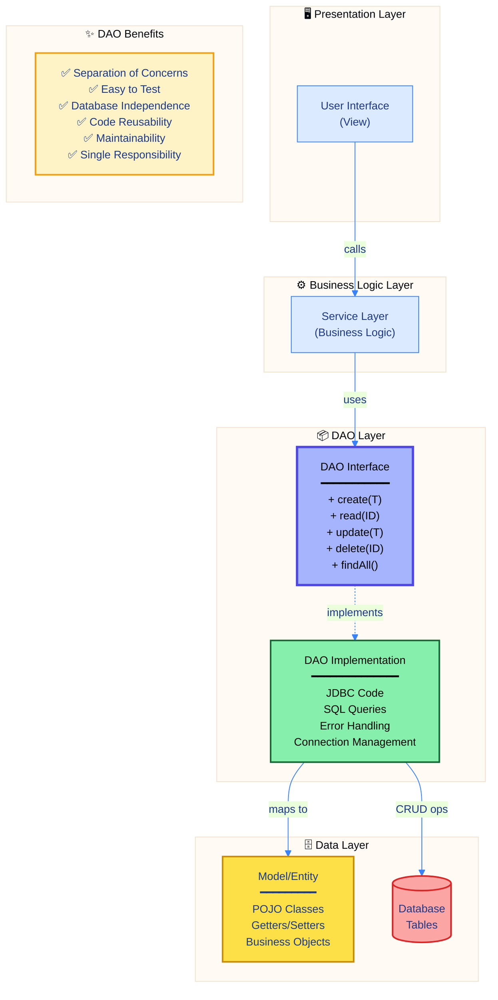

#### 📋 DAO Components

| Component | Role | Responsibility |
|:----------|:-----|:---------------|
| **Model/Entity** | Data representation | POJO with properties |
| **DAO Interface** | Contract definition | CRUD method signatures |
| **DAO Implementation** | Data access logic | JDBC code, SQL queries |
| **Service Layer** | Business logic | Uses DAO, orchestrates operations |
| **Database** | Data storage | Relational database |

#### 🎯 DAO Pattern Benefits

| Benefit | Description | Impact |
|:--------|:------------|:-------|
| **Separation of Concerns** | Data access ≠ Business logic | ✅ Clean architecture |
| **Testability** | Easy to mock DAO | ✅ Unit testing |
| **Database Independence** | Change DB without changing business logic | ✅ Flexibility |
| **Code Reusability** | Single DAO for multiple services | ✅ DRY principle |
| **Maintainability** | Changes localized to DAO | ✅ Easy updates |
| **Single Responsibility** | Each class has one purpose | ✅ SOLID principles |

---

### 5.2 Best Practices

#### 🎯 JDBC Best Practices Checklist

```mermaid
%%{init: {
  "theme": "base",
  "themeVariables": {
    "primaryColor": "#dbeafe",
    "primaryTextColor": "#1e3a8a",
    "primaryBorderColor": "#3b82f6",
    "lineColor": "#3b82f6",
    "fontSize": "14px"
  }
}}%%

graph TB
    subgraph Resource_Management["🔧 Resource Management"]
        R1["✅ Use try-with-resources<br/>✅ Close in reverse order<br/>✅ Close in finally block<br/>❌ Never ignore close()<br/>❌ Don't reuse closed resources"]
    end
    
    subgraph Security["🔒 Security"]
        S1["✅ Always use PreparedStatement<br/>✅ Validate input data<br/>✅ Use secure connections (SSL)<br/>❌ Never concatenate SQL<br/>❌ Don't expose credentials"]
    end
    
    subgraph Performance["⚡ Performance"]
        P1["✅ Use connection pooling<br/>✅ Batch operations<br/>✅ Set fetch size<br/>✅ Use appropriate isolation<br/>❌ Don't SELECT *<br/>❌ Avoid N+1 queries"]
    end
    
    subgraph Transactions["💰 Transactions"]
        T1["✅ Disable auto-commit<br/>✅ Handle exceptions<br/>✅ Use appropriate isolation<br/>✅ Commit/rollback properly<br/>❌ Don't leave open transactions"]
    end
    
    subgraph Error_Handling["⚠️ Error Handling"]
        E1["✅ Catch SQLException<br/>✅ Log errors properly<br/>✅ Rollback on failure<br/>✅ Provide meaningful messages<br/>❌ Don't swallow exceptions"]
    end
    
    subgraph Code_Quality["📝 Code Quality"]
        C1["✅ Use DAO pattern<br/>✅ Follow naming conventions<br/>✅ Document complex queries<br/>✅ Use constants for SQL<br/>❌ Don't mix concerns"]
    end
    
    style R1 fill:#86efac,stroke:#166534,stroke-width:2px,color:#000
    style S1 fill:#fca5a5,stroke:#dc2626,stroke-width:2px,color:#000
    style P1 fill:#a5b4fc,stroke:#4f46e5,stroke-width:2px,color:#000
    style T1 fill:#fde047,stroke:#ca8a04,stroke-width:2px,color:#000
    style E1 fill:#e9d5ff,stroke:#9333ea,stroke-width:2px
    style C1 fill:#fef3c7,stroke:#f59e0b,stroke-width:2px
```

#### ✅ DO's

| Category | Practice | Reason |
|:---------|:---------|:-------|
| **Statements** | Use PreparedStatement | SQL injection prevention, performance |
| **Resources** | Use try-with-resources | Automatic cleanup |
| **Connections** | Use connection pooling | Performance, scalability |
| **Transactions** | Disable auto-commit | Data consistency |
| **Batching** | Batch bulk operations | Reduce network overhead |
| **Exceptions** | Log and handle properly | Debugging, recovery |
| **SQL** | Specify columns explicitly | Performance, clarity |

#### ❌ DON'Ts

| Category | Practice | Problem | Alternative |
|:---------|:---------|:--------|:------------|
| **Statements** | String concatenation | SQL injection | PreparedStatement |
| **Resources** | Ignore close() | Memory leaks | try-with-resources |
| **Connections** | Create each time | Poor performance | Connection pool |
| **Transactions** | Leave auto-commit on | Inconsistent data | Disable for transactions |
| **SQL** | Use SELECT * | Unnecessary data | List specific columns |
| **Errors** | Swallow exceptions | Lost error info | Log and handle |
| **Design** | Mix data access & business | Poor maintainability | Use DAO pattern |

---

## 6. Performance Optimization

### 📊 Performance Comparison Matrix

| Technique | Speed Improvement | Use Case | Complexity |
|:----------|:-----------------:|:---------|:----------:|
| **Connection Pooling** | 10-50x faster | All production apps | Medium |
| **PreparedStatement** | 2-5x faster | Repeated queries | Low |
| **Batch Processing** | 10-100x faster | Bulk operations | Low |
| **Appropriate Fetch Size** | 2-10x faster | Large ResultSets | Low |
| **Statement Caching** | 2-5x faster | Repeated statements | Medium |
| **Proper Indexing** | 10-1000x faster | Query optimization | High |
| **Read-only ResultSet** | 1.5-2x faster | Non-updatable queries | Low |
| **Lower Isolation Level** | 2-5x faster | Non-critical data | Medium |

### 🎯 Optimization Decision Tree

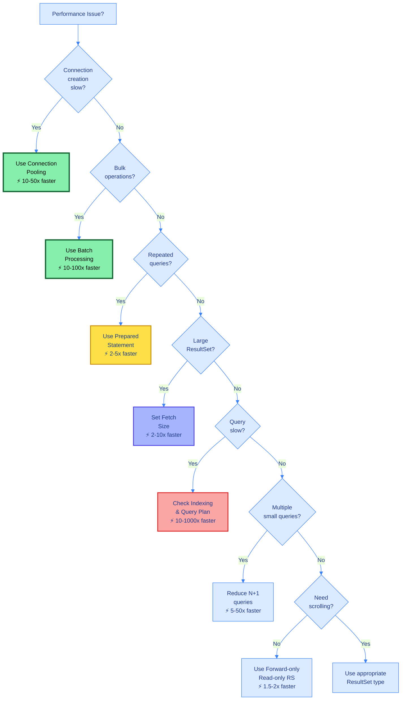

### 💡 Quick Performance Tips

1. **Always use connection pooling** in production
2. **Prefer PreparedStatement** over Statement
3. **Batch bulk operations** (INSERT, UPDATE, DELETE)
4. **Set appropriate fetch size** for large ResultSets
5. **Close resources** promptly to free memory
6. **Use appropriate isolation level** (lower = faster)
7. **Avoid SELECT *** - specify columns
8. **Index frequently queried columns**
9. **Cache PreparedStatements** when possible
10. **Monitor and log slow queries**

---

## 7. Complete File Guide

### 📚 Learning Progression

```mermaid
%%{init: {
  "theme": "base",
  "themeVariables": {
    "primaryColor": "#dbeafe",
    "primaryTextColor": "#1e3a8a",
    "primaryBorderColor": "#3b82f6",
    "lineColor": "#3b82f6",
    "fontSize": "15px"
  }
}}%%

graph TB
    subgraph Level1["🎓 Level 1: Foundations (Basic)"]
        F1["JDBCBasics.java<br/>━━━━━━━━━━━━<br/>Connection, Statement<br/>ResultSet, CRUD<br/>Resource Management"]
        F2["PreparedStatementDemo.java<br/>━━━━━━━━━━━━━━━━━━<br/>Parameterized Queries<br/>SQL Injection Prevention<br/>Batch Operations"]
        F3["Storage.java<br/>━━━━━━━━<br/>Simple DB Operations<br/>Quick Examples"]
    end
    
    subgraph Level2["🚀 Level 2: Intermediate"]
        I1["CallableStatementDemo.java<br/>━━━━━━━━━━━━━━━━━━<br/>Stored Procedures<br/>IN/OUT/INOUT Params<br/>Functions"]
        I2["ResultSetTypes.java<br/>━━━━━━━━━━━━━<br/>Scrollable ResultSets<br/>Updatable ResultSets<br/>Navigation Methods"]
        I3["DatabaseMetadataDemo.java<br/>━━━━━━━━━━━━━━━━━━<br/>Database Information<br/>Table/Column Metadata<br/>Dynamic Queries"]
        I4["TransactionManagement.java<br/>━━━━━━━━━━━━━━━━━━<br/>ACID Properties<br/>Isolation Levels<br/>Savepoints"]
    end
    
    subgraph Level3["🏆 Level 3: Advanced"]
        A1["ConnectionPooling.java<br/>━━━━━━━━━━━━━━━<br/>Pool Implementation<br/>Connection Reuse<br/>Performance"]
        A2["BlobClobDemo.java<br/>━━━━━━━━━━━━<br/>Large Objects<br/>Stream Operations<br/>File Handling"]
        A3["RowSetDemo.java<br/>━━━━━━━━━━━<br/>Disconnected RowSets<br/>CachedRowSet<br/>WebRowSet"]
        A4["DAOPattern.java<br/>━━━━━━━━━━━<br/>Design Pattern<br/>Clean Architecture<br/>Separation of Concerns"]
        A5["AdvancedJDBC.java<br/>━━━━━━━━━━━━<br/>Generated Keys<br/>Multiple ResultSets<br/>NULL Handling"]
        A6["JDBCBestPractices.java<br/>━━━━━━━━━━━━━━━━<br/>Production Patterns<br/>Performance<br/>Security"]
    end
    
    F1 --> F2 --> F3
    F3 --> I1 --> I2 --> I3 --> I4
    I4 --> A1 --> A2 --> A3 --> A4 --> A5 --> A6
    
    style F1 fill:#86efac,stroke:#166534,stroke-width:2px,color:#000
    style F2 fill:#86efac,stroke:#166534,stroke-width:2px,color:#000
    style I4 fill:#fde047,stroke:#ca8a04,stroke-width:2px,color:#000
    style A4 fill:#a5b4fc,stroke:#4f46e5,stroke-width:2px,color:#000
    style A6 fill:#fca5a5,stroke:#dc2626,stroke-width:2px,color:#000
```

### 📋 Complete File List with Topics

#### 🎓 **Level 1: Basic (Start Here)**

| File | Topics Covered | Key Concepts | Lines |
|:-----|:---------------|:-------------|:------|
| **JDBCBasics.java** | Connection, Statement, ResultSet, CRUD | Database connectivity, SQL execution, data retrieval | ~120 |
| **PreparedStatementDemo.java** | PreparedStatement, parameters, batching | SQL injection prevention, parameterized queries | ~150 |
| **Storage.java** | Simple operations | Quick database access example | ~50 |

**What you'll learn:**
- ✅ How to connect to a database
- ✅ Execute SQL queries (SELECT, INSERT, UPDATE, DELETE)
- ✅ Process query results
- ✅ Close resources properly
- ✅ Prevent SQL injection attacks

---

#### 🚀 **Level 2: Intermediate**

| File | Topics Covered | Key Concepts | Lines |
|:-----|:---------------|:-------------|:------|
| **CallableStatementDemo.java** | Stored procedures, functions | IN/OUT/INOUT parameters, database functions | ~180 |
| **ResultSetTypes.java** | Scrollable, updatable ResultSets | Navigation, direct updates, ResultSet types | ~200 |
| **DatabaseMetadataDemo.java** | Database metadata, introspection | Table info, column details, schema discovery | ~250 |
| **TransactionManagement.java** | Transactions, ACID, isolation | Commit, rollback, savepoints, isolation levels | ~180 |

**What you'll learn:**
- ✅ Execute stored procedures and functions
- ✅ Navigate ResultSets bidirectionally
- ✅ Update data directly through ResultSet
- ✅ Discover database structure programmatically
- ✅ Manage transactions with ACID properties
- ✅ Handle complex business logic with savepoints

---

#### 🏆 **Level 3: Advanced**

| File | Topics Covered | Key Concepts | Lines |
|:-----|:---------------|:-------------|:------|
| **ConnectionPooling.java** | Connection pool implementation | Reuse connections, pool management | ~120 |
| **BlobClobDemo.java** | Large objects (BLOB/CLOB) | Binary/character data, stream operations | ~150 |
| **RowSetDemo.java** | RowSets (JDBC RowSet API) | Disconnected operation, caching | ~180 |
| **DAOPattern.java** | DAO design pattern | Separation of concerns, clean architecture | ~200 |
| **AdvancedJDBC.java** | Advanced features | Generated keys, multiple ResultSets, NULL handling | ~220 |
| **JDBCBestPractices.java** | Production patterns | Performance, security, best practices | ~150 |

**What you'll learn:**
- ✅ Implement connection pooling for performance
- ✅ Handle large binary and text data
- ✅ Work with disconnected rowsets
- ✅ Apply DAO pattern for clean code
- ✅ Use advanced JDBC features
- ✅ Follow production-ready best practices

---

### 🎯 Recommended Learning Path

**Week 1: Foundations**
1. Start with `JDBCBasics.java` - understand core concepts
2. Master `PreparedStatementDemo.java` - learn secure SQL execution
3. Practice with `Storage.java` - reinforce basics

**Week 2: Intermediate Skills**
4. Explore `CallableStatementDemo.java` - stored procedures
5. Study `ResultSetTypes.java` - advanced result handling
6. Learn `DatabaseMetadataDemo.java` - database introspection
7. Master `TransactionManagement.java` - data consistency

**Week 3: Advanced Patterns**
8. Implement `ConnectionPooling.java` - performance optimization
9. Work with `BlobClobDemo.java` - large data handling
10. Study `RowSetDemo.java` - disconnected operations
11. Apply `DAOPattern.java` - clean architecture
12. Learn `AdvancedJDBC.java` - advanced features
13. Master `JDBCBestPractices.java` - production-ready code

---

### 📖 Additional Resources

#### 📁 Documentation Files

| File | Description | Content |
|:-----|:------------|:--------|
| **README.md** | Complete guide (this file) | Architecture, concepts, best practices |
| **QUICKSTART.md** | Quick start guide | Setup, basic operations, first program |
| **JDBC_LEARNING_PATH.md** | Detailed learning roadmap | Step-by-step guide, progress tracker |
| **info.md** | Quick reference | Core concepts, comparison tables |
| **reference.md** | Additional references | (Collections, not JDBC) |

---

## 📚 Summary

### 🎯 Key Takeaways

#### **Core Concepts**
1. **JDBC Architecture**: Two-tier & three-tier models, Type 4 drivers recommended
2. **Connection Management**: Always use connection pooling in production
3. **Statement Types**: PreparedStatement is the default choice (99% of cases)
4. **ResultSet Types**: Forward-only read-only for best performance
5. **Transactions**: ACID properties ensure data consistency

#### **Best Practices**
1. ✅ **Use try-with-resources** for automatic cleanup
2. ✅ **PreparedStatement** prevents SQL injection
3. ✅ **Connection pooling** is essential for scalability
4. ✅ **Batch processing** for bulk operations
5. ✅ **DAO pattern** separates data access from business logic

#### **Performance**
1. **Connection Pooling**: 10-50x faster
2. **Batch Processing**: 10-100x faster
3. **PreparedStatement**: 2-5x faster
4. **Proper Indexing**: 10-1000x faster
5. **Appropriate Fetch Size**: 2-10x faster

#### **Security**
1. **Never concatenate SQL** with user input
2. **Always validate** and sanitize input
3. **Use secure connections** (SSL/TLS)
4. **Don't expose credentials** in code
5. **Handle exceptions** properly without leaking info

### 🎓 Mastery Checklist

#### Basic Level ✅
- [ ] Establish database connection
- [ ] Execute SQL statements (SELECT, INSERT, UPDATE, DELETE)
- [ ] Process ResultSet data
- [ ] Close resources in correct order
- [ ] Handle basic SQLException

#### Intermediate Level 🔄
- [ ] Use PreparedStatement for all queries
- [ ] Execute stored procedures with CallableStatement
- [ ] Navigate ResultSet bidirectionally
- [ ] Manage transactions (commit, rollback)
- [ ] Work with database metadata

#### Advanced Level 🚀
- [ ] Implement connection pooling
- [ ] Use batch processing for bulk operations
- [ ] Handle BLOB/CLOB data
- [ ] Apply DAO design pattern
- [ ] Follow all best practices
- [ ] Optimize query performance
- [ ] Secure against SQL injection

---

## 🔗 Quick Reference Card

### Connection
```java
Connection conn = DriverManager.getConnection(url, user, password);
```

### PreparedStatement (Recommended)
```java
PreparedStatement pstmt = conn.prepareStatement("SELECT * FROM users WHERE id = ?");
pstmt.setInt(1, userId);
ResultSet rs = pstmt.executeQuery();
```

### Transaction
```java
conn.setAutoCommit(false);
try {
    // operations
    conn.commit();
} catch (SQLException e) {
    conn.rollback();
}
```

### Resource Cleanup
```java
try (Connection conn = getConnection();
     PreparedStatement pstmt = conn.prepareStatement(sql);
     ResultSet rs = pstmt.executeQuery()) {
    // use resources
} // auto-closed
```

---

<div align="center">

### 🎯 Master JDBC

**From Basic Connectivity to Production-Ready Code**

**JDBCBasics** → Core concepts and CRUD operations  
**PreparedStatement** → Secure parameterized queries  
**Transactions** → ACID properties and data consistency  
**DAO Pattern** → Clean architecture and maintainability  
**Best Practices** → Production-ready, scalable code

---

<sub>**© 2026 Avinash Dhanuka** | JDBC - Java Database Connectivity Master Guide</sub>

<sub>📧 [avunashdhanuka@gmail.com](mailto:avunashdhanuka@gmail.com) | 🔗 [GitHub: Avinash-706](https://github.com/Avinash-706)</sub>

<sub>*Complete code examples available in day31/JDBC folder*</sub>

</div>
