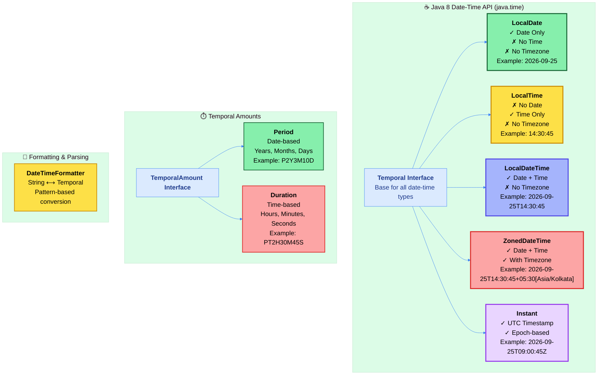
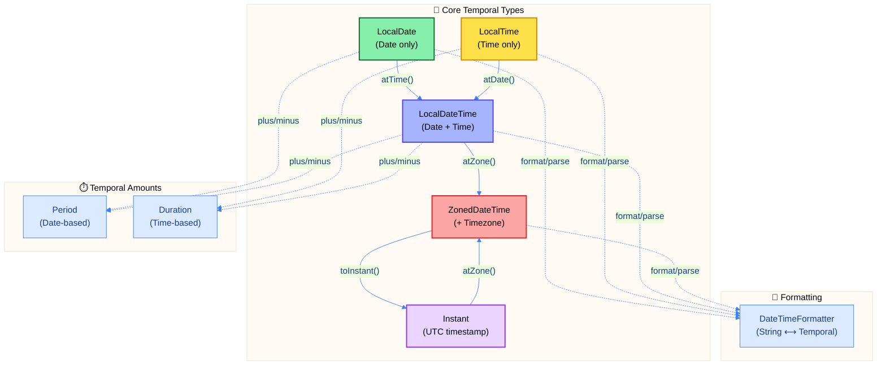

# ☕ Master Guide: Java 8 Date-Time API (java.time) - Modern Temporal Programming

<div align="center">


</div>

<hr style="border: 1px solid rgb(98, 117, 187)">

<div align="center">
<table>
<tr>
<td align="center">
<br />

<h3>© 2026 Avinash Dhanuka</h3>
<p>Master Guide: Java Core & Frameworks</p>
<p><em>Crafted with ❤️ for Object-Oriented Architecture</em></p>

<a href="https://github.com/Avinash-706" target="_blank">

</a>

<a href="https://mail.google.com/mail/?view=cm&fs=1&to=avunashdhanuka@gmail.com&su=Java%20DateTime%20API%20Query&body=☕%20Hello%20Avinash,%0D%0A%0D%0AMy%20name%20is%20[Your%20Name]%20and%20I%20have%20a%20doubt%20regarding%20Java%20Date-Time%20API.%0D%0A%0D%0A🔹%20Topic:%20[Topic%20Name]%0D%0A🔹%20Question:%20[Type%20your%20question]%0D%0A%0D%0AThank%20you!" target="_blank">


</a>
<br />
<br />
</td>
</tr>
</table>
</div>

> **Day 32 Focus:** Complete exploration of Java 8's revolutionary Date-Time API (JSR-310), replacing the problematic legacy Date/Calendar classes with immutable, thread-safe, and human-friendly temporal abstractions. Master date manipulation, time zones, duration calculations, instant timestamps, and formatting operations for production-ready temporal programming.

---

## 🎯 What is Day 32 About?

<div align="center">


</div>

Day 32 is dedicated to **mastering the modern Java Date-Time API** introduced in Java 8. This comprehensive module covers the complete `java.time` package, providing you with the skills to handle dates, times, time zones, durations, periods, and formatting operations with confidence and precision.

### 🌟 Key Learning Outcomes

**After completing Day 32, you will:**

- ✅ Understand why Java 8 replaced `java.util.Date` and `Calendar`
- ✅ Master immutable temporal objects for thread-safe date-time operations
- ✅ Handle timezone-aware programming with ZonedDateTime
- ✅ Calculate date-based periods and time-based durations accurately
- ✅ Work with machine timestamps using Instant
- ✅ Format and parse date-times with DateTimeFormatter
- ✅ Build production-ready temporal logic for real-world applications

---

## 📚 Topics Covered in Day 32

Day 32 explores **8 comprehensive modules**, each focusing on a specific aspect of the Java Date-Time API:


### 📋 Module Overview Table

| Module | Focus Area | Immutability | Timezone | Precision | Primary Use Case |
|:---|:---|:---:|:---:|:---|:---|
| **LocalDate** | Date without time | ✅ | ❌ | Day | Birthdays, holidays, date-only data |
| **LocalTime** | Time without date | ✅ | ❌ | Nanosecond | Wall clock time, schedules |
| **LocalDateTime** | Date + Time combined | ✅ | ❌ | Nanosecond | Timestamps without timezone |
| **ZonedDateTime** | Date + Time + Timezone | ✅ | ✅ | Nanosecond | Global coordination, cross-timezone events |
| **Period** | Date-based amounts | ✅ | N/A | Day | Age calculation, subscription periods |
| **Duration** | Time-based amounts | ✅ | N/A | Nanosecond | Elapsed time, timeouts, delays |
| **Instant** | Machine timestamp | ✅ | ✅ (UTC) | Nanosecond | Database timestamps, event logging |
| **DateTimeFormatter** | String conversion | ✅ | N/A | Pattern-based | Parsing, formatting, display |

---

## 🏗️ Java Date-Time API Architecture



---

## 🗂️ Learning Path & Sequence

To master the Java Date-Time API effectively, follow this **recommended learning sequence**:

### 📖 Phase 1: Fundamentals (Local Date-Time Types)

Start with the basic temporal types that don't involve timezones:

1. **LocalDate** → Understand date-only operations
   - Factory methods, date arithmetic
   - Month-end handling, leap years
   - Date comparison and validation

2. **LocalTime** → Master time-only operations
   - Wall clock time representation
   - Time arithmetic with overflow
   - Nanosecond precision

3. **LocalDateTime** → Combine date and time
   - Composition of LocalDate + LocalTime
   - Timestamp operations
   - Truncation and with operations

**Why this order?** Build from simplest (date-only) to more complex (date+time) without timezone complications.

---

### 📖 Phase 2: Advanced Temporal Types

Progress to timezone-aware and machine-time representations:

4. **ZonedDateTime** → Timezone-aware programming
   - IANA timezone database
   - DST handling and zone conversions
   - Same instant vs same local time

5. **Instant** → Machine timestamps
   - Unix epoch and timeline
   - UTC-based absolute time
   - Database timestamp best practices

**Why this order?** Understand local time first, then add timezone complexity and absolute timestamps.

---

### 📖 Phase 3: Temporal Amounts

Learn to measure and calculate time differences:

6. **Period** → Date-based durations
   - Years, months, days representation
   - Calendar arithmetic
   - Age calculation patterns

7. **Duration** → Time-based durations
   - Hours, minutes, seconds, nanos
   - Precise time measurement
   - Performance timing operations

**Why this order?** Understand the critical difference between date-based (Period) and time-based (Duration) amounts.

---

### 📖 Phase 4: Formatting & Display

Master string conversion for user interfaces and APIs:

8. **DateTimeFormatter** → Parsing and formatting
   - Pattern symbols and ISO standards
   - Bidirectional conversion
   - Locale-specific formatting

**Why last?** Once you understand all temporal types, learn how to display and parse them.

---

## 🎓 Prerequisites & Background

### Before Starting Day 32

Ensure you have:

- ✅ **Java 8 or higher** installed
- ✅ Basic understanding of **immutability** concepts
- ✅ Familiarity with **Java interfaces and inheritance**
- ✅ Knowledge of **ISO-8601 date format** (optional but helpful)

### Legacy vs Modern API Comparison

| Aspect | Legacy (java.util.Date/Calendar) | Modern (java.time.*) |
|:---|:---|:---|
| **Mutability** | ❌ Mutable (not thread-safe) | ✅ Immutable (thread-safe) |
| **API Design** | ❌ Confusing, inconsistent | ✅ Clear, fluent, intuitive |
| **Timezone** | ❌ Mixed with date-time | ✅ Separate concerns |
| **Month Indexing** | ❌ 0-based (Jan=0) | ✅ 1-based (Jan=1) |
| **Null Safety** | ⚠️ Allows null | ✅ No null, use Optional |
| **Operations** | ❌ Limited, verbose | ✅ Rich, expressive |
| **Precision** | ❌ Milliseconds | ✅ Nanoseconds |

**Why migrate?** The modern API eliminates entire categories of bugs and makes temporal programming intuitive.

---

## 🚀 Quick Start Guide

<div align="center">


</div>

### Hands-On Exploration Path

```java
// Step 1: Start with LocalDate (src/localdate/)
LocalDate today = LocalDate.now();
LocalDate birthday = LocalDate.of(2000, 5, 15);
Period age = Period.between(birthday, today);

// Step 2: Move to LocalTime (src/localtime/)
LocalTime now = LocalTime.now();
LocalTime meeting = LocalTime.of(14, 30);
Duration timeUntil = Duration.between(now, meeting);

// Step 3: Combine with LocalDateTime (src/localdatetime/)
LocalDateTime appointment = LocalDateTime.of(today, meeting);

// Step 4: Add timezone with ZonedDateTime (src/zoneddatetime/)
ZonedDateTime globalTime = ZonedDateTime.now(ZoneId.of("Asia/Kolkata"));

// Step 5: Work with Instant for timestamps (src/instant/)
Instant timestamp = Instant.now();

// Step 6: Format for display (src/datetimeformatter/)
DateTimeFormatter formatter = DateTimeFormatter.ofPattern("dd/MM/yyyy HH:mm");
String formatted = appointment.format(formatter);
```

---

## 📊 Module-by-Module Breakdown

### 1️⃣ LocalDate - Date Without Time

**Location:** `src/localdate/`

**What you'll learn:**
- Date-only representation (no time component)
- Factory methods: `now()`, `of()`, `parse()`
- Date arithmetic: `plusDays()`, `minusMonths()`, `plusYears()`
- Temporal adjusters: first/last day of month
- Leap year handling and month-end date logic

**Use Cases:**
- Birthdays, anniversaries, holidays
- Date-only database columns
- Calendar applications
- Age calculation

---

### 2️⃣ LocalTime - Time Without Date

**Location:** `src/localtime/`

**What you'll learn:**
- Wall clock time representation
- Nanosecond precision (up to 999,999,999 ns)
- Circular time concept (24-hour wrap-around)
- Time arithmetic with overflow/underflow
- Components: hour, minute, second, nanosecond

**Use Cases:**
- Business hours (9 AM - 5 PM)
- Daily schedules and recurring times
- Alarm clocks and timers
- Time-only database fields

---

### 3️⃣ LocalDateTime - Combined Date & Time

**Location:** `src/localdatetime/`

**What you'll learn:**
- Composition of LocalDate + LocalTime
- Complete timestamp without timezone
- Conversion between date/time types
- Truncation operations
- With operations for component modification

**Use Cases:**
- Application timestamps (local events)
- Meeting schedulers (single timezone)
- Log timestamps (same server timezone)
- Database TIMESTAMP columns

---

### 4️⃣ ZonedDateTime - Timezone-Aware Operations

**Location:** `src/zoneddatetime/`

**What you'll learn:**
- IANA timezone database (Asia/Kolkata, America/New_York)
- DST (Daylight Saving Time) automatic handling
- Zone conversions: same instant vs same local time
- ZoneId vs ZoneOffset differences
- Cross-timezone coordination

**Use Cases:**
- Global applications (multi-region users)
- Flight booking systems
- International meeting schedulers
- Financial transaction timestamps

---

### 5️⃣ Period - Date-Based Amounts

**Location:** `src/period/`

**What you'll learn:**
- Years, months, days representation
- P format (ISO-8601): P2Y3M10D
- Calendar arithmetic (variable-length months)
- Period.between() for age calculation
- Normalization operations

**Use Cases:**
- Age calculation (years, months, days)
- Subscription duration (6 months)
- Project timelines
- Warranty periods

---

### 6️⃣ Duration - Time-Based Amounts

**Location:** `src/duration/`

**What you'll learn:**
- Hours, minutes, seconds, nanoseconds
- PT format (ISO-8601): PT2H30M45S
- Exact time measurement (fixed units)
- Duration.between() for elapsed time
- Arithmetic and comparison operations

**Use Cases:**
- Execution time measurement
- Video/audio duration
- API timeouts
- Working hours calculation

---

### 7️⃣ Instant - Machine Timestamps

**Location:** `src/instant/`

**What you'll learn:**
- Unix epoch (1970-01-01T00:00:00Z)
- UTC-based absolute timeline
- Epoch seconds + nanosecond storage
- Database timestamp best practices
- Conversion to/from ZonedDateTime

**Use Cases:**
- Database created_at/updated_at fields
- Event logging and audit trails
- Performance benchmarking
- Distributed system coordination

---

### 8️⃣ DateTimeFormatter - String Conversion

**Location:** `src/datetimeformatter/`

**What you'll learn:**
- Pattern symbols (yyyy, MM, dd, HH, mm, ss)
- Predefined formatters (ISO_LOCAL_DATE, RFC_1123)
- Custom pattern creation
- Parsing user input
- Locale-specific formatting

**Use Cases:**
- User interface date display
- API response formatting
- CSV/file date parsing
- Internationalization (i18n)

---

## 🔗 Relationships Between Modules



---

## 💡 Key Concepts to Master

### 1. Immutability Everywhere

All Date-Time API classes are **immutable**:

```java
LocalDate date = LocalDate.of(2026, 9, 25);
date.plusDays(10);  // ❌ WRONG: Returns new object, original unchanged
LocalDate newDate = date.plusDays(10);  // ✅ CORRECT: Capture returned value
```

**Why?** Thread-safe, predictable, cacheable, no defensive copying needed.

---

### 2. Separation of Concerns

Different classes for different purposes:

| Need | Use | Don't Use |
|:---|:---|:---|
| Date only | LocalDate | LocalDateTime |
| Time only | LocalTime | LocalDateTime |
| Date + Time | LocalDateTime | ZonedDateTime |
| + Timezone | ZonedDateTime | LocalDateTime |
| Timestamps | Instant | ZonedDateTime |

---

### 3. Period vs Duration

**Critical distinction:**

| Aspect | Period | Duration |
|:---|:---|:---|
| **Units** | Years, Months, Days | Hours, Minutes, Seconds, Nanos |
| **Variable?** | ✅ (months vary 28-31 days) | ❌ (fixed seconds) |
| **Use for** | Calendar calculations | Precise time measurement |
| **Example** | Age: 25 years, 3 months | Video length: 2 hours, 30 minutes |

---

### 4. Timezone Complexity

**ZoneId (region-based):**
- Contains rules (DST, historical changes)
- Example: `Asia/Kolkata`, `America/New_York`
- Automatically handles DST transitions

**ZoneOffset (fixed offset):**
- Just a numeric offset from UTC
- Example: `+05:30`, `-05:00`
- No DST knowledge

---

### 5. Instant as Universal Truth

**Instant represents the same moment globally:**

```java
Instant now = Instant.now();
ZonedDateTime india = now.atZone(ZoneId.of("Asia/Kolkata"));     // 14:30 IST
ZonedDateTime ny = now.atZone(ZoneId.of("America/New_York"));    // 05:00 EST
// Different wall-clock times, SAME instant on the timeline
```

---

## 🎨 Visual Learning Aids

### Date-Time Hierarchy

```
Temporal (Interface)
    ├── LocalDate (yyyy-MM-dd)
    ├── LocalTime (HH:mm:ss.nnnnnnnnn)
    ├── LocalDateTime (yyyy-MM-ddTHH:mm:ss)
    ├── ZonedDateTime (yyyy-MM-ddTHH:mm:ss+ZZ:ZZ[Zone])
    ├── OffsetDateTime (yyyy-MM-ddTHH:mm:ss+ZZ:ZZ)
    └── Instant (epoch seconds + nanos)

TemporalAmount (Interface)
    ├── Period (P#Y#M#D)
    └── Duration (PT#H#M#S)
```

---

### Timeline Visualization

```
Past ←─────────────── NOW ──────────────→ Future
         ↑
    Unix Epoch
    1970-01-01
    00:00:00 UTC

Instant.now() points here on the absolute timeline
ZonedDateTime adds local interpretation
LocalDateTime ignores timezone context
```

---

## 🎯 Real-World Use Cases by Module

### Scenarios & Solutions

| Scenario | Best Module | Why? |
|:---|:---|:---|
| **User birthday** | LocalDate | No time needed, date-only |
| **Meeting scheduler** | ZonedDateTime | Timezone matters for participants |
| **API timeout** | Duration | Exact time measurement |
| **Employee tenure** | Period | Age in years/months |
| **Database timestamp** | Instant | Absolute point, no timezone confusion |
| **Daily alarm** | LocalTime | Recurring time, no date |
| **Log entry** | LocalDateTime or Instant | Depends on timezone requirements |
| **Flight booking** | ZonedDateTime | Multiple timezones involved |
| **Video playback** | Duration | Precise elapsed time |
| **Subscription period** | Period | Calendar-based (e.g., 6 months) |

---

## 🎓 Learning Tips & Best Practices

### 1. Start Simple, Build Complexity

- ✅ Begin with LocalDate/LocalTime (no timezone)
- ✅ Progress to LocalDateTime (combined but still no timezone)
- ✅ Master ZonedDateTime last (timezone complexity)
- ✅ Learn Period and Duration in parallel

### 2. Think in Terms of Use Cases

Ask yourself:
- Do I need date, time, or both?
- Do I need timezone information?
- Am I measuring duration or representing a timestamp?
- Is this for humans (display) or machines (storage)?

### 3. Leverage Immutability

```java
// Embrace method chaining
LocalDate result = LocalDate.now()
    .plusMonths(1)
    .withDayOfMonth(1)
    .minusDays(1);  // Last day of next month
```

### 4. Use Formatters Wisely

```java
// Create once, reuse many times (thread-safe)
private static final DateTimeFormatter DISPLAY_FORMAT = 
    DateTimeFormatter.ofPattern("dd MMM yyyy");

// Use for all displays
String display = date.format(DISPLAY_FORMAT);
```

### 5. Prefer ISO Standards

```java
// For APIs and data exchange
DateTimeFormatter.ISO_LOCAL_DATE      // 2026-09-25
DateTimeFormatter.ISO_LOCAL_DATE_TIME // 2026-09-25T14:30:45
DateTimeFormatter.ISO_INSTANT         // 2026-09-25T09:00:45Z
```

---

## 🔍 Debugging & Troubleshooting

### Common Issues & Solutions

#### Issue: DateTimeParseException

```java
// Problem
LocalDate.parse("25/09/2026");  // ❌ Throws exception

// Solution: Specify format
LocalDate.parse("25/09/2026", DateTimeFormatter.ofPattern("dd/MM/yyyy"));
```

#### Issue: Timezone Confusion

```java
// Problem: Ambiguous meeting time
LocalDateTime meeting = LocalDateTime.of(2026, 9, 25, 14, 30);
// Is this IST? EST? PST?

// Solution: Be explicit with timezone
ZonedDateTime meeting = ZonedDateTime.of(
    LocalDateTime.of(2026, 9, 25, 14, 30),
    ZoneId.of("Asia/Kolkata")
);
```

#### Issue: Lost Nanoseconds

```java
// Problem: Precision loss
Instant instant = Instant.now();
long millis = instant.toEpochMilli();  // Loses nanosecond precision

// Solution: Store full instant or epoch seconds + nanos
long seconds = instant.getEpochSecond();
int nanos = instant.getNano();
```

---

## 🌟 Mermaid Diagrams in This Module

Day 32 includes **5 comprehensive Mermaid diagrams** to visualize complex concepts:

1. **Date-Time API Architecture** - Overview of all classes and interfaces
2. **Learning Path Flow** - Recommended module sequence
3. **Module Relationships** - How classes interact and convert
4. **Timeline Visualization** - Understanding Instant and epochs
5. **Formatter Processing** - How DateTimeFormatter works internally

---

## 🎬 Getting Started

<div align="center">


</div>

### Step-by-Step Exploration

1. **Read this main README** to understand the big picture
2. **Navigate to `src/localdate/`** and read its README
3. **Run the Java examples** in each module
4. **Progress through modules** in the recommended order
5. **Experiment with code** to reinforce learning
6. **Refer back** to this main README for context

### Recommended Reading Order

```
1. day32/README.md (this file) ← You are here
   ↓
2. src/localdate/README.md
   ↓
3. src/localtime/README.md
   ↓
4. src/localdatetime/README.md
   ↓
5. src/zoneddatetime/README.md
   ↓
6. src/period/README.md
   ↓
7. src/duration/README.md
   ↓
8. src/instant/README.md
   ↓
9. src/datetimeformatter/README.md
```

---

## 💼 Production-Ready Patterns

### Pattern 1: Database Timestamp Storage

```java
// Store as Instant (UTC) in database
Instant timestamp = Instant.now();
// Convert to user's timezone for display
ZonedDateTime userTime = timestamp.atZone(userZoneId);
String display = userTime.format(displayFormatter);
```

### Pattern 2: API Date Handling

```java
// Accept ISO-8601 in API
@PostMapping("/api/events")
public void createEvent(@RequestParam String eventTime) {
    LocalDateTime dateTime = LocalDateTime.parse(
        eventTime,
        DateTimeFormatter.ISO_LOCAL_DATE_TIME
    );
    // Process...
}
```

### Pattern 3: Age Calculation

```java
public int calculateAge(LocalDate birthDate) {
    return Period.between(birthDate, LocalDate.now()).getYears();
}
```

### Pattern 4: Timezone Conversion

```java
// Convert meeting time across timezones
ZonedDateTime indiaTime = ZonedDateTime.of(
    LocalDateTime.of(2026, 9, 25, 14, 30),
    ZoneId.of("Asia/Kolkata")
);

ZonedDateTime nyTime = indiaTime.withZoneSameInstant(
    ZoneId.of("America/New_York")
);  // Same instant, different wall-clock time
```

### Pattern 5: Duration Measurement

```java
Instant start = Instant.now();
// ... operation ...
Instant end = Instant.now();
Duration elapsed = Duration.between(start, end);
System.out.println("Execution time: " + elapsed.toMillis() + "ms");
```

---

## 📊 Comparison Cheat Sheet

### Quick Reference Table

| Type | Has Date? | Has Time? | Has Timezone? | Format Example |
|:---|:---:|:---:|:---:|:---|
| LocalDate | ✅ | ❌ | ❌ | 2026-09-25 |
| LocalTime | ❌ | ✅ | ❌ | 14:30:45.123456789 |
| LocalDateTime | ✅ | ✅ | ❌ | 2026-09-25T14:30:45 |
| ZonedDateTime | ✅ | ✅ | ✅ | 2026-09-25T14:30:45+05:30[Asia/Kolkata] |
| OffsetDateTime | ✅ | ✅ | ⚠️ (offset) | 2026-09-25T14:30:45+05:30 |
| Instant | ✅* | ✅* | ✅ (UTC) | 2026-09-25T09:00:45Z |
| Period | N/A | N/A | N/A | P2Y3M10D |
| Duration | N/A | N/A | N/A | PT2H30M45S |

*Date and time are derived from epoch seconds

---

## 🎉 What You'll Achieve

By the end of Day 32, you will confidently:

✅ **Represent dates and times** using appropriate temporal types  
✅ **Handle timezones** correctly in global applications  
✅ **Calculate durations** accurately for any use case  
✅ **Format and parse** date-times for user interfaces  
✅ **Store timestamps** properly in databases  
✅ **Avoid common pitfalls** of the legacy Date/Calendar API  
✅ **Write production-ready** temporal code with confidence  

---

## 📞 Support & Contact

For questions, doubts, or discussions about Day 32 content:

**Email:** avunashdhanuka@gmail.com  
**Subject Line:** Java DateTime API - Day 32 Query  

**When reaching out:**
- Mention the specific module (LocalDate, Duration, etc.)
- Include code snippets if applicable
- Describe what you've tried already

---

## 🔖 Additional Notes

### Java Version Compatibility

- **Minimum:** Java 8 (JSR-310 introduced)
- **Recommended:** Java 11+ for enhanced features
- **Latest:** Java 17+ for optimal performance

### Thread Safety Guarantee

All classes in `java.time` package are:
- ✅ **Immutable** by design
- ✅ **Thread-safe** without synchronization
- ✅ **Suitable for static constants**
- ✅ **Safe to cache and reuse**

### Performance Considerations

- Formatter creation is expensive → **cache formatters**
- Instant arithmetic is fastest (no calendar calculations)
- ZonedDateTime operations involve timezone rules lookup
- Period/Duration are lightweight value objects

---

<div align="center">

## 🎯 Ready to Master Java Date-Time API?

**Navigate to** `src/localdate/README.md` **to begin your journey!**

<sub>Built with ❤️ by Avinash Dhanuka | Day 32 of Java Mastery</sub>

</div>

---

## 📚 Folder Structure

```
day32/
├── README.md (this file)
├── favicon.png
├── Git-Command_REFERENCE.txt
└── src/
    ├── localdate/
    │   ├── README.md
    │   └── [Java files]
    ├── localtime/
    │   ├── README.md
    │   └── [Java files]
    ├── localdatetime/
    │   ├── README.md
    │   └── [Java files]
    ├── zoneddatetime/
    │   ├── README.md
    │   └── [Java files]
    ├── period/
    │   ├── README.md
    │   └── [Java files]
    ├── duration/
    │   ├── README.md
    │   └── [Java files]
    ├── instant/
    │   ├── README.md
    │   └── [Java files]
    └── datetimeformatter/
        ├── README.md
        └── [Java files]
```

---

<div align="center">


**Happy Learning! 🚀**

*Master the modern way of handling dates and times in Java*

</div>

---

<div align="center">

## 📚 Quick Navigation to Modules

<table>
<tr>
<td align="center" width="25%">
<a href="src/localdate/">
<br/>
<b>📅 LocalDate</b><br/>
<sub>Date Without Time</sub><br/>
<kbd>Start Here</kbd>
</a>
</td>
<td align="center" width="25%">
<a href="src/localtime/">
<br/>
<b>🕐 LocalTime</b><br/>
<sub>Time Without Date</sub><br/>
<kbd>Step 2</kbd>
</a>
</td>
<td align="center" width="25%">
<a href="src/localdatetime/">
<br/>
<b>📆 LocalDateTime</b><br/>
<sub>Date + Time Combined</sub><br/>
<kbd>Step 3</kbd>
</a>
</td>
<td align="center" width="25%">
<a href="src/zoneddatetime/">
<br/>
<b>🌍 ZonedDateTime</b><br/>
<sub>Timezone-Aware</sub><br/>
<kbd>Step 4</kbd>
</a>
</td>
</tr>
<tr>
<td align="center" width="25%">
<a href="src/period/">
<br/>
<b>📊 Period</b><br/>
<sub>Date-Based Amounts</sub><br/>
<kbd>Step 5</kbd>
</a>
</td>
<td align="center" width="25%">
<a href="src/duration/">
<br/>
<b>⏱️ Duration</b><br/>
<sub>Time-Based Amounts</sub><br/>
<kbd>Step 6</kbd>
</a>
</td>
<td align="center" width="25%">
<a href="src/instant/">
<br/>
<b>⚡ Instant</b><br/>
<sub>Machine Timestamps</sub><br/>
<kbd>Step 7</kbd>
</a>
</td>
<td align="center" width="25%">
<a href="src/datetimeformatter/">
<br/>
<b>🎨 DateTimeFormatter</b><br/>
<sub>String Conversion</sub><br/>
<kbd>Step 8</kbd>
</a>
</td>
</tr>
</table>

</div>

---

<div align="center">

## 👨‍💻 About the Author

<table>
<tr>
<td align="center" width="100%">
<br/>


<h2>Avinash Dhanuka</h2>
<p><em>Java Developer | Database Engineer | Backend Specialist</em></p>

<br/>

[](https://github.com/Avinash-706)
[](mailto:avunashdhanuka@gmail.com)
[](https://avinashdhanuka.vercel.app/)

<br/>

**📧 Email:** [avunashdhanuka@gmail.com](mailto:avunashdhanuka@gmail.com)
<br/>
<sub>Crafted with ❤️ and ☕ for the Java Community</sub>

</td>
</tr>
</table>

</div>

---

<div align="center">

### 🎯 Ready to Master Java Date-Time API?

**Navigate to** [`src/localdate/README.md`](src/localdate/) **to begin your journey!**
<br/>

### ⭐ If you find this repository helpful, please consider giving it a star!

<br/>


<sub><strong>Last Updated:</strong> September 2026 | <strong>Version:</strong> 1.0 | <strong>Status:</strong> Complete</sub>

</div>
