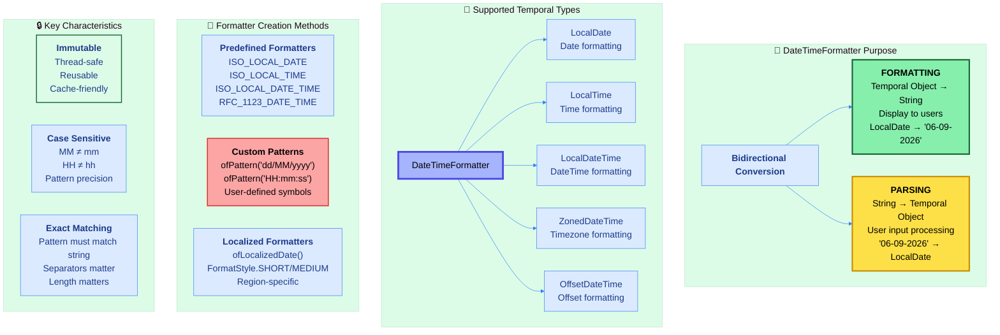
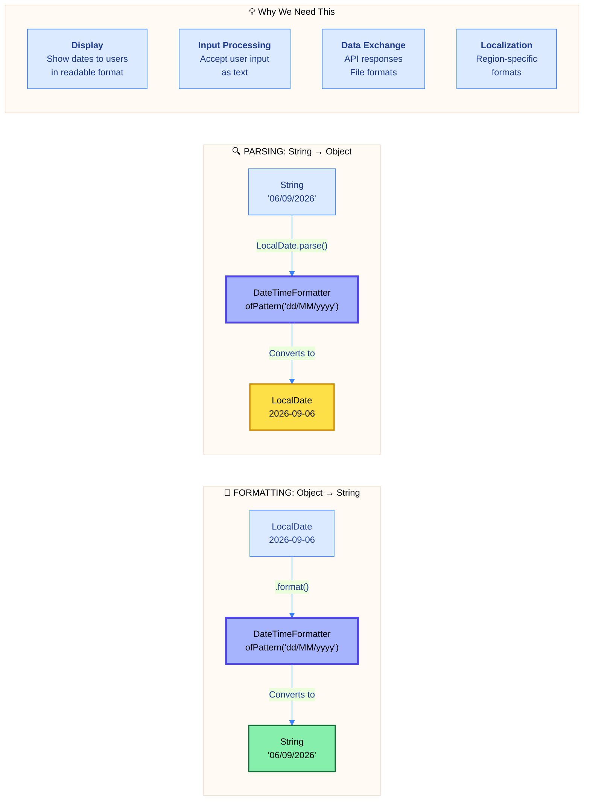
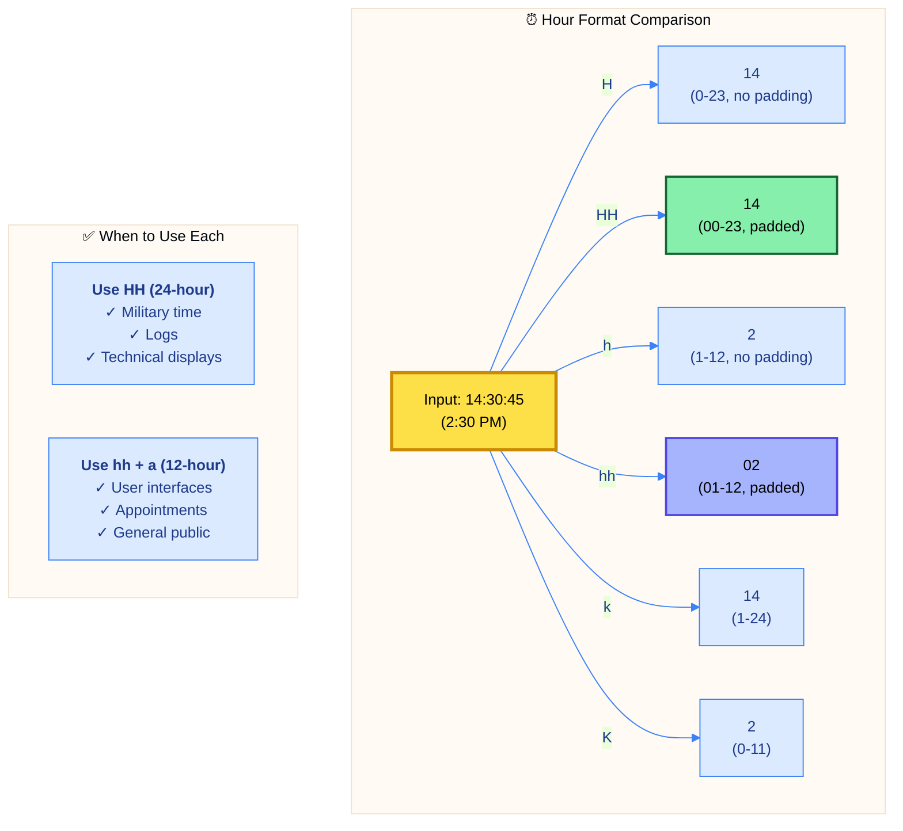
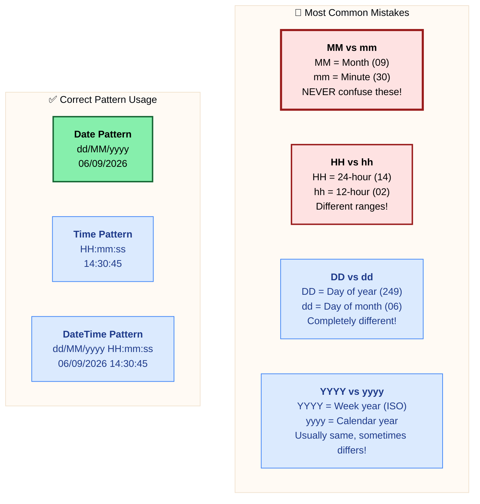
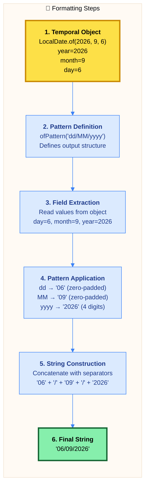
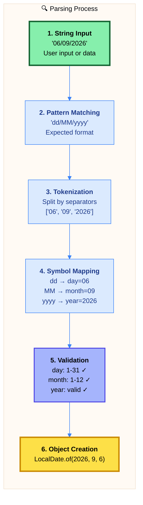
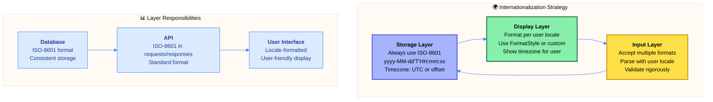

# ☕ Master Guide: Java DateTimeFormatter API - String Formatting & Parsing

<div align="center">


</div>

<hr style="border: 1px solid rgb(98, 117, 187)">

<div align="center">
<table>
<tr>
<td align="center">
<br />

<h3>© 2026 Avinash Dhanuka</h3>
<p>Master Guide: Java Core & Frameworks</p>
<p><em>Crafted with ❤️ for Object-Oriented Architecture</em></p>

<a href="https://github.com/Avinash-706" target="_blank">

</a>

<a href="https://mail.google.com/mail/?view=cm&fs=1&to=avunashdhanuka@gmail.com&su=Java%20DateTimeFormatter%20Query&body=☕%20Hello%20Avinash,%0D%0A%0D%0AMy%20name%20is%20[Your%20Name]%20and%20I%20have%20a%20doubt%20regarding%20Java%20DateTimeFormatter%20API.%0D%0A%0D%0A🔹%20Topic:%20[Formatting/Parsing/Pattern%20Symbols]%0D%0A🔹%20Question:%20[Type%20your%20question]%0D%0A%0D%0AThank%20you!" target="_blank">


</a>
<br />
<br />
</td>
</tr>
</table>
</div>

> **Author's Note:** This comprehensive guide explores Java 8's DateTimeFormatter API for bidirectional conversion between date-time objects and strings. Master pattern symbols, formatting operations, parsing strategies, locale-specific formatting, and understand the internal mechanics of how Java converts temporal objects to human-readable strings. Includes predefined formatters, custom patterns, common mistakes, and real-world use cases with detailed theoretical knowledge.

---

## 🏗️ DateTimeFormatter Architecture



---

## 📑 Table of Contents
1. [DateTimeFormatter Overview - The Bridge Between Time & Text](#1-datetimeformatter-overview---the-bridge-between-time--text)
    - [Core Purpose & Philosophy](#11-core-purpose--philosophy)
    - [Why DateTimeFormatter Exists](#12-why-datetimeformatter-exists)
    - [Internal Architecture & Processing](#13-internal-architecture--processing)
2. [Predefined Formatters - Standard Patterns](#2-predefined-formatters---standard-patterns)
    - [ISO Standard Formatters](#21-iso-standard-formatters)
    - [RFC & Web Formatters](#22-rfc--web-formatters)
    - [When to Use Predefined vs Custom](#23-when-to-use-predefined-vs-custom)
3. [Pattern Symbols - The Formatting Language](#3-pattern-symbols---the-formatting-language)
    - [Date Pattern Symbols](#31-date-pattern-symbols)
    - [Time Pattern Symbols](#32-time-pattern-symbols)
    - [Timezone Pattern Symbols](#33-timezone-pattern-symbols)
    - [Case Sensitivity Rules](#34-case-sensitivity-rules)
4. [Formatting Operations - Object to String](#4-formatting-operations---object-to-string)
    - [Basic Formatting Process](#41-basic-formatting-process)
    - [Formatting Different Temporal Types](#42-formatting-different-temporal-types)
    - [How Output Gets Generated](#43-how-output-gets-generated)
5. [Parsing Operations - String to Object](#5-parsing-operations---string-to-object)
    - [Parsing Mechanics](#51-parsing-mechanics)
    - [Pattern Matching Requirements](#52-pattern-matching-requirements)
    - [Error Handling & Validation](#53-error-handling--validation)
6. [Locale-Specific Formatting](#6-locale-specific-formatting)
    - [Understanding Locales](#61-understanding-locales)
    - [FormatStyle Variations](#62-formatstyle-variations)
    - [Internationalization Strategies](#63-internationalization-strategies)
7. [Common Mistakes & Best Practices](#7-common-mistakes--best-practices)
8. [Real-World Use Cases](#8-real-world-use-cases)

<div align="right">
<sub><em>Comprehensive notes by Avinash Dhanuka | For educational purposes</em></sub>
</div>

---

## 1. DATETIMEFORMATTER OVERVIEW - The Bridge Between Time & Text

### 📌 Definition
**DateTimeFormatter** is an **immutable formatter** for printing and parsing date-time objects. It acts as a **bidirectional bridge** between human-readable text representations and Java's temporal objects (LocalDate, LocalTime, LocalDateTime, ZonedDateTime). Part of Java 8's Date-Time API (JSR-310), it replaces the legacy SimpleDateFormat with thread-safe, immutable design.

### 1.1 Core Purpose & Philosophy



#### 📋 Core Characteristics

| Property | Value | Details |
| :--- | :--- | :--- |
| **Package** | `java.time.format` | Since Java 8 (JSR-310) |
| **Mutability** | ✅ Immutable | Thread-safe, can be cached |
| **Thread Safety** | ✅ Thread-Safe | No synchronization needed |
| **Null Support** | ❌ No Null | NPE if null passed |
| **Direction** | ✅ Bidirectional | Format (Object→String) & Parse (String→Object) |
| **Case Sensitivity** | ⚠️ Case Sensitive | MM ≠ mm, HH ≠ hh |
| **Pattern Matching** | ⚠️ Exact Match | Pattern must match string exactly |
| **Reusability** | ✅ Reusable | Create once, use many times |
| **Performance** | ✅ Efficient | Cache instances for best performance |

---

### 1.2 Why DateTimeFormatter Exists

#### 🎯 The Problem It Solves

**Before Java 8 (SimpleDateFormat issues):**
- ❌ **Mutable & Not Thread-Safe**: Required synchronization
- ❌ **Poor API Design**: Confusing methods
- ❌ **Weak Type Safety**: Used java.util.Date
- ❌ **Limited Functionality**: Basic formatting only

**After Java 8 (DateTimeFormatter benefits):**
- ✅ **Immutable & Thread-Safe**: No synchronization needed
- ✅ **Rich API**: Comprehensive pattern support
- ✅ **Type-Safe**: Works with java.time classes
- ✅ **Powerful**: Locale support, custom patterns, parsing

#### 📊 Key Use Cases Comparison

| Scenario | Without Formatter | With DateTimeFormatter |
| :--- | :--- | :--- |
| **Display Date** | toString() → "2026-09-06" (fixed) | format() → "06/09/2026" (customizable) |
| **User Input** | Manual string parsing (error-prone) | parse() → automatic validation |
| **Database** | Store as string (risky) | Format to ISO-8601 standard |
| **API Response** | Inconsistent formats | Standardized ISO-8601 |
| **Internationalization** | Manual locale handling | Built-in locale support |
| **File Names** | Custom string building | Pattern-based generation |
| **Logs** | Basic toString() | Customized timestamp format |

---

### 1.3 Internal Architecture & Processing

#### 📋 Formatter Creation Methods

DateTimeFormatter can be created through three primary approaches:

| Method | Purpose | Example | When to Use |
| :--- | :--- | :--- | :--- |
| **Predefined Constants** | Standard ISO formats | `ISO_LOCAL_DATE` | APIs, databases, standard formats |
| **ofPattern()** | Custom patterns | `ofPattern("dd/MM/yyyy")` | User interfaces, custom displays |
| **ofLocalized...()** | Locale-specific | `ofLocalizedDate(FormatStyle.MEDIUM)` | Internationalization |


#### 🔍 How Formatting Works Internally

```mermaid
%%{init: {
  "theme": "base",
  "themeVariables": {
    "primaryColor": "#dbeafe",
    "primaryTextColor": "#1e3a8a",
    "primaryBorderColor": "#3b82f6",
    "lineColor": "#3b82f6",
    "fontSize": "14px"
  }
}}%%

graph TD
    subgraph Formatting_Process["🎨 Formatting Process: Object → String"]
        Start1["Temporal Object<br/>LocalDate.of(2026, 9, 6)"]
        
        Start1 --> Parse1["1. Extract Fields<br/>year=2026, month=9, day=6"]
        Parse1 --> Pattern1["2. Read Pattern<br/>'dd/MM/yyyy'"]
        Pattern1 --> Match1["3. Match Symbols<br/>dd→06, MM→09, yyyy→2026"]
        Match1 --> Build1["4. Build String<br/>Concatenate with separators"]
        Build1 --> Output1["String Result<br/>'06/09/2026'"]
    end
    
    subgraph Parsing_Process["🔍 Parsing Process: String → Object"]
        Start2["String Input<br/>'06/09/2026'"]
        
        Start2 --> Pattern2["1. Read Pattern<br/>'dd/MM/yyyy'"]
        Pattern2 --> Tokenize["2. Tokenize String<br/>Split by separators"]
        Tokenize --> Match2["3. Match Tokens<br/>06→day, 09→month, 2026→year"]
        Match2 --> Validate["4. Validate Values<br/>Check ranges & validity"]
        Validate --> Construct["5. Construct Object<br/>Create LocalDate"]
        Construct --> Output2["Temporal Object<br/>LocalDate.of(2026, 9, 6)"]
    end
    
    style Start1 fill:#fde047,stroke:#ca8a04,stroke-width:2px,color:#000
    style Output1 fill:#86efac,stroke:#166534,stroke-width:3px,color:#000
    style Start2 fill:#86efac,stroke:#166534,stroke-width:2px,color:#000
    style Output2 fill:#fde047,stroke:#ca8a04,stroke-width:3px,color:#000
```



#### 📊 Processing Steps Explained

**FORMATTING (Object → String):**

| Step | Operation | Example |
| :--- | :--- | :--- |
| 1. **Field Extraction** | Read values from temporal object | LocalDate(2026, 9, 6) → year=2026, month=9, day=6 |
| 2. **Pattern Parsing** | Analyze pattern symbols | "dd/MM/yyyy" → [dd, /, MM, /, yyyy] |
| 3. **Symbol Matching** | Convert each field using pattern | dd→"06", MM→"09", yyyy→"2026" |
| 4. **String Building** | Concatenate with separators | "06" + "/" + "09" + "/" + "2026" |
| 5. **Output** | Return final string | "06/09/2026" |

**PARSING (String → Object):**

| Step | Operation | Example |
| :--- | :--- | :--- |
| 1. **Pattern Analysis** | Understand expected format | "dd/MM/yyyy" → expect day, month, year |
| 2. **String Tokenization** | Split input by separators | "06/09/2026" → ["06", "09", "2026"] |
| 3. **Token Matching** | Map tokens to fields | "06"→day, "09"→month, "2026"→year |
| 4. **Validation** | Check valid ranges | day:1-31✓, month:1-12✓, year:valid✓ |
| 5. **Object Construction** | Create temporal object | LocalDate.of(2026, 9, 6) |

#### 🎯 Critical Requirements for Parsing

| Requirement | Description | Example |
| :--- | :--- | :--- |
| **Exact Pattern Match** | Pattern must match string structure exactly | "dd/MM/yyyy" matches "06/09/2026" ✓, not "06-09-2026" ✗ |
| **Separator Matching** | Separators in pattern must match string | "/" in pattern needs "/" in string |
| **Length Matching** | Field lengths must align | "dd" (2 digits) matches "06" ✓, not "6" ✗ (unless lenient) |
| **Case Sensitivity** | Symbol case determines meaning | "MM" (month) ≠ "mm" (minute) |
| **Field Order** | Order in pattern must match string | "dd/MM/yyyy" can't parse "MM/dd/yyyy" format |

---

## 2. PREDEFINED FORMATTERS - Standard Patterns

### 📌 Overview
Java provides **predefined DateTimeFormatter constants** for common ISO-8601 and RFC standards. These formatters are **ready-to-use**, **immutable**, and follow international standards, making them ideal for APIs, databases, and data exchange.

### 2.1 ISO Standard Formatters

#### 📋 ISO Formatter Catalog

| Formatter Constant | Format Pattern | Example Output | Use Case |
| :--- | :--- | :--- | :--- |
| **ISO_LOCAL_DATE** | yyyy-MM-dd | 2026-09-06 | LocalDate formatting |
| **ISO_LOCAL_TIME** | HH:mm:ss.SSSSSSSSS | 14:30:45.123456789 | LocalTime formatting |
| **ISO_LOCAL_DATE_TIME** | yyyy-MM-dd'T'HH:mm:ss | 2026-09-06T14:30:45 | LocalDateTime formatting |
| **ISO_DATE** | yyyy-MM-dd or with offset | 2026-09-06+05:30 | Date with optional offset |
| **ISO_TIME** | HH:mm:ss or with offset | 14:30:45+05:30 | Time with optional offset |
| **ISO_DATE_TIME** | Combined with timezone | 2026-09-06T14:30:45+05:30[Asia/Kolkata] | Full datetime with zone |
| **ISO_INSTANT** | UTC instant | 2026-09-06T09:00:45Z | Instant formatting (UTC) |
| **ISO_OFFSET_DATE_TIME** | With offset | 2026-09-06T14:30:45+05:30 | OffsetDateTime formatting |
| **ISO_ZONED_DATE_TIME** | With zone | 2026-09-06T14:30:45+05:30[Asia/Kolkata] | ZonedDateTime formatting |
| **BASIC_ISO_DATE** | yyyyMMdd | 20260906 | Compact date format |

#### 🎯 ISO Formatter Categories

**Date-Only Formatters:**
- `ISO_LOCAL_DATE` → yyyy-MM-dd
- `ISO_DATE` → yyyy-MM-dd (with optional offset)
- `BASIC_ISO_DATE` → yyyyMMdd (no separators)

**Time-Only Formatters:**
- `ISO_LOCAL_TIME` → HH:mm:ss.SSSSSSSSS
- `ISO_TIME` → HH:mm:ss (with optional offset)

**DateTime Formatters:**
- `ISO_LOCAL_DATE_TIME` → yyyy-MM-dd'T'HH:mm:ss
- `ISO_DATE_TIME` → Full with timezone
- `ISO_OFFSET_DATE_TIME` → With offset
- `ISO_ZONED_DATE_TIME` → With zone ID

**Special Formatters:**
- `ISO_INSTANT` → UTC instant (Z suffix)
- `ISO_ORDINAL_DATE` → yyyy-DDD (day of year)
- `ISO_WEEK_DATE` → Year-week format

---

### 2.2 RFC & Web Formatters

#### 📋 RFC Formatter for Web/HTTP

| Formatter | Standard | Format | Example | Use Case |
| :--- | :--- | :--- | :--- | :--- |
| **RFC_1123_DATE_TIME** | RFC-1123 | EEE, dd MMM yyyy HH:mm:ss Z | Sat, 06 Sep 2026 14:30:45 +0530 | HTTP headers, email |

**Why RFC_1123_DATE_TIME?**
- Standard format for HTTP Date headers
- Used in cookies, cache headers
- Email date formatting
- Web service timestamps
- Compatible with HTTP/1.1 specification

#### 🌐 Web Standards Comparison

| Standard | Format | Example | Primary Use |
| :--- | :--- | :--- | :--- |
| **ISO-8601** | 2026-09-06T14:30:45 | 2026-09-06T14:30:45+05:30 | APIs, JSON, databases |
| **RFC-1123** | EEE, dd MMM yyyy HH:mm:ss Z | Sat, 06 Sep 2026 14:30:45 +0530 | HTTP headers, emails |
| **RFC-3339** | Same as ISO-8601 subset | 2026-09-06T14:30:45+05:30 | Internet protocols |

---

### 2.3 When to Use Predefined vs Custom

#### 📊 Decision Matrix

| Scenario | Use Predefined | Use Custom Pattern |
| :--- | :---: | :---: |
| **API Responses** | ✅ ISO_LOCAL_DATE_TIME | ❌ |
| **Database Storage** | ✅ ISO_LOCAL_DATE | ❌ |
| **User Interface Display** | ❌ | ✅ dd/MM/yyyy |
| **Log Files** | ✅ ISO_LOCAL_DATE_TIME | ✅ Custom timestamp |
| **File Names** | ❌ | ✅ yyyyMMdd_HHmmss |
| **HTTP Headers** | ✅ RFC_1123_DATE_TIME | ❌ |
| **User Input Parsing** | ❌ | ✅ Match user format |
| **Internationalization** | ❌ | ✅ Locale-specific |
| **Configuration Files** | ✅ ISO formats | ❌ |
| **Reports/Invoices** | ❌ | ✅ Readable format |

#### ✅ Use Predefined Formatters When:

1. **Standard Compliance Required**
   - API contracts
   - Database schemas
   - Protocol specifications
   - Data exchange formats

2. **Interoperability Important**
   - Cross-system communication
   - Third-party integrations
   - Web services
   - Cloud APIs

3. **No Display Customization Needed**
   - Internal data storage
   - Backend processing
   - System logs (standard format)

#### ✅ Use Custom Patterns When:

1. **User-Facing Display**
   - UI date pickers
   - Reports and invoices
   - Dashboard displays
   - Notifications

2. **Regional Requirements**
   - Country-specific formats (DD/MM/YYYY vs MM/DD/YYYY)
   - Language-specific month names
   - Local conventions

3. **Legacy System Integration**
   - Matching existing formats
   - Migration compatibility
   - Old database formats

4. **Special Formatting Needs**
   - File naming conventions
   - Custom timestamp formats
   - Compact representations

---

## 3. PATTERN SYMBOLS - The Formatting Language

### 📌 Overview
DateTimeFormatter uses **pattern symbols** as a formatting language to define how date-time objects are converted to strings and vice versa. Each symbol has a specific meaning, and **case sensitivity** is critical for correct formatting.

### 3.1 Date Pattern Symbols


#### 📋 Date Pattern Symbol Reference

| Symbol | Meaning | Count | Example Input | Example Output | Notes |
| :---: | :--- | :--- | :--- | :--- | :--- |
| **y** | Year | Variable | 2026 | 2026 or 26 | Number of 'y' determines digits |
| **yy** | 2-digit year | 2 | 2026 | 26 | Last 2 digits only |
| **yyyy** | 4-digit year | 4 | 2026 | 2026 | Always 4 digits |
| **M** | Month of year | 1-2 | September (9) | 9 | Numeric month |
| **MM** | Month (2-digit) | 2 | September (9) | 09 | Zero-padded |
| **MMM** | Month (short name) | 3 | September | Sep | Locale-dependent |
| **MMMM** | Month (full name) | 4+ | September | September | Locale-dependent |
| **d** | Day of month | 1-2 | 6th | 6 | No padding |
| **dd** | Day of month (2-digit) | 2 | 6th | 06 | Zero-padded |
| **D** | Day of year | 1-3 | 249th day | 249 | 1-365/366 |
| **E** | Day of week (short) | 3 | Saturday | Sat | Locale-dependent |
| **EEEE** | Day of week (full) | 4+ | Saturday | Saturday | Locale-dependent |
| **w** | Week of year | 1-2 | Week 36 | 36 | ISO week |
| **W** | Week of month | 1 | 1st week of month | 1 | Week within month |
| **F** | Day of week in month | 1 | 1st Saturday | 1 | Ordinal day in month |

#### 🎯 Year Formatting Examples

| Pattern | Input: 2026 | Input: 2004 | Input: 1999 | Notes |
| :--- | :--- | :--- | :--- | :--- |
| **y** | 2026 | 2004 | 1999 | Variable length |
| **yy** | 26 | 04 | 99 | 2-digit (last 2) |
| **yyyy** | 2026 | 2004 | 1999 | Always 4 digits |

**⚠️ Warning:** Using "yy" can cause ambiguity (26 could be 1926 or 2026). Always use "yyyy" for clarity.

#### 🎯 Month Formatting Examples

| Pattern | September (9) | February (2) | December (12) |
| :--- | :--- | :--- | :--- |
| **M** | 9 | 2 | 12 |
| **MM** | 09 | 02 | 12 |
| **MMM** | Sep | Feb | Dec |
| **MMMM** | September | February | December |

#### 🎯 Day Formatting Examples

| Pattern | 6th day | 15th day | 31st day |
| :--- | :--- | :--- | :--- |
| **d** | 6 | 15 | 31 |
| **dd** | 06 | 15 | 31 |

---

### 3.2 Time Pattern Symbols

#### 📋 Time Pattern Symbol Reference

| Symbol | Meaning | Range | Example | Notes |
| :---: | :--- | :--- | :--- | :--- |
| **H** | Hour of day | 0-23 | 14 | 24-hour format, no padding |
| **HH** | Hour of day (2-digit) | 00-23 | 14 | 24-hour format, padded |
| **h** | Hour (AM/PM) | 1-12 | 2 | 12-hour format, no padding |
| **hh** | Hour (AM/PM, 2-digit) | 01-12 | 02 | 12-hour format, padded |
| **k** | Hour of day | 1-24 | 14 | 1-based 24-hour (rare) |
| **K** | Hour (AM/PM) | 0-11 | 2 | 0-based 12-hour (rare) |
| **m** | Minute | 0-59 | 5 | No padding |
| **mm** | Minute (2-digit) | 00-59 | 05 | Zero-padded |
| **s** | Second | 0-59 | 9 | No padding |
| **ss** | Second (2-digit) | 00-59 | 09 | Zero-padded |
| **S** | Fraction of second | Variable | 123 | Nanoseconds (varies by count) |
| **SSS** | Milliseconds | 000-999 | 123 | 3 digits = milliseconds |
| **SSSSSS** | Microseconds | 000000-999999 | 123456 | 6 digits = microseconds |
| **SSSSSSSSS** | Nanoseconds | 000000000-999999999 | 123456789 | 9 digits = nanoseconds |
| **a** | AM/PM marker | AM/PM | PM | Uppercase |
| **n** | Nanosecond of day | 0-86,399,999,999,999 | 52245123456789 | Total nanos since midnight |

#### 🎯 Hour Format Comparison



#### 🎯 Time Formatting Examples

| Pattern | 14:05:09.123456789 | 09:30:00 | 00:00:00 |
| :--- | :--- | :--- | :--- |
| **HH:mm:ss** | 14:05:09 | 09:30:00 | 00:00:00 |
| **hh:mm:ss a** | 02:05:09 PM | 09:30:00 AM | 12:00:00 AM |
| **H:m:s** | 14:5:9 | 9:30:0 | 0:0:0 |
| **HH:mm** | 14:05 | 09:30 | 00:00 |
| **HH:mm:ss.SSS** | 14:05:09.123 | 09:30:00.000 | 00:00:00.000 |

---

### 3.3 Timezone Pattern Symbols

#### 📋 Timezone Symbol Reference

| Symbol | Meaning | Example Output | Notes |
| :---: | :--- | :--- | :--- |
| **z** | Timezone name | IST, PST, EST | Ambiguous (IST = India/Israel) |
| **zzzz** | Full timezone name | India Standard Time | Long form |
| **Z** | Timezone offset | +0530 | No colon separator |
| **ZZ** | Timezone offset | +0530 | Same as Z |
| **ZZZ** | Timezone offset | +0530 | Same as Z |
| **ZZZZ** | Localized GMT offset | GMT+05:30 | With GMT prefix |
| **ZZZZZ** | Timezone offset with colon | +05:30 | ISO-8601 format |
| **X** | Timezone offset | +05, Z | Hours only, Z for UTC |
| **XX** | Timezone offset | +0530, Z | Hours+minutes, Z for UTC |
| **XXX** | Timezone offset with colon | +05:30, Z | **Recommended** |
| **V** | Timezone ID | Asia/Kolkata | Region-based ID |

#### ⚠️ Timezone Symbol Recommendations

| Scenario | Recommended | Avoid | Reason |
| :--- | :--- | :--- | :--- |
| **ISO-8601 Compliance** | XXX | z | Unambiguous, standard format |
| **API Responses** | XXX or Z | zzzz | Consistent across systems |
| **User Display** | zzzz | Z | Human-readable |
| **Database Storage** | XXX | z | Parseable, unambiguous |
| **Logs** | XXX | z | Clear timezone information |

**Why XXX over z?**
- `z` → "IST" could be India Standard Time OR Israel Standard Time (ambiguous)
- `XXX` → "+05:30" is unambiguous and follows ISO-8601 standard
- `XXX` is parseable by all systems, `z` requires timezone database

---

### 3.4 Case Sensitivity Rules

#### ⚠️ Critical Case Differences



#### 📋 Case Sensitivity Matrix

| Symbol Pair | Uppercase | Lowercase | Critical Difference |
| :--- | :--- | :--- | :--- |
| **M vs m** | M = Month (1-12) | m = Minute (0-59) | **MOST COMMON ERROR** |
| **H vs h** | H = Hour 0-23 | h = Hour 1-12 | 24hr vs 12hr |
| **D vs d** | D = Day of year (1-365) | d = Day of month (1-31) | Year vs Month |
| **S vs s** | S = Fraction of second | s = Second (0-59) | Fraction vs whole |
| **E vs e** | E = Day of week (text) | e = Day of week (numeric) | Text vs number |
| **Y vs y** | Y = Week year | y = Calendar year | ISO week vs calendar |
| **A vs a** | A = Milliseconds of day | a = AM/PM marker | Time vs marker |

#### 🎯 Common Pattern Mistakes

| ❌ Wrong Pattern | ✅ Correct Pattern | Issue |
| :--- | :--- | :--- |
| dd/mm/yyyy | dd/MM/yyyy | mm is minute, not month |
| DD/MM/yyyy | dd/MM/yyyy | DD is day of year, not day of month |
| HH:MM:SS | HH:mm:ss | MM is month, SS is fraction |
| hh:mm:ss | HH:mm:ss or hh:mm:ss a | hh without 'a' is incomplete |
| YYYY-MM-dd | yyyy-MM-dd | YYYY is week year (rarely what you want) |


---

## 4. FORMATTING OPERATIONS - Object to String

### 📌 Overview
Formatting is the process of **converting temporal objects to strings** for display, storage, or transmission. DateTimeFormatter reads field values from the temporal object and applies the pattern to generate the output string.

### 4.1 Basic Formatting Process

#### 🔄 Formatting Workflow



#### 📋 Formatting Method Signatures

| Method | Signature | Description |
| :--- | :--- | :--- |
| **temporal.format(formatter)** | `String format(DateTimeFormatter formatter)` | Instance method on temporal object |
| **formatter.format(temporal)** | `String format(TemporalAccessor temporal)` | Static method on formatter |

**Both achieve the same result:**
```
LocalDate date = LocalDate.of(2026, 9, 6);
DateTimeFormatter formatter = DateTimeFormatter.ofPattern("dd/MM/yyyy");

// Method 1: Instance method (preferred)
String formatted1 = date.format(formatter);  // "06/09/2026"

// Method 2: Formatter method
String formatted2 = formatter.format(date);  // "06/09/2026"
```

---

### 4.2 Formatting Different Temporal Types

#### 📋 Formatting by Temporal Type

| Temporal Type | Applicable Patterns | Example Pattern | Example Output |
| :--- | :--- | :--- | :--- |
| **LocalDate** | Date symbols only | dd/MM/yyyy | 06/09/2026 |
| **LocalTime** | Time symbols only | HH:mm:ss | 14:30:45 |
| **LocalDateTime** | Date + Time symbols | dd/MM/yyyy HH:mm:ss | 06/09/2026 14:30:45 |
| **ZonedDateTime** | Date + Time + Timezone | dd/MM/yyyy HH:mm:ss XXX | 06/09/2026 14:30:45 +05:30 |
| **OffsetDateTime** | Date + Time + Offset | yyyy-MM-dd'T'HH:mm:ssXXX | 2026-09-06T14:30:45+05:30 |
| **Instant** | UTC timestamp | ISO_INSTANT | 2026-09-06T09:00:45Z |

#### ⚠️ Pattern Compatibility Rules

| Temporal Type | ❌ Cannot Format | Reason |
| :--- | :--- | :--- |
| **LocalDate** | Time symbols (HH, mm, ss) | No time information |
| **LocalDate** | Timezone symbols (z, Z, XXX) | No timezone information |
| **LocalTime** | Date symbols (yyyy, MM, dd) | No date information |
| **LocalTime** | Timezone symbols | No timezone information |
| **LocalDateTime** | Timezone symbols | No timezone information |

#### 🎯 Formatting Examples by Type

**LocalDate Formatting:**
```
LocalDate: 2026-09-06

Pattern: "dd/MM/yyyy" → Output: "06/09/2026"
Pattern: "MMM dd, yyyy" → Output: "Sep 06, 2026"
Pattern: "EEEE, MMMM dd, yyyy" → Output: "Saturday, September 06, 2026"
```

**LocalTime Formatting:**
```
LocalTime: 14:30:45.123456789

Pattern: "HH:mm:ss" → Output: "14:30:45"
Pattern: "hh:mm a" → Output: "02:30 PM"
Pattern: "HH:mm:ss.SSS" → Output: "14:30:45.123"
```

**LocalDateTime Formatting:**
```
LocalDateTime: 2026-09-06T14:30:45

Pattern: "dd/MM/yyyy HH:mm:ss" → Output: "06/09/2026 14:30:45"
Pattern: "MMM dd, yyyy 'at' hh:mm a" → Output: "Sep 06, 2026 at 02:30 PM"
Pattern: "EEEE, MMMM dd, yyyy HH:mm" → Output: "Saturday, September 06, 2026 14:30"
```

**ZonedDateTime Formatting:**
```
ZonedDateTime: 2026-09-06T14:30:45+05:30[Asia/Kolkata]

Pattern: "dd/MM/yyyy HH:mm:ss z" → Output: "06/09/2026 14:30:45 IST"
Pattern: "dd/MM/yyyy HH:mm:ss XXX" → Output: "06/09/2026 14:30:45 +05:30"
Pattern: "yyyy-MM-dd'T'HH:mm:ssXXX" → Output: "2026-09-06T14:30:45+05:30"
```

---

### 4.3 How Output Gets Generated

#### 🔍 Field Value to String Conversion

Each pattern symbol has specific rules for converting field values to strings:

| Symbol | Value | Conversion Rule | Output | Explanation |
| :---: | :---: | :--- | :--- | :--- |
| **y** | 2026 | Variable length | 2026 | Full year |
| **yy** | 2026 | Last 2 digits | 26 | Modulo 100 |
| **yyyy** | 2026 | Zero-pad to 4 | 2026 | Always 4 digits |
| **M** | 9 | No padding | 9 | Raw value |
| **MM** | 9 | Zero-pad to 2 | 09 | Add leading zero |
| **MMM** | 9 | Lookup short name | Sep | Locale table |
| **MMMM** | 9 | Lookup full name | September | Locale table |
| **d** | 6 | No padding | 6 | Raw value |
| **dd** | 6 | Zero-pad to 2 | 06 | Add leading zero |
| **H** | 14 | No padding | 14 | Raw value |
| **HH** | 14 | Zero-pad to 2 | 14 | Already 2 digits |
| **h** | 14 | Convert to 12-hour | 2 | 14 % 12 = 2 |
| **hh** | 14 | Convert + pad | 02 | (14 % 12) → "02" |

#### 🎯 Zero-Padding Rules

| Pattern | Value | Padding Needed? | Output |
| :--- | :---: | :---: | :--- |
| **d** (no padding) | 6 | ❌ | "6" |
| **dd** (2-digit) | 6 | ✅ | "06" |
| **M** (no padding) | 9 | ❌ | "9" |
| **MM** (2-digit) | 9 | ✅ | "09" |
| **HH** (2-digit) | 5 | ✅ | "05" |
| **HH** (2-digit) | 14 | ❌ | "14" |

#### 🎯 Text Lookup Process (Month/Day Names)

When using text patterns (MMM, MMMM, E, EEEE), the formatter:

1. **Reads numeric value** from temporal object (e.g., month=9)
2. **Looks up in locale table** for the current locale
3. **Returns text** from the table

| Value | Symbol | Locale | Lookup Result |
| :---: | :---: | :--- | :--- |
| 9 | MMM | en_US | "Sep" |
| 9 | MMMM | en_US | "September" |
| 9 | MMM | fr_FR | "sep" |
| 9 | MMMM | fr_FR | "septembre" |
| 6 (Saturday) | E | en_US | "Sat" |
| 6 (Saturday) | EEEE | en_US | "Saturday" |

#### 📊 Complete Formatting Example

**Input:**
```
LocalDateTime: 2026-09-06T14:05:09.123
Pattern: "EEEE, dd MMMM yyyy 'at' hh:mm a"
```

**Processing:**
| Step | Symbol | Value | Conversion | Output |
| :--- | :---: | :---: | :--- | :--- |
| 1 | EEEE | 6 | Lookup day name (Saturday) | "Saturday" |
| 2 | , | - | Literal character | ", " |
| 3 | dd | 6 | Zero-pad to 2 | "06" |
| 4 | (space) | - | Literal character | " " |
| 5 | MMMM | 9 | Lookup month name | "September" |
| 6 | (space) | - | Literal character | " " |
| 7 | yyyy | 2026 | 4-digit year | "2026" |
| 8 | 'at' | - | Literal text (quoted) | " at " |
| 9 | hh | 14 | Convert to 12hr + pad | "02" |
| 10 | : | - | Literal character | ":" |
| 11 | mm | 5 | Zero-pad to 2 | "05" |
| 12 | (space) | - | Literal character | " " |
| 13 | a | PM | AM/PM marker | "PM" |

**Final Output:**
```
"Saturday, 06 September 2026 at 02:05 PM"
```

---

## 5. PARSING OPERATIONS - String to Object

### 📌 Overview
Parsing is the **reverse of formatting** - converting strings to temporal objects. The formatter must **exactly match** the string structure, and validation occurs to ensure values are within valid ranges.

### 5.1 Parsing Mechanics

#### 🔄 Parsing Workflow



#### 📋 Parsing Method Signatures

| Method | Signature | Description |
| :--- | :--- | :--- |
| **LocalDate.parse(text)** | `LocalDate parse(CharSequence text)` | Parse ISO-8601 date |
| **LocalDate.parse(text, formatter)** | `LocalDate parse(CharSequence text, DateTimeFormatter formatter)` | Parse with custom format |
| **LocalTime.parse(text, formatter)** | Similar | Parse time |
| **LocalDateTime.parse(text, formatter)** | Similar | Parse datetime |
| **ZonedDateTime.parse(text, formatter)** | Similar | Parse with timezone |

**Example:**
```
String dateString = "06/09/2026";
DateTimeFormatter formatter = DateTimeFormatter.ofPattern("dd/MM/yyyy");
LocalDate date = LocalDate.parse(dateString, formatter);
// Result: LocalDate.of(2026, 9, 6)
```

---

### 5.2 Pattern Matching Requirements

#### ⚠️ Critical Matching Rules


| Requirement | Description | Example Match | Example Mismatch |
| :--- | :--- | :--- | :--- |
| **Exact Separator Match** | Separators must match exactly | Pattern: "dd/MM/yyyy"<br/>String: "06/09/2026" ✓ | Pattern: "dd/MM/yyyy"<br/>String: "06-09-2026" ✗ |
| **Field Length Match** | Field lengths must align (unless lenient) | Pattern: "dd"<br/>String: "06" ✓ | Pattern: "dd"<br/>String: "6" ✗ (strict mode) |
| **Field Order Match** | Order in pattern = order in string | Pattern: "dd/MM/yyyy"<br/>String: "06/09/2026" ✓ | Pattern: "dd/MM/yyyy"<br/>String: "09/06/2026" ✗ |
| **Symbol Case Match** | Case determines field meaning | Pattern: "MM" (month)<br/>String: "09" ✓ | Pattern: "mm" (minute)<br/>String: "09" → wrong field |
| **Complete Match** | Entire string must be consumed | Pattern: "dd/MM/yyyy"<br/>String: "06/09/2026" ✓ | Pattern: "dd/MM/yyyy"<br/>String: "06/09/2026 extra" ✗ |

#### 🎯 Common Parsing Scenarios

**Scenario 1: Default ISO Parsing**
```
Input: "2026-09-06"
Method: LocalDate.parse("2026-09-06")
Pattern: ISO_LOCAL_DATE (implicit)
Result: LocalDate.of(2026, 9, 6) ✓
```

**Scenario 2: Custom Format with Slashes**
```
Input: "06/09/2026"
Pattern: "dd/MM/yyyy"
Method: LocalDate.parse("06/09/2026", DateTimeFormatter.ofPattern("dd/MM/yyyy"))
Result: LocalDate.of(2026, 9, 6) ✓
```

**Scenario 3: Custom Format with Hyphens**
```
Input: "06-09-2026"
Pattern: "dd-MM-yyyy"  (Note: hyphens in pattern)
Method: LocalDate.parse("06-09-2026", DateTimeFormatter.ofPattern("dd-MM-yyyy"))
Result: LocalDate.of(2026, 9, 6) ✓
```

**Scenario 4: Full Month Name**
```
Input: "06 September 2026"
Pattern: "dd MMMM yyyy"
Method: LocalDate.parse("06 September 2026", DateTimeFormatter.ofPattern("dd MMMM yyyy", Locale.ENGLISH))
Result: LocalDate.of(2026, 9, 6) ✓
Note: Locale needed for month name lookup
```

**Scenario 5: DateTime Parsing**
```
Input: "06-Sep-2026 14:30"
Pattern: "dd-MMM-yyyy HH:mm"
Method: LocalDateTime.parse("06-Sep-2026 14:30", DateTimeFormatter.ofPattern("dd-MMM-yyyy HH:mm", Locale.ENGLISH))
Result: LocalDateTime.of(2026, 9, 6, 14, 30) ✓
```

#### ❌ Common Parsing Failures

| Input String | Pattern | Error | Reason |
| :--- | :--- | :--- | :--- |
| "06/09/2026" | "dd-MM-yyyy" | DateTimeParseException | Separator mismatch (/ vs -) |
| "6/9/2026" | "dd/MM/yyyy" | DateTimeParseException | Missing zero-padding (strict mode) |
| "09/06/2026" | "dd/MM/yyyy" | ❌ Wrong result | Wrong interpretation (day 9, month 6) |
| "2026-09-06" | "yyyy-MM-dd HH:mm" | DateTimeParseException | Time portion missing |
| "06-sep-2026" | "dd-MMM-yyyy" | DateTimeParseException | Case mismatch (sep vs Sep) |

---

### 5.3 Error Handling & Validation

#### 📋 Validation Stages

DateTimeFormatter performs validation at multiple stages during parsing:

| Stage | Validation | Example Failure |
| :--- | :--- | :--- |
| **1. Pattern Match** | String structure matches pattern | "06/09/2026" with "dd-MM-yyyy" |
| **2. Token Extraction** | Can extract all required tokens | "06/09" with "dd/MM/yyyy" (year missing) |
| **3. Range Validation** | Values within valid ranges | Day 32, Month 13, Hour 25 |
| **4. Logical Validation** | Date/time makes logical sense | Feb 31, Sep 31 |
| **5. Timezone Validation** | Valid timezone (if applicable) | Invalid timezone ID |

#### ⚠️ Exception Types

| Exception | When Thrown | Example |
| :--- | :--- | :--- |
| **DateTimeParseException** | String doesn't match pattern | "06/09/2026" parsed as "dd-MM-yyyy" |
| **DateTimeParseException** | Invalid field values | Day "32" or Month "13" |
| **DateTimeParseException** | Incomplete string | "06/09" when expecting "dd/MM/yyyy" |
| **DateTimeException** | Impossible date | Feb 31, 2026 |

#### 🎯 Error Handling Best Practices

**1. Always Use Try-Catch for User Input:**
```
String userInput = "06/09/2026";
DateTimeFormatter formatter = DateTimeFormatter.ofPattern("dd/MM/yyyy");

try {
    LocalDate date = LocalDate.parse(userInput, formatter);
    // Success - use the date
} catch (DateTimeParseException e) {
    // Handle error - show message to user
    System.err.println("Invalid date format. Expected: DD/MM/YYYY");
}
```

**2. Validate Before Parsing (Optional):**
```
// Pre-validation using regex
if (userInput.matches("\\d{2}/\\d{2}/\\d{4}")) {
    // Structure is correct, try parsing
    LocalDate date = LocalDate.parse(userInput, formatter);
} else {
    // Structure is wrong, don't attempt parse
    System.err.println("Invalid format");
}
```

**3. Provide Clear Error Messages:**
```
try {
    LocalDate date = LocalDate.parse(userInput, formatter);
} catch (DateTimeParseException e) {
    System.err.println("Cannot parse '" + userInput + "'");
    System.err.println("Expected format: DD/MM/YYYY (e.g., 06/09/2026)");
    System.err.println("Error at position: " + e.getErrorIndex());
}
```

#### 📊 Validation Example Breakdown

**Input: "32/09/2026" with Pattern: "dd/MM/yyyy"**

| Stage | Check | Status | Details |
| :--- | :--- | :---: | :--- |
| Pattern Match | Structure matches? | ✓ | Format is correct |
| Token Extraction | Extract day, month, year? | ✓ | 32, 09, 2026 extracted |
| Range Validation | Day 1-31? | ✗ | Day 32 is out of range |
| Exception | DateTimeParseException | ✗ | "Invalid value for DayOfMonth (valid values 1-31)" |

**Input: "06/13/2026" with Pattern: "dd/MM/yyyy"**

| Stage | Check | Status | Details |
| :--- | :--- | :---: | :--- |
| Pattern Match | Structure matches? | ✓ | Format is correct |
| Token Extraction | Extract day, month, year? | ✓ | 06, 13, 2026 extracted |
| Range Validation | Month 1-12? | ✗ | Month 13 is out of range |
| Exception | DateTimeParseException | ✗ | "Invalid value for MonthOfYear (valid values 1-12)" |

---

## 6. LOCALE-SPECIFIC FORMATTING

### 📌 Overview
Locales enable **region-specific formatting** for dates and times, automatically handling different conventions for date order, month names, day names, and number formats across countries and languages.

### 6.1 Understanding Locales

#### 📋 What is a Locale?

A **Locale** represents a specific geographical, political, or cultural region. It determines:
- Date format conventions (DD/MM/YYYY vs MM/DD/YYYY)
- Month and day names (September vs Septembre)
- Number formatting (1,000.50 vs 1.000,50)
- First day of week (Sunday vs Monday)

**Locale Structure:**
```
language_COUNTRY

Examples:
- en_US  (English - United States)
- en_GB  (English - Great Britain)
- fr_FR  (French - France)
- de_DE  (German - Germany)
- ja_JP  (Japanese - Japan)
- hi_IN  (Hindi - India)
```

#### 📊 Regional Date Format Differences

| Region | Date Format | Example | Locale |
| :--- | :--- | :--- | :--- |
| **United States** | MM/DD/YYYY | 09/06/2026 | en_US |
| **United Kingdom** | DD/MM/YYYY | 06/09/2026 | en_GB |
| **India** | DD-MM-YYYY | 06-09-2026 | en_IN |
| **Germany** | DD.MM.YYYY | 06.09.2026 | de_DE |
| **France** | DD/MM/YYYY | 06/09/2026 | fr_FR |
| **Japan** | YYYY/MM/DD | 2026/09/06 | ja_JP |
| **China** | YYYY年MM月DD日 | 2026年09月06日 | zh_CN |

#### 🎯 Locale Usage in Formatting

**Method 1: Pattern with Locale**
```
DateTimeFormatter formatter = DateTimeFormatter.ofPattern("dd MMMM yyyy", Locale.US);
// Output: "06 September 2026"

DateTimeFormatter formatter = DateTimeFormatter.ofPattern("dd MMMM yyyy", Locale.FRANCE);
// Output: "06 septembre 2026"
```

**Method 2: Localized Formatter**
```
DateTimeFormatter formatter = DateTimeFormatter.ofLocalizedDate(FormatStyle.MEDIUM)
    .withLocale(Locale.US);
// Output: "Sep 6, 2026"

DateTimeFormatter formatter = DateTimeFormatter.ofLocalizedDate(FormatStyle.MEDIUM)
    .withLocale(Locale.FRANCE);
// Output: "6 sept. 2026"
```

---

### 6.2 FormatStyle Variations

#### 📋 FormatStyle Options

Java provides predefined `FormatStyle` enums for different verbosity levels:

| FormatStyle | Description | Example (en_US) | Example (de_DE) |
| :--- | :--- | :--- | :--- |
| **SHORT** | Compact, numeric | 9/6/26 | 06.09.26 |
| **MEDIUM** | Abbreviated month | Sep 6, 2026 | 06.09.2026 |
| **LONG** | Full month | September 6, 2026 | 6. September 2026 |
| **FULL** | Full with day of week | Saturday, September 6, 2026 | Samstag, 6. September 2026 |

#### 🎯 FormatStyle Examples by Locale

**Date Formatting:**

| Locale | SHORT | MEDIUM | LONG | FULL |
| :--- | :--- | :--- | :--- | :--- |
| **en_US** | 9/6/26 | Sep 6, 2026 | September 6, 2026 | Saturday, September 6, 2026 |
| **en_GB** | 06/09/2026 | 6 Sep 2026 | 6 September 2026 | Saturday, 6 September 2026 |
| **de_DE** | 06.09.26 | 06.09.2026 | 6. September 2026 | Samstag, 6. September 2026 |
| **fr_FR** | 06/09/2026 | 6 sept. 2026 | 6 septembre 2026 | samedi 6 septembre 2026 |
| **ja_JP** | 2026/09/06 | 2026/09/06 | 2026年9月6日 | 2026年9月6日土曜日 |

**DateTime Formatting:**

| Locale | SHORT | MEDIUM |
| :--- | :--- | :--- |
| **en_US** | 9/6/26, 2:30 PM | Sep 6, 2026, 2:30:45 PM |
| **en_GB** | 06/09/2026, 14:30 | 6 Sep 2026, 14:30:45 |
| **de_DE** | 06.09.26, 14:30 | 06.09.2026, 14:30:45 |
| **fr_FR** | 06/09/2026 14:30 | 6 sept. 2026, 14:30:45 |

---

### 6.3 Internationalization Strategies

#### 🌍 I18n Best Practices




#### 📋 Layered Approach to I18n

| Layer | Format | Example | Reason |
| :--- | :--- | :--- | :--- |
| **Database** | ISO-8601 | 2026-09-06T14:30:45 | Standardized, parseable |
| **API (Input/Output)** | ISO-8601 | 2026-09-06T14:30:45+05:30 | Platform-independent |
| **Business Logic** | Temporal Objects | LocalDateTime | Type-safe processing |
| **UI Display** | Locale-formatted | "06/09/2026 2:30 PM" (US) | User-friendly |
| **User Input** | Parse any format | Accept "06/09/2026" or "09/06/2026" | Flexible UX |

#### 🎯 Implementation Pattern

**1. Store in ISO-8601:**
```
// Always store in standardized format
LocalDateTime dateTime = LocalDateTime.now();
String dbValue = dateTime.format(DateTimeFormatter.ISO_LOCAL_DATE_TIME);
// Store: "2026-09-06T14:30:45"
```

**2. Display with Locale:**
```
// Retrieve from database
LocalDateTime dateTime = LocalDateTime.parse(dbValue);

// Format for user based on their locale
Locale userLocale = getUserLocale(); // Get from user preferences
DateTimeFormatter displayFormatter = DateTimeFormatter.ofLocalizedDateTime(FormatStyle.MEDIUM)
    .withLocale(userLocale);
    
String displayValue = dateTime.format(displayFormatter);
// US user sees: "Sep 6, 2026, 2:30:45 PM"
// French user sees: "6 sept. 2026, 14:30:45"
```

**3. Parse User Input:**
```
// Accept various formats based on user locale
String userInput = "06/09/2026";
DateTimeFormatter inputFormatter = DateTimeFormatter.ofPattern("dd/MM/yyyy")
    .withLocale(userLocale);

try {
    LocalDate date = LocalDate.parse(userInput, inputFormatter);
    // Convert to ISO for storage
    String dbValue = date.format(DateTimeFormatter.ISO_LOCAL_DATE);
} catch (DateTimeParseException e) {
    // Handle invalid input
}
```

#### 🌐 Multi-Locale Support Example

```
LocalDate date = LocalDate.of(2026, 9, 6);

// US Format
Locale.US → "September 6, 2026"

// UK Format  
Locale.UK → "6 September 2026"

// French Format
Locale.FRANCE → "6 septembre 2026"

// German Format
Locale.GERMANY → "6. September 2026"

// Japanese Format
Locale.JAPAN → "2026年9月6日"

// All stored as: "2026-09-06" (ISO-8601)
```

---

## 7. COMMON MISTAKES & Best Practices

### 📌 Overview
Understanding common pitfalls and following best practices ensures correct and maintainable date-time formatting code.

### 7.1 Common Mistakes

#### ❌ Mistake 1: MM vs mm Confusion

**The Problem:**
```
❌ WRONG: DateTimeFormatter.ofPattern("dd/mm/yyyy")
// 'mm' is MINUTE, not MONTH!

✅ CORRECT: DateTimeFormatter.ofPattern("dd/MM/yyyy")
// 'MM' is MONTH
```

**Impact:**
- Pattern "dd/mm/yyyy" will always show 00 for minutes when formatting a LocalDate
- During parsing, it expects minute field (which doesn't exist in date-only strings)

**Real Example:**
```
LocalDate date = LocalDate.of(2026, 9, 6);

❌ DateTimeFormatter.ofPattern("dd/mm/yyyy").format(date)
// Output: "06/00/2026" (00 = minute field, always 0 for LocalDate)

✅ DateTimeFormatter.ofPattern("dd/MM/yyyy").format(date)
// Output: "06/09/2026" (correct)
```

---

#### ❌ Mistake 2: Pattern Doesn't Match String

**The Problem:**
```
String input = "06-09-2026";

❌ WRONG: DateTimeFormatter.ofPattern("dd/MM/yyyy")
// Pattern expects '/', string has '-'

✅ CORRECT: DateTimeFormatter.ofPattern("dd-MM-yyyy")
// Pattern matches string separators
```

**Impact:**
- Throws `DateTimeParseException` at runtime
- Cannot parse the string

**Common Separator Mismatches:**

| String | ❌ Wrong Pattern | ✅ Correct Pattern |
| :--- | :--- | :--- |
| "06/09/2026" | "dd-MM-yyyy" | "dd/MM/yyyy" |
| "06-09-2026" | "dd/MM/yyyy" | "dd-MM-yyyy" |
| "06.09.2026" | "dd/MM/yyyy" | "dd.MM.yyyy" |
| "20260906" | "dd/MM/yyyy" | "yyyyMMdd" |

---

#### ❌ Mistake 3: Case Sensitivity Issues

**The Problem:**
```
❌ WRONG: DateTimeFormatter.ofPattern("DD/MM/YYYY")
// DD = day of year (1-365), not day of month!
// YYYY = week year, not calendar year!

✅ CORRECT: DateTimeFormatter.ofPattern("dd/MM/yyyy")
// dd = day of month, yyyy = calendar year
```

**Case Matters:**

| Symbol | Meaning | ❌ Wrong Use | Impact |
| :---: | :--- | :--- | :--- |
| **dd** | Day of month (1-31) | DD | DD = day of year (249) |
| **MM** | Month (1-12) | mm | mm = minute (30) |
| **yyyy** | Calendar year | YYYY | YYYY = week year (rarely what you want) |
| **HH** | Hour 0-23 | hh (without 'a') | Incomplete 12-hour format |
| **mm** | Minute | MM | MM = month |
| **ss** | Second | SS | SS = fraction of second |

---

#### ❌ Mistake 4: Using hh Without AM/PM

**The Problem:**
```
LocalDateTime dt = LocalDateTime.of(2026, 9, 6, 14, 30);

❌ WRONG: DateTimeFormatter.ofPattern("hh:mm:ss")
// Output: "02:30:00" (missing AM/PM context!)

✅ CORRECT: DateTimeFormatter.ofPattern("hh:mm:ss a")
// Output: "02:30:00 PM" (clear!)

✅ ALTERNATIVE: DateTimeFormatter.ofPattern("HH:mm:ss")
// Output: "14:30:00" (24-hour format)
```

**Rule:** If using `hh` (12-hour), **always** include `a` (AM/PM marker).

---

#### ❌ Mistake 5: Timezone with LocalDateTime

**The Problem:**
```
LocalDateTime dt = LocalDateTime.of(2026, 9, 6, 14, 30);

❌ WRONG: DateTimeFormatter.ofPattern("dd/MM/yyyy HH:mm z")
// Cannot format timezone - LocalDateTime has no timezone!
// Throws: UnsupportedTemporalTypeException

✅ CORRECT: Use ZonedDateTime instead
ZonedDateTime zdt = dt.atZone(ZoneId.of("Asia/Kolkata"));
DateTimeFormatter formatter = DateTimeFormatter.ofPattern("dd/MM/yyyy HH:mm z");
// Output: "06/09/2026 14:30 IST"
```

**Rule:** Timezone symbols (z, Z, XXX) require temporal types with timezone info (ZonedDateTime, OffsetDateTime).

---

### 7.2 Best Practices

#### ✅ Best Practice 1: Cache Formatters

**Why:** DateTimeFormatter creation is expensive; formatters are immutable and thread-safe.

```
❌ BAD: Create formatter repeatedly
for (LocalDate date : dates) {
    DateTimeFormatter formatter = DateTimeFormatter.ofPattern("dd/MM/yyyy");
    String formatted = date.format(formatter);
}

✅ GOOD: Create once, reuse
private static final DateTimeFormatter DATE_FORMATTER = 
    DateTimeFormatter.ofPattern("dd/MM/yyyy");

for (LocalDate date : dates) {
    String formatted = date.format(DATE_FORMATTER);
}
```

**Impact:** 10-100x performance improvement in tight loops.

---

#### ✅ Best Practice 2: Use Predefined Formatters When Possible

```
❌ AVOID: Reinventing the wheel
DateTimeFormatter formatter = DateTimeFormatter.ofPattern("yyyy-MM-dd");

✅ BETTER: Use built-in constant
DateTimeFormatter formatter = DateTimeFormatter.ISO_LOCAL_DATE;
```

**Benefits:**
- Tested and validated
- Standard compliance
- Better readability
- Less error-prone

---

#### ✅ Best Practice 3: Always Handle Parsing Exceptions

```
❌ BAD: Ignore exceptions
LocalDate date = LocalDate.parse(userInput, formatter); // Can throw!

✅ GOOD: Handle exceptions
try {
    LocalDate date = LocalDate.parse(userInput, formatter);
    // Process valid date
} catch (DateTimeParseException e) {
    // Show user-friendly error
    System.err.println("Invalid date format. Expected: DD/MM/YYYY");
    log.error("Parse error: {}", e.getMessage());
}
```

---

#### ✅ Best Practice 4: Document Expected Formats

```
✅ GOOD: Clear documentation
/**
 * Parse user's birthdate.
 * 
 * @param dateString Expected format: "DD/MM/YYYY" (e.g., "06/09/2026")
 * @return Parsed LocalDate
 * @throws DateTimeParseException if format is invalid
 */
public LocalDate parseBirthdate(String dateString) {
    return LocalDate.parse(dateString, BIRTHDATE_FORMATTER);
}
```

---

#### ✅ Best Practice 5: Use ISO-8601 for Storage & APIs

```
✅ GOOD: Storage strategy
// Database: Store as ISO-8601
String dbValue = dateTime.format(DateTimeFormatter.ISO_LOCAL_DATE_TIME);

// API Response: ISO-8601
return ResponseEntity.ok(Map.of(
    "timestamp", dateTime.format(DateTimeFormatter.ISO_LOCAL_DATE_TIME)
));

// Display: Format for user
String displayValue = dateTime.format(displayFormatter);
```

---

#### ✅ Best Practice 6: Prefer XXX Over z for Timezones

```
❌ AVOID: Ambiguous timezone names
DateTimeFormatter.ofPattern("dd/MM/yyyy HH:mm z")
// Output: "06/09/2026 14:30 IST"
// IST = India Standard Time or Israel Standard Time?

✅ PREFER: Unambiguous offsets
DateTimeFormatter.ofPattern("dd/MM/yyyy HH:mm XXX")
// Output: "06/09/2026 14:30 +05:30"
// Clear and parseable
```

---

#### ✅ Best Practice 7: Test Edge Cases

**Test These Cases:**
- End of month dates (Jan 31, Feb 28/29, Apr 30)
- Leap years (Feb 29)
- Year boundaries (Dec 31 → Jan 1)
- Daylight saving transitions (for ZonedDateTime)
- Midnight (00:00:00)
- Noon (12:00:00) in 12-hour format
- Various locales for month/day names

```
@Test
public void testDateFormatting() {
    // Test various edge cases
    testFormat(LocalDate.of(2024, 2, 29)); // Leap year
    testFormat(LocalDate.of(2026, 12, 31)); // Year end
    testFormat(LocalDate.of(2026, 1, 31));  // Month end
    testFormat(LocalDate.of(2026, 2, 28));  // Feb non-leap
}
```

---

## 8. REAL-WORLD USE CASES

### 📌 Overview
DateTimeFormatter is essential in numerous real-world scenarios across different application layers and domains.

### 8.1 Use Case Categories

#### 📋 Common Application Scenarios

| Domain | Use Cases | Formatter Type | Example Pattern |
| :--- | :--- | :--- | :--- |
| **User Interface** | Display dates in UI | Custom | "MMM dd, yyyy" |
| **Logging** | Timestamp log entries | ISO or custom | "yyyy-MM-dd HH:mm:ss.SSS" |
| **File Management** | File naming with timestamps | Custom compact | "yyyyMMdd_HHmmss" |
| **Database** | Store/retrieve timestamps | ISO | ISO_LOCAL_DATE_TIME |
| **API** | Request/response formatting | ISO | ISO_LOCAL_DATE_TIME |
| **Reports** | Invoice, receipt dates | Custom readable | "dd-MMM-yyyy" |
| **Email** | Email headers, timestamps | RFC | RFC_1123_DATE_TIME |
| **Scheduling** | Appointment display | Custom | "EEEE, MMM dd 'at' hh:mm a" |

---

### 8.2 Detailed Use Cases

#### 🎯 Use Case 1: User-Friendly Date Display

**Scenario:** Display dates in a readable format for end users.

**Solution:**
```
LocalDate date = LocalDate.now();
DateTimeFormatter displayFormatter = 
    DateTimeFormatter.ofPattern("EEEE, MMMM dd, yyyy");
    
String userFriendly = date.format(displayFormatter);
// Output: "Saturday, September 06, 2026"
```

**Why:** Users prefer readable formats like "Saturday, September 06, 2026" over "2026-09-06".

---

#### 🎯 Use Case 2: Application Log Timestamps

**Scenario:** Add standardized timestamps to log entries.

**Solution:**
```
private static final DateTimeFormatter LOG_FORMATTER = 
    DateTimeFormatter.ofPattern("yyyy-MM-dd HH:mm:ss.SSS");

public void logEvent(String message) {
    String timestamp = LocalDateTime.now().format(LOG_FORMATTER);
    System.out.println("[" + timestamp + "] " + message);
}

// Output: [2026-09-06 14:30:45.123] Application started
```

**Why:** Consistent, sortable, includes milliseconds for precision.

---

#### 🎯 Use Case 3: File Naming with Timestamps

**Scenario:** Generate unique file names with timestamps.

**Solution:**
```
private static final DateTimeFormatter FILE_FORMATTER = 
    DateTimeFormatter.ofPattern("yyyyMMdd_HHmmss");

public String generateBackupFilename() {
    String timestamp = LocalDateTime.now().format(FILE_FORMATTER);
    return "backup_" + timestamp + ".zip";
}

// Output: "backup_20260906_143045.zip"
```

**Why:** Compact, sortable, filesystem-safe (no special characters).

---

#### 🎯 Use Case 4: Database Timestamp Storage

**Scenario:** Store date-time values in database.

**Solution:**
```
// Store
LocalDateTime timestamp = LocalDateTime.now();
String dbValue = timestamp.format(DateTimeFormatter.ISO_LOCAL_DATE_TIME);
// SQL: INSERT INTO events (timestamp) VALUES ('2026-09-06T14:30:45')

// Retrieve
String dbValue = rs.getString("timestamp");
LocalDateTime timestamp = LocalDateTime.parse(dbValue);
```

**Why:** ISO-8601 is standardized, parseable, and database-agnostic.

---

#### 🎯 Use Case 5: API Request/Response

**Scenario:** Format date-times for JSON API responses.

**Solution:**
```
@GetMapping("/events")
public ResponseEntity<EventDTO> getEvent() {
    LocalDateTime eventTime = getEventTime();
    
    EventDTO dto = new EventDTO();
    dto.setEventTime(eventTime.format(DateTimeFormatter.ISO_LOCAL_DATE_TIME));
    
    return ResponseEntity.ok(dto);
}

// JSON Response:
{
    "eventTime": "2026-09-06T14:30:45"
}
```

**Why:** ISO-8601 is the internet standard for datetime interchange.

---

#### 🎯 Use Case 6: Invoice/Receipt Date

**Scenario:** Display professional date on invoices.

**Solution:**
```
private static final DateTimeFormatter INVOICE_FORMATTER = 
    DateTimeFormatter.ofPattern("dd-MMM-yyyy");

LocalDate invoiceDate = LocalDate.now();
String formattedDate = invoiceDate.format(INVOICE_FORMATTER);

// Print on invoice: "Invoice Date: 06-Sep-2026"
```

**Why:** Clear, professional, unambiguous month representation.

---

#### 🎯 Use Case 7: Email Date Headers

**Scenario:** Format date for email headers (RFC-1123).

**Solution:**
```
ZonedDateTime emailTime = ZonedDateTime.now();
String emailDate = emailTime.format(DateTimeFormatter.RFC_1123_DATE_TIME);

// Email Header:
// Date: Sat, 06 Sep 2026 14:30:45 +0530
```

**Why:** RFC-1123 is the standard for HTTP and email headers.

---

#### 🎯 Use Case 8: Appointment/Meeting Display

**Scenario:** Show meeting time in user-friendly format.

**Solution:**
```
private static final DateTimeFormatter MEETING_FORMATTER = 
    DateTimeFormatter.ofPattern("EEEE, MMM dd 'at' hh:mm a");

LocalDateTime meetingTime = LocalDateTime.of(2026, 9, 10, 15, 30);
String display = meetingTime.format(MEETING_FORMATTER);

// Display: "Meeting scheduled for: Thursday, Sep 10 at 03:30 PM"
```

**Why:** Clear, conversational format for users.

---

#### 🎯 Use Case 9: Parsing User Input from Forms

**Scenario:** Accept date input from web form.

**Solution:**
```
// User enters: "06/09/2026" in a form field
String userInput = request.getParameter("birthdate");

DateTimeFormatter inputFormatter = DateTimeFormatter.ofPattern("dd/MM/yyyy");

try {
    LocalDate birthdate = LocalDate.parse(userInput, inputFormatter);
    
    // Store in database (ISO format)
    String dbValue = birthdate.format(DateTimeFormatter.ISO_LOCAL_DATE);
    saveToDatabase(dbValue);
    
} catch (DateTimeParseException e) {
    // Show error to user
    addFieldError("birthdate", "Invalid date format. Use DD/MM/YYYY");
}
```

**Why:** Flexible input, standardized storage, proper error handling.

---

#### 🎯 Use Case 10: Multi-Locale Application

**Scenario:** Display dates based on user's locale preference.

**Solution:**
```
public String formatDateForUser(LocalDate date, Locale userLocale) {
    DateTimeFormatter formatter = DateTimeFormatter
        .ofLocalizedDate(FormatStyle.LONG)
        .withLocale(userLocale);
    
    return date.format(formatter);
}

// US User: "September 6, 2026"
// French User: "6 septembre 2026"
// German User: "6. September 2026"
```

**Why:** Provides localized experience for international users.

---

## 📚 Summary

### Quick Reference Card

| Aspect | Details |
| :--- | :--- |
| **Package** | `java.time.format` (Java 8+) |
| **Purpose** | Bidirectional conversion: Object ↔ String |
| **Mutability** | ✅ Immutable (thread-safe) |
| **Directions** | Formatting (Object→String), Parsing (String→Object) |
| **Pattern Symbols** | Case-sensitive (MM ≠ mm, HH ≠ hh) |
| **Matching** | Pattern must exactly match string |
| **Reusability** | ✅ Cache instances for performance |
| **Locale Support** | ✅ Built-in internationalization |

### Key Takeaways

1. **Bidirectional Conversion**: Formats temporal objects to strings and parses strings to objects
2. **Immutable & Thread-Safe**: Safe to cache and reuse across threads
3. **Case Sensitivity**: MM (month) ≠ mm (minute), HH (24hr) ≠ hh (12hr)
4. **Exact Pattern Matching**: Pattern separators and structure must match string exactly
5. **Predefined Formatters**: Use ISO_LOCAL_DATE, ISO_LOCAL_DATE_TIME for standards
6. **Custom Patterns**: Use ofPattern() for user-facing displays
7. **Locale Support**: Built-in internationalization with FormatStyle
8. **Error Handling**: Always wrap parsing in try-catch for user input
9. **Performance**: Cache formatter instances as static final constants
10. **Storage Strategy**: Use ISO-8601 for storage/APIs, locale-format for display

### Pattern Symbol Quick Reference

| Symbol | Meaning | Example |
| :---: | :--- | :--- |
| **yyyy** | 4-digit year | 2026 |
| **MM** | Month (01-12) | 09 |
| **dd** | Day of month (01-31) | 06 |
| **HH** | Hour 24hr (00-23) | 14 |
| **hh** | Hour 12hr (01-12) | 02 |
| **mm** | Minute (00-59) | 30 |
| **ss** | Second (00-59) | 45 |
| **a** | AM/PM | PM |
| **XXX** | Timezone offset | +05:30 |

---

<div align="center">

<table style="border: 2px solid #3b82f6; border-radius: 10px; padding: 5px; margin: 20px auto; max-width: 500px;">
<tr>
<td align="center" style="padding: 10px;">

## 🎯 Master DateTimeFormatter Principles
<br/>


**Bidirectional Conversion** → Format objects to strings, parse strings to objects  
**Immutable & Thread-Safe** → Cache and reuse formatters safely  
**Case-Sensitive Patterns** → MM≠mm, HH≠hh - precision matters  
**Exact Pattern Matching** → Pattern structure must match string exactly

---

## 🎓 End of Java 8 Date-Time API

**Congratulations!** You've completed the comprehensive study of **Java 8 Date-Time API (JSR-310)**, covering:

- ✅ **LocalDate** - Date without time or timezone
- ✅ **LocalTime** - Time without date or timezone  
- ✅ **LocalDateTime** - Combined date and time without timezone
- ✅ **ZonedDateTime** - Date-time with timezone information
- ✅ **Instant** - Machine timestamp in UTC (epoch-based)
- ✅ **Period** - Date-based amount (years, months, days)
- ✅ **Duration** - Time-based amount (hours, minutes, seconds, nanos)
- ✅ **DateTimeFormatter** - Bidirectional string conversion with pattern symbols

**Key Achievement:** Mastered the modern, immutable, and thread-safe approach to date-time handling in Java, replacing legacy Date and Calendar classes with a robust, type-safe API that handles temporal operations with precision and clarity across local and global contexts.

---

<sub>**© 2026 Avinash Dhanuka** | Java 8 Date-Time API - Complete Guide</sub>

<sub>📧 [avunashdhanuka@gmail.com](mailto:avunashdhanuka@gmail.com) | 🔗 [GitHub: Avinash-706](https://github.com/Avinash-706)</sub>

<br/>

</td>
</tr>
</table>

</div>
