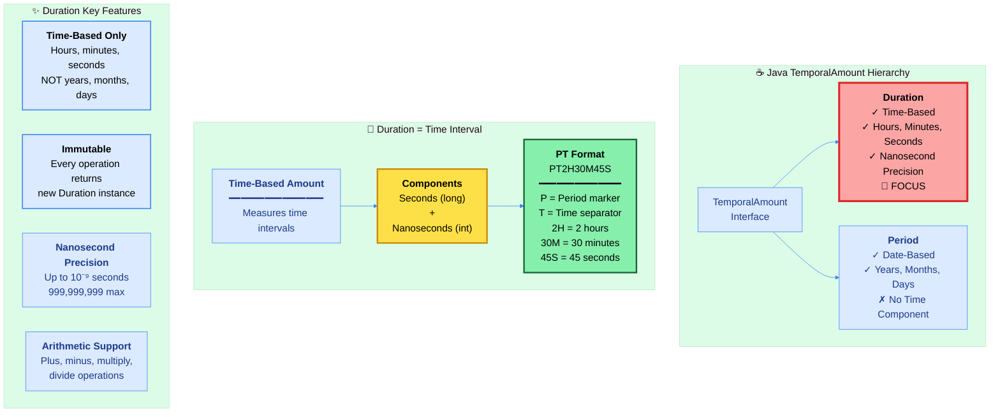
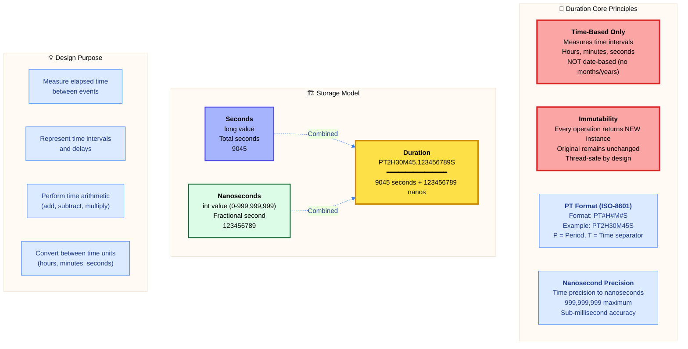
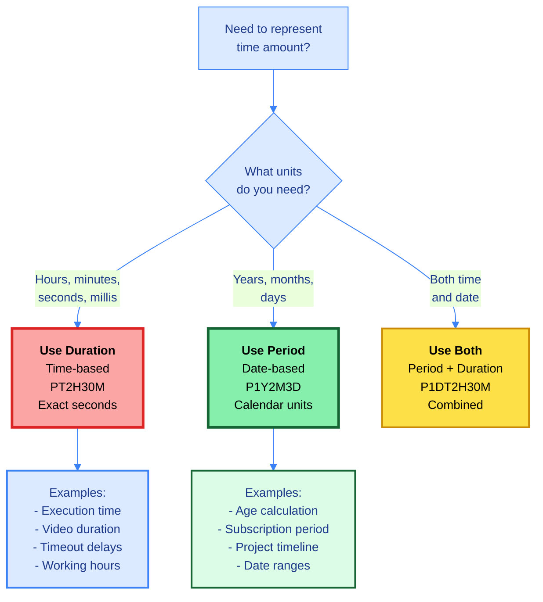
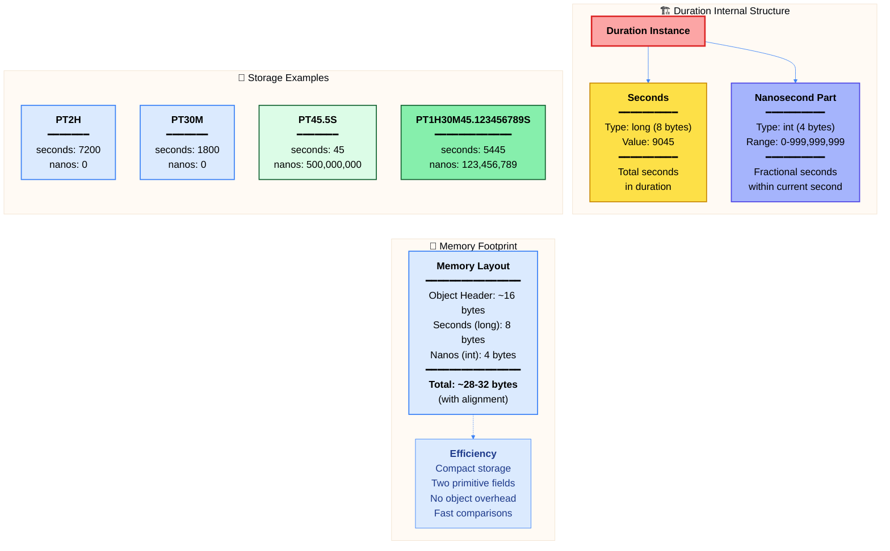

# ☕ Master Guide: Java Duration API - Time-Based Amounts & Intervals

<div align="center">


</div>

<hr style="border: 1px solid rgb(98, 117, 187)">

<div align="center">
<table>
<tr>
<td align="center">
<br />

<h3>© 2026 Avinash Dhanuka</h3>
<p>Master Guide: Java Core & Frameworks</p>
<p><em>Crafted with ❤️ for Object-Oriented Architecture</em></p>

<a href="https://github.com/Avinash-706" target="_blank">

</a>

<a href="https://mail.google.com/mail/?view=cm&fs=1&to=avunashdhanuka@gmail.com&su=Java%20Duration%20Query&body=☕%20Hello%20Avinash,%0D%0A%0D%0AMy%20name%20is%20[Your%20Name]%20and%20I%20have%20a%20doubt%20regarding%20Java%20Duration%20API.%0D%0A%0D%0A🔹%20Topic:%20[Duration/Time-Based%20Amounts]%0D%0A🔹%20Question:%20[Type%20your%20question]%0D%0A%0D%0AThank%20you!" target="_blank">


</a>
<br />
<br />
</td>
</tr>
</table>
</div>

> **Author's Note:** This comprehensive guide explores Java 8's Duration API for representing time-based amounts and measuring elapsed time between temporal objects. Master the concept of time intervals, understand the PT format notation, and learn precision timing operations. Includes detailed theoretical knowledge on duration arithmetic, conversion operations, and the critical differences between Duration (time-based) and Period (date-based) for temporal calculations.

---

## ⏰ Java Duration Architecture



---

## 📑 Table of Contents
1. [Duration Overview - Time-Based Amounts](#1-duration-overview---time-based-amounts)
    - [Core Characteristics & Philosophy](#11-core-characteristics--philosophy)
    - [Duration vs Period - Critical Differences](#12-duration-vs-period---critical-differences)
    - [Internal Architecture & Storage Model](#13-internal-architecture--storage-model)
2. [PT Format Notation - ISO-8601 Duration Standard](#2-pt-format-notation---iso-8601-duration-standard)
    - [Understanding PT Format Structure](#21-understanding-pt-format-structure)
    - [Parsing Duration Strings](#22-parsing-duration-strings)
    - [Output Format Explained](#23-output-format-explained)
3. [Duration Creation & Factory Methods](#3-duration-creation--factory-methods)
    - [Factory Method Patterns](#31-factory-method-patterns)
    - [Between Operations - Measuring Intervals](#32-between-operations---measuring-intervals)
    - [Why LocalDate Doesn't Work](#33-why-localdate-doesnt-work)
4. [Duration Extraction & Conversion](#4-duration-extraction--conversion)
    - [Getting Total Values](#41-getting-total-values)
    - [Part Extraction Methods](#42-part-extraction-methods)
    - [Unit Conversion Operations](#43-unit-conversion-operations)
5. [Duration Arithmetic Operations](#5-duration-arithmetic-operations)
    - [Plus Operations - Extending Duration](#51-plus-operations---extending-duration)
    - [Minus Operations - Reducing Duration](#52-minus-operations---reducing-duration)
    - [Multiply & Divide Operations](#53-multiply--divide-operations)
6. [Duration Comparison & Validation](#6-duration-comparison--validation)
    - [Comparison Methods](#61-comparison-methods)
    - [Zero & Negative Checks](#62-zero--negative-checks)
    - [Absolute & Negation Operations](#63-absolute--negation-operations)
7. [Duration with Temporal Objects](#7-duration-with-temporal-objects)
    - [Compatible Temporal Types](#71-compatible-temporal-types)
    - [Adding Duration to Instant](#72-adding-duration-to-instant)
    - [Adding Duration to LocalDateTime](#73-adding-duration-to-localdatetime)
8. [Performance & Best Practices](#8-performance--best-practices)
9. [Real-World Use Cases](#9-real-world-use-cases)

<div align="right">
<sub><em>Comprehensive notes by Avinash Dhanuka | For educational purposes</em></sub>
</div>

---

## 1. DURATION OVERVIEW - Time-Based Amounts

### 📌 Definition
**Duration** is an **immutable time-based amount** representing a **quantity of time** in terms of seconds and nanoseconds. Unlike Period (which deals with years, months, days), Duration is strictly **time-based**, measuring intervals in hours, minutes, seconds, milliseconds, microseconds, and nanoseconds. Part of Java 8's Date-Time API (JSR-310), following ISO-8601 duration format standard.

### 1.1 Core Characteristics & Philosophy



#### 📋 Characteristics Table

| Property | Value | Details |
| :--- | :--- | :--- |
| **Package** | `java.time` | Since Java 8 (JSR-310) |
| **Mutability** | ✅ Immutable | Every operation creates new instance |
| **Thread Safety** | ✅ Thread-Safe | No synchronization required |
| **Null Support** | ❌ No Null | Use Optional<Duration> instead |
| **Format** | ISO-8601 PT | PT#H#M#S (e.g., PT2H30M) |
| **Precision** | Nanosecond | Up to 10⁻⁹ seconds (999,999,999 ns) |
| **Storage** | 12 bytes | 8 bytes (long seconds) + 4 bytes (int nanos) |
| **Time Units** | ✅ Supported | Days, hours, minutes, seconds, millis, micros, nanos |
| **Date Units** | ❌ NOT Supported | Years, months, weeks (use Period instead) |
| **Sign Support** | ✅ Yes | Can be negative (e.g., PT-2H = -2 hours) |
| **Arithmetic** | ✅ Full Support | Plus, minus, multiply, divide, negate, abs |

---

### 1.2 Duration vs Period - Critical Differences

#### 📊 Comparison Matrix

| Feature | Duration | Period |
| :--- | :---: | :---: |
| **Type** | Time-Based | Date-Based |
| **Units** | Hours, Minutes, Seconds, Nanos | Years, Months, Days |
| **Precision** | Nanosecond | Day |
| **Format** | PT2H30M45S | P1Y2M3D |
| **Works With** | Instant, LocalTime, LocalDateTime | LocalDate, LocalDateTime |
| **Storage** | Seconds (long) + Nanos (int) | Years, Months, Days (int each) |
| **ISO-8601** | PT prefix | P prefix (no T) |
| **Arithmetic** | Exact (seconds-based) | Approximate (variable month/year length) |
| **Negative Values** | ✅ Supported | ✅ Supported |
| **Example Use** | "2 hours 30 minutes" | "2 years 3 months" |

#### 🔍 Key Conceptual Differences

**Duration (Time-Based):**
- **Definition**: Amount of time measured in seconds and nanoseconds
- **Fixed Units**: 1 hour = exactly 3600 seconds (always constant)
- **Machine Time**: Computer-friendly, precise measurements
- **Use Cases**: Measuring execution time, timeouts, delays, working hours
- **Precision**: Sub-millisecond accuracy possible
- **Conversion**: Can convert between all time units precisely

**Period (Date-Based):**
- **Definition**: Amount of time in calendar units (years, months, days)
- **Variable Units**: 1 month = 28-31 days (depends on month)
- **Human Time**: Calendar-friendly, human-readable periods
- **Use Cases**: Age calculation, subscription periods, date arithmetic
- **Precision**: Day-level accuracy only
- **Conversion**: Cannot convert to exact seconds (months vary)

#### ⚠️ Critical: Why Duration is Time-Based Only

**The Problem with Date-Based Duration:**

| Date Unit | Why NOT Supported in Duration | Variable Length |
| :--- | :--- | :--- |
| **Years** | Leap years: 365 or 366 days | 31,536,000 or 31,622,400 seconds |
| **Months** | 28, 29, 30, or 31 days | 2,419,200 to 2,678,400 seconds |
| **Weeks** | Could be supported but ISO-8601 excludes | 604,800 seconds (constant) |

**Example of Month Variability:**
```
February 2024 (leap year): 29 days = 2,505,600 seconds
February 2026 (normal):    28 days = 2,419,200 seconds

Difference: 86,400 seconds (1 full day)
```

Because months and years have **variable lengths**, they cannot be accurately represented as a fixed number of seconds. Duration requires **exact, constant conversions** to maintain precision.

#### 🎯 Decision Tree: Duration or Period?



#### 📋 Use Case Comparison

| Scenario | Use Duration | Use Period |
| :--- | :--- | :--- |
| **Measure code execution time** | ✅ Yes | ❌ No |
| **Calculate age in years** | ❌ No | ✅ Yes |
| **Video/audio duration** | ✅ Yes | ❌ No |
| **Subscription (30 days)** | ⚠️ Use Period.ofDays(30) | ✅ Yes |
| **Working hours (8 hours)** | ✅ Yes | ❌ No |
| **Project timeline (6 months)** | ❌ No | ✅ Yes |
| **API timeout (30 seconds)** | ✅ Yes | ❌ No |
| **Meeting duration (1.5 hours)** | ✅ Yes | ❌ No |
| **Employee tenure (2 years)** | ❌ No | ✅ Yes |
| **Cache expiry (5 minutes)** | ✅ Yes | ❌ No |

---

### 1.3 Internal Architecture & Storage Model



#### 🔍 Internal Representation

Duration internally stores two primitive values:

1. **Seconds (long - 8 bytes)**: Signed 64-bit integer representing total seconds
2. **Nanosecond Part (int - 4 bytes)**: Unsigned 32-bit integer representing nanoseconds within the current second (0-999,999,999)

**Key Implementation Details:**

- **Final Fields**: Both `seconds` and `nanos` are `final`, ensuring immutability
- **Signed Seconds**: Can be positive (future) or negative (past/subtraction)
- **Nanosecond Range**: Always 0-999,999,999 (never negative, even for negative durations)
- **Validation**: Constructor ensures nanoseconds are within valid range
- **No Date Data**: No year/month/day information stored
- **Serialization**: Custom serialization format for efficiency

#### 🎨 Output Format

**Default toString() Format:**
```
PT2H30M45.123456789S
━━━━━━━━━━━━━━━━━━━
│P│T│ Duration │
━━━━━━━━━━━━━━━━━━━
 ↑ ↑      ↑
 │ │      └─ Time components (H/M/S)
 │ └──────── Time separator
 └────────── Period marker (ISO-8601)
```

**Components Breakdown:**
- `P`: Period marker (ISO-8601 standard)
- `T`: Time separator (distinguishes time from date)
- `2H`: 2 hours
- `30M`: 30 minutes
- `45.123456789S`: 45 seconds + fractional nanoseconds
- **Note**: Only non-zero components appear in output

#### 📊 Range & Limits

| Constant | Value | Seconds | Description |
| :--- | :--- | :--- | :--- |
| **Duration.ZERO** | PT0S | 0 | Zero duration |
| **Minimum** | PT-2562047788015215H-30M-8S | -9,223,372,036,854,775,808 | Long.MIN_VALUE seconds |
| **Maximum** | PT2562047788015215H30M7.999999999S | 9,223,372,036,854,775,807 | Long.MAX_VALUE seconds |

**Practical Range:**
- **Maximum Hours**: ~2.5 billion hours (~292 million years)
- **Minimum Hours**: ~-2.5 billion hours
- Far exceeds any practical application needs

---

## 2. PT FORMAT NOTATION - ISO-8601 Duration Standard

### 📌 Overview
Duration uses **PT format** (ISO-8601 standard) for string representation and parsing. Understanding this format is crucial for reading, writing, and parsing duration strings in Java applications and external APIs.

### 2.1 Understanding PT Format Structure

#### 📋 PT Format Components

**Basic Structure:**
```
P[n]Y[n]M[n]DT[n]H[n]M[n]S
│  │  │  │ │ │  │  │  └─ Seconds
│  │  │  │ │ │  │  └──── Minutes
│  │  │  │ │ │  └─────── Hours
│  │  │  │ │ └────────── Time separator (MANDATORY for Duration)
│  │  │  │ └──────────── Days (date component)
│  │  │  └────────────── Months (date component)
│  │  └───────────────── Years (date component)
│  └──────────────────── Period marker
└─────────────────────── ISO-8601 prefix
```

**Duration-Specific Rules:**
- **P**: Period marker (always present)
- **T**: Time separator (MANDATORY for Duration, even if no date part)
- **Date parts** (Y/M/D): Optional, represent days (not years/months for Duration)
- **Time parts** (H/M/S): Optional, at least one must be present

#### 📊 PT Format Examples

| PT String | Meaning | Seconds | Breakdown |
| :--- | :--- | :--- | :--- |
| **PT0S** | 0 seconds | 0 | Zero duration |
| **PT1S** | 1 second | 1 | 1 second |
| **PT1M** | 1 minute | 60 | 1 minute = 60 seconds |
| **PT1H** | 1 hour | 3600 | 1 hour = 3600 seconds |
| **PT1H30M** | 1 hour 30 minutes | 5400 | 3600 + 1800 |
| **PT2H30M45S** | 2 hours 30 min 45 sec | 9045 | 7200 + 1800 + 45 |
| **PT15S** | 15 seconds | 15 | Just seconds |
| **PT0.5S** | 0.5 seconds (500 ms) | 0 + 500,000,000 ns | Fractional seconds |
| **PT1.123456789S** | 1.123456789 seconds | 1 + 123,456,789 ns | Nanosecond precision |
| **PT24H** | 24 hours (1 day) | 86400 | 24 × 3600 |
| **PT-2H** | -2 hours (negative) | -7200 | Negative duration |

#### 🔍 PT Format Rules

**Mandatory Elements:**
- ✅ `P` prefix (Period marker)
- ✅ `T` separator (Time marker)
- ✅ At least ONE time component (H, M, or S)

**Optional Elements:**
- ⚠️ Days (represented in hours for Duration)
- ⚠️ Hours, minutes, or seconds (at least one required)
- ⚠️ Fractional seconds (up to 9 decimal places for nanoseconds)

**Format Variations:**
```
Valid PT Formats:
✅ PT2H         → 2 hours
✅ PT30M        → 30 minutes
✅ PT45S        → 45 seconds
✅ PT2H30M      → 2 hours 30 minutes
✅ PT2H30M45S   → Complete format
✅ PT0S         → Zero duration
✅ PT0.001S     → 1 millisecond
✅ PT-2H        → Negative 2 hours

Invalid Formats:
❌ P2H          → Missing 'T' separator
❌ T2H          → Missing 'P' prefix
❌ PT           → No time components
❌ 2H30M        → Missing 'PT' prefix
❌ PT2H30       → Ambiguous (missing unit)
```

#### 🎯 Why 'PT' and Not Just 'P'?

**'P' = Period Marker (ISO-8601 Standard):**
- Used for both Period (date-based) and Duration (time-based)
- Indicates an ISO-8601 duration/period format

**'T' = Time Separator (Distinguishes Time from Date):**
- **Without 'T'**: `P1M` = 1 Month (Period, date-based)
- **With 'T'**: `PT1M` = 1 Minute (Duration, time-based)
- **Critical**: Disambiguates between months (M) and minutes (M)

**Example of Ambiguity Resolution:**

| Format | Interpretation | Explanation |
| :--- | :--- | :--- |
| **P1M** | 1 Month (Period) | 'M' before 'T' = Months |
| **PT1M** | 1 Minute (Duration) | 'M' after 'T' = Minutes |
| **P1Y2M3D** | 1 Year 2 Months 3 Days | No 'T', all date units |
| **P1DT2H** | 1 Day 2 Hours | 'D' before 'T', 'H' after 'T' |
| **PT2H30M** | 2 Hours 30 Minutes | All after 'T', time units |

---

### 2.2 Parsing Duration Strings

#### 📋 Duration.parse() Method

**Method Signature:**
```
static Duration parse(CharSequence text)
```

**Behavior:**
- Parses ISO-8601 PT format string
- Returns new Duration instance
- Throws DateTimeParseException if invalid format
- Case-sensitive (must be uppercase PT)

#### 📊 Parsing Examples

| Input String | Parsed Duration | Seconds | Nanoseconds |
| :--- | :--- | :--- | :--- |
| "PT0S" | 0 seconds | 0 | 0 |
| "PT15S" | 15 seconds | 15 | 0 |
| "PT1M" | 1 minute | 60 | 0 |
| "PT1H" | 1 hour | 3600 | 0 |
| "PT2H30M" | 2h 30m | 9000 | 0 |
| "PT2H30M45S" | 2h 30m 45s | 9045 | 0 |
| "PT0.5S" | 0.5 seconds | 0 | 500,000,000 |
| "PT1.123S" | 1.123 seconds | 1 | 123,000,000 |
| "PT1.123456789S" | Full nanosecond | 1 | 123,456,789 |
| "PT-2H" | -2 hours | -7200 | 0 |

#### ⚠️ Parsing Errors

**Common Parse Exceptions:**

| Invalid Input | Error | Reason |
| :--- | :--- | :--- |
| "2H30M" | DateTimeParseException | Missing 'PT' prefix |
| "P2H30M" | DateTimeParseException | Missing 'T' separator |
| "PT" | DateTimeParseException | No time components |
| "pt2h" | DateTimeParseException | Lowercase (must be uppercase) |
| "PT2H30" | DateTimeParseException | Ambiguous unit (missing M/S) |
| "PT2.5H" | DateTimeParseException | Fractional hours not allowed |
| "PT2H2.5M" | DateTimeParseException | Fractional minutes not allowed |

**Important**: Only seconds can have fractional parts (e.g., PT1.5S is valid, PT1.5H is NOT).

---

### 2.3 Output Format Explained

#### 📋 Duration.toString() Format

**Default Output Rules:**
- Always starts with "PT"
- Only non-zero components appear
- Largest to smallest units (hours → minutes → seconds)
- Fractional seconds shown with decimal point
- Trailing zeros in fractional seconds are removed
- Negative durations have '-' before first component

#### 📊 Output Format Examples

| Duration Created | toString() Output | Explanation |
| :--- | :--- | :--- |
| `Duration.ofHours(2)` | PT2H | 2 hours only |
| `Duration.ofMinutes(30)` | PT30M | 30 minutes only |
| `Duration.ofSeconds(45)` | PT45S | 45 seconds only |
| `Duration.ofHours(2).plusMinutes(30)` | PT2H30M | 2 hours 30 minutes |
| `Duration.ofSeconds(9045)` | PT2H30M45S | All components |
| `Duration.ofMillis(1500)` | PT1.5S | 1.5 seconds |
| `Duration.ofNanos(123456789)` | PT0.123456789S | Nanosecond precision |
| `Duration.ofSeconds(0)` | PT0S | Zero duration |
| `Duration.ofHours(-2)` | PT-2H | Negative 2 hours |
| `Duration.ofMinutes(90)` | PT1H30M | Normalized to hours + minutes |

#### 🔍 Output Normalization

**Duration automatically normalizes output:**

```
Input: Duration.ofSeconds(3661)
Internal: 3661 seconds + 0 nanos
Output: PT1H1S (NOT PT3661S)

Breakdown:
3661 ÷ 3600 = 1 hour (3600 seconds)
3661 % 3600 = 61 seconds
61 ÷ 60 = 1 minute (60 seconds)
61 % 60 = 1 second

Final: PT1H1M1S
```

**Normalization Rules:**
1. **60 seconds** → 1 minute
2. **60 minutes** → 1 hour
3. **24 hours** → Stays as hours (NOT converted to days in output)
4. **Fractional seconds** → Decimal notation (PT1.5S)
5. **Zero components** → Omitted from output

#### ⚠️ Important Notes

**Days in Duration:**
- Duration can represent days (using `ofDays()`)
- Internally stored as hours (1 day = 24 hours = 86400 seconds)
- Output shows hours, NOT days
- Example: `Duration.ofDays(2)` → `PT48H` (NOT PT2D)

**Negative Durations:**
- Negative sign appears before first component
- Format: `PT-2H30M` (NOT `PT2H-30M`)
- All components are conceptually negative
- Example: `PT-2H` means -2 hours, not +2 hours

---

## 3. DURATION CREATION & Factory Methods

### 📌 Overview
Duration provides multiple **factory methods** for creating instances from specific time units, measuring intervals between temporal objects, or parsing PT format strings.

### 3.1 Factory Method Patterns

#### 📋 Factory Methods Reference

| Method | Signature | Use Case | Example Output |
| :--- | :--- | :--- | :--- |
| **ofDays()** | `static Duration ofDays(long days)` | Create from days | PT24H (1 day) |
| **ofHours()** | `static Duration ofHours(long hours)` | Create from hours | PT2H |
| **ofMinutes()** | `static Duration ofMinutes(long minutes)` | Create from minutes | PT30M |
| **ofSeconds()** | `static Duration ofSeconds(long seconds)` | Create from seconds | PT45S |
| **ofSeconds(long, long)** | `static Duration ofSeconds(long sec, long nanoAdj)` | Seconds + nano adjustment | PT45.123S |
| **ofMillis()** | `static Duration ofMillis(long millis)` | Create from milliseconds | PT1.5S (1500 ms) |
| **ofNanos()** | `static Duration ofNanos(long nanos)` | Create from nanoseconds | PT0.001S (1,000,000 ns) |
| **of(long, TemporalUnit)** | `static Duration of(long amount, TemporalUnit unit)` | Generic creation | `of(10, ChronoUnit.MINUTES)` |
| **parse()** | `static Duration parse(CharSequence text)` | Parse PT format | `parse("PT2H30M")` |
| **between()** | `static Duration between(Temporal start, Temporal end)` | Measure interval | `between(instant1, instant2)` |
| **ZERO** | `static final Duration ZERO` | Zero duration constant | PT0S |

#### 🎯 Factory Method Categories

**1. Specific Time Units:**
- `ofDays(long)` - Days (stored as hours internally)
- `ofHours(long)` - Hours
- `ofMinutes(long)` - Minutes
- `ofSeconds(long)` - Seconds (whole seconds only)
- `ofSeconds(long, long)` - Seconds + nanosecond adjustment
- `ofMillis(long)` - Milliseconds (1/1000 second)
- `ofNanos(long)` - Nanoseconds (1/1,000,000,000 second)

**2. Generic Creation:**
- `of(long, TemporalUnit)` - Any time-based unit
- Supports: NANOS, MICROS, MILLIS, SECONDS, MINUTES, HOURS, HALF_DAYS, DAYS

**3. From Strings:**
- `parse(CharSequence)` - Parse ISO-8601 PT format

**4. Measuring Intervals:**
- `between(Temporal, Temporal)` - Duration between two temporal objects

**5. Constants:**
- `Duration.ZERO` - Zero duration (PT0S)

#### 📊 Creation Examples

| Creation Method | Result | Seconds | Explanation |
| :--- | :--- | :--- | :--- |
| `Duration.ofDays(1)` | PT24H | 86400 | 1 day = 24 hours |
| `Duration.ofHours(2)` | PT2H | 7200 | 2 hours |
| `Duration.ofMinutes(30)` | PT30M | 1800 | 30 minutes |
| `Duration.ofSeconds(45)` | PT45S | 45 | 45 seconds |
| `Duration.ofMillis(1500)` | PT1.5S | 1 + 500,000,000 ns | 1500 ms = 1.5 sec |
| `Duration.ofNanos(1_000_000)` | PT0.001S | 0 + 1,000,000 ns | 1 million ns = 1 ms |
| `Duration.of(10, ChronoUnit.MINUTES)` | PT10M | 600 | Generic creation |
| `Duration.parse("PT2H30M")` | PT2H30M | 9000 | From string |
| `Duration.ZERO` | PT0S | 0 | Zero constant |

#### 🔍 Nanosecond Adjustment in ofSeconds()

**Method Signature:**
```
static Duration ofSeconds(long seconds, long nanoAdjustment)
```

**Behavior:**
- First parameter: whole seconds
- Second parameter: nanosecond adjustment (can overflow)
- Automatically adjusts seconds if nanos exceed range
- Negative adjustment supported

**Examples:**

| Seconds | Nano Adjustment | Result | Explanation |
| :--- | :--- | :--- | :--- |
| 45 | 0 | PT45S | 45 seconds exactly |
| 45 | 500,000,000 | PT45.5S | 45.5 seconds |
| 45 | 999,999,999 | PT45.999999999S | 45.999999999 seconds |
| 45 | 1,000,000,000 | PT46S | Overflow: 46 seconds + 0 nanos |
| 45 | 2,500,000,000 | PT47.5S | Overflow: 47 seconds + 500,000,000 nanos |
| 45 | -500,000,000 | PT44.5S | Underflow: 44 seconds + 500,000,000 nanos |

**Overflow/Underflow Handling:**
- Positive overflow: Adds to seconds
- Negative underflow: Subtracts from seconds
- Result always has nanos in valid range (0-999,999,999)

---

### 3.2 Between Operations - Measuring Intervals

#### 📋 Duration.between() Method

**Method Signature:**
```
static Duration between(Temporal startInclusive, Temporal endExclusive)
```

**Purpose:** Calculate duration between two temporal objects

**Behavior:**
- Measures time-based difference (seconds + nanos)
- Result can be negative if end is before start
- Only works with time-supporting temporal types
- Throws exception if temporal doesn't support time-based units

#### 🎯 Compatible Temporal Types

**Supported Types:**

| Temporal Type | Has Time? | Works with Duration.between()? | Example |
| :--- | :---: | :---: | :--- |
| **Instant** | ✅ Yes | ✅ Yes | UTC timestamp |
| **LocalTime** | ✅ Yes | ✅ Yes | Time without date |
| **LocalDateTime** | ✅ Yes | ✅ Yes | Date + Time |
| **ZonedDateTime** | ✅ Yes | ✅ Yes | Date + Time + Zone |
| **OffsetDateTime** | ✅ Yes | ✅ Yes | Date + Time + Offset |
| **LocalDate** | ❌ No | ❌ NO | Date only (no time) |

#### 📊 Between Examples

**1. Between Two Instants:**
```
Start: 2026-09-06T13:00:00Z
End:   2026-09-06T15:30:45Z

Duration duration = Duration.between(start, end);
Result: PT2H30M45S (9045 seconds)
```

**2. Between Two LocalTimes:**
```
Morning: 09:00:00
Evening: 17:30:00

Duration workHours = Duration.between(morning, evening);
Result: PT8H30M (working hours)
```

**3. Between Two LocalDateTimes:**
```
Meeting Start: 2026-09-06T14:00:00
Meeting End:   2026-09-06T15:30:00

Duration meetingDuration = Duration.between(startTime, endTime);
Result: PT1H30M
```

**4. Negative Duration (End Before Start):**
```
Start: 2026-09-06T15:00:00
End:   2026-09-06T13:00:00

Duration duration = Duration.between(start, end);
Result: PT-2H (negative 2 hours)
```

#### ⚠️ Important Notes

**Order Matters:**
- `Duration.between(start, end)` → Positive if end > start
- `Duration.between(end, start)` → Negative if end > start
- To get absolute duration, use `.abs()` method

**Cross-Midnight Handling:**
```
Time1: 23:00:00
Time2: 01:00:00 (next day)

Duration.between(time1, time2)
Result: PT2H (assumes same day, wraps around)
```

For cross-day scenarios, use LocalDateTime instead of LocalTime.

---

### 3.3 Why LocalDate Doesn't Work

#### 📌 The Problem

**Attempting to use Duration.between() with LocalDate:**
```
LocalDate date1 = LocalDate.of(2026, 8, 1);
LocalDate date2 = LocalDate.of(2026, 8, 10);

Duration duration = Duration.between(date1, date2);
// ❌ THROWS: UnsupportedTemporalTypeException
// Error: "Unsupported unit: Seconds"
```

#### 🔍 Why It Fails

**LocalDate Characteristics:**
- Contains ONLY date information (year, month, day)
- Has NO time component (no hours, minutes, seconds)
- Does NOT support time-based units (SECONDS, NANOS)

**Duration Requirements:**
- Measures TIME-BASED intervals (seconds + nanoseconds)
- Requires temporal objects that support SECONDS unit
- Cannot work with date-only objects

**Temporal Unit Support:**

| Temporal Type | Supports SECONDS Unit? | Why? |
| :--- | :---: | :--- |
| **LocalDate** | ❌ No | No time component |
| **LocalTime** | ✅ Yes | Pure time representation |
| **LocalDateTime** | ✅ Yes | Has time component |
| **Instant** | ✅ Yes | Time-based timestamp |
| **ZonedDateTime** | ✅ Yes | Has time component |

#### ✅ Correct Solutions

**Solution 1: Use Period for Date-Based Differences**
```
LocalDate date1 = LocalDate.of(2026, 8, 1);
LocalDate date2 = LocalDate.of(2026, 8, 10);

Period period = Period.between(date1, date2);
Result: P9D (9 days)
```

**Solution 2: Convert to LocalDateTime First**
```
LocalDate date1 = LocalDate.of(2026, 8, 1);
LocalDate date2 = LocalDate.of(2026, 8, 10);

LocalDateTime dt1 = date1.atStartOfDay();  // Midnight
LocalDateTime dt2 = date2.atStartOfDay();

Duration duration = Duration.between(dt1, dt2);
Result: PT216H (216 hours = 9 days)
```

**Solution 3: Use ChronoUnit for Days**
```
LocalDate date1 = LocalDate.of(2026, 8, 1);
LocalDate date2 = LocalDate.of(2026, 8, 10);

long daysBetween = ChronoUnit.DAYS.between(date1, date2);
Result: 9 (long value, not Duration)
```

#### 📊 When to Use What

| Scenario | Use | Example Result |
| :--- | :--- | :--- |
| **Date difference (days)** | Period.between() | P9D |
| **Time difference (hours/mins/secs)** | Duration.between() | PT2H30M |
| **Date to hours** | Convert to LocalDateTime first | PT216H |
| **Just day count** | ChronoUnit.DAYS.between() | 9 (long) |

---

## 4. DURATION EXTRACTION & CONVERSION

### 📌 Overview
Duration provides methods to extract total values, individual parts, and convert between different time units. Understanding the difference between **total conversion** and **part extraction** is crucial.

### 4.1 Getting Total Values

#### 📋 Total Value Methods

| Method | Return Type | Description | Example (PT2H30M45S) |
| :--- | :--- | :--- | :--- |
| **getSeconds()** | long | Total seconds (excluding nanos) | 9045 |
| **getNano()** | int | Nanosecond part (0-999,999,999) | 0 |
| **toDays()** | long | Total as days (truncated) | 0 |
| **toHours()** | long | Total as hours (truncated) | 2 |
| **toMinutes()** | long | Total as minutes (truncated) | 150 |
| **toSeconds()** | long | Total as seconds (same as getSeconds) | 9045 |
| **toMillis()** | long | Total as milliseconds | 9,045,000 |
| **toNanos()** | long | Total as nanoseconds | 9,045,000,000,000 |

#### 🔍 Understanding getSeconds() vs toSeconds()

**Key Differences:**

| Method | Purpose | Includes Nanos? | Example (PT45.5S) |
| :--- | :--- | :---: | :--- |
| **getSeconds()** | Get whole seconds only | ❌ No | 45 |
| **getNano()** | Get nanosecond part | N/A | 500,000,000 |
| **toSeconds()** | Total seconds (truncated) | ❌ No | 45 |
| **toMillis()** | Total milliseconds | ✅ Partial | 45,500 |
| **toNanos()** | Total nanoseconds | ✅ Full | 45,500,000,000 |

**Important**: 
- `getSeconds()` and `toSeconds()` return the **same value** (whole seconds)
- To get fractional seconds, use `toMillis()` or `toNanos()`
- `getNano()` returns the fractional part only (0-999,999,999)

#### 📊 Total Conversion Examples

**Duration: PT2H30M45S**

| Conversion Method | Calculation | Result |
| :--- | :--- | :--- |
| **toDays()** | 9045 ÷ 86400 | 0 (less than 1 day) |
| **toHours()** | 9045 ÷ 3600 | 2 (truncated) |
| **toMinutes()** | 9045 ÷ 60 | 150 |
| **toSeconds()** | 9045 ÷ 1 | 9045 |
| **toMillis()** | 9045 × 1000 | 9,045,000 |
| **toNanos()** | 9045 × 1,000,000,000 | 9,045,000,000,000 |

**Duration: PT50H (2 days 2 hours)**

| Conversion Method | Calculation | Result |
| :--- | :--- | :--- |
| **toDays()** | 180000 ÷ 86400 | 2 |
| **toHours()** | 180000 ÷ 3600 | 50 |
| **toMinutes()** | 180000 ÷ 60 | 3000 |
| **toSeconds()** | 180000 ÷ 1 | 180000 |

**Important**: All `to*()` methods perform **truncation** (floor division), not rounding.

---

### 4.2 Part Extraction Methods

#### 📋 Part Extraction Methods (Java 9+)

| Method | Return Type | Range | Description | Example (PT50H30M45S) |
| :--- | :--- | :--- | :--- | :--- |
| **toDaysPart()** | long | 0-Long.MAX_VALUE | Days component | 2 |
| **toHoursPart()** | int | 0-23 | Hours within day | 2 |
| **toMinutesPart()** | int | 0-59 | Minutes within hour | 30 |
| **toSecondsPart()** | int | 0-59 | Seconds within minute | 45 |
| **toNanosPart()** | int | 0-999,999,999 | Nanos within second | 0 |

#### 🔍 Total vs Part - Critical Difference

**Understanding the Difference:**

| Duration | Method | Result | Explanation |
| :--- | :--- | :--- | :--- |
| **PT50H** | toHours() | 50 | TOTAL hours |
| **PT50H** | toHoursPart() | 2 | Hours WITHIN day (50 % 24) |
| **PT50H** | toDaysPart() | 2 | Complete days (50 ÷ 24) |

**Visualization:**
```
Duration: PT50H30M45S
Total: 50 hours, 30 minutes, 45 seconds

Breakdown into Parts:
toDaysPart()    = 2 days        (48 hours)
toHoursPart()   = 2 hours       (remaining after days)
toMinutesPart() = 30 minutes
toSecondsPart() = 45 seconds

Human-Readable: "2 days, 2 hours, 30 minutes, 45 seconds"
```

#### 📊 Part Extraction Examples

**Example 1: PT2H30M45S**

| Method | Result | Calculation |
| :--- | :--- | :--- |
| toDaysPart() | 0 | 9045 ÷ 86400 = 0 |
| toHoursPart() | 2 | (9045 % 86400) ÷ 3600 = 2 |
| toMinutesPart() | 30 | (9045 % 3600) ÷ 60 = 30 |
| toSecondsPart() | 45 | 9045 % 60 = 45 |
| toNanosPart() | 0 | (no fractional part) |

**Example 2: PT50H30M45.123456789S**

| Method | Result | Calculation |
| :--- | :--- | :--- |
| toDaysPart() | 2 | 181845 ÷ 86400 = 2 |
| toHoursPart() | 2 | (181845 % 86400) ÷ 3600 = 2 |
| toMinutesPart() | 30 | (181845 % 3600) ÷ 60 = 30 |
| toSecondsPart() | 45 | 181845 % 60 = 45 |
| toNanosPart() | 123,456,789 | fractional part |

**Example 3: PT125M (2 hours 5 minutes)**

| Method | Result | Calculation |
| :--- | :--- | :--- |
| toDaysPart() | 0 | 7500 ÷ 86400 = 0 |
| toHoursPart() | 2 | 7500 ÷ 3600 = 2 |
| toMinutesPart() | 5 | (7500 % 3600) ÷ 60 = 5 |
| toSecondsPart() | 0 | 7500 % 60 = 0 |
| toNanosPart() | 0 | (no fractional part) |

#### 🎯 Use Cases

**Use Total Conversion When:**
- Need complete duration in single unit
- Calculating elapsed time for display
- Database storage (milliseconds)
- Performance measurement

**Use Part Extraction When:**
- Need human-readable format (2h 30m 45s)
- Display in UI with separate fields
- Building formatted strings
- Creating custom duration representations

---

### 4.3 Unit Conversion Operations

#### 📋 Conversion Precision & Loss

**Precision Levels:**

| Target Unit | Precision | Loses Information? | Example |
| :--- | :--- | :---: | :--- |
| **toDays()** | Day | ✅ Yes | Hours, minutes, seconds lost |
| **toHours()** | Hour | ✅ Yes | Minutes, seconds lost |
| **toMinutes()** | Minute | ✅ Yes | Seconds, nanos lost |
| **toSeconds()** | Second | ✅ Yes | Nanos lost |
| **toMillis()** | Millisecond | ✅ Yes | Microseconds, nanos lost |
| **toNanos()** | Nanosecond | ❌ No | Full precision |

**Precision Loss Example:**
```
Original: PT2H30M45.123456789S

toDays()    → 0 days (loses everything)
toHours()   → 2 hours (loses 30m 45s)
toMinutes() → 150 minutes (loses 45s)
toSeconds() → 9045 seconds (loses .123456789s)
toMillis()  → 9045123 milliseconds (loses .456789s)
toNanos()   → 9045123456789 nanoseconds (full precision)
```

#### ⚠️ Conversion Caveats

**1. Truncation, Not Rounding:**
```
Duration: PT1H59M59S (7199 seconds)

toHours() → 1 (NOT 2)
Reason: 7199 ÷ 3600 = 1.9997... → truncated to 1
```

**2. Overflow Risk with toNanos():**
```
Duration: PT3000000H (very large)

toNanos() → May throw ArithmeticException
Reason: Result exceeds Long.MAX_VALUE
```

**3. Negative Durations:**
```
Duration: PT-2H30M

toHours()   → -2
toMinutes() → -150
toSeconds() → -9000

All conversions preserve sign
```

#### 📊 Conversion Formulas

**Time Unit Conversions:**

| From → To | Formula | Example |
| :--- | :--- | :--- |
| Days → Seconds | days × 86400 | 2 days = 172,800 seconds |
| Hours → Seconds | hours × 3600 | 2 hours = 7,200 seconds |
| Minutes → Seconds | minutes × 60 | 30 minutes = 1,800 seconds |
| Seconds → Milliseconds | seconds × 1,000 | 45 seconds = 45,000 ms |
| Milliseconds → Microseconds | millis × 1,000 | 1 ms = 1,000 μs |
| Microseconds → Nanoseconds | micros × 1,000 | 1 μs = 1,000 ns |

**Reverse Conversions (Truncation):**

| From → To | Formula | Example |
| :--- | :--- | :--- |
| Seconds → Days | seconds ÷ 86400 | 172,800 ÷ 86400 = 2 |
| Seconds → Hours | seconds ÷ 3600 | 7,200 ÷ 3600 = 2 |
| Seconds → Minutes | seconds ÷ 60 | 1,800 ÷ 60 = 30 |
| Milliseconds → Seconds | millis ÷ 1,000 | 45,000 ÷ 1,000 = 45 |
| Nanoseconds → Milliseconds | nanos ÷ 1,000,000 | 123,456,789 ÷ 1,000,000 = 123 |

---

## 5. DURATION ARITHMETIC OPERATIONS

### 📌 Overview
Duration provides **immutable arithmetic operations** for adding, subtracting, multiplying, and dividing time amounts. Every operation returns a **new Duration instance**, preserving immutability and thread safety.

### 5.1 Plus Operations - Extending Duration

#### 📋 Plus Methods Reference

| Method | Description | Example | Result (from PT2H) |
| :--- | :--- | :--- | :--- |
| **plusDays(long)** | Add days | `duration.plusDays(1)` | PT26H |
| **plusHours(long)** | Add hours | `duration.plusHours(3)` | PT5H |
| **plusMinutes(long)** | Add minutes | `duration.plusMinutes(45)` | PT2H45M |
| **plusSeconds(long)** | Add seconds | `duration.plusSeconds(30)` | PT2H30S |
| **plusMillis(long)** | Add milliseconds | `duration.plusMillis(500)` | PT2H0.5S |
| **plusNanos(long)** | Add nanoseconds | `duration.plusNanos(1_000_000)` | PT2H0.001S |
| **plus(long, TemporalUnit)** | Add any time unit | `duration.plus(45, ChronoUnit.MINUTES)` | PT2H45M |
| **plus(Duration)** | Add another duration | `duration.plus(Duration.ofMinutes(30))` | PT2H30M |

#### 🎯 Plus Operation Characteristics

**Immutability:**
- Original duration remains unchanged
- Returns new Duration instance
- Safe to use across threads
- Method chaining supported

**Overflow Handling:**
- Units automatically normalize (60 minutes → 1 hour)
- Days converted to hours (1 day → 24 hours)
- Seconds + nanos combined correctly
- Result always valid Duration

#### 📊 Plus Examples

**Example 1: Simple Addition**
```
Base: PT2H

plusHours(3) → PT5H
plusMinutes(30) → PT2H30M
plusSeconds(45) → PT2H45S
```

**Example 2: Adding Another Duration**
```
Duration1: PT2H
Duration2: PT30M

Duration1.plus(Duration2) → PT2H30M
```

**Example 3: Chained Operations**
```
Base: PT2H

duration.plusHours(1)
        .plusMinutes(30)
        .plusSeconds(45)

Result: PT3H30M45S
```

**Example 4: Fractional Seconds**
```
Base: PT1H

plusMillis(500) → PT1H0.5S
plusNanos(500_000_000) → PT1H0.5S (same result)
```

#### 🔄 Unit Normalization

**Automatic Normalization:**

| Operation | Internal Calculation | Result |
| :--- | :--- | :--- |
| `PT1H.plusMinutes(90)` | 60 + 90 = 150 minutes → 2h 30m | PT2H30M |
| `PT30M.plusSeconds(90)` | 1800 + 90 = 1890 seconds → 31m 30s | PT31M30S |
| `PT0S.plusMillis(5500)` | 5500 ms → 5 seconds + 500 ms | PT5.5S |

---

### 5.2 Minus Operations - Reducing Duration

#### 📋 Minus Methods Reference

| Method | Description | Example | Result (from PT5H) |
| :--- | :--- | :--- | :--- |
| **minusDays(long)** | Subtract days | `duration.minusDays(0)` | PT5H |
| **minusHours(long)** | Subtract hours | `duration.minusHours(2)` | PT3H |
| **minusMinutes(long)** | Subtract minutes | `duration.minusMinutes(30)` | PT4H30M |
| **minusSeconds(long)** | Subtract seconds | `duration.minusSeconds(45)` | PT4H59M15S |
| **minusMillis(long)** | Subtract milliseconds | `duration.minusMillis(500)` | PT4H59M59.5S |
| **minusNanos(long)** | Subtract nanoseconds | `duration.minusNanos(1_000_000)` | PT4H59M59.999S |
| **minus(long, TemporalUnit)** | Subtract any unit | `duration.minus(45, ChronoUnit.MINUTES)` | PT4H15M |
| **minus(Duration)** | Subtract another duration | `duration.minus(Duration.ofHours(2))` | PT3H |

#### 📊 Minus Examples

**Example 1: Simple Subtraction**
```
Base: PT5H

minusHours(2) → PT3H
minusMinutes(30) → PT4H30M
minusSeconds(45) → PT4H59M15S
```

**Example 2: Subtracting Another Duration**
```
Duration1: PT5H
Duration2: PT30M

Duration1.minus(Duration2) → PT4H30M
```

**Example 3: Chained Operations**
```
Base: PT5H

duration.minusHours(1)
        .minusMinutes(30)
        .minusSeconds(45)

Result: PT3H29M15S
```

**Example 4: Negative Result**
```
Base: PT2H

minusHours(5) → PT-3H (negative 3 hours)
```

#### ⚠️ Negative Durations

**Understanding Negative Durations:**
- Result of subtraction can be negative
- Represents "backwards" or "past" duration
- All components conceptually negative
- Format: PT-2H30M (NOT PT2H-30M)

**Negative Duration Examples:**

| Operation | Result | Meaning |
| :--- | :--- | :--- |
| `PT2H.minus(PT5H)` | PT-3H | -3 hours |
| `PT30M.minus(PT1H)` | PT-30M | -30 minutes |
| `PT1H.minusHours(5)` | PT-4H | -4 hours |

**Working with Negative Durations:**
```
Duration negative = Duration.ofHours(2).minusHours(5);
// Result: PT-3H

Check if negative:
negative.isNegative() → true

Get absolute value:
negative.abs() → PT3H

Negate (flip sign):
negative.negated() → PT3H
```

---

### 5.3 Multiply & Divide Operations

#### 📋 Multiply & Divide Methods

| Method | Description | Example | Result (from PT2H) |
| :--- | :--- | :--- | :--- |
| **multipliedBy(long)** | Multiply duration | `duration.multipliedBy(3)` | PT6H |
| **dividedBy(long)** | Divide duration | `duration.dividedBy(2)` | PT1H |
| **negated()** | Change sign | `duration.negated()` | PT-2H |
| **abs()** | Absolute value | `duration.abs()` | PT2H |

#### 🎯 Multiply Operations

**Behavior:**
- Multiplies total seconds and nanoseconds
- Result always normalized
- Can create very large durations
- Preserves sign (negative × positive = negative)

**Examples:**

| Base Duration | Operation | Result |
| :--- | :--- | :--- |
| PT2H | multipliedBy(3) | PT6H |
| PT30M | multipliedBy(4) | PT2H |
| PT1H30M | multipliedBy(2) | PT3H |
| PT-2H | multipliedBy(2) | PT-4H |
| PT15M | multipliedBy(8) | PT2H |

**Use Cases:**
- Calculate total break time (single break × count)
- Scale durations for batch processing
- Multiply time estimates by quantity
- Calculate compound delays

#### 🎯 Divide Operations

**Behavior:**
- Divides total seconds and nanoseconds
- Result truncated (not rounded)
- Fractional nanoseconds preserved
- Division by zero throws ArithmeticException

**Examples:**

| Base Duration | Operation | Result |
| :--- | :--- | :--- |
| PT6H | dividedBy(2) | PT3H |
| PT2H | dividedBy(3) | PT40M |
| PT8H | dividedBy(4) | PT2H |
| PT1H | dividedBy(3) | PT20M |
| PT90M | dividedBy(3) | PT30M |

**Truncation Example:**
```
Base: PT2H (7200 seconds)

dividedBy(3):
7200 ÷ 3 = 2400 seconds
2400 seconds = 40 minutes
Result: PT40M (exact)

dividedBy(7):
7200 ÷ 7 = 1028.571... seconds
Truncated: 1028 seconds = 17 minutes 8 seconds
Result: PT17M8S
```

**Use Cases:**
- Split duration equally among tasks
- Calculate average time per item
- Divide work time by team size
- Compute time per unit

#### 📊 Arithmetic Combinations

**Chained Arithmetic:**
```
Base: PT30M

Step 1: multipliedBy(2) → PT1H
Step 2: dividedBy(3) → PT20M
Step 3: plus(PT10M) → PT30M

Result: Duration.ofMinutes(30)
                .multipliedBy(2)
                .dividedBy(3)
                .plus(Duration.ofMinutes(10))
        → PT30M
```

**Complex Calculations:**

| Scenario | Calculation | Result |
| :--- | :--- | :--- |
| **Total break time** | 15min × 4 breaks | PT1H |
| **Per-task time** | 8 hours ÷ 4 tasks | PT2H |
| **Overtime** | (8h + 2h) × 1.5 | PT15H |
| **Average** | (2h + 3h + 5h) ÷ 3 | PT3H20M |

---

## 6. DURATION COMPARISON & VALIDATION

### 📌 Overview
Duration provides comprehensive comparison methods for ordering, equality checking, and validation operations. All comparisons are based on total seconds and nanoseconds.

### 6.1 Comparison Methods

#### 📋 Comparison Methods Reference

| Method | Return | Description | Example Usage |
| :--- | :--- | :--- | :--- |
| **compareTo(Duration)** | int | -1 (less), 0 (equal), 1 (greater) | `duration1.compareTo(duration2)` |
| **equals(Object)** | boolean | True if durations are equal | `duration1.equals(duration2)` |
| **isZero()** | boolean | True if duration is zero | `duration.isZero()` |
| **isNegative()** | boolean | True if duration is negative | `duration.isNegative()` |

#### 🔍 Comparison Logic

**Comparison Order:**
1. **Seconds First**: Compare total seconds
2. **Nanos Second**: If seconds equal, compare nanoseconds

**Examples:**
```
Duration A: PT2H (7200 seconds)
Duration B: PT1H30M (5400 seconds)

Comparison: 7200 > 5400
Result: A > B (A.compareTo(B) = 1)

Duration C: PT1H (3600 seconds + 0 nanos)
Duration D: PT1H0.001S (3600 seconds + 1,000,000 nanos)

Comparison: Seconds equal, 0 < 1,000,000
Result: C < D (C.compareTo(D) = -1)
```

#### 📊 Comparison Examples

| Duration 1 | Duration 2 | compareTo | equals | Explanation |
| :--- | :--- | :--- | :--- | :--- |
| PT2H | PT1H | 1 | false | 2 hours > 1 hour |
| PT1H | PT2H | -1 | false | 1 hour < 2 hours |
| PT90M | PT1H30M | 0 | true | Both 90 minutes |
| PT2H | PT120M | 0 | true | Both 2 hours |
| PT1H | PT1H0.001S | -1 | false | 1 nanosecond difference |
| PT0S | Duration.ZERO | 0 | true | Both zero |
| PT-2H | PT-1H | -1 | false | -2 < -1 |

#### 🎯 compareTo() Return Values

**Understanding Return Values:**

| Return | Meaning | When |
| :--- | :--- | :--- |
| **Negative (< 0)** | This < Other | This duration is shorter |
| **Zero (0)** | This = Other | Durations are equal |
| **Positive (> 0)** | This > Other | This duration is longer |

**Practical Usage:**
```
Duration timeout = Duration.ofSeconds(30);
Duration responseTime = Duration.ofSeconds(25);

if (responseTime.compareTo(timeout) < 0) {
    // Response within timeout
} else {
    // Timeout exceeded
}
```

---

### 6.2 Zero & Negative Checks

#### 📋 Validation Methods

**isZero() Method:**
- **Purpose**: Check if duration is exactly zero
- **Return**: `true` if PT0S, `false` otherwise
- **Use Cases**: Validation, conditional logic, boundary checks

**isNegative() Method:**
- **Purpose**: Check if duration is negative
- **Return**: `true` if negative, `false` if zero or positive
- **Use Cases**: Validation, error detection, time direction

#### 📊 Zero Check Examples

| Duration | isZero() | Explanation |
| :--- | :---: | :--- |
| PT0S | true | Exactly zero |
| Duration.ZERO | true | Zero constant |
| PT0.000000001S | false | 1 nanosecond (not zero) |
| PT1S.minus(PT1S) | true | Subtraction result zero |
| PT-0S | true | Negative zero same as zero |

#### 📊 Negative Check Examples

| Duration | isNegative() | Explanation |
| :--- | :---: | :--- |
| PT-2H | true | Negative 2 hours |
| PT2H | false | Positive 2 hours |
| PT0S | false | Zero (not negative) |
| PT1H.minus(PT2H) | true | Result: PT-1H |
| PT-0S | false | Negative zero treated as zero |

#### 🎯 Practical Validation Patterns

**Pattern 1: Timeout Validation**
```
Duration timeout = Duration.ofSeconds(30);
Duration elapsed = Duration.between(start, end);

if (elapsed.compareTo(timeout) > 0) {
    // Timeout exceeded
    throw new TimeoutException();
}
```

**Pattern 2: Zero Duration Check**
```
Duration duration = calculateDuration();

if (duration.isZero()) {
    // No time elapsed
    return;
}
```

**Pattern 3: Direction Check**
```
Duration difference = Duration.between(time1, time2);

if (difference.isNegative()) {
    // time2 is before time1
    System.out.println("Going backwards in time");
} else {
    // time2 is after time1
    System.out.println("Going forward in time");
}
```

---

### 6.3 Absolute & Negation Operations

#### 📋 Sign Manipulation Methods

| Method | Description | Example | Result (from PT-2H) |
| :--- | :--- | :--- | :--- |
| **abs()** | Absolute value (remove sign) | `duration.abs()` | PT2H |
| **negated()** | Flip sign (change direction) | `duration.negated()` | PT2H |

#### 🔍 Absolute Value (abs)

**Behavior:**
- Returns duration with positive value
- If already positive, returns same duration
- If negative, removes negative sign
- If zero, returns zero

**Examples:**

| Original Duration | abs() Result | Explanation |
| :--- | :--- | :--- |
| PT2H | PT2H | Already positive |
| PT-2H | PT2H | Remove negative sign |
| PT-5M | PT5M | Remove negative sign |
| PT0S | PT0S | Zero unchanged |

**Use Cases:**
- Get absolute time difference regardless of order
- Calculate elapsed time magnitude
- Distance calculations
- Validation ranges

**Practical Example:**
```
LocalTime time1 = LocalTime.of(14, 30);
LocalTime time2 = LocalTime.of(10, 0);

Duration diff = Duration.between(time1, time2);
// Result: PT-4H30M (negative)

Duration absoluteDiff = diff.abs();
// Result: PT4H30M (positive)

System.out.println("Time difference: " + absoluteDiff.toHours() + " hours");
// Output: "Time difference: 4 hours"
```

#### 🔍 Negation (negated)

**Behavior:**
- Flips the sign of duration
- Positive becomes negative
- Negative becomes positive
- Zero remains zero

**Examples:**

| Original Duration | negated() Result | Explanation |
| :--- | :--- | :--- |
| PT2H | PT-2H | Positive → Negative |
| PT-2H | PT2H | Negative → Positive |
| PT5M | PT-5M | Positive → Negative |
| PT-10S | PT10S | Negative → Positive |
| PT0S | PT0S | Zero unchanged |

**Use Cases:**
- Reverse time direction
- Calculate opposite operation
- Undo time addition
- Time machine scenarios

**Practical Example:**
```
Duration forward = Duration.ofHours(2);
// Result: PT2H (2 hours forward)

Duration backward = forward.negated();
// Result: PT-2H (2 hours backward)

LocalDateTime now = LocalDateTime.now();
LocalDateTime future = now.plus(forward);   // 2 hours ahead
LocalDateTime past = now.plus(backward);    // 2 hours behind
```

#### 📊 Sign Operations Comparison

| Operation | PT2H Result | PT-2H Result | PT0S Result |
| :--- | :--- | :--- | :--- |
| **Original** | PT2H | PT-2H | PT0S |
| **abs()** | PT2H | PT2H | PT0S |
| **negated()** | PT-2H | PT2H | PT0S |
| **abs().negated()** | PT-2H | PT-2H | PT0S |

#### 🎯 Combined Operations

**Pattern 1: Ensure Positive Duration**
```
Duration duration = Duration.between(end, start); // May be negative
Duration positive = duration.abs();               // Always positive
```

**Pattern 2: Reverse Direction**
```
Duration delay = Duration.ofMinutes(30);
Duration advance = delay.negated(); // PT-30M

LocalDateTime scheduled = LocalDateTime.now().plus(delay);
LocalDateTime earlier = scheduled.plus(advance); // Back to now
```

**Pattern 3: Distance Calculation**
```
Duration difference = Duration.between(time1, time2);
long minutes = Math.abs(difference.toMinutes());
// Always positive, regardless of order
```

---

## 7. DURATION WITH TEMPORAL OBJECTS

### 📌 Overview
Duration can be added to or subtracted from temporal objects that support time-based operations. Understanding which temporal types work with Duration and how they interact is crucial for practical date-time manipulation.

### 7.1 Compatible Temporal Types

#### 📋 Temporal Type Compatibility Matrix

| Temporal Type | Has Time? | Works with Duration? | Method | Example |
| :--- | :---: | :---: | :--- | :--- |
| **Instant** | ✅ Yes | ✅ Yes | `plus(Duration)` | `instant.plus(duration)` |
| **LocalTime** | ✅ Yes | ✅ Yes | `plus(Duration)` | `time.plus(duration)` |
| **LocalDateTime** | ✅ Yes | ✅ Yes | `plus(Duration)` | `dateTime.plus(duration)` |
| **ZonedDateTime** | ✅ Yes | ✅ Yes | `plus(Duration)` | `zonedDT.plus(duration)` |
| **OffsetDateTime** | ✅ Yes | ✅ Yes | `plus(Duration)` | `offsetDT.plus(duration)` |
| **LocalDate** | ❌ No | ❌ NO | N/A | Cannot use Duration |

#### 🔍 Why LocalDate Doesn't Work

**The Problem:**
- Duration is TIME-BASED (hours, minutes, seconds)
- LocalDate has NO TIME component (only year, month, day)
- LocalDate doesn't support time-based units

**Solution:**
- Use Period for LocalDate (date-based: years, months, days)
- Or convert LocalDate to LocalDateTime first

**Comparison:**

| Type | Date | Time | Works with Duration | Works with Period |
| :--- | :---: | :---: | :---: | :---: |
| **LocalDate** | ✅ | ❌ | ❌ | ✅ |
| **LocalTime** | ❌ | ✅ | ✅ | ❌ |
| **LocalDateTime** | ✅ | ✅ | ✅ | ✅ |
| **Instant** | Derived | ✅ | ✅ | ❌ |

---

### 7.2 Adding Duration to Instant

#### 📋 Instant + Duration Operations

**Methods Available:**
- `instant.plus(Duration)` - Add duration
- `instant.minus(Duration)` - Subtract duration
- `Duration.between(instant1, instant2)` - Calculate duration

#### 📊 Instant Duration Examples

**Example 1: Add Duration to Instant**
```
Instant now = Instant.parse("2026-09-06T13:00:00Z");
Duration delay = Duration.ofHours(2);

Instant future = now.plus(delay);
Result: 2026-09-06T15:00:00Z
```

**Example 2: Subtract Duration from Instant**
```
Instant now = Instant.parse("2026-09-06T13:00:00Z");
Duration backInTime = Duration.ofMinutes(30);

Instant past = now.minus(backInTime);
Result: 2026-09-06T12:30:00Z
```

**Example 3: Calculate Duration Between Instants**
```
Instant start = Instant.parse("2026-09-06T13:00:00Z");
Instant end = Instant.parse("2026-09-06T15:30:45Z");

Duration elapsed = Duration.between(start, end);
Result: PT2H30M45S
```

#### 🎯 Practical Use Cases with Instant

**Use Case 1: Timeout Calculation**
```
Instant requestTime = Instant.now();
Duration timeout = Duration.ofSeconds(30);
Instant deadline = requestTime.plus(timeout);

// Later: Check if timeout exceeded
if (Instant.now().isAfter(deadline)) {
    throw new TimeoutException("Request timed out");
}
```

**Use Case 2: Cache Expiration**
```
Instant cacheCreated = Instant.now();
Duration ttl = Duration.ofMinutes(10);
Instant expiresAt = cacheCreated.plus(ttl);

// Check if cache expired
boolean isExpired = Instant.now().isAfter(expiresAt);
```

**Use Case 3: Performance Measurement**
```
Instant start = Instant.now();
// Execute operation
performTask();
Instant end = Instant.now();

Duration executionTime = Duration.between(start, end);
System.out.println("Execution took: " + executionTime.toMillis() + " ms");
```

---

### 7.3 Adding Duration to LocalDateTime

#### 📋 LocalDateTime + Duration Operations

**Methods Available:**
- `dateTime.plus(Duration)` - Add duration
- `dateTime.minus(Duration)` - Subtract duration
- `Duration.between(dateTime1, dateTime2)` - Calculate duration

#### 📊 LocalDateTime Duration Examples

**Example 1: Add Duration to LocalDateTime**
```
LocalDateTime meeting = LocalDateTime.of(2026, 9, 6, 14, 0);
Duration duration = Duration.ofHours(1).plusMinutes(30);

LocalDateTime endTime = meeting.plus(duration);
Result: 2026-09-06T15:30:00
```

**Example 2: Subtract Duration from LocalDateTime**
```
LocalDateTime deadline = LocalDateTime.of(2026, 9, 6, 17, 0);
Duration buffer = Duration.ofMinutes(15);

LocalDateTime submissionTime = deadline.minus(buffer);
Result: 2026-09-06T16:45:00
```

**Example 3: Calculate Duration Between LocalDateTimes**
```
LocalDateTime start = LocalDateTime.of(2026, 9, 6, 9, 0);
LocalDateTime end = LocalDateTime.of(2026, 9, 6, 17, 30);

Duration workingHours = Duration.between(start, end);
Result: PT8H30M
```

#### 🎯 Practical Use Cases with LocalDateTime

**Use Case 1: Meeting Scheduler**
```
LocalDateTime meetingStart = LocalDateTime.of(2026, 9, 6, 14, 0);
Duration meetingDuration = Duration.ofMinutes(90);

LocalDateTime meetingEnd = meetingStart.plus(meetingDuration);
System.out.println("Meeting ends at: " + meetingEnd);
// Output: Meeting ends at: 2026-09-06T15:30
```

**Use Case 2: Break Time Calculator**
```
LocalDateTime workStart = LocalDateTime.of(2026, 9, 6, 9, 0);
Duration workDuration = Duration.ofHours(8);
Duration lunchBreak = Duration.ofMinutes(30);

LocalDateTime workEnd = workStart.plus(workDuration).plus(lunchBreak);
System.out.println("Work ends at: " + workEnd);
// Output: Work ends at: 2026-09-06T17:30
```

**Use Case 3: Appointment Reminder**
```
LocalDateTime appointment = LocalDateTime.of(2026, 9, 6, 15, 0);
Duration reminderBefore = Duration.ofMinutes(15);

LocalDateTime reminderTime = appointment.minus(reminderBefore);
System.out.println("Send reminder at: " + reminderTime);
// Output: Send reminder at: 2026-09-06T14:45
```

**Use Case 4: Day Rollover Handling**
```
LocalDateTime lateNight = LocalDateTime.of(2026, 9, 6, 23, 30);
Duration duration = Duration.ofHours(2);

LocalDateTime nextDay = lateNight.plus(duration);
Result: 2026-09-07T01:30:00 (crosses midnight)
```

#### ⚠️ Important Considerations

**Cross-Midnight Behavior:**
- Duration addition/subtraction automatically handles day boundaries
- Adding PT3H to 23:00:00 → 02:00:00 next day
- Works seamlessly with LocalDateTime

**Month/Year Boundary:**
- Duration can cross month boundaries
- Example: 2026-09-30T23:00 + PT2H → 2026-10-01T01:00
- Automatic date adjustment

**Timezone Awareness:**
- LocalDateTime has NO timezone
- Duration operations work in "local" context
- For timezone-aware operations, use ZonedDateTime

---

## 8. PERFORMANCE & BEST PRACTICES

### 📌 Overview
Understanding Duration's performance characteristics ensures efficient time-based operations in production applications.

### 8.1 Performance Characteristics

#### 📊 Performance Comparison Table

| Operation | Time Complexity | Memory | Notes |
| :--- | :--- | :--- | :--- |
| **Creation (of)** | O(1) | ~28-32 bytes | Direct construction |
| **Creation (between)** | O(1) | ~28-32 bytes | Simple subtraction |
| **Creation (parse)** | O(n) | ~28-32 bytes | Proportional to string length |
| **Arithmetic** | O(1) | +28-32 bytes | New instance created |
| **Comparison** | O(1) | 0 bytes | Primitive comparison |
| **toString()** | O(1) | Variable | String allocation |
| **Conversion (to*)** | O(1) | 0 bytes | Simple division |

#### 📋 Memory Comparison

| Type | Memory per Instance | Components |
| :--- | :--- | :--- |
| **Duration** | ~28-32 bytes | 8 bytes (long) + 4 bytes (int) + object overhead |
| **Period** | ~28-32 bytes | 3× int (years, months, days) + object overhead |
| **Instant** | ~28-32 bytes | 8 bytes (long) + 4 bytes (int) + object overhead |

**Memory Efficiency:**
- Duration is compact (12 bytes of data)
- Minimal object overhead
- No timezone or date data stored
- Optimal for time-based amounts

---

### 8.2 Best Practices

#### ✅ Do's and Don'ts

| Practice | ✅ Do | ❌ Don't |
| :--- | :--- | :--- |
| **Immutability** | `duration = duration.plusHours(2)` | `duration.plusHours(2);` // Ignored |
| **Null Safety** | `Optional<Duration>` | `Duration duration = null;` |
| **Constants** | Reuse Duration constants (static final) | Create new Duration in loop |
| **Comparison** | `compareTo()`, `isNegative()`, `isZero()` | String comparison |
| **Time Units** | Use appropriate unit methods | Convert manually |
| **Date Operations** | Use Period for date-based | Use Duration for months/years |
| **Parsing** | `Duration.parse("PT2H30M")` | Manual string parsing |

#### 🎯 Common Patterns

**Pattern 1: Constant Durations**
```
// ✅ GOOD: Reuse constant
private static final Duration TIMEOUT = Duration.ofSeconds(30);
private static final Duration CACHE_TTL = Duration.ofMinutes(10);

// ❌ BAD: Create new instance every time
public void method() {
    Duration timeout = Duration.ofSeconds(30); // Repeated creation
}
```

**Pattern 2: Null-Safe Duration**
```
// ✅ GOOD: Use Optional
Optional<Duration> optionalDuration = getDuration();
optionalDuration.ifPresent(d -> System.out.println(d));

// ❌ BAD: Nullable duration
Duration duration = getDuration(); // May return null
if (duration != null) { ... } // Null check needed
```

**Pattern 3: Human-Readable Format**
```
// ✅ GOOD: Use part extraction
Duration duration = Duration.ofSeconds(9045);
System.out.println(duration.toHoursPart() + "h " + 
                   duration.toMinutesPart() + "m " + 
                   duration.toSecondsPart() + "s");
// Output: 2h 30m 45s

// ❌ BAD: Manual calculation
long hours = duration.toSeconds() / 3600;
long minutes = (duration.toSeconds() % 3600) / 60;
// Error-prone, verbose
```

**Pattern 4: Timeout Checking**
```
// ✅ GOOD: Use Duration comparison
Duration elapsed = Duration.between(start, Instant.now());
if (elapsed.compareTo(timeout) > 0) {
    throw new TimeoutException();
}

// ❌ BAD: Manual millisecond comparison
long elapsedMillis = System.currentTimeMillis() - startMillis;
if (elapsedMillis > timeoutMillis) { ... }
```

#### 🔒 Thread Safety

**Duration is thread-safe:**
- Immutable by design
- All fields are `final`
- Safe to share across threads
- No synchronization needed

**Safe Patterns:**
```
✅ private static final Duration TIMEOUT = Duration.ofSeconds(30);
✅ public void process(Duration duration) { ... }
✅ return Duration.ofHours(2);
✅ Map<String, Duration> durations = new ConcurrentHashMap<>();
```

#### ⚠️ Common Anti-Patterns

**Anti-Pattern 1: Ignoring Immutability**
```
❌ BAD:
Duration duration = Duration.ofHours(2);
duration.plusMinutes(30); // Result ignored!
// duration is still PT2H

✅ GOOD:
Duration duration = Duration.ofHours(2);
duration = duration.plusMinutes(30); // Capture result
// duration is now PT2H30M
```

**Anti-Pattern 2: Using Duration for Date-Based Operations**
```
❌ BAD:
Duration oneMonth = Duration.ofDays(30); // Wrong! Months vary
LocalDate future = date.plus(oneMonth); // Incorrect for date math

✅ GOOD:
Period oneMonth = Period.ofMonths(1); // Correct for dates
LocalDate future = date.plus(oneMonth); // Proper date arithmetic
```

**Anti-Pattern 3: Manual String Building**
```
❌ BAD:
String formatted = duration.toHours() + " hours";
// Loses minutes and seconds information

✅ GOOD:
String formatted = duration.toHoursPart() + "h " + 
                   duration.toMinutesPart() + "m";
// Preserves all components
```

**Anti-Pattern 4: Mixing Duration and Period**
```
❌ BAD:
// Trying to add months using Duration
Duration wrongPeriod = Duration.ofDays(30); // Not same as 1 month

✅ GOOD:
Period period = Period.ofMonths(1); // Use Period for months
Duration duration = Duration.ofHours(24); // Use Duration for time
```

---

## 9. REAL-WORLD USE CASES

### 📌 Overview
Duration excels in scenarios requiring precise time measurement, interval representation, and time-based calculations. Understanding these patterns helps apply Duration effectively in production systems.

### 9.1 Domain-Specific Use Cases

#### 📋 Use Case Categories

| Domain | Use Cases | Duration Operations |
| :--- | :--- | :--- |
| **Performance Monitoring** | Code execution time, API response time | between(), toMillis(), comparison |
| **Timeouts & Delays** | Request timeout, retry delay, rate limiting | ofSeconds(), plus(), comparison |
| **Media & Entertainment** | Video duration, audio length, playback time | ofMinutes(), toHoursPart(), formatting |
| **Scheduling** | Meeting duration, appointment length, reminders | ofHours(), plus(), between() |
| **E-commerce** | Delivery time, subscription period, flash sale | ofDays(), plus(), comparison |
| **Healthcare** | Treatment duration, medication interval | ofHours(), between(), validation |
| **Transportation** | Travel time, flight duration, ETA calculation | between(), plus(), formatting |
| **Gaming** | Cooldown timer, buff duration, session length | ofSeconds(), minus(), isZero() |
| **Finance** | Transaction timeout, settlement time | ofMillis(), between(), comparison |
| **Telecommunications** | Call duration, data usage period | between(), toMinutes(), arithmetic |

#### 🎯 Detailed Use Case Examples

**Use Case 1: Performance Measurement**
```
Problem: Measure code execution time for optimization
Solution: Use Duration.between() with Instant

Instant start = Instant.now();
performDatabaseQuery();
Instant end = Instant.now();

Duration executionTime = Duration.between(start, end);
System.out.println("Query executed in " + executionTime.toMillis() + " ms");

Threshold check:
if (executionTime.compareTo(Duration.ofMillis(100)) > 0) {
    logger.warn("Slow query detected");
}
```

**Use Case 2: API Timeout Management**
```
Problem: Implement timeout for external API calls
Solution: Track request time and compare with timeout duration

Instant requestStart = Instant.now();
Duration timeout = Duration.ofSeconds(30);
Instant deadline = requestStart.plus(timeout);

// During API call:
if (Instant.now().isAfter(deadline)) {
    throw new TimeoutException("API call exceeded 30 seconds");
}

// After completion:
Duration responseTime = Duration.between(requestStart, Instant.now());
System.out.println("API responded in " + responseTime.toMillis() + " ms");
```

**Use Case 3: Video Player Duration**
```
Problem: Display video duration in human-readable format
Solution: Use Duration part extraction methods

Duration videoDuration = Duration.ofMinutes(125); // 125 minutes

// Display format: "2h 5m"
String formatted = videoDuration.toHoursPart() + "h " + 
                   videoDuration.toMinutesPart() + "m";

// Progress calculation:
Duration watched = Duration.ofMinutes(45);
double progress = (double) watched.toSeconds() / videoDuration.toSeconds();
System.out.println("Progress: " + (int)(progress * 100) + "%");
```

**Use Case 4: Meeting Duration Calculator**
```
Problem: Calculate meeting duration and display to users
Solution: Use Duration.between() with LocalDateTime

LocalDateTime meetingStart = LocalDateTime.of(2026, 9, 6, 14, 0);
LocalDateTime meetingEnd = LocalDateTime.of(2026, 9, 6, 15, 30);

Duration duration = Duration.between(meetingStart, meetingEnd);

// Display: "1 hour 30 minutes"
String display = duration.toHoursPart() + " hour " + 
                 duration.toMinutesPart() + " minutes";

// Calculate end time from duration:
LocalDateTime newMeeting = LocalDateTime.now();
LocalDateTime endTime = newMeeting.plus(duration);
```

**Use Case 5: Subscription Validity Checker**
```
Problem: Check if subscription is still valid based on duration
Solution: Add duration to start date and compare with current time

LocalDateTime subscriptionStart = LocalDateTime.of(2026, 8, 1, 0, 0);
Duration subscriptionDuration = Duration.ofDays(30);
LocalDateTime subscriptionEnd = subscriptionStart.plus(subscriptionDuration);

boolean isActive = LocalDateTime.now().isBefore(subscriptionEnd);

// Time remaining:
if (isActive) {
    Duration remaining = Duration.between(LocalDateTime.now(), subscriptionEnd);
    System.out.println("Days remaining: " + remaining.toDays());
}
```

**Use Case 6: Working Hours Calculation**
```
Problem: Calculate actual work time excluding breaks
Solution: Use Duration arithmetic for total calculation

LocalDateTime workStart = LocalDateTime.of(2026, 9, 6, 9, 0);
LocalDateTime workEnd = LocalDateTime.of(2026, 9, 6, 17, 30);

Duration totalTime = Duration.between(workStart, workEnd);
Duration lunchBreak = Duration.ofMinutes(30);
Duration coffeeBreaks = Duration.ofMinutes(15).multipliedBy(2);

Duration actualWorkTime = totalTime.minus(lunchBreak).minus(coffeeBreaks);

System.out.println("Total work time: " + actualWorkTime.toHours() + " hours");
// Output: Total work time: 7 hours
```

**Use Case 7: Retry Delay with Exponential Backoff**
```
Problem: Implement exponential backoff for retry mechanism
Solution: Use Duration multiplication for backoff calculation

Duration baseDelay = Duration.ofSeconds(1);
int retryCount = 0;
int maxRetries = 5;

while (retryCount < maxRetries) {
    try {
        performOperation();
        break; // Success
    } catch (Exception e) {
        retryCount++;
        Duration delay = baseDelay.multipliedBy((long) Math.pow(2, retryCount - 1));
        
        System.out.println("Retry " + retryCount + " after " + delay.toSeconds() + " seconds");
        Thread.sleep(delay.toMillis());
    }
}

// Delays: 1s, 2s, 4s, 8s, 16s
```

**Use Case 8: Cache Expiration with TTL**
```
Problem: Implement cache with time-to-live (TTL)
Solution: Store expiration time using Duration

class CacheEntry<T> {
    private T value;
    private Instant expiresAt;
    
    public CacheEntry(T value, Duration ttl) {
        this.value = value;
        this.expiresAt = Instant.now().plus(ttl);
    }
    
    public boolean isExpired() {
        return Instant.now().isAfter(expiresAt);
    }
    
    public T getValue() {
        if (isExpired()) {
            throw new IllegalStateException("Cache entry expired");
        }
        return value;
    }
}

// Usage:
CacheEntry<User> cachedUser = new CacheEntry<>(user, Duration.ofMinutes(10));
```

**Use Case 9: Session Timeout Tracking**
```
Problem: Track user session and auto-logout after inactivity
Solution: Update last activity time and check timeout duration

class UserSession {
    private Instant lastActivity;
    private Duration timeout = Duration.ofMinutes(30);
    
    public void updateActivity() {
        this.lastActivity = Instant.now();
    }
    
    public boolean isExpired() {
        if (lastActivity == null) return true;
        
        Duration inactive = Duration.between(lastActivity, Instant.now());
        return inactive.compareTo(timeout) > 0;
    }
    
    public Duration timeUntilExpiry() {
        if (isExpired()) return Duration.ZERO;
        
        Duration inactive = Duration.between(lastActivity, Instant.now());
        return timeout.minus(inactive);
    }
}
```

**Use Case 10: Rate Limiting (Token Bucket)**
```
Problem: Implement rate limiting (e.g., 100 requests per minute)
Solution: Track request times and duration window

class RateLimiter {
    private final Queue<Instant> requestTimes = new LinkedList<>();
    private final int maxRequests;
    private final Duration window;
    
    public RateLimiter(int maxRequests, Duration window) {
        this.maxRequests = maxRequests;
        this.window = window;
    }
    
    public boolean allowRequest() {
        Instant now = Instant.now();
        Instant windowStart = now.minus(window);
        
        // Remove old requests outside window
        while (!requestTimes.isEmpty() && 
               requestTimes.peek().isBefore(windowStart)) {
            requestTimes.poll();
        }
        
        if (requestTimes.size() < maxRequests) {
            requestTimes.offer(now);
            return true;
        }
        return false;
    }
}

// Usage:
RateLimiter limiter = new RateLimiter(100, Duration.ofMinutes(1));
if (limiter.allowRequest()) {
    processRequest();
} else {
    respondWithRateLimitError();
}
```

---

## 📚 Summary

### Quick Reference Card

| Aspect | Details |
| :--- | :--- |
| **Package** | `java.time` (Java 8+) |
| **Purpose** | Time-based amount (hours, minutes, seconds, nanos) |
| **Format** | ISO-8601 PT format (PT2H30M45S) |
| **Thread Safety** | ✅ Thread-safe (immutable) |
| **Null Support** | ❌ Use Optional<Duration> |
| **Memory** | ~28-32 bytes per instance |
| **Performance** | O(1) for most operations |
| **Precision** | Nanosecond (0-999,999,999) |

### Key Takeaways

1. **Time-Based Only**: Duration measures time intervals (hours, minutes, seconds), NOT date periods (months, years)
2. **PT Format**: ISO-8601 standard format (PT = Period of Time)
3. **Immutability**: Every operation returns new Duration instance
4. **Nanosecond Precision**: Up to 999,999,999 nanoseconds
5. **LocalDate Incompatibility**: Cannot use Duration.between() with LocalDate (use Period instead)
6. **Negative Support**: Durations can be negative (represents backwards time)
7. **Arithmetic Operations**: Plus, minus, multiply, divide fully supported
8. **Total vs Part**: Understand difference between `toHours()` (total) and `toHoursPart()` (component)

### Duration vs Period Quick Comparison

| Feature | Duration | Period |
| :--- | :--- | :--- |
| **Type** | Time-based | Date-based |
| **Units** | H, M, S, nanos | Years, Months, Days |
| **Format** | PT2H30M | P1Y2M3D |
| **Works With** | Instant, LocalTime, LocalDateTime | LocalDate, LocalDateTime |
| **Use Case** | Execution time, timeouts | Age, subscription period |
| **Precision** | Nanosecond | Day |

---

<div align="center">

<table style="border: 2px solid #3b82f6; border-radius: 10px; padding: 5px; margin: 20px auto; max-width: 600px;">
<tr>
<td align="center" style="padding: 10px;">

## ⏰ Master Duration Principles
<br/>


**Time-Based Only** → Hours, minutes, seconds (NOT years/months)  
**PT Format** → ISO-8601 standard (PT2H30M45S)  
**Immutability** → Thread-safe, predictable behavior  
**Nanosecond Precision** → High-precision time measurement  
**Arithmetic Support** → Plus, minus, multiply, divide

---

## 🎯 When to Use Duration

**✅ Use Duration for:**
- Measuring code execution time
- API timeouts and delays
- Video/audio duration
- Meeting length and scheduling
- Cache TTL (time-to-live)
- Session timeouts
- Performance monitoring
- Time-based calculations

**❌ Avoid Duration for:**
- Age calculation → Use Period
- Subscription in months → Use Period
- Date ranges → Use Period
- Calendar arithmetic → Use Period

---

## 🔄 Core Operation Patterns

**Creation:**
```
Duration.ofHours(2)              → PT2H
Duration.ofMinutes(30)           → PT30M
Duration.between(start, end)     → PT2H30M
Duration.parse("PT2H30M")        → PT2H30M
```

**Arithmetic:**
```
duration.plusHours(1)            → Add time
duration.minus(Duration.ofMinutes(30)) → Subtract
duration.multipliedBy(2)         → Double duration
duration.dividedBy(3)            → Divide equally
```

**Conversion:**
```
duration.toHours()               → Total hours
duration.toHoursPart()           → Hours component (0-23)
duration.toMillis()              → Milliseconds
duration.toNanos()               → Nanoseconds
```

---

## 📘 Related Topics

**Previous:** Master **Instant API** - UTC timestamps and machine time for absolute timeline points

**Next Topic:** Master **Period API** - date-based amounts representing years, months, and days for calendar arithmetic

**Preview:** Period = Date-based amount (P1Y2M3D)
Duration + Period = Complete temporal arithmetic

---

## 🔗 Additional Resources

**Java Documentation:**  
[Duration JavaDoc](https://docs.oracle.com/javase/8/docs/api/java/time/Duration.html)

**ISO-8601 Standard:**  
[https://www.iso.org/iso-8601-date-and-time-format.html](https://www.iso.org/iso-8601-date-and-time-format.html)

**PT Format:**  
[https://en.wikipedia.org/wiki/ISO_8601#Durations](https://en.wikipedia.org/wiki/ISO_8601#Durations)

---

<sub>**© 2026 Avinash Dhanuka** | Java Duration API Master Guide</sub>

<sub>📧 [avunashdhanuka@gmail.com](mailto:avunashdhanuka@gmail.com) | 🔗 [GitHub: Avinash-706](https://github.com/Avinash-706)</sub>

<br/>

</td>
</tr>
</table>

</div>
