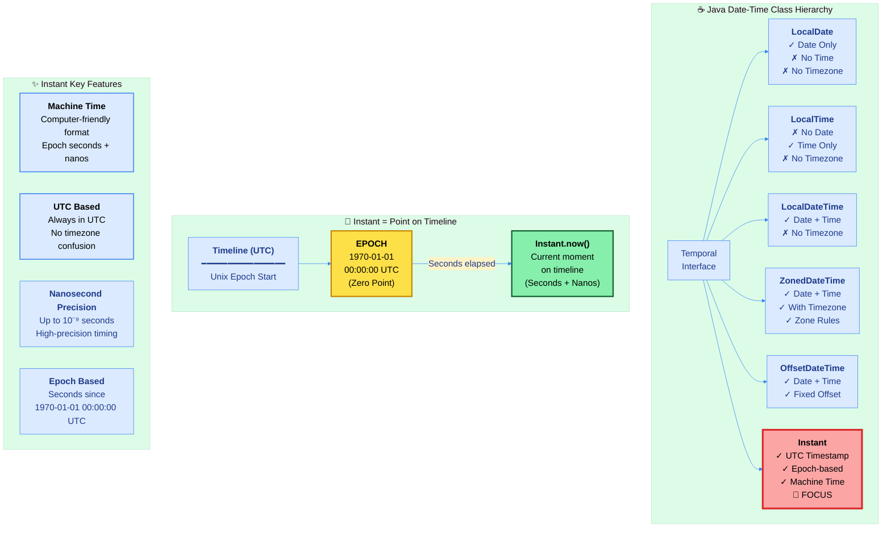
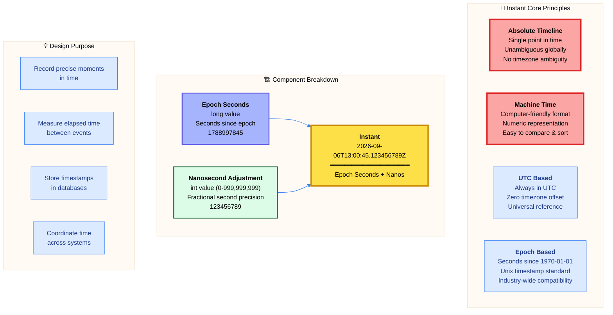
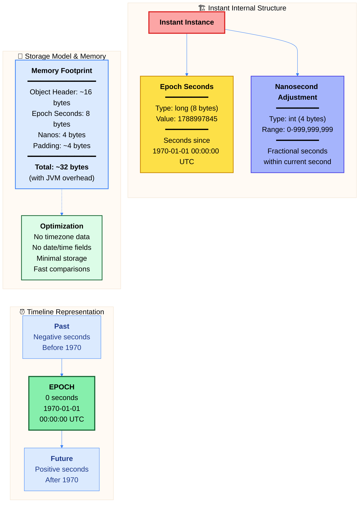
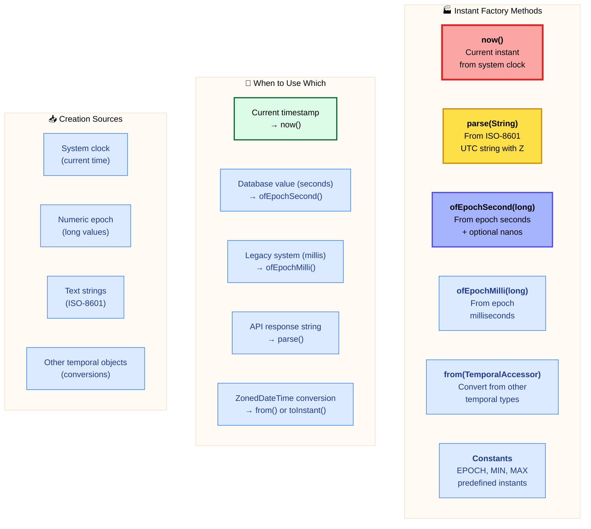

# ☕ Master Guide: Java Instant API - Machine Time & UTC Timestamps

<div align="center">


</div>

<hr style="border: 1px solid rgb(98, 117, 187)">

<div align="center">
<table>
<tr>
<td align="center">
<br />

<h3>© 2026 Avinash Dhanuka</h3>
<p>Master Guide: Java Core & Frameworks</p>
<p><em>Crafted with ❤️ for Object-Oriented Architecture</em></p>

<a href="https://github.com/Avinash-706" target="_blank">

</a>

<a href="https://mail.google.com/mail/?view=cm&fs=1&to=avunashdhanuka@gmail.com&su=Java%20Instant%20Query&body=☕%20Hello%20Avinash,%0D%0A%0D%0AMy%20name%20is%20[Your%20Name]%20and%20I%20have%20a%20doubt%20regarding%20Java%20Instant%20API.%0D%0A%0D%0A🔹%20Topic:%20[Instant/UTC%20Timestamps]%0D%0A🔹%20Question:%20[Type%20your%20question]%0D%0A%0D%0AThank%20you!" target="_blank">


</a>
<br />
<br />
</td>
</tr>
</table>
</div>

> **Author's Note:** This comprehensive guide explores Java 8's Instant API for machine-readable timestamps and UTC time representation. Master the concept of absolute time points on the timeline, understand epoch-based time measurement, and learn precision timing operations. Includes detailed theoretical knowledge on Unix epoch, nanosecond precision, instant arithmetic, and interoperability with timezone-aware date-time classes.

---

## ⏰ Java Instant Architecture



---

## 📑 Table of Contents
1. [Instant Overview - Machine Time & Absolute Timeline](#1-instant-overview---machine-time--absolute-timeline)
    - [Core Characteristics & Philosophy](#11-core-characteristics--philosophy)
    - [Why Instant Over Other Date-Time Classes](#12-why-instant-over-other-date-time-classes)
    - [Internal Architecture & Storage Model](#13-internal-architecture--storage-model)
2. [Unix Epoch & Timeline Fundamentals](#2-unix-epoch--timeline-fundamentals)
    - [The Unix Epoch Explained](#21-the-unix-epoch-explained)
    - [Epoch Seconds vs Epoch Milliseconds](#22-epoch-seconds-vs-epoch-milliseconds)
    - [Nanosecond Precision Storage](#23-nanosecond-precision-storage)
3. [Instant Creation & Factory Methods](#3-instant-creation--factory-methods)
    - [Factory Method Patterns](#31-factory-method-patterns)
    - [Creating from Epoch Values](#32-creating-from-epoch-values)
4. [Instant Arithmetic Operations](#4-instant-arithmetic-operations)
    - [Plus Operations - Future Instants](#41-plus-operations---future-instants)
    - [Minus Operations - Past Instants](#42-minus-operations---past-instants)
    - [Duration Between Instants](#43-duration-between-instants)
5. [Parsing & Formatting](#5-parsing--formatting)
    - [ISO-8601 UTC Format](#51-iso-8601-utc-format)
    - [The 'Z' Suffix Explained](#52-the-z-suffix-explained)
6. [Comparison & Validation](#6-comparison--validation)
    - [Temporal Ordering](#61-temporal-ordering)
    - [Equality & Range Checks](#62-equality--range-checks)
7. [Truncation Operations](#7-truncation-operations)
8. [Conversion & Interoperability](#8-conversion--interoperability)
    - [Instant to ZonedDateTime](#81-instant-to-zoneddatetime)
    - [ZonedDateTime to Instant](#82-zoneddatetime-to-instant)
    - [Legacy Date Conversion](#83-legacy-date-conversion)
9. [Performance & Best Practices](#9-performance--best-practices)
10. [Real-World Use Cases](#10-real-world-use-cases)

<div align="right">
<sub><em>Comprehensive notes by Avinash Dhanuka | For educational purposes</em></sub>
</div>

---

## 1. INSTANT OVERVIEW - Machine Time & Absolute Timeline

### 📌 Definition
**Instant** is an **immutable timestamp** representing a **single point on the timeline** in UTC (Coordinated Universal Time). It models **machine time** as the number of seconds (with nanosecond precision) since the **Unix epoch** (1970-01-01T00:00:00Z). This is the most precise and unambiguous temporal representation in Java, ideal for recording events, measuring durations, and coordinating across systems.

### 1.1 Core Characteristics & Philosophy



#### 📋 Characteristics Table

| Property | Value | Details |
| :--- | :--- | :--- |
| **Package** | `java.time` | Since Java 8 (JSR-310) |
| **Mutability** | ✅ Immutable | Every operation creates new instance |
| **Thread Safety** | ✅ Thread-Safe | No synchronization required |
| **Null Support** | ❌ No Null | Use Optional<Instant> instead |
| **Date Component** | ❌ No Date | Only epoch seconds + nanos |
| **Time Component** | ❌ No Time | Only epoch seconds + nanos |
| **Timezone** | ✅ Always UTC | Zero offset from UTC (Z) |
| **Format** | ISO-8601 UTC | yyyy-MM-ddTHH:mm:ss.SSSSSSSSSZ |
| **Precision** | Nanosecond | Up to 10⁻⁹ seconds (999,999,999 ns) |
| **Storage** | 12 bytes | 8 bytes (long) + 4 bytes (int) |
| **Range** | ~1 billion years | MIN to MAX constants |
| **Epoch** | 1970-01-01 00:00:00 UTC | Unix epoch standard |

---

### 1.2 Why Instant Over Other Date-Time Classes

#### 🔍 Comparison Matrix

| Feature | LocalDateTime | ZonedDateTime | Instant | Legacy Date |
| :--- | :--- | :--- | :--- | :--- |
| **Date** | ✅ Yes | ✅ Yes | ❌ No (derived) | ✅ Yes |
| **Time** | ✅ Yes | ✅ Yes | ❌ No (derived) | ✅ Yes |
| **Timezone** | ❌ No | ✅ Full Zone | ✅ UTC Always | ⚠️ System default |
| **Machine Readable** | ❌ No | ❌ No | ✅ Yes | ⚠️ Partially |
| **Epoch Based** | ❌ No | ❌ No | ✅ Yes | ✅ Yes (millis) |
| **Precision** | Nanosecond | Nanosecond | Nanosecond | Millisecond |
| **Immutability** | ✅ Yes | ✅ Yes | ✅ Yes | ❌ No (mutable) |
| **Storage Size** | ~32 bytes | ~48 bytes | ~12 bytes | ~24 bytes |
| **Use Case** | Local events | Global coordination | Timestamps, storage | Legacy code |
| **Format Example** | 2026-09-06T18:30:45 | 2026-09-06T18:30:45+05:30[Asia/Kolkata] | 2026-09-06T13:00:45Z | Sun Sep 06 18:30:45 IST 2026 |


#### ✅ When to Use Instant

1. **Database Timestamps**: Storing created_at, updated_at fields
2. **Event Logging**: Recording when events occurred
3. **Performance Measurement**: Measuring elapsed time between operations
4. **API Timestamps**: REST API response/request timestamps
5. **Message Queues**: Message creation timestamps
6. **Distributed Systems**: Coordinating time across multiple servers
7. **Audit Trails**: Recording user actions with precise timing
8. **File Metadata**: Last modified, created timestamps
9. **Cache Expiration**: Time-to-live (TTL) calculations
10. **Scheduling**: Job execution timestamps

#### ❌ When NOT to Use Instant

1. **User-Facing Dates**: Use LocalDate, LocalDateTime, or ZonedDateTime
2. **Calendar Operations**: Date arithmetic (use LocalDate)
3. **Time Zone Display**: Showing time in user's timezone (use ZonedDateTime)
4. **Date-Only Data**: Birthdays, holidays (use LocalDate)
5. **Time-Only Data**: Wall clock time (use LocalTime)
6. **Recurring Events**: Monthly/yearly schedules (use LocalDate/ZonedDateTime)

#### 🎯 Instant vs Other Types - Decision Guide

**Use Instant when:**
- Need machine-readable timestamp
- Storing in database
- Measuring performance/duration
- Working with multiple timezones (store as Instant)
- Need absolute point on timeline

**Use LocalDateTime when:**
- No timezone needed
- Local events/appointments
- Database TIMESTAMP without timezone

**Use ZonedDateTime when:**
- Need timezone information
- User-facing times
- Cross-timezone scheduling
- Calendar operations

**Use LocalDate when:**
- Date-only operations
- Birthdays, anniversaries
- No time component needed

---

### 1.3 Internal Architecture & Storage Model



#### 🔍 Internal Representation

Instant internally stores two primitive values:

1. **Epoch Seconds (long - 8 bytes)**: Signed 64-bit integer representing seconds since the Unix epoch
2. **Nanosecond Adjustment (int - 4 bytes)**: Unsigned 32-bit integer representing nanoseconds within the current second (0-999,999,999)

**Key Implementation Details:**

- **Final Fields**: Both `seconds` and `nanos` are `final`, ensuring immutability
- **Epoch Reference**: All calculations relative to 1970-01-01T00:00:00Z
- **Negative Seconds**: Instants before epoch have negative seconds
- **Nanosecond Range**: Always 0-999,999,999 (never negative)
- **Validation**: Constructor ensures nanoseconds are within valid range
- **No Timezone Data**: No timezone offset stored (always UTC)
- **Serialization**: Custom serialization format for efficiency

#### 🎨 Output Format

**Default toString() Format:**
```
2026-09-06T13:00:45.123456789Z
━━━━━━━━━━━━━━━━━━━━━━━━━━━━━━
│    Date     │   Time + Nanos  │Z│
━━━━━━━━━━━━━━━━━━━━━━━━━━━━━━
     ↑              ↑             ↑
  Derived      Derived from    UTC
  from epoch    epoch + nanos  indicator
```

**Components Breakdown:**
- `2026-09-06`: Date (derived from epoch seconds)
- `T`: ISO-8601 separator
- `13:00:45.123456789`: Time with nanoseconds (derived)
- `Z`: **Zulu time** (UTC indicator, zero offset)

**Important:** Date and time are **derived** from epoch seconds for display. Internally, Instant only stores seconds + nanos.

#### 📊 Range & Limits

| Constant | Value | Epoch Seconds | Description |
| :--- | :--- | :--- | :--- |
| **Instant.MIN** | -1000000000-01-01T00:00:00Z | -(31,557,014,167,219,200) | ~1 billion years before epoch |
| **Instant.EPOCH** | 1970-01-01T00:00:00Z | 0 | Unix epoch start |
| **Instant.MAX** | +1000000000-12-31T23:59:59.999999999Z | 31,556,889,864,403,199 | ~1 billion years after epoch |

**Practical Range:**
- Before Epoch: Supports dates back to ~1 billion years BC
- After Epoch: Supports dates up to ~1 billion years AD
- Far exceeds any practical application needs

---

## 2. UNIX EPOCH & TIMELINE FUNDAMENTALS

### 📌 Overview
Understanding the Unix epoch is fundamental to working with Instant. The epoch is the zero point on the timeline from which all instants are measured.

### 2.1 The Unix Epoch Explained

#### 📚 Definition

**Unix Epoch** = **January 1, 1970, 00:00:00 UTC (Coordinated Universal Time)**

This moment was chosen as the **arbitrary zero point** for Unix time measurement. It's a historical decision that became an industry standard.

#### 🌍 Why 1970-01-01?

**Historical Context:**
- **Unix Operating System**: Development began in late 1960s at Bell Labs
- **32-bit Time**: Original Unix used 32-bit signed integer for seconds
- **Arbitrary Choice**: 1970 was a round number close to Unix development
- **No Special Significance**: Not based on any astronomical or historical event
- **Industry Adoption**: Became standard across computing systems

**Technical Reasons:**
- **32-bit Signed Integer Range**: -2,147,483,648 to 2,147,483,647 seconds
- **Usable Range**: ~1902 to ~2038 (the "Year 2038 problem")
- **Java's 64-bit Solution**: Uses long (64-bit), extending range to billions of years

#### 📊 Epoch Timeline Visualization

```
Timeline (UTC):
━━━━━━━━━━━━━━━━━━━━━━━━━━━━━━━━━━━━━━━━━━━━━━━━━━
         ↓ EPOCH (Zero Point)
... ────[1970-01-01 00:00:00 UTC]──── ...
         │
   Negative seconds          Positive seconds
   (Before epoch)            (After epoch)
         │                         │
    1969-12-31              2026-09-06
    (−86400 seconds)       (+1788997845 seconds)
```

#### 🎯 Epoch Concepts

**Zero Point:**
- Epoch second = 0
- All instants measured relative to this point
- Instants before: negative seconds
- Instants after: positive seconds

**UTC Context:**
- Epoch is in UTC, not local time
- No timezone offset at epoch
- Universal reference point globally
- Same instant for all timezones


---

### 2.2 Epoch Seconds vs Epoch Milliseconds

#### 📋 Comparison Table

| Aspect | Epoch Seconds | Epoch Milliseconds |
| :--- | :--- | :--- |
| **Unit** | Seconds | Milliseconds |
| **Precision** | 1 second | 0.001 second (1 ms) |
| **Type in Java** | long | long |
| **Method** | `getEpochSecond()` | `toEpochMilli()` |
| **Range** | ±292 billion years | ±292 million years |
| **Example** | 1788997845 | 1788997845000 |
| **Use Case** | Standard representation | Legacy compatibility |
| **Database** | BIGINT, TIMESTAMP | BIGINT (legacy) |
| **Instant Storage** | ✅ Primary storage | ❌ Derived from seconds |

#### 🔍 Detailed Explanation

**Epoch Seconds:**
- **Definition**: Number of seconds elapsed since 1970-01-01T00:00:00Z
- **Java Type**: `long` (64-bit signed integer)
- **Instant Storage**: Primary internal representation
- **Precision**: Whole seconds (fractional part stored separately as nanos)
- **Example**: `1788997845` = 2026-09-06 13:00:45 UTC

**Epoch Milliseconds:**
- **Definition**: Number of milliseconds elapsed since epoch
- **Java Type**: `long` (64-bit signed integer)
- **Legacy Compatibility**: Compatible with `System.currentTimeMillis()`
- **Precision**: Millisecond (1/1000 second)
- **Example**: `1788997845000` = same instant with millisecond precision
- **Note**: Loses nanosecond precision beyond milliseconds

#### 📊 Conversion Examples

| Instant | Epoch Seconds | Epoch Millis | Nanoseconds |
| :--- | :--- | :--- | :--- |
| 1970-01-01T00:00:00Z | 0 | 0 | 0 |
| 1970-01-01T00:00:01Z | 1 | 1000 | 0 |
| 2026-09-06T13:00:45Z | 1788997845 | 1788997845000 | 0 |
| 2026-09-06T13:00:45.123Z | 1788997845 | 1788997845123 | 123000000 |
| 2026-09-06T13:00:45.123456789Z | 1788997845 | 1788997845123 | 123456789 |

#### 🎯 When to Use Each

**Use Epoch Seconds When:**
- Working with Instant API (primary representation)
- Database storage (most efficient)
- Network protocols (standard format)
- Second precision sufficient

**Use Epoch Milliseconds When:**
- Legacy code compatibility
- Interoperating with `System.currentTimeMillis()`
- Millisecond precision required
- Converting from/to `java.util.Date`

#### ⚠️ Precision Loss Warning

**Converting to Milliseconds:**
```
Original:  2026-09-06T13:00:45.123456789Z
          (1788997845 seconds + 123456789 nanos)

To Millis: 1788997845123 milliseconds
          (loses microsecond/nanosecond precision)

Result:    2026-09-06T13:00:45.123Z
          (123456789 nanos → 123000000 nanos)
          
Lost:      456789 nanoseconds (microsecond precision)
```

**Key Point**: Instant maintains nanosecond precision internally, but converting to milliseconds truncates sub-millisecond precision.

---

### 2.3 Nanosecond Precision Storage

#### 📌 Why Nanoseconds?

**Precision Requirements:**
- **Financial Transactions**: High-frequency trading requires sub-millisecond precision
- **Scientific Computing**: Precise time measurement for experiments
- **Performance Monitoring**: Accurate profiling and benchmarking
- **Network Protocols**: Precise packet timestamps
- **Database Operations**: Fine-grained concurrency control

#### 🔍 Nanosecond Storage Model

**Two-Part Storage:**

| Component | Type | Size | Range | Purpose |
| :--- | :--- | :--- | :--- | :--- |
| **Epoch Seconds** | long | 8 bytes | ±292 billion years | Whole seconds since epoch |
| **Nano Adjustment** | int | 4 bytes | 0 - 999,999,999 | Fractional second (within current second) |

**Why Two Parts?**
1. **Memory Efficiency**: Storing nanoseconds since epoch would require larger data type
2. **Precision**: Maintains nanosecond precision without overflow
3. **Range**: Balances precision with practical time range
4. **Standards**: Aligns with ISO-8601 and Unix time conventions

#### 📊 Nanosecond Breakdown

**Time Units:**
```
1 second    = 1,000 milliseconds
1 second    = 1,000,000 microseconds
1 second    = 1,000,000,000 nanoseconds

Nanosecond range in Instant: 0 to 999,999,999
```

**Precision Levels:**

| Unit | Value in Seconds | Example in Nanos |
| :--- | :--- | :--- |
| **Second** | 1.0 | 0 |
| **Millisecond** | 0.001 | 1,000,000 |
| **Microsecond** | 0.000001 | 1,000 |
| **Nanosecond** | 0.000000001 | 1 |

#### 🎯 Practical Examples

**Example 1: High Precision Timestamp**
```
Instant: 2026-09-06T13:00:45.123456789Z

Breakdown:
- Epoch Seconds: 1788997845
- Nanoseconds: 123,456,789

Precision levels:
- Seconds:      .000000000
- Milliseconds: .123000000 (123 ms)
- Microseconds: .123456000 (123,456 μs)
- Nanoseconds:  .123456789 (123,456,789 ns)
```

**Example 2: Duration Measurement**
```
Start: 1788997845.000000000 (epoch seconds + nanos)
End:   1788997845.123456789

Duration:
- Seconds: 0
- Nanoseconds: 123,456,789
- Human readable: 123.456789 milliseconds
```

#### ⚠️ Important Considerations

**System Clock Precision:**
- Java's `Instant.now()` depends on system clock precision
- Most systems: millisecond or microsecond precision
- Full nanosecond precision: requires specialized hardware
- **Check**: `System.currentTimeMillis()` vs `System.nanoTime()`

**Comparison Precision:**
- Instant comparison uses full nanosecond precision
- Two instants differ if even 1 nanosecond apart
- Critical for ordering events in high-frequency systems

**Storage Considerations:**
- Databases: Most support millisecond, some microsecond
- Network: Often millisecond precision
- Logs: Typically millisecond precision sufficient
- **Recommendation**: Use appropriate precision for use case

---

## 3. INSTANT CREATION & Factory Methods

### 📌 Overview
Instant provides multiple factory methods for creating instances from current time, epoch values, parsing strings, or converting from other temporal types.

### 3.1 Factory Method Patterns



#### 📋 Factory Methods Reference

| Method | Signature | Use Case | Example |
| :--- | :--- | :--- | :--- |
| **now()** | `static Instant now()` | Current instant | `Instant.now()` |
| **now(Clock)** | `static Instant now(Clock clock)` | Custom clock source | `Instant.now(Clock.systemUTC())` |
| **ofEpochSecond(long)** | `static Instant ofEpochSecond(long epochSecond)` | From epoch seconds | `Instant.ofEpochSecond(1788997845)` |
| **ofEpochSecond(long, long)** | `static Instant ofEpochSecond(long epochSecond, long nanoAdjustment)` | Seconds + nano adjustment | `Instant.ofEpochSecond(1788997845, 123456789)` |
| **ofEpochMilli(long)** | `static Instant ofEpochMilli(long epochMilli)` | From epoch milliseconds | `Instant.ofEpochMilli(1788997845000L)` |
| **parse(String)** | `static Instant parse(CharSequence text)` | From ISO-8601 UTC string | `Instant.parse("2026-09-06T13:00:45Z")` |
| **from(TemporalAccessor)** | `static Instant from(TemporalAccessor temporal)` | Convert temporal object | `Instant.from(zonedDateTime)` |
| **EPOCH** | `static final Instant EPOCH` | Unix epoch constant | `Instant.EPOCH` |
| **MIN** | `static final Instant MIN` | Minimum instant | `Instant.MIN` |
| **MAX** | `static final Instant MAX` | Maximum instant | `Instant.MAX` |


#### 🎯 Creation Strategy Guidelines

**1. Current Time:**
- System clock: `Instant.now()`
- Custom clock: `Instant.now(Clock.systemUTC())`
- Testing: `Instant.now(Clock.fixed(instant, zone))`

**2. From Database:**
- Epoch seconds: `Instant.ofEpochSecond(dbValue)`
- Epoch milliseconds: `Instant.ofEpochMilli(dbValue)`
- With nanos: `Instant.ofEpochSecond(seconds, nanos)`

**3. From API/String:**
- ISO-8601 UTC: `Instant.parse("2026-09-06T13:00:45Z")`
- Must have 'Z' suffix (UTC indicator)

**4. From Other Types:**
- ZonedDateTime: `zonedDateTime.toInstant()`
- OffsetDateTime: `offsetDateTime.toInstant()`
- LocalDateTime: Cannot convert directly (no timezone)

**5. Constants:**
- Unix epoch: `Instant.EPOCH`
- Minimum: `Instant.MIN`
- Maximum: `Instant.MAX`

---

### 3.2 Creating from Epoch Values

#### 📋 Epoch Creation Methods

**Method 1: ofEpochSecond(long seconds)**
```
Purpose: Create Instant from epoch seconds only
Precision: Second-level
Nanoseconds: Set to 0

Example:
Instant.ofEpochSecond(1788997845)
→ 2026-09-06T13:00:45Z
```

**Method 2: ofEpochSecond(long seconds, long nanoAdjustment)**
```
Purpose: Create Instant with nanosecond precision
Precision: Nanosecond-level
Nanoseconds: Specified explicitly

Example:
Instant.ofEpochSecond(1788997845, 123456789)
→ 2026-09-06T13:00:45.123456789Z
```

**Method 3: ofEpochMilli(long milliseconds)**
```
Purpose: Create from milliseconds (legacy compatibility)
Precision: Millisecond-level
Nanoseconds: Calculated from milliseconds

Example:
Instant.ofEpochMilli(1788997845123L)
→ 2026-09-06T13:00:45.123Z
```

#### 🔍 Nano Adjustment Behavior

**Understanding Nano Adjustment:**

The second parameter in `ofEpochSecond(seconds, nanoAdjustment)` is an **adjustment** that can:
- Be positive or negative
- Exceed 999,999,999 (will adjust seconds accordingly)
- Span multiple seconds

**Examples:**

| Seconds | Nano Adjustment | Resulting Instant |
| :--- | :--- | :--- |
| 100 | 0 | Epoch + 100s |
| 100 | 500,000,000 | Epoch + 100.5s |
| 100 | 999,999,999 | Epoch + 100.999999999s |
| 100 | 1,000,000,000 | Epoch + 101s (overflow to next second) |
| 100 | 2,500,000,000 | Epoch + 102.5s (2s + 500ms overflow) |
| 100 | -500,000,000 | Epoch + 99.5s (underflow to previous second) |

**Overflow/Underflow Handling:**
- Java automatically adjusts seconds when nanos exceed range
- Positive overflow: Adds to seconds
- Negative underflow: Subtracts from seconds
- Result always has nanos in valid range (0-999,999,999)

#### 📊 Epoch Conversion Table

**Common Epoch Values:**

| Date-Time (UTC) | Epoch Seconds | Epoch Milliseconds |
| :--- | :--- | :--- |
| 1970-01-01 00:00:00 | 0 | 0 |
| 2000-01-01 00:00:00 | 946,684,800 | 946,684,800,000 |
| 2020-01-01 00:00:00 | 1,577,836,800 | 1,577,836,800,000 |
| 2026-09-06 13:00:45 | 1,788,997,845 | 1,788,997,845,000 |

#### ⚠️ Common Pitfalls

**Pitfall 1: Milliseconds vs Seconds**
```
❌ WRONG: Instant.ofEpochSecond(1788997845000L)  // Way in future!
✅ RIGHT: Instant.ofEpochMilli(1788997845000L)   // Correct method

The first creates an instant ~56,000 years in the future!
```

**Pitfall 2: Nanosecond Range**
```
❌ WRONG: Assuming nanos can only be 0-999,999,999
✅ RIGHT: Nano adjustment can be any long (auto-adjusts seconds)

Example: ofEpochSecond(100, 5_000_000_000L)
→ Creates instant at 100 + 5 = 105 seconds + 0 nanos
```

**Pitfall 3: Precision Loss**
```
From: ZonedDateTime with full nanosecond precision
To: Epoch milliseconds (loses sub-millisecond precision)

Original: 1788997845.123456789 seconds
toEpochMilli(): 1788997845123 ms (loses 456789 nanos)
```

---

## 4. INSTANT ARITHMETIC OPERATIONS

### 📌 Overview
Instant provides **time-based arithmetic operations** for computing future or past instants and measuring durations between instants. All operations maintain immutability.

### 4.1 Plus Operations - Future Instants

#### 📋 Plus Methods Reference

| Method | Unit | Precision | Example |
| :--- | :--- | :--- | :--- |
| **plusSeconds(long)** | Seconds | Second | `instant.plusSeconds(60)` |
| **plusMillis(long)** | Milliseconds | Millisecond | `instant.plusMillis(1000)` |
| **plusNanos(long)** | Nanoseconds | Nanosecond | `instant.plusNanos(1_000_000_000)` |
| **plus(long, TemporalUnit)** | Any time unit | Variable | `instant.plus(2, ChronoUnit.HOURS)` |
| **plus(TemporalAmount)** | Duration | Variable | `instant.plus(Duration.ofMinutes(30))` |

#### 🎯 Time-Based Operations Only

**Important:** Instant only supports **time-based units**, not **date-based units**.

**Supported Time Units:**
- ✅ Nanoseconds (`NANOS`)
- ✅ Microseconds (`MICROS`)
- ✅ Milliseconds (`MILLIS`)
- ✅ Seconds (`SECONDS`)
- ✅ Minutes (`MINUTES`)
- ✅ Hours (`HOURS`)
- ✅ Half-Days (`HALF_DAYS`)
- ✅ Days (`DAYS`)

**NOT Supported Date Units:**
- ❌ Weeks (`WEEKS`)
- ❌ Months (`MONTHS`)
- ❌ Years (`YEARS`)
- ❌ Decades, Centuries, etc.

**Why?**
- Months/years have variable lengths (28-31 days, 365-366 days)
- Instant represents absolute time, not calendar dates
- For date-based arithmetic, convert to ZonedDateTime first

#### 📊 Plus Operations Examples

| Operation | Input | Result |
| :--- | :--- | :--- |
| **plusSeconds(60)** | 2026-09-06T13:00:45Z | 2026-09-06T13:01:45Z |
| **plusMillis(1000)** | 2026-09-06T13:00:45Z | 2026-09-06T13:00:46Z |
| **plusNanos(1_000_000_000)** | 2026-09-06T13:00:45Z | 2026-09-06T13:00:46Z |
| **plus(2, HOURS)** | 2026-09-06T13:00:45Z | 2026-09-06T15:00:45Z |
| **plus(Duration.ofMinutes(30))** | 2026-09-06T13:00:45Z | 2026-09-06T13:30:45Z |

#### 🔗 Method Chaining

Plus operations return new Instant, enabling chaining:

```
Base: 2026-09-06T13:00:45Z

Chained:
instant.plusSeconds(60)
       .plusMillis(500)
       .plus(2, ChronoUnit.HOURS)

Result: 2026-09-06T15:01:45.500Z
```

---

### 4.2 Minus Operations - Past Instants

#### 📋 Minus Methods Reference

| Method | Unit | Precision | Example |
| :--- | :--- | :--- | :--- |
| **minusSeconds(long)** | Seconds | Second | `instant.minusSeconds(60)` |
| **minusMillis(long)** | Milliseconds | Millisecond | `instant.minusMillis(1000)` |
| **minusNanos(long)** | Nanoseconds | Nanosecond | `instant.minusNanos(1_000_000_000)` |
| **minus(long, TemporalUnit)** | Any time unit | Variable | `instant.minus(2, ChronoUnit.HOURS)` |
| **minus(TemporalAmount)** | Duration | Variable | `instant.minus(Duration.ofMinutes(30))` |

#### 📊 Minus Operations Examples

| Operation | Input | Result |
| :--- | :--- | :--- |
| **minusSeconds(60)** | 2026-09-06T13:00:45Z | 2026-09-06T12:59:45Z |
| **minusMillis(1000)** | 2026-09-06T13:00:45Z | 2026-09-06T13:00:44Z |
| **minusNanos(1_000_000_000)** | 2026-09-06T13:00:45Z | 2026-09-06T13:00:44Z |
| **minus(2, HOURS)** | 2026-09-06T13:00:45Z | 2026-09-06T11:00:45Z |
| **minus(Duration.ofDays(1))** | 2026-09-06T13:00:45Z | 2026-09-05T13:00:45Z |

#### ⚠️ Same Limitations Apply

Minus operations have the same time-based unit restriction as plus operations. Cannot use months/years directly.

---

### 4.3 Duration Between Instants

#### 📌 Measuring Time Intervals

**Duration** represents the time-based amount between two Instants.

#### 📋 Duration Calculation Methods

| Method | Class | Description | Example |
| :--- | :--- | :--- | :--- |
| **Duration.between()** | Duration | Create duration between two instants | `Duration.between(start, end)` |
| **ChronoUnit.between()** | ChronoUnit | Get amount in specific unit | `ChronoUnit.SECONDS.between(start, end)` |
| **instant.until()** | Instant | Time until another instant | `start.until(end, ChronoUnit.HOURS)` |

#### 🔍 Duration Examples

**Example 1: Duration Object**
```
Start: 2026-09-06T13:00:00Z
End:   2026-09-06T15:30:45Z

Duration duration = Duration.between(start, end);

Methods:
- duration.getSeconds()  → 9045 seconds
- duration.toMinutes()   → 150 minutes
- duration.toHours()     → 2 hours
- duration.toMillis()    → 9045000 milliseconds
```

**Example 2: Direct Unit Calculation**
```
long seconds = ChronoUnit.SECONDS.between(start, end);
long minutes = ChronoUnit.MINUTES.between(start, end);
long hours = ChronoUnit.HOURS.between(start, end);
long days = ChronoUnit.DAYS.between(start, end);
```

#### 📊 Duration Conversion Table

| Start | End | Duration | Seconds | Minutes | Hours | Days |
| :--- | :--- | :--- | :--- | :--- | :--- | :--- |
| T13:00:00Z | T13:00:01Z | 1s | 1 | 0 | 0 | 0 |
| T13:00:00Z | T13:01:00Z | 1m | 60 | 1 | 0 | 0 |
| T13:00:00Z | T14:00:00Z | 1h | 3600 | 60 | 1 | 0 |
| T00:00:00Z | T00:00:00Z(+1d) | 1d | 86400 | 1440 | 24 | 1 |

#### 🎯 Performance Measurement Pattern

**Common Use Case: Timing Operations**

```
Workflow:
1. Record start instant: Instant.now()
2. Perform operation
3. Record end instant: Instant.now()
4. Calculate duration: Duration.between(start, end)
5. Extract elapsed time in desired unit

Precision: Nanosecond-level (system clock dependent)
```

**Important:** For high-precision performance measurement within a single JVM, consider `System.nanoTime()` instead, as it's not affected by system clock adjustments.


---

## 5. PARSING & FORMATTING

### 📌 Overview
Instant parsing and formatting strictly follows ISO-8601 standard with UTC timezone (Z suffix). Unlike LocalDateTime or ZonedDateTime, Instant has limited formatting options as it represents absolute time, not human-readable date-time.

### 5.1 ISO-8601 UTC Format

#### 📋 ISO-8601 Instant Format Structure

**Complete Format:**
```
2026-09-06T13:00:45.123456789Z
━━━━━━━━━━━━━━━━━━━━━━━━━━━━━━
│   Date    │    Time + Nanos    │Z│
━━━━━━━━━━━━━━━━━━━━━━━━━━━━━━
     ↑              ↑             ↑
  Required      Required    Required
  yyyy-MM-dd    HH:mm:ss    UTC indicator
```

**Format Components:**

| Component | Pattern | Description | Example |
| :--- | :--- | :--- | :--- |
| **Date** | yyyy-MM-dd | ISO date format | 2026-09-06 |
| **Separator** | T | Date-time separator | T |
| **Time** | HH:mm:ss | 24-hour time | 13:00:45 |
| **Fractional Seconds** | .S+ | Optional nanoseconds (1-9 digits) | .123456789 |
| **UTC Indicator** | Z | **Required** - indicates UTC | Z |

#### 🎯 Valid Format Variations

**All these parse successfully:**

| Format | Example | Nanoseconds |
| :--- | :--- | :--- |
| **Full with nanos** | 2026-09-06T13:00:45.123456789Z | 123,456,789 |
| **With milliseconds** | 2026-09-06T13:00:45.123Z | 123,000,000 |
| **With microseconds** | 2026-09-06T13:00:45.123456Z | 123,456,000 |
| **Without fractional** | 2026-09-06T13:00:45Z | 0 |
| **Minimum format** | 2026-09-06T13:00:45Z | 0 |

#### ⚠️ Parsing Requirements

**Must Have:**
- ✅ Date in yyyy-MM-dd format
- ✅ 'T' separator between date and time
- ✅ Time in HH:mm:ss format
- ✅ **'Z' suffix** (UTC indicator) - **MANDATORY**

**Cannot Have:**
- ❌ Timezone offset other than Z (e.g., +05:30)
- ❌ Timezone name (e.g., [Asia/Kolkata])
- ❌ Local time without Z suffix
- ❌ Non-UTC timezone indicators

#### 📊 Parsing Examples

| Input String | Parse Result | Valid? |
| :--- | :--- | :--- |
| "2026-09-06T13:00:45Z" | ✅ Success | ✅ Yes |
| "2026-09-06T13:00:45.123Z" | ✅ Success | ✅ Yes |
| "2026-09-06T13:00:45.123456789Z" | ✅ Success | ✅ Yes |
| "2026-09-06T13:00:45" | ❌ DateTimeParseException | ❌ Missing Z |
| "2026-09-06T13:00:45+05:30" | ❌ DateTimeParseException | ❌ Not UTC |
| "2026-09-06T13:00:45.123+00:00" | ❌ DateTimeParseException | ❌ Use Z not +00:00 |

---

### 5.2 The 'Z' Suffix Explained

#### 📌 What is 'Z'?

**'Z' = Zulu Time = UTC = Zero Offset**

**Historical Origin:**
- **Military/Aviation**: NATO phonetic alphabet uses 'Zulu' for letter 'Z'
- **Timezone Designation**: Zulu time = GMT/UTC (no offset)
- **International Standard**: Universally recognized as UTC indicator
- **ISO-8601**: Standard suffix for UTC times

#### 🌍 Understanding UTC (Coordinated Universal Time)

**UTC Characteristics:**
- **Zero Offset**: No timezone adjustment (±00:00)
- **Reference Point**: All timezones measured relative to UTC
- **Atomic Time**: Based on atomic clocks, not Earth's rotation
- **Global Standard**: International time coordination standard
- **Not Timezone**: UTC is the reference, not a timezone

#### 📊 Z Equivalents

All these represent the **same concept** (UTC/zero offset):

| Notation | Meaning | Used By |
| :--- | :--- | :--- |
| **Z** | Zulu time | ISO-8601, Instant |
| **+00:00** | Zero offset | OffsetDateTime |
| **UTC** | Coordinated Universal Time | General reference |
| **GMT** | Greenwich Mean Time | Historical (roughly same as UTC) |

#### 🎯 Why Instant Requires 'Z'

**Design Philosophy:**

1. **Unambiguous**: Instant always represents UTC, 'Z' makes this explicit
2. **Machine Time**: No human timezone interpretation needed
3. **Standardization**: ISO-8601 compliance for interoperability
4. **Clarity**: Reader immediately knows it's UTC, not local time
5. **Parsing**: Simple, deterministic parsing without timezone resolution

#### ⚠️ Common Mistakes

**Mistake 1: Omitting Z**
```
❌ WRONG: Instant.parse("2026-09-06T13:00:45")
          → DateTimeParseException: Text '...' could not be parsed

✅ RIGHT: Instant.parse("2026-09-06T13:00:45Z")
```

**Mistake 2: Using Offset Instead of Z**
```
❌ WRONG: Instant.parse("2026-09-06T13:00:45+00:00")
          → DateTimeParseException

✅ RIGHT: Instant.parse("2026-09-06T13:00:45Z")
```

**Mistake 3: Including Timezone**
```
❌ WRONG: Instant.parse("2026-09-06T13:00:45Z[UTC]")
          → DateTimeParseException

✅ RIGHT: Instant.parse("2026-09-06T13:00:45Z")
```

#### 🔄 Converting Non-UTC to Instant

**Problem:** You have a timestamp with timezone, need Instant

**Solution:** Parse as ZonedDateTime or OffsetDateTime first, then convert

```
Input: "2026-09-06T18:30:45+05:30[Asia/Kolkata]"

Step 1: Parse as ZonedDateTime
  ZonedDateTime zdt = ZonedDateTime.parse(input);

Step 2: Convert to Instant
  Instant instant = zdt.toInstant();

Result: 2026-09-06T13:00:45Z (converted to UTC)
```

#### 📊 Formatting Instant

**Default toString() Output:**
```
Instant instant = Instant.now();
String output = instant.toString();

Output format: yyyy-MM-ddTHH:mm:ss.SSSSSSSSSZ
Example: 2026-09-06T13:00:45.123456789Z
```

**Characteristics:**
- Always includes date, time, and 'Z'
- Includes fractional seconds if non-zero
- Trailing zeros in fractional seconds are removed
- No timezone name (only Z indicator)
- ISO-8601 compliant

**Custom Formatting:**

Instant doesn't support DateTimeFormatter directly. To format differently:

```
Step 1: Convert to ZonedDateTime with desired zone
  ZonedDateTime zdt = instant.atZone(ZoneId.of("Asia/Kolkata"));

Step 2: Format using DateTimeFormatter
  String formatted = zdt.format(DateTimeFormatter.ofPattern("dd/MM/yyyy HH:mm:ss"));

Result: 06/09/2026 18:30:45 (in India timezone)
```

---

## 6. COMPARISON & VALIDATION

### 📌 Overview
Instant comparison is straightforward since all instants are in UTC. Comparison is based purely on the absolute point on the timeline, making it unambiguous and timezone-independent.

### 6.1 Temporal Ordering

#### 📋 Comparison Methods Reference

| Method | Return | Description | Example Usage |
| :--- | :--- | :--- | :--- |
| **isBefore(Instant)** | boolean | True if this instant is before other | `instant1.isBefore(instant2)` |
| **isAfter(Instant)** | boolean | True if this instant is after other | `instant1.isAfter(instant2)` |
| **compareTo(Instant)** | int | -1 (before), 0 (equal), 1 (after) | `instant1.compareTo(instant2)` |
| **equals(Object)** | boolean | True if same instant | `instant1.equals(instant2)` |

#### 🔍 Comparison Logic

**Comparison Order:**
1. **Epoch Seconds First**: Compare the long values
2. **Nanoseconds Second**: If seconds equal, compare nanos

**Example:**
```
Instant A: 1788997845 seconds + 123456789 nanos
Instant B: 1788997845 seconds + 123456790 nanos

Comparison:
- Seconds equal: 1788997845 == 1788997845
- Compare nanos: 123456789 < 123456790
- Result: A is before B (by 1 nanosecond)
```

#### 📊 Comparison Examples

| Instant 1 | Instant 2 | isBefore | isAfter | equals | compareTo |
| :--- | :--- | :--- | :--- | :--- | :--- |
| T13:00:00Z | T13:00:01Z | true | false | false | -1 |
| T13:00:01Z | T13:00:00Z | false | true | false | 1 |
| T13:00:00.000Z | T13:00:00.000Z | false | false | true | 0 |
| T13:00:00.000Z | T13:00:00.001Z | true | false | false | -1 |
| T13:00:00.123456789Z | T13:00:00.123456789Z | false | false | true | 0 |

#### 🎯 Nanosecond Precision Comparison

**Important:** Comparison considers **full nanosecond precision**.

```
Instant A: 2026-09-06T13:00:45.123456789Z
Instant B: 2026-09-06T13:00:45.123456790Z

Difference: 1 nanosecond

Result: A.isBefore(B) → true
        A.isAfter(B) → false
        A.equals(B) → false
```

Even a single nanosecond difference makes instants unequal.

---

### 6.2 Equality & Range Checks

#### 📋 Equality Semantics

**equals() Method:**
- Compares epoch seconds **and** nanoseconds
- Must be exactly equal (same instant)
- Type-safe: returns false for non-Instant objects
- Symmetric and transitive

**Equality Examples:**

| Instant 1 | Instant 2 | equals() | Reason |
| :--- | :--- | :--- | :--- |
| T13:00:45.123Z | T13:00:45.123Z | true | Exact match |
| T13:00:45.123Z | T13:00:45.124Z | false | 1 ms difference |
| T13:00:45.123456789Z | T13:00:45.123456789Z | true | Exact nano match |
| T13:00:45.000Z | T13:00:45Z | true | Both have 0 nanos |

#### 🔍 Range Validation

**Common Pattern: Check if instant within range**

```
Scenario: Validate if instant is within business hours (9 AM - 5 PM UTC)

Start: 2026-09-06T09:00:00Z
End:   2026-09-06T17:00:00Z
Check: 2026-09-06T13:00:45Z

Validation:
- check.isAfter(start) || check.equals(start)  → true
- check.isBefore(end)                          → true
- Result: Within range ✅
```

**Range Check Methods:**

| Method | Description | Example |
| :--- | :--- | :--- |
| **isAfter(start) && isBefore(end)** | Exclusive range (start < x < end) | `instant.isAfter(start) && instant.isBefore(end)` |
| **(isAfter(start) \|\| equals(start)) && isBefore(end)** | Inclusive start, exclusive end [start, end) | Common pattern |
| **!isBefore(start) && isBefore(end)** | Inclusive start [start, end) | Shorter syntax |

#### 📊 Special Instant Constants

**Constants for Validation:**

| Constant | Value | Use Case |
| :--- | :--- | :--- |
| **Instant.EPOCH** | 1970-01-01T00:00:00Z | Zero point reference |
| **Instant.MIN** | ~1 billion years BC | Minimum possible instant |
| **Instant.MAX** | ~1 billion years AD | Maximum possible instant |

**Validation Examples:**

```
Check if instant is after epoch:
  instant.isAfter(Instant.EPOCH)

Check if instant is valid (not null and reasonable):
  instant != null && 
  instant.isAfter(Instant.EPOCH) && 
  instant.isBefore(Instant.now().plusSeconds(86400))

Check if in past:
  instant.isBefore(Instant.now())

Check if in future:
  instant.isAfter(Instant.now())
```

#### ⚠️ Comparison Pitfalls

**Pitfall 1: Floating-Point Comparison**
```
❌ WRONG: Converting to double and comparing
  double d1 = instant1.toEpochMilli() / 1000.0;
  double d2 = instant2.toEpochMilli() / 1000.0;
  if (d1 == d2) // Floating-point precision issues!

✅ RIGHT: Use direct instant comparison
  if (instant1.equals(instant2))
```

**Pitfall 2: String Comparison**
```
❌ WRONG: Comparing toString() output
  if (instant1.toString().equals(instant2.toString()))

✅ RIGHT: Use equals() method
  if (instant1.equals(instant2))
```

**Pitfall 3: Millisecond Precision Assumption**
```
❌ WRONG: Assuming millisecond precision is enough
  long millis1 = instant1.toEpochMilli();
  long millis2 = instant2.toEpochMilli();
  if (millis1 == millis2) // Loses nanosecond precision!

✅ RIGHT: Use instant comparison directly
  if (instant1.equals(instant2))
```


---

## 7. TRUNCATION OPERATIONS

### 📌 Overview
Truncation removes precision below a specified time unit, useful for rounding timestamps, database compatibility, and comparison at specific precision levels.

### 7.1 Truncation Method

#### 📋 Method Signature

```
Instant truncatedTo(TemporalUnit unit)
```

**Behavior:**
- Removes all precision below the specified unit
- Returns new Instant (immutable)
- Smaller fields set to their minimum value (0)
- Only supports time-based units

#### 📊 Supported Truncation Units

| Unit | Effect | Example Input | Example Output |
| :--- | :--- | :--- | :--- |
| **NANOS** | No truncation | 13:00:45.123456789Z | 13:00:45.123456789Z |
| **MICROS** | Remove nanos below micros | 13:00:45.123456789Z | 13:00:45.123456000Z |
| **MILLIS** | Remove nanos below millis | 13:00:45.123456789Z | 13:00:45.123000000Z |
| **SECONDS** | Remove all nanoseconds | 13:00:45.123456789Z | 13:00:45Z |
| **MINUTES** | Set seconds and nanos to 0 | 13:45:30.123Z | 13:45:00Z |
| **HOURS** | Set minutes, seconds, nanos to 0 | 13:45:30Z | 13:00:00Z |
| **HALF_DAYS** | Set to nearest 12-hour boundary | 13:45:30Z | 12:00:00Z |
| **DAYS** | Set to midnight UTC | 2026-09-06T13:45:30Z | 2026-09-06T00:00:00Z |

#### 🔍 Detailed Truncation Examples

**Original Instant:**
```
2026-09-06T13:45:30.123456789Z
```

**Truncation Results:**

```
truncatedTo(ChronoUnit.DAYS)
→ 2026-09-06T00:00:00Z
(Set to start of day in UTC)

truncatedTo(ChronoUnit.HOURS)
→ 2026-09-06T13:00:00Z
(Remove minutes, seconds, nanos)

truncatedTo(ChronoUnit.MINUTES)
→ 2026-09-06T13:45:00Z
(Remove seconds and nanos)

truncatedTo(ChronoUnit.SECONDS)
→ 2026-09-06T13:45:30Z
(Remove nanoseconds only)

truncatedTo(ChronoUnit.MILLIS)
→ 2026-09-06T13:45:30.123Z
(Keep milliseconds, remove micro/nano)

truncatedTo(ChronoUnit.MICROS)
→ 2026-09-06T13:45:30.123456Z
(Keep microseconds, remove nano)
```

#### 🎯 Common Use Cases

**1. Database Compatibility:**
```
Many databases support only millisecond precision
Truncate to MILLIS before storing

Instant original = Instant.now();
Instant forDb = original.truncatedTo(ChronoUnit.MILLIS);
// Store forDb in database
```

**2. Logging with Reduced Precision:**
```
Log entries often don't need nanosecond precision
Truncate to SECONDS or MILLIS for readability

Instant logTimestamp = Instant.now().truncatedTo(ChronoUnit.SECONDS);
// Log output: 2026-09-06T13:45:30Z (cleaner than nanos)
```

**3. Time-Window Grouping:**
```
Group events by hour for analytics
Truncate to HOURS to create buckets

Instant eventTime = Instant.parse("2026-09-06T13:45:30Z");
Instant hourBucket = eventTime.truncatedTo(ChronoUnit.HOURS);
// Result: 2026-09-06T13:00:00Z
// All events in 13:00-13:59 grouped together
```

**4. Comparison at Specific Precision:**
```
Compare instants ignoring sub-second precision

Instant instant1 = Instant.parse("2026-09-06T13:00:45.123Z");
Instant instant2 = Instant.parse("2026-09-06T13:00:45.789Z");

boolean sameSecond = instant1.truncatedTo(ChronoUnit.SECONDS)
                             .equals(instant2.truncatedTo(ChronoUnit.SECONDS));
// Result: true (both in same second)
```

**5. Midnight UTC:**
```
Get start of day in UTC (00:00:00)

Instant instant = Instant.parse("2026-09-06T13:45:30Z");
Instant midnight = instant.truncatedTo(ChronoUnit.DAYS);
// Result: 2026-09-06T00:00:00Z
```

#### ⚠️ Truncation Considerations

**Unsupported Units:**
- ❌ Cannot truncate to WEEKS, MONTHS, YEARS
- Reason: These are date-based, not time-based units
- For date-based truncation: Convert to ZonedDateTime first

**Precision Loss:**
- Truncation is **irreversible**
- Lost precision cannot be recovered
- Consider whether you really need truncation

**UTC Context:**
- Truncation always happens in UTC context
- DAYS truncation = midnight UTC, not local midnight
- For local day boundaries: Use ZonedDateTime

**Example of UTC Context:**
```
Instant: 2026-09-06T23:30:00Z (11:30 PM UTC)
         In India (IST): 2026-09-07T05:00:00 (5 AM next day)

truncatedTo(DAYS):
→ 2026-09-06T00:00:00Z (midnight UTC)
NOT 2026-09-07T00:00:00Z (not India's midnight)
```

---

## 8. CONVERSION & INTEROPERABILITY

### 📌 Overview
Instant serves as a bridge between different temporal types and legacy date-time classes. Understanding conversion patterns is essential for integrating with various APIs and frameworks.

### 8.1 Instant to ZonedDateTime

#### 📋 Conversion Method

**Method:** `Instant.atZone(ZoneId zone)`

**Purpose:** Add timezone context to absolute instant

**Signature:**
```
ZonedDateTime atZone(ZoneId zone)
```

**Behavior:**
- Creates ZonedDateTime representing same instant
- Applies timezone rules (including DST)
- Returns instant viewed in specified timezone
- Original instant unchanged (immutable)

#### 🔍 Conversion Examples

**Single Instant, Multiple Timezones:**

```
Base Instant: 2026-09-06T13:00:45Z (UTC)

In India (Asia/Kolkata):
  instant.atZone(ZoneId.of("Asia/Kolkata"))
  → 2026-09-06T18:30:45+05:30[Asia/Kolkata]

In New York (America/New_York):
  instant.atZone(ZoneId.of("America/New_York"))
  → 2026-09-06T09:00:45-04:00[America/New_York]

In Tokyo (Asia/Tokyo):
  instant.atZone(ZoneId.of("Asia/Tokyo"))
  → 2026-09-06T22:00:45+09:00[Asia/Tokyo]

In London (Europe/London):
  instant.atZone(ZoneId.of("Europe/London"))
  → 2026-09-06T14:00:45+01:00[Europe/London]
```

**Key Insight:** Same instant (13:00:45Z), different local times due to timezone offsets.

#### 🎯 Use Cases

**1. Display to User:**
```
Store: Instant (UTC)
Display: User's timezone

Instant storedTime = Instant.ofEpochSecond(1788997845);
ZoneId userZone = ZoneId.of("Asia/Kolkata");
ZonedDateTime userTime = storedTime.atZone(userZone);
// Show to user: 2026-09-06T18:30:45 IST
```

**2. Convert to System Default:**
```
Instant instant = Instant.now();
ZonedDateTime localTime = instant.atZone(ZoneId.systemDefault());
// Instant in system's timezone
```

**3. Format with Timezone:**
```
Instant instant = Instant.parse("2026-09-06T13:00:45Z");
ZonedDateTime zdt = instant.atZone(ZoneId.of("America/New_York"));
String formatted = zdt.format(DateTimeFormatter.ofPattern("MMM dd, yyyy HH:mm z"));
// Result: Sep 06, 2026 09:00 EDT
```

#### 📊 Conversion Table

| Instant (UTC) | Zone | ZonedDateTime Result | Offset |
| :--- | :--- | :--- | :--- |
| 2026-09-06T13:00:45Z | UTC | 2026-09-06T13:00:45Z[UTC] | +00:00 |
| 2026-09-06T13:00:45Z | Asia/Kolkata | 2026-09-06T18:30:45+05:30[Asia/Kolkata] | +05:30 |
| 2026-09-06T13:00:45Z | America/New_York | 2026-09-06T09:00:45-04:00[America/New_York] | -04:00 |
| 2026-09-06T13:00:45Z | Europe/London | 2026-09-06T14:00:45+01:00[Europe/London] | +01:00 |
| 2026-09-06T13:00:45Z | Asia/Tokyo | 2026-09-06T22:00:45+09:00[Asia/Tokyo] | +09:00 |

---

### 8.2 ZonedDateTime to Instant

#### 📋 Conversion Method

**Method:** `ZonedDateTime.toInstant()`

**Purpose:** Extract absolute instant from timezone-aware datetime

**Signature:**
```
Instant toInstant()
```

**Behavior:**
- Converts to UTC instant
- Strips timezone information
- Preserves the absolute moment in time
- Returns equivalent instant regardless of original zone

#### 🔍 Conversion Examples

**Multiple Timezones, Single Instant:**

```
India Time: 2026-09-06T18:30:45+05:30[Asia/Kolkata]
  .toInstant()
  → 2026-09-06T13:00:45Z

New York Time: 2026-09-06T09:00:45-04:00[America/New_York]
  .toInstant()
  → 2026-09-06T13:00:45Z

Tokyo Time: 2026-09-06T22:00:45+09:00[Asia/Tokyo]
  .toInstant()
  → 2026-09-06T13:00:45Z

All three convert to SAME instant in UTC!
```

#### 🎯 Use Cases

**1. Database Storage:**
```
User Input: ZonedDateTime in user's timezone
Store: Instant (UTC) in database

ZonedDateTime userInput = ZonedDateTime.parse("2026-09-06T18:30:45+05:30[Asia/Kolkata]");
Instant forDb = userInput.toInstant();
// Store forDb: 2026-09-06T13:00:45Z
```

**2. Cross-Timezone Comparison:**
```
Compare events from different timezones

ZonedDateTime eventIndia = ...;
ZonedDateTime eventNewYork = ...;

Instant instant1 = eventIndia.toInstant();
Instant instant2 = eventNewYork.toInstant();

if (instant1.isBefore(instant2)) {
    // India event happened first
}
```

**3. API Response:**
```
Internal: ZonedDateTime with timezone
External API: Instant (standardized)

ZonedDateTime internal = ZonedDateTime.now(ZoneId.of("Asia/Kolkata"));
Instant apiResponse = internal.toInstant();
// API returns: 2026-09-06T13:00:45Z
```

#### 📊 Conversion Table

| ZonedDateTime | toInstant() Result | Notes |
| :--- | :--- | :--- |
| 2026-09-06T18:30:45+05:30[Asia/Kolkata] | 2026-09-06T13:00:45Z | Subtract 5.5 hours |
| 2026-09-06T09:00:45-04:00[America/New_York] | 2026-09-06T13:00:45Z | Add 4 hours |
| 2026-09-06T22:00:45+09:00[Asia/Tokyo] | 2026-09-06T13:00:45Z | Subtract 9 hours |
| 2026-09-06T13:00:45Z[UTC] | 2026-09-06T13:00:45Z | No change |

---

### 8.3 Legacy Date Conversion

#### 📋 Conversion Methods

**Java 8+ ↔ Legacy java.util.Date:**

| From | To | Method | Example |
| :--- | :--- | :--- | :--- |
| **Instant** | Date | `Date.from(Instant)` | `Date.from(instant)` |
| **Date** | Instant | `Date.toInstant()` | `date.toInstant()` |

#### 🔍 Detailed Conversion

**Instant to Legacy Date:**
```
Purpose: Interoperability with legacy APIs
Method: Date.from(Instant instant)

Example:
Instant instant = Instant.now();
Date legacyDate = Date.from(instant);

Notes:
- Date stores milliseconds since epoch
- Loses nanosecond precision (truncates to millis)
- Date is mutable (avoid if possible)
```

**Legacy Date to Instant:**
```
Purpose: Modernize legacy code
Method: date.toInstant()

Example:
Date legacyDate = new Date();
Instant instant = legacyDate.toInstant();

Notes:
- Extracts instant from mutable Date
- Millisecond precision maintained
- Recommended migration path from legacy code
```

#### ⚠️ Precision Considerations

**Precision Loss:**

| Type | Precision | Storage |
| :--- | :--- | :--- |
| **Instant** | Nanosecond (10⁻⁹ s) | long (seconds) + int (nanos) |
| **java.util.Date** | Millisecond (10⁻³ s) | long (milliseconds) |

**Conversion Impact:**
```
Original Instant:  2026-09-06T13:00:45.123456789Z
                   (123,456,789 nanoseconds)

To Date:           Date.from(instant)
                   Internal: 1788997845123 milliseconds
                   Loses: 456,789 nanoseconds

Back to Instant:   date.toInstant()
Result:            2026-09-06T13:00:45.123Z
                   (123,000,000 nanoseconds)

Lost Precision:    456,789 nanoseconds (microsecond precision)
```

#### 🎯 Legacy Migration Patterns

**Pattern 1: Replace Date with Instant**
```
❌ Old Code:
Date timestamp = new Date();
long millis = timestamp.getTime();

✅ New Code:
Instant timestamp = Instant.now();
long millis = timestamp.toEpochMilli();
```

**Pattern 2: Legacy API Boundary**
```
Scenario: Must pass Date to legacy method

Internal (Modern):
Instant instant = Instant.now();

Boundary (Legacy API):
legacyMethod(Date.from(instant));

Result from Legacy:
Date legacyResult = legacyMethod(...);

Convert Back:
Instant modernResult = legacyResult.toInstant();
```

**Pattern 3: Database TIMESTAMP**
```
Old JDBC:
PreparedStatement ps = ...;
ps.setTimestamp(1, new Timestamp(new Date().getTime()));

Modern JDBC (Java 8+):
PreparedStatement ps = ...;
ps.setObject(1, Instant.now());
// Or manually:
ps.setTimestamp(1, Timestamp.from(Instant.now()));
```

#### 📊 Legacy Type Comparison

| Aspect | java.util.Date | java.time.Instant |
| :--- | :--- | :--- |
| **Introduced** | Java 1.0 (1996) | Java 8 (2014) |
| **Mutability** | ❌ Mutable | ✅ Immutable |
| **Thread Safety** | ❌ Not thread-safe | ✅ Thread-safe |
| **Precision** | Millisecond | Nanosecond |
| **Timezone** | System default (confusing) | UTC always (clear) |
| **API Design** | Poor (many deprecated methods) | Modern, fluent |
| **Recommended** | ❌ Avoid in new code | ✅ Use for new code |


---

## 9. PERFORMANCE & BEST PRACTICES

### 📌 Overview
Understanding Instant's performance characteristics and following best practices ensures efficient, maintainable code in production systems.

### 9.1 Performance Characteristics

#### 📊 Performance Comparison Table

| Operation | Time Complexity | Memory | Notes |
| :--- | :--- | :--- | :--- |
| **Creation (now)** | O(1) | ~32 bytes | System clock call |
| **Creation (ofEpochSecond)** | O(1) | ~32 bytes | Direct construction |
| **Creation (parse)** | O(n) | ~32 bytes | Proportional to string length |
| **Arithmetic (plus/minus)** | O(1) | +32 bytes | New instance created |
| **Comparison** | O(1) | 0 bytes | Primitive comparison |
| **Truncation** | O(1) | +32 bytes | New instance created |
| **toString()** | O(1) | Variable | String allocation |
| **atZone()** | O(1) | ~48 bytes | Creates ZonedDateTime |
| **Duration.between()** | O(1) | ~24 bytes | Creates Duration |

#### 📋 Memory Comparison

| Type | Memory per Instance | Components |
| :--- | :--- | :--- |
| **Instant** | ~32 bytes | 16 (header) + 8 (long) + 4 (int) + 4 (padding) |
| **LocalDateTime** | ~32 bytes | Date + Time fields |
| **ZonedDateTime** | ~48 bytes | LocalDateTime + ZoneId + Offset |
| **java.util.Date** | ~24 bytes | Object + long (mutable) |

**Memory Efficiency:**
- Instant is **most compact** for absolute time
- No timezone data overhead
- Two primitive fields only (seconds + nanos)
- Optimal for storage and transmission

#### 🎯 Performance Optimization Tips

**1. Reuse Instant for Multiple Operations:**
```
✅ GOOD:
Instant base = Instant.now();
Instant future1 = base.plusSeconds(60);
Instant future2 = base.plusSeconds(120);
Instant future3 = base.plusSeconds(180);

❌ BAD:
Instant future1 = Instant.now().plusSeconds(60);
Instant future2 = Instant.now().plusSeconds(120);  // Different base!
Instant future3 = Instant.now().plusSeconds(180);
```

**2. Prefer Instant for Storage:**
```
✅ GOOD (Minimal storage):
Database Column: BIGINT for epoch seconds
Java: Instant

❌ BAD (More storage):
Database Column: TIMESTAMP WITH TIME ZONE
Java: ZonedDateTime
```

**3. Batch Conversions:**
```
✅ GOOD:
ZoneId zone = ZoneId.of("Asia/Kolkata");
for (Instant instant : instants) {
    ZonedDateTime zdt = instant.atZone(zone);  // Reuse zone
    // process zdt
}

❌ BAD:
for (Instant instant : instants) {
    ZonedDateTime zdt = instant.atZone(ZoneId.of("Asia/Kolkata"));  // Repeated lookup
    // process zdt
}
```

**4. Avoid Unnecessary String Conversions:**
```
✅ GOOD:
if (instant1.isBefore(instant2)) {
    // Direct comparison
}

❌ BAD:
if (instant1.toString().compareTo(instant2.toString()) < 0) {
    // String overhead
}
```

---

### 9.2 Best Practices

#### ✅ Do's and Don'ts

| Practice | ✅ Do | ❌ Don't |
| :--- | :--- | :--- |
| **Immutability** | `instant = instant.plusSeconds(60)` | `instant.plusSeconds(60);` // Result lost |
| **Null Safety** | `Optional<Instant>` | `Instant instant = null;` |
| **Storage** | Store as epoch seconds (BIGINT) | Store as formatted string |
| **Comparison** | `instant1.isBefore(instant2)` | Compare strings or epochs manually |
| **Timezone** | Convert to ZonedDateTime for display | Assume Instant has timezone |
| **Precision** | Use appropriate truncation for use case | Assume millisecond precision everywhere |
| **Creation** | `Instant.now()` for timestamps | `new Date()` in new code |

#### 🎯 Common Patterns

**1. Timestamp Recording:**
```
Store event occurrence time

Instant eventTime = Instant.now();
// Save to database
saveToDatabase(eventId, eventTime.getEpochSecond());

// Retrieve from database
long epochSeconds = getFromDatabase(eventId);
Instant retrievedTime = Instant.ofEpochSecond(epochSeconds);
```

**2. Performance Measurement:**
```
Measure operation duration

Instant start = Instant.now();
// Perform operation
performHeavyOperation();
Instant end = Instant.now();

Duration duration = Duration.between(start, end);
long millisElapsed = duration.toMillis();
System.out.println("Operation took: " + millisElapsed + " ms");
```

**3. Cache Expiration:**
```
TTL (Time-To-Live) pattern

class CacheEntry {
    private Object value;
    private Instant expiresAt;
    
    public CacheEntry(Object value, Duration ttl) {
        this.value = value;
        this.expiresAt = Instant.now().plus(ttl);
    }
    
    public boolean isExpired() {
        return Instant.now().isAfter(expiresAt);
    }
}
```

**4. API Response Timestamp:**
```
Standard API timestamp format

class ApiResponse {
    private String data;
    private Instant timestamp;
    
    public ApiResponse(String data) {
        this.data = data;
        this.timestamp = Instant.now();
    }
    
    // Serialized as: {"data": "...", "timestamp": "2026-09-06T13:00:45Z"}
}
```

**5. Event Ordering:**
```
Sort events by occurrence time

List<Event> events = ...;
events.sort(Comparator.comparing(Event::getTimestamp));
// Events sorted chronologically (oldest first)

// Reverse for newest first
events.sort(Comparator.comparing(Event::getTimestamp).reversed());
```

#### 🔒 Thread Safety

**Instant is thread-safe:**
- Immutable by design
- All fields are `final`
- No mutable state
- Safe to share across threads

**Safe Patterns:**
```
✅ Shared constant:
private static final Instant LAUNCH_TIME = Instant.parse("2026-09-06T00:00:00Z");

✅ Method parameter:
public void processEvent(Instant eventTime) { ... }

✅ Return value:
public Instant getCreatedAt() { return this.createdAt; }

✅ Collection element:
List<Instant> timestamps = new CopyOnWriteArrayList<>();

✅ Concurrent map:
ConcurrentHashMap<String, Instant> lastAccessTimes = new ConcurrentHashMap<>();
```

#### ⚠️ Common Anti-Patterns

**1. Ignoring Return Values:**
```
❌ BAD:
instant.plusSeconds(60);  // Original unchanged, result lost!

✅ GOOD:
instant = instant.plusSeconds(60);  // Capture new instance
```

**2. Using null for Missing Time:**
```
❌ BAD:
Instant createdAt = null;  // Ambiguous, error-prone

✅ GOOD:
Optional<Instant> createdAt = Optional.empty();
```

**3. String-Based Storage:**
```
❌ BAD:
String timestamp = instant.toString();  // Database VARCHAR
// Inefficient storage, harder to query

✅ GOOD:
long epochSeconds = instant.getEpochSecond();  // Database BIGINT
// Efficient storage, easy range queries
```

**4. Manual Epoch Arithmetic:**
```
❌ BAD:
long seconds = instant.getEpochSecond();
long futureSeconds = seconds + 3600;
Instant future = Instant.ofEpochSecond(futureSeconds);

✅ GOOD:
Instant future = instant.plusSeconds(3600);
```

**5. Timezone Confusion:**
```
❌ BAD:
// Assuming Instant has user's timezone
String display = instant.toString();  // Always UTC!

✅ GOOD:
ZoneId userZone = getUserZone();
ZonedDateTime userTime = instant.atZone(userZone);
String display = userTime.format(formatter);
```

#### 📚 Decision Guidelines

**Use Instant when:**
- ✅ Recording event timestamps
- ✅ Storing time in database
- ✅ Measuring durations/performance
- ✅ Working with multiple timezones (store as Instant)
- ✅ Need absolute point on timeline
- ✅ API timestamps (machine-readable)

**Don't use Instant when:**
- ❌ Displaying to users (use ZonedDateTime)
- ❌ Calendar arithmetic (use LocalDate/ZonedDateTime)
- ❌ Date-only operations (use LocalDate)
- ❌ Time-only operations (use LocalTime)
- ❌ Need human-readable format directly

---

## 10. REAL-WORLD USE CASES

### 📌 Overview
Instant excels in scenarios requiring absolute time representation, cross-system coordination, and machine-readable timestamps. Understanding these patterns helps apply Instant effectively in production systems.

### 10.1 Domain-Specific Use Cases

#### 📋 Use Case Categories

| Domain | Use Cases | Instant Operations |
| :--- | :--- | :--- |
| **Database Systems** | created_at, updated_at, timestamps | now(), ofEpochSecond(), storage |
| **REST APIs** | Request/response timestamps | now(), parse(), toString() |
| **Message Queues** | Message timestamps, TTL | now(), plusSeconds(), isBefore() |
| **Caching** | Cache expiration, TTL | now(), plusSeconds(), isAfter() |
| **Logging** | Event timestamps, audit trails | now(), formatting |
| **Performance Monitoring** | Operation duration, profiling | now(), Duration.between() |
| **Distributed Systems** | Coordination timestamps, ordering | now(), comparison, epoch storage |
| **Finance** | Transaction timestamps, trade times | now(), nanosecond precision |
| **IoT** | Sensor data timestamps | now(), epoch storage |
| **Scheduling** | Job execution time, next run | now(), plusSeconds(), comparison |

#### 🎯 Practical Implementation Patterns

**1. Database Timestamp Columns:**
```
Problem: Store creation/modification times
Solution: Use Instant for Java, BIGINT for database

Entity Class:
class User {
    private Long id;
    private String username;
    private Instant createdAt;
    private Instant updatedAt;
}

Database Schema:
CREATE TABLE users (
    id BIGINT PRIMARY KEY,
    username VARCHAR(255),
    created_at BIGINT NOT NULL,  -- Epoch seconds
    updated_at BIGINT NOT NULL
);

Insert:
INSERT INTO users (id, username, created_at, updated_at)
VALUES (1, 'john', ?, ?);
// Bind: instant.getEpochSecond()

Query:
SELECT * FROM users WHERE created_at > ?;
// Bind: threshold.getEpochSecond()
```

**2. REST API Response Timestamps:**
```
Problem: Include timestamps in JSON responses
Solution: Instant serialized as ISO-8601 UTC

Response Model:
{
    "data": {...},
    "timestamp": "2026-09-06T13:00:45.123Z",
    "serverTime": "2026-09-06T13:00:45.123456789Z"
}

Implementation:
class ApiResponse {
    private Object data;
    private Instant timestamp;
    
    public ApiResponse(Object data) {
        this.data = data;
        this.timestamp = Instant.now();
    }
}

Serialization (Jackson):
@JsonFormat(shape = JsonFormat.Shape.STRING, pattern = "yyyy-MM-dd'T'HH:mm:ss.SSS'Z'", timezone = "UTC")
private Instant timestamp;
```

**3. Cache Expiration (TTL):**
```
Problem: Implement time-based cache invalidation
Solution: Store expiration Instant, check on access

Cache Entry:
class CacheEntry<T> {
    private T value;
    private Instant expiresAt;
    
    public CacheEntry(T value, Duration ttl) {
        this.value = value;
        this.expiresAt = Instant.now().plus(ttl);
    }
    
    public boolean isValid() {
        return Instant.now().isBefore(expiresAt);
    }
    
    public T getValue() {
        if (!isValid()) {
            throw new IllegalStateException("Cache entry expired");
        }
        return value;
    }
}

Usage:
CacheEntry<User> entry = new CacheEntry<>(user, Duration.ofMinutes(30));
// Later...
if (entry.isValid()) {
    User user = entry.getValue();
}
```

**4. Event Ordering in Distributed Systems:**
```
Problem: Order events from multiple servers with clock skew
Solution: Use Instant for timestamp, sort by instant

Event:
class DistributedEvent {
    private String eventId;
    private String serverId;
    private Instant timestamp;
    private String payload;
    
    public DistributedEvent(String eventId, String serverId, String payload) {
        this.eventId = eventId;
        this.serverId = serverId;
        this.timestamp = Instant.now();
        this.payload = payload;
    }
}

Processing:
List<DistributedEvent> events = collectFromServers();
events.sort(Comparator.comparing(DistributedEvent::getTimestamp));
// Events in chronological order across servers

Note: For strict ordering, consider vector clocks or logical timestamps
```

**5. Performance Profiling:**
```
Problem: Measure operation duration
Solution: Record start/end Instants, calculate Duration

Profiler:
class OperationProfiler {
    private Instant start;
    private Instant end;
    
    public void start() {
        this.start = Instant.now();
    }
    
    public Duration stop() {
        this.end = Instant.now();
        return Duration.between(start, end);
    }
    
    public long getMillis() {
        return stop().toMillis();
    }
}

Usage:
OperationProfiler profiler = new OperationProfiler();
profiler.start();
// Perform operation
performDatabaseQuery();
long elapsed = profiler.getMillis();
System.out.println("Query took: " + elapsed + " ms");
```

**6. Message Queue Timestamps:**
```
Problem: Track message creation, processing, and expiration
Solution: Embed Instant in message metadata

Message:
class QueueMessage {
    private String messageId;
    private String payload;
    private Instant createdAt;
    private Instant expiresAt;
    private Instant processedAt;
    
    public QueueMessage(String payload, Duration ttl) {
        this.messageId = UUID.randomUUID().toString();
        this.payload = payload;
        this.createdAt = Instant.now();
        this.expiresAt = createdAt.plus(ttl);
    }
    
    public boolean isExpired() {
        return Instant.now().isAfter(expiresAt);
    }
    
    public void markProcessed() {
        this.processedAt = Instant.now();
    }
    
    public Duration getProcessingTime() {
        if (processedAt == null) {
            return null;
        }
        return Duration.between(createdAt, processedAt);
    }
}
```

**7. Audit Trail / Event Sourcing:**
```
Problem: Record when events occurred with precision
Solution: Immutable event with Instant timestamp

Audit Event:
class AuditEvent {
    private final String eventId;
    private final String userId;
    private final String action;
    private final Instant occurredAt;
    private final Map<String, Object> metadata;
    
    public AuditEvent(String userId, String action) {
        this.eventId = UUID.randomUUID().toString();
        this.userId = userId;
        this.action = action;
        this.occurredAt = Instant.now();
        this.metadata = new HashMap<>();
    }
    
    // Only getters, no setters (immutable)
}

Storage:
- Database stores occurredAt as epoch seconds
- Query by time range for audit reports
- Chronological ordering guaranteed
```

**8. Rate Limiting:**
```
Problem: Limit API requests per time window
Solution: Track request timestamps, count in window

Rate Limiter:
class RateLimiter {
    private final Queue<Instant> requests = new LinkedList<>();
    private final int maxRequests;
    private final Duration window;
    
    public RateLimiter(int maxRequests, Duration window) {
        this.maxRequests = maxRequests;
        this.window = window;
    }
    
    public synchronized boolean allowRequest() {
        Instant now = Instant.now();
        Instant windowStart = now.minus(window);
        
        // Remove expired requests
        while (!requests.isEmpty() && requests.peek().isBefore(windowStart)) {
            requests.poll();
        }
        
        if (requests.size() < maxRequests) {
            requests.offer(now);
            return true;
        }
        return false;
    }
}

Usage:
RateLimiter limiter = new RateLimiter(100, Duration.ofMinutes(1));
if (limiter.allowRequest()) {
    processRequest();
} else {
    respondWithRateLimitError();
}
```

---

## 📚 Summary

### Quick Reference Card

| Aspect | Details |
| :--- | :--- |
| **Package** | `java.time` (Java 8+) |
| **Purpose** | Machine time, absolute timeline point in UTC |
| **Storage** | Epoch seconds (long) + nanoseconds (int) |
| **Format** | ISO-8601 UTC (yyyy-MM-ddTHH:mm:ss.SSSSSSSSSZ) |
| **Thread Safety** | ✅ Thread-safe (immutable) |
| **Null Support** | ❌ Use Optional<Instant> |
| **Memory** | ~32 bytes per instance (most compact) |
| **Precision** | Nanosecond (10⁻⁹ seconds) |
| **Range** | ±1 billion years from epoch |
| **Epoch** | 1970-01-01T00:00:00Z (Unix epoch) |

### Key Takeaways

1. **Absolute Time**: Instant represents a point on the timeline, always in UTC
2. **Machine Readable**: Numeric epoch-based representation, optimal for computers
3. **Nanosecond Precision**: Highest precision in Java Date-Time API
4. **UTC Always**: No timezone ambiguity, 'Z' suffix mandatory in parsing
5. **Time-Based Only**: Supports time units (seconds, millis, nanos), not date units (months, years)
6. **Storage Optimal**: Most compact temporal type, ideal for databases
7. **Immutable**: Every operation returns new instance, thread-safe
8. **Legacy Bridge**: Interoperable with java.util.Date for migration

### Instant vs Other Types Quick Comparison

| Feature | Instant | LocalDateTime | ZonedDateTime |
| :--- | :--- | :--- | :--- |
| **Components** | Epoch + Nanos | Date + Time | Date + Time + Zone |
| **Timezone** | ✅ UTC Always | ❌ No | ✅ Full Zone |
| **Format** | ...Z | ...T... | ...±HH:mm[Zone] |
| **Use Case** | Timestamps, storage | Local events | Global scheduling |
| **Memory** | ~32 bytes | ~32 bytes | ~48 bytes |
| **Precision** | Nanosecond | Nanosecond | Nanosecond |
| **Machine Time** | ✅ Yes | ❌ No | ❌ No |
| **Human Readable** | ⚠️ Convertible | ✅ Yes | ✅ Yes |

---

<div align="center">

<table style="border: 2px solid #3b82f6; border-radius: 10px; padding: 5px; margin: 20px auto; max-width: 600px;">
<tr>
<td align="center" style="padding: 10px;">

## ⏰ Master Instant Principles
<br/>


**Machine Time** → Computer-friendly, epoch-based format  
**UTC Always** → No timezone confusion, 'Z' suffix  
**Nanosecond Precision** → Highest precision temporal type  
**Absolute Timeline** → Unambiguous point in time globally  
**Epoch Based** → Seconds since 1970-01-01T00:00:00Z

---

## 🎯 When to Use Instant

**✅ Use Instant for:**
- Database timestamps (created_at, updated_at)
- Event logging and audit trails
- Performance measurement and profiling
- API response timestamps
- Message queue timestamps
- Cache expiration (TTL)
- Distributed system coordination

**❌ Avoid Instant for:**
- User-facing dates/times → Use ZonedDateTime
- Calendar operations → Use LocalDate
- Date-only data → Use LocalDate
- Time-only data → Use LocalTime

---

## 🔄 Core Conversion Patterns

```
Storage Layer:     Instant (epoch seconds)
           ↕
Processing Layer:  Instant operations
           ↕
Display Layer:     ZonedDateTime (user timezone)
```

**Store as Instant, Display as ZonedDateTime**

---

## 🌐 Instant Best Practices

1. **Always UTC** - Instant is always in UTC, no exceptions
2. **Epoch Storage** - Store as epoch seconds in databases
3. **Nanosecond Aware** - Consider precision requirements
4. **Immutable Operations** - Capture return values
5. **Thread-Safe** - Safe to share across threads
6. **'Z' Required** - Parsing requires Z suffix
7. **Time-Based Only** - No month/year operations
8. **Legacy Migration** - Replace java.util.Date with Instant

---

## 📘 Related Topics

**Previous:** Master **ZonedDateTime API** - timezone-aware date-time operations with full zone rules and DST handling

**Next Topic:** Master **Duration & Period API** - representing and manipulating time-based and date-based amounts

**Preview:** Duration = Time-based amount (hours, minutes, seconds)
Period = Date-based amount (years, months, days)

---

## 🔗 Additional Resources

**Java Documentation:**  
[Instant JavaDoc](https://docs.oracle.com/javase/8/docs/api/java/time/Instant.html)

**ISO-8601 Standard:**  
[https://www.iso.org/iso-8601-date-and-time-format.html](https://www.iso.org/iso-8601-date-and-time-format.html)

**Unix Epoch:**  
[https://en.wikipedia.org/wiki/Unix_time](https://en.wikipedia.org/wiki/Unix_time)

---

<sub>**© 2026 Avinash Dhanuka** | Java Instant API Master Guide</sub>

<sub>📧 [avunashdhanuka@gmail.com](mailto:avunashdhanuka@gmail.com) | 🔗 [GitHub: Avinash-706](https://github.com/Avinash-706)</sub>

<br/>

</td>
</tr>
</table>

</div>
