# ☕ Master Guide: Java LocalDate API - Immutable Date Manipulation

<div align="center">


</div>

<hr style="border: 1px solid rgb(98, 117, 187)">

<div align="center">
<table>
<tr>
<td align="center">
<br />

<h3>© 2026 Avinash Dhanuka</h3>
<p>Master Guide: Java Core & Frameworks</p>
<p><em>Crafted with ❤️ for Object-Oriented Architecture</em></p>

<a href="https://github.com/Avinash-706" target="_blank">

</a>

<a href="https://mail.google.com/mail/?view=cm&fs=1&to=avunashdhanuka@gmail.com&su=Java%20LocalDate%20Query&body=☕%20Hello%20Avinash,%0D%0A%0D%0AMy%20name%20is%20[Your%20Name]%20and%20I%20have%20a%20doubt%20regarding%20Java%20LocalDate%20API.%0D%0A%0D%0A🔹%20Topic:%20[LocalDate/Date%20Operations]%0D%0A🔹%20Question:%20[Type%20your%20question]%0D%0A%0D%0AThank%20you!" target="_blank">


</a>
<br />
<br />
</td>
</tr>
</table>
</div>

> **Author's Note:** This comprehensive guide explores Java 8's LocalDate API for immutable date manipulation without time or timezone complexity. Master date creation, arithmetic operations, parsing, comparison, validation, and temporal adjusters. Includes internal architecture, performance characteristics, and real-world problem-solving patterns with detailed theoretical knowledge.

---

## 🏗️ Java Date-Time API Architecture

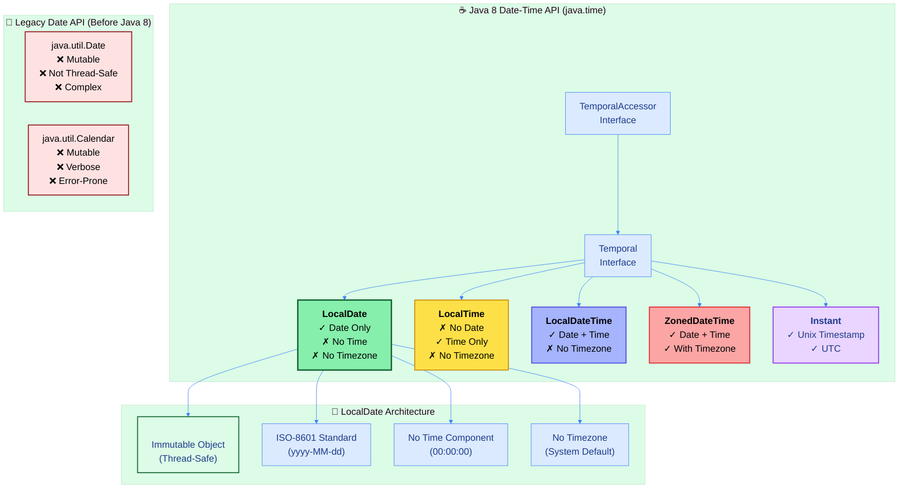

---

## 📑 Table of Contents
1. [LocalDate Overview - Immutable Date Handling](#1-localdate-overview---immutable-date-handling)
    - [Core Characteristics & Philosophy](#11-core-characteristics--philosophy)
    - [Why LocalDate Over java.util.Date](#12-why-localdate-over-javautildate)
    - [Internal Architecture](#13-internal-architecture)
2. [Date Creation & Factory Methods](#2-date-creation--factory-methods)
    - [Factory Method Patterns](#21-factory-method-patterns)
    - [Date Component Extraction](#22-date-component-extraction)
3. [Date Arithmetic Operations](#3-date-arithmetic-operations)
    - [Plus Operations - Future Dates](#31-plus-operations---future-dates)
    - [Minus Operations - Past Dates](#32-minus-operations---past-dates)
    - [Immutability Principles](#33-immutability-principles)
4. [Date Parsing & Formatting](#4-date-parsing--formatting)
    - [ISO-8601 Standard](#41-iso-8601-standard)
    - [Custom DateTimeFormatter](#42-custom-datetimeformatter)
5. [Date Comparison & Validation](#5-date-comparison--validation)
    - [Comparison Methods](#51-comparison-methods)
    - [Leap Year Detection](#52-leap-year-detection)
6. [Temporal Adjusters - Advanced Operations](#6-temporal-adjusters---advanced-operations)
    - [Built-in Adjusters](#61-built-in-adjusters)
    - [Custom Adjuster Patterns](#62-custom-adjuster-patterns)
7. [Performance & Best Practices](#7-performance--best-practices)
8. [Real-World Use Cases](#8-real-world-use-cases)

<div align="right">
<sub><em>Comprehensive notes by Avinash Dhanuka | For educational purposes</em></sub>
</div>

---

## 1. LOCALDATE OVERVIEW - Immutable Date Handling

### 📌 Definition
**LocalDate** is an **immutable date-time object** representing a date without time-of-day or timezone. Part of Java 8's new Date-Time API (JSR-310), it follows ISO-8601 calendar system and provides thread-safe, fluent date manipulation.

### 1.1 Core Characteristics & Philosophy

```mermaid
%%{init: {
  "theme": "base",
  "themeVariables": {
    "primaryColor": "#dbeafe",
    "primaryTextColor": "#1e3a8a",
    "primaryBorderColor": "#3b82f6",
    "lineColor": "#3b82f6",
    "fontSize": "14px"
  }
}}%%

graph TB
    subgraph LocalDate_Core["🎯 LocalDate Core Principles"]
        Immutable["<b>Immutability</b><br/>Every operation returns<br/>a NEW LocalDate instance<br/>Original remains unchanged"]
        ThreadSafe["<b>Thread Safety</b><br/>No mutable state<br/>Safe for concurrent access<br/>No synchronization needed"]
        ISO8601["<b>ISO-8601 Standard</b><br/>Format: yyyy-MM-dd<br/>Example: 2026-09-06<br/>International standard"]
        ValueBased["<b>Value-Based Class</b><br/>Equals based on value<br/>Not identity<br/>Suitable for constant folding"]
    end
    
    subgraph Design_Pattern["🏛️ Design Pattern"]
        Factory["Factory Methods<br/>now(), of(), parse()"]
        Fluent["Fluent Interface<br/>Method chaining support"]
        NoNull["No Null Values<br/>Use Optional instead"]
        
        Factory --> LocalDate_Core
        Fluent --> LocalDate_Core
        NoNull --> LocalDate_Core
    end
    
    subgraph Comparison_Legacy["⚖️ vs Legacy java.util.Date"]
        Old["java.util.Date<br/>❌ Mutable<br/>❌ Not Thread-Safe<br/>❌ Includes Time+Timezone<br/>❌ Month 0-based (confusing)<br/>❌ Year from 1900"]
        New["LocalDate<br/>✅ Immutable<br/>✅ Thread-Safe<br/>✅ Date Only (clear purpose)<br/>✅ Month 1-based (intuitive)<br/>✅ Standard year format"]
        
        Old -.->|Replaced by| New
    end
    
    style Immutable fill:#86efac,stroke:#166534,stroke-width:3px,color:#000
    style ThreadSafe fill:#86efac,stroke:#166534,stroke-width:3px,color:#000
    style ISO8601 fill:#fde047,stroke:#ca8a04,stroke-width:2px,color:#000
    style ValueBased fill:#a5b4fc,stroke:#4f46e5,stroke-width:2px,color:#000
    style Old fill:#fee2e2,stroke:#991b1b,stroke-width:2px,color:#000
    style New fill:#dcfce7,stroke:#166534,stroke-width:2px,color:#000
```

#### 📋 Characteristics Table

| Property | Value | Details |
| :--- | :--- | :--- |
| **Package** | `java.time` | Since Java 8 (JSR-310) |
| **Mutability** | ✅ Immutable | Every operation creates new instance |
| **Thread Safety** | ✅ Thread-Safe | No synchronization required |
| **Null Support** | ❌ No Null | Use Optional<LocalDate> instead |
| **Time Component** | ❌ No Time | Date only (00:00:00 assumed) |
| **Timezone** | ❌ No Timezone | System default assumed |
| **Format** | ISO-8601 | yyyy-MM-dd (e.g., 2026-09-06) |
| **Calendar System** | ISO Calendar | Proleptic Gregorian calendar |
| **Month Range** | 1-12 | January=1, December=12 (intuitive) |
| **Day Range** | 1-31 | Varies by month |
| **Year Range** | -999,999,999 to 999,999,999 | Practically unlimited |

---

### 1.2 Why LocalDate Over java.util.Date?

#### 🚫 Problems with java.util.Date

| Issue | java.util.Date | LocalDate Solution |
| :--- | :--- | :--- |
| **Mutability** | Mutable - can be changed after creation | Immutable - thread-safe by design |
| **Thread Safety** | Not thread-safe - requires synchronization | Thread-safe - no synchronization needed |
| **API Design** | Confusing methods (setYear, setMonth) | Clear, fluent API (plusDays, minusMonths) |
| **Month Indexing** | 0-based (Jan=0, Dec=11) - error-prone | 1-based (Jan=1, Dec=12) - intuitive |
| **Year Format** | Year from 1900 (2026 = 126) | Standard year format (2026 = 2026) |
| **Time Mixing** | Always includes time component | Date only - clear separation of concerns |
| **Timezone Mixing** | Includes timezone implicitly | No timezone - explicit when needed |
| **Deprecated** | Many methods deprecated | Modern, well-designed API |

#### ✅ LocalDate Advantages

1. **Immutability**: Safe to share across threads, no defensive copying needed
2. **Clarity**: Date-only operations without time/timezone complexity
3. **Type Safety**: Compile-time guarantees for date operations
4. **Fluent API**: Method chaining for readable code
5. **ISO-8601 Standard**: International standard format
6. **Better Error Handling**: Clear exceptions for invalid dates
7. **Rich API**: Comprehensive methods for date manipulation
8. **Integration**: Works seamlessly with other java.time classes

---

### 1.3 Internal Architecture

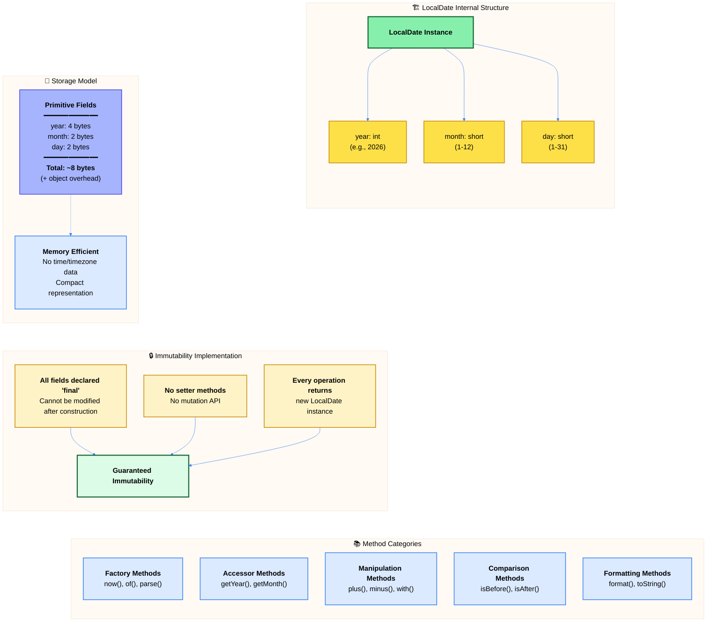

#### 🔍 Internal Representation

LocalDate stores three fundamental components:

1. **Year**: Integer representing the year (e.g., 2026)
2. **Month**: Short integer representing month (1=January, 12=December)
3. **Day**: Short integer representing day of month (1-31)

**Key Implementation Details:**

- **Final Fields**: All internal fields are `final`, ensuring immutability
- **Validation**: Constructor validates date components (e.g., Feb 31 throws exception)
- **Epoch Day**: Internally may use epoch day (days since 1970-01-01) for calculations
- **No Null**: Fields cannot be null; LocalDate itself is the value
- **Serialization**: Implements Serializable for persistence

---

## 2. DATE CREATION & Factory Methods

### 📌 Overview
LocalDate provides **factory methods** instead of public constructors, following the Factory Method design pattern. This ensures validation and provides clear, expressive APIs for date creation.

### 2.1 Factory Method Patterns

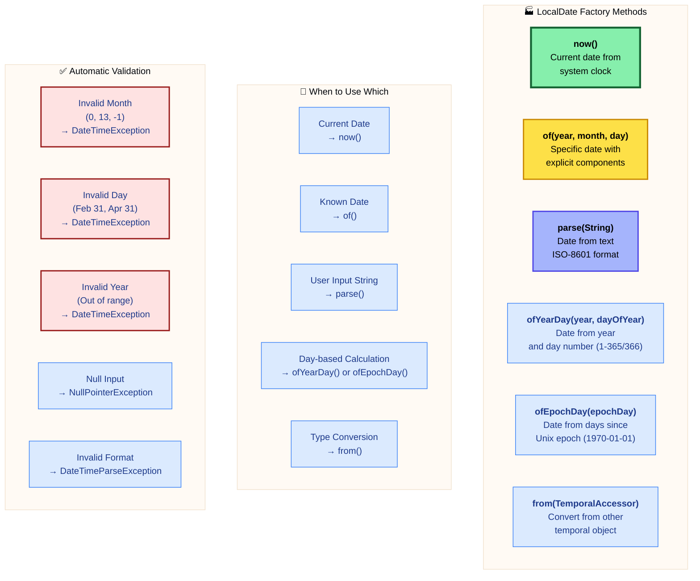

#### 📋 Factory Methods Comparison

| Method | Signature | Use Case | Example |
| :--- | :--- | :--- | :--- |
| **now()** | `static LocalDate now()` | Get current date | `LocalDate.now()` → 2026-09-06 |
| **now(ZoneId)** | `static LocalDate now(ZoneId zone)` | Current date in timezone | `LocalDate.now(ZoneId.of("Asia/Tokyo"))` |
| **of()** | `static LocalDate of(int y, int m, int d)` | Create specific date | `LocalDate.of(2026, 9, 6)` |
| **of(Month)** | `static LocalDate of(int y, Month m, int d)` | Using Month enum | `LocalDate.of(2026, Month.SEPTEMBER, 6)` |
| **parse()** | `static LocalDate parse(CharSequence)` | Parse ISO-8601 | `LocalDate.parse("2026-09-06")` |
| **parse(formatter)** | `static LocalDate parse(CharSequence, DateTimeFormatter)` | Custom format | `LocalDate.parse("06/09/2026", formatter)` |
| **ofYearDay()** | `static LocalDate ofYearDay(int y, int day)` | Year + day number | `LocalDate.ofYearDay(2026, 249)` → 2026-09-06 |
| **ofEpochDay()** | `static LocalDate ofEpochDay(long epochDay)` | Days since 1970 | `LocalDate.ofEpochDay(20632)` |

#### 🎯 Design Pattern Benefits

1. **Named Constructors**: Clear intent (now() vs of() vs parse())
2. **Validation**: Built-in validation before object creation
3. **Flexibility**: Multiple ways to create dates based on context
4. **Immutability**: No setters needed after construction
5. **Caching**: Implementation can cache common dates (optimization)

---

### 2.2 Date Component Extraction

#### 📋 Accessor Methods

| Method | Return Type | Description | Example Output |
| :--- | :--- | :--- | :--- |
| **getYear()** | int | Get year component | 2026 |
| **getMonthValue()** | int | Get month as int (1-12) | 9 |
| **getMonth()** | Month | Get month as enum | SEPTEMBER |
| **getDayOfMonth()** | int | Get day of month (1-31) | 6 |
| **getDayOfWeek()** | DayOfWeek | Get day as enum | SUNDAY |
| **getDayOfYear()** | int | Get day number in year (1-365/366) | 249 |
| **lengthOfMonth()** | int | Days in current month | 30 |
| **lengthOfYear()** | int | Days in current year (365/366) | 366 |
| **isLeapYear()** | boolean | Check if leap year | true |
| **getEra()** | Era | Get era (CE/BCE) | CE |
| **getChronology()** | IsoChronology | Get calendar system | IsoChronology.INSTANCE |

#### 🔍 Component Extraction Patterns

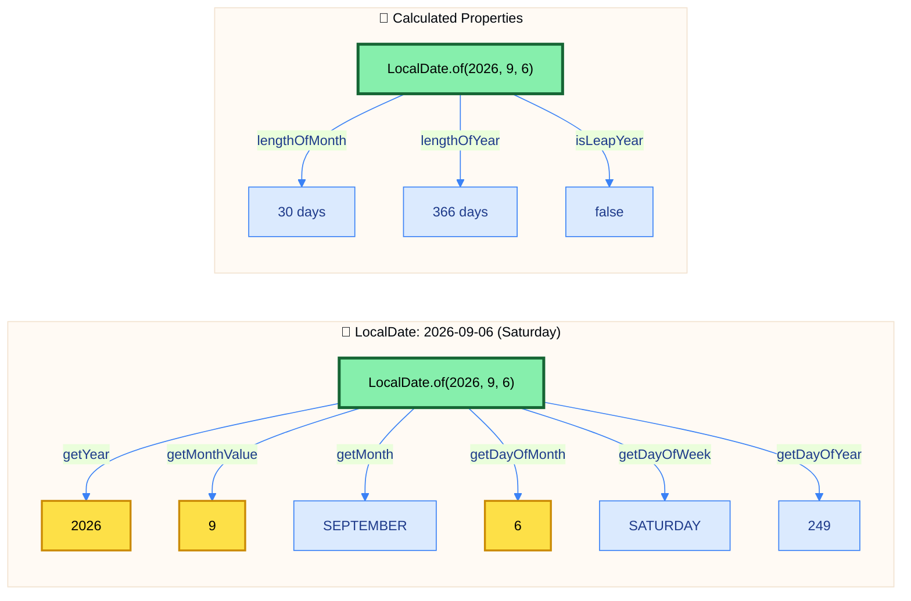

#### 🎨 Enum Benefits (Month & DayOfWeek)

**Month Enum Advantages:**
- Type-safe: Cannot pass invalid month values
- Readable: `Month.SEPTEMBER` vs `9`
- Methods: `month.length(leapYear)`, `month.firstDayOfYear(leapYear)`
- Comparison: `month.getValue()` for numeric value

**DayOfWeek Enum Advantages:**
- Type-safe: Cannot pass invalid day values
- Readable: `DayOfWeek.SATURDAY` vs `6`
- Methods: `dayOfWeek.getValue()` (1=Monday, 7=Sunday)
- Calculation: `dayOfWeek.plus(days)`, `dayOfWeek.minus(days)`

---

## 3. DATE ARITHMETIC OPERATIONS

### 📌 Overview
LocalDate provides **immutable arithmetic operations** through plus/minus methods. Every operation returns a **new LocalDate instance**, preserving the original date unchanged.

### 3.1 Plus Operations - Future Dates

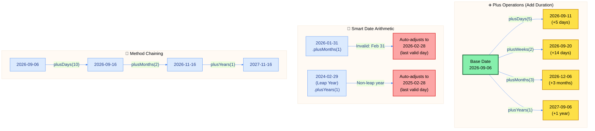

#### 📋 Plus Methods Reference

| Method | Description | Behavior | Example |
| :--- | :--- | :--- | :--- |
| **plusDays(long)** | Add days | Simple day addition | `date.plusDays(5)` |
| **plusWeeks(long)** | Add weeks | Multiplies by 7, adds days | `date.plusWeeks(2)` = +14 days |
| **plusMonths(long)** | Add months | Smart month handling | `date.plusMonths(1)` |
| **plusYears(long)** | Add years | Smart year handling | `date.plusYears(1)` |
| **plus(long, TemporalUnit)** | Add any unit | Generic addition | `date.plus(5, ChronoUnit.DAYS)` |
| **plus(TemporalAmount)** | Add period/duration | Complex additions | `date.plus(Period.ofDays(5))` |

#### 🎯 Smart Date Adjustment Logic

**Month/Year Addition Edge Cases:**

1. **Overflow Day**: If target month has fewer days, adjusts to last valid day
   - Jan 31 + 1 month → Feb 28/29 (not Feb 31)
   
2. **Leap Year Handling**: Automatically adjusts for leap years
   - Feb 29, 2024 + 1 year → Feb 28, 2025
   
3. **Month Rollover**: Automatically rolls to next year
   - Nov 15 + 3 months → Feb 15 (next year)

---

### 3.2 Minus Operations - Past Dates

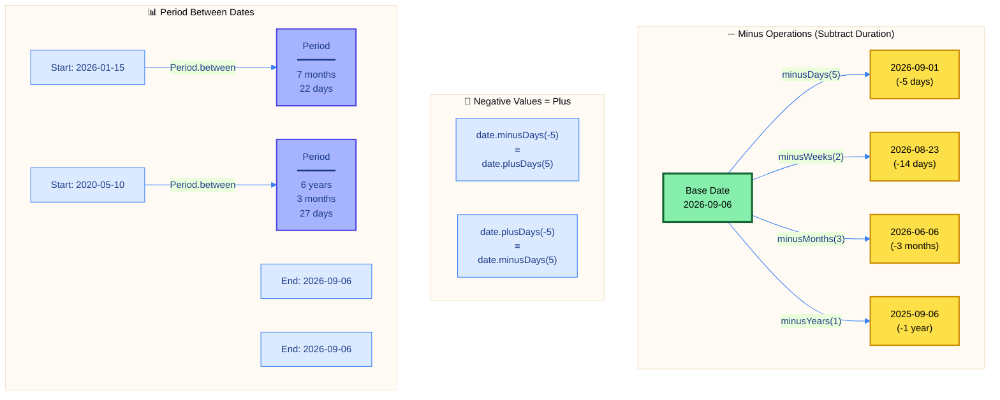

#### 📋 Minus Methods Reference

| Method | Description | Behavior | Example |
| :--- | :--- | :--- | :--- |
| **minusDays(long)** | Subtract days | Simple day subtraction | `date.minusDays(5)` |
| **minusWeeks(long)** | Subtract weeks | Multiplies by 7, subtracts days | `date.minusWeeks(2)` = -14 days |
| **minusMonths(long)** | Subtract months | Smart month handling | `date.minusMonths(1)` |
| **minusYears(long)** | Subtract years | Smart year handling | `date.minusYears(1)` |
| **minus(long, TemporalUnit)** | Subtract any unit | Generic subtraction | `date.minus(5, ChronoUnit.DAYS)` |
| **minus(TemporalAmount)** | Subtract period/duration | Complex subtractions | `date.minus(Period.ofDays(5))` |

#### 🎯 Period vs Duration vs ChronoUnit

| Type | Purpose | Precision | Example |
| :--- | :--- | :--- | :--- |
| **Period** | Date-based amount | Years, Months, Days | `Period.ofMonths(3)` |
| **Duration** | Time-based amount | Hours, Minutes, Seconds | `Duration.ofHours(5)` (Not for LocalDate) |
| **ChronoUnit** | Single unit of time | Any unit (enum) | `ChronoUnit.DAYS`, `ChronoUnit.MONTHS` |

**Note**: LocalDate works with **Period** and date-based **ChronoUnit** (DAYS, WEEKS, MONTHS, YEARS), not Duration.

---

### 3.3 Immutability Principles

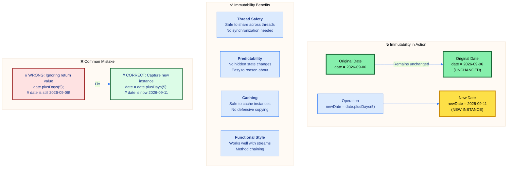

#### 🎯 Immutability Key Points

1. **Every Operation Creates New Instance**: Original date never modified
2. **Must Capture Return Value**: Ignoring return value is a common mistake
3. **No Setters**: No methods like `setYear()`, `setMonth()`, `setDay()`
4. **Thread-Safe by Design**: Can safely share across threads
5. **Functional Programming**: Works perfectly with Java Streams and lambdas

#### 📋 Comparison: Mutable vs Immutable

| Aspect | java.util.Date (Mutable) | LocalDate (Immutable) |
| :--- | :--- | :--- |
| **Modification** | `date.setYear(126);` // Modifies date | `date = date.plusYears(1);` // New instance |
| **Thread Safety** | Requires synchronization | Thread-safe by default |
| **Method Return** | void (modifies in-place) | LocalDate (new instance) |
| **Defensive Copy** | Required when passing | Not required |
| **Bugs** | Hidden state changes | Predictable behavior |

---

## 4. DATE PARSING & FORMATTING

### 📌 Overview
LocalDate supports **bidirectional conversion** between dates and strings using ISO-8601 standard format and custom patterns via DateTimeFormatter.

### 4.1 ISO-8601 Standard

```mermaid
%%{init: {
  "theme": "base",
  "themeVariables": {
    "primaryColor": "#dbeafe",
    "primaryTextColor": "#1e3a8a",
    "primaryBorderColor": "#3b82f6",
    "lineColor": "#3b82f6",
    "fontSize": "14px"
  }
}}%%

graph TB
    subgraph ISO8601_Format["📋 ISO-8601 Date Format"]
        Format["ISO-8601 Format<br/>━━━━━━━━━━━━━━<br/>yyyy-MM-dd<br/>━━━━━━━━━━━━━━<br/>Year: 4 digits (2026)<br/>Month: 2 digits (09)<br/>Day: 2 digits (06)<br/>━━━━━━━━━━━━━━<br/>Example: 2026-09-06"]
    end
    
    subgraph Parsing["🔄 String → LocalDate (Parsing)"]
        StringInput["String: '2026-09-06'"]
        
        StringInput -->|LocalDate.parse| ParseMethod["parse() method<br/>Uses ISO_LOCAL_DATE<br/>formatter by default"]
        
        ParseMethod -->|Validates & Creates| LocalDateObj["LocalDate object<br/>year=2026<br/>month=9<br/>day=6"]
    end
    
    subgraph Formatting["🔄 LocalDate → String (Formatting)"]
        DateObj["LocalDate object<br/>year=2026<br/>month=9<br/>day=6"]
        
        DateObj -->|"toString()"| ToStringMethod["Automatic ISO-8601<br/>formatting"]
        
        ToStringMethod --> OutputString["String: '2026-09-06'"]
        
        DateObj -->|"format(formatter)"| CustomFormat["Custom formatter<br/>DateTimeFormatter"]
        
        CustomFormat --> CustomOutput["String: '06/09/2026'<br/>or any pattern"]
    end
    
    subgraph Validation["✅ Parsing Validation"]
        V1["Invalid Format<br/>'2026/09/06'<br/>→ DateTimeParseException"]
        V2["Invalid Date<br/>'2026-02-31'<br/>→ DateTimeParseException"]
        V3["Null Input<br/>null<br/>→ NullPointerException"]
    end
    
    style Format fill:#86efac,stroke:#166534,stroke-width:3px,color:#000
    style LocalDateObj fill:#fde047,stroke:#ca8a04,stroke-width:2px,color:#000
    style OutputString fill:#a5b4fc,stroke:#4f46e5,stroke-width:2px,color:#000
    style V1 fill:#fee2e2,stroke:#991b1b,stroke-width:2px
    style V2 fill:#fee2e2,stroke:#991b1b,stroke-width:2px
```

#### 📋 ISO-8601 Standard Details

| Component | Format | Range | Example |
| :--- | :--- | :--- | :--- |
| **Year** | yyyy | 4 digits | 2026 |
| **Month** | MM | 01-12 | 09 |
| **Day** | dd | 01-31 | 06 |
| **Separator** | - | Hyphen | - |
| **Complete** | yyyy-MM-dd | Full format | 2026-09-06 |

**Why ISO-8601?**
- International standard (ISO 8601)
- Unambiguous (no regional confusion)
- Sortable (lexicographic order = chronological order)
- Machine-readable (parseable without context)
- Human-readable (clear structure)

---

### 4.2 Custom DateTimeFormatter

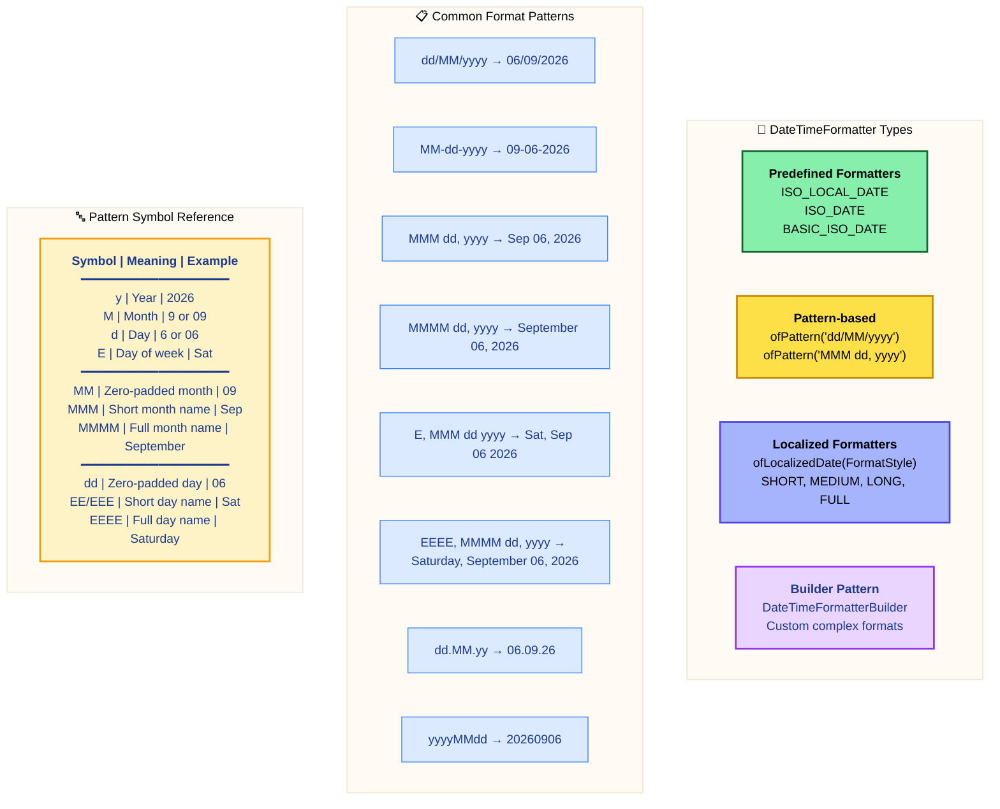

#### 📋 DateTimeFormatter Methods

| Method | Description | Example |
| :--- | :--- | :--- |
| **ofPattern(String)** | Create formatter from pattern | `DateTimeFormatter.ofPattern("dd/MM/yyyy")` |
| **ofLocalizedDate(FormatStyle)** | Locale-specific formatter | `DateTimeFormatter.ofLocalizedDate(FormatStyle.LONG)` |
| **withLocale(Locale)** | Set locale for formatter | `formatter.withLocale(Locale.US)` |
| **ISO_LOCAL_DATE** | Predefined ISO-8601 | `DateTimeFormatter.ISO_LOCAL_DATE` |
| **BASIC_ISO_DATE** | Compact ISO format (yyyyMMdd) | `DateTimeFormatter.BASIC_ISO_DATE` |

#### 🎯 Formatting Best Practices

1. **Reuse Formatters**: DateTimeFormatter is thread-safe and immutable - create once, reuse
2. **Prefer Predefined**: Use predefined formatters when possible (ISO_LOCAL_DATE)
3. **Explicit Locale**: Specify locale for localized formats to avoid ambiguity
4. **Cache Custom**: Cache custom formatters as constants for performance
5. **Validate Input**: Use try-catch for parse operations to handle invalid input gracefully

#### 📋 FormatStyle Options

| Style | US Format Example | UK Format Example |
| :--- | :--- | :--- |
| **SHORT** | 9/6/26 | 06/09/26 |
| **MEDIUM** | Sep 6, 2026 | 6 Sep 2026 |
| **LONG** | September 6, 2026 | 6 September 2026 |
| **FULL** | Saturday, September 6, 2026 | Saturday, 6 September 2026 |

**Note**: Output varies by Locale - always test with target locale.

---

## 5. DATE COMPARISON & VALIDATION

### 📌 Overview
LocalDate provides comprehensive methods for **comparing dates**, **checking relationships**, and **validating date properties** like leap years.

### 5.1 Comparison Methods

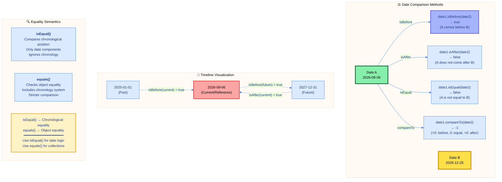

#### 📋 Comparison Methods Reference

| Method | Return | Description | Example Usage |
| :--- | :--- | :--- | :--- |
| **isBefore(LocalDate)** | boolean | True if this date is before other | `date1.isBefore(date2)` |
| **isAfter(LocalDate)** | boolean | True if this date is after other | `date1.isAfter(date2)` |
| **isEqual(LocalDate)** | boolean | True if chronologically equal | `date1.isEqual(date2)` |
| **compareTo(LocalDate)** | int | -1 (before), 0 (equal), 1 (after) | `date1.compareTo(date2)` |
| **equals(Object)** | boolean | Object equality (includes chronology) | `date1.equals(date2)` |
| **hashCode()** | int | Hash code for collections | `date.hashCode()` |

#### 🎯 Comparison Logic

**compareTo() Return Values:**
- **Negative** (< 0): This date is **before** the other date
- **Zero** (0): This date is **equal** to the other date
- **Positive** (> 0): This date is **after** the other date

**isEqual() vs equals():**
- `isEqual()`: Compares only the **timeline position** (chronological)
- `equals()`: Compares **object equality** including calendar system

Example where they differ:
- JapaneseDate(2026-09-06) vs IsoDate(2026-09-06)
- `isEqual()` → true (same day on timeline)
- `equals()` → false (different calendar systems)

**For most use cases**: Use `isBefore()`, `isAfter()`, `isEqual()` for clarity.

---

### 5.2 Leap Year Detection

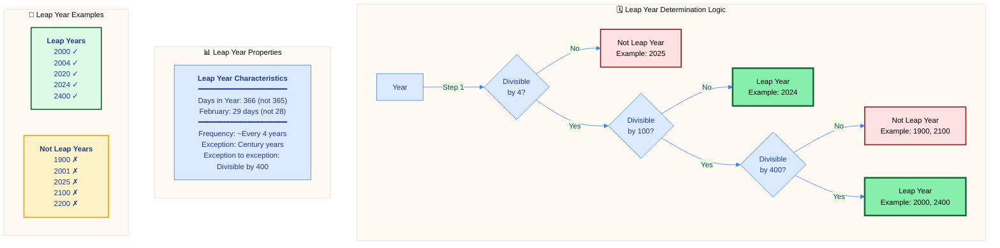

#### 📋 Leap Year Methods

| Method | Return | Description | Example |
| :--- | :--- | :--- | :--- |
| **isLeapYear()** | boolean | Check if date's year is leap year | `LocalDate.of(2024, 1, 1).isLeapYear()` → true |
| **Year.isLeap(int)** | boolean | Static check for any year | `Year.isLeap(2024)` → true |
| **lengthOfYear()** | int | Get days in year (365 or 366) | `date.lengthOfYear()` → 366 |
| **lengthOfMonth()** | int | Get days in month | `LocalDate.of(2024, 2, 1).lengthOfMonth()` → 29 |

#### 🎯 Leap Year Rules (Gregorian Calendar)

**Algorithm:**
```
IF year is divisible by 400 THEN
    LEAP YEAR
ELSE IF year is divisible by 100 THEN
    NOT LEAP YEAR
ELSE IF year is divisible by 4 THEN
    LEAP YEAR
ELSE
    NOT LEAP YEAR
```

**Historical Context:**
- **Julian Calendar** (before 1582): Every 4 years
- **Gregorian Calendar** (after 1582): Current rules
- **Purpose**: Keep calendar aligned with Earth's orbit (~365.2422 days)

#### 📊 Leap Year Impact

| Aspect | Regular Year | Leap Year |
| :--- | :--- | :--- |
| **Total Days** | 365 | 366 |
| **February Days** | 28 | 29 |
| **Occurrence** | 3 out of 4 years | ~1 out of 4 years |
| **Example Years** | 2025, 2026, 2027 | 2024, 2028, 2032 |

#### 🔍 Validation Use Cases

1. **Birthday Calculation**: Account for leap years in age calculation
2. **Date Range Validation**: Ensure Feb 29 only in leap years
3. **Financial Calculations**: Leap years affect day-count conventions
4. **Scheduling Systems**: Account for 366-day years
5. **Data Validation**: Reject Feb 29 for non-leap years

---

## 6. TEMPORAL ADJUSTERS - Advanced Operations

### 📌 Overview
**TemporalAdjusters** provide sophisticated date manipulation through predefined and custom adjustment strategies. They enable complex date calculations with clean, readable code.

### 6.1 Built-in Adjusters

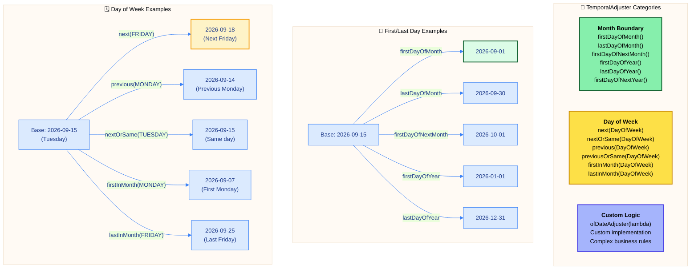

#### 📋 TemporalAdjusters Method Reference

| Method | Description | Example Result (from 2026-09-15) |
| :--- | :--- | :--- |
| **firstDayOfMonth()** | First day of current month | 2026-09-01 |
| **lastDayOfMonth()** | Last day of current month | 2026-09-30 |
| **firstDayOfNextMonth()** | First day of next month | 2026-10-01 |
| **firstDayOfYear()** | First day of current year | 2026-01-01 |
| **lastDayOfYear()** | Last day of current year | 2026-12-31 |
| **firstDayOfNextYear()** | First day of next year | 2027-01-01 |
| **next(DayOfWeek)** | Next occurrence of day | next(FRIDAY) → 2026-09-18 |
| **nextOrSame(DayOfWeek)** | Next or same day | nextOrSame(TUESDAY) → 2026-09-15 |
| **previous(DayOfWeek)** | Previous occurrence | previous(MONDAY) → 2026-09-14 |
| **previousOrSame(DayOfWeek)** | Previous or same day | previousOrSame(TUESDAY) → 2026-09-15 |
| **firstInMonth(DayOfWeek)** | First day of week in month | firstInMonth(MONDAY) → 2026-09-07 |
| **lastInMonth(DayOfWeek)** | Last day of week in month | lastInMonth(FRIDAY) → 2026-09-25 |
| **dayOfWeekInMonth(ord, day)** | Nth day of week | dayOfWeekInMonth(2, MONDAY) → 2nd Monday |

#### 🎯 Common Use Cases

1. **End of Month Processing**: `date.with(TemporalAdjusters.lastDayOfMonth())`
2. **Billing Dates**: First day of next month for monthly billing
3. **Meeting Scheduling**: Next/previous specific day of week
4. **Payroll**: Last Friday of month
5. **Report Generation**: First/last day of year/quarter
6. **Holiday Calculation**: Nth Monday of month (e.g., Memorial Day)

---

### 6.2 Custom Adjuster Patterns

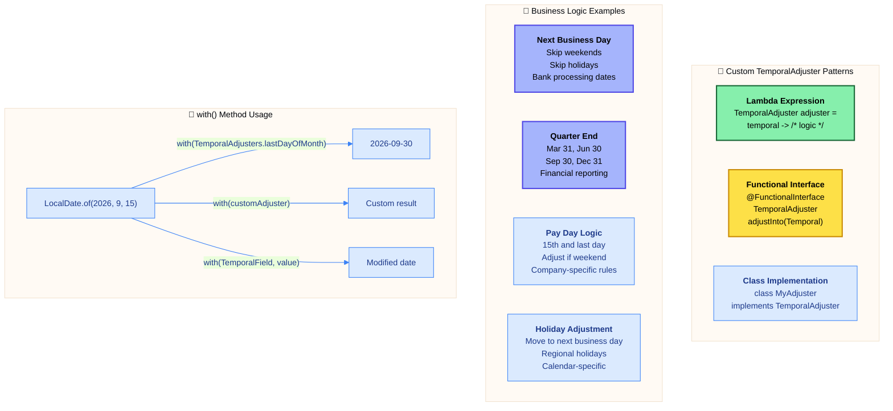

#### 📋 with() Method Variants

| Method | Description | Example |
| :--- | :--- | :--- |
| **with(TemporalAdjuster)** | Apply adjuster | `date.with(lastDayOfMonth())` |
| **with(TemporalField, long)** | Set field value | `date.with(ChronoField.DAY_OF_MONTH, 1)` |
| **withYear(int)** | Change year | `date.withYear(2027)` |
| **withMonth(int)** | Change month | `date.withMonth(12)` |
| **withDayOfMonth(int)** | Change day | `date.withDayOfMonth(1)` |
| **withDayOfYear(int)** | Set day of year | `date.withDayOfYear(100)` |

#### 🎯 Custom Adjuster Design Pattern

**Three Implementation Approaches:**

1. **Lambda Expression** (Simple, one-off logic):
   ```
   TemporalAdjuster adjuster = temporal -> {
       // Custom logic
       return modifiedTemporal;
   };
   ```

2. **Static Factory Method** (Reusable):
   ```
   public static TemporalAdjuster nextBusinessDay() {
       return temporal -> {
           // Business day logic
       };
   }
   ```

3. **Class Implementation** (Complex, stateful):
   ```
   public class BusinessDayAdjuster implements TemporalAdjuster {
       @Override
       public Temporal adjustInto(Temporal temporal) {
           // Complex logic with state
       }
   }
   ```

#### 📊 Adjuster Composition

TemporalAdjusters can be **chained** for complex operations:

| Operation | Result |
| :--- | :--- |
| First day of month, then next Monday | First Monday of month or later |
| Last day of month, then previous Friday | Last Friday of month or earlier |
| Next quarter end, then next business day | First business day after quarter |

**Performance Note**: TemporalAdjusters are **functional** - create once, reuse multiple times. No side effects, thread-safe.

---

## 7. PERFORMANCE & Best Practices

### 📌 Overview
Understanding LocalDate's performance characteristics and following best practices ensures efficient, maintainable date manipulation code.

### 7.1 Performance Characteristics

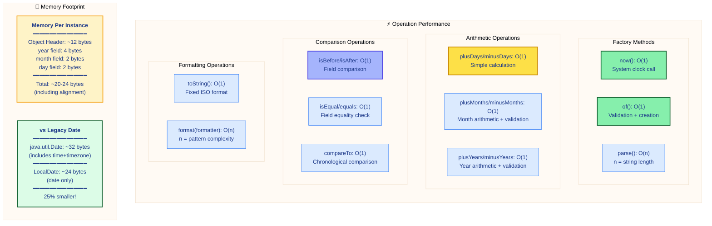

#### 📊 Performance Comparison Table

| Operation | Time Complexity | Notes |
| :--- | :--- | :--- |
| **Creation (now)** | O(1) | Single system call |
| **Creation (of)** | O(1) | Validation + object creation |
| **Creation (parse)** | O(n) | Proportional to string length |
| **Arithmetic** | O(1) | Direct field manipulation |
| **Comparison** | O(1) | Field-by-field comparison |
| **Formatting** | O(n) | Depends on pattern complexity |
| **TemporalAdjuster** | O(1) - O(n) | Depends on adjuster logic |

**Key Performance Insights:**

1. **Immutability Cost**: Creating new instances has minimal overhead (~20-24 bytes)
2. **No GC Pressure**: Small objects, efficient allocation
3. **Thread-Safe**: No synchronization overhead
4. **Cache-Friendly**: Compact memory layout
5. **JIT Optimization**: HotSpot optimizes common patterns

---

### 7.2 Best Practices

#### 📋 Best Practices Checklist

| Practice | ✅ Do | ❌ Don't |
| :--- | :--- | :--- |
| **Immutability** | Capture return values: `date = date.plusDays(1)` | Ignore returns: `date.plusDays(1);` |
| **Null Safety** | Use `Optional<LocalDate>` | Use `null` for "no date" |
| **Formatters** | Reuse DateTimeFormatter (thread-safe) | Create new formatter each time |
| **Comparison** | Use `isBefore()`, `isAfter()`, `isEqual()` | Use `compareTo()` for simple checks |
| **Validation** | Let LocalDate validate (throws exception) | Manual validation before creation |
| **Parsing** | Use try-catch for user input | Assume input is valid |
| **Factory Methods** | Use `of()` for known dates | Use `parse()` for known dates |
| **Collections** | Use as Map keys (immutable + hashCode) | Avoid mutable date alternatives |

#### 🎯 Common Anti-Patterns

1. **Ignoring Return Values**
   ```
   ❌ BAD:  date.plusDays(5);  // Original date unchanged!
   ✅ GOOD: date = date.plusDays(5);  // Capture new instance
   ```

2. **Using null for "No Date"**
   ```
   ❌ BAD:  LocalDate date = null;
   ✅ GOOD: Optional<LocalDate> date = Optional.empty();
   ```

3. **Creating Formatters Repeatedly**
   ```
   ❌ BAD:  DateTimeFormatter.ofPattern("dd/MM/yyyy")  // In loop
   ✅ GOOD: private static final DateTimeFormatter FORMATTER = 
             DateTimeFormatter.ofPattern("dd/MM/yyyy");
   ```

4. **Mixing Date APIs**
   ```
   ❌ BAD:  Converting between java.util.Date and LocalDate frequently
   ✅ GOOD: Use LocalDate throughout; convert only at boundaries
   ```

5. **Manual Validation**
   ```
   ❌ BAD:  if (day > 31) throw exception; LocalDate.of(...)
   ✅ GOOD: LocalDate.of(...)  // Let it validate and throw
   ```

#### 🔒 Thread Safety Guidelines

**LocalDate is thread-safe because:**
- Immutable (final fields)
- No mutable state
- All methods return new instances
- Can be safely shared across threads

**Thread-Safe Patterns:**
```
✅ Shared constant:    private static final LocalDate EPOCH = LocalDate.of(1970, 1, 1);
✅ Method parameter:   public void process(LocalDate date) { ... }
✅ Return value:       public LocalDate getDate() { return this.date; }
✅ Collection element: List<LocalDate> dates = new ArrayList<>();
```

#### 💡 Performance Optimization Tips

1. **Cache Frequently Used Dates**
   - Common dates (epoch, min, max)
   - Application-specific dates (start of year, etc.)

2. **Reuse DateTimeFormatters**
   - Thread-safe and reusable
   - Store as static final constants

3. **Prefer of() Over parse()**
   - For known/literal dates in code
   - Avoids parsing overhead

4. **Use Appropriate Comparison Methods**
   - `isBefore()`/`isAfter()` for readability
   - `compareTo()` when sorting collections

5. **Minimize Conversions**
   - Stay in java.time API when possible
   - Convert to legacy Date only at boundaries

---

## 8. REAL-WORLD USE CASES

### 📌 Overview
LocalDate solves practical business problems across domains. Understanding common patterns helps apply LocalDate effectively.

### 8.1 Common Use Cases

#### 📋 Use Case Categories

| Domain | Use Cases | LocalDate Operations |
| :--- | :--- | :--- |
| **Finance** | Payment due dates, loan maturity, fiscal periods | Arithmetic, adjusters, comparison |
| **HR** | Employee birthdays, hire dates, leave tracking | Age calculation, tenure, date ranges |
| **Healthcare** | Appointment scheduling, prescription dates | Comparison, validation, adjusters |
| **E-commerce** | Order dates, delivery estimates, return windows | Arithmetic, comparison, formatting |
| **Education** | Semester dates, assignment deadlines, holidays | Date ranges, temporal adjusters |
| **Legal** | Contract dates, statute of limitations, deadlines | Period calculation, comparison |
| **Travel** | Booking dates, check-in/out, availability | Date ranges, validation |
| **Retail** | Sales periods, promotions, inventory dates | Comparison, date arithmetic |

#### 🎯 Practical Examples

**1. Age Calculation**
- Calculate person's age from birthdate
- Operations: `Period.between()`, `getYears()`

**2. Days Until Event**
- Calculate days remaining to deadline
- Operations: `ChronoUnit.DAYS.between()`

**3. Working Days Calculation**
- Calculate business days between dates
- Operations: `datesUntil()`, filter weekends

**4. Subscription Renewal**
- Calculate next billing date
- Operations: `plusMonths()`, `with(firstDayOfMonth())`

**5. Date Range Validation**
- Check if date falls within range
- Operations: `isAfter()`, `isBefore()`

**6. Fiscal Quarter Determination**
- Determine quarter for given date
- Operations: `getMonth()`, adjuster logic

**7. Holiday Adjustment**
- Move date to next business day if holiday
- Operations: Custom TemporalAdjuster

**8. Expiration Checking**
- Check if document/license expired
- Operations: `isAfter(now())`

---

## 📚 Summary

### Quick Reference Card

| Aspect | Details |
| :--- | :--- |
| **Package** | `java.time` (Java 8+) |
| **Purpose** | Immutable date representation without time/timezone |
| **Format** | ISO-8601 (yyyy-MM-dd) |
| **Thread Safety** | ✅ Thread-safe (immutable) |
| **Null Support** | ❌ Use Optional<LocalDate> |
| **Memory** | ~24 bytes per instance |
| **Performance** | O(1) for most operations |

### Key Takeaways

1. **Immutability**: Every operation returns new instance - capture return values
2. **ISO-8601 Standard**: International format yyyy-MM-dd
3. **Thread-Safe**: No synchronization needed, safe to share
4. **Rich API**: Comprehensive methods for all date operations
5. **Type Safety**: Compile-time guarantees for date logic
6. **Validation**: Automatic validation prevents invalid dates
7. **Temporal Adjusters**: Powerful for complex date calculations
8. **Replace java.util.Date**: Modern, well-designed alternative

### Migration from java.util.Date

| Old (java.util.Date) | New (LocalDate) |
| :--- | :--- |
| `new Date()` | `LocalDate.now()` |
| `date.setYear(126)` | `date = date.withYear(2026)` |
| `date.getTime()` | `date.toEpochDay()` or conversion |
| `calendar.add(Calendar.DAY, 5)` | `date = date.plusDays(5)` |
| `sdf.format(date)` | `date.format(formatter)` |
| `sdf.parse(string)` | `LocalDate.parse(string)` |

---

<div align="center">

<table style="border: 2px solid #3b82f6; border-radius: 10px; padding: 5px; margin: 20px auto; max-width: 500px;">
<tr>
<td align="center" style="padding: 10px;">

## 🎯 Master LocalDate Principles
<br/>


**Immutability** → Thread-safe, predictable behavior  
**ISO-8601** → International standard format  
**Factory Methods** → Clear, expressive API  
**Temporal Adjusters** → Complex date calculations made simple

---

## 📘 Next Topic: LocalDateTime

**Coming Next:** Master **LocalDateTime API** - combining date and time without timezone complexity. Learn to handle date-time operations, formatting patterns, and temporal manipulation for complete timestamp management.

**Preview:** LocalDateTime = LocalDate + LocalTime (no timezone)

---

<sub>**© 2026 Avinash Dhanuka** | Java LocalDate API Master Guide</sub>

<sub>📧 [avunashdhanuka@gmail.com](mailto:avunashdhanuka@gmail.com) | 🔗 [GitHub: Avinash-706](https://github.com/Avinash-706)</sub>

<br/>

</td>
</tr>
</table>

</div>
