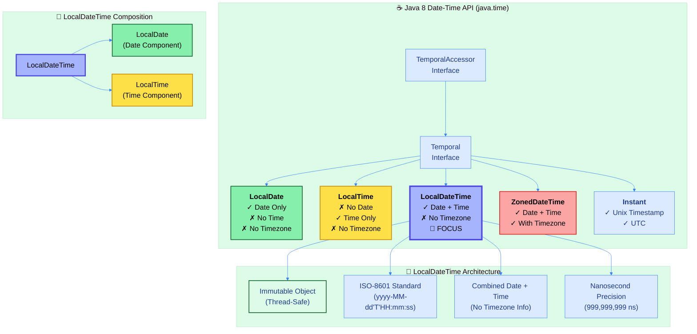
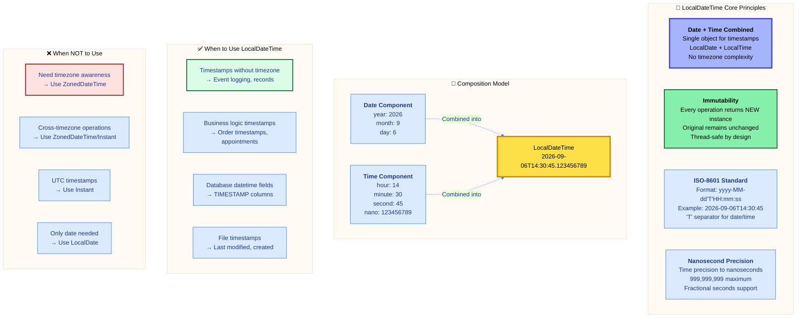
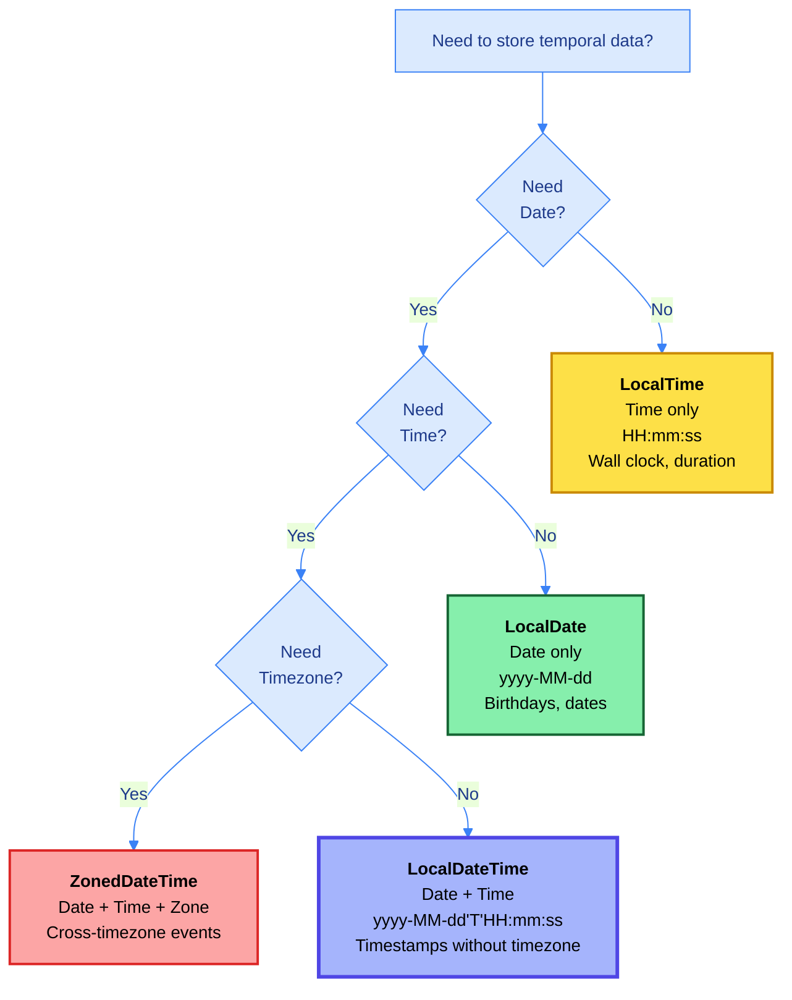
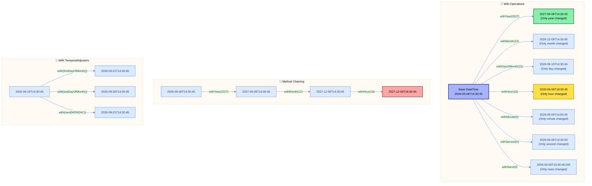

# ☕ Master Guide: Java LocalDateTime API - Date & Time Without Timezone

<div align="center">


</div>

<hr style="border: 1px solid rgb(98, 117, 187)">

<div align="center">
<table>
<tr>
<td align="center">
<br />

<h3>© 2026 Avinash Dhanuka</h3>
<p>Master Guide: Java Core & Frameworks</p>
<p><em>Crafted with ❤️ for Object-Oriented Architecture</em></p>

<a href="https://github.com/Avinash-706" target="_blank">

</a>

<a href="https://mail.google.com/mail/?view=cm&fs=1&to=avunashdhanuka@gmail.com&su=Java%20LocalDateTime%20Query&body=☕%20Hello%20Avinash,%0D%0A%0D%0AMy%20name%20is%20[Your%20Name]%20and%20I%20have%20a%20doubt%20regarding%20Java%20LocalDateTime%20API.%0D%0A%0D%0A🔹%20Topic:%20[LocalDateTime/DateTime%20Operations]%0D%0A🔹%20Question:%20[Type%20your%20question]%0D%0A%0D%0AThank%20you!" target="_blank">


</a>
<br />
<br />
</td>
</tr>
</table>
</div>

> **Author's Note:** This comprehensive guide explores Java 8's LocalDateTime API for immutable date-time manipulation without timezone complexity. Master the combination of date and time in a single object, understand the differences from LocalDate and LocalTime, and learn advanced temporal operations. Includes internal architecture, performance characteristics, and real-world problem-solving patterns with detailed theoretical knowledge.

---

## 🏗️ Java Date-Time API Architecture



---

## 📑 Table of Contents
1. [LocalDateTime Overview - Combined Date & Time](#1-localdatetime-overview---combined-date--time)
    - [Core Characteristics & Philosophy](#11-core-characteristics--philosophy)
    - [LocalDateTime vs LocalDate vs LocalTime](#12-localdatetime-vs-localdate-vs-localtime)
    - [Internal Architecture](#13-internal-architecture)
2. [DateTime Creation & Factory Methods](#2-datetime-creation--factory-methods)
    - [Factory Method Patterns](#21-factory-method-patterns)
    - [Component Extraction & Conversion](#22-component-extraction--conversion)
3. [DateTime Arithmetic Operations](#3-datetime-arithmetic-operations)
    - [Plus Operations - Future DateTimes](#31-plus-operations---future-datetimes)
    - [Minus Operations - Past DateTimes](#32-minus-operations---past-datetimes)
    - [Truncation & Rounding](#33-truncation--rounding)
4. [DateTime Parsing & Formatting](#4-datetime-parsing--formatting)
    - [ISO-8601 DateTime Standard](#41-iso-8601-datetime-standard)
    - [Custom DateTime Patterns](#42-custom-datetime-patterns)
5. [DateTime Comparison & With Operations](#5-datetime-comparison--with-operations)
    - [Comparison Methods](#51-comparison-methods)
    - [With Operations - Component Modification](#52-with-operations---component-modification)
6. [Performance & Best Practices](#6-performance--best-practices)
7. [Real-World Use Cases](#7-real-world-use-cases)

<div align="right">
<sub><em>Comprehensive notes by Avinash Dhanuka | For educational purposes</em></sub>
</div>

---

## 1. LOCALDATETIME OVERVIEW - Combined Date & Time

### 📌 Definition
**LocalDateTime** is an **immutable date-time object** representing **both date and time without timezone information**. It combines LocalDate and LocalTime into a single object, providing complete timestamp functionality while remaining timezone-agnostic. Part of Java 8's Date-Time API (JSR-310), following ISO-8601 standard.

### 1.1 Core Characteristics & Philosophy



#### 📋 Characteristics Table

| Property | Value | Details |
| :--- | :--- | :--- |
| **Package** | `java.time` | Since Java 8 (JSR-310) |
| **Mutability** | ✅ Immutable | Every operation creates new instance |
| **Thread Safety** | ✅ Thread-Safe | No synchronization required |
| **Null Support** | ❌ No Null | Use Optional<LocalDateTime> instead |
| **Date Component** | ✅ Included | Full date information (year, month, day) |
| **Time Component** | ✅ Included | Full time information (hour, minute, second, nano) |
| **Timezone** | ❌ No Timezone | System default assumed for conversions |
| **Format** | ISO-8601 | yyyy-MM-dd'T'HH:mm:ss.SSSSSSSSS |
| **Time Precision** | Nanoseconds | 0-999,999,999 nanoseconds |
| **Midnight Representation** | 00:00:00 | Start of day |

---

### 1.2 LocalDateTime vs LocalDate vs LocalTime

#### 📊 Comparison Matrix

| Feature | LocalDate | LocalTime | LocalDateTime |
| :--- | :---: | :---: | :---: |
| **Date Component** | ✅ | ❌ | ✅ |
| **Time Component** | ❌ | ✅ | ✅ |
| **Timezone** | ❌ | ❌ | ❌ |
| **ISO Format** | yyyy-MM-dd | HH:mm:ss | yyyy-MM-dd'T'HH:mm:ss |
| **Example** | 2026-09-06 | 14:30:45 | 2026-09-06T14:30:45 |
| **Use Case** | Birthdays, dates | Wall clock time | Timestamps, events |
| **Memory Size** | ~24 bytes | ~12 bytes | ~32 bytes |
| **Precision** | Day | Nanosecond | Nanosecond |

#### 🔄 Conversion Between Types

| From → To | Method | Example |
| :--- | :--- | :--- |
| **LocalDate → LocalDateTime** | `atTime(LocalTime)` | `date.atTime(14, 30)` |
| **LocalDate → LocalDateTime** | `atStartOfDay()` | `date.atStartOfDay()` → midnight |
| **LocalTime → LocalDateTime** | `atDate(LocalDate)` | `time.atDate(date)` |
| **LocalDateTime → LocalDate** | `toLocalDate()` | `dateTime.toLocalDate()` |
| **LocalDateTime → LocalTime** | `toLocalTime()` | `dateTime.toLocalTime()` |

#### 🎯 Decision Tree: Which Type to Use?



---

### 1.3 Internal Architecture

#### 📋 Internal Structure

LocalDateTime internally **composes** LocalDate and LocalTime:

| Component | Type | Storage | Range |
| :--- | :--- | :--- | :--- |
| **Date Part** | LocalDate | 3 fields (year, month, day) | Full date range |
| **Time Part** | LocalTime | 2 fields (time-of-day as long, nano) | 00:00:00 - 23:59:59.999999999 |
| **Total Memory** | Combined | ~32 bytes | Date + Time combined |

#### 🔍 Key Implementation Details

**Storage Model:**
- **LocalDate Reference**: Holds complete date information (year, month, day)
- **LocalTime Reference**: Holds time as nanoseconds since midnight
- **Immutable Fields**: All internal fields are `final`
- **No Timezone Data**: No timezone offset stored (reduces memory)

**Validation:**
- Date validation: Inherited from LocalDate (e.g., Feb 31 invalid)
- Time validation: Inherited from LocalTime (e.g., 25:00:00 invalid)
- Combined validation: Ensures both date and time are valid

**Performance Characteristics:**
- Object overhead: ~16 bytes (Java object header)
- Date component: ~24 bytes
- Time component: ~12 bytes
- **Total**: ~32-40 bytes per instance (with alignment)

---

## 2. DATETIME CREATION & Factory Methods

### 📌 Overview
LocalDateTime provides **factory methods** for creating instances from various sources: current timestamp, explicit components, parsing strings, or combining LocalDate and LocalTime objects.

### 2.1 Factory Method Patterns

#### 📋 Factory Methods Comparison

| Method | Signature | Use Case | Example Output |
| :--- | :--- | :--- | :--- |
| **now()** | `static LocalDateTime now()` | Current date-time | 2026-09-06T14:30:45.123456789 |
| **now(ZoneId)** | `static LocalDateTime now(ZoneId zone)` | Current in timezone | `now(ZoneId.of("Asia/Tokyo"))` |
| **of()** | `static LocalDateTime of(int y, int mo, int d, int h, int m)` | Create specific | `of(2026, 9, 6, 14, 30)` |
| **of(date, time)** | `static LocalDateTime of(LocalDate, LocalTime)` | Combine components | `of(date, time)` |
| **parse()** | `static LocalDateTime parse(CharSequence)` | Parse ISO-8601 | `parse("2026-09-06T14:30:45")` |
| **parse(formatter)** | `static LocalDateTime parse(CharSequence, DateTimeFormatter)` | Custom format | `parse("06/09/2026 14:30", formatter)` |
| **ofInstant()** | `static LocalDateTime ofInstant(Instant, ZoneId)` | From Instant | `ofInstant(instant, zone)` |
| **ofEpochSecond()** | `static LocalDateTime ofEpochSecond(long, int, ZoneOffset)` | From epoch seconds | `ofEpochSecond(seconds, nanos, offset)` |

#### 🎯 Factory Method Categories

**1. Current DateTime:**
- `now()` - System clock
- `now(Clock)` - Custom clock
- `now(ZoneId)` - Specific timezone

**2. Explicit Components:**
- `of(year, month, day, hour, minute)`
- `of(year, month, day, hour, minute, second)`
- `of(year, month, day, hour, minute, second, nano)`
- `of(LocalDate, LocalTime)`

**3. From Other Types:**
- `parse(String)` - From ISO-8601 string
- `parse(String, DateTimeFormatter)` - Custom format
- `from(TemporalAccessor)` - From temporal object
- `ofInstant(Instant, ZoneId)` - From Instant

**4. From LocalDate/LocalTime:**
- `date.atTime(hour, minute)` - Date with time
- `date.atTime(LocalTime)` - Date with time object
- `date.atStartOfDay()` - Midnight
- `time.atDate(LocalDate)` - Time with date

---

### 2.2 Component Extraction & Conversion

#### 📋 Accessor Methods

| Method | Return Type | Description | Example Output |
| :--- | :--- | :--- | :--- |
| **getYear()** | int | Get year | 2026 |
| **getMonthValue()** | int | Get month (1-12) | 9 |
| **getMonth()** | Month | Get month enum | SEPTEMBER |
| **getDayOfMonth()** | int | Get day (1-31) | 6 |
| **getDayOfWeek()** | DayOfWeek | Get day of week | SATURDAY |
| **getDayOfYear()** | int | Get day of year (1-365/366) | 249 |
| **getHour()** | int | Get hour (0-23) | 14 |
| **getMinute()** | int | Get minute (0-59) | 30 |
| **getSecond()** | int | Get second (0-59) | 45 |
| **getNano()** | int | Get nanosecond (0-999,999,999) | 123456789 |
| **toLocalDate()** | LocalDate | Extract date part | 2026-09-06 |
| **toLocalTime()** | LocalTime | Extract time part | 14:30:45.123456789 |

#### 🔄 Conversion Methods

**To Other Types:**

| Method | Return Type | Purpose |
| :--- | :--- | :--- |
| **toLocalDate()** | LocalDate | Extract date component |
| **toLocalTime()** | LocalTime | Extract time component |
| **atZone(ZoneId)** | ZonedDateTime | Add timezone |
| **atOffset(ZoneOffset)** | OffsetDateTime | Add offset |
| **toInstant(ZoneOffset)** | Instant | Convert to UTC instant |
| **toEpochSecond(ZoneOffset)** | long | Get epoch seconds |

**From Other Types:**

| Source | Method | Example |
| :--- | :--- | :--- |
| **LocalDate** | `atTime(...)` | `date.atTime(14, 30)` |
| **LocalDate** | `atStartOfDay()` | `date.atStartOfDay()` |
| **LocalTime** | `atDate(...)` | `time.atDate(date)` |
| **Instant** | `ofInstant(...)` | `LocalDateTime.ofInstant(instant, zone)` |

---

## 3. DATETIME ARITHMETIC OPERATIONS

### 📌 Overview
LocalDateTime provides **immutable arithmetic operations** for both date and time components. Every operation returns a **new LocalDateTime instance**, preserving immutability.

### 3.1 Plus Operations - Future DateTimes

#### 📋 Plus Methods Reference

| Method | Description | Affects | Example |
| :--- | :--- | :--- | :--- |
| **plusYears(long)** | Add years | Date | `dt.plusYears(1)` |
| **plusMonths(long)** | Add months | Date | `dt.plusMonths(3)` |
| **plusWeeks(long)** | Add weeks | Date | `dt.plusWeeks(2)` |
| **plusDays(long)** | Add days | Date | `dt.plusDays(5)` |
| **plusHours(long)** | Add hours | Time | `dt.plusHours(3)` |
| **plusMinutes(long)** | Add minutes | Time | `dt.plusMinutes(45)` |
| **plusSeconds(long)** | Add seconds | Time | `dt.plusSeconds(30)` |
| **plusNanos(long)** | Add nanoseconds | Time | `dt.plusNanos(500000000)` |
| **plus(long, TemporalUnit)** | Add any unit | Both | `dt.plus(5, ChronoUnit.DAYS)` |
| **plus(TemporalAmount)** | Add period/duration | Both | `dt.plus(Duration.ofHours(2))` |

#### 🎯 Date vs Time Operations

**Date Operations (Inherited from LocalDate):**
- Smart month handling (Feb 31 → Feb 28/29)
- Leap year awareness
- Month rollover to next year

**Time Operations (Inherited from LocalTime):**
- Automatic day rollover (25:00:00 → next day 01:00:00)
- Nanosecond precision
- Minute/second/hour overflow handling

**Combined Example:**
```
Base: 2026-09-06T23:30:00
plusHours(2) → 2026-09-07T01:30:00  // Day rolls over
plusDays(1).plusHours(2) → 2026-09-08T01:30:00  // Combined
```

---

### 3.2 Minus Operations - Past DateTimes

#### 📋 Minus Methods Reference

| Method | Description | Affects | Example |
| :--- | :--- | :--- | :--- |
| **minusYears(long)** | Subtract years | Date | `dt.minusYears(1)` |
| **minusMonths(long)** | Subtract months | Date | `dt.minusMonths(3)` |
| **minusWeeks(long)** | Subtract weeks | Date | `dt.minusWeeks(2)` |
| **minusDays(long)** | Subtract days | Date | `dt.minusDays(5)` |
| **minusHours(long)** | Subtract hours | Time | `dt.minusHours(3)` |
| **minusMinutes(long)** | Subtract minutes | Time | `dt.minusMinutes(45)` |
| **minusSeconds(long)** | Subtract seconds | Time | `dt.minusSeconds(30)` |
| **minusNanos(long)** | Subtract nanoseconds | Time | `dt.minusNanos(500000000)` |
| **minus(long, TemporalUnit)** | Subtract any unit | Both | `dt.minus(5, ChronoUnit.HOURS)` |
| **minus(TemporalAmount)** | Subtract period/duration | Both | `dt.minus(Duration.ofMinutes(30))` |

#### 🎯 Period vs Duration

**Period (Date-based):**
- Works with years, months, days
- Example: `Period.ofMonths(3)`, `Period.ofDays(5)`
- Best for date arithmetic

**Duration (Time-based):**
- Works with hours, minutes, seconds, nanos
- Example: `Duration.ofHours(2)`, `Duration.ofMinutes(45)`
- Best for time arithmetic

**Combined Operations:**
```
Base: 2026-09-06T14:30:00
plus(Period.ofDays(5)) → 2026-09-11T14:30:00
plus(Duration.ofHours(3)) → 2026-09-06T17:30:00
plus(Period.ofDays(5)).plus(Duration.ofHours(3)) → 2026-09-11T17:30:00
```

---

### 3.3 Truncation & Rounding

#### 📋 Truncation Methods

| Method | Description | Example Result |
| :--- | :--- | :--- |
| **truncatedTo(TemporalUnit)** | Truncate to unit | Zeroes smaller fields |

**Truncation Units:**

| Unit | Truncates | Example: 2026-09-06T14:30:45.123456789 |
| :--- | :--- | :--- |
| **DAYS** | Below days | 2026-09-06T00:00:00 |
| **HOURS** | Below hours | 2026-09-06T14:00:00 |
| **MINUTES** | Below minutes | 2026-09-06T14:30:00 |
| **SECONDS** | Below seconds | 2026-09-06T14:30:45 |
| **MILLIS** | Below milliseconds | 2026-09-06T14:30:45.123000000 |
| **MICROS** | Below microseconds | 2026-09-06T14:30:45.123456000 |
| **NANOS** | No change | 2026-09-06T14:30:45.123456789 |

**Use Cases:**
- **Database compatibility**: Truncate to second/millisecond precision
- **Logging**: Remove nanoseconds for readability
- **Comparison**: Truncate to compare at specific precision
- **Rounding**: Truncate to nearest hour/minute

---

## 4. DATETIME PARSING & FORMATTING

### 📌 Overview
LocalDateTime supports **bidirectional conversion** between date-times and strings using ISO-8601 standard format and custom patterns with nanosecond precision.

### 4.1 ISO-8601 DateTime Standard

#### 📋 ISO-8601 Format Structure

| Component | Format | Range | Example |
| :--- | :--- | :--- | :--- |
| **Date** | yyyy-MM-dd | Full date | 2026-09-06 |
| **Separator** | 'T' | Time separator | T |
| **Time** | HH:mm:ss | Hours, minutes, seconds | 14:30:45 |
| **Fractional** | .SSSSSSSSS | Nanoseconds (optional) | .123456789 |
| **Complete** | yyyy-MM-dd'T'HH:mm:ss.SSSSSSSSS | Full format | 2026-09-06T14:30:45.123456789 |

**Format Variations:**

| Format | Example | Precision |
| :--- | :--- | :--- |
| **Date + Hour/Minute** | 2026-09-06T14:30 | Minute |
| **Date + HMS** | 2026-09-06T14:30:45 | Second |
| **Date + HMS + Millis** | 2026-09-06T14:30:45.123 | Millisecond |
| **Date + HMS + Micros** | 2026-09-06T14:30:45.123456 | Microsecond |
| **Date + HMS + Nanos** | 2026-09-06T14:30:45.123456789 | Nanosecond |

**Why 'T' Separator?**
- **International Standard**: Unambiguous separator between date and time
- **Machine-Readable**: Easy to parse programmatically
- **Human-Readable**: Clear visual distinction
- **URL-Safe**: No spaces (unlike "2026-09-06 14:30:45")

---

### 4.2 Custom DateTime Patterns

#### 📋 DateTimeFormatter Pattern Symbols

**Date Patterns:**

| Symbol | Meaning | Example |
| :--- | :--- | :--- |
| **y** | Year | 2026 |
| **M** / **MM** | Month (numeric) | 9 / 09 |
| **MMM** | Month (short name) | Sep |
| **MMMM** | Month (full name) | September |
| **d** / **dd** | Day of month | 6 / 06 |
| **E** / **EEE** | Day of week (short) | Sat |
| **EEEE** | Day of week (full) | Saturday |

**Time Patterns:**

| Symbol | Meaning | Example |
| :--- | :--- | :--- |
| **H** / **HH** | Hour (0-23) | 14 / 14 |
| **h** / **hh** | Hour (1-12) | 2 / 02 |
| **m** / **mm** | Minute | 30 / 30 |
| **s** / **ss** | Second | 45 / 45 |
| **S** | Fractional second | 1-9 digits for nanos |
| **a** | AM/PM marker | PM |

#### 📊 Common DateTime Format Patterns

| Pattern | Example Output |
| :--- | :--- |
| **dd/MM/yyyy HH:mm** | 06/09/2026 14:30 |
| **MM-dd-yyyy h:mm a** | 09-06-2026 2:30 PM |
| **yyyy-MM-dd HH:mm:ss** | 2026-09-06 14:30:45 |
| **MMM dd, yyyy HH:mm:ss** | Sep 06, 2026 14:30:45 |
| **EEEE, MMMM dd, yyyy hh:mm a** | Saturday, September 06, 2026 02:30 PM |
| **dd.MM.yy HH:mm** | 06.09.26 14:30 |
| **yyyyMMdd'T'HHmmss** | 20260906T143045 |

#### 🎯 Formatter Best Practices

**1. Predefined Formatters:**
- `DateTimeFormatter.ISO_LOCAL_DATE_TIME`
- `DateTimeFormatter.ISO_DATE_TIME`

**2. Custom Patterns:**
```
private static final DateTimeFormatter CUSTOM_FORMATTER = 
    DateTimeFormatter.ofPattern("dd/MM/yyyy HH:mm:ss");
```

**3. Localized Formatters:**
```
DateTimeFormatter.ofLocalizedDateTime(FormatStyle.MEDIUM)
  .withLocale(Locale.US);
```

---

## 5. DATETIME COMPARISON & With Operations

### 📌 Overview
LocalDateTime provides comprehensive comparison methods and powerful **with()** operations for modifying specific date-time components while preserving immutability.

### 5.1 Comparison Methods

#### 📋 Comparison Methods Reference

| Method | Return | Description | Example Usage |
| :--- | :--- | :--- | :--- |
| **isBefore(LocalDateTime)** | boolean | True if this is before other | `dt1.isBefore(dt2)` |
| **isAfter(LocalDateTime)** | boolean | True if this is after other | `dt1.isAfter(dt2)` |
| **isEqual(LocalDateTime)** | boolean | True if chronologically equal | `dt1.isEqual(dt2)` |
| **compareTo(LocalDateTime)** | int | -1 (before), 0 (equal), 1 (after) | `dt1.compareTo(dt2)` |
| **equals(Object)** | boolean | Object equality | `dt1.equals(dt2)` |

**Comparison Order:**
1. **Date first**: Year → Month → Day
2. **Then time**: Hour → Minute → Second → Nanosecond

**Example:**
```
2026-09-06T14:30:00 < 2026-09-06T14:30:01  // Same date, later time
2026-09-06T23:59:59 < 2026-09-07T00:00:00  // Next day at midnight
```

---

### 5.2 With Operations - Component Modification



#### 📋 With Methods Reference

**Date Component Modification:**

| Method | Description | Example |
| :--- | :--- | :--- |
| **withYear(int)** | Set year | `dt.withYear(2027)` |
| **withMonth(int)** | Set month (1-12) | `dt.withMonth(12)` |
| **withDayOfMonth(int)** | Set day (1-31) | `dt.withDayOfMonth(15)` |
| **withDayOfYear(int)** | Set day of year (1-365/366) | `dt.withDayOfYear(100)` |

**Time Component Modification:**

| Method | Description | Example |
| :--- | :--- | :--- |
| **withHour(int)** | Set hour (0-23) | `dt.withHour(18)` |
| **withMinute(int)** | Set minute (0-59) | `dt.withMinute(0)` |
| **withSecond(int)** | Set second (0-59) | `dt.withSecond(0)` |
| **withNano(int)** | Set nanosecond (0-999,999,999) | `dt.withNano(0)` |

**Temporal Adjuster:**

| Method | Description | Example |
| :--- | :--- | :--- |
| **with(TemporalAdjuster)** | Apply adjuster | `dt.with(TemporalAdjusters.lastDayOfMonth())` |
| **with(TemporalField, long)** | Set field value | `dt.with(ChronoField.HOUR_OF_DAY, 18)` |

#### 🎯 Practical Use Cases

**1. Reset Time to Midnight:**
```
dt.withHour(0).withMinute(0).withSecond(0).withNano(0)
// or
dt.truncatedTo(ChronoUnit.DAYS)
```

**2. Set to End of Day:**
```
dt.withHour(23).withMinute(59).withSecond(59).withNano(999999999)
```

**3. Business Hours Adjustment:**
```
dt.withHour(9).withMinute(0)  // Start of business day
dt.withHour(17).withMinute(0)  // End of business day
```

**4. First Day of Month at Midnight:**
```
dt.with(TemporalAdjusters.firstDayOfMonth())
  .truncatedTo(ChronoUnit.DAYS)
```

---

## 6. PERFORMANCE & Best Practices

### 📌 Overview
Understanding LocalDateTime's performance characteristics ensures efficient date-time operations in production applications.

### 6.1 Performance Characteristics

#### 📊 Performance Comparison Table

| Operation | Time Complexity | Memory | Notes |
| :--- | :--- | :--- | :--- |
| **Creation (now)** | O(1) | ~32 bytes | System clock call |
| **Creation (of)** | O(1) | ~32 bytes | Validation + creation |
| **Creation (parse)** | O(n) | ~32 bytes | Proportional to string length |
| **Arithmetic** | O(1) | +32 bytes | New instance created |
| **Comparison** | O(1) | 0 bytes | Field comparison only |
| **Formatting** | O(n) | Variable | Depends on pattern |
| **Truncation** | O(1) | +32 bytes | New instance created |
| **With operations** | O(1) | +32 bytes | New instance created |

#### 📋 Memory Comparison

| Type | Memory per Instance | Components |
| :--- | :--- | :--- |
| **LocalDate** | ~24 bytes | Date only |
| **LocalTime** | ~12 bytes | Time only |
| **LocalDateTime** | ~32 bytes | Date + Time |
| **ZonedDateTime** | ~48 bytes | Date + Time + Zone |

**Memory Efficiency:**
- LocalDateTime is **8 bytes more** than LocalDate
- Still **16 bytes less** than ZonedDateTime
- Optimal for timestamps without timezone

---

### 6.2 Best Practices

#### ✅ Do's and Don'ts

| Practice | ✅ Do | ❌ Don't |
| :--- | :--- | :--- |
| **Immutability** | `dt = dt.plusHours(2)` | `dt.plusHours(2);` // Ignored |
| **Null Safety** | `Optional<LocalDateTime>` | `LocalDateTime dt = null;` |
| **Formatters** | Reuse DateTimeFormatter (static final) | Create formatter in loop |
| **Comparison** | `isBefore()`, `isAfter()`, `isEqual()` | `compareTo()` for simple checks |
| **Truncation** | `truncatedTo(ChronoUnit.SECONDS)` | Manual field zeroing |
| **Conversion** | `toLocalDate()`, `toLocalTime()` | String manipulation |
| **Timezone** | Convert to ZonedDateTime when needed | Assume timezone |

#### 🎯 Common Patterns

**1. Start/End of Day:**
```
Start: dt.truncatedTo(ChronoUnit.DAYS)
End: dt.withHour(23).withMinute(59).withSecond(59).withNano(999999999)
// or
Start: dt.toLocalDate().atStartOfDay()
```

**2. Database Timestamp:**
```
// Truncate to millisecond precision for most databases
dt.truncatedTo(ChronoUnit.MILLIS)
```

**3. Logging Format:**
```
private static final DateTimeFormatter LOG_FORMATTER = 
    DateTimeFormatter.ofPattern("yyyy-MM-dd HH:mm:ss.SSS");

String logTimestamp = dt.format(LOG_FORMATTER);
```

**4. Date Range Queries:**
```
LocalDateTime start = date.atStartOfDay();
LocalDateTime end = date.plusDays(1).atStartOfDay();
// Range: [start, end)
```

#### 🔒 Thread Safety

**LocalDateTime is thread-safe:**
- Immutable by design
- All fields are `final`
- Safe to share across threads
- No synchronization needed

**Safe Patterns:**
```
✅ private static final LocalDateTime EPOCH = LocalDateTime.of(1970, 1, 1, 0, 0);
✅ public void process(LocalDateTime timestamp) { ... }
✅ return LocalDateTime.now();
✅ Map<String, LocalDateTime> timestamps = new HashMap<>();
```

---

## 7. REAL-WORLD USE CASES

### 📌 Overview
LocalDateTime excels in scenarios requiring timestamps without timezone complexity.

### 7.1 Common Use Cases

#### 📋 Use Case Categories

| Domain | Use Cases | Operations |
| :--- | :--- | :--- |
| **Logging** | Application logs, audit trails | now(), format(), comparison |
| **Database** | TIMESTAMP columns, record timestamps | now(), truncation, parsing |
| **Business Logic** | Order timestamps, event times | arithmetic, comparison, formatting |
| **File Systems** | File metadata, last modified | now(), toEpochSecond(), comparison |
| **Scheduling** | Appointment booking, reminders | arithmetic, adjuster, validation |
| **E-commerce** | Order creation, payment time | now(), formatting, storage |
| **Healthcare** | Patient visit time, medication log | now(), comparison, arithmetic |
| **Finance** | Transaction timestamps, trade time | now(), precision, formatting |

#### 🎯 Practical Examples

**1. Event Logging:**
- Store event occurrence time
- Operations: `now()`, `format()`, database storage

**2. Appointment Scheduling:**
- Book appointments at specific date-time
- Operations: `of()`, validation, comparison

**3. File Last Modified:**
- Track file modification timestamps
- Operations: `now()`, comparison, sorting

**4. Order Timestamps:**
- Record when order was placed
- Operations: `now()`, formatting, duration calculation

**5. Session Timeout:**
- Track user session start/end
- Operations: `now()`, plusMinutes(), comparison

**6. Audit Trail:**
- Log when records are created/modified
- Operations: `now()`, formatting, querying

**7. Reminder System:**
- Schedule reminders for future
- Operations: `plusDays()`, comparison, triggering

**8. Report Generation:**
- Timestamp when report was generated
- Operations: `now()`, formatting, archiving

---

## 📚 Summary

### Quick Reference Card

| Aspect | Details |
| :--- | :--- |
| **Package** | `java.time` (Java 8+) |
| **Purpose** | Immutable date + time without timezone |
| **Format** | ISO-8601 (yyyy-MM-dd'T'HH:mm:ss) |
| **Thread Safety** | ✅ Thread-safe (immutable) |
| **Null Support** | ❌ Use Optional<LocalDateTime> |
| **Memory** | ~32 bytes per instance |
| **Performance** | O(1) for most operations |
| **Precision** | Nanosecond (0-999,999,999) |

### Key Takeaways

1. **Combination**: LocalDate + LocalTime in single object
2. **Immutability**: Every operation returns new instance
3. **ISO-8601**: Standard format with 'T' separator
4. **Nanosecond Precision**: Up to 999,999,999 nanoseconds
5. **No Timezone**: Use ZonedDateTime when timezone needed
6. **Truncation**: Remove precision for database compatibility
7. **With Operations**: Modify specific components immutably
8. **Conversions**: Easy conversion to/from LocalDate and LocalTime

### LocalDate vs LocalDateTime Quick Comparison

| Feature | LocalDate | LocalDateTime |
| :--- | :--- | :--- |
| **Components** | Date only | Date + Time |
| **Format** | yyyy-MM-dd | yyyy-MM-dd'T'HH:mm:ss |
| **Use Case** | Birthdays, dates | Timestamps, events |
| **Memory** | ~24 bytes | ~32 bytes |
| **Precision** | Day | Nanosecond |
| **Midnight** | N/A (no time) | 00:00:00 |

---

<div align="center">

<table style="border: 2px solid #3b82f6; border-radius: 10px; padding: 5px; margin: 20px auto; max-width: 500px;">
<tr>
<td align="center" style="padding: 10px;">

## 🎯 Master LocalDateTime Principles
<br/>


**Date + Time Combined** → Single object for timestamps  
**Immutability** → Thread-safe, predictable behavior  
**Nanosecond Precision** → High-precision time tracking  
**ISO-8601 Standard** → International format with 'T' separator

---

## 📘 Next Topic: ZonedDateTime

**Coming Next:** Master **ZonedDateTime API** - adding timezone awareness to date-time operations. Learn to handle cross-timezone events, daylight saving time transitions, and UTC conversions for global applications.

**Preview:** ZonedDateTime = LocalDateTime + ZoneId (with timezone)

---

<sub>**© 2026 Avinash Dhanuka** | Java LocalDateTime API Master Guide</sub>

<sub>📧 [avunashdhanuka@gmail.com](mailto:avunashdhanuka@gmail.com) | 🔗 [GitHub: Avinash-706](https://github.com/Avinash-706)</sub>

<br/>

</td>
</tr>
</table>

</div>
