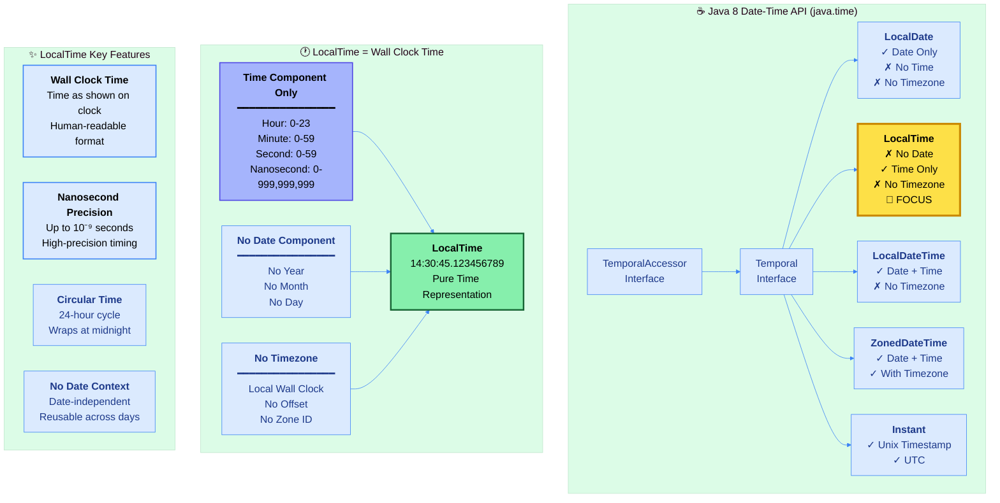
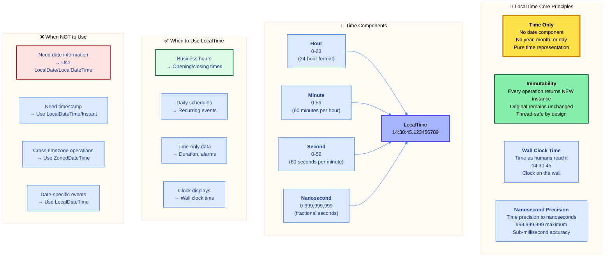
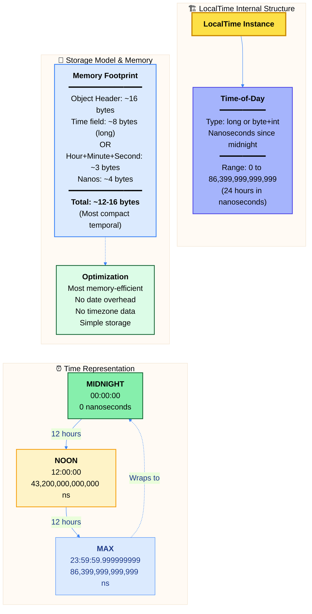

# ☕ Master Guide: Java LocalTime API - Time Without Date or Timezone

<div align="center">


</div>

<hr style="border: 1px solid rgb(98, 117, 187)">

<div align="center">
<table>
<tr>
<td align="center">
<br />

<h3>© 2026 Avinash Dhanuka</h3>
<p>Master Guide: Java Core & Frameworks</p>
<p><em>Crafted with ❤️ for Object-Oriented Architecture</em></p>

<a href="https://github.com/Avinash-706" target="_blank">

</a>

<a href="https://mail.google.com/mail/?view=cm&fs=1&to=avunashdhanuka@gmail.com&su=Java%20LocalTime%20Query&body=☕%20Hello%20Avinash,%0D%0A%0D%0AMy%20name%20is%20[Your%20Name]%20and%20I%20have%20a%20doubt%20regarding%20Java%20LocalTime%20API.%0D%0A%0D%0A🔹%20Topic:%20[LocalTime/Time%20Operations]%0D%0A🔹%20Question:%20[Type%20your%20question]%0D%0A%0D%0AThank%20you!" target="_blank">


</a>
<br />
<br />
</td>
</tr>
</table>
</div>

> **Author's Note:** This comprehensive guide explores Java 8's LocalTime API for immutable time manipulation without date or timezone complexity. Master wall-clock time representation, understand the differences from LocalDate and LocalDateTime, and learn advanced temporal operations. Includes internal architecture, nanosecond precision storage, performance characteristics, and real-world problem-solving patterns with detailed theoretical knowledge.

---

## 🕐 Java LocalTime Architecture



---

## 📑 Table of Contents
1. [LocalTime Overview - Time Without Date](#1-localtime-overview---time-without-date)
    - [Core Characteristics & Philosophy](#11-core-characteristics--philosophy)
    - [Why LocalTime Over Other Date-Time Classes](#12-why-localtime-over-other-date-time-classes)
    - [Internal Architecture & Storage Model](#13-internal-architecture--storage-model)
2. [Time Representation Fundamentals](#2-time-representation-fundamentals)
    - [24-Hour vs 12-Hour Format](#21-24-hour-vs-12-hour-format)
    - [Nanosecond-Since-Midnight Storage](#22-nanosecond-since-midnight-storage)
    - [Circular Time Concept](#23-circular-time-concept)
3. [LocalTime Creation & Factory Methods](#3-localtime-creation--factory-methods)
    - [Factory Method Patterns](#31-factory-method-patterns)
    - [Component Extraction](#32-component-extraction)
4. [Time Arithmetic Operations](#4-time-arithmetic-operations)
    - [Plus Operations - Future Times](#41-plus-operations---future-times)
    - [Minus Operations - Past Times](#42-minus-operations---past-times)
    - [Overflow & Wrapping Behavior](#43-overflow--wrapping-behavior)
5. [Parsing & Formatting](#5-parsing--formatting)
    - [ISO-8601 Time Format](#51-iso-8601-time-format)
    - [Custom Time Patterns](#52-custom-time-patterns)
6. [Comparison & Validation](#6-comparison--validation)
    - [Temporal Ordering](#61-temporal-ordering)
    - [Time Range Operations](#62-time-range-operations)
7. [With Operations & Truncation](#7-with-operations--truncation)
8. [Constants & Special Times](#8-constants--special-times)
9. [Performance & Best Practices](#9-performance--best-practices)
10. [Real-World Use Cases](#10-real-world-use-cases)

<div align="right">
<sub><em>Comprehensive notes by Avinash Dhanuka | For educational purposes</em></sub>
</div>

---

## 1. LOCALTIME OVERVIEW - Time Without Date

### 📌 Definition
**LocalTime** is an **immutable time object** representing **time-of-day without date or timezone information**. It models wall-clock time as shown on a clock - hours, minutes, seconds, and nanoseconds - independent of any specific day or geographical location. Part of Java 8's Date-Time API (JSR-310), following ISO-8601 standard for time representation.

### 1.1 Core Characteristics & Philosophy



#### 📋 Characteristics Table

| Property | Value | Details |
| :--- | :--- | :--- |
| **Package** | `java.time` | Since Java 8 (JSR-310) |
| **Mutability** | ✅ Immutable | Every operation creates new instance |
| **Thread Safety** | ✅ Thread-Safe | No synchronization required |
| **Null Support** | ❌ No Null | Use Optional<LocalTime> instead |
| **Date Component** | ❌ No Date | Only time information |
| **Time Component** | ✅ Full Time | Hour, minute, second, nanosecond |
| **Timezone** | ❌ No Timezone | Local wall clock time |
| **Format** | ISO-8601 | HH:mm:ss.SSSSSSSSS |
| **Time Precision** | Nanoseconds | 0-999,999,999 nanoseconds |
| **Range** | 24 hours | 00:00:00 to 23:59:59.999999999 |
| **Storage** | ~12 bytes | Long + int internally |

---

### 1.2 Why LocalTime Over Other Date-Time Classes

#### 🔍 Comparison Matrix

| Feature | LocalDate | LocalTime | LocalDateTime | ZonedDateTime |
| :--- | :---: | :---: | :---: | :---: |
| **Date Component** | ✅ | ❌ | ✅ | ✅ |
| **Time Component** | ❌ | ✅ | ✅ | ✅ |
| **Timezone** | ❌ | ❌ | ❌ | ✅ |
| **ISO Format** | yyyy-MM-dd | HH:mm:ss | yyyy-MM-dd'T'HH:mm:ss | Full with zone |
| **Example** | 2026-09-06 | 14:30:45 | 2026-09-06T14:30:45 | 2026-09-06T14:30:45+05:30[...] |
| **Use Case** | Dates only | Times only | Timestamps | Global times |
| **Memory Size** | ~24 bytes | ~12 bytes | ~32 bytes | ~48 bytes |
| **Precision** | Day | Nanosecond | Nanosecond | Nanosecond |


#### ✅ When to Use LocalTime

1. **Business Hours**: Store opening/closing times (9:00 AM - 5:00 PM)
2. **Daily Schedules**: Recurring events at specific times
3. **Alarms & Reminders**: Time-based triggers without dates
4. **Time Duration**: Calculate time differences
5. **Clock Displays**: Show current wall-clock time
6. **Time-Only Fields**: Database columns storing time without date
7. **Daily Patterns**: Meal times, medication schedules
8. **Timetables**: Bus/train departure times (without dates)

#### ❌ When NOT to Use LocalTime

1. **Need Date**: Events on specific days (use LocalDateTime)
2. **Timestamps**: Recording when something happened (use Instant)
3. **Appointments**: Scheduled events with dates (use LocalDateTime)
4. **Cross-Timezone**: Global coordination (use ZonedDateTime)
5. **Date-Dependent**: Events tied to specific dates

#### 🎯 LocalTime vs Other Types - Decision Guide

**Use LocalTime when:**
- Only time-of-day matters, not the date
- Representing recurring daily times
- Business hours, schedules, timetables
- Time calculations independent of dates

**Use LocalDate when:**
- Only date matters, not the time
- Birthdays, anniversaries, holidays

**Use LocalDateTime when:**
- Need both date and time
- Timestamps without timezone
- Event scheduling with date context

**Use ZonedDateTime when:**
- Need timezone awareness
- Cross-timezone coordination

---

### 1.3 Internal Architecture & Storage Model



#### 🔍 Internal Representation

LocalTime internally stores time as **nanoseconds since midnight**:

**Storage Options:**
1. **Single long field**: Nanoseconds from midnight (0 to 86,399,999,999,999)
2. **Separate fields**: Hour (byte), Minute (byte), Second (byte), Nano (int)

**Key Implementation Details:**

- **Final Fields**: All internal fields are `final`, ensuring immutability
- **Nanosecond-Based**: Time stored as nanoseconds from 00:00:00
- **No Date Reference**: No year, month, or day stored
- **No Timezone Data**: No offset or zone ID stored
- **Validation**: Constructor ensures valid time ranges
- **Efficient Storage**: Most compact temporal type (~12 bytes)

#### 🎨 Output Format

**Default toString() Format:**
```
14:30:45.123456789
━━━━━━━━━━━━━━━━━
│ HH│mm│ss│nanos  │
━━━━━━━━━━━━━━━━━
```

**Components Breakdown:**
- `14`: Hour (0-23 in 24-hour format)
- `30`: Minute (0-59)
- `45`: Second (0-59)
- `.123456789`: Nanoseconds (optional, shown if non-zero)

**Important:** No date or timezone information in output.

#### 📊 Range & Limits

| Constant | Value | Nanoseconds from Midnight | Description |
| :--- | :--- | :--- | :--- |
| **LocalTime.MIN** | 00:00:00 | 0 | Start of day (midnight) |
| **LocalTime.MIDNIGHT** | 00:00:00 | 0 | Midnight (same as MIN) |
| **LocalTime.NOON** | 12:00:00 | 43,200,000,000,000 | Noon (12 PM) |
| **LocalTime.MAX** | 23:59:59.999999999 | 86,399,999,999,999 | End of day |

**Time Range:**
- **Minimum**: 00:00:00 (midnight)
- **Maximum**: 23:59:59.999999999 (one nanosecond before next midnight)
- **Span**: 24 hours (86,400 seconds)
- **Wrapping**: Operations wrap around at midnight

---

## 2. TIME REPRESENTATION FUNDAMENTALS

### 📌 Overview
Understanding how LocalTime represents time internally and the differences between various time formats is essential for effective usage.

### 2.1 24-Hour vs 12-Hour Format

#### 📚 Format Comparison

**24-Hour Format (ISO-8601 Standard):**
- Range: 00:00 to 23:59
- No AM/PM designation needed
- Used by LocalTime internally
- Unambiguous representation
- International standard

**12-Hour Format (AM/PM):**
- Range: 12:00 AM to 11:59 PM
- Requires AM/PM marker
- Display format only
- Cultural preference (US, Canada)
- Converted from 24-hour for display

#### 📊 Hour Conversion Table

| 24-Hour | 12-Hour | Period | Nanoseconds from Midnight |
| :--- | :--- | :--- | :--- |
| 00:00 | 12:00 AM | Midnight | 0 |
| 01:00 | 01:00 AM | Early Morning | 3,600,000,000,000 |
| 11:00 | 11:00 AM | Late Morning | 39,600,000,000,000 |
| 12:00 | 12:00 PM | Noon | 43,200,000,000,000 |
| 13:00 | 01:00 PM | Afternoon | 46,800,000,000,000 |
| 18:00 | 06:00 PM | Evening | 64,800,000,000,000 |
| 23:00 | 11:00 PM | Night | 82,800,000,000,000 |
| 23:59 | 11:59 PM | End of Day | 86,340,000,000,000 |

#### 🎯 Internal Storage Format

**LocalTime Always Uses 24-Hour Format Internally:**
- Hour field: 0-23
- No AM/PM field stored
- Formatting converts to 12-hour for display
- Parsing accepts both formats

**Conversion Examples:**
```
Input (12-hour): "02:30 PM"
Internal: 14:30 (24-hour)
Storage: 52,200,000,000,000 nanoseconds from midnight

Display:
- 24-hour: 14:30
- 12-hour: 02:30 PM
```

#### ⚠️ Ambiguity in 12-Hour Format

**Midnight Ambiguity:**
- 12:00 AM = 00:00 (midnight, start of day)
- 12:01 AM = 00:01
- 11:59 PM = 23:59
- 12:00 PM = 12:00 (noon)

**Why 24-Hour is Preferred:**
- No ambiguity
- No need for AM/PM
- Continuous hour sequence
- International standard
- Better for calculations

---

### 2.2 Nanosecond-Since-Midnight Storage

#### 📌 Storage Concept

LocalTime represents time as **total nanoseconds elapsed since midnight (00:00:00)**.

**Formula:**
```
Total Nanoseconds = (hour × 3,600,000,000,000) 
                  + (minute × 60,000,000,000)
                  + (second × 1,000,000,000)
                  + nanoseconds
```

#### 📊 Calculation Examples

| Time | Calculation | Total Nanoseconds |
| :--- | :--- | :--- |
| 00:00:00 | 0 | 0 |
| 00:00:01 | 1 second | 1,000,000,000 |
| 00:01:00 | 1 minute | 60,000,000,000 |
| 01:00:00 | 1 hour | 3,600,000,000,000 |
| 12:00:00 | 12 hours | 43,200,000,000,000 |
| 14:30:45.123456789 | (14×3600 + 30×60 + 45)×10⁹ + 123456789 | 52,245,123,456,789 |
| 23:59:59.999999999 | Maximum | 86,399,999,999,999 |

#### 🔍 Why Nanoseconds?

**Advantages:**
1. **Single Value Storage**: One long field instead of multiple fields
2. **Efficient Comparison**: Simple numeric comparison
3. **Precise Arithmetic**: Accurate time calculations
4. **Sub-Millisecond Precision**: Support for high-precision timing
5. **Standard Approach**: Aligns with system time representations

**Precision Benefits:**
```
1 second = 1,000,000,000 nanoseconds
1 millisecond = 1,000,000 nanoseconds
1 microsecond = 1,000 nanoseconds
1 nanosecond = finest precision available
```

#### 📋 Component Extraction

**From Nanoseconds to Components:**

Given total nanoseconds N:
```
Hour = N / 3,600,000,000,000
Remaining = N % 3,600,000,000,000

Minute = Remaining / 60,000,000,000
Remaining = Remaining % 60,000,000,000

Second = Remaining / 1,000,000,000
Nanosecond = Remaining % 1,000,000,000
```

**Example:**
```
Total: 52,245,123,456,789 nanoseconds

Hour = 52,245,123,456,789 / 3,600,000,000,000 = 14
Remaining = 52,245,123,456,789 % 3,600,000,000,000 = 1,845,123,456,789

Minute = 1,845,123,456,789 / 60,000,000,000 = 30
Remaining = 1,845,123,456,789 % 60,000,000,000 = 45,123,456,789

Second = 45,123,456,789 / 1,000,000,000 = 45
Nanosecond = 45,123,456,789 % 1,000,000,000 = 123,456,789

Result: 14:30:45.123456789
```

---

### 2.3 Circular Time Concept

#### 📌 24-Hour Cycle

**Concept:** Time wraps around at midnight - after 23:59:59.999999999 comes 00:00:00.

```mermaid
%%{init: {
  "theme": "base",
  "themeVariables": {
    "primaryColor": "#dbeafe",
    "primaryTextColor": "#1e3a8a",
    "primaryBorderColor": "#3b82f6",
    "lineColor": "#3b82f6",
    "fontSize": "14px"
  }
}}%%

graph TB
    subgraph Circular_Time["⏰ 24-Hour Circular Time"]
        Midnight1["<b>00:00:00</b><br/>MIDNIGHT<br/>Start of Day"]
        
        Morning["<b>06:00:00</b><br/>Morning<br/>Quarter past midnight"]
        
        Noon1["<b>12:00:00</b><br/>NOON<br/>Halfway through day"]
        
        Evening["<b>18:00:00</b><br/>Evening<br/>Three quarters"]
        
        Midnight2["<b>23:59:59</b><br/>End of Day<br/>Wraps to 00:00:00"]
        
        Midnight1 -->|+6 hours| Morning
        Morning -->|+6 hours| Noon1
        Noon1 -->|+6 hours| Evening
        Evening -->|+6 hours| Midnight2
        Midnight2 -.->|Wraps Around| Midnight1
    end
    
    subgraph Overflow_Behavior["🔄 Overflow Behavior"]
        Add["Adding Time<br/>May wrap forward"]
        Subtract["Subtracting Time<br/>May wrap backward"]
        
        Add -->|Example| Ex1["23:00 + 2 hours<br/>= 01:00 next day<br/>(wraps forward)"]
        Subtract -->|Example| Ex2["01:00 - 2 hours<br/>= 23:00 previous day<br/>(wraps backward)"]
    end
    
    style Midnight1 fill:#86efac,stroke:#166534,stroke-width:3px,color:#000
    style Noon1 fill:#fde047,stroke:#ca8a04,stroke-width:2px,color:#000
    style Midnight2 fill:#fca5a5,stroke:#dc2626,stroke-width:2px,color:#000
    style Ex1 fill:#dbeafe,stroke:#3b82f6,stroke-width:2px,color:#000
    style Ex2 fill:#fef3c7,stroke:#f59e0b,stroke-width:2px,color:#000
```



#### 🔄 Wrapping Examples

**Addition Wrapping:**

| Start Time | Add | Raw Result | Wrapped Result |
| :--- | :--- | :--- | :--- |
| 22:00:00 | +3 hours | 25:00:00 | 01:00:00 (next day) |
| 23:30:00 | +1 hour | 24:30:00 | 00:30:00 (next day) |
| 23:59:59 | +1 second | 24:00:00 | 00:00:00 (next day) |
| 20:00:00 | +30 hours | 50:00:00 | 02:00:00 (wraps once) |

**Subtraction Wrapping:**

| Start Time | Subtract | Raw Result | Wrapped Result |
| :--- | :--- | :--- | :--- |
| 02:00:00 | -3 hours | -01:00:00 | 23:00:00 (previous day) |
| 00:30:00 | -1 hour | -00:30:00 | 23:30:00 (previous day) |
| 00:00:00 | -1 second | -00:00:01 | 23:59:59 (previous day) |
| 04:00:00 | -30 hours | -26:00:00 | 22:00:00 (wraps once) |

#### 🎯 Important Behaviors

**No Date Change:**
- LocalTime doesn't know about dates
- Wrapping doesn't change the day (no day concept)
- Application must track day changes separately

**Multiple Wraps:**
- Can wrap multiple times with large values
- LocalTime only stores final time-of-day
- Example: 10:00 + 50 hours = 12:00 (wraps twice)

**Comparison After Wrapping:**
- 23:00 < 01:00 (without context)
- Must consider day context for meaningful comparison
- LocalTime comparison is only valid within same day


---

## 3. LOCALTIME CREATION & Factory Methods

### 📌 Overview
LocalTime provides multiple factory methods for creating instances from current time, explicit components, parsing strings, or deriving from other temporal types.

### 3.1 Factory Method Patterns

#### 📋 Factory Methods Reference

| Method | Signature | Use Case | Example Output |
| :--- | :--- | :--- | :--- |
| **now()** | `static LocalTime now()` | Current time | 14:30:45.123456789 |
| **now(ZoneId)** | `static LocalTime now(ZoneId zone)` | Current time in timezone | `now(ZoneId.of("Asia/Tokyo"))` |
| **of()** | `static LocalTime of(int hour, int minute)` | Create specific time | `of(14, 30)` |
| **of(h, m, s)** | `static LocalTime of(int h, int m, int s)` | With seconds | `of(14, 30, 45)` |
| **of(h, m, s, n)** | `static LocalTime of(int h, int m, int s, int n)` | With nanoseconds | `of(14, 30, 45, 123456789)` |
| **parse()** | `static LocalTime parse(CharSequence)` | Parse ISO-8601 | `parse("14:30:45")` |
| **parse(formatter)** | `static LocalTime parse(CharSequence, DateTimeFormatter)` | Custom format | `parse("02:30 PM", formatter)` |
| **ofSecondOfDay()** | `static LocalTime ofSecondOfDay(long)` | From second of day | `ofSecondOfDay(52245)` |
| **ofNanoOfDay()** | `static LocalTime ofNanoOfDay(long)` | From nanosecond of day | `ofNanoOfDay(52245123456789L)` |
| **from()** | `static LocalTime from(TemporalAccessor)` | Convert temporal object | `from(temporal)` |

#### 🎯 Factory Method Categories

**1. Current Time:**
- `now()` - System default timezone
- `now(Clock)` - Custom clock
- `now(ZoneId)` - Specific timezone

**2. Explicit Components:**
- `of(hour, minute)` - Hours and minutes only
- `of(hour, minute, second)` - With seconds
- `of(hour, minute, second, nano)` - Full precision

**3. From Other Types:**
- `parse(String)` - From ISO-8601 string
- `parse(String, DateTimeFormatter)` - Custom format
- `from(TemporalAccessor)` - From temporal object

**4. From Time Units:**
- `ofSecondOfDay(long)` - Seconds since midnight
- `ofNanoOfDay(long)` - Nanoseconds since midnight

**5. Constants:**
- `LocalTime.MIN` / `LocalTime.MIDNIGHT` - 00:00:00
- `LocalTime.NOON` - 12:00:00
- `LocalTime.MAX` - 23:59:59.999999999

#### 🔍 Creation Strategy Guidelines

**1. Current Time:**
```
System time: LocalTime.now()
Specific zone: LocalTime.now(ZoneId.of("Asia/Kolkata"))
```

**2. Explicit Creation:**
```
Hour + Minute: LocalTime.of(14, 30)
With Seconds: LocalTime.of(14, 30, 45)
Full Precision: LocalTime.of(14, 30, 45, 123456789)
```

**3. From String:**
```
ISO format: LocalTime.parse("14:30:45")
Custom format: LocalTime.parse("02:30 PM", formatter)
```

**4. From Time-of-Day Values:**
```
Seconds: LocalTime.ofSecondOfDay(52245) → 14:30:45
Nanoseconds: LocalTime.ofNanoOfDay(52245000000000L) → 14:30:45
```

---

### 3.2 Component Extraction

#### 📋 Accessor Methods

| Method | Return Type | Description | Example Output |
| :--- | :--- | :--- | :--- |
| **getHour()** | int | Get hour (0-23) | 14 |
| **getMinute()** | int | Get minute (0-59) | 30 |
| **getSecond()** | int | Get second (0-59) | 45 |
| **getNano()** | int | Get nanosecond (0-999,999,999) | 123456789 |
| **toSecondOfDay()** | int | Total seconds since midnight | 52245 |
| **toNanoOfDay()** | long | Total nanoseconds since midnight | 52245123456789 |
| **format(DateTimeFormatter)** | String | Format to string | "14:30:45" |

#### 🔄 Conversion Methods

**To Other Types:**

| Method | Return Type | Purpose |
| :--- | :--- | :--- |
| **atDate(LocalDate)** | LocalDateTime | Combine with date |
| **atOffset(ZoneOffset)** | OffsetTime | Add timezone offset |

**From Other Types:**

| Source | Method | Example |
| :--- | :--- | :--- |
| **LocalDateTime** | `toLocalTime()` | `dateTime.toLocalTime()` |
| **OffsetTime** | `toLocalTime()` | `offsetTime.toLocalTime()` |
| **ZonedDateTime** | `toLocalTime()` | `zonedDateTime.toLocalTime()` |

#### 📊 Component Extraction Examples

**Example Time:** 14:30:45.123456789

| Method | Result | Notes |
| :--- | :--- | :--- |
| `getHour()` | 14 | 2 PM in 24-hour format |
| `getMinute()` | 30 | Half past the hour |
| `getSecond()` | 45 | 45 seconds |
| `getNano()` | 123456789 | Fractional seconds |
| `toSecondOfDay()` | 52245 | (14×3600) + (30×60) + 45 |
| `toNanoOfDay()` | 52245123456789 | Total nanos from midnight |

---

## 4. TIME ARITHMETIC OPERATIONS

### 📌 Overview
LocalTime provides **immutable arithmetic operations** for time calculations. Every operation returns a **new LocalTime instance**, and operations automatically wrap around at midnight.

### 4.1 Plus Operations - Future Times

#### 📋 Plus Methods Reference

| Method | Description | Example |
| :--- | :--- | :--- |
| **plusHours(long)** | Add hours | `time.plusHours(2)` |
| **plusMinutes(long)** | Add minutes | `time.plusMinutes(30)` |
| **plusSeconds(long)** | Add seconds | `time.plusSeconds(45)` |
| **plusNanos(long)** | Add nanoseconds | `time.plusNanos(1000000)` |
| **plus(long, TemporalUnit)** | Add any time unit | `time.plus(2, ChronoUnit.HOURS)` |
| **plus(Duration)** | Add duration | `time.plus(Duration.ofHours(2))` |

#### 📊 Plus Operations Examples

| Start Time | Operation | Raw Result | Final Result | Wrapped? |
| :--- | :--- | :--- | :--- | :--- |
| 10:00:00 | plusHours(2) | 12:00:00 | 12:00:00 | ❌ No |
| 22:00:00 | plusHours(3) | 25:00:00 | 01:00:00 | ✅ Yes |
| 23:45:00 | plusMinutes(30) | 24:15:00 | 00:15:00 | ✅ Yes |
| 14:30:45 | plusSeconds(30) | 14:31:15 | 14:31:15 | ❌ No |
| 23:59:59 | plusSeconds(1) | 24:00:00 | 00:00:00 | ✅ Yes |

#### 🔗 Method Chaining

```
Start: 10:00:00

Chained:
time.plusHours(2)
    .plusMinutes(30)
    .plusSeconds(15)

Result: 12:30:15
```

---

### 4.2 Minus Operations - Past Times

#### 📋 Minus Methods Reference

| Method | Description | Example |
| :--- | :--- | :--- |
| **minusHours(long)** | Subtract hours | `time.minusHours(2)` |
| **minusMinutes(long)** | Subtract minutes | `time.minusMinutes(30)` |
| **minusSeconds(long)** | Subtract seconds | `time.minusSeconds(45)` |
| **minusNanos(long)** | Subtract nanoseconds | `time.minusNanos(1000000)` |
| **minus(long, TemporalUnit)** | Subtract any time unit | `time.minus(2, ChronoUnit.HOURS)` |
| **minus(Duration)** | Subtract duration | `time.minus(Duration.ofHours(2))` |

#### 📊 Minus Operations Examples

| Start Time | Operation | Raw Result | Final Result | Wrapped? |
| :--- | :--- | :--- | :--- | :--- |
| 14:00:00 | minusHours(2) | 12:00:00 | 12:00:00 | ❌ No |
| 02:00:00 | minusHours(3) | -01:00:00 | 23:00:00 | ✅ Yes |
| 00:15:00 | minusMinutes(30) | -00:15:00 | 23:45:00 | ✅ Yes |
| 14:30:00 | minusSeconds(45) | 14:29:15 | 14:29:15 | ❌ No |
| 00:00:00 | minusSeconds(1) | -00:00:01 | 23:59:59 | ✅ Yes |

---

### 4.3 Overflow & Wrapping Behavior

#### 📌 Understanding Wrapping

**Key Concept:** LocalTime operations wrap around at midnight boundaries since time is circular (24-hour cycle).

#### 📊 Wrapping Rules

**Forward Wrapping (Addition):**
```
Rule: If result ≥ 24:00:00, subtract 24 hours repeatedly
Examples:
  10:00 + 15 hours = 25:00 → 01:00 (wrapped once)
  10:00 + 40 hours = 50:00 → 02:00 (wrapped twice)
```

**Backward Wrapping (Subtraction):**
```
Rule: If result < 00:00:00, add 24 hours repeatedly
Examples:
  10:00 - 12 hours = -02:00 → 22:00 (wrapped once)
  10:00 - 35 hours = -25:00 → 23:00 (wrapped twice)
```

#### ⚠️ Important Considerations

**No Date Awareness:**
- LocalTime doesn't track which day
- Application must handle date changes
- Wrapping indicates crossing midnight

**Duration Calculation:**
- Between two LocalTimes might be ambiguous
- 22:00 to 02:00 could be:
  - 4 hours forward (same day wrapping)
  - 20 hours backward (different context)
- Use Duration.between() with caution

**Comparison Limitation:**
- 23:00 < 01:00 (numerically)
- But without date context, meaning unclear
- Must ensure same-day context for valid comparison

#### 🎯 Practical Examples

**Example 1: Business Hours Crossing Midnight**
```
Shift Start: 22:00 (10 PM)
Shift Duration: 8 hours
Shift End: 22:00 + 8 hours = 06:00 (6 AM next day)

Wrapped at midnight!
```

**Example 2: Time Until Event**
```
Current: 23:30
Event: 01:00

Simple calculation: 01:00 - 23:30 = -22:30 → wraps to 01:30
Interpretation: 1 hour 30 minutes (crossing midnight)
```

---

## 5. PARSING & FORMATTING

### 📌 Overview
LocalTime supports bidirectional conversion between time values and strings using ISO-8601 standard format and custom patterns.

### 5.1 ISO-8601 Time Format

#### 📋 ISO-8601 Time Format Structure

**Standard Format:** `HH:mm:ss.SSSSSSSSS`

| Component | Format | Range | Example |
| :--- | :--- | :--- | :--- |
| **Hour** | HH | 00-23 | 14 |
| **Separator** | : | Colon | : |
| **Minute** | mm | 00-59 | 30 |
| **Separator** | : | Colon | : |
| **Second** | ss | 00-59 | 45 |
| **Fractional** | .SSSSSSSSS | Nanoseconds (optional) | .123456789 |

**Format Variations:**

| Format | Example | Precision |
| :--- | :--- | :--- |
| **Hour:Minute** | 14:30 | Minute |
| **Hour:Minute:Second** | 14:30:45 | Second |
| **With Milliseconds** | 14:30:45.123 | Millisecond |
| **With Microseconds** | 14:30:45.123456 | Microsecond |
| **With Nanoseconds** | 14:30:45.123456789 | Nanosecond |

#### ⚠️ Parsing Requirements

**Valid ISO-8601 Time Formats:**
- ✅ "14:30" - Hour and minute
- ✅ "14:30:45" - With seconds
- ✅ "14:30:45.123" - With fractional seconds
- ✅ "14:30:45.123456789" - Full nanosecond precision

**Invalid Formats:**
- ❌ "14:30:45 PM" - No AM/PM in ISO format
- ❌ "2:30" - Missing leading zero
- ❌ "14" - Missing minutes

---

### 5.2 Custom Time Patterns

#### 📋 DateTimeFormatter Pattern Symbols

**Time Patterns:**

| Symbol | Meaning | Example |
| :--- | :--- | :--- |
| **H** | Hour (0-23) | 14 |
| **HH** | Hour (00-23) with leading zero | 14 |
| **h** | Hour (1-12) | 2 |
| **hh** | Hour (01-12) with leading zero | 02 |
| **m** | Minute | 30 |
| **mm** | Minute with leading zero | 30 |
| **s** | Second | 45 |
| **ss** | Second with leading zero | 45 |
| **S** | Fractional second (1-9 digits) | 123456789 |
| **a** | AM/PM marker | PM |

#### 📊 Common Time Format Patterns

| Pattern | Example Output | Use Case |
| :--- | :--- | :--- |
| **HH:mm** | 14:30 | Simple time display |
| **HH:mm:ss** | 14:30:45 | With seconds |
| **hh:mm a** | 02:30 PM | 12-hour with AM/PM |
| **h:mm a** | 2:30 PM | Without leading zero |
| **HH:mm:ss.SSS** | 14:30:45.123 | With milliseconds |
| **HH 'hours' mm 'minutes'** | 14 hours 30 minutes | Custom text |
| **'Time:' HH:mm:ss** | Time: 14:30:45 | With label |

#### 🎯 Formatter Best Practices

**1. Predefined Formatters:**
```
DateTimeFormatter.ISO_LOCAL_TIME
```

**2. Custom Patterns:**
```
private static final DateTimeFormatter TIME_FORMATTER = 
    DateTimeFormatter.ofPattern("HH:mm:ss");
```

**3. Reuse Formatters:**
```
Thread-safe and efficient
Create once, use multiple times
```

---

## 6. COMPARISON & VALIDATION

### 📌 Overview
LocalTime provides comparison methods for temporal ordering, but comparisons are only meaningful within the same day context.

### 6.1 Temporal Ordering

#### 📋 Comparison Methods Reference

| Method | Return | Description | Example Usage |
| :--- | :--- | :--- | :--- |
| **isBefore(LocalTime)** | boolean | True if this time is before other | `time1.isBefore(time2)` |
| **isAfter(LocalTime)** | boolean | True if this time is after other | `time1.isAfter(time2)` |
| **compareTo(LocalTime)** | int | -1 (before), 0 (equal), 1 (after) | `time1.compareTo(time2)` |
| **equals(Object)** | boolean | Object equality | `time1.equals(time2)` |

#### 🔍 Comparison Logic

**Comparison Order:**
1. **Hour** → **Minute** → **Second** → **Nanosecond**

**Examples:**
```
14:30:00 < 14:30:01  // Same time, 1 second later
14:29:59 < 14:30:00  // One second before
23:59:59 < 00:00:00  // End of day < Start of day (numerically)
```

#### ⚠️ Context Limitations

**Same-Day Context Required:**
- Comparison assumes both times are on same day
- 23:00 < 01:00 numerically, but may represent next day
- Application must provide date context for accuracy

---

### 6.2 Time Range Operations

#### 📌 Range Checks

**Common Pattern: Check if time is within range**

```
Business Hours Example:
Start: 09:00
End: 17:00
Check: 14:30

Validation:
- check.isAfter(start) || check.equals(start) → true
- check.isBefore(end) → true
- Result: Within range ✅
```

#### 📊 Range Check Patterns

| Pattern | Description | Example |
| :--- | :--- | :--- |
| **Exclusive Range** | start < x < end | `time.isAfter(start) && time.isBefore(end)` |
| **Inclusive Range** | start ≤ x ≤ end | `!time.isBefore(start) && !time.isAfter(end)` |
| **Half-Open Range** | start ≤ x < end | `!time.isBefore(start) && time.isBefore(end)` |

#### ⚠️ Midnight-Crossing Ranges

**Problem:** Range that crosses midnight (e.g., 22:00 to 02:00)

**Solution Approaches:**

1. **Split Range:**
   ```
   Check: (time >= 22:00 AND time <= 23:59) 
      OR (time >= 00:00 AND time <= 02:00)
   ```

2. **Use LocalDateTime:**
   ```
   Include date to avoid ambiguity
   ```

3. **Normalize to Same Day:**
   ```
   Adjust end time by adding 24 hours conceptually
   ```


---

## 7. WITH OPERATIONS & TRUNCATION

### 📌 Overview
LocalTime provides **with()** operations for modifying specific time components while preserving immutability, and truncation for removing precision.

### 7.1 With Operations

#### 📋 With Methods Reference

| Method | Description | Example |
| :--- | :--- | :--- |
| **withHour(int)** | Set hour (0-23) | `time.withHour(18)` |
| **withMinute(int)** | Set minute (0-59) | `time.withMinute(0)` |
| **withSecond(int)** | Set second (0-59) | `time.withSecond(0)` |
| **withNano(int)** | Set nanosecond (0-999,999,999) | `time.withNano(0)` |
| **with(TemporalField, long)** | Set field value | `time.with(ChronoField.HOUR_OF_DAY, 18)` |

#### 🎯 Practical Use Cases

**1. Reset to Hour:**
```
Original: 14:30:45.123456789
withMinute(0).withSecond(0).withNano(0)
Result: 14:00:00
```

**2. Set to Top of Hour:**
```
time.withMinute(0).withSecond(0).withNano(0)
```

**3. Change Hour, Keep Rest:**
```
Original: 14:30:45
withHour(18)
Result: 18:30:45
```

**4. Precision Adjustment:**
```
Original: 14:30:45.123456789
withNano(0)
Result: 14:30:45 (remove fractional seconds)
```

---

### 7.2 Truncation Operations

#### 📋 Truncation Method

**Method:** `truncatedTo(TemporalUnit unit)`

**Supported Units:**

| Unit | Truncates | Example: 14:30:45.123456789 |
| :--- | :--- | :--- |
| **HOURS** | Below hours | 14:00:00 |
| **MINUTES** | Below minutes | 14:30:00 |
| **SECONDS** | Below seconds | 14:30:45 |
| **MILLIS** | Below milliseconds | 14:30:45.123000000 |
| **MICROS** | Below microseconds | 14:30:45.123456000 |
| **NANOS** | No change | 14:30:45.123456789 |

**Use Cases:**
- **Remove Precision**: Truncate to second/minute for display
- **Database Compatibility**: Match database time precision
- **Comparison**: Compare at specific precision level
- **Rounding**: Round to nearest unit

#### 🎯 Truncation Examples

```
Original: 14:30:45.123456789

truncatedTo(ChronoUnit.HOURS)   → 14:00:00
truncatedTo(ChronoUnit.MINUTES) → 14:30:00
truncatedTo(ChronoUnit.SECONDS) → 14:30:45
truncatedTo(ChronoUnit.MILLIS)  → 14:30:45.123
```

---

## 8. CONSTANTS & SPECIAL TIMES

### 📌 Overview
LocalTime provides predefined constants for commonly used times, making code more readable and preventing magic numbers.

### 8.1 Predefined Constants

#### 📋 Constant Reference

| Constant | Value | Nanoseconds | Description |
| :--- | :--- | :--- | :--- |
| **LocalTime.MIN** | 00:00:00 | 0 | Start of day (minimum time) |
| **LocalTime.MIDNIGHT** | 00:00:00 | 0 | Midnight (same as MIN) |
| **LocalTime.NOON** | 12:00:00 | 43,200,000,000,000 | Noon (12 PM) |
| **LocalTime.MAX** | 23:59:59.999999999 | 86,399,999,999,999 | End of day (maximum time) |

#### 🎯 Usage Examples

**1. Time Range Validation:**
```
Check if time is valid:
if (time.equals(LocalTime.MIN)) {
    // Midnight
}
```

**2. Default Values:**
```
Use constants instead of creating new instances:
LocalTime startOfDay = LocalTime.MIDNIGHT;
LocalTime midDay = LocalTime.NOON;
```

**3. Boundary Checks:**
```
if (time.equals(LocalTime.MAX)) {
    // End of day
}
```

**4. Range Operations:**
```
Full day range:
Start: LocalTime.MIN (00:00:00)
End: LocalTime.MAX (23:59:59.999999999)
```

#### 📊 Constant Comparison

| Comparison | Result | Notes |
| :--- | :--- | :--- |
| MIN.equals(MIDNIGHT) | true | Same value |
| MIN.isBefore(NOON) | true | Midnight before noon |
| NOON.isBefore(MAX) | true | Noon before end of day |
| MAX.plusNanos(1) | MIN | Wraps to midnight |

---

## 9. PERFORMANCE & BEST PRACTICES

### 📌 Overview
Understanding LocalTime's performance characteristics ensures efficient time operations in production applications.

### 9.1 Performance Characteristics

#### 📊 Performance Comparison Table

| Operation | Time Complexity | Memory | Notes |
| :--- | :--- | :--- | :--- |
| **Creation (now)** | O(1) | ~12 bytes | System clock call |
| **Creation (of)** | O(1) | ~12 bytes | Validation + creation |
| **Creation (parse)** | O(n) | ~12 bytes | Proportional to string length |
| **Arithmetic** | O(1) | +12 bytes | New instance created |
| **Comparison** | O(1) | 0 bytes | Numeric comparison |
| **Formatting** | O(n) | Variable | Depends on pattern |
| **With operations** | O(1) | +12 bytes | New instance created |
| **Truncation** | O(1) | +12 bytes | New instance created |

#### 📋 Memory Comparison

| Type | Memory per Instance | Components |
| :--- | :--- | :--- |
| **LocalTime** | ~12 bytes | Time only (most compact) |
| **LocalDate** | ~24 bytes | Date only |
| **LocalDateTime** | ~32 bytes | Date + Time |
| **ZonedDateTime** | ~48 bytes | Date + Time + Zone |
| **Instant** | ~32 bytes | Epoch + Nanos |

**Memory Efficiency:**
- LocalTime is **most compact** temporal type
- No date overhead
- No timezone data
- Optimal for time-only storage

---

### 9.2 Best Practices

#### ✅ Do's and Don'ts

| Practice | ✅ Do | ❌ Don't |
| :--- | :--- | :--- |
| **Immutability** | `time = time.plusHours(2)` | `time.plusHours(2);` // Result lost |
| **Null Safety** | `Optional<LocalTime>` | `LocalTime time = null;` |
| **Formatters** | Reuse DateTimeFormatter (static final) | Create formatter in loop |
| **Comparison** | `isBefore()`, `isAfter()` | String comparison |
| **Constants** | Use LocalTime.NOON | `LocalTime.of(12, 0)` repeatedly |
| **Truncation** | `truncatedTo(ChronoUnit.SECONDS)` | Manual field zeroing |

#### 🎯 Common Patterns

**1. Business Hours Check:**
```
private static final LocalTime OPENING = LocalTime.of(9, 0);
private static final LocalTime CLOSING = LocalTime.of(17, 0);

boolean isDuringBusinessHours(LocalTime time) {
    return !time.isBefore(OPENING) && time.isBefore(CLOSING);
}
```

**2. Time-Only Formatting:**
```
private static final DateTimeFormatter TIME_FORMATTER = 
    DateTimeFormatter.ofPattern("HH:mm:ss");

String formatted = time.format(TIME_FORMATTER);
```

**3. Midnight Check:**
```
if (time.equals(LocalTime.MIDNIGHT)) {
    // Handle midnight
}
```

**4. Time Duration Between:**
```
Duration between = Duration.between(startTime, endTime);
long minutes = between.toMinutes();
```

#### 🔒 Thread Safety

**LocalTime is thread-safe:**
- Immutable by design
- All fields are `final`
- Safe to share across threads
- No synchronization needed

**Safe Patterns:**
```
✅ private static final LocalTime OPENING_TIME = LocalTime.of(9, 0);
✅ public void process(LocalTime time) { ... }
✅ return LocalTime.now();
✅ Map<String, LocalTime> schedule = new HashMap<>();
```

---

## 10. REAL-WORLD USE CASES

### 📌 Overview
LocalTime excels in scenarios requiring time-of-day representation without date or timezone complexity.

### 10.1 Common Use Cases

#### 📋 Use Case Categories

| Domain | Use Cases | Operations |
| :--- | :--- | :--- |
| **Business Hours** | Opening/closing times, work shifts | of(), comparison, validation |
| **Scheduling** | Daily recurring events, timetables | of(), arithmetic, comparison |
| **Alarms & Reminders** | Daily alarms, medication reminders | of(), comparison, triggering |
| **Transportation** | Bus/train departure times | of(), formatting, comparison |
| **Healthcare** | Medication schedules, visiting hours | of(), comparison, validation |
| **Education** | Class schedules, bell times | of(), formatting, comparison |
| **Broadcasting** | TV/radio program times | of(), arithmetic, display |
| **Cooking** | Recipe timing, cooking durations | arithmetic, formatting |
| **Sports** | Game start times, training schedules | of(), comparison, display |
| **Time Tracking** | Work hours, break times | arithmetic, duration calculation |

#### 🎯 Practical Examples

**1. Business Hours Management:**
```
Store: Opening 09:00, Closing 17:00
Operations: Check if currently open, calculate hours open
```

**2. Daily Medication Schedule:**
```
Morning: 08:00
Afternoon: 14:00
Evening: 20:00
Operations: Check if medication time, set reminders
```

**3. Public Transport Timetable:**
```
Bus departures: 06:30, 07:15, 08:00, 08:45...
Operations: Find next departure, calculate wait time
```

**4. Class Schedule:**
```
Period 1: 08:00-08:45
Period 2: 08:50-09:35
Break: 09:35-09:50
Operations: Check current period, time to next class
```

**5. TV Program Schedule:**
```
News: 18:00
Series: 19:00
Movie: 21:00
Operations: Display schedule, check what's on now
```

**6. Work Shift Management:**
```
Morning Shift: 06:00-14:00
Evening Shift: 14:00-22:00
Night Shift: 22:00-06:00
Operations: Calculate shift hours, check overlap
```

**7. Cooking Timer:**
```
Start: 14:00
Cooking Time: 45 minutes
Finish: 14:45
Operations: Calculate finish time, set timer
```

**8. Sports Training Schedule:**
```
Warmup: 16:00
Training: 16:30
Cooldown: 18:00
Operations: Track progress, time remaining
```

#### 🎯 Implementation Patterns

**Pattern 1: Time Range Check**
```
Check if current time is within business hours:
LocalTime now = LocalTime.now();
LocalTime opening = LocalTime.of(9, 0);
LocalTime closing = LocalTime.of(17, 0);

boolean isOpen = !now.isBefore(opening) && now.isBefore(closing);
```

**Pattern 2: Next Occurrence**
```
Find next departure time:
List<LocalTime> departures = Arrays.asList(
    LocalTime.of(6, 30),
    LocalTime.of(7, 15),
    LocalTime.of(8, 0)
);

LocalTime now = LocalTime.now();
LocalTime next = departures.stream()
    .filter(t -> t.isAfter(now))
    .findFirst()
    .orElse(departures.get(0)); // Wrap to next day
```

**Pattern 3: Duration Calculation**
```
Calculate work hours:
LocalTime start = LocalTime.of(9, 0);
LocalTime end = LocalTime.of(17, 0);

Duration workDuration = Duration.between(start, end);
long hours = workDuration.toHours(); // 8 hours
```

---

## 📚 Summary

### Quick Reference Card

| Aspect | Details |
| :--- | :--- |
| **Package** | `java.time` (Java 8+) |
| **Purpose** | Immutable time without date or timezone |
| **Format** | ISO-8601 (HH:mm:ss.SSSSSSSSS) |
| **Thread Safety** | ✅ Thread-safe (immutable) |
| **Null Support** | ❌ Use Optional<LocalTime> |
| **Memory** | ~12 bytes per instance (most compact) |
| **Performance** | O(1) for most operations |
| **Precision** | Nanosecond (0-999,999,999) |
| **Range** | 00:00:00 to 23:59:59.999999999 |

### Key Takeaways

1. **Time Only**: No date or timezone information
2. **Immutability**: Every operation returns new instance
3. **Nanosecond Precision**: Up to 999,999,999 nanoseconds
4. **Circular Time**: 24-hour cycle with wrapping at midnight
5. **Wall Clock**: Represents time as shown on clock
6. **Most Compact**: Smallest temporal type (~12 bytes)
7. **Constants Available**: MIN, MIDNIGHT, NOON, MAX
8. **ISO-8601 Format**: Standard HH:mm:ss format

### LocalTime vs Other Types Quick Comparison

| Feature | LocalTime | LocalDate | LocalDateTime |
| :--- | :--- | :--- | :--- |
| **Components** | Time only | Date only | Date + Time |
| **Format** | HH:mm:ss | yyyy-MM-dd | yyyy-MM-dd'T'HH:mm:ss |
| **Use Case** | Wall clock time | Dates | Timestamps |
| **Memory** | ~12 bytes | ~24 bytes | ~32 bytes |
| **Precision** | Nanosecond | Day | Nanosecond |
| **Wrapping** | At midnight | No wrapping | No wrapping |

---

<div align="center">

<table style="border: 2px solid #3b82f6; border-radius: 10px; padding: 5px; margin: 20px auto; max-width: 600px;">
<tr>
<td align="center" style="padding: 10px;">

## 🕐 Master LocalTime Principles
<br/>


**Time Only** → No date or timezone complexity  
**Immutability** → Thread-safe, predictable behavior  
**Nanosecond Precision** → High-precision time tracking  
**Circular Time** → 24-hour cycle with midnight wrapping  
**Most Compact** → Smallest temporal type at ~12 bytes

---

## 🎯 When to Use LocalTime

**✅ Use LocalTime for:**
- Business hours (opening/closing times)
- Daily schedules and timetables
- Alarms and reminders
- Time-only database fields
- Clock displays
- Time duration calculations

**❌ Avoid LocalTime when:**
- Need date information → Use LocalDate/LocalDateTime
- Need timestamps → Use LocalDateTime/Instant
- Cross-timezone operations → Use ZonedDateTime

---

## 🔄 Core Time Concepts

```
24-Hour Cycle:
00:00:00 (MIDNIGHT) → ... → 12:00:00 (NOON) → ... → 23:59:59 (MAX) → 00:00:00
                                                                     ↑
                                                                  Wraps Around
```

**Storage:** Nanoseconds since midnight (0 to 86,399,999,999,999)  
**Format:** ISO-8601 (HH:mm:ss.SSSSSSSSS)  
**Precision:** Nanosecond (10⁻⁹ seconds)

---

## 📘 Related Topics

**Previous:** Master **LocalDate API** - date-only operations without time or timezone complexity

**Current:** Master **LocalTime API** - time-only operations with nanosecond precision

**Next:** Master **LocalDateTime API** - combining date and time without timezone

**Preview:** LocalDateTime = LocalDate + LocalTime (combined timestamp)

---

## 🔗 Additional Resources

**Java Documentation:**  
[LocalTime JavaDoc](https://docs.oracle.com/javase/8/docs/api/java/time/LocalTime.html)

**ISO-8601 Standard:**  
[https://www.iso.org/iso-8601-date-and-time-format.html](https://www.iso.org/iso-8601-date-and-time-format.html)

**Time Representation:**  
[https://en.wikipedia.org/wiki/ISO_8601#Times](https://en.wikipedia.org/wiki/ISO_8601#Times)

---

<sub>**© 2026 Avinash Dhanuka** | Java LocalTime API Master Guide</sub>

<sub>📧 [avunashdhanuka@gmail.com](mailto:avunashdhanuka@gmail.com) | 🔗 [GitHub: Avinash-706](https://github.com/Avinash-706)</sub>

<br/>

</td>
</tr>
</table>

</div>
