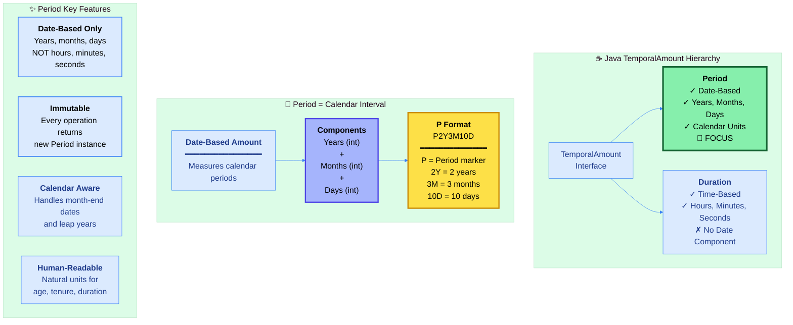
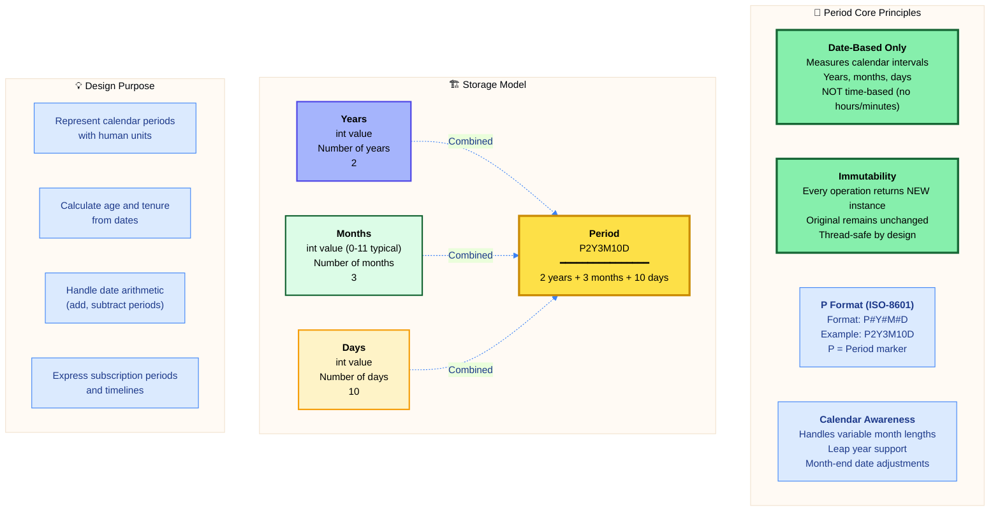
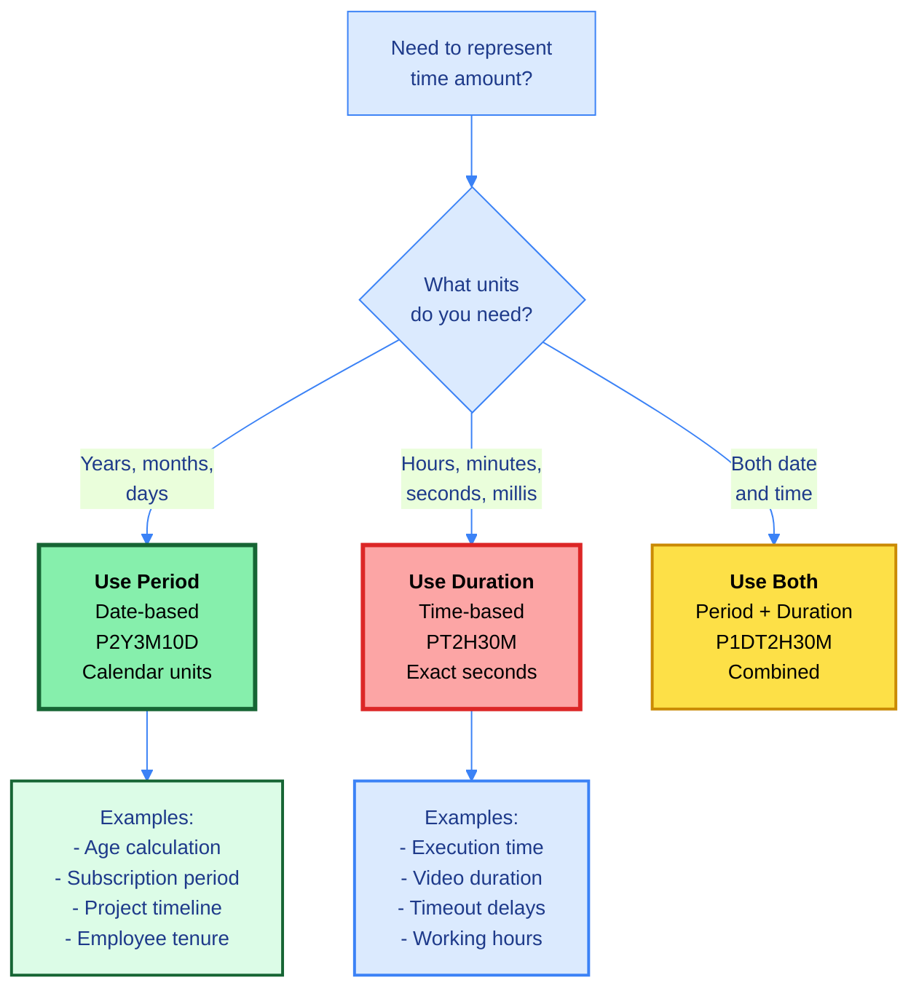
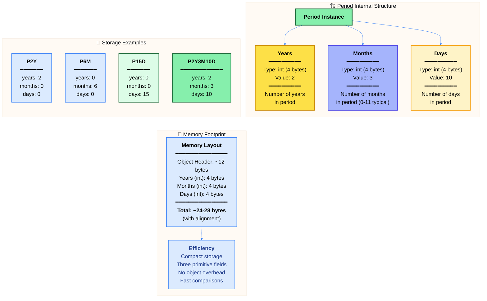
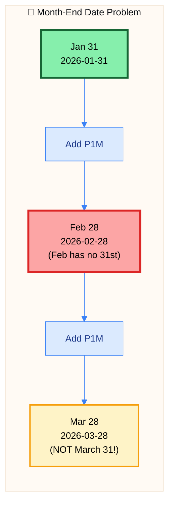

# ☕ Master Guide: Java Period API - Date-Based Amounts & Calendar Arithmetic

<div align="center">


</div>

<hr style="border: 1px solid rgb(98, 117, 187)">

<div align="center">
<table>
<tr>
<td align="center">
<br />

<h3>© 2026 Avinash Dhanuka</h3>
<p>Master Guide: Java Core & Frameworks</p>
<p><em>Crafted with ❤️ for Object-Oriented Architecture</em></p>

<a href="https://github.com/Avinash-706" target="_blank">

</a>

<a href="https://mail.google.com/mail/?view=cm&fs=1&to=avunashdhanuka@gmail.com&su=Java%20Period%20Query&body=☕%20Hello%20Avinash,%0D%0A%0D%0AMy%20name%20is%20[Your%20Name]%20and%20I%20have%20a%20doubt%20regarding%20Java%20Period%20API.%0D%0A%0D%0A🔹%20Topic:%20[Period/Date-Based%20Amounts]%0D%0A🔹%20Question:%20[Type%20your%20question]%0D%0A%0D%0AThank%20you!" target="_blank">


</a>
<br />
<br />
</td>
</tr>
</table>
</div>

> **Author's Note:** This comprehensive guide explores Java 8's Period API for representing date-based amounts in calendar units. Master the concept of calendar periods, understand the P format notation, and learn date-based arithmetic operations. Includes detailed theoretical knowledge on the critical differences between Period (date-based) and Duration (time-based), month-end date handling, leap year considerations, and why Period works exclusively with LocalDate for temporal calculations.

---

## 📅 Java Period Architecture



---

## 📑 Table of Contents
1. [Period Overview - Date-Based Amounts](#1-period-overview---date-based-amounts)
    - [Core Characteristics & Philosophy](#11-core-characteristics--philosophy)
    - [Period vs Duration - Critical Differences](#12-period-vs-duration---critical-differences)
    - [Internal Architecture & Storage Model](#13-internal-architecture--storage-model)
2. [P Format Notation - ISO-8601 Period Standard](#2-p-format-notation---iso-8601-period-standard)
    - [Understanding P Format Structure](#21-understanding-p-format-structure)
    - [Parsing Period Strings](#22-parsing-period-strings)
    - [Output Format Explained](#23-output-format-explained)
3. [Period Creation & Factory Methods](#3-period-creation--factory-methods)
    - [Factory Method Patterns](#31-factory-method-patterns)
    - [Between Operations - Measuring Calendar Intervals](#32-between-operations---measuring-calendar-intervals)
    - [Why LocalTime/Instant Don't Work](#33-why-localtimeinstant-dont-work)
4. [Period Extraction & Component Access](#4-period-extraction--component-access)
    - [Getting Individual Components](#41-getting-individual-components)
    - [Total Months Calculation](#42-total-months-calculation)
    - [Understanding Component vs Total](#43-understanding-component-vs-total)
5. [Period Arithmetic Operations](#5-period-arithmetic-operations)
    - [Plus Operations - Extending Period](#51-plus-operations---extending-period)
    - [Minus Operations - Reducing Period](#52-minus-operations---reducing-period)
    - [With Operations - Replacing Components](#53-with-operations---replacing-components)
6. [Period Normalization](#6-period-normalization)
    - [What is Normalization](#61-what-is-normalization)
    - [Why Days Are Not Normalized](#62-why-days-are-not-normalized)
    - [Normalization Patterns](#63-normalization-patterns)
7. [Period Multiplication & Negation](#7-period-multiplication--negation)
8. [Period with LocalDate Operations](#8-period-with-localdate-operations)
    - [Adding Period to LocalDate](#81-adding-period-to-localdate)
    - [Month-End Date Handling](#82-month-end-date-handling)
    - [Leap Year Considerations](#83-leap-year-considerations)
9. [Period Comparison & Validation](#9-period-comparison--validation)
10. [Edge Cases & Production Considerations](#10-edge-cases--production-considerations)
11. [Real-World Use Cases](#11-real-world-use-cases)

<div align="right">
<sub><em>Comprehensive notes by Avinash Dhanuka | For educational purposes</em></sub>
</div>

---

## 1. PERIOD OVERVIEW - Date-Based Amounts

### 📌 Definition
**Period** is an **immutable date-based amount** representing a **quantity of time** in terms of years, months, and days. Unlike Duration (which deals with hours, minutes, seconds), Period is strictly **date-based**, measuring intervals in calendar units. Part of Java 8's Date-Time API (JSR-310), following ISO-8601 period format standard.

### 1.1 Core Characteristics & Philosophy




#### 📋 Characteristics Table

| Property | Value | Details |
| :--- | :--- | :--- |
| **Package** | `java.time` | Since Java 8 (JSR-310) |
| **Mutability** | ✅ Immutable | Every operation creates new instance |
| **Thread Safety** | ✅ Thread-Safe | No synchronization required |
| **Null Support** | ❌ No Null | Use Optional<Period> instead |
| **Format** | ISO-8601 P | P#Y#M#D (e.g., P2Y3M10D) |
| **Storage** | 12 bytes | 3× int (years, months, days) |
| **Date Units** | ✅ Supported | Years, Months, Days |
| **Time Units** | ❌ NOT Supported | Hours, minutes, seconds (use Duration) |
| **Weeks Support** | ⚠️ Converted to Days | ofWeeks(3) → P21D |
| **Sign Support** | ✅ Yes | Can be negative (e.g., P-2Y = -2 years) |
| **Arithmetic** | ✅ Full Support | Plus, minus, multiply, negate |
| **Normalization** | ✅ Supported | Converts excess months to years |
| **Variable Length** | ✅ Yes | Months vary (28-31 days) |

---

### 1.2 Period vs Duration - Critical Differences

#### 📊 Comparison Matrix

| Feature | Period | Duration |
| :--- | :---: | :---: |
| **Type** | Date-Based | Time-Based |
| **Units** | Years, Months, Days | Hours, Minutes, Seconds, Nanos |
| **Precision** | Day | Nanosecond |
| **Format** | P2Y3M10D | PT2H30M45S |
| **Works With** | LocalDate | LocalTime, LocalDateTime, Instant, ZonedDateTime |
| **Storage** | 3× int (years, months, days) | long (seconds) + int (nanos) |
| **ISO-8601** | P prefix (no T) | PT prefix |
| **Arithmetic** | Calendar-based (variable length) | Exact (seconds-based) |
| **Negative Values** | ✅ Supported | ✅ Supported |
| **Example Use** | "2 years 3 months" | "2 hours 30 minutes" |
| **Variable Length Units** | ✅ Yes (months vary) | ❌ No (fixed seconds) |
| **Conversion to Exact Time** | ❌ Cannot | ✅ Can |

#### 🔍 Key Conceptual Differences

**Period (Date-Based):**
- **Definition**: Amount of time measured in calendar units (years, months, days)
- **Variable Units**: 1 month = 28-31 days (depends on month)
- **Human Time**: Calendar-friendly, human-readable periods
- **Use Cases**: Age calculation, subscription periods, project timelines, tenure
- **Precision**: Day-level accuracy only
- **Conversion**: Cannot convert to exact seconds (months vary)

**Duration (Time-Based):**
- **Definition**: Amount of time measured in seconds and nanoseconds
- **Fixed Units**: 1 hour = exactly 3600 seconds (always constant)
- **Machine Time**: Computer-friendly, precise measurements
- **Use Cases**: Measuring execution time, timeouts, delays, working hours
- **Precision**: Sub-millisecond accuracy possible
- **Conversion**: Can convert between all time units precisely

#### ⚠️ Critical: Why Period is Date-Based Only

**The Problem with Time-Based Period:**

| Time Unit | Why NOT Supported in Period | Reason |
| :--- | :--- | :--- |
| **Hours** | No concept in calendar dates | Hours are intraday, not calendar units |
| **Minutes** | No concept in calendar dates | Minutes are intraday, not calendar units |
| **Seconds** | No concept in calendar dates | Seconds are intraday, not calendar units |

**Example of Month Variability:**
```
January: 31 days = 2,678,400 seconds
February (normal): 28 days = 2,419,200 seconds
February (leap): 29 days = 2,505,600 seconds

Difference: Up to 259,200 seconds (3 full days)
```

Because months have **variable lengths**, they cannot be represented as a fixed number of seconds. Period uses calendar arithmetic, not exact second calculations.

**Example of Year Variability:**
```
Normal year: 365 days = 31,536,000 seconds
Leap year: 366 days = 31,622,400 seconds

Difference: 86,400 seconds (1 full day)
```

Period respects these calendar rules and automatically handles month-end dates and leap years.

#### 🎯 Decision Tree: Period or Duration?



#### 📋 Use Case Comparison

| Scenario | Use Period | Use Duration |
| :--- | :--- | :--- |
| **Calculate age in years** | ✅ Yes | ❌ No |
| **Measure code execution time** | ❌ No | ✅ Yes |
| **Subscription (6 months)** | ✅ Yes | ❌ No |
| **Video/audio duration** | ❌ No | ✅ Yes |
| **Employee tenure** | ✅ Yes | ❌ No |
| **API timeout (30 seconds)** | ❌ No | ✅ Yes |
| **Loan duration (5 years)** | ✅ Yes | ❌ No |
| **Meeting duration (1.5 hours)** | ❌ No | ✅ Yes |
| **Project timeline (3 months)** | ✅ Yes | ❌ No |
| **Cache expiry (5 minutes)** | ❌ No | ✅ Yes |
| **Warranty period (2 years)** | ✅ Yes | ❌ No |
| **Working hours (8 hours)** | ❌ No | ✅ Yes |

---

### 1.3 Internal Architecture & Storage Model



#### 🔍 Internal Representation

Period internally stores three primitive values:

1. **Years (int - 4 bytes)**: Signed 32-bit integer representing number of years
2. **Months (int - 4 bytes)**: Signed 32-bit integer representing number of months
3. **Days (int - 4 bytes)**: Signed 32-bit integer representing number of days

**Key Implementation Details:**

- **Final Fields**: All three fields (`years`, `months`, `days`) are `final`, ensuring immutability
- **Signed Values**: All can be positive or negative (negative periods supported)
- **No Normalization by Default**: 13 months stored as-is (not auto-converted to 1 year + 1 month)
- **Validation**: Constructor validates only that values are not null
- **No Time Data**: No hour/minute/second information stored
- **Serialization**: Custom serialization format for efficiency

#### 🎨 Output Format

**Default toString() Format:**
```
P2Y3M10D
━━━━━━━━
│P│Period│
━━━━━━━━
 ↑    ↑
 │    └─ Date components (Y/M/D)
 └────── Period marker (ISO-8601)
```

**Components Breakdown:**
- `P`: Period marker (ISO-8601 standard)
- `2Y`: 2 years
- `3M`: 3 months
- `10D`: 10 days
- **Note**: Only non-zero components appear in output

#### 📊 Range & Limits

| Constant | Value | Details |
| :--- | :--- | :--- |
| **Period.ZERO** | P0D | Zero period |
| **Minimum (each component)** | Integer.MIN_VALUE | -2,147,483,648 |
| **Maximum (each component)** | Integer.MAX_VALUE | 2,147,483,647 |

**Practical Range:**
- **Maximum Years**: ~2.1 billion years (Integer.MAX_VALUE)
- **Maximum Months**: ~2.1 billion months
- **Maximum Days**: ~2.1 billion days
- Far exceeds any practical application needs

---

## 2. P FORMAT NOTATION - ISO-8601 Period Standard

### 📌 Overview
Period uses **P format** (ISO-8601 standard) for string representation and parsing. Understanding this format is crucial for reading, writing, and parsing period strings in Java applications and external APIs.

### 2.1 Understanding P Format Structure

#### 📋 P Format Components

**Basic Structure:**
```
P[n]Y[n]M[n]W[n]D
│  │  │  │  └─ Days
│  │  │  └──── Weeks (converted to days)
│  │  └─────── Months
│  └────────── Years
└───────────── Period marker
```

**Period-Specific Rules:**
- **P**: Period marker (always present)
- **T**: NOT used in Period (T is for Duration time component)
- **Date parts** (Y/M/W/D): At least one must be present
- **No time parts**: Hours, minutes, seconds NOT supported

#### 📊 P Format Examples

| P String | Meaning | Years | Months | Days | Breakdown |
| :--- | :--- | :--- | :--- | :--- | :--- |
| **P0D** | 0 days | 0 | 0 | 0 | Zero period |
| **P1D** | 1 day | 0 | 0 | 1 | 1 day |
| **P1M** | 1 month | 0 | 1 | 0 | 1 month |
| **P1Y** | 1 year | 1 | 0 | 0 | 1 year |
| **P2Y3M** | 2 years 3 months | 2 | 3 | 0 | 2 years + 3 months |
| **P2Y3M10D** | 2 years 3 months 10 days | 2 | 3 | 10 | All components |
| **P15D** | 15 days | 0 | 0 | 15 | Just days |
| **P3W** | 3 weeks (21 days) | 0 | 0 | 21 | Weeks converted to days |
| **P18M** | 18 months | 0 | 18 | 0 | Not normalized (1.5 years) |
| **P-2Y** | -2 years (negative) | -2 | 0 | 0 | Negative period |

#### 🔍 P Format Rules

**Mandatory Elements:**
- ✅ `P` prefix (Period marker)
- ✅ At least ONE date component (Y, M, W, or D)

**Optional Elements:**
- ⚠️ Years, months, weeks, or days (at least one required)
- ⚠️ Combinations allowed (can have all)

**Format Variations:**
```
Valid P Formats:
✅ P2Y         → 2 years
✅ P6M         → 6 months
✅ P3W         → 3 weeks (21 days)
✅ P15D        → 15 days
✅ P2Y3M       → 2 years 3 months
✅ P2Y3M10D    → Complete format
✅ P0D         → Zero period
✅ P-2Y        → Negative 2 years

Invalid Formats:
❌ 2Y6M        → Missing 'P' prefix
❌ P           → No components
❌ P2H         → Hours not supported (use Duration)
❌ PT2M        → 'T' not used in Period
❌ P2Y3        → Ambiguous (missing unit)
```

#### 🎯 Why 'P' and Not Other Letters?

**'P' = Period Marker (ISO-8601 Standard):**
- Used for date-based periods
- Indicates an ISO-8601 period format
- Distinguishes from Duration (which uses 'PT')

**No 'T' in Period:**
- **'T' = Time separator** (only in Duration)
- Period is date-only, no time component
- **P1M** = 1 Month (Period)
- **PT1M** = 1 Minute (Duration)

**Example of Format Distinction:**

| Format | Interpretation | Explanation |
| :--- | :--- | :--- |
| **P1M** | 1 Month (Period) | 'M' without 'T' = Months |
| **PT1M** | 1 Minute (Duration) | 'M' after 'T' = Minutes |
| **P2Y3M10D** | 2 Years 3 Months 10 Days | All date units |
| **PT2H30M** | 2 Hours 30 Minutes | All time units |


---

### 2.2 Parsing Period Strings

#### 📋 Period.parse() Method

**Method Signature:**
```
static Period parse(CharSequence text)
```

**Behavior:**
- Parses ISO-8601 P format string
- Returns new Period instance
- Throws DateTimeParseException if invalid format
- Case-sensitive (must be uppercase P, Y, M, D)

#### 📊 Parsing Examples

| Input String | Parsed Period | Years | Months | Days |
| :--- | :--- | :--- | :--- | :--- |
| "P0D" | 0 days | 0 | 0 | 0 |
| "P1D" | 1 day | 0 | 0 | 1 |
| "P15D" | 15 days | 0 | 0 | 15 |
| "P1M" | 1 month | 0 | 1 | 0 |
| "P6M" | 6 months | 0 | 6 | 0 |
| "P1Y" | 1 year | 1 | 0 | 0 |
| "P2Y" | 2 years | 2 | 0 | 0 |
| "P2Y3M" | 2 years 3 months | 2 | 3 | 0 |
| "P2Y3M10D" | 2 years 3 months 10 days | 2 | 3 | 10 |
| "P3W" | 3 weeks (21 days) | 0 | 0 | 21 |
| "P-2Y" | -2 years | -2 | 0 | 0 |
| "P18M" | 18 months (not normalized) | 0 | 18 | 0 |

#### ⚠️ Parsing Errors

**Common Parse Exceptions:**

| Invalid Input | Error | Reason |
| :--- | :--- | :--- |
| "2Y3M" | DateTimeParseException | Missing 'P' prefix |
| "P" | DateTimeParseException | No components |
| "PT2M" | DateTimeParseException | 'T' not allowed (use Duration) |
| "p2y" | DateTimeParseException | Lowercase (must be uppercase) |
| "P2Y3" | DateTimeParseException | Ambiguous unit (missing M/D) |
| "P2.5Y" | DateTimeParseException | Fractional years not allowed |
| "P2H" | DateTimeParseException | Hours not supported |

**Important**: Only integer values allowed for years, months, and days. No fractional or decimal values.

---

### 2.3 Output Format Explained

#### 📋 Period.toString() Format

**Default Output Rules:**
- Always starts with "P"
- Only non-zero components appear
- Largest to smallest units (years → months → days)
- No fractional values (integers only)
- Negative periods have '-' before first component

#### 📊 Output Format Examples

| Period Created | toString() Output | Explanation |
| :--- | :--- | :--- |
| `Period.ofYears(2)` | P2Y | 2 years only |
| `Period.ofMonths(6)` | P6M | 6 months only |
| `Period.ofWeeks(3)` | P21D | 3 weeks converted to 21 days |
| `Period.ofDays(15)` | P15D | 15 days only |
| `Period.of(2, 3, 0)` | P2Y3M | 2 years 3 months |
| `Period.of(2, 3, 10)` | P2Y3M10D | All components |
| `Period.ZERO` | P0D | Zero period |
| `Period.ofYears(-2)` | P-2Y | Negative 2 years |
| `Period.ofMonths(18)` | P18M | Not normalized |
| `Period.of(1, 15, 10)` | P1Y15M10D | 15 months not normalized |

#### 🔍 Output Normalization

**Period does NOT automatically normalize output (unlike Duration):**

```
Input: Period.ofMonths(18)
Internal: years=0, months=18, days=0
Output: P18M (NOT P1Y6M)

To normalize: use normalized() method
Period.ofMonths(18).normalized() → P1Y6M
```

**Normalization Rules:**
1. **12 months** → 1 year (only when normalized)
2. **Days NOT normalized** → 30 days stays 30 days (months vary)
3. **Zero components** → Omitted from output
4. **All zero** → P0D (minimum representation)

#### ⚠️ Important Notes

**Weeks in Period:**
- Weeks are stored as days internally
- 1 week = 7 days
- Output always shows days, NOT weeks
- Example: `Period.ofWeeks(2)` → `P14D` (NOT P2W)

**Negative Periods:**
- Negative sign appears before first component
- Format: `P-2Y3M` (NOT `P2Y-3M`)
- Mixed signs possible: `P-2Y3M` means -2 years AND +3 months
- Example: `P-2Y` means -2 years

**Component Independence:**
- Each component is independent
- `P2Y3M` means 2 years AND 3 months (not 27 months)
- Use `toTotalMonths()` to get 27 months

---

## 3. PERIOD CREATION & Factory Methods

### 📌 Overview
Period provides multiple **factory methods** for creating instances from specific date units, measuring intervals between dates, or parsing P format strings.

### 3.1 Factory Method Patterns

#### 📋 Factory Methods Reference

| Method | Signature | Use Case | Example Output |
| :--- | :--- | :--- | :--- |
| **ofYears()** | `static Period ofYears(int years)` | Create from years | P2Y |
| **ofMonths()** | `static Period ofMonths(int months)` | Create from months | P6M |
| **ofWeeks()** | `static Period ofWeeks(int weeks)` | Create from weeks | P21D (3 weeks) |
| **ofDays()** | `static Period ofDays(int days)` | Create from days | P15D |
| **of(int, int, int)** | `static Period of(int y, int m, int d)` | Create from all units | P2Y3M10D |
| **parse()** | `static Period parse(CharSequence text)` | Parse P format | `parse("P2Y3M")` |
| **between()** | `static Period between(LocalDate start, LocalDate end)` | Measure interval | `between(date1, date2)` |
| **ZERO** | `static final Period ZERO` | Zero period constant | P0D |

#### 🎯 Factory Method Categories

**1. Specific Date Units:**
- `ofYears(int)` - Years only
- `ofMonths(int)` - Months only
- `ofWeeks(int)` - Weeks (converted to days internally)
- `ofDays(int)` - Days only

**2. Combined Creation:**
- `of(int, int, int)` - Years, months, and days together

**3. From Strings:**
- `parse(CharSequence)` - Parse ISO-8601 P format

**4. Measuring Intervals:**
- `between(LocalDate, LocalDate)` - Period between two dates

**5. Constants:**
- `Period.ZERO` - Zero period (P0D)

#### 📊 Creation Examples

| Creation Method | Result | Years | Months | Days | Explanation |
| :--- | :--- | :--- | :--- | :--- | :--- |
| `Period.ofYears(2)` | P2Y | 2 | 0 | 0 | 2 years |
| `Period.ofMonths(6)` | P6M | 0 | 6 | 0 | 6 months |
| `Period.ofWeeks(3)` | P21D | 0 | 0 | 21 | 3 weeks = 21 days |
| `Period.ofDays(15)` | P15D | 0 | 0 | 15 | 15 days |
| `Period.of(2, 3, 10)` | P2Y3M10D | 2 | 3 | 10 | All components |
| `Period.parse("P2Y3M")` | P2Y3M | 2 | 3 | 0 | From string |
| `Period.ZERO` | P0D | 0 | 0 | 0 | Zero constant |

#### 🔍 Special Considerations

**Weeks Conversion:**
- `ofWeeks(n)` internally converts to days
- 1 week = 7 days
- Stored as days, not weeks
- Output shows days: `ofWeeks(2)` → `P14D`

**No Hours/Minutes/Seconds:**
- Period does NOT support time units
- Cannot create Period with hours, minutes, or seconds
- Use Duration for time-based amounts

**Negative Values Supported:**
- All factory methods accept negative values
- `ofYears(-2)` creates `P-2Y`
- Useful for subtraction operations

---

### 3.2 Between Operations - Measuring Calendar Intervals

#### 📋 Period.between() Method

**Method Signature:**
```
static Period between(LocalDate startInclusive, LocalDate endExclusive)
```

**Purpose:** Calculate period between two dates in calendar units

**Behavior:**
- Measures date-based difference (years, months, days)
- Result can be negative if end is before start
- Only works with LocalDate (not LocalTime/Instant)
- Uses calendar arithmetic (accounts for month-end dates)

#### 🎯 Compatible Temporal Types

**Supported Types:**

| Temporal Type | Has Date? | Works with Period.between()? | Example |
| :--- | :---: | :---: | :--- |
| **LocalDate** | ✅ Yes | ✅ Yes | Date without time |
| **LocalTime** | ❌ No | ❌ NO | Time only (no date) |
| **LocalDateTime** | ✅ Yes | ⚠️ Extract LocalDate | Has time component |
| **Instant** | Derived | ❌ NO | UTC timestamp (no date) |
| **ZonedDateTime** | ✅ Yes | ⚠️ Extract LocalDate | Has timezone |

#### 📊 Between Examples

**1. Between Two Dates:**
```
Start: 2020-01-15
End:   2026-08-30

Period period = Period.between(start, end);
Result: P6Y7M15D
```

**2. Age Calculation:**
```
Birth Date: 1990-02-07
Today:      2026-09-12

Period age = Period.between(birthDate, today);
Result: P36Y7M5D
```

**3. Negative Period (End Before Start):**
```
Start: 2026-08-30
End:   2020-01-15

Period period = Period.between(start, end);
Result: P-6Y-7M-15D (negative period)
```

**4. Same Date:**
```
Start: 2026-09-12
End:   2026-09-12

Period period = Period.between(start, end);
Result: P0D (zero period)
```

#### ⚠️ Important Notes

**Order Matters:**
- `Period.between(start, end)` → Positive if end > start
- `Period.between(end, start)` → Negative if end > start
- To get absolute period, check `isNegative()` and negate if needed

**Calendar Arithmetic:**
```
Start: 2026-01-31
End:   2026-03-01

Result: P1M1D (not P31D or P29D)
Uses calendar units, not fixed day counts
```

---

### 3.3 Why LocalTime/Instant Don't Work

#### 📌 The Problem

**Attempting to use Period.between() with LocalTime:**
```
LocalTime time1 = LocalTime.of(10, 0);
LocalTime time2 = LocalTime.of(14, 30);

Period period = Period.between(time1, time2);
// ❌ COMPILATION ERROR!
// Period.between() requires LocalDate, not LocalTime
```

#### 🔍 Why It Fails

**LocalTime Characteristics:**
- Contains ONLY time information (hours, minutes, seconds)
- Has NO date component (no year, month, day)
- Does NOT support date-based units (YEARS, MONTHS, DAYS)

**Period Requirements:**
- Measures DATE-BASED intervals (years, months, days)
- Requires temporal objects that support date units
- Cannot work with time-only objects

**Temporal Unit Support:**

| Temporal Type | Supports DATE Units? | Why? |
| :--- | :---: | :--- |
| **LocalDate** | ✅ Yes | Pure date representation |
| **LocalTime** | ❌ No | No date component |
| **LocalDateTime** | ✅ Yes | Has date component (extract with toLocalDate()) |
| **Instant** | ❌ No | Time-based timestamp, no inherent calendar date |

#### ✅ Correct Solutions

**Solution 1: Use Duration for Time-Based Differences**
```
LocalTime time1 = LocalTime.of(10, 0);
LocalTime time2 = LocalTime.of(14, 30);

Duration duration = Duration.between(time1, time2);
Result: PT4H30M (4 hours 30 minutes)
```

**Solution 2: Extract LocalDate from LocalDateTime**
```
LocalDateTime dt1 = LocalDateTime.of(2026, 8, 1, 10, 0);
LocalDateTime dt2 = LocalDateTime.of(2026, 8, 15, 14, 30);

LocalDate date1 = dt1.toLocalDate();
LocalDate date2 = dt2.toLocalDate();

Period period = Period.between(date1, date2);
Result: P14D (14 days)
```

**Solution 3: Use LocalDate Directly**
```
LocalDate date1 = LocalDate.of(2026, 8, 1);
LocalDate date2 = LocalDate.of(2026, 8, 15);

Period period = Period.between(date1, date2);
Result: P14D
```

#### 📊 When to Use What

| Scenario | Use | Example Result |
| :--- | :--- | :--- |
| **Date difference (calendar units)** | Period.between() | P2Y3M10D |
| **Time difference (hours/mins/secs)** | Duration.between() | PT4H30M |
| **Date part from DateTime** | Extract toLocalDate() first | P14D |
| **Exact duration in days** | ChronoUnit.DAYS.between() | 14 (long) |


---

## 4. PERIOD EXTRACTION & COMPONENT ACCESS

### 📌 Overview
Period provides methods to extract individual components (years, months, days) and calculate total values. Understanding the difference between **component extraction** and **total calculation** is crucial.

### 4.1 Getting Individual Components

#### 📋 Accessor Methods

| Method | Return Type | Range | Description | Example (P2Y3M10D) |
| :--- | :--- | :--- | :--- | :--- |
| **getYears()** | int | Integer.MIN_VALUE to MAX_VALUE | Years component | 2 |
| **getMonths()** | int | Integer.MIN_VALUE to MAX_VALUE | Months component | 3 |
| **getDays()** | int | Integer.MIN_VALUE to MAX_VALUE | Days component | 10 |
| **getChronology()** | IsoChronology | N/A | Calendar system | IsoChronology.INSTANCE |
| **getUnits()** | List<TemporalUnit> | N/A | Supported units | [Years, Months, Days] |
| **isZero()** | boolean | N/A | True if all components zero | false |
| **isNegative()** | boolean | N/A | True if any component negative | false |

#### 🔍 Component Extraction Examples

**Period: P2Y3M10D**

| Method | Result | Explanation |
| :--- | :--- | :--- |
| getYears() | 2 | Years component only |
| getMonths() | 3 | Months component only |
| getDays() | 10 | Days component only |

**Period: P18M (Not Normalized)**

| Method | Result | Explanation |
| :--- | :--- | :--- |
| getYears() | 0 | No years component |
| getMonths() | 18 | 18 months (not converted) |
| getDays() | 0 | No days component |

**After Normalization: P1Y6M**

| Method | Result | Explanation |
| :--- | :--- | :--- |
| getYears() | 1 | 1 year (from 12 months) |
| getMonths() | 6 | 6 remaining months |
| getDays() | 0 | No days component |

#### ⚠️ Critical Understanding

**Period Components are INDEPENDENT, NOT Cumulative:**

```
Period: P2Y3M10D

getYears() = 2   ← Just the YEARS component
getMonths() = 3  ← Just the MONTHS component (NOT total months)
getDays() = 10   ← Just the DAYS component (NOT total days)

This represents: 2 years AND 3 months AND 10 days
NOT: 27 months total or 740 days total
```

---

### 4.2 Total Months Calculation

#### 📋 Method: toTotalMonths()

**Method Signature:**
```
long toTotalMonths()
```

**Purpose:** Calculate total months represented by years and months components (ignores days)

**Formula:** `(years × 12) + months`

**Important:** Days component is **completely ignored**

#### 📊 Total Months Examples

| Period | toTotalMonths() | Calculation |
| :--- | :--- | :--- |
| **P2Y** | 24 | (2 × 12) + 0 = 24 |
| **P6M** | 6 | (0 × 12) + 6 = 6 |
| **P2Y3M** | 27 | (2 × 12) + 3 = 27 |
| **P2Y3M10D** | 27 | (2 × 12) + 3 = 27 (days ignored) |
| **P1Y15M** | 27 | (1 × 12) + 15 = 27 (not normalized) |
| **P18M** | 18 | (0 × 12) + 18 = 18 |
| **P0D** | 0 | (0 × 12) + 0 = 0 |

#### ⚠️ Important Notes

**Days are Ignored:**
```
Period: P2Y3M10D
toTotalMonths() = 27 (days completely ignored)

Period: P2Y3M
toTotalMonths() = 27 (same result)
```

**Not Normalized:**
```
Period: P18M (not normalized)
toTotalMonths() = 18 (raw months value)

Period: P1Y6M (normalized)
toTotalMonths() = 18 (same result)
```

**Use Cases for toTotalMonths():**
1. **Comparison**: Compare periods in months
2. **Business Logic**: "Subscription valid for 24 months"
3. **Calculations**: Convert to single unit for math
4. **Validation**: Check minimum/maximum duration

---

### 4.3 Understanding Component vs Total

#### 🎯 Key Conceptual Differences

**Component Extraction (getYears, getMonths, getDays):**
- Returns the **individual component value**
- Does NOT calculate across components
- Represents the **stored value** for that component
- Used for displaying period breakdown

**Total Calculation (toTotalMonths):**
- Calculates **cumulative value** in single unit
- Converts years to months and adds
- Used for **comparisons and calculations**
- Only works for years + months (no total days method)

#### 📊 Comparison Table

| Period | getYears() | getMonths() | getDays() | toTotalMonths() |
| :--- | :--- | :--- | :--- | :--- |
| **P2Y3M10D** | 2 | 3 | 10 | 27 |
| **P27M** | 0 | 27 | 0 | 27 |
| **P1Y15M** | 1 | 15 | 0 | 27 |
| **P810D** | 0 | 0 | 810 | 0 |

**Important Observation:**
- `P2Y3M10D`, `P27M`, and `P1Y15M` all have `toTotalMonths() = 27`
- But their individual components differ
- toTotalMonths() provides common comparison basis

#### 🔍 Why No getTotalDays()?

**The Problem:**
- Months have variable lengths (28-31 days)
- Cannot convert months to exact day count without context
- 1 month ≠ 30 days (depends on which month)

**Examples:**
```
P1M in January = 31 days
P1M in February = 28 days (or 29 in leap year)
P1M in April = 30 days

Cannot determine exact days without knowing WHICH month!
```

**Solution:**
- Use `ChronoUnit.DAYS.between(start, end)` for exact day count
- Period focuses on calendar units, not exact durations

#### 📋 Practical Usage Patterns

**Pattern 1: Display Breakdown**
```
Purpose: Show period in human-readable format
Use: getYears(), getMonths(), getDays()

Period age = Period.between(birthDate, today);
Display: "34 years, 7 months, 5 days"
```

**Pattern 2: Compare Periods**
```
Purpose: Check if one period is longer than another
Use: toTotalMonths()

Period subscription1 = Period.ofMonths(24);
Period subscription2 = Period.ofYears(2);

subscription1.toTotalMonths() == subscription2.toTotalMonths()
Result: true (both are 24 months)
```

**Pattern 3: Business Logic**
```
Purpose: Validate minimum subscription period
Use: toTotalMonths()

Period userPeriod = Period.parse("P1Y3M");
if (userPeriod.toTotalMonths() >= 12) {
    // Meets minimum 1-year requirement
}
```

---

## 5. PERIOD ARITHMETIC OPERATIONS

### 📌 Overview
Period provides **immutable arithmetic operations** for adding, subtracting, and modifying date-based amounts. Every operation returns a **new Period instance**, preserving immutability and thread safety.

### 5.1 Plus Operations - Extending Period

#### 📋 Plus Methods Reference

| Method | Unit | Description | Example | Result (from P2Y3M10D) |
| :--- | :--- | :--- | :--- | :--- |
| **plusYears(long)** | Years | Add years | `period.plusYears(1)` | P3Y3M10D |
| **plusMonths(long)** | Months | Add months | `period.plusMonths(3)` | P2Y6M10D |
| **plusDays(long)** | Days | Add days | `period.plusDays(5)` | P2Y3M15D |
| **plus(Period)** | Period | Add another period | `period.plus(Period.ofMonths(2))` | P2Y5M10D |

#### 🎯 Plus Operation Characteristics

**Immutability:**
- Original period remains unchanged
- Returns new Period instance
- Safe to use across threads
- Method chaining supported

**No Automatic Normalization:**
- Adding 12 months does NOT convert to 1 year
- Result: P2Y15M10D (not P3Y3M10D)
- Use `normalized()` method if needed

#### 📊 Plus Examples

**Example 1: Simple Addition**
```
Base: P2Y3M10D

plusYears(1) → P3Y3M10D
plusMonths(3) → P2Y6M10D
plusDays(5) → P2Y3M15D
```

**Example 2: Adding Another Period**
```
Period1: P2Y3M
Period2: P6M10D

Period1.plus(Period2) → P2Y9M10D
```

**Example 3: Chained Operations**
```
Base: P1Y

period.plusYears(1)
      .plusMonths(6)
      .plusDays(15)

Result: P2Y6M15D
```

**Example 4: No Auto-Normalization**
```
Base: P1Y

plusMonths(15) → P1Y15M (NOT P2Y3M)

To normalize: .normalized() → P2Y3M
```

#### 🔄 Component Addition

**Independent Component Addition:**

| Operation | Years | Months | Days | Result |
| :--- | :--- | :--- | :--- | :--- |
| **Original** | 2 | 3 | 10 | P2Y3M10D |
| **plusYears(1)** | 3 | 3 | 10 | P3Y3M10D |
| **plusMonths(9)** | 2 | 12 | 10 | P2Y12M10D |
| **plusDays(20)** | 2 | 3 | 30 | P2Y3M30D |

**Key Point:** Each component is added independently without affecting others.

---

### 5.2 Minus Operations - Reducing Period

#### 📋 Minus Methods Reference

| Method | Unit | Description | Example | Result (from P5Y8M20D) |
| :--- | :--- | :--- | :--- | :--- |
| **minusYears(long)** | Years | Subtract years | `period.minusYears(2)` | P3Y8M20D |
| **minusMonths(long)** | Months | Subtract months | `period.minusMonths(3)` | P5Y5M20D |
| **minusDays(long)** | Days | Subtract days | `period.minusDays(10)` | P5Y8M10D |
| **minus(Period)** | Period | Subtract another period | `period.minus(Period.ofMonths(6))` | P5Y2M20D |

#### 📊 Minus Examples

**Example 1: Simple Subtraction**
```
Base: P5Y8M20D

minusYears(2) → P3Y8M20D
minusMonths(3) → P5Y5M20D
minusDays(10) → P5Y8M10D
```

**Example 2: Subtracting Another Period**
```
Period1: P5Y8M
Period2: P2Y3M

Period1.minus(Period2) → P3Y5M
```

**Example 3: Chained Operations**
```
Base: P5Y8M20D

period.minusYears(1)
      .minusMonths(2)
      .minusDays(5)

Result: P4Y6M15D
```

**Example 4: Negative Result**
```
Base: P2Y

minusYears(5) → P-3Y (negative 3 years)
```

#### ⚠️ Negative Periods

**Understanding Negative Periods:**
- Result of subtraction can be negative
- Each component can be negative independently
- Used for representing "past" or "backwards" periods
- Format: P-2Y3M (negative years, positive months)

**Negative Period Examples:**

| Operation | Result | Components | isNegative() |
| :--- | :--- | :--- | :--- |
| `P2Y.minus(P5Y)` | P-3Y | years=-3, months=0, days=0 | true |
| `P3M.minus(P6M)` | P-3M | years=0, months=-3, days=0 | true |
| `P2Y3M.minus(P1Y)` | P1Y3M | years=1, months=3, days=0 | false |
| `P-2Y` | P-2Y | years=-2, months=0, days=0 | true |

**Working with Negative Periods:**
```
Period negative = Period.ofYears(2).minusYears(5);
// Result: P-3Y

Check if negative:
negative.isNegative() → true

Get absolute (negate negative):
negative.negated() → P3Y

Adding negative period:
Period.ofYears(5).plus(negative) → P2Y
```

---

### 5.3 With Operations - Replacing Components

#### 📋 With Methods Reference

| Method | Description | Example | Result (from P2Y3M10D) |
| :--- | :--- | :--- | :--- |
| **withYears(int)** | Replace years component | `period.withYears(5)` | P5Y3M10D |
| **withMonths(int)** | Replace months component | `period.withMonths(6)` | P2Y6M10D |
| **withDays(int)** | Replace days component | `period.withDays(20)` | P2Y3M20D |

#### 🎯 With Operation Characteristics

**Purpose:** Replace specific component while keeping others unchanged

**Difference from Plus/Minus:**
- **Plus/Minus**: Add/subtract to existing value
- **With**: Replace existing value completely

#### 📊 With Examples

**Example 1: Replace Individual Components**
```
Base: P2Y3M10D

withYears(5) → P5Y3M10D (replaced years: 2 → 5)
withMonths(6) → P2Y6M10D (replaced months: 3 → 6)
withDays(20) → P2Y3M20D (replaced days: 10 → 20)
```

**Example 2: Chained With Operations**
```
Base: P2Y3M10D

period.withYears(1)
      .withMonths(6)
      .withDays(15)

Result: P1Y6M15D (all components replaced)
```

**Example 3: Set to Zero**
```
Base: P2Y3M10D

period.withDays(0) → P2Y3M (removed days)
period.withMonths(0).withDays(0) → P2Y (only years remain)
```

#### 📋 Plus vs Minus vs With Comparison

| Base Period | Operation | Result | Explanation |
| :--- | :--- | :--- | :--- |
| **P2Y3M10D** | plusYears(1) | P3Y3M10D | 2 + 1 = 3 years |
| **P2Y3M10D** | minusYears(1) | P1Y3M10D | 2 - 1 = 1 year |
| **P2Y3M10D** | withYears(1) | P1Y3M10D | Replace: years = 1 |
| **P2Y3M10D** | plusMonths(3) | P2Y6M10D | 3 + 3 = 6 months |
| **P2Y3M10D** | minusMonths(1) | P2Y2M10D | 3 - 1 = 2 months |
| **P2Y3M10D** | withMonths(1) | P2Y1M10D | Replace: months = 1 |

**Key Takeaway:**
- Use **plus/minus** for relative changes (add/subtract)
- Use **with** for absolute changes (set to specific value)


---

## 6. PERIOD NORMALIZATION

### 📌 Overview
Normalization is the process of converting excess months to years (12 months = 1 year). Understanding when and why to normalize is critical for period manipulation and comparison.

### 6.1 What is Normalization

#### 📋 Method: normalized()

**Method Signature:**
```
Period normalized()
```

**Purpose:** Convert excess months to years while keeping days unchanged

**Formula:** 
- Years = years + (months ÷ 12)
- Months = months % 12
- Days = days (unchanged)

#### 📊 Normalization Examples

| Original Period | normalized() | Explanation |
| :--- | :--- | :--- |
| **P18M** | P1Y6M | 18 months = 1 year + 6 months |
| **P1Y15M** | P2Y3M | 1 year + 15 months = 2 years + 3 months |
| **P2Y25M** | P4Y1M | 2 years + 25 months = 4 years + 1 month |
| **P0Y13M** | P1Y1M | 13 months = 1 year + 1 month |
| **P3Y0M** | P3Y | Already normalized |
| **P0Y0M40D** | P40D | Days NOT normalized |

#### 🔍 Detailed Normalization Process

**Example: P2Y25M10D**

```
Original:
  Years: 2
  Months: 25
  Days: 10

Normalization:
  25 months ÷ 12 = 2 years (with 1 month remainder)
  25 months % 12 = 1 month

Result:
  Years: 2 + 2 = 4
  Months: 1
  Days: 10 (unchanged)

Output: P4Y1M10D
```

---

### 6.2 Why Days Are Not Normalized

#### 📌 The Fundamental Problem

**Month lengths are VARIABLE:**

| Month | Days | Variability |
| :--- | :--- | :--- |
| **January** | 31 | Fixed |
| **February** | 28 or 29 | Leap year dependent |
| **March** | 31 | Fixed |
| **April** | 30 | Fixed |
| **May** | 31 | Fixed |
| **June** | 30 | Fixed |
| **July** | 31 | Fixed |
| **August** | 31 | Fixed |
| **September** | 30 | Fixed |
| **October** | 31 | Fixed |
| **November** | 30 | Fixed |
| **December** | 31 | Fixed |

**The Question:** How many months is 40 days?

```
Depends on WHICH months:
- 40 days starting Jan 1: 1 month + 9 days (Jan has 31 days)
- 40 days starting Feb 1: 1 month + 12 days (Feb has 28 days)
- 40 days starting Feb 1 (leap): 1 month + 11 days (Feb has 29 days)

Cannot determine without context!
```

#### ⚠️ Why This Matters

**Normalization Requires Fixed Conversion:**
- **12 months = 1 year** (always true, fixed rule)
- **30 days = 1 month** (FALSE! varies by month)
- **365 days = 1 year** (FALSE! leap years have 366)

**Period uses calendar arithmetic, not fixed conversions:**
- Adding P1M to Jan 31 → Feb 28/29 (not March 3)
- Adding P30D to Jan 31 → March 2
- Different results because P1M ≠ P30D

#### 🎯 Design Philosophy

**Why Period Leaves Days Unnormalized:**

1. **Accuracy**: Cannot convert days to months accurately without date context
2. **Predictability**: 40 days means exactly 40 days (no ambiguity)
3. **Correctness**: Prevents incorrect assumptions about month lengths
4. **Context-Free**: Period works without needing a specific start date

**Alternative for Exact Day Count:**
```
If you need exact days between dates:
  long days = ChronoUnit.DAYS.between(startDate, endDate);

Result: Exact day count (e.g., 735 days)
Not a Period (which preserves calendar units)
```

---

### 6.3 Normalization Patterns

#### 📋 When to Normalize

**Normalize When:**
1. **Comparing Periods**: Ensure consistent representation
2. **Display to Users**: Show in standard format (years + months < 12)
3. **Business Rules**: "Maximum 2 years" (24 months should show as 2 years)
4. **Storage**: Consistent format for database storage

**Don't Normalize When:**
1. **Precision Matters**: Need exact component values
2. **Intermediate Calculations**: Normalizing mid-calculation can lose info
3. **API Contracts**: External system expects specific format

#### 📊 Normalization Use Cases

**Use Case 1: Period Comparison**
```
Problem: Compare if two periods are equal in years/months

Period p1 = Period.ofMonths(24);        // P24M
Period p2 = Period.ofYears(2);          // P2Y

Without normalization:
  p1.equals(p2) → false (different representation)

With normalization:
  p1.normalized().equals(p2.normalized()) → true
  (Both become P2Y)
```

**Use Case 2: User Display**
```
Problem: Show subscription duration to user

Period subscription = Period.ofMonths(18);

Without normalization:
  Display: "18 months" (less intuitive)

With normalization:
  Period normalized = subscription.normalized();
  Display: "1 year 6 months" (more intuitive)
```

**Use Case 3: Business Validation**
```
Problem: Validate maximum subscription is 2 years

Period userPeriod = Period.parse("P25M");

Direct comparison:
  userPeriod.toTotalMonths() > 24 → true (25 > 24)

Normalized check:
  Period normalized = userPeriod.normalized();
  normalized.getYears() > 2 → true (P2Y1M has years=2, months=1)
```

#### ⚠️ Normalization Caveats

**Caveat 1: toTotalMonths() vs normalized()**
```
Period: P18M

toTotalMonths() = 18
  (just calculates total, doesn't change period)

normalized() = P1Y6M
  (creates NEW period with normalized values)
  toTotalMonths() still = 18
```

**Caveat 2: Days Always Remain**
```
Period: P1Y13M40D

normalized() = P2Y1M40D
  (Years and months normalized, days unchanged)
```

**Caveat 3: Negative Periods**
```
Period: P-1Y-15M

normalized() = P-2Y-3M
  (Negative values normalized too)
```

**Caveat 4: Mixed Signs**
```
Period: P2Y-15M

normalized() = P-3M
  (2 years - 15 months = -3 months)
  Complex calculation with mixed signs
```

---

## 7. PERIOD MULTIPLICATION & NEGATION

### 📌 Overview
Period supports multiplication and negation operations for scaling and reversing period directions.

#### 📋 Multiplication & Negation Methods

| Method | Description | Example | Result (from P2Y3M10D) |
| :--- | :--- | :--- | :--- |
| **multipliedBy(int)** | Multiply all components | `period.multipliedBy(2)` | P4Y6M20D |
| **negated()** | Negate all components | `period.negated()` | P-2Y-3M-10D |

#### 🎯 Multiplication Operations

**Behavior:**
- Multiplies ALL components (years, months, days)
- Does NOT normalize result
- Can create very large component values
- Preserves sign (negative × positive = negative)

**Examples:**

| Base Period | Operation | Result |
| :--- | :--- | :--- |
| P2Y3M10D | multipliedBy(2) | P4Y6M20D |
| P1Y6M | multipliedBy(3) | P3Y18M |
| P-2Y | multipliedBy(2) | P-4Y |
| P1M | multipliedBy(12) | P12M (not P1Y) |

**Use Cases:**
- Scale period: "Triple the warranty period"
- Repeat intervals: "Every 3 months, 4 times" → `Period.ofMonths(3).multipliedBy(4)`
- Batch calculations: "Process every N periods"

#### 🎯 Negation Operations

**Behavior:**
- Negates ALL components (flips signs)
- Positive becomes negative, negative becomes positive
- Zero remains zero

**Examples:**

| Original Period | negated() Result | Explanation |
| :--- | :--- | :--- |
| P2Y3M10D | P-2Y-3M-10D | All positive → All negative |
| P-2Y | P2Y | Negative → Positive |
| P2Y-3M | P-2Y3M | Mixed signs flipped |
| P0D | P0D | Zero unchanged |

**Use Cases:**
- Reverse period direction: "Go back 2 years"
- Undo period: "Remove previously added period"
- Time machine scenarios: "What date was it N months ago"

#### 📊 Combined Operations

**Chained Multiplication and Negation:**

| Base | Operation | Result |
| :--- | :--- | :--- |
| P1Y | multipliedBy(2) | P2Y |
| P1Y | multipliedBy(2).negated() | P-2Y |
| P-1Y | multipliedBy(2) | P-2Y |
| P-1Y | multipliedBy(2).negated() | P2Y |

---

## 8. PERIOD WITH LOCALDATE OPERATIONS

### 📌 Overview
Period's primary purpose is to be added to or subtracted from LocalDate objects. Understanding date arithmetic with periods, especially edge cases, is crucial for production code.

### 8.1 Adding Period to LocalDate

#### 📋 LocalDate Plus/Minus Methods

| Method | Description | Example |
| :--- | :--- | :--- |
| **plus(Period)** | Add period to date | `date.plus(period)` |
| **minus(Period)** | Subtract period from date | `date.minus(period)` |
| **plusYears(long)** | Add years | `date.plusYears(2)` |
| **plusMonths(long)** | Add months | `date.plusMonths(3)` |
| **plusDays(long)** | Add days | `date.plusDays(10)` |

#### 📊 Addition Examples

**Example 1: Simple Addition**
```
Date: 2026-01-15
Period: P2Y3M10D

Result: 2026-01-15 + P2Y3M10D = 2028-04-25
```

**Example 2: Component Addition**
```
Date: 2026-03-15

Add P1Y:   2026-03-15 → 2027-03-15
Add P3M:   2026-03-15 → 2026-06-15
Add P10D:  2026-03-15 → 2026-03-25
Add P1Y3M10D: 2026-03-15 → 2027-06-25
```

**Example 3: Subtraction**
```
Date: 2026-08-30
Period: P6M

Result: 2026-08-30 - P6M = 2026-02-28 (month-end adjusted)
```

---

### 8.2 Month-End Date Handling

#### 📌 The Month-End Problem

**What happens when adding months to month-end dates?**

```
Problem: Not all months have same number of days
January has 31 days, February has 28/29 days

Jan 31 + 1 month = Feb 31?
  But Feb 31 doesn't exist!
```

#### 🔍 Java's Resolution Strategy

**Rule:** If target date doesn't exist, adjust to **last valid day** of target month

**Examples:**

| Start Date | Add Period | Expected | Actual Result | Adjustment |
| :--- | :--- | :--- | :--- | :--- |
| **2026-01-31** | P1M | Feb 31 | 2026-02-28 | Feb has only 28 days |
| **2024-01-31** | P1M | Feb 31 | 2024-02-29 | Leap year, Feb has 29 |
| **2026-03-31** | P1M | Apr 31 | 2026-04-30 | April has only 30 days |
| **2026-05-31** | P1M | Jun 31 | 2026-06-30 | June has only 30 days |
| **2026-01-30** | P1M | Feb 30 | 2026-02-28 | Feb has only 28 days |

#### ⚠️ Critical Production Implications

**Issue 1: Losing Days Permanently**
```
Start: 2026-01-31
Add P1M: 2026-02-28
Add P1M: 2026-03-28  ← Lost 3 days permanently!

Not 2026-03-31 as might be expected
```

**Issue 2: Different Results for "Same" Periods**
```
Start: 2026-01-31

Method 1 - Add separately:
  + P1M → 2026-02-28
  + P1M → 2026-03-28

Method 2 - Add combined:
  + P2M → 2026-03-31

Different results!
```

**Issue 3: Subscription Dates Drift**
```
Subscription starts: Jan 31
Monthly renewal: + P1M each month

Jan 31 → Feb 28 → Mar 28 → Apr 28 → ...
  Renewal date drifts from 31st to 28th
```

#### ✅ Solutions & Best Practices

**Solution 1: Use First/Last Day of Month**
```
Instead of: Jan 31 (month-end)
Use: Jan 1 or last day calculation

LocalDate lastDay = date.withDayOfMonth(date.lengthOfMonth());
```

**Solution 2: Document Expected Behavior**
```
// Document: "Subscription renews on same day or last valid day"
// Jan 31 subscriber → Feb 28, Mar 31, Apr 30, etc.
```

**Solution 3: Store Preferred Day Separately**
```
preferredDay = 31
currentDate = 2026-02-28

Next renewal:
  LocalDate next = currentDate.plusMonths(1);
  next = next.withDayOfMonth(
    Math.min(preferredDay, next.lengthOfMonth())
  );
```

---

### 8.3 Leap Year Considerations

#### 📌 Leap Year Rules

**Gregorian Calendar Leap Year Rules:**
1. Year divisible by 4 → Leap year
2. EXCEPT year divisible by 100 → Not leap year  
3. EXCEPT year divisible by 400 → Leap year

**Examples:**

| Year | Divisible by 4? | Divisible by 100? | Divisible by 400? | Leap Year? |
| :--- | :---: | :---: | :---: | :---: |
| **2024** | ✅ Yes | ❌ No | ❌ No | ✅ YES |
| **2025** | ❌ No | ❌ No | ❌ No | ❌ NO |
| **2026** | ❌ No | ❌ No | ❌ No | ❌ NO |
| **2100** | ✅ Yes | ✅ Yes | ❌ No | ❌ NO |
| **2000** | ✅ Yes | ✅ Yes | ✅ Yes | ✅ YES |
| **2400** | ✅ Yes | ✅ Yes | ✅ Yes | ✅ YES |

#### 🔍 Leap Year Date Arithmetic

**Issue: Feb 29 in Non-Leap Years**

```
Start: 2024-02-29 (leap year, valid date)
Add P1Y: 2025-02-29 (non-leap year, INVALID!)

Java Resolution: 2025-02-28 (last valid day of Feb)
```

**Examples:**

| Start Date | Add Period | Target | Actual Result | Reason |
| :--- | :--- | :--- | :--- | :--- |
| **2024-02-29** | P1Y | 2025-02-29 | 2025-02-28 | 2025 not leap year |
| **2024-02-29** | P4Y | 2028-02-29 | 2028-02-29 | 2028 is leap year |
| **2000-02-29** | P100Y | 2100-02-29 | 2100-02-28 | 2100 not leap year |

#### ⚠️ Production Considerations

**Birthday Scenario:**
```
Person born: Feb 29, 2000

Age calculation:
  2024: 24 years old (Feb 29 exists)
  2025: 25 years old on Feb 28 (Feb 29 doesn't exist)
  
Should we celebrate on Feb 28 or Mar 1?
  Business decision, not technical!
```

**Anniversary Scenario:**
```
Married: Feb 29, 2020

Anniversaries:
  2021: Feb 28 (no Feb 29)
  2024: Feb 29 (leap year)
  2025: Feb 28 (no Feb 29)
```

**Subscription Scenario:**
```
Annual subscription starts: Feb 29, 2024
Next renewal: Feb 28, 2025 (not Feb 29)

User might expect: Mar 1, 2025 (1 year = 365 days)
System provides: Feb 28, 2025 (calendar year)

Document clearly!
```


---

## 9. PERIOD COMPARISON & VALIDATION

### 📌 Overview
Comparing Period objects requires understanding that periods represent calendar units, not exact durations. Two periods can represent different calendar amounts but similar or different actual durations depending on context.

#### 📋 Comparison Methods

| Method | Return Type | Description | Example |
| :--- | :--- | :--- | :--- |
| **equals(Object)** | boolean | True if all components equal | `p1.equals(p2)` |
| **isZero()** | boolean | True if all components zero | `period.isZero()` |
| **isNegative()** | boolean | True if any component negative | `period.isNegative()` |

#### 🔍 Equality Comparison

**Direct Equality (equals):**
- Compares ALL three components (years, months, days)
- Must match EXACTLY (no normalization)
- Does NOT consider calendar context

**Examples:**

| Period 1 | Period 2 | equals() | Reason |
| :--- | :--- | :---: | :--- |
| P2Y3M10D | P2Y3M10D | ✅ true | Identical |
| P18M | P1Y6M | ❌ false | Different representation (not normalized) |
| P24M | P2Y | ❌ false | 24 months ≠ 2 years (component difference) |
| P30D | P1M | ❌ false | 30 days ≠ 1 month (always different) |

#### ⚠️ Critical: Period Comparison Complexity

**Problem: No Built-in Comparison Method**

Period does NOT implement Comparable interface because:
1. **Context-Dependent**: P1M can be 28, 29, 30, or 31 days depending on month
2. **Cannot Order**: Cannot definitively say P1M > P30D or P1M < P30D
3. **Variable Duration**: Same period has different durations in different months

**Example of Ambiguity:**
```
Which is longer: P1M or P30D?

January context:   P1M = 31 days > P30D ✓
February context:  P1M = 28 days < P30D ✓
April context:     P1M = 30 days = P30D ✓

Answer: DEPENDS on context!
```

#### 🎯 Comparison Strategies

**Strategy 1: Normalize and Compare Components**
```
Problem: Compare if two periods are equivalent in years/months

Period p1 = Period.ofMonths(24);
Period p2 = Period.ofYears(2);

Solution:
  Period n1 = p1.normalized();  // P2Y
  Period n2 = p2.normalized();  // P2Y
  
  n1.equals(n2) → true
```

**Strategy 2: Use toTotalMonths() for Months-Only Comparison**
```
Problem: Compare subscription durations

Period sub1 = Period.of(1, 6, 0);  // 1 year 6 months
Period sub2 = Period.ofMonths(18);  // 18 months

Solution:
  sub1.toTotalMonths() == sub2.toTotalMonths()
  18 == 18 → true
```

**Strategy 3: Apply to Date and Compare Results**
```
Problem: Which period results in later date?

LocalDate start = LocalDate.of(2026, 1, 15);
Period p1 = Period.ofMonths(2);
Period p2 = Period.ofDays(60);

Solution:
  LocalDate result1 = start.plus(p1);  // 2026-03-15
  LocalDate result2 = start.plus(p2);  // 2026-03-16
  
  result1.isBefore(result2) → true
  (P60D results in later date than P2M)
```

**Strategy 4: Exact Day Calculation with ChronoUnit**
```
Problem: Compare exact duration in days

LocalDate start = LocalDate.of(2026, 1, 15);
Period p1 = Period.ofMonths(2);
Period p2 = Period.ofDays(60);

Solution:
  long days1 = ChronoUnit.DAYS.between(start, start.plus(p1));  // 59
  long days2 = ChronoUnit.DAYS.between(start, start.plus(p2));  // 60
  
  days1 < days2 → true
```

#### 📊 Comparison Decision Matrix

| Comparison Need | Strategy | Method |
| :--- | :--- | :--- |
| **Same representation?** | Direct equals | `p1.equals(p2)` |
| **Equivalent years/months?** | Normalize first | `p1.normalized().equals(p2.normalized())` |
| **Months only?** | Total months | `p1.toTotalMonths() == p2.toTotalMonths()` |
| **Actual duration?** | Apply to date | `start.plus(p1).compareTo(start.plus(p2))` |
| **Exact days?** | ChronoUnit | `ChronoUnit.DAYS.between(...)` |

#### 🎯 Validation Methods

**isZero() - Check if Period is Zero**

```
Period.ZERO.isZero() → true
Period.of(0, 0, 0).isZero() → true
Period.ofDays(1).isZero() → false
Period.of(0, 0, 1).isZero() → false
```

**Use Cases:**
- Validate user input: "Period must be non-zero"
- Conditional logic: "Skip if no time has passed"
- Loop termination: "Continue until period is zero"

**isNegative() - Check if Any Component is Negative**

```
Period.ofYears(-2).isNegative() → true
Period.of(2, -3, 0).isNegative() → true (mixed signs)
Period.of(0, 0, 0).isNegative() → false (zero)
Period.ofYears(2).isNegative() → false (all positive)
```

**Important:** Returns true if ANY component is negative (not necessarily ALL)

**Use Cases:**
- Validate direction: "Period must be positive"
- Business logic: "Cannot go back in time"
- Calculation validation: "Result should be positive"

---

## 10. EDGE CASES & PRODUCTION CONSIDERATIONS

### 📌 Overview
Period operations involve complex calendar arithmetic with numerous edge cases. Understanding these is critical for production-quality code that handles all scenarios correctly.

### 📋 Edge Case Categories

#### 🔍 Edge Case 1: Month-End Date Overflow

**Problem:** Adding periods to month-end dates causes date adjustment



**Examples:**

| Start Date | Operation | Expected | Actual | Issue |
| :--- | :--- | :--- | :--- | :--- |
| 2026-01-31 | +P1M | Feb 31 | 2026-02-28 | Feb has 28 days |
| 2026-01-31 | +P1M +P1M | Mar 31 | 2026-03-28 | Date drifted |
| 2026-03-31 | +P1M | Apr 31 | 2026-04-30 | April has 30 days |
| 2026-05-31 | +P1M | Jun 31 | 2026-06-30 | June has 30 days |

**Production Impact:**
- Subscription renewal dates drift over time
- Billing dates become inconsistent
- Report generation schedules shift

**Solution:**
```
Store preferred day separately:
  preferredDay = 31
  currentMonth = February
  
Calculate actual day:
  actualDay = min(preferredDay, daysInMonth)
  actualDay = min(31, 28) = 28
```

---

#### 🔍 Edge Case 2: Leap Year Transitions

**Problem:** Feb 29 exists only in leap years

| Start Date | Operation | Target | Actual | Reason |
| :--- | :--- | :--- | :--- | :--- |
| 2024-02-29 | +P1Y | 2025-02-29 | 2025-02-28 | 2025 not leap |
| 2024-02-29 | +P4Y | 2028-02-29 | 2028-02-29 | 2028 is leap |
| 2020-02-29 | +P100Y | 2120-02-29 | 2120-02-28 | 2100 not leap |

**Production Impact:**
- Birthday celebrations on wrong date
- Anniversary dates inconsistent
- Age calculations with edge cases

**Solution:**
```
Document business rule:
  "For leap year births, celebrate on Feb 28 in non-leap years"
  OR
  "For leap year births, celebrate on Mar 1 in non-leap years"
  
Must be explicit business decision!
```

---

#### 🔍 Edge Case 3: Period Order Matters

**Problem:** Addition order can produce different results

```
Start: 2026-01-31

Method 1: Sequential addition
  2026-01-31 + P1Y = 2027-01-31
  2027-01-31 + P1M = 2027-02-28  ← Adjusted!

Method 2: Combined period
  2026-01-31 + P1Y1M = 2027-02-28  ← Same result

Method 3: Different order
  2026-01-31 + P1M = 2026-02-28  ← Adjusted!
  2026-02-28 + P1Y = 2027-02-28  ← Different path!
```

**Key Insight:** Period addition is NOT commutative when month-end dates involved

**Solution:**
- Use combined periods: `Period.of(1, 1, 0)` instead of sequential `.plusYears(1).plusMonths(1)`
- Document expected behavior
- Test thoroughly with month-end dates

---

#### 🔍 Edge Case 4: Days vs Months Inequality

**Problem:** 30 days ≠ 1 month

| Period | Meaning | January Context | February Context |
| :--- | :--- | :--- | :--- |
| **P30D** | Exactly 30 days | Jan 1 → Jan 31 | Feb 1 → Mar 3 |
| **P1M** | 1 calendar month | Jan 1 → Feb 1 | Feb 1 → Mar 1 |

**Examples:**

```
Start: 2026-01-01

Add P30D: 2026-01-01 + 30 days = 2026-01-31
Add P1M:  2026-01-01 + 1 month = 2026-02-01

Different results!
```

```
Start: 2026-02-01

Add P30D: 2026-02-01 + 30 days = 2026-03-03
Add P1M:  2026-02-01 + 1 month = 2026-03-01

Different results!
```

**Production Impact:**
- "30-day free trial" ≠ "1-month free trial"
- "60-day notice period" ≠ "2-month notice period"
- Legal implications if not clarified

**Solution:**
- Be explicit: Use days for exact count, months for calendar periods
- Document in business requirements: "30-day trial (not 1 month)"
- Test with various start dates

---

#### 🔍 Edge Case 5: Normalization Doesn't Solve Everything

**Problem:** Normalized periods still have edge cases

```
Period p1 = Period.ofMonths(13).normalized();  // P1Y1M
Period p2 = Period.of(1, 1, 0);                // P1Y1M

p1.equals(p2) → true (after normalization)

But when applied:
  Start: 2026-01-31
  
  Result1: 2026-01-31 + P1Y1M = 2027-02-28
  Result2: 2026-01-31 + P1Y1M = 2027-02-28
  
Same result (but both adjusted from Feb 31)
```

**Solution:**
- Normalization helps comparison, not edge case handling
- Still need to handle month-end dates separately
- Document and test month-end behavior

---

### 📋 Production Best Practices

#### ✅ Best Practice Checklist

| Practice | Implementation | Why |
| :--- | :--- | :--- |
| **Test Month-End Dates** | Test 28th, 29th, 30th, 31st | Catch adjustment issues |
| **Test Leap Years** | Test Feb 29 operations | Catch leap year issues |
| **Document Behavior** | Comment edge case handling | Clear expectations |
| **Validate Input** | Check period components | Prevent invalid data |
| **Use Normalized Comparison** | Normalize before comparing | Consistent comparison |
| **Store Exact Requirements** | Document days vs months choice | Legal clarity |
| **Unit Test Edge Cases** | Comprehensive test suite | Prevent regressions |
| **Consider Time Zones** | Use ZonedDateTime if needed | Global consistency |

#### 🎯 Testing Strategy

**Minimum Test Cases:**

1. **Normal Cases:**
   - Mid-month dates (15th)
   - Non-leap years
   - Positive periods

2. **Month-End Cases:**
   - Jan 31, Mar 31, May 31, Jul 31, Aug 31, Oct 31, Dec 31
   - Apr 30, Jun 30, Sep 30, Nov 30
   - Feb 28, Feb 29

3. **Leap Year Cases:**
   - Feb 29 in leap years
   - Transitions from leap to non-leap years
   - Century years (2000, 2100, 2400)

4. **Negative Periods:**
   - Subtracting periods
   - Negative components
   - Mixed signs

5. **Zero and Boundary:**
   - Zero periods
   - Very large periods
   - Maximum integer values

---

## 11. REAL-WORLD USE CASES

### 📌 Overview
Period excels in applications requiring calendar-based date arithmetic. Understanding real-world patterns helps apply Period effectively in production systems.

#### 📋 Domain-Specific Use Cases

| Domain | Use Cases | Period Operations |
| :--- | :--- | :--- |
| **HR & Payroll** | Employee tenure, probation period, vacation accrual | between(), plus(), comparison |
| **Finance** | Loan duration, interest periods, payment schedules | ofMonths(), plusMonths(), arithmetic |
| **Healthcare** | Patient age, prescription duration, appointment intervals | between(), getYears(), validation |
| **Legal** | Contract duration, notice periods, statute of limitations | between(), plus(), compliance |
| **E-commerce** | Subscription periods, warranty duration, return windows | ofMonths(), plusMonths(), validation |
| **Education** | Student age, semester duration, course length | between(), ofMonths(), reporting |
| **Insurance** | Policy duration, coverage periods, claim deadlines | ofYears(), between(), calculation |
| **Real Estate** | Lease duration, notice periods, contract terms | ofMonths(), between(), legal |
| **Software Licensing** | License validity, trial periods, renewal dates | ofDays(), ofMonths(), expiration |
| **Project Management** | Project timeline, milestone tracking, phase duration | between(), plus(), reporting |

#### 🎯 Detailed Use Case Examples

**Use Case 1: Employee Age Calculation**
```
Problem: Calculate employee age for benefits eligibility

LocalDate birthDate = LocalDate.of(1990, 2, 7);
LocalDate today = LocalDate.now();

Period age = Period.between(birthDate, today);

Display: age.getYears() + " years, " + 
         age.getMonths() + " months, " + 
         age.getDays() + " days old"

Business Logic:
  if (age.getYears() >= 18) {
      // Eligible for adult benefits
  }
```

**Use Case 2: Subscription Management**
```
Problem: Calculate subscription renewal date

LocalDate subscriptionStart = LocalDate.of(2026, 1, 15);
Period subscriptionDuration = Period.ofMonths(12);

LocalDate renewalDate = subscriptionStart.plus(subscriptionDuration);

Check if active:
  LocalDate today = LocalDate.now();
  boolean isActive = today.isBefore(renewalDate);
```

**Use Case 3: Loan Duration Calculation**
```
Problem: Display loan remaining period

LocalDate loanStart = LocalDate.of(2024, 3, 1);
LocalDate loanEnd = LocalDate.of(2029, 3, 1);
LocalDate today = LocalDate.now();

Period totalDuration = Period.between(loanStart, loanEnd);
Period elapsed = Period.between(loanStart, today);
Period remaining = Period.between(today, loanEnd);

Display:
  "Total: " + totalDuration.getYears() + " years"
  "Elapsed: " + elapsed.getYears() + " years " + 
               elapsed.getMonths() + " months"
  "Remaining: " + remaining.getYears() + " years " + 
                 remaining.getMonths() + " months"
```

**Use Case 4: Warranty Expiration Check**
```
Problem: Check if product warranty is still valid

LocalDate purchaseDate = LocalDate.of(2025, 6, 15);
Period warrantyPeriod = Period.ofYears(2);
LocalDate warrantyExpiry = purchaseDate.plus(warrantyPeriod);

LocalDate today = LocalDate.now();
boolean isWarrantyValid = today.isBefore(warrantyExpiry);

if (isWarrantyValid) {
    Period remaining = Period.between(today, warrantyExpiry);
    System.out.println("Warranty valid for " + 
                      remaining.getYears() + " years, " +
                      remaining.getMonths() + " months");
}
```

**Use Case 5: Probation Period Tracking**
```
Problem: Track employee probation period

LocalDate joinDate = LocalDate.of(2026, 1, 15);
Period probationPeriod = Period.ofMonths(3);
LocalDate probationEnd = joinDate.plus(probationPeriod);

LocalDate today = LocalDate.now();
if (today.isAfter(probationEnd)) {
    System.out.println("Probation completed");
} else {
    Period remaining = Period.between(today, probationEnd);
    System.out.println("Probation ends in " + 
                      remaining.getMonths() + " months, " +
                      remaining.getDays() + " days");
}
```

**Use Case 6: Age Eligibility for Programs**
```
Problem: Check age eligibility for various programs

LocalDate birthDate = LocalDate.of(2010, 5, 20);
LocalDate today = LocalDate.now();
Period age = Period.between(birthDate, today);

// Voting eligibility (18+)
boolean canVote = age.getYears() >= 18;

// Senior citizen benefits (60+)
boolean isSenior = age.getYears() >= 60;

// Child programs (under 12)
boolean isChild = age.getYears() < 12;

// Display appropriate message
if (isSenior) {
    System.out.println("Eligible for senior citizen benefits");
} else if (canVote) {
    System.out.println("Eligible to vote");
} else if (isChild) {
    System.out.println("Eligible for child programs");
}
```

**Use Case 7: Contract Notice Period**
```
Problem: Calculate last day to give notice for contract termination

LocalDate contractEnd = LocalDate.of(2027, 12, 31);
Period noticePeriod = Period.ofMonths(3);
LocalDate lastNoticeDate = contractEnd.minus(noticePeriod);

LocalDate today = LocalDate.now();
if (today.isAfter(lastNoticeDate)) {
    System.out.println("Too late to give notice for this period");
    System.out.println("Contract will auto-renew");
} else {
    Period remaining = Period.between(today, lastNoticeDate);
    System.out.println("Last date to give notice: " + lastNoticeDate);
    System.out.println("Time remaining: " + 
                      remaining.getMonths() + " months, " +
                      remaining.getDays() + " days");
}
```

**Use Case 8: Quarterly Report Scheduler**
```
Problem: Schedule quarterly reports

LocalDate fiscalYearStart = LocalDate.of(2026, 4, 1);

LocalDate q1End = fiscalYearStart.plus(Period.ofMonths(3).minusDays(1));
LocalDate q2End = fiscalYearStart.plus(Period.ofMonths(6).minusDays(1));
LocalDate q3End = fiscalYearStart.plus(Period.ofMonths(9).minusDays(1));
LocalDate q4End = fiscalYearStart.plus(Period.ofMonths(12).minusDays(1));

System.out.println("Q1 ends: " + q1End);
System.out.println("Q2 ends: " + q2End);
System.out.println("Q3 ends: " + q3End);
System.out.println("Q4 ends: " + q4End);
```

**Use Case 9: Birthday Reminder System**
```
Problem: Calculate days until next birthday

LocalDate birthDate = LocalDate.of(1990, 2, 7);
LocalDate today = LocalDate.now();

// Get this year's birthday
LocalDate thisYearBirthday = birthDate.withYear(today.getYear());

// If birthday passed, get next year's
LocalDate nextBirthday = today.isAfter(thisYearBirthday) 
                         ? thisYearBirthday.plusYears(1) 
                         : thisYearBirthday;

Period untilBirthday = Period.between(today, nextBirthday);

System.out.println("Next birthday in: " + 
                  untilBirthday.getMonths() + " months, " +
                  untilBirthday.getDays() + " days");

// Calculate age on next birthday
Period ageOnNextBirthday = Period.between(birthDate, nextBirthday);
System.out.println("Will be " + ageOnNextBirthday.getYears() + " years old");
```

**Use Case 10: Project Timeline Tracking**
```
Problem: Track project phases and milestones

LocalDate projectStart = LocalDate.of(2026, 1, 1);

// Define phases
Period planningPhase = Period.ofMonths(2);
Period developmentPhase = Period.ofMonths(6);
Period testingPhase = Period.ofMonths(2);
Period deploymentPhase = Period.ofMonths(1);

// Calculate phase end dates
LocalDate planningEnd = projectStart.plus(planningPhase);
LocalDate devEnd = planningEnd.plus(developmentPhase);
LocalDate testingEnd = devEnd.plus(testingPhase);
LocalDate deploymentEnd = testingEnd.plus(deploymentPhase);

// Display timeline
System.out.println("Project Timeline:");
System.out.println("Planning: " + projectStart + " to " + planningEnd);
System.out.println("Development: " + planningEnd.plusDays(1) + " to " + devEnd);
System.out.println("Testing: " + devEnd.plusDays(1) + " to " + testingEnd);
System.out.println("Deployment: " + testingEnd.plusDays(1) + " to " + deploymentEnd);

// Calculate total project duration
Period totalDuration = Period.between(projectStart, deploymentEnd);
System.out.println("\nTotal Duration: " + 
                  totalDuration.getMonths() + " months");
```

---

## 📚 Summary

### Quick Reference Card

| Aspect | Details |
| :--- | :--- |
| **Package** | `java.time` (Java 8+) |
| **Purpose** | Date-based amount (years, months, days) |
| **Format** | ISO-8601: P#Y#M#D (e.g., P2Y3M10D) |
| **Thread Safety** | ✅ Thread-safe (immutable) |
| **Null Support** | ❌ Use Optional<Period> |
| **Memory** | ~24-28 bytes per instance |
| **Performance** | O(1) for most operations |
| **Precision** | Day-level (no time components) |
| **Variable Length** | ✅ Yes (months vary) |

### Key Takeaways

1. **Date-Based Only**: Period measures calendar intervals (years, months, days), NOT time (hours, minutes)
2. **P Format**: ISO-8601 standard format (P = Period)
3. **Immutability**: Every operation returns new Period instance
4. **Month Variability**: Months have 28-31 days, cannot convert to exact seconds
5. **LocalDate Compatible**: Works with LocalDate, not LocalTime/Instant
6. **No Auto-Normalization**: 13 months stays as 13 months unless normalized
7. **Days Not Normalized**: Days never convert to months (variable month lengths)
8. **Month-End Handling**: Automatic adjustment to last valid day of month
9. **Leap Year Aware**: Handles Feb 29 transitions automatically
10. **Context-Dependent**: Same period can have different durations in different months

### Period vs Duration Quick Comparison

| Feature | Period | Duration |
| :--- | :--- | :--- |
| **Type** | Date-based | Time-based |
| **Units** | Years, Months, Days | H, M, S, nanos |
| **Format** | P2Y3M10D | PT2H30M |
| **Works With** | LocalDate | LocalTime, LocalDateTime |
| **Use Case** | Age, subscription | Execution time, timeouts |
| **Precision** | Day | Nanosecond |
| **Variable Length** | Yes (months vary) | No (fixed seconds) |

### Decision Matrix: When to Use Period

| Requirement | Use Period | Alternative |
| :--- | :--- | :--- |
| **Age calculation** | ✅ Yes | N/A |
| **Execution time** | ❌ No | Duration |
| **Subscription period** | ✅ Yes | N/A |
| **Video duration** | ❌ No | Duration |
| **Employee tenure** | ✅ Yes | N/A |
| **API timeout** | ❌ No | Duration |
| **Project timeline** | ✅ Yes | N/A |
| **Meeting length** | ❌ No | Duration |

---

<div align="center">

<table style="border: 2px solid #3b82f6; border-radius: 10px; padding: 5px; margin: 20px auto; max-width: 600px;">
<tr>
<td align="center" style="padding: 10px;">

## 📅 Master Period Principles
<br/>


**Date-Based Only** → Years, months, days (NOT hours/minutes)  
**P Format** → ISO-8601 standard (P2Y3M10D)  
**Immutability** → Thread-safe, predictable behavior  
**Calendar Aware** → Handles month-end dates and leap years  
**Variable Length** → Months vary (28-31 days)

---

## 🎯 When to Use Period

**✅ Use Period for:**
- Calculating age from birth date
- Subscription periods (months/years)
- Employee tenure tracking
- Project timelines
- Loan durations
- Contract periods
- Warranty durations
- Calendar-based intervals

**❌ Avoid Period for:**
- Code execution time → Use Duration
- Video/audio length → Use Duration
- API timeouts → Use Duration
- Working hours → Use Duration
- Time-based measurements → Use Duration

---

## 🔄 Core Operation Patterns

**Creation:**
```
Period.ofYears(2)              → P2Y
Period.ofMonths(6)             → P6M
Period.ofDays(15)              → P15D
Period.of(2, 3, 10)            → P2Y3M10D
Period.between(start, end)     → Calendar difference
Period.parse("P2Y3M10D")       → From string
```

**Arithmetic:**
```
period.plusYears(1)            → Add years
period.minusMonths(3)          → Subtract months
period.withDays(15)            → Replace days
period.multipliedBy(2)         → Double all components
period.normalized()            → Convert 12+ months to years
```

**Extraction:**
```
period.getYears()              → Years component
period.getMonths()             → Months component  
period.getDays()               → Days component
period.toTotalMonths()         → Total months (years×12 + months)
```

**With LocalDate:**
```
date.plus(period)              → Add period to date
date.minus(period)             → Subtract period from date
Period.between(date1, date2)   → Calculate period
```

---

## ⚠️ Critical Edge Cases

**Month-End Dates:**
- Jan 31 + P1M = Feb 28/29 (adjusted)
- Feb 28 + P1M = Mar 28 (not Mar 31)
- Always test with 28th-31st dates

**Leap Years:**
- Feb 29, 2024 + P1Y = Feb 28, 2025
- Automatic adjustment in non-leap years

**Days vs Months:**
- P30D ≠ P1M (context-dependent)
- 30 days is exact, 1 month varies (28-31 days)

**Normalization:**
- P18M stays P18M (not auto-normalized)
- Use .normalized() to get P1Y6M
- Days NEVER normalized (months vary)

---

## 📘 Related Topics

**Previous:** Master **Duration API** - time-based amounts representing hours, minutes, seconds for precise time measurement

**Current:** Master **Period API** - date-based amounts representing years, months, days for calendar arithmetic

**Next Topic:** Explore combined **Period + Duration** usage for complete date-time arithmetic in complex scheduling scenarios

---

## 🔗 Additional Resources

**Java Documentation:**  
[Period JavaDoc](https://docs.oracle.com/javase/8/docs/api/java/time/Period.html)

**ISO-8601 Standard:**  
[https://www.iso.org/iso-8601-date-and-time-format.html](https://www.iso.org/iso-8601-date-and-time-format.html)

**Gregorian Calendar:**  
[https://en.wikipedia.org/wiki/Gregorian_calendar](https://en.wikipedia.org/wiki/Gregorian_calendar)

---

<sub>**© 2026 Avinash Dhanuka** | Java Period API Master Guide</sub>

<sub>📧 [avunashdhanuka@gmail.com](mailto:avunashdhanuka@gmail.com) | 🔗 [GitHub: Avinash-706](https://github.com/Avinash-706)</sub>

<br/>

</td>
</tr>
</table>

</div>
