# ☕ Master Guide: Java ZonedDateTime API - Timezone-Aware Date-Time Operations

<div align="center">


</div>

<hr style="border: 1px solid rgb(98, 117, 187)">

<div align="center">
<table>
<tr>
<td align="center">
<br />

<h3>© 2026 Avinash Dhanuka</h3>
<p>Master Guide: Java Core & Frameworks</p>
<p><em>Crafted with ❤️ for Object-Oriented Architecture</em></p>

<a href="https://github.com/Avinash-706" target="_blank">

</a>

<a href="https://mail.google.com/mail/?view=cm&fs=1&to=avunashdhanuka@gmail.com&su=Java%20ZonedDateTime%20Query&body=☕%20Hello%20Avinash,%0D%0A%0D%0AMy%20name%20is%20[Your%20Name]%20and%20I%20have%20a%20doubt%20regarding%20Java%20ZonedDateTime%20API.%0D%0A%0D%0A🔹%20Topic:%20[ZonedDateTime/Timezone%20Operations]%0D%0A🔹%20Question:%20[Type%20your%20question]%0D%0A%0D%0AThank%20you!" target="_blank">


</a>
<br />
<br />
</td>
</tr>
</table>
</div>

> **Author's Note:** This comprehensive guide explores Java 8's ZonedDateTime API for timezone-aware date-time manipulation. Master timezone handling, zone conversions, DST adjustments, instant preservation, and global time coordination. Includes detailed theoretical knowledge on timezone database (IANA), offset vs zone ID differences, and real-world distributed system patterns.

---

## 🌍 Java ZonedDateTime Architecture

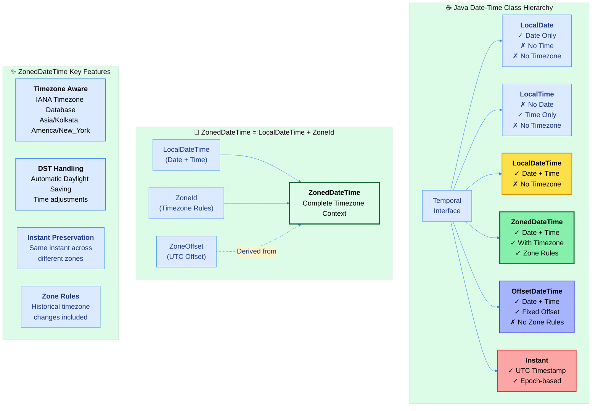

---

## 📑 Table of Contents
1. [ZonedDateTime Overview - Timezone-Aware Operations](#1-zoneddatetime-overview---timezone-aware-operations)
    - [Core Characteristics & Philosophy](#11-core-characteristics--philosophy)
    - [Why ZonedDateTime Over Other Date-Time Classes](#12-why-zoneddatetime-over-other-date-time-classes)
    - [Internal Architecture & Components](#13-internal-architecture--components)
2. [Timezone Fundamentals](#2-timezone-fundamentals)
    - [ZoneId vs ZoneOffset](#21-zoneid-vs-zoneoffset)
    - [IANA Timezone Database](#22-iana-timezone-database)
    - [Daylight Saving Time (DST)](#23-daylight-saving-time-dst)
3. [ZonedDateTime Creation & Factory Methods](#3-zoneddatetime-creation--factory-methods)
    - [Factory Method Patterns](#31-factory-method-patterns)
    - [Component Extraction](#32-component-extraction)
4. [Zone Conversion Operations](#4-zone-conversion-operations)
    - [Same Instant Conversion](#41-same-instant-conversion)
    - [Same Local Time Conversion](#42-same-local-time-conversion)
    - [Instant Preservation Principles](#43-instant-preservation-principles)
5. [Date-Time Arithmetic with Timezones](#5-date-time-arithmetic-with-timezones)
    - [Plus Operations](#51-plus-operations)
    - [Minus Operations](#52-minus-operations)
    - [DST-Aware Arithmetic](#53-dst-aware-arithmetic)
6. [Parsing & Formatting](#6-parsing--formatting)
    - [ISO-8601 with Timezone](#61-iso-8601-with-timezone)
    - [Custom Timezone Formatters](#62-custom-timezone-formatters)
7. [Comparison & Validation](#7-comparison--validation)
    - [Cross-Timezone Comparison](#71-cross-timezone-comparison)
    - [Instant Equality](#72-instant-equality)
8. [Temporal Adjusters with Zones](#8-temporal-adjusters-with-zones)
9. [Interoperability & Conversions](#9-interoperability--conversions)
10. [Performance & Best Practices](#10-performance--best-practices)
11. [Real-World Use Cases](#11-real-world-use-cases)

<div align="right">
<sub><em>Comprehensive notes by Avinash Dhanuka | For educational purposes</em></sub>
</div>

---

## 1. ZONEDDATETIME OVERVIEW - Timezone-Aware Operations

### 📌 Definition
**ZonedDateTime** is an **immutable date-time object** that represents a date-time with a **timezone in the ISO-8601 calendar system**. It stores all date and time fields with **nanosecond precision**, along with a **time-zone** (ZoneId) and **resolved offset** from UTC/Greenwich. This is the most complete temporal representation in Java, providing full context for any point in time globally.

### 1.1 Core Characteristics & Philosophy

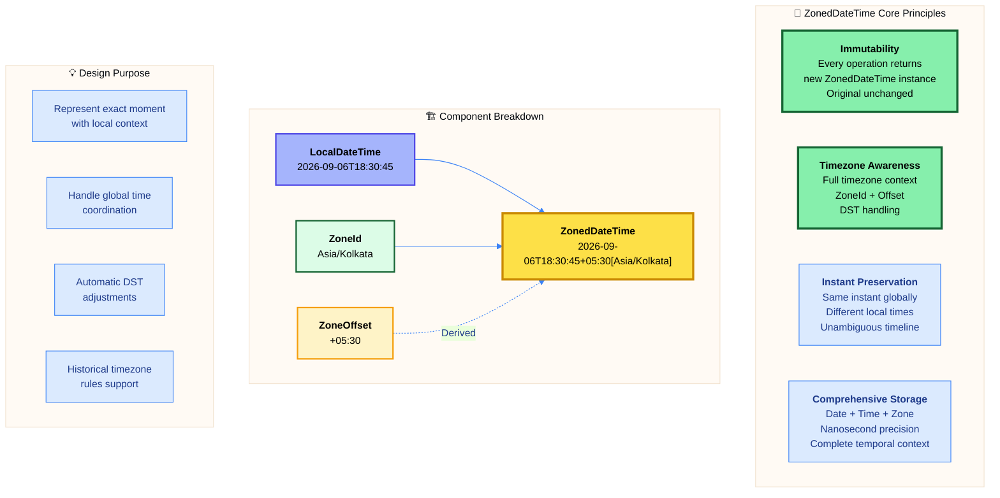

#### 📋 Characteristics Table

| Property | Value | Details |
| :--- | :--- | :--- |
| **Package** | `java.time` | Since Java 8 (JSR-310) |
| **Mutability** | ✅ Immutable | Every operation creates new instance |
| **Thread Safety** | ✅ Thread-Safe | No synchronization required |
| **Null Support** | ❌ No Null | Use Optional<ZonedDateTime> instead |
| **Date Component** | ✅ Full Date | Year, Month, Day |
| **Time Component** | ✅ Full Time | Hour, Minute, Second, Nanosecond |
| **Timezone** | ✅ ZoneId + Offset | Full timezone context with rules |
| **Format** | ISO-8601 Extended | yyyy-MM-ddTHH:mm:ss±HH:mm[Zone] |
| **Precision** | Nanosecond | Up to 999,999,999 nanoseconds |
| **DST Support** | ✅ Automatic | Follows zone rules |
| **Historical Rules** | ✅ Supported | IANA Timezone Database |

---

### 1.2 Why ZonedDateTime Over Other Date-Time Classes?


#### 🔍 Comparison Matrix

| Feature | LocalDateTime | OffsetDateTime | ZonedDateTime | Instant |
| :--- | :--- | :--- | :--- | :--- |
| **Date** | ✅ Yes | ✅ Yes | ✅ Yes | ❌ No |
| **Time** | ✅ Yes | ✅ Yes | ✅ Yes | ❌ No (UTC) |
| **Timezone** | ❌ No | ⚠️ Offset Only | ✅ Full Zone | ❌ No (UTC) |
| **Zone Rules** | ❌ No | ❌ No | ✅ Yes | ❌ No |
| **DST Handling** | ❌ No | ❌ No | ✅ Automatic | ❌ No |
| **Historical Changes** | ❌ No | ❌ No | ✅ Yes | ❌ No |
| **Use Case** | Local events | Database storage | Global coordination | Timestamps |
| **Precision** | Nanosecond | Nanosecond | Nanosecond | Nanosecond |
| **Format Example** | 2026-09-06T18:30:45 | 2026-09-06T18:30:45+05:30 | 2026-09-06T18:30:45+05:30[Asia/Kolkata] | 2026-09-06T13:00:45Z |

#### ✅ When to Use ZonedDateTime

1. **Global Applications**: Applications serving users across multiple timezones
2. **Scheduling Systems**: Meeting schedulers, calendar applications
3. **International Commerce**: E-commerce with customers worldwide
4. **Banking & Finance**: Transaction timestamps across regions
5. **Travel Industry**: Flight bookings, hotel reservations
6. **Communication Apps**: Message timestamps for international users
7. **Compliance & Auditing**: Legal timestamps with timezone context
8. **IoT & Distributed Systems**: Coordinating devices globally

#### ❌ When NOT to Use ZonedDateTime

1. **Local-Only Events**: Birthday, local appointment (use LocalDateTime)
2. **Date-Only Operations**: Birth date, holiday (use LocalDate)
3. **Duration Measurement**: Time differences (use Duration, Instant)
4. **Database Timestamps**: Storage (use Instant or OffsetDateTime)
5. **Performance-Critical**: High-frequency operations (use Instant)

#### 🎯 ZonedDateTime vs OffsetDateTime

**ZonedDateTime:**
- Stores ZoneId (e.g., "Asia/Kolkata")
- Knows zone rules (DST, historical changes)
- Automatically adjusts for DST
- Heavier object (more information)
- Best for user-facing times

**OffsetDateTime:**
- Stores fixed offset (e.g., "+05:30")
- No zone rules knowledge
- No DST handling
- Lighter object
- Best for database storage, network protocols

---

### 1.3 Internal Architecture & Components

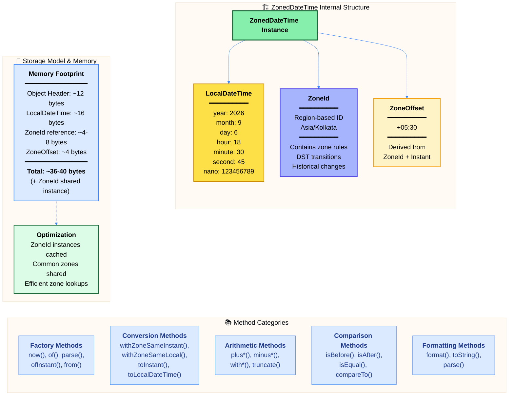

#### 🔍 Internal Representation

ZonedDateTime internally stores three fundamental components:

1. **LocalDateTime**: The local date-time (year, month, day, hour, minute, second, nanosecond)
2. **ZoneId**: The timezone identifier with zone rules (e.g., "Asia/Kolkata")
3. **ZoneOffset**: The resolved offset from UTC at that instant (e.g., "+05:30")

**Key Implementation Details:**

- **Final Fields**: All internal fields are `final`, ensuring immutability
- **ZoneId Storage**: Reference to cached ZoneId instance (memory efficient)
- **Offset Resolution**: Offset calculated from ZoneId + instant, not stored directly
- **Validation**: Constructor validates date-time and resolves timezone
- **DST Resolution**: Handles DST ambiguities and gaps automatically
- **Serialization**: Custom serialization format for efficiency

#### 🎨 Output Format

**Default toString() Format:**
```
2026-09-06T18:30:45.123456789+05:30[Asia/Kolkata]
━━━━━━━━━━━━━━━━━━━━━━━━━━━━━━━━━━━━━━━━━━━━━━
│    Date     │ Time + Nanos  │ Offset│  Zone ID  │
━━━━━━━━━━━━━━━━━━━━━━━━━━━━━━━━━━━━━━━━━━━━━━
```

**Components Breakdown:**
- `2026-09-06`: Date (ISO-8601)
- `T`: Date-Time separator
- `18:30:45.123456789`: Time with nanoseconds
- `+05:30`: UTC offset (5 hours 30 minutes ahead)
- `[Asia/Kolkata]`: ZoneId (IANA timezone database)

---

## 2. TIMEZONE FUNDAMENTALS

### 📌 Overview
Understanding timezones is crucial for effective ZonedDateTime usage. Timezones are more than just offsets—they encapsulate complex rules including DST, historical changes, and regional variations.

### 2.1 ZoneId vs ZoneOffset


```mermaid
%%{init: {
  "theme": "base",
  "themeVariables": {
    "primaryColor": "#dbeafe",
    "primaryTextColor": "#1e3a8a",
    "primaryBorderColor": "#3b82f6",
    "lineColor": "#3b82f6",
    "fontSize": "14px"
  }
}}%%

graph TB
    subgraph ZoneId_Concept["🌍 ZoneId - Region-Based Timezone"]
        ZI_Def["<b>ZoneId</b><br/>Region-based identifier<br/>Example: Asia/Kolkata"]
        
        ZI_Features["<b>Contains:</b><br/>• Zone rules<br/>• DST transitions<br/>• Historical changes<br/>• Future predictions"]
        
        ZI_Examples["<b>Examples:</b><br/>Asia/Kolkata<br/>America/New_York<br/>Europe/London<br/>Asia/Tokyo<br/>Australia/Sydney"]
        
        ZI_Def --> ZI_Features
        ZI_Features --> ZI_Examples
    end
    
    subgraph ZoneOffset_Concept["⏰ ZoneOffset - Fixed UTC Offset"]
        ZO_Def["<b>ZoneOffset</b><br/>Fixed offset from UTC<br/>Example: +05:30"]
        
        ZO_Features["<b>Contains:</b><br/>• Hours offset<br/>• Minutes offset<br/>• Seconds offset<br/>• No DST knowledge"]
        
        ZO_Examples["<b>Examples:</b><br/>+05:30 (India)<br/>-05:00 (EST)<br/>+00:00 (UTC)<br/>+09:00 (Japan)<br/>-08:00 (PST)"]
        
        ZO_Def --> ZO_Features
        ZO_Features --> ZO_Examples
    end
    
    subgraph Key_Differences["⚖️ Key Differences"]
        D1["<b>ZoneId</b><br/>Dynamic (changes with DST)<br/>Knows history & rules<br/>User-friendly names<br/>Best for user-facing times"]
        
        D2["<b>ZoneOffset</b><br/>Static (fixed offset)<br/>No rules knowledge<br/>Simple numeric format<br/>Best for storage/network"]
        
        D1 -.->|Different Purposes| D2
    end
    
    style ZI_Def fill:#86efac,stroke:#166534,stroke-width:3px,color:#000
    style ZO_Def fill:#fde047,stroke:#ca8a04,stroke-width:3px,color:#000
    style ZI_Features fill:#dcfce7,stroke:#166534,stroke-width:2px,color:#000
    style ZO_Features fill:#fef3c7,stroke:#f59e0b,stroke-width:2px,color:#000
    style D1 fill:#a5b4fc,stroke:#4f46e5,stroke-width:2px,color:#000
    style D2 fill:#fca5a5,stroke:#dc2626,stroke-width:2px,color:#000
```

#### 📋 Detailed Comparison

| Aspect | ZoneId | ZoneOffset |
| :--- | :--- | :--- |
| **Type** | Region-based identifier | Fixed numeric offset |
| **Format** | Asia/Kolkata, America/New_York | +05:30, -05:00, +00:00 |
| **DST Aware** | ✅ Yes - automatically adjusts | ❌ No - always fixed |
| **Zone Rules** | ✅ Contains full rules | ❌ No rules |
| **Historical Changes** | ✅ Knows past changes | ❌ No knowledge |
| **Future Predictions** | ✅ Can predict changes | ❌ No predictions |
| **Storage Size** | Reference to shared instance | 4 bytes (total seconds) |
| **Creation** | `ZoneId.of("Asia/Kolkata")` | `ZoneOffset.of("+05:30")` |
| **Use Case** | User-facing applications | Database, network protocols |
| **Ambiguity Handling** | ✅ Resolves DST gaps/overlaps | ❌ No ambiguity handling |

#### 🎯 Relationship

**ZoneId produces ZoneOffset:**
```
ZoneId ("Asia/Kolkata") + Instant (moment in time) → ZoneOffset (+05:30)
```

The offset depends on the instant because DST rules may change it:
- Summer: Offset might be +05:30
- Winter: Offset might be +05:00 (if DST applied)

**Important:** A ZoneId is **NOT** just an offset—it's a set of rules that determine the offset at any given moment.

---

### 2.2 IANA Timezone Database

#### 📚 Overview

The **IANA (Internet Assigned Numbers Authority) Timezone Database** (also called tz database or tzdata) is the authoritative source for timezone information worldwide. Java's ZoneId uses this database.

#### 🌐 Database Structure

| Component | Description | Example |
| :--- | :--- | :--- |
| **Region/City Format** | Continent/City or Area/Location | Asia/Kolkata, America/New_York |
| **Zone Rules** | DST start/end dates, offset changes | When DST begins/ends |
| **Historical Data** | Past timezone changes | India was +05:21 before 1942 |
| **Future Predictions** | Planned changes | Known future DST schedules |
| **Version Updates** | Regular updates for changes | tzdata2026a, tzdata2026b, etc. |

#### 🗺️ Geographic Distribution

**Available Zones:** 600+ timezone identifiers

**Major Regions:**
- **Africa:** Africa/Cairo, Africa/Lagos, Africa/Johannesburg
- **America:** America/New_York, America/Los_Angeles, America/Sao_Paulo
- **Asia:** Asia/Kolkata, Asia/Tokyo, Asia/Shanghai, Asia/Dubai
- **Europe:** Europe/London, Europe/Paris, Europe/Berlin, Europe/Moscow
- **Pacific:** Pacific/Auckland, Pacific/Fiji, Pacific/Honolulu
- **Australia:** Australia/Sydney, Australia/Melbourne, Australia/Perth

#### 🔍 Zone Naming Convention

**Format:** `Continent/City` or `Area/Location`

**Why Cities, Not Countries?**
- Countries may have multiple timezones (USA has 6+ zones)
- Cities are more specific and stable
- Handles cases where country borders change

**Examples:**
- India: `Asia/Kolkata` (not Asia/India)
- USA East: `America/New_York` (not America/USA_East)
- UK: `Europe/London` (not Europe/UK)

#### ⚠️ Deprecated Zones

Some zones are **links** (aliases) to maintain backward compatibility:

| Deprecated | Canonical |
| :--- | :--- |
| Asia/Calcutta | Asia/Kolkata |
| US/Eastern | America/New_York |
| Europe/Kiev | Europe/Kyiv |

**Best Practice:** Always use the canonical zone name.

---

### 2.3 Daylight Saving Time (DST)


#### 📌 Definition

**Daylight Saving Time (DST)** is the practice of advancing clocks during warmer months to extend evening daylight. Typically, clocks are moved forward 1 hour in spring ("spring forward") and back 1 hour in autumn ("fall back").

#### 🔄 DST Transitions

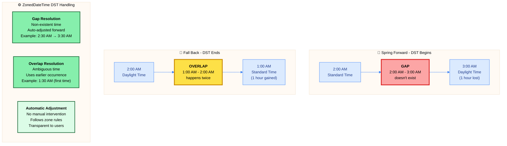

#### 🌍 DST Worldwide Variations

| Region | DST Practice | Details |
| :--- | :--- | :--- |
| **United States** | ✅ Observed | 2nd Sunday March - 1st Sunday November |
| **European Union** | ✅ Observed | Last Sunday March - Last Sunday October |
| **Australia** | ✅ Observed | 1st Sunday October - 1st Sunday April |
| **India** | ❌ Not Observed | UTC+05:30 year-round |
| **China** | ❌ Not Observed | UTC+08:00 year-round (entire country) |
| **Japan** | ❌ Not Observed | UTC+09:00 year-round |
| **Brazil** | ⚠️ Varies | Abolished in 2019, previously observed |
| **Russia** | ❌ Not Observed | Abolished in 2014, permanent standard time |

#### 🎯 DST Problems ZonedDateTime Solves

1. **Gap Problem (Spring Forward):**
   - Problem: 2:30 AM doesn't exist on DST start day
   - Solution: ZonedDateTime automatically adjusts to 3:30 AM

2. **Overlap Problem (Fall Back):**
   - Problem: 1:30 AM occurs twice on DST end day
   - Solution: ZonedDateTime uses earlier occurrence by default

3. **Arithmetic Across DST Boundaries:**
   - Problem: Adding 24 hours ≠ Adding 1 day during DST transition
   - Solution: ZonedDateTime correctly handles both operations

4. **Historical DST Changes:**
   - Problem: DST rules change over time
   - Solution: IANA database includes historical rules

#### ⚠️ Important DST Considerations

**Adding Periods vs Adding Time Units:**

```
Date-based addition (respects DST):
  2026-03-10 01:00 PST + 1 day = 2026-03-11 01:00 PDT
  (Wall clock shows 1 AM both times, but 23 hours elapsed)

Time-based addition (ignores DST):
  2026-03-10 01:00 PST + 24 hours = 2026-03-11 02:00 PDT
  (Exactly 24 hours elapsed, wall clock shows 2 AM)
```

**Best Practice:** Use appropriate method based on use case:
- User-facing: Use date-based addition (plusDays)
- Exact duration: Use time-based addition (plusHours)

---

## 3. ZONEDDATETIME CREATION & Factory Methods

### 📌 Overview
ZonedDateTime provides multiple factory methods for creation, each suited for different scenarios. Understanding when to use each method is crucial for clean, maintainable code.

### 3.1 Factory Method Patterns

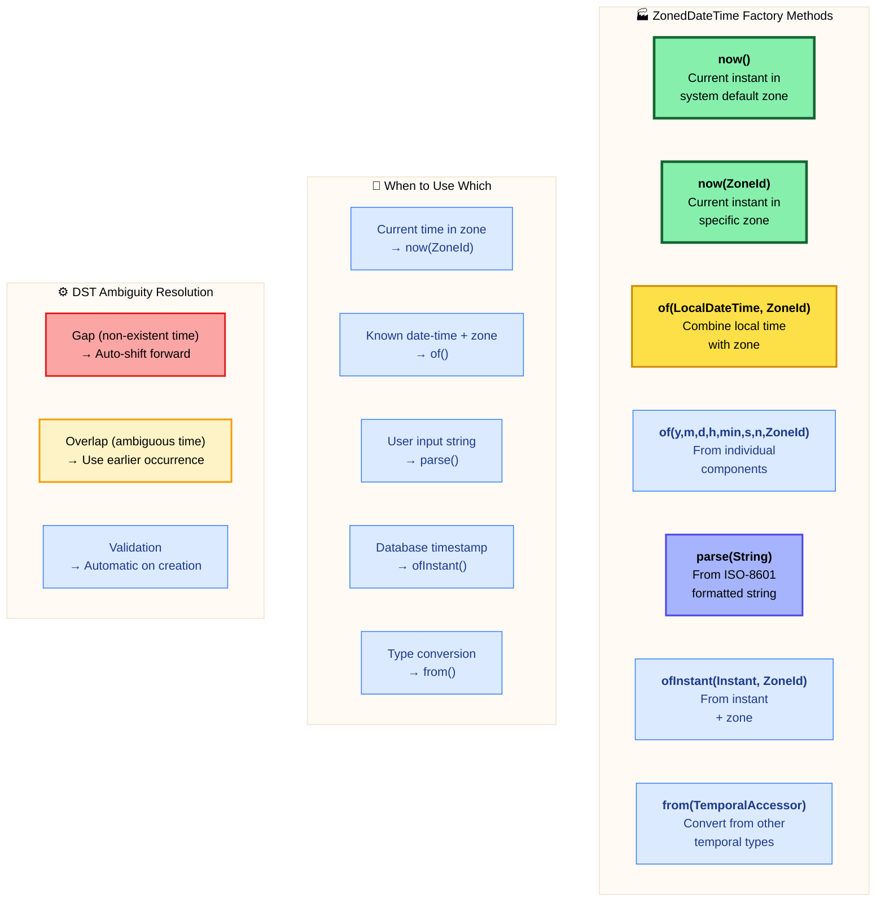

#### 📋 Factory Methods Reference

| Method | Signature | Use Case | Example |
| :--- | :--- | :--- | :--- |
| **now()** | `static ZonedDateTime now()` | Current time, system zone | `ZonedDateTime.now()` |
| **now(ZoneId)** | `static ZonedDateTime now(ZoneId zone)` | Current time, specific zone | `ZonedDateTime.now(ZoneId.of("Asia/Tokyo"))` |
| **of(...)** | `static ZonedDateTime of(int y, int m, int d, int h, int min, int s, int n, ZoneId z)` | From components | `ZonedDateTime.of(2026, 9, 6, 18, 30, 0, 0, ZoneId.of("Asia/Kolkata"))` |
| **of(LocalDateTime, ZoneId)** | `static ZonedDateTime of(LocalDateTime ldt, ZoneId zone)` | Combine local + zone | `ZonedDateTime.of(localDateTime, zoneId)` |
| **ofInstant(Instant, ZoneId)** | `static ZonedDateTime ofInstant(Instant instant, ZoneId zone)` | From instant + zone | `ZonedDateTime.ofInstant(instant, ZoneId.of("America/New_York"))` |
| **parse(String)** | `static ZonedDateTime parse(CharSequence text)` | From ISO-8601 string | `ZonedDateTime.parse("2026-09-06T18:30:45+05:30[Asia/Kolkata]")` |
| **parse(String, DateTimeFormatter)** | `static ZonedDateTime parse(CharSequence text, DateTimeFormatter formatter)` | Custom format | `ZonedDateTime.parse(text, formatter)` |
| **from(TemporalAccessor)** | `static ZonedDateTime from(TemporalAccessor temporal)` | Type conversion | `ZonedDateTime.from(temporal)` |

#### 🎯 Creation Strategy Guidelines

**1. Current Time:**
- System zone: `ZonedDateTime.now()`
- Specific zone: `ZonedDateTime.now(ZoneId.of("Asia/Kolkata"))`

**2. User Input:**
- ISO format: `ZonedDateTime.parse(userInput)`
- Custom format: Use DateTimeFormatter

**3. Database/API:**
- From Instant: `ofInstant(instant, zoneId)`
- From epoch: Convert to Instant first

**4. Programmatic Creation:**
- Known values: `of(2026, 9, 6, 18, 30, 0, 0, zoneId)`
- From LocalDateTime: `ldt.atZone(zoneId)`

---

### 3.2 Component Extraction


#### 📋 Accessor Methods

| Method | Return Type | Description | Example Output |
| :--- | :--- | :--- | :--- |
| **getYear()** | int | Year component | 2026 |
| **getMonthValue()** | int | Month as int (1-12) | 9 |
| **getMonth()** | Month | Month as enum | SEPTEMBER |
| **getDayOfMonth()** | int | Day of month (1-31) | 6 |
| **getDayOfWeek()** | DayOfWeek | Day as enum | SATURDAY |
| **getDayOfYear()** | int | Day number in year | 249 |
| **getHour()** | int | Hour (0-23) | 18 |
| **getMinute()** | int | Minute (0-59) | 30 |
| **getSecond()** | int | Second (0-59) | 45 |
| **getNano()** | int | Nanosecond (0-999,999,999) | 123456789 |
| **getZone()** | ZoneId | Timezone | Asia/Kolkata |
| **getOffset()** | ZoneOffset | UTC offset | +05:30 |
| **toLocalDate()** | LocalDate | Extract date | 2026-09-06 |
| **toLocalTime()** | LocalTime | Extract time | 18:30:45.123456789 |
| **toLocalDateTime()** | LocalDateTime | Extract date-time | 2026-09-06T18:30:45.123456789 |
| **toInstant()** | Instant | Convert to UTC instant | 2026-09-06T13:00:45.123456789Z |
| **toEpochSecond()** | long | Unix timestamp (seconds) | 1788997845 |

#### 🔍 Component Extraction Patterns

**Date Components:**
```
ZonedDateTime zdt = ZonedDateTime.parse("2026-09-06T18:30:45+05:30[Asia/Kolkata]");

Year:         2026
Month:        SEPTEMBER (9)
Day of Month: 6
Day of Week:  SATURDAY
Day of Year:  249
```

**Time Components:**
```
Hour:    18 (6 PM)
Minute:  30
Second:  45
Nano:    0
```

**Timezone Components:**
```
Zone:         Asia/Kolkata
Offset:       +05:30
Total Offset: 19800 seconds (5.5 hours)
```

#### 🎯 Extraction Use Cases

1. **Display Formatting**: Extract components for custom display
2. **Business Logic**: Check day of week, hour for business rules
3. **Conversion**: Extract LocalDate/Time for local operations
4. **Comparison**: Get instant for cross-zone comparison
5. **Storage**: Convert to epoch seconds for database

---

## 4. ZONE CONVERSION OPERATIONS

### 📌 Overview
Zone conversion is one of ZonedDateTime's most powerful features. It allows representing the same instant in different timezones or changing the timezone while preserving local time.

### 4.1 Same Instant Conversion

**Concept:** Convert ZonedDateTime to different timezone while keeping the **same instant in time** (same moment globally).

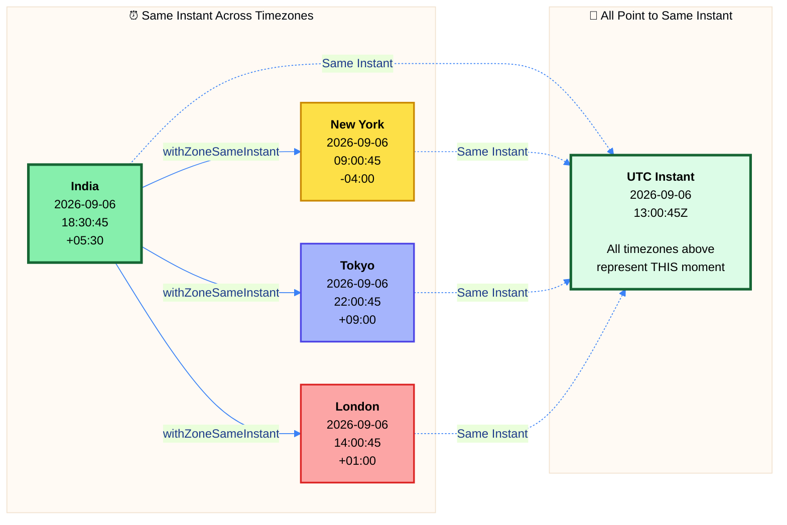

#### 📋 Method: withZoneSameInstant()

**Signature:** `ZonedDateTime withZoneSameInstant(ZoneId zone)`

**Behavior:**
- Changes the timezone
- **Adjusts** local date-time to maintain same instant
- Useful for: Showing time to users in different zones

**Use Cases:**
1. Display meeting time to participants in different countries
2. Convert server timestamp to user's local timezone
3. Show flight arrival time in destination timezone
4. International communication timestamps

**Key Point:** The **instant** (moment in absolute time) remains unchanged, but the **local date-time** changes to reflect the new timezone.

---

### 4.2 Same Local Time Conversion

**Concept:** Change timezone while keeping the **same local date-time** (wall clock time), resulting in a **different instant**.

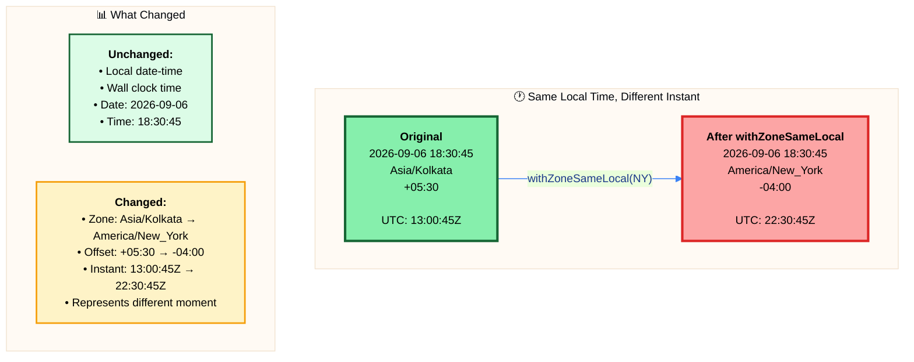

#### 📋 Method: withZoneSameLocal()

**Signature:** `ZonedDateTime withZoneSameLocal(ZoneId zone)`

**Behavior:**
- Changes the timezone
- **Keeps** local date-time unchanged
- Results in different instant
- Useful for: Relocating events to new timezone

**Use Cases:**
1. User moves to different timezone, keep their schedule times
2. "9 AM daily standup" in user's current timezone (wherever they are)
3. Converting local event times when relocating
4. Preserving wall clock times across zones

**⚠️ Warning:** This can be confusing—use sparingly and document clearly. In most cases, you want `withZoneSameInstant()`.

---

### 4.3 Instant Preservation Principles

#### 🎯 Golden Rule

**"An instant is a point on the timeline. A ZonedDateTime is a label for that point."**


**Two different ZonedDateTime objects can represent the SAME instant:**

```
India:    2026-09-06T18:30:45+05:30[Asia/Kolkata]
New York: 2026-09-06T09:00:45-04:00[America/New_York]
Tokyo:    2026-09-06T22:00:45+09:00[Asia/Tokyo]

All three represent: 2026-09-06T13:00:45Z (same UTC instant)
```

#### 📊 Conversion Decision Matrix

| Requirement | Method to Use | Example Scenario |
| :--- | :--- | :--- |
| Show time to user in their zone | `withZoneSameInstant()` | Meeting scheduled for 2 PM IST, show to NY user |
| Keep wall clock time, change zone | `withZoneSameLocal()` | User relocates, keep "9 AM alarm" in new zone |
| Convert to UTC for storage | `toInstant()` | Store timestamp in database |
| Convert from UTC to display zone | `ofInstant(instant, zoneId)` | Retrieve from database, show to user |
| Get instant for comparison | `toInstant()` or `compareTo()` | Compare times across zones |

#### 🔍 Instant Preservation Best Practices

1. **Store Instants, Display ZonedDateTime:**
   - Database: Store as Instant or epoch seconds
   - Display: Convert to user's ZonedDateTime

2. **Always Use Same Instant for Cross-Zone:**
   - When showing same event to multiple users
   - Use `withZoneSameInstant()` consistently

3. **Document Local vs Instant:**
   - Clearly document which conversion you're using
   - Add comments explaining why

4. **Validate After Conversion:**
   - Check that conversion produced expected result
   - Test with DST boundaries

---

## 5. DATE-TIME ARITHMETIC WITH TIMEZONES

### 📌 Overview
ZonedDateTime arithmetic is more complex than LocalDateTime because it must account for DST transitions and timezone rules. Understanding these nuances prevents subtle bugs.

### 5.1 Plus Operations

#### 📋 Plus Methods Reference

| Method | Unit | DST Aware | Example |
| :--- | :--- | :--- | :--- |
| **plusYears(long)** | Years | ✅ Yes | `zdt.plusYears(1)` |
| **plusMonths(long)** | Months | ✅ Yes | `zdt.plusMonths(3)` |
| **plusWeeks(long)** | Weeks | ✅ Yes | `zdt.plusWeeks(2)` |
| **plusDays(long)** | Days | ✅ Yes | `zdt.plusDays(5)` |
| **plusHours(long)** | Hours | ⚠️ Partial | `zdt.plusHours(24)` |
| **plusMinutes(long)** | Minutes | ❌ No | `zdt.plusMinutes(60)` |
| **plusSeconds(long)** | Seconds | ❌ No | `zdt.plusSeconds(3600)` |
| **plusNanos(long)** | Nanoseconds | ❌ No | `zdt.plusNanos(1000000)` |

#### 🎯 Date-Based vs Time-Based Addition

**Date-Based Operations (DST Aware):**
- plusYears, plusMonths, plusWeeks, plusDays
- Preserve local time when possible
- Handle DST transitions intelligently

**Time-Based Operations (Exact Duration):**
- plusHours, plusMinutes, plusSeconds, plusNanos
- Add exact duration (may cross DST boundary)
- May change local time unexpectedly

**Critical Example:**

```
Date-based:
  2026-03-08 01:00 PST + 1 day = 2026-03-09 01:00 PDT
  (Wall clock: 1 AM both days, actual elapsed: 23 hours due to DST)

Time-based:
  2026-03-08 01:00 PST + 24 hours = 2026-03-09 02:00 PDT
  (Exactly 24 hours elapsed, wall clock shows 2 AM)
```

#### ⚠️ DST Boundary Considerations

**Spring Forward (Losing 1 hour):**
```
2026-03-08 01:30 PST + 1 hour = 2026-03-08 03:30 PDT
(2:30 doesn't exist, skipped)

2026-03-08 01:30 PST + 1 day = 2026-03-09 01:30 PDT
(Preserves 1:30 AM local time)
```

**Fall Back (Gaining 1 hour):**
```
2026-11-01 00:30 PDT + 2 hours = 2026-11-01 01:30 PST
(1:30 happens twice, second occurrence)

2026-11-01 00:30 PDT + 1 day = 2026-11-02 00:30 PST
(Preserves 12:30 AM local time)
```

---

### 5.2 Minus Operations

#### 📋 Minus Methods Reference

| Method | Unit | DST Aware | Example |
| :--- | :--- | :--- | :--- |
| **minusYears(long)** | Years | ✅ Yes | `zdt.minusYears(1)` |
| **minusMonths(long)** | Months | ✅ Yes | `zdt.minusMonths(3)` |
| **minusWeeks(long)** | Weeks | ✅ Yes | `zdt.minusWeeks(2)` |
| **minusDays(long)** | Days | ✅ Yes | `zdt.minusDays(5)` |
| **minusHours(long)** | Hours | ⚠️ Partial | `zdt.minusHours(24)` |
| **minusMinutes(long)** | Minutes | ❌ No | `zdt.minusMinutes(60)` |
| **minusSeconds(long)** | Seconds | ❌ No | `zdt.minusSeconds(3600)` |
| **minusNanos(long)** | Nanoseconds | ❌ No | `zdt.minusNanos(1000000)` |

**Behavior:** Minus operations follow the same DST rules as plus operations but in reverse direction.

---

### 5.3 DST-Aware Arithmetic

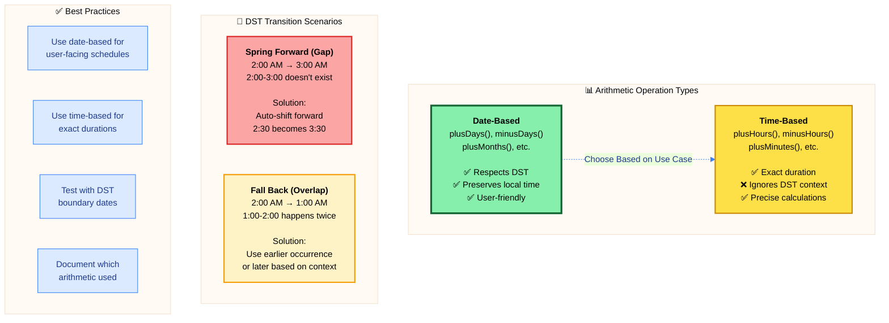

#### 🎯 Arithmetic Decision Guide

| Use Case | Recommended Operation | Reason |
| :--- | :--- | :--- |
| Daily recurring event | `plusDays(1)` | Preserves local time (9 AM stays 9 AM) |
| Meeting in 24 hours | `plusHours(24)` | Exactly 24 hours, may shift local time |
| Monthly billing date | `plusMonths(1)` | Handles month-end correctly |
| SLA deadline (48h) | `plusHours(48)` | Exact duration required |
| Birthday reminder | `plusYears(1)` | Same date next year |
| Schedule for tomorrow | `plusDays(1)` | Same time tomorrow (local) |
| API rate limit reset | `plusHours(1)` | Exact hour from now |

#### ⚠️ Common Pitfalls

1. **Adding 24 hours ≠ Adding 1 day during DST:**
   - Use plusDays() for calendar days
   - Use plusHours(24) for exact 24-hour periods

2. **Month-end overflow:**
   - Jan 31 + 1 month = Feb 28/29 (not Mar 3)
   - ZonedDateTime handles this automatically

3. **Leap year considerations:**
   - Feb 29 + 1 year = Feb 28 (non-leap year)
   - Automatic adjustment to last valid day

4. **DST ambiguity:**
   - Test edge cases around DST transitions
   - Document expected behavior

---

## 6. PARSING & FORMATTING

### 📌 Overview
ZonedDateTime parsing and formatting must handle timezone information in addition to date-time components. Multiple format options exist for different use cases.

### 6.1 ISO-8601 with Timezone


#### 📋 ISO-8601 Format Variants

**Complete Format:**
```
2026-09-06T18:30:45.123456789+05:30[Asia/Kolkata]
━━━━━━━━━━━━━━━━━━━━━━━━━━━━━━━━━━━━━━━━━━━━━━━━
│   Date    │    Time + Nanos    │ Offset │ Zone  │
━━━━━━━━━━━━━━━━━━━━━━━━━━━━━━━━━━━━━━━━━━━━━━━━
```

**Format Variations:**

| Format | Example | Parse Support |
| :--- | :--- | :--- |
| **Full with Zone** | `2026-09-06T18:30:45+05:30[Asia/Kolkata]` | ✅ Yes |
| **With Offset Only** | `2026-09-06T18:30:45+05:30` | ✅ Yes (defaults to offset-based zone) |
| **With Nanoseconds** | `2026-09-06T18:30:45.123456789+05:30[Asia/Kolkata]` | ✅ Yes |
| **Without Seconds** | `2026-09-06T18:30+05:30[Asia/Kolkata]` | ✅ Yes (seconds = 0) |
| **UTC Indicator** | `2026-09-06T13:00:45Z` | ✅ Yes (Z = UTC) |
| **Offset Variations** | `+05:30`, `+0530`, `+05` | ✅ All supported |

#### 🎯 Parsing Rules

**Default Parser (ISO_ZONED_DATE_TIME):**
- Expects date, time, and timezone information
- Offset is required
- Zone ID is optional
- Handles various ISO-8601 formats

**Parsing Behavior:**

1. **With Zone ID:**
   ```
   Input:  "2026-09-06T18:30:45+05:30[Asia/Kolkata]"
   Result: Uses Asia/Kolkata with offset validation
   ```

2. **Offset Only:**
   ```
   Input:  "2026-09-06T18:30:45+05:30"
   Result: Creates ZoneOffset-based zone (no DST rules)
   ```

3. **UTC (Z):**
   ```
   Input:  "2026-09-06T13:00:45Z"
   Result: Zone is UTC, offset is +00:00
   ```

#### ⚠️ Parsing Validation

**Offset Mismatch:**
```
Input: "2026-09-06T18:30:45+02:00[Asia/Kolkata]"
Error: Offset +02:00 doesn't match Asia/Kolkata rules
```

The offset must be valid for the specified zone at that instant. If they conflict, DateTimeParseException is thrown.

---

### 6.2 Custom Timezone Formatters

#### 📋 Pattern Symbols for Timezones

| Symbol | Meaning | Example Output |
| :--- | :--- | :--- |
| **z** | Timezone name (short) | IST, PST, EST |
| **zzzz** | Timezone name (full) | India Standard Time |
| **Z** | Offset without colon | +0530, -0400 |
| **ZZ** | Offset with colon | +05:30, -04:00 |
| **ZZZ** | Offset with colon (extended) | +05:30:00 |
| **ZZZZZ** | Offset (ISO format) | +05:30, Z |
| **X** | Offset hour or Z | +05, Z |
| **XX** | Offset hour-minute or Z | +0530, Z |
| **XXX** | Offset hour:minute or Z | +05:30, Z |
| **VV** | Zone ID | Asia/Kolkata |
| **O** | Localized offset | GMT+5:30 |
| **OOOO** | Localized offset (full) | GMT+05:30 |

#### 🎨 Common Format Patterns

```
Pattern: "dd-MM-yyyy HH:mm:ss z"
Output:  "06-09-2026 18:30:45 IST"

Pattern: "dd/MM/yyyy hh:mm a VV"
Output:  "06/09/2026 06:30 PM Asia/Kolkata"

Pattern: "EEEE, dd MMMM yyyy HH:mm:ss z"
Output:  "Saturday, 06 September 2026 18:30:45 IST"

Pattern: "yyyy-MM-dd'T'HH:mm:ssXXX"
Output:  "2026-09-06T18:30:45+05:30"

Pattern: "dd-MMM-yyyy hh:mm:ss a XXX"
Output:  "06-Sep-2026 06:30:45 PM +05:30"
```

#### 🎯 Formatter Best Practices

1. **Include Timezone for Clarity:**
   - Always include timezone in formatted output
   - Use VV (zone ID) or z (zone name) for user display

2. **Use ISO Format for APIs:**
   - ISO_ZONED_DATE_TIME for machine-readable output
   - Includes all necessary information

3. **Localized Display:**
   - Use FormatStyle for locale-specific formatting
   - Include timezone name in user's language

4. **Parsing Leniency:**
   - Use ResolverStyle for flexible parsing
   - Handle multiple input formats

5. **Cache Formatters:**
   - DateTimeFormatter is thread-safe
   - Create once, reuse multiple times

#### 📊 Predefined Formatters

| Formatter | Example Output | Use Case |
| :--- | :--- | :--- |
| **ISO_ZONED_DATE_TIME** | 2026-09-06T18:30:45+05:30[Asia/Kolkata] | Standard API format |
| **ISO_OFFSET_DATE_TIME** | 2026-09-06T18:30:45+05:30 | Without zone ID |
| **RFC_1123_DATE_TIME** | Sat, 6 Sep 2026 18:30:45 +0530 | HTTP headers, emails |

---

## 7. COMPARISON & VALIDATION

### 📌 Overview
Comparing ZonedDateTime objects requires understanding instant equality vs local equality. Two ZonedDateTime objects can represent the same instant but with different local times.

### 7.1 Cross-Timezone Comparison

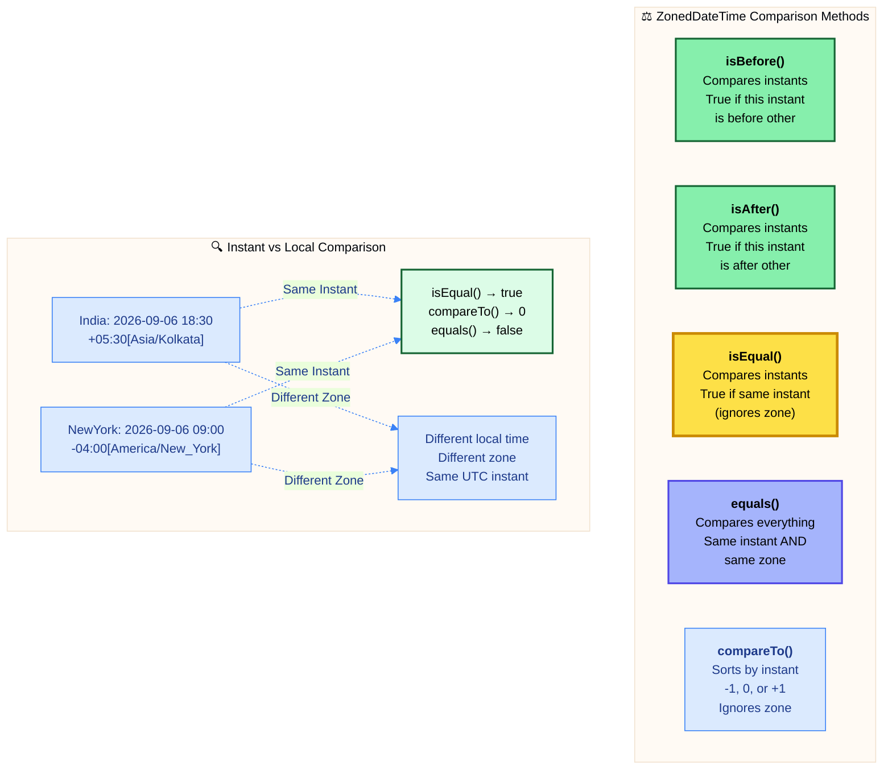

#### 📋 Comparison Methods Reference

| Method | Return | Compares | Timezone Sensitive | Example |
| :--- | :--- | :--- | :--- | :--- |
| **isBefore(ZonedDateTime)** | boolean | Instants | ❌ No | `zdt1.isBefore(zdt2)` |
| **isAfter(ZonedDateTime)** | boolean | Instants | ❌ No | `zdt1.isAfter(zdt2)` |
| **isEqual(ZonedDateTime)** | boolean | Instants | ❌ No | `zdt1.isEqual(zdt2)` |
| **equals(Object)** | boolean | Instant + Zone | ✅ Yes | `zdt1.equals(zdt2)` |
| **compareTo(ZonedDateTime)** | int | Instants | ❌ No | `zdt1.compareTo(zdt2)` |

#### 🎯 Comparison Logic

**Instant-Based Comparison (Most Common):**
```
India:    2026-09-06 18:30:45 +05:30[Asia/Kolkata]
New York: 2026-09-06 09:00:45 -04:00[America/New_York]

Both represent: 2026-09-06T13:00:45Z (UTC)

india.isEqual(newYork)     → true  (same instant)
india.isBefore(newYork)    → false (same instant)
india.isAfter(newYork)     → false (same instant)
india.compareTo(newYork)   → 0     (equal instants)
```

**Object Equality (Zone-Aware):**
```
india.equals(newYork)      → false (different zones)

Only true if:
  - Same instant
  - Same zone
  - Same offset
```

---

### 7.2 Instant Equality

#### 🎯 Understanding Instant Equality

**Key Concept:** Multiple ZonedDateTime objects can represent the **same instant** with **different local representations**.

**Example Scenario:**
```
Meeting scheduled for: 2026-09-06 18:30 IST

Displayed to users:
- India:     18:30 IST (Asia/Kolkata)
- New York:  09:00 EDT (America/New_York)
- Tokyo:     22:00 JST (Asia/Tokyo)
- London:    14:00 BST (Europe/London)

All represent the SAME instant in time!
```

#### 📊 Equality Comparison Table

| ZonedDateTime 1 | ZonedDateTime 2 | isEqual() | equals() | Reason |
| :--- | :--- | :--- | :--- | :--- |
| 2026-09-06T18:30+05:30[Asia/Kolkata] | 2026-09-06T09:00-04:00[America/New_York] | ✅ true | ❌ false | Same instant, different zone |
| 2026-09-06T18:30+05:30[Asia/Kolkata] | 2026-09-06T18:30+05:30[Asia/Kolkata] | ✅ true | ✅ true | Identical |
| 2026-09-06T18:30+05:30[Asia/Kolkata] | 2026-09-06T19:30+05:30[Asia/Kolkata] | ❌ false | ❌ false | Different instants |

#### ⚠️ Common Mistakes

**Mistake 1: Using equals() for cross-timezone comparison**
```
❌ BAD:  if (meetingTimeIndia.equals(meetingTimeNewYork))
✅ GOOD: if (meetingTimeIndia.isEqual(meetingTimeNewYork))
```

**Mistake 2: Comparing local times instead of instants**
```
❌ BAD:  comparing getHour() values across zones
✅ GOOD: use isBefore(), isAfter(), isEqual()
```

**Mistake 3: Ignoring timezone in sorting**
```
✅ CORRECT: compareTo() automatically compares instants
           (timezone-independent sorting)
```

---

## 8. TEMPORAL ADJUSTERS WITH ZONES

### 📌 Overview
Temporal adjusters work with ZonedDateTime just like LocalDateTime, but maintain timezone context throughout adjustments.


#### 📋 Built-in Temporal Adjusters

All TemporalAdjusters from LocalDateTime work with ZonedDateTime:

| Adjuster | Description | Example Result (from 2026-09-15) |
| :--- | :--- | :--- |
| **firstDayOfMonth()** | First day of current month | 2026-09-01T[same time][zone] |
| **lastDayOfMonth()** | Last day of current month | 2026-09-30T[same time][zone] |
| **firstDayOfNextMonth()** | First day of next month | 2026-10-01T[same time][zone] |
| **firstDayOfYear()** | First day of current year | 2026-01-01T[same time][zone] |
| **lastDayOfYear()** | Last day of current year | 2026-12-31T[same time][zone] |
| **next(DayOfWeek)** | Next occurrence of day | Next Friday[same time][zone] |
| **previous(DayOfWeek)** | Previous occurrence | Previous Monday[same time][zone] |
| **nextOrSame(DayOfWeek)** | Next or same day | Next/same Tuesday[same time][zone] |
| **previousOrSame(DayOfWeek)** | Previous or same day | Previous/same Friday[same time][zone] |
| **firstInMonth(DayOfWeek)** | First day of week in month | First Monday[same time][zone] |
| **lastInMonth(DayOfWeek)** | Last day of week in month | Last Friday[same time][zone] |

#### 🎯 Timezone Preservation

**Key Behavior:** All temporal adjusters **preserve the timezone** while adjusting date components.

```
Original: 2026-09-15T18:30:45+05:30[Asia/Kolkata]

After firstDayOfMonth():
  2026-09-01T18:30:45+05:30[Asia/Kolkata]
  (Changed: day to 1st)
  (Preserved: time, zone, offset)

After next(DayOfWeek.MONDAY):
  2026-09-21T18:30:45+05:30[Asia/Kolkata]
  (Changed: date to next Monday)
  (Preserved: time, zone, offset)
```

#### ⚠️ DST Considerations with Adjusters

When adjusters cross DST boundaries, the timezone rules are applied:

**Example: Adjusting across DST transition**
```
Original: 2026-11-01T01:30:00-07:00[America/Los_Angeles] (PDT)

After nextOrSame(DayOfWeek.SUNDAY) (moves to DST end day):
  2026-11-01T01:30:00-08:00[America/Los_Angeles] (PST)
  (Offset changed due to DST ending)
```

#### 🎯 Common Use Cases with Zones

1. **End of Month Processing (Multi-Region):**
   ```
   Run job at 11:59 PM on last day of month
   in each regional timezone
   ```

2. **Weekly Meeting (Respects DST):**
   ```
   Every Monday 9:00 AM in user's timezone
   Automatically adjusts when DST changes
   ```

3. **Quarterly Reports (Global):**
   ```
   Last day of quarter in each regional office
   Maintains local business hours
   ```

---

## 9. INTEROPERABILITY & CONVERSIONS

### 📌 Overview
ZonedDateTime frequently needs conversion to/from other temporal types for different use cases. Understanding conversion patterns is essential.

#### 📋 Conversion Methods Reference

| From | To | Method | Use Case |
| :--- | :--- | :--- | :--- |
| ZonedDateTime | Instant | `toInstant()` | Database storage, UTC timestamp |
| ZonedDateTime | LocalDateTime | `toLocalDateTime()` | Remove timezone context |
| ZonedDateTime | LocalDate | `toLocalDate()` | Extract date only |
| ZonedDateTime | LocalTime | `toLocalTime()` | Extract time only |
| ZonedDateTime | OffsetDateTime | `toOffsetDateTime()` | Fixed offset (no zone rules) |
| ZonedDateTime | long (epoch) | `toEpochSecond()` | Unix timestamp |
| Instant | ZonedDateTime | `atZone(ZoneId)` | Add timezone to UTC instant |
| LocalDateTime | ZonedDateTime | `atZone(ZoneId)` | Add timezone to local time |
| LocalDate | ZonedDateTime | `atStartOfDay(ZoneId)` | Midnight in timezone |
| OffsetDateTime | ZonedDateTime | `toZonedDateTime()` | Convert offset to zone |

#### 🔄 Conversion Flow Diagram

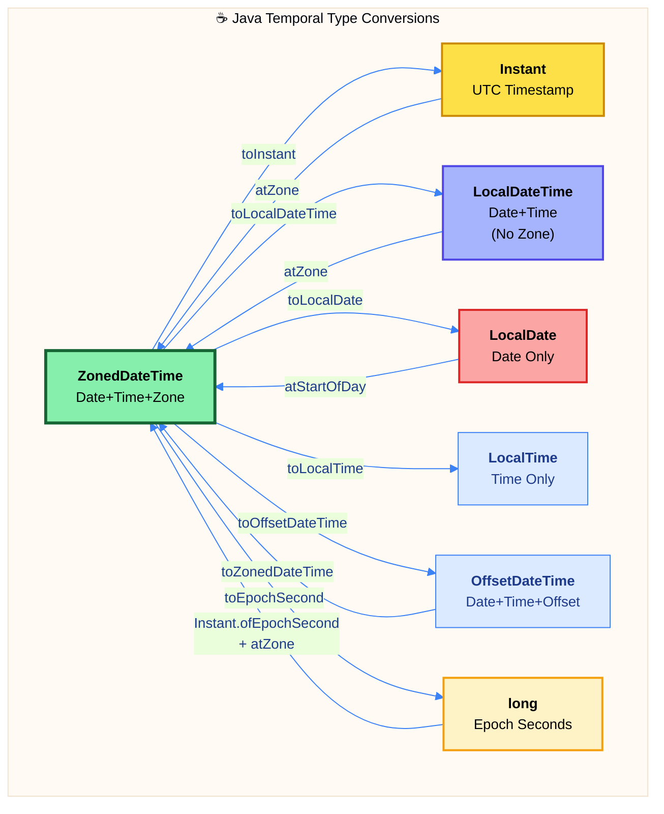

#### 🎯 Conversion Use Cases

**1. Database Storage (ZonedDateTime → Instant):**
```
Store as UTC instant (no timezone ambiguity)
Convert to ZonedDateTime for display
```

**2. API Response (Instant → ZonedDateTime):**
```
Retrieve UTC timestamp
Convert to user's timezone for display
```

**3. User Input (LocalDateTime → ZonedDateTime):**
```
User enters "2026-09-06 18:30" (no zone)
Interpret in user's timezone
```

**4. Date-Only Operations (ZonedDateTime → LocalDate):**
```
Extract date for comparisons
Perform date arithmetic
```

**5. Legacy System Integration (long → ZonedDateTime):**
```
Convert epoch seconds from legacy system
Display in appropriate timezone
```

#### ⚠️ Information Loss Warning

**Lossy Conversions (cannot reverse perfectly):**

| Conversion | Information Lost | Example |
| :--- | :--- | :--- |
| ZonedDateTime → LocalDateTime | Timezone & Offset | Cannot reconstruct original zone |
| ZonedDateTime → LocalDate | Time, Timezone & Offset | Only date remains |
| ZonedDateTime → LocalTime | Date, Timezone & Offset | Only time remains |
| ZonedDateTime → Instant | Local context (zone) | Only UTC instant remains |

**Lossless Conversions:**

| Conversion | Preserves | Reversible |
| :--- | :--- | :--- |
| ZonedDateTime → OffsetDateTime | Instant + Offset | ✅ Yes (loses zone rules) |
| ZonedDateTime → Instant | Instant | ✅ Yes (with zone parameter) |
| ZonedDateTime → long (epoch) | Instant | ✅ Yes (with zone parameter) |

---

## 10. PERFORMANCE & BEST PRACTICES

### 📌 Overview
ZonedDateTime is the most comprehensive temporal type, but with greater capability comes performance considerations. Understanding these helps write efficient code.

#### 📊 Performance Characteristics

| Operation | Time Complexity | Notes |
| :--- | :--- | :--- |
| **Creation (now)** | O(1) | System clock + timezone lookup |
| **Creation (of)** | O(1) | Validation + zone resolution |
| **Creation (parse)** | O(n) | Proportional to string length |
| **Zone Conversion** | O(1) | Offset calculation from rules |
| **Arithmetic** | O(1) | May involve DST calculation |
| **Comparison** | O(1) | Instant comparison |
| **Formatting** | O(n) | Depends on pattern complexity |
| **DST Resolution** | O(log n) | Binary search in transition rules |

#### 💾 Memory Footprint

**ZonedDateTime Storage:**
```
Object Header:        ~12 bytes
LocalDateTime:        ~16 bytes
ZoneId reference:     ~4-8 bytes
Cached offset:        ~4 bytes
─────────────────────────────────
Total:                ~36-40 bytes per instance
```

**Comparison with other types:**
- LocalDateTime: ~28-32 bytes
- OffsetDateTime: ~32-36 bytes
- **ZonedDateTime: ~36-40 bytes** (most comprehensive)
- Instant: ~16-20 bytes (most compact)

**Memory Optimization:**
- ZoneId instances are cached and shared
- Common zones (UTC, system default) reused
- Zone rules loaded lazily

#### ⚡ Performance Best Practices

**1. Cache ZoneId Instances:**
```
✅ GOOD: private static final ZoneId INDIA = ZoneId.of("Asia/Kolkata");
❌ BAD:  ZoneId.of("Asia/Kolkata") repeatedly in loops
```

**2. Use Instant for Storage:**
```
✅ GOOD: Store as Instant in database, convert to ZonedDateTime for display
❌ BAD:  Store ZonedDateTime directly (more data, parsing overhead)
```

**3. Reuse DateTimeFormatter:**
```
✅ GOOD: private static final DateTimeFormatter FORMATTER = ...;
❌ BAD:  Create formatter every time in method
```

**4. Choose Right Type:**
```
✅ GOOD: Use LocalDateTime if timezone not needed
❌ BAD:  Use ZonedDateTime everywhere (unnecessary overhead)
```

**5. Minimize Conversions:**
```
✅ GOOD: Work in ZonedDateTime throughout, convert once at boundary
❌ BAD:  Convert back and forth between types frequently
```

#### 🔒 Thread Safety

**ZonedDateTime is thread-safe:**
- Immutable object (final fields)
- No mutable state
- All methods return new instances
- Safe to share across threads

**Thread-Safe Patterns:**
```
✅ Shared constant:    private static final ZonedDateTime EPOCH = ...;
✅ Method parameter:   public void process(ZonedDateTime zdt) { ... }
✅ Return value:       public ZonedDateTime getTime() { return this.time; }
✅ Collection element: List<ZonedDateTime> times = new ArrayList<>();
```

#### 🎯 Best Practices Checklist

| Practice | ✅ Do | ❌ Don't |
| :--- | :--- | :--- |
| **Immutability** | Capture return: `zdt = zdt.plusDays(1)` | Ignore: `zdt.plusDays(1);` |
| **Null Safety** | Use `Optional<ZonedDateTime>` | Use `null` for "no time" |
| **Zone Storage** | Cache ZoneId instances | Create new every time |
| **Comparison** | Use `isEqual()`, `isBefore()`, `isAfter()` | Compare local times manually |
| **Storage** | Store as Instant | Store as ZonedDateTime |
| **Conversion** | Convert once at boundaries | Convert frequently |
| **DST Handling** | Trust automatic handling | Manual DST calculations |
| **Formatting** | Reuse formatters | Create new formatters |

#### ⚠️ Common Anti-Patterns

**1. Ignoring Return Values:**
```
❌ BAD:  zdt.plusHours(2);  // Original unchanged!
✅ GOOD: zdt = zdt.plusHours(2);  // Capture new instance
```

**2. Using null for Absence:**
```
❌ BAD:  ZonedDateTime zdt = null;
✅ GOOD: Optional<ZonedDateTime> zdt = Optional.empty();
```

**3. Manual Timezone Arithmetic:**
```
❌ BAD:  Manually adding/subtracting offsets
✅ GOOD: Use withZoneSameInstant() for conversions
```

**4. Comparing Local Times Across Zones:**
```
❌ BAD:  if (zdt1.getHour() == zdt2.getHour())
✅ GOOD: if (zdt1.isEqual(zdt2))
```

**5. Recreating Common Zones:**
```
❌ BAD:  ZoneId.of("Asia/Kolkata") in loop
✅ GOOD: static final ZoneId INDIA = ZoneId.of("Asia/Kolkata");
```

---

## 11. REAL-WORLD USE CASES

### 📌 Overview
ZonedDateTime excels in applications requiring timezone awareness. Understanding real-world patterns helps apply it effectively.

#### 📋 Domain-Specific Use Cases

| Domain | Use Cases | ZonedDateTime Operations |
| :--- | :--- | :--- |
| **Global E-commerce** | Order timestamps, delivery estimates, customer timezones | Zone conversion, display formatting |
| **International Banking** | Transaction timestamps, trading hours, compliance | Instant preservation, cross-zone comparison |
| **Travel & Hospitality** | Flight schedules, hotel bookings, check-in times | Timezone conversion, DST handling |
| **Communication Apps** | Message timestamps, call scheduling, status updates | User timezone display, sorting |
| **Healthcare** | Appointment scheduling, medication reminders, telemedicine | Local time preservation, recurring events |
| **Gaming** | Event schedules, server resets, tournament times | Global synchronization, local display |
| **IoT & Sensors** | Device timestamps, data collection, monitoring | UTC storage, zone display |
| **Social Media** | Post timestamps, event creation, trending analysis | User timezone, relative time |
| **Video Conferencing** | Meeting scheduling, timezone coordination | Cross-zone scheduling, DST aware |
| **Compliance & Audit** | Log timestamps, audit trails, legal records | Precise instant recording, zone context |

#### 🎯 Practical Implementation Patterns

**1. Meeting Scheduler (Multi-Timezone):**
```
Problem: Schedule meeting for participants in different zones
Solution:
  - Store meeting as Instant (absolute time)
  - Display to each user in their ZonedDateTime
  - Use withZoneSameInstant() for conversion
```

**2. E-commerce Order Processing:**
```
Problem: Record order time with customer's context
Solution:
  - Capture order as ZonedDateTime in user's zone
  - Convert to Instant for database storage
  - Display back in user's zone for order history
```

**3. Flight Booking System:**
```
Problem: Show departure/arrival in local times
Solution:
  - Store flight times in airport timezones
  - Departure: Airport A's ZonedDateTime
  - Arrival: Airport B's ZonedDateTime
  - Calculate duration using Instant
```

**4. Global Event Broadcasting:**
```
Problem: Announce event time to worldwide audience
Solution:
  - Store event as Instant (single moment)
  - Generate ZonedDateTime for major zones
  - Display countdown in user's timezone
```

**5. Recurring Reminders (Timezone-Aware):**
```
Problem: Daily 9 AM reminder wherever user travels
Solution:
  - Store as LocalTime (9:00 AM)
  - Combine with user's current ZoneId
  - Create ZonedDateTime at runtime
```

**6. API Timestamp Standards:**
```
Problem: Consistent timestamp format across services
Solution:
  - Accept: ISO-8601 with timezone
  - Process: Convert to Instant internally
  - Respond: ZonedDateTime in ISO format
```

**7. Audit Log with Context:**
```
Problem: Record when action occurred with full context
Solution:
  - Store: Instant (absolute time)
  - Also store: User's ZoneId (context)
  - Display: Reconstruct ZonedDateTime for reports
```

**8. Subscription Renewal (Global):**
```
Problem: Renew subscription at same local time
Solution:
  - Store renewal as LocalTime + ZoneId
  - Calculate next renewal: plusMonths(1)
  - DST automatically handled
```

---

## 📚 Summary

### Quick Reference Card

| Aspect | Details |
| :--- | :--- |
| **Package** | `java.time` (Java 8+) |
| **Purpose** | Complete date-time with timezone awareness |
| **Components** | LocalDateTime + ZoneId + ZoneOffset |
| **Format** | ISO-8601: yyyy-MM-ddTHH:mm:ss±HH:mm[Zone] |
| **Thread Safety** | ✅ Thread-safe (immutable) |
| **DST Support** | ✅ Automatic handling |
| **Historical Rules** | ✅ IANA Timezone Database |
| **Memory** | ~36-40 bytes per instance |
| **Performance** | O(1) for most operations |

### Key Takeaways

1. **Comprehensive Timezone Support**: Full zone rules, DST, historical changes
2. **Instant Preservation**: Same instant can have different local representations
3. **Two Conversion Types**: Same instant vs same local time
4. **DST Automatic**: Gaps and overlaps handled transparently
5. **IANA Database**: 600+ timezones with continuous updates
6. **Immutability**: Thread-safe, capture return values
7. **Storage Strategy**: Store Instant, display ZonedDateTime
8. **Comparison**: Use instant-based methods for cross-zone comparison

### Decision Matrix: When to Use ZonedDateTime

| Requirement | Use ZonedDateTime | Alternative |
| :--- | :--- | :--- |
| **Global users** | ✅ Yes | N/A |
| **Local-only events** | ❌ No | LocalDateTime |
| **Date-only** | ❌ No | LocalDate |
| **Database storage** | ❌ No | Instant |
| **API timestamps** | ✅ Yes | ISO-8601 format |
| **DST handling needed** | ✅ Yes | N/A |
| **Fixed offset only** | ❌ No | OffsetDateTime |
| **Performance critical** | ⚠️ Maybe | Instant (lighter) |

### Migration from Legacy Types

| Old | New (ZonedDateTime) |
| :--- | :--- |
| `new Date()` | `ZonedDateTime.now()` |
| `Calendar.getInstance()` | `ZonedDateTime.now(ZoneId.systemDefault())` |
| `TimeZone.getTimeZone()` | `ZoneId.of("Asia/Kolkata")` |
| `sdf.format(date)` | `zdt.format(formatter)` |
| `sdf.parse(string)` | `ZonedDateTime.parse(string)` |
| `date.getTime()` | `zdt.toInstant().toEpochMilli()` |

---

<div align="center">

<table style="border: 2px solid #3b82f6; border-radius: 10px; padding: 5px; margin: 20px auto; max-width: 600px;">
<tr>
<td align="center" style="padding: 10px;">

## 🌍 Master ZonedDateTime Principles
<br/>


**Timezone Awareness** → Full zone rules with DST handling  
**Instant Preservation** → Same moment, different local times  
**IANA Database** → 600+ timezones with historical accuracy  
**Automatic DST** → Gaps and overlaps resolved transparently  
**Global Coordination** → Perfect for worldwide applications

---

## 🎯 ZonedDateTime vs Other Types

**LocalDateTime:**  
No timezone → Local events only

**OffsetDateTime:**  
Fixed offset → Database storage, no DST

**ZonedDateTime:**  
Full timezone context → Global applications, user-facing

**Instant:**  
UTC timestamp → Storage, duration measurement

---

## 🔄 Core Conversion Patterns

```
Storage Layer:     Instant (UTC)
           ↕
Business Layer:    ZonedDateTime
           ↕
Display Layer:     User's timezone
```

**Store as Instant, Display as ZonedDateTime**

---

## 🌐 Timezone Best Practices

1. **Always include timezone** in user-facing timestamps
2. **Store as Instant** in databases (no ambiguity)
3. **Convert at boundaries** (minimize conversions)
4. **Trust DST handling** (automatic adjustments)
5. **Use instant-based comparison** across zones
6. **Cache ZoneId** instances (thread-safe, reusable)
7. **Test DST boundaries** (spring forward, fall back)
8. **Document timezone assumptions** in code

---

## 📘 Next Topic: Instant

**Coming Next:** Master **Instant API** - representing a point on the timeline in UTC. Learn to work with epoch timestamps, precise moment representation, machine-readable time format, and conversion between human-readable ZonedDateTime and machine timestamps.

**Preview:** Instant = Point on timeline (UTC-based, epoch seconds + nanoseconds)

---

## 🔗 Additional Resources

**IANA Timezone Database:**  
[https://www.iana.org/time-zones](https://www.iana.org/time-zones)

**Java Documentation:**  
[ZonedDateTime JavaDoc](https://docs.oracle.com/javase/8/docs/api/java/time/ZonedDateTime.html)

**ISO-8601 Standard:**  
[https://www.iso.org/iso-8601-date-and-time-format.html](https://www.iso.org/iso-8601-date-and-time-format.html)

---

<sub>**© 2026 Avinash Dhanuka** | Java ZonedDateTime API Master Guide</sub>

<sub>📧 [avunashdhanuka@gmail.com](mailto:avunashdhanuka@gmail.com) | 🔗 [GitHub: Avinash-706](https://github.com/Avinash-706)</sub>

<br/>

</td>
</tr>
</table>

</div>
