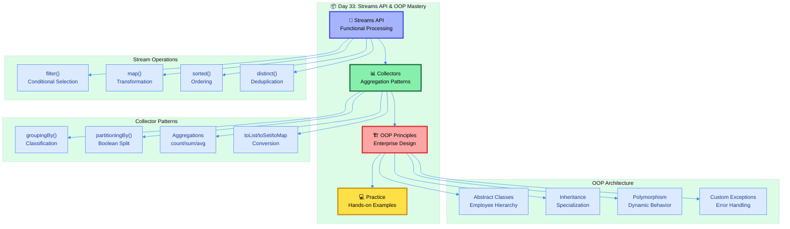
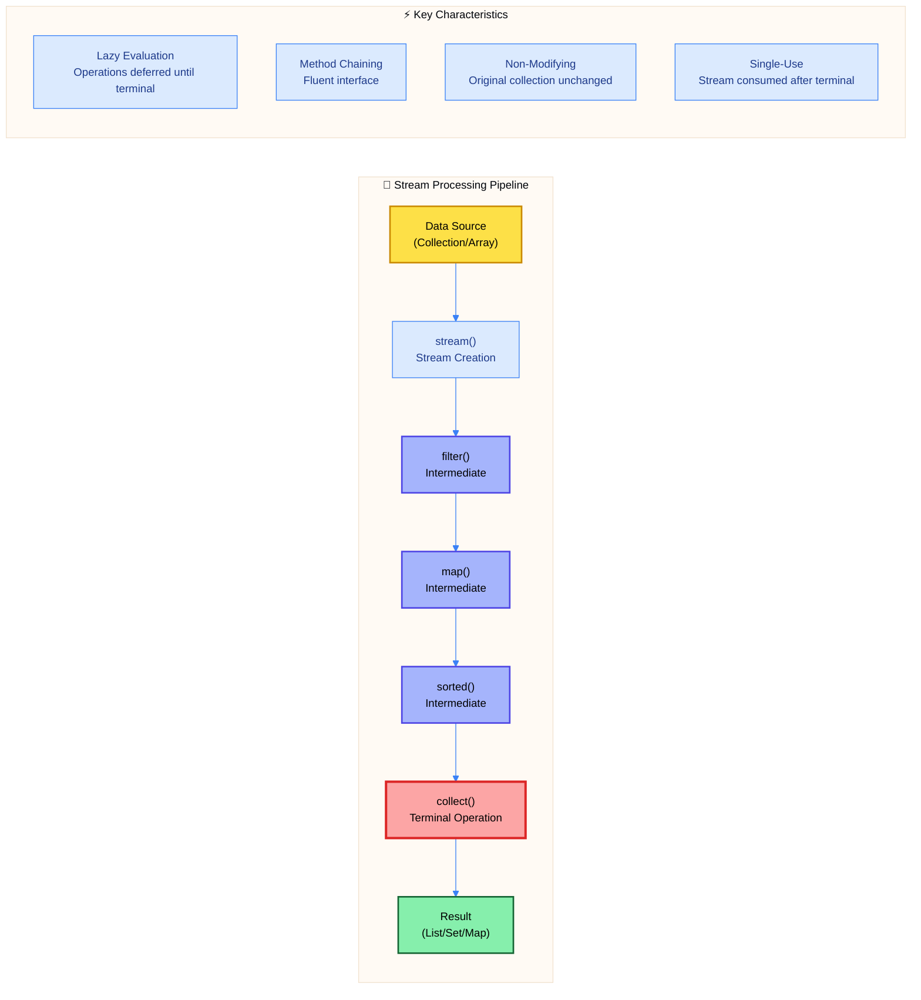
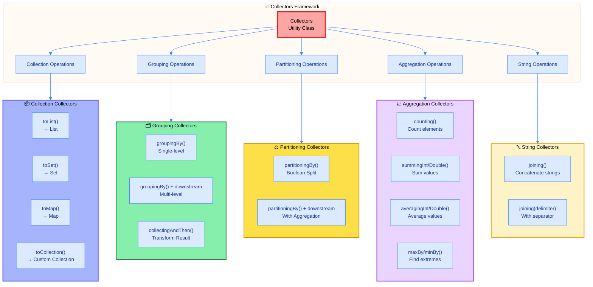
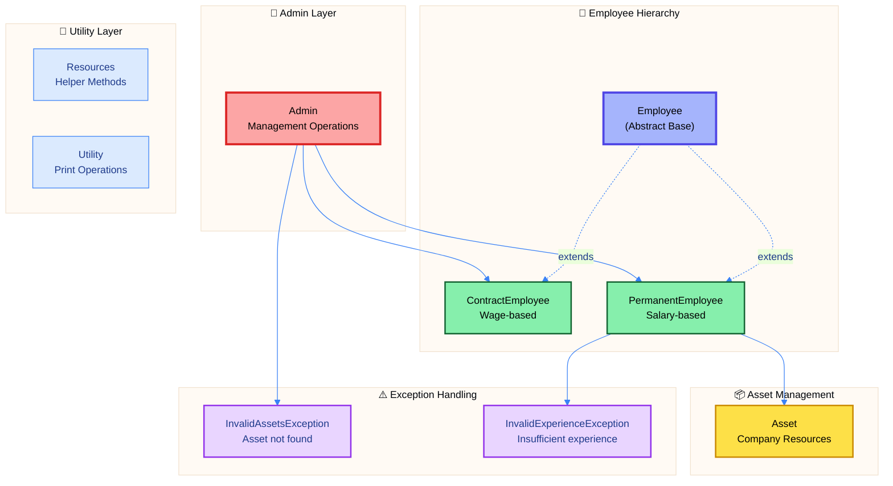
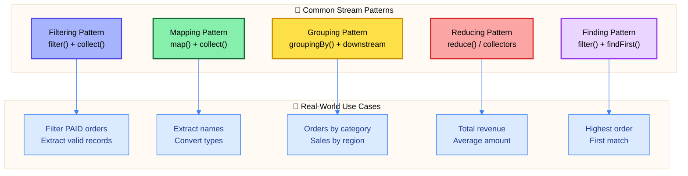

# ☕ Day 33: Java Streams API & Employee Management System

<table>
<tr>
<td align="center">
 

<h3>© 2026 Avinash Dhanuka</h3>

Master Guide: Java Core & Frameworks

<em>Crafted with ❤️ for Functional Programming & OOP</em>

 
 
</td>
</tr>
</table>

> **Day 33 Overview:** This comprehensive session explores functional-style collection processing with Java 8 Streams API and demonstrates enterprise-level OOP principles through a complete Employee Management System. Master stream operations, collector patterns, and real-world application architecture.

---

## 📚 What is Day 33 About?

Day 33 focuses on **functional programming paradigms** in Java through the Streams API, enabling declarative collection processing with operations like `filter()`, `map()`, `collect()`, and advanced aggregations. The session also implements a comprehensive **Employee Management System** showcasing inheritance, polymorphism, abstraction, encapsulation, and custom exception handling.

### 🎯 Learning Objectives

---

## 📑 Table of Contents

1. [Streams API Fundamentals](#1-streams-api-fundamentals)
2. [Collectors Framework](#2-collectors-framework)
3. [Employee Management System](#3-employee-management-system)
4. [Practice Examples](#4-practice-examples)
5. [Performance & Best Practices](#5-performance--best-practices)

<em>Comprehensive notes by Avinash Dhanuka | For educational purposes</em>

---

## 1. STREAMS API FUNDAMENTALS

### 📌 Definition
**Streams API** enables functional-style operations on collections, providing declarative data processing with lazy evaluation, pipeline composition, and internal iteration for cleaner, more maintainable code.

### 🏗️ Stream Pipeline Architecture

### 📋 Core Stream Operations

| Category | Operations | Purpose | Returns Stream? |
| :--- | :--- | :--- | :---: |
| **Intermediate** | `filter()`, `map()`, `sorted()`, `distinct()`, `limit()`, `skip()` | Transform/filter data | ✅ Yes |
| **Terminal** | `collect()`, `forEach()`, `count()`, `reduce()`, `findFirst()`, `anyMatch()` | Produce result | ❌ No |
| **Short-Circuit** | `findFirst()`, `findAny()`, `anyMatch()`, `allMatch()`, `noneMatch()` | Early termination | ❌ No |

### 🎯 Stream Operations Coverage

| Operation | Description | Use Case |
| :--- | :--- | :--- |
| **filter()** | Selects elements matching predicate | Extract PAID orders, even numbers |
| **map()** | Transforms elements to new form | Extract customer names, convert types |
| **sorted()** | Orders elements by comparator | Sort by amount, alphabetically |
| **distinct()** | Removes duplicates | Unique customer names |
| **skip()** | Skips first n elements | Find nth highest element |
| **limit()** | Limits stream to n elements | Top 10 results |
| **flatMap()** | Flattens nested structures | Flatten lists of lists |
| **forEach()** | Iterates and performs action | Print, logging |
| **collect()** | Accumulates to collection | toList, toSet, toMap |
| **reduce()** | Reduces to single value | Sum, concatenation |

---

## 2. COLLECTORS FRAMEWORK

### 📌 Definition
**Collectors** provide mutable reduction operations, accumulating stream elements into collections, grouping, partitioning, and performing aggregations like counting, summing, and averaging.

### 🎨 Collectors Hierarchy

### 📋 Collectors Reference

| Collector | Returns | Description | Example Use Case |
| :--- | :--- | :--- | :--- |
| **toList()** | List | Accumulate to List | Convert stream to list |
| **toSet()** | Set | Accumulate to Set | Unique elements |
| **toMap()** | Map | Accumulate to Map | ID to Name mapping |
| **groupingBy()** | Map<K, List<V>> | Group by classifier | Orders by category |
| **partitioningBy()** | Map<Boolean, List<V>> | Split by predicate | PAID vs NOT PAID |
| **counting()** | Long | Count elements | Total orders count |
| **summingDouble()** | Double | Sum numeric values | Total revenue |
| **averagingDouble()** | Double | Average numeric values | Average order amount |
| **maxBy()** | Optional<T> | Find maximum | Highest order |
| **minBy()** | Optional<T> | Find minimum | Lowest order |
| **joining()** | String | Concatenate strings | Join customer names |

### 🎯 Advanced Collector Patterns

| Pattern | Description | Returns |
| :--- | :--- | :--- |
| **Single-Level Grouping** | Group by single criterion (category, city) | Map<K, List<V>> |
| **Multi-Level Grouping** | Nested grouping (city → category) | Map<K, Map<K2, List<V>>> |
| **Grouping with Counting** | Group and count elements per group | Map<K, Long> |
| **Grouping with Summing** | Group and sum values per group | Map<K, Double> |
| **Grouping with Max/Min** | Find extreme value per group | Map<K, Optional<V>> |
| **Partitioning with Counting** | Split and count each partition | Map<Boolean, Long> |
| **Partitioning with Summing** | Split and sum each partition | Map<Boolean, Double> |

---

## 3. EMPLOYEE MANAGEMENT SYSTEM

### 📌 Definition
Comprehensive **enterprise application** demonstrating OOP principles including abstract classes, inheritance hierarchies, polymorphism, encapsulation with validation, and custom exception handling for business logic.

### 🏗️ System Architecture

### 📋 System Components

| Component | Type | Responsibility |
| :--- | :--- | :--- |
| **Employee** | Abstract Class | Base for all employees with abstract calculateSalary() |
| **ContractEmployee** | Concrete Class | Wage-per-hour calculation with deductions |
| **PermanentEmployee** | Concrete Class | Basic pay + components + bonus calculation |
| **Asset** | Model Class | Company asset with validation (DSK/LTP/IPH formats) |
| **Admin** | Service Class | Salary generation, asset reporting |
| **InvalidAssetsException** | Custom Exception | No assets found for criteria |
| **InvalidExperienceException** | Custom Exception | Insufficient experience for bonus |
| **Resources** | Utility Class | Month parsing and helper methods |
| **Utility** | Utility Class | Display formatting for employees/assets |

### 🎯 OOP Principles Applied

| Principle | Implementation | Benefit |
| :--- | :--- | :--- |
| **Abstraction** | Abstract Employee class with abstract methods | Define contract without implementation |
| **Encapsulation** | Private fields with public getters/setters + validation | Data hiding and integrity |
| **Inheritance** | ContractEmployee, PermanentEmployee extend Employee | Code reuse and specialization |
| **Polymorphism** | calculateSalary() with different implementations | Dynamic behavior based on type |
| **Exception Handling** | Custom exceptions for business validation | Graceful error handling |

### 🔑 Key Features

| Feature | Description | Implementation |
| :--- | :--- | :--- |
| **Auto ID Generation** | Static counters for unique IDs | _contractIdCounter, _permanentIdCounter |
| **Name Validation** | Min 2 words, capitalized, letters only | Setter validation with regex |
| **Asset ID Validation** | Format: PREFIX-XXXXXX[H/L] | Regex pattern matching |
| **Experience Bonus** | Tiered bonus based on years | 2.5-4yrs: 2550, 4-8yrs: 5000, etc. |
| **Wage Deduction** | Penalty for hours < 190 | 50% wage per missing hour |
| **Salary Components** | Percentage-based additions | DA-50, HRA-40 parsed via ListIterator |
| **Date Comparison** | Asset expiry tracking | String parsing (yyyy-Mon-dd) |
| **Asset Reporting** | Filter by date or category | Exception-based validation |

---

## 4. PRACTICE EXAMPLES

### 📌 Definition
Hands-on examples demonstrating stream operations, filtering patterns, transformation techniques, and frequency analysis for practical skill development.

### 📋 Practice Files Overview

| File | Focus | Operations Covered |
| :--- | :--- | :--- |
| **ArrayList1.java** | Basic Stream Operations | Creating streams, basic filtering, counting |
| **ConvertToUpperCase.java** | String Transformation | map() with toUpperCase(), method references |
| **CountGreaterNumber.java** | Threshold Filtering | filter() with numeric predicates, count() |
| **FilterUsingStream.java** | Complex Filtering | Multi-condition predicates, lambda expressions |
| **FrequencyOfNumber.java** | Frequency Analysis | groupingBy() with counting() for occurrences |
| **EmployeNameHashMap.java** | HashMap Integration | Stream operations on HashMap, value filtering |

### 🎯 Ecommerce Example Coverage

Day 33 includes a comprehensive **Ecommerce.java** file with **12 major sections** covering complete stream operations:

| Section | Topic | Operations |
| :---: | :--- | :--- |
| **1** | Filter PAID Orders | filter() with status predicate |
| **2** | Extract Customer Names | map() with method reference |
| **3** | Calculate Total Revenue | filter() + mapToDouble() + sum() |
| **4** | Sort by Amount | sorted() with Comparator.reverseOrder() |
| **5** | Distinct Customer Names | distinct() with forEach, toList, toSet |
| **6** | Second Highest Order | sorted() + skip() + findFirst() (5 approaches) |
| **7** | Collectors Operations | toList, toSet, toMap, joining, counting, summing, averaging, maxBy, minBy, partitioning |
| **8** | GroupingBy Operations | Single-level, with counting, with summing, with maxBy |
| **9** | PartitioningBy Operations | Boolean split, with counting, with summing, with maxBy, with mapping |
| **10** | Advanced Operations | Multi-level grouping, top per category, flattening, highest revenue city |
| **11** | Additional Patterns | Category grouping, count per category, sales per category, max per category |
| **12** | Practical Examples | Name length filtering, word frequency, even/odd partitioning, map value summing |

---

## 5. PERFORMANCE & BEST PRACTICES

### 📊 Stream vs Traditional Approach

| Aspect | Traditional Loop | Streams API |
| :--- | :--- | :--- |
| **Paradigm** | Imperative (how) | Declarative (what) |
| **Readability** | More verbose | More concise |
| **Parallelization** | Manual thread management | `.parallelStream()` auto |
| **Composition** | Difficult to chain | Natural pipeline |
| **Lazy Evaluation** | Immediate | Deferred until terminal |
| **Debugging** | Easier breakpoints | Requires stream debugging |

### ⚡ Performance Considerations

| Scenario | Recommendation | Reason |
| :--- | :--- | :--- |
| **Small Collections** | Traditional loops | Lower overhead |
| **Large Collections** | Streams with parallel | Better performance |
| **Simple Iterations** | forEach loop | Simpler and faster |
| **Complex Transformations** | Streams pipeline | Better composition |
| **One-time Processing** | Streams | Clean and readable |
| **Multiple Passes** | Traditional or collect once | Avoid stream recreation |

### 🎯 Best Practices

| Practice | Description | Benefit |
| :--- | :--- | :--- |
| **Avoid Side Effects** | Don't modify external state in lambdas | Thread-safe, predictable |
| **Use Method References** | `Order::getCustomerName` over `o -> o.getCustomerName()` | Cleaner, more readable |
| **Chain Wisely** | Limit intermediate operations | Better performance |
| **Prefer Terminal Operations** | collect() over forEach() when building collections | Type-safe results |
| **Use Appropriate Collectors** | toSet() for unique, groupingBy() for classification | Optimal data structures |
| **Handle Optional** | Use ifPresent(), orElse() properly | Avoid NullPointerException |
| **Parallel Carefully** | Use only for CPU-intensive, independent operations | Avoid overhead |

### 🔍 Common Patterns

---

## 📚 Summary

### 🎯 Day 33 Topics Covered

| Category | Topics |
| :--- | :--- |
| **Streams API** | filter, map, sorted, distinct, skip, limit, flatMap, forEach, collect, reduce |
| **Collectors** | toList, toSet, toMap, groupingBy, partitioningBy, counting, summing, averaging, maxBy, minBy, joining |
| **OOP Principles** | Abstraction, Encapsulation, Inheritance, Polymorphism, Exception Handling |
| **Design Patterns** | Abstract Factory (Employee creation), Template Method (calculateSalary) |
| **Advanced Concepts** | Lambda expressions, Method references, Optional handling, Stream pipelines |
| **Real-World Application** | Employee management, Asset tracking, Salary calculation, Exception validation |

### 🏆 Key Takeaways

1. **Streams enable declarative programming** - Focus on what to do, not how
2. **Collectors provide powerful aggregations** - Group, partition, and reduce data
3. **OOP principles enhance maintainability** - Abstract classes, inheritance, polymorphism
4. **Custom exceptions improve error handling** - Business-specific validation
5. **Practice files demonstrate patterns** - Hands-on learning with real examples
6. **Pipeline composition is powerful** - Chain operations for complex transformations
7. **Performance matters** - Choose streams vs loops based on context
8. **Validation ensures data integrity** - Setter validation, format checking

### 📖 Files Included

| File | Purpose |
| :--- | :--- |
| **Ecommerce.java** | Comprehensive streams operations (12 sections) |
| **Order.java** | Model class for e-commerce orders |
| **EmployeeManagement.java** | Complete OOP demonstration with employee hierarchy |
| **Practice/** | 6 hands-on examples for skill development |
| **reference.md** | Detailed Collections Framework guide (TreeSet, HashMap, LinkedHashMap, TreeMap) |
| **GitCommand.txt** | Git workflow for version control |

---

### 🎯 Master These Concepts

**Streams API** → Functional-style collection processing  
**Collectors Framework** → Powerful aggregation patterns  
**OOP Principles** → Enterprise application architecture  
**Best Practices** → Performance and maintainability

---

**© 2026 Avinash Dhanuka** | Java Streams API & OOP Master Guide

📧 [avunashdhanuka@gmail.com](mailto:avunashdhanuka@gmail.com) | 🔗 [GitHub: Avinash-706](https://github.com/Avinash-706)

